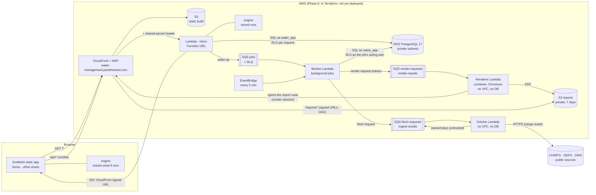
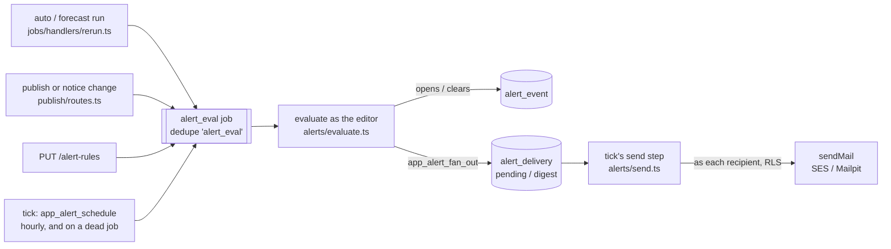

# Architecture

A web app for daily catchment water-balance modelling. It replaces the client's
**Water Balance Tool b023** Excel workbook ([model.md](./model.md)). Each
**project** is one catchment. Users keep as many projects as they need and
share each one with per-project roles.

## System



Locally the same pieces run as `vite dev` on `:7777`, a Node server
(`@hono/node-server`) on `:3001`, and Postgres 17 in docker on `:5434`
(plus Mailpit, which catches all email, and MinIO, which holds report PDFs;
the background-job worker is an opt-in Node process, `pnpm dev:run:worker`,
polling the same Postgres and rendering reports in the local Chromium, and
data feeds read synthetic fixture files, never the internet). The
browser calls the backend directly on `:3001` (CORS with credentials). In
production, CloudFront serves the site and **proxies `/api/*` from the same
origin**, so the session cookie is first-party.

## Workspaces

| Path | Package | What it is |
| --- | --- | --- |
| `packages/engine` | `@water-management/engine` | **The model.** Pure TypeScript with no I/O, no DB and no DOM. `runModel(ModelInput): ModelOutput`, plus the shared types (`project.ts`) for projects, model data, series and run outputs. Imported as source by both apps. Subpath exports: `/calendar` (only the pure date helpers, `src/calendar.ts`, for code that must not pull in the model, such as the fetcher Lambda) and `/testing`. |
| `backend` | `@water-management/backend` | Hono API: auth (incl. password reset, email verification, invites — email via `src/mail/`: Mailpit locally, SES in prod), projects, teams, members, the model document, series, runs, run comparison and CSV/JSON export. `src/app.ts` builds the app; `server.ts` (local, loads dotenv) and `lambda.ts` (AWS) are the entry points. esbuild bundles `lambda.ts` into `dist/lambda.mjs`. A third entry, `lambda-migrate.ts`, is the production migrate Lambda: it sets up `water_app` and applies the migrations as the schema owner. `src/jobs/` is the background job queue ([§ Background work](#background-work)); its entries are `jobs/worker.ts` (local, loads dotenv) and `lambda-worker.ts` (AWS). In Lambda, the API, worker and migrate entry points first read their secrets (session key, `DATABASE_URL`, …) from their own Secrets Manager secret, once per cold start, never from environment variables (`src/config/runtimeSecrets.ts`, [security.md § Runtime secrets](./security.md#runtime-secrets)); locally they come from `.env.development`. |
| `backend/migrations` | none | Plain SQL migrations, applied by `backend/scripts/migrate.ts`. |
| `frontend` | `@water-management/frontend` | SvelteKit 5 as an SPA: `adapter-static` with a fallback `index.html`, `ssr = false`, `prerender = false`. Served as static files, and all data comes from the API. CloudFront serves `index.html` for extension-less paths so deep links work (`spa_rewrite`; a missing file gets a 404 page, infra/README.md). A client navigation commits only once the new page's stylesheets have loaded (root layout `onNavigate`, `lib/nav/stylesheets.ts`), since SvelteKit + Vite can otherwise render it before its CSS. The root layout frames a signed-in person's pages in `lib/components/layout/AppShell.svelte` (a sidebar from 900 px, a slim bar on phones; a page adds its own navigation through `layout/sidebar.svelte.ts`); the farmer view and the sign-in pages have their own frames ([ui.md § App shell](./ui.md#app-shell-and-account-menu)). |
| `e2e` | none | Playwright specs. They run locally against their own `water_e2e` DB and servers on `:3101`/`:7801` (a worktree gets its own slot: `e2e/support/env.ts`); CI runs them as 14 shards. |
| `scripts/wbt-import` | none (Python 3.14 + openpyxl) | Reads a b023 `.xlsm` into `project.json` and regression fixtures, written under `data/` (gitignored). |
| `infra` | none | Terraform: S3, CloudFront, WAF, security headers, the API Lambda + Function URL, the migrate Lambda and the job worker Lambda (all in a VPC; the worker's SQS queue, DLQ and 5-minute schedule in `jobs.tf`), RDS PostgreSQL 17 in private subnets, SES, ACM, Route 53, budget and alarms. Written and tested plan-only; not applied yet ([deployment.md](./deployment.md)). |

## Why one engine in two places

The same `runModel` runs:

- **in the browser**, for instant feedback while editing (a full run of a multi-decade,
  multi-farm catchment takes milliseconds). Nothing is saved. Automatic
  calibration (`engine/src/calibrate`) runs there too, in a Web Worker
  (`frontend/src/lib/calibration/autocal.worker.ts`): about a minute of model
  runs on the input from `GET /projects/:id/model-input`, with the unsaved
  Settings form in place of the saved settings. It fills the form and never
  saves. The uncertainty ensemble (issue #4 phase 9, [model.md §2.10e](./model.md#210e-uncertainty-bands-engine--0260-issue-4-phase-9))
  runs in the same worker: hundreds of full `runModel`s on a run's own input
  (`GET …/runs/:runId/model-input`), with options the server resolved and a
  seed the database drew; the server re-runs a few members before storing
  the result (`POST …/uncertainty/:uid/result`). The Yield panel's instant
  preview (issue #73) runs one firm-yield search in the preview worker
  (`frontend/src/lib/preview/engine.worker.ts`, WP-1.17's worker) on a run's
  own input, never stored; the `yield` job's result is the stored one
  ([ui.md § Yield](./ui.md#yield-wp-36)).
  **Preview** on Settings and the model save bar (issue #284) runs the model
  in the same worker twice, on the last run's own input and on it with the
  unsaved edits laid over it (`lib/preview/overlay.ts`), and shows the
  difference; nothing is stored ([ui.md § Project workspace](./ui.md#project-workspace)).
- **in the backend**, for `POST /projects/:id/runs`. The backend loads the
  project as `water_app`, runs the engine, and stores the input snapshot,
  summary and output series, and the input series themselves, once per
  distinct content per project (`series_blob`, 021). Stored runs are what
  users share and compare. `loadRunInput(db, runId)`
  (`backend/src/runs/execute.ts`) rebuilds a stored run's exact input, so a
  run can be recomputed later whatever happened to the live project since:
  the base a scenario applies its overrides to (roadmap WP-3.2), and the
  input the uncertainty ensemble runs on. Runs saved before 020 kept only
  hashes of their series and can't be rebuilt that way
  ([data-model.md § Stored run inputs](./data-model.md#stored-run-inputs-021_series_blobsql)).

Because the engine is pure and deterministic, there is only one implementation
to test (invariant tests, plus the client catchment regression suite with its
documented departures from the workbook, [engine-audit.md](./engine-audit.md)),
and the browser and the stored result can never drift apart. Every run records `ENGINE_VERSION`.

## Code splitting (frontend)

SvelteKit already gives every route its own chunk. The catchment workspace
(`routes/projects/[id]`) is split further, because it carries most of the app:
only the Overview tab (the default view) ships in the route's chunk, and each
other tab (Network, Crops & demand, Transfers, Data, Settings & calibration,
River & reserve, Hydrological units, Runs & results, Scenarios, History, Map) is a dynamic `import()` of its component, as are the two
on-demand dialogs (Add data, and the Data tab's series preview) and the two
Reserve rule-table panels (engine ≥ 0.21.0: the Settings editor, loaded once
the project has a table, and River & reserve's compliance panel, loaded for a
run that has a report), and the Runs & results human-impact tables (engine ≥ 0.22.0:
`runs/HumanImpactTables.svelte`, loaded for a run with land cover, boreholes or other
water users). The Map tab loads its map component as one more chunk, and that loads MapLibre (and the PMTiles reader, with a basemap) only when the map is drawn, measured against a ceiling of their own (issue #288, [maps.md § CSP and bundle](./maps.md#csp-and-bundle)). Inside the Overview, the flow chart,
Supply by farm and the owner's Share links panel are their own chunks too, so
the route's chunk stays under its 42 KB budget (the Share links split made
room for the section header, issue #17). The compare page loads its daily overlay and, only when a side
is a scenario run, its Scenario overrides section the same way. The project list's empty state loads
the example catchment it can start from (`projects/example.ts`, ~25 KB gzip of
invented rainfall and flow, issue #286) only on hover, focus or press of
**Start from an example**. uPlot and the
engine code the tabs use land in shared chunks that load with the first tab
that needs them.

- `lib/components/common/lazy.ts` memoises each loader, so a hover prefetch,
  the render and a later remount share one request, and a remount renders at
  once. A failed import isn't kept, so a later call runs the loader again,
  but that almost never helps (below).
- `lib/components/common/Lazy.svelte` renders the standard `LoadState` while
  the chunk loads, then the component through a typed snippet, so the tab's
  props are still type-checked. A failed download renders `ChunkFailed`.
- **A chunk that fails to download offers a reload, never "Try again"**
  (`common/ChunkFailed.svelte`, the chosen behaviour since 2026-09-26). A
  browser records a module script that failed to fetch in the page's module
  map and fails every later `import()` of that URL at once, for the life of
  the page (checked in Chromium), so re-running the import can't recover. A
  cache-busting retry can't either: the URL is the hashed file name Vite
  compiled into the loader, the chunk's own imports keep theirs, and after a
  deploy the old files are gone. Only a reload, which fetches the current
  `index.html` and its chunk names, gets a working copy. The message says
  what failed and offers **Reload page**; nothing reloads by itself, so a
  chunk that is really gone can't cause a reload loop. With unsaved changes
  the message says so ("save them first, or the browser will ask before the
  reload discards them"): the reload is a plain `location.reload()`, which
  meets the leave guard's reload prompt (`lib/nav/leaveGuard.ts`: the
  browser's own box, the one place it shows), so nothing is dropped
  without it. A page reports unsaved changes to it with
  `provideUnsaved()` (`common/chunkFailed.ts`, a Svelte context; nested
  providers combine): the workspace page gives its model editor's and
  project details' `dirty`, a scenario's override editor its own. (In-app
  navigation away from unsaved work is the leave guard's, registered
  separately with `guardUnsaved`, `lib/nav/unsaved.ts`; docs/ui.md
  § Leaving with unsaved changes.) Users: `Lazy`, the project list's
  import dialog, the workbook reader in that dialog, Overview's alert email
  settings, the printable report's human-impact tables (it waits for them
  before it is ready), the run's workbook download (the alert sits below
  the Download menu), the account's data download, the verify-email banner
  (said in the banner's place, since an unconfirmed address holds back
  pending invitations) and the root layout's language catalogue. On a
  translated page the wording is the page's: `ChunkFailed` takes `text` and
  `reload` already worded with `t()` (the account page), or the layout words
  `msg()` messages through the i18n module when the page loaded it (the
  banner's failure; English on the workspace). `ChunkFailed` itself stays
  off the i18n module, so the workspace never loads it.
  `e2e/tests/lazy-chunk.spec.ts` blocks each chunk and pins the message, the
  prompt with unsaved edits, and the recovery by reload.
- The open tab's chunk starts downloading alongside the project data, and a
  tab link warms its chunk on hover or focus, so switching tabs rarely shows
  the loading state.

The project list (`routes/+page.svelte`) loads its import dialog
(`components/import/ImportProjectDialog.svelte`, with the preview, the
workbook review and the engine's series provenance and kinds code they use:
18 KB gzip) the same way, without `Lazy`: hovering or focusing either import
button warms the chunk, and a press opens the dialog as soon as it is there,
with no loading state (the button keeps focus, so Escape returns to it). If
the download fails the page says so and offers a reload (`ChunkFailed`,
above). Home's first
load fell 81.5 → 65.5 KB gzip (2026-09-26); the total rose 2 KB (889.4 →
891.5), the cost of the extra chunks. `components/import/homeSplit.test.ts`
fails if the page, or anything it imports statically, reaches the import
components or the spreadsheet code again.

Help tooltips (`components/help/HelpTip.svelte`) don't import the help text
either. The text is three modules, each its own chunk: `lib/help/tips.ts`
(each entry's term, short text, units and field keys: 10 KB gzip),
`lib/help/articles.ts` (the fuller text, other names, related ids and source,
by id: 32 KB with `content.ts`, which joins them for the /help pages) and
`lib/help/farmer.ts` (the farm view's words, whole: 2 KB). The first HelpTip
starts fetching the tips when its module loads, off the page's critical path,
and every HelpTip shares them; until they arrive a tip renders nothing, as it
does for an unknown key. A tip never loads the long text (it was one 42 KB
chunk, the largest page chunk, until 2026-09-26), and /farm/words loads only
`farmer.ts`; only the /help pages load everything. `lib/help/content.test.ts`
keeps HelpTip off `content.ts` and `articles.ts` and the text modules free of
run-time imports. Splitting costs ~3 KB of total (smaller chunks compress
worse), the price of a tip fetching 10 KB instead of 42.

The farmer pages' words ship with the code that shows them (issue #9, WP-2.5;
[ui.md § Language](./ui.md#language)). Each message is its English, written
at its call (`t('Your dam')`), so there is no English catalogue: it was one
11 KB gzip chunk that every translated route (sign-in, account, farm, `/share`)
downloaded whole, with each key written twice (in the catalogue and at the
call). Now a route carries only its own words: first loads measured 6–9 KB
lighter (farm page 97.9 → 91.8 KB, farm list 79.4 → 71.5, sign-in 71.5 →
63.0, account 71.6 → 63.8, `/share` 74.3 → 65.7, sign-up 74.3 → 66.3). The
total barely moves (969.8 → 968.4 KB): the keys are gone, but the English
now compresses in many small chunks instead of one. The message code
(`lib/i18n/locale.svelte.ts`, 1.3 KB) still loads only on the translated
routes, and the Afrikaans catalogue only for someone who picks it; the list
of every message id (`messages/ids.generated.ts`) is read only under
`import.meta.env.DEV`, so the build keeps just its count.

The build targets ES2022 (`frontend/vite.config.ts`). Vite's default target
down-levels class fields, which Svelte 5 uses throughout, into helper code (~6 KB
across the bundle). The app already needs newer browsers than ES2022 does
(HelpTip's popover needs Chrome 114, Safari 17, Firefox 125).

Svelte's runtime is one chunk of its own (`svelteRuntimeChunk`, the page
build's `manualChunks` in `frontend/vite.config.ts`). Left to Rollup, the
runtime was cut into ~15 chunks by which pages use which piece (snippets,
`bind:this`, `<svelte:head>`, stores), several under 0.5 KB gzip, with its
largest part merged into an app chunk, and every component chunk imported
runtime names from several of them. As one chunk (21.5 KB gzip, importing
nothing) the total dropped 12 KB and every page's first load 3–6 KB, although
a page now also loads the few runtime pieces it doesn't use.
`src/lib/svelteRuntimeChunk.test.ts` keeps the rule in place.

Each dynamic import carries a preload list (Vite's `__vite__mapDeps`): the
chunks and CSS the loaded chunk needs, fetched in parallel with it. Vite lists
the loaded chunk's whole static import tree, most of which (the Svelte
runtime, the API client, shared UI) the importing chunk already imports
statically and so has loaded before its code runs. `preloadDedupe`
(`build.modulePreload.resolveDependencies` in `frontend/vite.config.ts`)
drops those entries; every CSS file and every chunk not yet loaded stays, so
nothing loads later or in a different order. −2.3 KB gzip across the bundle;
`src/lib/preloadDedupe.test.ts` pins the rule.

Svelte scopes each component's styles with a class on its elements. The
default is `svelte-<hash>`; `frontend/svelte.config.js` sets `cssHash` to
`s<hash>` (the same hash of the file name), which appears thousands of times
in the compiled templates and CSS: −2.6 KB gzip across the bundle and a little
off every first load. `src/lib/cssHash.test.ts` computes every component's
class the way the build does and fails if one equals a class the app writes
itself (`small`, `steps`…), or two components share one.

Output file names are short (`shortFileNames` in `frontend/vite.config.ts`):
7-character hashes instead of Rollup's 8 (the least it accepts below 4 096
chunks), and CSS files named by their hash alone, like SvelteKit's JS chunks
(`DaDhZLr.css`, not `LoadState.DaDhZLrP.css`). The names are repeated in
import statements, preload lists and the route manifest, where random
characters compress badly: −2.7 KB gzip. Everything under `_app/immutable/`
is still content-hashed, so the deploy's year-long caching is unchanged;
`src/lib/shortFileNames.test.ts` pins the patterns.

The calibration worker (`lib/calibration/autocal.worker.ts`) is part of the
page build, so the engine ships once (issue #9). Vite builds a
`new Worker(new URL(…))` as a bundle of its own, which carried its own copy of
the engine (62 KB gzip), most of which the pages load too. Instead,
`lib/calibration/runner.ts` takes the worker's URL from a virtual module,
`virtual:autocal-worker-url`, and `workerChunks` in
`frontend/vite.config.ts` emits the worker as one more entry of the client
build (`_app/immutable/workers/autocal.worker-<hash>.js`). Rollup then puts the
engine code the worker shares with pages in shared chunks, which the worker
imports as ES modules (it is a module worker, same-origin, so the CSP's
`worker-src 'self'` and `script-src 'self'` cover it). In dev the virtual
module returns Vite's own worker URL for the source file. The worker's file
holds only what no page runs (the run, the fit, the ensemble: 33 KB); starting
a fit from Settings fetches 45 KB of worker code where it used to fetch 62, and
the total bundle dropped 919 → 899 KB.

The preview worker (`lib/preview/engine.worker.ts`, roadmap WP-1.17: the
Yield panel's in-browser firm yield, issue #73, and the Preview of unsaved
edits against the last run, issue #284) is a second entry of the
page build in the same way (`virtual:preview-worker-url`, one `workerChunks`
plugin for both, `_app/immutable/workers/preview.worker-<hash>.js`). The
network run code both workers use then sits in a chunk of its own that only
the workers load, so the calibration worker's own file is 17 KB and the
preview worker's 4.3 KB (the yield search, and the read of two runs for the
unsaved-edits preview, which deliberately doesn't import `compareRuns`:
that module would put a second copy of every run comparison in a chunk of
its own). Its runner
(`lib/preview/runner.ts`) is a dynamic import of the panel, and only the
worker imports `lib/preview/compute.ts`, the module that calls the engine
(`compute.test.ts` scans for other importers). One request at a time, latest
wins: a newer one terminates the worker mid-search, since the engine loop is
synchronous. The bundle guard checks both workers import from `chunks/`.
The worker treats its message as untrusted data: `compute.ts` `parseMessage`
checks it strictly before the engine sees it (known keys only; the yield
parameters in the backend's `YieldParams` ranges; each input's outline; a
scenario's ops through `validateScenarioOps`), and answers a malformed
request with an error carrying its id.

That only pays because a chunk holds whole modules. A module a page and the
worker both use carries everything either of them calls, with its imports, so
the small things pages read must not live beside the run, fit or ensemble code.
They have modules of their own: `version.ts` (`ENGINE_VERSION`), `prepare.ts`
(`prepareRun`: settings, run window and aligned inputs, for the Data tab's
series preview), `calibrate/params.ts` (`CALIBRATION_PARAMS`, bounds, starts),
`calibrate/objectives.ts` (objective ids and labels), `runoff/params.ts` (the
GR4J parameter table; the legacy one went with that model in engine 1.0.0), `runoff/pet.ts`
(`hasPotentialEvaporation`), `reference/wr2012Settings.ts` (the WR2012
settings, defaults and checks; `wr2012Resolve.ts` is the run's merge),
`uncertainty/options.ts` (ensemble options, labels and their diff),
`network/damCurve.ts` (the survey-curve check), and `waterYearOf` /
`waterYearLabel` in `calendar.ts`. Without the split, sharing grew the Runs tab
by 27 KB and compare by 32 KB; with it, compare's first load is 22 KB lighter
and a catchment on Runs 7 KB lighter. `frontend/src/lib/engineSplit.test.ts`
fails if one of those modules reaches the model code through a value import,
and the bundle guard fails if the worker stops importing from `chunks/`. The
cost: the Data tab loads the engine code it shares with the worker as several
small chunks, which compress worse (+2.7 KB, +4.3 KB with the series preview
open).

Rollup treats the engine as side-effect free (`treeshake.moduleSideEffects`
in `frontend/vite.config.ts`). Otherwise every engine module a page reaches
through the `@water-management/engine` barrel counts as a dependency of that
page even when the page calls nothing in it, and engine code lands in chunks
by those phantom edges (the farm and share pages carried ~13 KB of it). The
engine has no module that does anything when it loads, and
`frontend/src/lib/engineSideEffects.test.ts` keeps it that way: it fails on
any top-level statement in `packages/engine/src` other than a declaration.
The spreadsheet workers are Rollup builds of their own that don't read
`build.rollupOptions`, so the same rule is set again under `worker` (the
import worker kept scenario-op and fit-provenance code it never calls without
it); the same test checks both.

The `.xlsx` run export has a worker of its own
(`lib/spreadsheet/export/export.worker.ts`, 19 KB gzip), so the workbook
code never lands in a page chunk. Nothing on a page imports it. The Download
menu's "Workbook (.xlsx)" item dynamically imports a 0.5 KB runner
(`lib/spreadsheet/export/runner.ts`), which starts the worker with
`new Worker(new URL('./export.worker.ts', import.meta.url), { type: 'module' })`:
a same-origin script, so the CSP's `worker-src 'self'` allows it (no `blob:`
workers; `infra/scripts/check-csp.mjs` passes on the build). The worker does
the fetching (one bulk request per node, [api.md § Bulk run
series](./api.md#bulk-run-series)) and the building, posts progress per node,
and transfers the finished file back; Cancel terminates it. The parts are
written by `writer.ts`, the OOXML SheetJS CE 0.20.3 wrote for this workbook,
byte for byte, without SheetJS (issue #9: the worker was 88 KB gzip with its
mini build, 10.5 KB then). The run export only ever wrote text cells, numeric
cells with a number format, and column widths, so the parts are few and
fixed; `workbook.test.ts` builds each test workbook both ways (the SheetJS
path, kept as test-only `sheetjsReference.ts`) and compares the zips byte for
byte, and `writer.test.ts` fails if app code imports `xlsx` again. The same
worker builds a farm's audit workbook (issue #68) when the menu's request
carries `auditNodeId`: the engine's plan (`verify/audit.ts`) laid out by
`lib/spreadsheet/audit/`, the one workbook with formula cells, which SheetJS
never wrote, so the writer's formula cells and its `fullCalcOnLoad` flag are
pinned by `audit/auditWorkbook.test.ts` and `writer.formula.test.ts` rather
than by the byte comparison (a workbook without formulas is unchanged); the
engine's plan put the worker at 19 KB. The zip
itself is written by `zip.ts` with the browser's
`CompressionStream('deflate-raw')`, since SheetJS's own browser deflate made
files ~2.5 times larger. The bundle guard gives spreadsheet workers
(`export.worker` and the workbook import's `import.worker`) their own
ceiling, apart from the calibration worker's; neither carries a spreadsheet
library now, and the import worker is the larger.

The in-browser b023 workbook import (WP-1.31) is built the same way:
`lib/spreadsheet/import/import.worker.ts` (25 KB gzip) is the only code that
imports the parser and its workbook reader (`lib/spreadsheet/import/`; it
reads `.xlsm` and `.xlsx` alike). The import dialog dynamically imports a
~1 KB runner (`lib/spreadsheet/import/runner.ts`) when a workbook is picked,
which starts the worker the same way (`worker-src 'self'`) and posts it the
`File` itself, so the bytes are read in the worker, not copied from the page.
The protocol (`protocol.ts`, `messages.ts`): `parse` reads the workbook and
extracts the project, posting progress per sheet; `extract` builds the project
again with other options (the gauge as a reference) from the workbook the
worker still holds, in milliseconds; a failure comes back as a plain object
with the typed error's code and fields (the missing named ranges, sheet and
cell). `nodeCrops` reads a node-based workbook's [Crop_Factors] and
[Crop_Areas] instead (`nodeCrops.ts`, for the Load crop factors dialog):
only those two sheets are parsed, and it posts a crop set whose content
problems are warnings, not failures. Cancel, closing the dialog and a
finished import terminate the worker.
The reader is the import's own, not SheetJS: `zip.ts` inflates only the
parts the importer reads, with the browser's
`DecompressionStream('deflate-raw')` and hard caps ([security.md § Input
handling](./security.md#input-handling)), and streams each one through a
small XML tokenizer (`xml.ts`) into readers for the workbook and styles
(`workbookParts.ts`), the sheets (`sheet.ts`: each cell a few typed-array
slots) and the shared strings (`sharedStrings.ts`: only the ones those
sheets use). No sheet is ever held whole: on a large workbook the memory
the read adds over the file itself is about 90% lower than on SheetJS
(which built a string of each sheet's whole XML and an object per cell),
and it reads in half the time.
It reproduces the cells SheetJS gave the parser (its reference reader,
`sheetjsReference.ts`, is kept for the tests, which compare the two readers
cell by cell on the synthetic workbook, on hand-written edge cases and,
locally, on the client workbooks); where SheetJS read markup as text, the
reader departs from it, as its modules' headers say.

The trade-off: split chunks compress a little worse than one big chunk, so the
total shipped JS+CSS grows by a few percent, in exchange for a cold open of a
catchment downloading about 85 KB (gzip) instead of about 300 KB. The bundle
guard (`pnpm check:bundle`, `scripts/guards/check_web_bundle_budget.mjs`)
holds the largest single chunk down, which is what catches a tab's code
sliding back into the page chunk. Tab chunks have a higher ceiling of their
own (60 KB against 42 for pages, routes and shared chunks): a tab loads on
top of the page, only when opened, so the panels it always renders stay in
its chunk rather than paying split overhead as chunks of their own. The
guard finds the tabs from the page's `LOAD` map and the chunk map
`vite.config.ts`'s `chunkModuleMap` writes beside Vite's manifest
(`.svelte-kit/output/client/.vite/chunk-modules.json`, never shipped),
since chunk file names are bare hashes.

The client build minifies with Oxc (`build.minify: 'oxc'`, Vite 8's
default). Under Vite 5 it used Terser rather than esbuild, because Terser's
mangler reuses the same short names in every scope and gzip compresses that
~5% better (−50 KB on 2026-09-27, the guard's change log); on Vite 8 Oxc does
the same and measured 5 KB smaller than Terser (2026-09-28), so Terser is
gone. The page build and the spreadsheet workers are Rolldown builds
(`build.rolldownOptions`, `worker.rolldownOptions`); the Svelte runtime chunk
is a `codeSplitting` group, Rolldown's replacement for `manualChunks`.

## First load (frontend)

A full page load resolves the session first: the root layout asks
`GET /auth/me` and renders the route only once it has answered (a 401 sends
the visitor to `/login?next=…`, `lib/auth/session.svelte.ts`). On the
catchment page (`/projects/<id>`) the layout starts that page's own requests
(the project, its model, and its series and runs lists) in the same breath
instead of after it (`lib/workspace/firstLoad.ts`), saving one API round trip
on every load; the page takes them over when it mounts. The auth gate is
unchanged: nothing reads them until `/auth/me` has answered for a signed-in
user, and when it fails the layout drops them (a signed-out visitor's just
answer 401 into a promise nobody reads). A client navigation to a catchment
fetches as before, since the session is already known. Then Runs & results
renders its lower groups only after the hydrograph is painted
([ui.md § Runs & results](./ui.md)). Measured 2026-09-27 on a production
build, median of 9 loads of an 8-year run, time to the hydrograph's first
paint: 323 → 268 ms, and 997–1167 → 643–755 ms at 4× CPU throttling.
`auth.spec.ts` pins the request order and `runs-page.spec.ts` the paint order.

## The landing page: the prerendered routes

The app is a static SPA (`ssr = false`, `prerender = false` in
`routes/+layout.ts`): every route renders in the browser from the fallback
`index.html`. The public landing page (issue #57) is the exception.
`routes/welcome/[[lang=locale]]/+page.ts` sets `ssr = true` and `prerender = true` (as do the
legal pages, `routes/privacy` and `routes/terms`, and the methods page,
`routes/methods`: `STATIC_PATHS` in
`lib/auth/session.svelte.ts`), so the
build writes `welcome.html` with the page's HTML and its meta and Open Graph
tags in it: crawlers and link previews read it without running the app, and a
visitor sees it before any script. The landing page is written once per
language (issue #137): the optional `[[lang=locale]]` parameter (matched by
`src/params/locale.ts`: a language of the table other than English) and the
route's `entries` add `welcome/af.html`. The route's load returns the
language and its catalogue, and the page applies them as it renders, so the
prerender and the hydration are in the address's language; `hooks.server.ts`
(it runs only at build time here) rewrites `<html lang="en">` for that route
alone, since the i18n state is module-wide and the fallback `index.html`
must not inherit the last page's language. CloudFront's `spa_rewrite` function serves
`/welcome` from `welcome.html`, `/welcome/af` from `welcome/af.html` (its
`PRERENDERED` list), and `/privacy`, `/terms` and `/methods` from theirs (`infra/s3_cloudfront.tf`, guarded in
`guardrails.tftest.hcl`, and `infra/scripts/cloudfront-functions.test.mjs`
checks `PRERENDERED` against the routes and the language table, so a new
language can't 404 in production only; the e2e static server mirrors it). The absolute URLs in
its tags come from `kit.prerender.origin`: the build's `SITE_ORIGIN` (the
deploy passes `PUBLIC_SITE_URL`), else `http://localhost:7777`.

A signed-out `/` shows the same component client-side: the root layout renders
`lib/components/landing/Landing.svelte` in place of the projects page, a lazy
chunk fetched beside `/auth/me`. Serving `welcome.html` at `/` instead was
rejected: `/` is also the signed-in project list, and a prerendered landing
there would flash for every signed-in user and fail hydration. The landing
imports no workspace code, no uPlot and no engine: its figures are a small
generated module (`data.generated.ts`), made by running the engine at build
time (`pnpm gen:landing-art`).

## Shared CSS (frontend)

Styles live in two places. `frontend/src/app.css` is global and loads with
every page: the design tokens (light and dark), element defaults, and the
shared classes (`.btn`, `.field`, `.panel`, `table.data`, `.alert`,
`.badge`, `.stat`, `.muted`, `.num`, …). Everything else is a component's
own scoped `<style>`, which Svelte compiles with the component's hash class
and ships in that component's chunk.

The shared utilities at the end of `app.css` (issue #9) were scoped copies
until then: `.small` (secondary text, 0.8rem; 53 copies), `.u` (a unit in a
label or table head; 22) and `.seg`, the segmented control (a row of `.btn`
joined into one, any number of buttons; 5). Use them rather than copying
the rule into a component. A component that needs a different value keeps
its own rule, which wins because its selector carries the hash class (a
few have `.small { font-size: 0.85rem }`, and the Settings sections a `.u`
with its own size). They come after the other shared rules so they win the same
ties the scoped copies did. `e2e/tests/shared-css.spec.ts` pins their
computed styles (light, dark, phone, desktop, the report in print, the
override editor's three-button switch).

A rule moves into `app.css` only when it is identical in three or more
components *and* the move lowers the total: global CSS is on every page's
first load, so a rule only a lazy tab uses costs every other page for
nothing. Moving these three saved 1.0 KB gzip in total and 0.1–0.2 KB on
the Runs, Network, Data and Settings tabs and the report, for ~0.06 KB more
on pages that use none of them (home, sign-in, /farm, /share). Measured and left scoped:
the loading spinner (−0.3 KB total but +0.1 KB on /farm, /share and sign-in,
which never show it), `.stat dd.sub` (−0.07 KB, and three components style
their `dd.sub` differently, so a global rule would leak into them), and the
Settings sections' repeated field and table rules (their copies share one
lazy chunk, where gzip already folds them).

## Request lifecycle (backend)

1. CloudFront adds `X-CloudFront-Shared-Secret`, and the backend rejects
   requests without it (`403`; the check is off locally when the secret is
   empty).
2. App-wide middleware: CORS (only `ALLOWED_ORIGINS`, with credentials),
   Hono's CSRF check (cross-origin form posts get `403`) and a 4 MB body
   limit (`413`; `POST /projects/import` has its own 5 MB cap instead).
3. On every route except the public ones (`/health`, and the sign-in and
   emailed-link `/auth/*` routes), `requireUser` verifies the `wm_session`
   JWT (HS256, jose), checks it was issued after the user's
   `sessions_revoked_at` watermark (one `app_user` lookup by primary key, a
   single autocommit statement, `queryWithoutUser` in `db/tx.ts`: wrapping it
   in a transaction made it three round trips on every request), and sets
   `userId`. Otherwise `401`. The ingest routes (`/ingest/v1/*`, WP-2.9)
   take a per-project API key instead (`requireApiKey`, `ingest/auth.ts`):
   the key is checked in constant time and rate-limited per key, and the work
   runs in `withApiKey`, which sets `app.current_api_key_id` and no user
   ([security.md § API keys](./security.md#api-keys)).
4. Project routes open **one transaction** on a pooled `pg` connection as
   `water_app` and run `set_config('app.current_user_id', userId, true)`. Every
   query inside it is filtered by RLS ([data-model.md § Access control](./data-model.md#access-control)).
   A route that runs the engine opens two, one to read and one to store, and
   runs the engine between them with no connection held
   ([§ A model run](#a-model-run)).
5. zod validates the input. The model document is saved in one transaction
   (rows missing from a `PUT` are deleted). Tree validation runs before the
   write. `saveModel` (`model/store.ts`) is set-based: one statement clears the
   way (deletes and temporary names), then one upsert per table takes the
   whole row list as a jsonb parameter (`jsonb_populate_recordset` against the
   table's row type), so a save is at most nine statements whatever the
   model's size. `loadModel` builds the document in one statement
   (`json_agg` per table), and the history snapshots load settings and model
   together. A whole `PUT` is ~18 round trips, down from ~42 for a 3-node model
   and growing with it, because each round trip waits its turn when the API
   is busy (issue #41); `model/store.db.test.ts` pins the fixed statement count.
6. Errors map to `{ error, details? }` with 400/401/403/404/409/413/429,
   and anything unexpected to a generic 500; raw database error text never
   reaches the client ([api.md § Errors](./api.md#errors)).
7. The response is **streamed** in both runtimes (WP-1.29a, issue #283):
   the Node server writes a `ReadableStream` body as it is read, and in
   Lambda the Function URL is in `RESPONSE_STREAM` mode with the app behind
   `backend/src/http/lambdaStream.ts` (status, headers and `Set-Cookie` in
   the stream's prelude). Most routes answer one JSON chunk; the CSV
   downloads (`export/download.ts`) measure the file inside the transaction
   (`413` past 50 MB), then write it from memory after the transaction has
   ended, so no database connection waits on a slow client. A body that
   fails partway cuts the response off instead of ending it
   ([deployment.md § Response streaming](./deployment.md#response-streaming)).

## Data flow of a model run

```mermaid
sequenceDiagram
  participant B as Browser
  participant A as API (Lambda)
  participant P as Postgres
  B->>A: POST /projects/:id/runs
  A->>P: BEGIN REPEATABLE READ READ ONLY; set app.current_user_id
  A->>P: role check (editor); SELECT project, nodes, crops, areas, transfers, series (RLS)
  A->>P: COMMIT (connection back to the pool)
  A->>A: runModelChecked(input), no transaction open
  A->>P: BEGIN; set app.current_user_id
  A->>P: role check (editor) again
  A->>P: INSERT model_run (inputs snapshot, summary)
  A->>P: INSERT run_series × N (double precision[])
  A->>P: lock the project's runs; app_store_series_blob (new values only; the DB keys them), INSERT run_input_series
  A->>P: DELETE runs beyond the newest 20 (pinned, nominated and cited runs exempt; unused blobs collected)
  A->>P: COMMIT
  A-->>B: 201 { run, removedRunIds }
  B->>A: GET /runs/:runId/series?key=…&nodeId=…
  A-->>B: { startDate, values }  (one series per chart)
```

On the Runs tab the catchment flows the first charts draw (natural,
simulated, observed, EWR) are requested the moment the run's detail
arrives (`prefetchSeries`, `runs/cache.ts`), not when the charts mount:
rendering the results page takes half a second or more on a loaded machine,
and the panels further down would otherwise ask first.

### A model run

A request that runs the engine holds **no database connection while it
computes** (`runOutsideTransaction`, `backend/src/runs/execute.ts`). A long
run used to run inside the request's transaction and so pinned a pooled
connection, and with it any locks and snapshot, for the whole run (issue
#41). Now it has three steps:

1. **Read**, in a `READ ONLY` transaction at `REPEATABLE READ`
   (`withUser(…, { readOnly: true })`): the role check and the inputs. That
   is one consistent snapshot, so the settings, model and series agree with
   each other however many queries the read takes.
2. **Compute**, with no transaction open. The engine is synchronous, so a
   run still occupies the Node thread. Only the database is freed.
3. **Store**, in a new transaction: the role check again, then the run,
   its outputs and stored inputs, the trim and the read-back.

Between steps 1 and 3 the world may move:

- **The caller loses access.** Step 3 checks the role again, so a user
  removed from the project, or made a viewer, while the engine ran gets
  404/403 and nothing is stored. RLS would refuse the insert anyway; the
  check makes the answer clean.
- **The project changes.** The run stores the input read in step 1 (its
  snapshot and stored series), so its results always match its stored
  inputs and "Check reproduction" finds it identical. It is a run of the
  project as it stood when read, exactly as a run followed a moment later by
  an edit would be. The run's "What changed since this run" shows the
  edit. It is not redone, because a steady stream of feed writes could make
  a redo go on for ever, and new data queues its own re-run. One transaction
  had the same gap: nothing locked the inputs, and under READ COMMITTED each
  read could see a different moment.
- **A scenario changes** (`runScenario`, `scenarios/execute.ts`). Step 3
  takes the project's run lock (the delete and rebase routes take it too),
  reads the scenario again and refuses with `409` if its ops, base run, owned
  nodes or origin moved, or `404` if it was deleted. A new name or
  description doesn't change the result, so the run is stored under the
  scenario as it was computed.

The same split is used by `POST /projects/:id/runs`, a scenario run, an
import's run, `GET …/runs/:runId/reproduce` (read, then re-run; nothing to
store) and storing an uncertainty ensemble (`POST
…/uncertainty/:uid/result`, whose server check re-runs members; step 3 only
stores while the ensemble is still `started`, so of two posts only one
stores). `connection.db.test.ts` pins it with a pool of **one** connection
and an injected engine: another query succeeds while a run computes.

**Jobs keep the engine inside their transaction.** The `rerun`, `yield`,
`sweep` and `outlook` handlers run in the job's `withUser` transaction (`executeRun`, one
transaction). A job's writes must commit together with its `done` (see
[Background work](#background-work)), which is what makes a retry after a
crash or a lost lease store nothing twice. The worker's pool serves one job
at a time and no request, so the connection a job holds is one nobody else
is waiting for. Splitting a job would need a two-phase handler API with its
own idempotency; do that only if jobs start competing for connections.

## Background work

Work that shouldn't run inside a request, or can't fit the API Lambda's 30 s,
goes through one job queue (roadmap WP-2.8; `backend/src/jobs/`,
`016_jobs.sql`). Its consumers are `rerun` (a model run off the request
path, `POST /projects/:id/jobs`, and the automatic re-run after new data,
[§ Automatic runs](#automatic-runs)), the data feeds' `feed_fetch` /
`feed_ingest` ([§ Data feeds](#data-feeds)) and the server-side PDF's
`report_render` ([§ Server-side reports](#server-side-reports)) and the
dam yield's `yield`, the scenario sweep's `sweep`, the seasonal
outlook's `outlook`, and automated calibration's `auto_calibration` and
`uncertainty` (below); step 2's
alerts plug in as a further kind.

- **The `job` table is the source of truth in every environment**: status,
  `run_after` (delay and backoff), the dedupe key, attempts and a sanitised
  last error. A transport only wakes a worker ("look at the table now"), so a
  lost wake-up delays a job by one poll or tick and never loses it.
- **Transports** (`JOB_TRANSPORT`, `jobs/wake.ts` `wakeWorker`):
  - `inprocess`, the default: the local worker process
    (`pnpm dev:run:worker`, or `pnpm dev:full` with the app) ticks every
    `JOB_POLL_SECONDS` (15) and at once on `LISTEN job_queued`, which the
    table's insert trigger NOTIFYs at commit. Postgres only; no AWS, no
    LocalStack. `pnpm dev:jobs:tick` runs one tick and exits.
  - `memory`, for tests: the enqueueing request runs the tick inline.
  - `sqs`, production: the API sends a wake message to the `jobs` queue,
    which triggers the worker Lambda; an EventBridge schedule also ticks it
    every 5 minutes (infra/jobs.tf).
  The queue messages and the SQS sender live apart in `jobs/transport.ts`,
  which the fetcher and renderer Lambdas import: `wake.ts`'s `memory`
  transport reaches the runner, and so `pg`, every handler and the engine,
  which Lambdas without a database must not carry (`lambda-fetcher.test.ts`
  checks the fetcher's import graph; `package-lambdas.sh` refuses either
  bundle if esbuild's metafile lists a `pg` input). The feed sources and
  `series/limits.ts` take their date helpers from
  `@water-management/engine/calendar`, never the package root, so the only
  engine modules in the fetcher bundle are `calendar.ts`, the CHIRPS
  provenance constants (`/provenance`) and the DWS table reader (`/dws`,
  which imports only `calendar.ts`); the same test asserts it.
- **A tick** (`jobs/runner.ts`) deletes jobs finished more than 30 days ago,
  then claims due jobs one at a time through `app_claim_jobs` (`FOR UPDATE
  SKIP LOCKED`, a lease) and runs each. `runTick({ projectIds })` claims
  only those projects' jobs: the e2e suite's tick (`worker.ts --once
  --project <id>`), so parallel tests never run each other's jobs; the
  worker Lambda and the local loop never pass it.
- **Each job runs as its acting user**, the member who queued it (an editor,
  or for `report_render` any viewer: `023_reports.sql` widens the job insert
  policy for that one kind): the worker
  opens `withUser(acting_user_id)`, checks the user still holds the handler's
  role (and fails the job closed, dead with no retry, if not), reads and
  validates the payload under RLS, runs the handler, and records `done` via
  `app_finish_job` **in the same transaction**, so the work and its "done"
  commit together. There is no principal that bypasses RLS: only claim,
  finish, purge and the queue stats cross projects, as `SECURITY DEFINER`
  functions that never return a payload. After the jobs and the alert
  mails, each tick sends the evidence pack notices the issue and withdraw
  routes queued (`evidence/notices.ts`, as each recipient;
  [evidence-pack.md § Notices](./evidence-pack.md#notices)). Each tick also purges finished jobs
  after 30 days, settled pack notices after 30, report rows after 8, and invites 90 days past their expiry
  (`app_purge_invites`, 048).
- **Failure**: the transaction rolls back, and the failure is recorded in a new
  one. Retries back off `2^attempts` minutes; after `max_attempts` (default
  5), or on a failure no retry can fix (bad input, a lost role, no handler),
  the job is `dead` and logs `job_dead`, which alarms in production, and
  queues a job_dead alert check for the project (emailing its owners when the
  project has that alert on, [§ Alert emails](#alert-emails)). The stored error is written by us
  (`jobs/errors.ts`), never database text.
- **A worker that dies** mid-job leaves it `running` until its lease
  (`JOB_LEASE_SECONDS`, 360) runs out; the next tick claims it again. The
  lease token fences the old worker: if it wakes up and tries to finish, it
  gets nothing and rolls its work back.
- **Progress and cancel** (040_yield): a handler may call
  `progress(pct)`, which writes `job.progress` through `app_job_progress` on
  its own connection, outside the job's transaction (whose writes nobody sees
  until it commits), so `GET /jobs` shows it at once. Only the lease holder
  of a running job can write it. It answers false once someone cancelled the
  job (`app_cancel_job`, which kills a waiting job outright and flags a
  running one) or the lease was lost, and the handler then stops: dead,
  `cancelled`, its work rolled back.
- **`yield`** (WP-3.6, `jobs/handlers/yield.ts`, [api.md § Yield](./api.md#yield)):
  the engine's firm-yield search (`network/yield.ts`, model.md §2.13) on a
  saved run's stored inputs or a scenario applied to its base run, as the
  editor who queued it. Natural flow and the network plan are built once;
  a curve is one search per capacity, with `progress` between them (a
  cancel lands there). It writes one `yield_result` row and keeps the newest
  5 per run or scenario and dam. The engine is synchronous, so the job holds
  its transaction for the whole search (seconds for a firm yield, under a
  minute for a curve, [model.md §2.13](./model.md#213-firm-yield-and-storageyield-engine--0340-roadmap-wp-36)),
  well inside the 360 s lease. At most 2 pending per user.
- **`sweep`** (issue #53 R2, `jobs/handlers/sweep.ts`, [api.md § Sweeps](./api.md#sweeps),
  [scenarios.md § Sweeps](./scenarios.md#sweeps)): a base run × up to 12
  named op sets, as the editor who asked. The base run's stored input is
  rebuilt once; each member's ops are applied (`checkScenario`) and the
  engine runs, and the member stores its run summary, or its problems when
  its ops don't apply (the sweep carries on). `progress` after each member;
  no cancel (at most 12 runs, each well under a second on an example
  catchment). The sweep row and its members are written by the request in
  the same transaction as the job, and completed by the job. At most 2
  pending per user.
- **`assessment`** (roadmap WP-3.11, `jobs/handlers/assessment.ts`,
  [api.md § Assessments](./api.md#assessments),
  [scenarios.md § Cumulative impact](./scenarios.md#cumulative-impact-wp-311)):
  the baseline, each of up to 8 scenarios alone and all of them together,
  as the editor who asked, all on the current engine so every column is one
  engine's. The members' ops were copied from their scenarios when the
  assessment was written; the job checks again that they combine
  (`combineScenarios`) and stores each member's summary and the cumulative
  report (`cumulativeImpact`), or why it was refused. `progress` after each
  run; no cancel. At most 2 pending per user.
- **`auto_calibration`** (issue #153, `jobs/handlers/auto-calibration.ts`,
  [api.md § Automated calibration](./api.md#automated-calibration),
  [model.md §2.10j](./model.md)): one case (a full GR4J fit with validation)
  of a run of the calibration rules, as the editor it runs as; the job fits
  it, appends it and queues the next case's job, so no job runs longer than
  one fit (the request refuses rules estimated past 4 minutes a fit). The
  last case picks the kept fit. Queued by new data (`start: 'new_data'`,
  `app_enqueue_auto_calibration`), the first job plans the run instead, and
  the last applies the kept fit when the rules say so and are signed off. At
  most 1 pending per user.
- **`uncertainty`** (issue #153, `jobs/handlers/uncertainty.ts`): the
  server's own run of an uncertainty ensemble started on the run an applied
  automated fit made; it computes every member and stores the row once
  (nothing to verify: the server ran it). Refused when a run × the members
  would take more than 4 minutes; the browser path (Runs tab) still works.
- **`outlook`** (issue #53 R5, `jobs/handlers/outlook.ts`, [api.md § Seasonal outlooks](./api.md#seasonal-outlooks),
  [model.md §2.15](./model.md#215-seasonal-outlook-an-esp-ensemble-from-a-decision-date-issue-53-r5-engine-core)):
  a base run × a season × up to 6 demand levels over the record's analogue
  years (at most the newest 40), as the editor who asked. The base run's
  stored input is rebuilt and run once (its state and rain on this engine),
  capturing the model's state on the decision date
  (`outlookBaseAndSnapshot`, [model.md §2.16](./model.md)); then every
  level × year is one member run over the season only, from that snapshot
  (`runOutlookMember`), each stored as it finishes;
  the engine's `summariseOutlook` is the result. A member the engine
  refuses is stored as failed and the outlook carries on. At most 240
  member runs, each a season-long run, in one transaction: on the
  synthetic test catchment 12 years × 4 levels take about 35 ms of engine
  time (388 ms before snapshots); the cap keeps a long record inside the worker Lambda's 300 s. `progress`
  after each member, no cancel, at most 2 pending per user.
- **Dedupe**: at most one *pending* (queued, or failed and waiting to retry)
  job per `(project, dedupe_key)`, and a pending job isn't claimed while one
  with its key is running. That departs from the roadmap's index over
  `('queued','running')`: with that one, new data arriving *during* a re-run
  would be dropped as a duplicate of the run already reading the old data.
  Here it queues, and runs once the first finishes.

Adding a kind: write `jobs/handlers/<kind>.ts` with `defineHandler({ role,
payload, run })` (`jobs/registry.ts` documents the contract) and list it in
`jobs/handlers/index.ts`. The kind must be one of the table's CHECK list,
which already names every step-2 kind (`feed_fetch`, `feed_ingest`, `rerun`,
`alert_eval`, `report_render`).

### Automatic runs

New data runs the model by itself when a project opts in (roadmap WP-2.11;
`backend/src/series/newData.ts`, `backend/src/runs/autoRun.ts`,
`042_auto_rerun.sql`). Off by default: `settings.autoRun = { enabled,
debounceMinutes, publish }` (defaults `false`, `15`, `'never'`), set in
Settings → Automatic runs.

- **One hook for every source of new days**:
  `series/newData.ts` `onSeriesDaysChanged(db, projectId, { seriesId, kind,
  name, daysChanged, via })`. A person's merge or whole-series replace
  (`via: 'user'`), a data feed's merge or its confirmed replacement swapping in
  (`'feed'`) and an API key's ingest (`'api_key'`, WP-2.9) call it inside the
  write's transaction, only when days changed, so an idempotent re-send
  queues nothing. It returns when the re-run is due (ISO), or null when the
  project has automatic runs off: the `rerunQueuedFor` the merge routes
  answer with. A restore isn't new data and doesn't call it.
- **Debounce, maximum wait, dedupe** (`app_enqueue_rerun`, `SECURITY
  DEFINER`): one pending `rerun` job per project (the shared `rerun` dedupe
  key, which the dedupe index scopes per project), due `debounceMinutes` from
  now. Each later call pushes the pending auto re-run back, never past its
  `created_at` + 2 h, so a logger that sends every few minutes still gets a
  run at least every two hours. A pending manual re-run, or one failed and
  waiting to retry, is left alone (it reads the inputs when it runs); a
  re-run that is running doesn't count, so data that arrives mid-run queues
  another, which the claim holds back until the first finishes. The
  function reads `settings.autoRun` itself (so a key's transaction, which
  can't see the project, can queue too), with the same defaults as
  `resolveAutoRun`. Enqueues for one project serialise on an advisory lock.
- **Who it runs as**: `app_rerun_acting_user(project)`: the signed-in
  editor who wrote the data (for a feed, the feed's acting user), or for an
  API key's ingest the key's creator (`api_key.created_by`) while the
  transaction acts as a live key of the project; `job_enqueue` lets a
  `SECURITY DEFINER` caller with no signed-in user name the acting user (a
  plain insert with no user is still refused). Like any job, the re-run runs
  as that person under RLS and fails closed if they are no longer an editor.
  A key whose creator's account was deleted has nobody to run as: the re-run
  is skipped (`rerunQueuedFor: null`) and the ingest still commits.
- **The run** (`jobs/handlers/rerun.ts`, payload `trigger: 'auto'`): does
  nothing if the project turned automatic runs off since; otherwise
  `executeRun(db, id, autoRunLabel, 'auto')`, labelled `Auto · data to
  <last recorded rain day>` (the last catchment or CHIRPS value: neither the
  forecast nor observed flow, which can run months past the rain), stored with
  `model_run.trigger = 'auto'`, then `trimRuns`, which caps each trigger
  apart: the newest unkept auto run replaces the older one, and never pushes
  a person's run out ([data-model.md](./data-model.md), **Run output volume**).
- **Scheduled forecast runs** (WP-2.12, `series/newData.ts`
  `queueForecastFor` → `runs/autoRun.ts` `enqueueForecastRun`): a forecast
  feed's (CHIRPS-GEFS) merge that changes days in the forecast series also
  queues a `rerun` job with `trigger: 'forecast'`, due after the same
  debounce, under dedupe key `forecast` (one pending per project, apart from
  the re-run's; a second issue before it runs joins it, and it reads the
  newest issue when it runs). **Only when automatic runs are on**
  (`settings.autoRun.enabled`): a scheduled forecast run is an automatic run,
  so it takes the same opt-in, and a project that turned them off since gets
  nothing when the job runs. It runs `executeRun(db, id, forecastRunLabel,
  'forecast')` (`Forecast · from <first forecast day>`), then `trimRuns`,
  which keeps the newest unkept forecast run, so daily issues never pile up.
  An issue the observed rain has overtaken (no forecast day after the last
  observed one) leaves nothing to run: the job ends done, with no run. Never
  auto-published, whatever `autoRun.publish` says: a forecast is guidance,
  and publishing one stays a person's act. A feed's new forecast days queue
  one; so does new **recorded rain**, whatever brought it (a key's push, a
  CHIRPS or gauge update, an upload): the auto re-run, when its project's
  newest forecast run was made before the catchment or CHIRPS rain last
  changed (`runs/autoRun.ts` `forecastRunBehindRain`), queues the forecast
  run again, since its history, and so its starting states, are out of date
  (after a logger outage it would run weeks of since-recorded days as dry).
  Observed flow only scores a run and queues none. A person who uploads a
  forecast runs it from the Runs tab (Run forecast); that run, like a
  scheduled one, queues the alert check (`runs/routes.ts`).
- **Publication stays a person's act** (roadmap D5): the Overview offers
  the editor "New auto run: publish?". A project may opt in to
  `publish: 'if_no_new_warnings'` (`publish/autoPublish.ts`): the auto run
  replaces the current publication, never the first one, when none of its
  self-checks failed and it raises no warning the published run didn't (the
  same sentence with other numbers or dates is the same warning), carrying
  the WUA's notice and next-update date over; the audit event says `auto:
  true`, and so does the publication (`run_publication.auto`, 141), which
  is what the `farms_short` alert watches: a publication no person made
  mails the WUA's staff when farms went short in its last week of data
  (issue #120). There is no "always".
- **Waking the worker**: a route wakes it after commit only when the re-run
  is due at once (a debounce of 0, handy in dev); a debounced one is found
  by the next poll (15 s locally) or the production tick (5 minutes) once
  due. An auto or forecast run queues `alert_eval` when the project has an
  alert on ([§ Alert emails](#alert-emails)).

### Alert emails

Roadmap WP-2.13 (`backend/src/alerts/`, `051_alerts.sql`, the `alert_eval`
job; [api.md § Alerts](./api.md#alerts), [security.md § Alerts](./security.md#alerts)).
Alerts are opt-in per catchment: nothing below happens for a project with
no rule switched on.



1. **Queue.** `alerts/queue.ts` queues an `alert_eval` (one pending per
   project) after an auto or forecast run (a forecast run made by hand
   too), after a person publishes or
   changes the restriction notice, and when an editor changes the rules.
   The tick queues the checks no run causes (a feed going stale or failing,
   dead jobs) through `app_alert_schedule`: hourly for projects with those
   rules on, and at once for a job that just died.
2. **Evaluate** (`alerts/evaluate.ts`, as the job's acting editor under
   RLS). Values come from the current publication (dam level: the farm's
   published projection, and its published forecast's lowest), the newest
   forecast run (EWR days at risk; skipped while an API key's anomalous push
   is held, and while that run is behind the recorded rain: its
   `lastObserved` before the rain's last recorded day), the data feeds (staleness per feed, each at its own level) and
   the dead jobs. `alerts/rules.ts` decides
   with hysteresis: open an event on crossing, clear it only after recovery
   past the margin. A restriction notice is an event per change. Each newly
   opened event is fanned out (`app_alert_fan_out`) to one delivery per
   recipient, `pending` or `digest` by their choice. Nothing is mailed here:
   the job holds no network I/O, and its writes commit with its "done".
3. **Send** (`alerts/send.ts`, the last step of every tick, so after the
   job committed). The kill switch first: `ALERTS_ENABLED=false` skips every
   waiting delivery. Then `app_alert_claim` claims pending deliveries,
   turning those past the daily cap (5 since the last 06:00 in the project's
   time zone, 059_local_day) into
   digest lines; after 06:00 there `app_alert_claim_digest` claims each person's
   digest lines, one email per catchment. Each mail is built in a
   transaction **as its recipient** (`withUser`): `app_alert_my_mode`
   re-checks their access and choice, and RLS limits what the mail can say
   (a farmer's names only their farm). The unsubscribe token is derived
   there (`alerts/tokens.ts`; only the worker holds `ALERTS_TOKEN_SECRET`).
   The mail goes out after that transaction, and `app_alert_finish` records
   `sent`, `skipped` (why) or a retry.
4. **Purge.** The tick deletes deliveries after 180 days and events 180 days
   after they cleared (`app_purge_alerts`).

The worker Lambda's metric line carries `AlertMailsSent` and
`AlertMailsFailed`; `infra/jobs.tf` alarms on an alert storm and on
failing sends.

**Bounces and complaints** come back the other way: SES's configuration set
publishes `BOUNCE` and `COMPLAINT` events to the SNS topic `ses-events`,
delivered raw to the SQS queue `mail-events`, which triggers the worker
Lambda (`infra/ses.tf`). The worker reads a record as an SES event only when
it came from that queue, and `mail/suppression.ts` flags the address
(`app_mail_suppress`, 057): that person's alert emails pause, with a banner
on their account and alert pages, until they turn mail back on. Locally,
`pnpm dev:mail:bounce <email>` runs the same handler.

## Data feeds

Rainfall and gauge flow that arrive by themselves (roadmap WP-2.10;
`backend/src/feeds/`, `018_feeds.sql`, the `feed_fetch` / `feed_ingest`
jobs). A `data_feed` row names a source, where to read it and the series it
merges into:

| Source | Reads | Writes | Format (checked against the live sources, 2026-09) |
| --- | --- | --- | --- |
| `chirps` | CHIRPS v3 daily rainfall, 0.05° grid: the weighted mean of 1–25 cells, or the area-weighted mean of every cell a bounding box overlaps (`config.bbox`, at most 100 cells in 25 rows), from one of v3's two daily products (`config.product`): `sat` (the default, from 1998) or `rnl` (from 1981) | `rain_chirps_mm` (or `rain_catchment_mm`, which makes CHIRPS the catchment rain itself, used raw: [model.md §2.4b](./model.md#24b-chirps-fallback-bias-correction), issue #51), mm, labelled `CHIRPS sat` / `CHIRPS rnl` v3.0 | A GeoTIFF per day on data.chc.ucsb.edu. `sat`: `daily/final/sat/` once the month is final (about three weeks after it ends), else `daily/prelim/sat/` (two days after each pentad). `rnl`: `daily/final/rnl/` only, 5–6 days behind, no preliminary product. Float32, LZW, one row per strip, the image directory at the end, -9999 over the sea |
| `chirps_gefs` | The CHIRPS-GEFS v3 16-day forecast, same grid and cells (or box) | `rain_forecast_mm`, mm | One directory per issue date (~08:30 UTC) holding 16 GeoTIFFs, written one after another over about a minute; today's issue, else yesterday's, and only a complete one |
| `dws` | A DWS gauge's verified daily mean flow | `flow_observed_m3s` (or reference / logger), m³/s | `HyData.aspx?Station=<code>100.00&DataType=Daily&…`: a `<pre>` holding a fixed-width `DATE     D AVG F/R  QUAL` table (date, flow in m³/s, quality code; a gap row leaves the flow blank and keeps the code); at most 20 years per request. Only river gauges (third letter `H`, sent as `SiteType=RIV`): DWS's station catalogue lists only H codes as River and only R codes as Reservoir, archived pages ask for R stations with `SiteType=RES` and E with `MET`, and a reservoir's daily table (variable 100.00) is its spillway discharge derived from the dam level, not the river's flow, so `R`, `E` and every other letter are refused by the config schema (`DWS_RIVER_GAUGE`). Our network gets HTTP 403 from the site, so the request follows two open-source clients and the layout an archived page (web.archive.org, 2024) (see [followups.md](./followups.md)) |

- **A bounding box** (`config.bbox`, `{ south, west, north, east }` in
  degrees; `feeds/config.ts` `bboxCells`) is expanded, before every fetch, into
  the 0.05° cells it overlaps. CHIRPS cell edges fall on multiples of 0.05°
  (the grid starts at 180° W and 60° N / S), so a box edge on a grid line adds
  no sliver cell (a 1e-6-cell tolerance absorbs float error). Each cell is read
  at its centre and weighted by the share of it inside the box × cos(its
  latitude), so the mean is area weighted. At most 100 cells in 25 rows: a
  fetch reads one strip per grid row per day, so the worst case costs what 25
  listed cells in 25 rows do; a bigger box is a `400`. A sea cell inside the
  box fails the fetch, as a listed one does, rather than shrink the area the
  mean covers; its message says to shrink the box, list cells, or leave out
  sea cells. **`skipNoData: true`** (a box only; listed cells stay strict)
  is that opt-in for a coastal catchment: cells reading no data are left out
  and the others' weights renormalised (`sources/chirps.ts` `NoDataPolicy`).
  The fetch still fails when no cell has data, and when the set of cells with
  data changes between two days of one fetch: the sea mask is static, so a
  land cell going no-data is a corrupt or changed grid, not the sea. The
  result's meta records `cellsUsed`, how many of the box's cells had data,
  and the ingest carries it forward in `last_meta` (`feeds/ingest.ts`
  `checkCellsUsed`, an integer from 1 to the box's cells): an answer with
  another count than the previous fetch's is refused as a failed fetch that
  writes nothing, naming both counts. A fetch checks only its own days, so
  that is what catches a land cell lost between fetches. Saving the box
  again (or a new one) is the way out: a config change clears `last_meta`
  (`data_feed_stamp`), so counting starts afresh. The card shows "3 of 4
  cells with data". A day with no data in any cell after another day of the
  fetch had some is reported as a corrupt or changed file, not the sea.
  `sat`'s final and preliminary products are assumed to share the sea mask:
  a coverage difference between them would fail the fetch until the final
  is out.
- **The GeoTIFFs are read with HTTP range requests** (`feeds/sources/tiff.ts`,
  no dependency): the header, the image directory at the end of the file,
  then one ~16 KB strip per grid row a cell falls in. A global day is 15–70 MB;
  a fetch reads a few tens of KB per day. The reader refuses anything outside
  that layout (BigTIFF, tiles, a predictor, another sample type, a GDAL
  scale / offset, GeoKeys other than geographic WGS 84 in degrees) rather
  than guess, matches `GDAL_NODATA` as the float32 it was stored as, places a
  PixelIsPoint tiepoint at the pixel's centre (GeoTIFF 1.0 § 2.5.2.2), and
  snaps the float32-rounded 0.05° pixel scale, which otherwise drifts a whole
  pixel across the grid.
- **Parsers fail loudly.** A changed page, a corrupt grid, a cell over the sea
  or outside the grid, a server error page answered with HTTP 200: the fetch
  fails with a message we wrote (`feeds/errors.ts`), nothing is merged, and the
  feed shows as failing. A DWS row without a usable value (blank, text or
  negative, such as -999), or with a quality code that says the data is missing
  (`DWS_GAP_CODES`), is a gap, never a zero. The row reading lives in the
  engine's pure `@water-management/engine/dws` (`parseDwsRow`, `dwsTableText`),
  shared with the manual series import (`frontend/src/lib/series/dws.ts`), so
  a hand-uploaded DWS export and the feed read the same table the same way; a
  synthetic export both are tested on is `packages/engine/fixtures/dws-daily-export.txt`.
- **The window.** CHIRPS reads from 50 days before its newest day to
  yesterday, so final values overwrite preliminary ones, at most 120 days per
  fetch; the first fetch reads 60 days, or from the feed's `startDate`. GEFS
  reads the newest complete issue and merges all 16 days, so each issue
  replaces the last from its issue date on; one caught half-written is never
  merged (the fetch falls back to yesterday's, or fails and retries). DWS re-reads a year before its newest day (verified
  data is revised in arrears), 10 years on the first fetch; rows the page
  dates outside that window, or after today, are dropped (`outside`).
  A feed's `startDate` is a floor for every fetch, not just the first: the re-read
  never reaches before it, where the series may hold the owner's own data.
  Each successful answer records the last day it asked for (`last_meta.through`):
  when the next window would end without reaching a day after it (a backfill
  starting before the station's record, or a gap longer than one window), the
  window starts from there instead, less the re-read, so it moves past days
  with no data rather than asking for the same empty window forever (#29).
  A final CHIRPS value is never revised, so the re-read skips the days
  already final (#69): the fetcher reports the last day of the leading run
  it read from the final product (`finalThrough`; for `rnl`, every day), the
  ingest keeps it as `last_meta.finalThrough` once it has checked the claim
  (a day of that answer, from the window's first day, with a value on every
  day up to it; the previous marker carries on while it reaches the day
  before the window), and the next window starts the day after it (one day
  at least, the cap counted from there). Changing the feed's place,
  product or series clears `last_meta`, so the marker starts again.
  A `sat` fetch also reads only what can have changed (`fetchChirps`): CHC
  publishes a month's finals together, about three weeks after it ends, so
  it probes the finals from the window's first day (that day alone, then
  six at a time) and stops after a batch whose last day has none in a month
  whose finals may still be coming (ended less than 45 days ago,
  `CHIRPS_FINAL_EXPECTED_DAYS`); every later day goes straight to the
  preliminary product. A final missing from an older month is a gap in the
  archive, so the probing goes on past it and the later finals are read as
  finals; the marker stops before the gap, so that day is probed again each
  fetch. A preliminary value is published once and only replaced by the
  final, so a day with no final that the feed already holds isn't read
  again: it comes back null, which the merge keeps, and still counts in
  `prelimDays`. "Holds" is read from the series the answer merges into, the
  same choice the ingest makes (the stage while a confirmed replacement
  backfills and the live series still conflicts, else the live target;
  store.ts `heldSeries`), as the leading run of the window's days with a
  value, sent as the request's `heldThrough` (`sat` only: `rnl` has no
  preliminary days): an empty day inside it (published late,
  deleted, or a gap the merge kept) ends the run and is read again. On the
  fixtures a caught-up feed's daily fetch goes from 194 range requests to 3
  (`sat`) and from 158 to 5 (`rnl`) (`fetch.test.ts`).
  **What this gives up:** a day before the final marker is never read
  again, so a feed day deleted or overwritten there (an upload over it, a
  restore) is not refilled by the feed; before #69 any day in the last 50
  was. Changing the feed's place, product or series clears the marker, and
  re-attaching the feed reads its whole window again.
- **Merging** goes through `series/merge.ts mergeSeries`, the same path as
  `POST /projects/:id/series/merge`, with `keepOnNull`: a day the source has no
  value for never erases one already there. **A feed replaces only the days
  it wrote itself** (#30, `031_feed_days`): on a day the source has a value,
  the feed writes it if the series is empty there or holds a value this feed
  wrote (so final CHIRPS replaces preliminary, and a re-read revises), and
  otherwise keeps what is there, an upload's or an import's, counting those
  days in `last_meta.kept` (the feed card's "N days kept your own values").
  The series row remembers which days its feed wrote (`time_series.feed_id`
  and `feed_days`, a `datemultirange`, [data-model.md § Feed days](./data-model.md#feed-days-031_feed_dayssql)),
  changed in the same locked write as the values. A user's write takes days
  back: `POST …/series/merge` releases the days it sends and `PUT` the whole
  series, even where the value is the same, so from then on the user's value
  wins. Removing the feed, or pointing it at another series, releases all its
  days there: they become ordinary data that any later feed keeps. Days a
  feed wrote before `031` are nobody's. Days outside the fetched window are
  never touched, and no other series is. To compare your own record with a
  feed side by side, give the feed its own series name (its `targetName`);
  attaching it to a series that already has data asks first, since the two
  records would mix. The merge and the feed's health
  commit in the job's transaction, as the job's acting user. A forecast
  result is keyed by its issue date (`meta.issued`, which its days must start
  on, 16 at most); one older than the issue the feed last merged (the
  `ingest-results` queue does not keep order) is dropped, series untouched
  and only its check time (`last_attempt_at`) recorded, so an older forecast
  never overwrites a newer one. Re-reading an
  unchanged window (CHIRPS does, every day) leaves the series row alone, so
  its `updatedAt` ("new data since the last run") moves only when a value
  does. An answer with a day after the newest the source can have (today, or
  a forecast's 16th day, UTC) is refused whole and recorded as a failure: it
  would otherwise pin the feed's newest date, which only moves forward, in
  the future.
- **One product and version per series** (issue #40 part c,
  `032_series_provenance.sql`). A series records which product and version
  it holds (`time_series.product` / `product_version`, [data-model.md §
  Series provenance](./data-model.md#series-provenance)). CHIRPS v2.0 and
  v3.0 differ by an era-dependent factor, and v3.0's `sat` and `rnl` daily
  products share the pentad totals but not the daily timing, so splicing any
  two of them puts a break in the record that the double-mass check (model.md
  §2.10a) blames on the catchment, and the monthly CHIRPS factors (§2.4b)
  are fitted across it. So a CHIRPS feed reads **one product end to end**
  (never `rnl` before 1998 and `sat` after: a record that must start before
  1998 uses `rnl` throughout; a `sat` feed's `startDate` can't be before
  1998-01-01), labels a series it creates with what it writes, and **never
  merges into a series that holds values of another product or version, or of
  an unrecorded one**:
  - attaching, re-targeting or switching the product of a feed onto such a
    series answers **409** (`details.code: series_version`, what the series
    holds and what the feed writes) unless the owner sends
    `replaceSeries: true`. The Settings panel asks first;
  - a fetch into such a series (one uploaded or relabelled after the feed was
    set up) is a **failed fetch** that writes nothing and says why, until an
    owner confirms;
  - the confirmation (`data_feed.replace_series_from`) names what the series
    held when the owner confirmed (`CHIRPS/2.0`, `''` for unrecorded), and
    restarts the feed's history like a re-target, so it fetches from its
    start date. **A replacement is a full backfill**, never a shorter record
    or a partial overwrite: the feed starts at the series' first day with a
    value (filled in when the owner gave no start date; a later one is a
    409), and a series reaching before 1998 can only be replaced by `rnl`
    (409 for `sat`).
  - **The replacement is staged** (`feed_stage`, 032). The backfill's windows
    build the new record in the feed's stage while the live series keeps its
    old values and label, so a run in the meantime (hours: a window a
    minute, 70 new days each) uses the whole old record, never a partial new
    one. The feed shows `rebuilding` (how far it has got; health `pending`,
    reason `rebuilding`, or `stale` / `rebuild-stalled` after a day without
    growing), the series list marks the series `rebuilding`, and the Runs tab
    says runs use the current series until it completes. When a window
    reaches the newest day the source can have, the ingest **swaps the stage
    in whole**, in one transaction: the series becomes the new record in the
    feed's version, the old values and label are kept as a `feed_replace`
    series revision (restorable from the History tab), `series.replaced` is
    logged with the version change, the confirmation is used up
    (`app_feed_replace_done`) and the stage deleted. While the series holds
    anything else (it was relabelled since), the fetch is refused again and
    the stage waits. Withdrawing the confirmation (`replaceSeries: false`),
    a new one, re-targeting or a new config discards the stage
    (`data_feed_stamp`); removing the feed takes it with it.
  - The replacement changes the forcing: the next run's CHIRPS factors are
    fitted on the new values, the fit record flags "forcing changed since
    fit" (its `forcing.chirpsSource` no longer matches, model.md §2.10b), and
    the run comparison says the version changed ([run-comparison.md](./run-comparison.md)).
    Refit before relying on the parameters.

  A series whose version was never recorded can be labelled without touching
  its values (`PATCH /projects/:id/series/:seriesId`), which is how an owner
  vouches that it already is what the feed writes.
- **Backfill continues at once.** A fetch whose window stopped short of the
  newest day the source can have (CHIRPS and DWS windows are capped: 120
  days for CHIRPS) queues the feed's next fetch a minute later
  (`BACKFILL_NEXT_SECONDS`, feeds/ingest.ts) instead of waiting for the
  schedule, so a long backfill (a replacement, or an early start date) goes a
  window at a time rather than a window a day. Each CHIRPS window starts
  after the final days before it (the window, above), so a backfill of final
  days moves on the whole 120. "Run now" while that fetch waits makes
  it due now (`app_feed_fetch_now`, 032).
- **"Run now" is rate-limited per feed** (111, `app_feed_take_run_now`): a
  token bucket of 6 presses, one back every 10 minutes (`RUN_NOW_RATE`,
  feeds/routes.ts). Only a press that queues a fetch or pulls a waiting one
  forward takes one; a press onto a fetch already due changes nothing and
  takes none. Past it the route answers `429` with `Retry-After` and rolls
  the press back, so a stuck button or a script can't queue a fetch (and its
  upstream requests) every few seconds.
- **Schedule.** Every feed runs daily (111_feed_daily_only): no source
  publishes more often (CHIRPS daily at most, CHIRPS-GEFS one issue a day,
  verified DWS flow months behind), so the old hourly schedule only re-read
  the same days 24 times. Every tick lists the due feeds (`app_due_feeds`,
  `SECURITY DEFINER`): enabled ones not scheduled within a day.
  A CHIRPS-GEFS feed is instead due once the latest 08:45 UTC has
  passed since it was last scheduled, since CHC publishes each issue around
  08:26–08:30 UTC and an earlier fetch reads yesterday's. For each feed the
  tick opens one transaction **as the feed's acting user** (the owner who
  last saved it), claims it (`app_claim_feed`, stamping `last_scheduled_at`)
  and queues its `feed_fetch` under RLS, so the claim and the job commit
  together: a failure between them rolls the claim back and the next tick
  tries again, and one feed's failure doesn't hold up the rest (#32). A
  failing feed retries sooner: 15 minutes after one failure, doubling up to
  the day. If the acting user is no longer an editor, the enqueue is
  refused, the feed records it (`app_feed_schedule_failed`, keeping the
  claim), and it shows failing until an owner saves it.
- **Health** (`feeds/health.ts`), shown in Settings → Data feeds: `ok`,
  `failing` (the last fetch failed), `stale` (the newest day is older than the
  source normally lags: 12 days for CHIRPS, under 12 days ahead for the
  forecast, 240 days for DWS; a feed's `staleAfterDays` overrides), `pending`
  (not fetched yet, or not since a new place or series was saved),
  `disabled`. A feed not fetched two days after it was attached or changed is
  stale ("the background worker may not be running"). A project with the
  `data_stale` or `feed_failing` alert on emails its owners and editors
  ([§ Alert emails](#alert-emails)); `data_stale` also watches each series
  an API key sends (a logger pushing to `/ingest`, which has no feed):
  days with no new value, from its last non-blank day (141, issue #120).

Where the fetch runs (`FEED_FETCHER`, `jobs/transport.ts`):

- `inline` (the default: local, CI, e2e): the `feed_fetch` job fetches and
  merges in one transaction. `FEED_SOURCE=fixtures` (the default) answers the
  sources' URLs from `backend/fixtures/feeds/`: an invented grid re-dated to
  today and encoded as real LZW GeoTIFFs in the CHC layout (`sat` from 1998,
  `rnl` from 1981 with the pattern a day later, as its daily timing
  differs), and a synthetic
  DWS page replayed over the requested window. No network.
  `FEED_SOURCE=live` in a gitignored `.env.development.local` tries the real
  sources.
- `sqs` (production): the worker has no internet, so `feed_fetch` sends a
  versioned `fetch` message to the `fetch-requests` queue. The **fetcher
  Lambda** (`lambda-fetcher.ts`, outside the VPC, no database) fetches with
  `FEED_SOURCE=live` and sends the result as an `ingest` message to
  `ingest-results`. The worker checks that it answers a real `feed_fetch` job
  of that feed (`app_feed_fetch_job`), queues a `feed_ingest` job as that
  job's user, and the job validates the result (`FetchResult`) before
  merging. A result for a feed saved with new settings since the fetch is
  dropped. The queue can redeliver and reorder, so before sending, the
  `feed_fetch` job records itself and its window on the feed
  (`app_begin_feed_fetch`, `029_feed_fetch.sql`), and the `feed_ingest` job
  claims and clears that record (`app_take_feed_fetch`): only the newest
  fetch's answer applies, once, and an older fetch's late answer or a
  redelivery is dropped with the series and health untouched (#31). Every
  answer (inline too) is checked against the window it asked for, which comes
  from our side, never from the answer: a day outside it (the forecast aside,
  keyed by its issue) refuses the answer whole as a failed fetch.

The Data tab marks a series a feed wrote ("Written by the CHIRPS daily
rainfall feed", with a count when the feed wrote only some of its days):
`SeriesMeta.feed`, read from `time_series.feed_id` / `feed_days` under RLS
([ui.md § Data](./ui.md#data)).

The audit event per merge (`series.merged`) and the debounced re-run after new
data (WP-2.11) are built (see Merging above), and so is CHIRPS over a bounding box
(`config.bbox`, above).

## Server-side reports

The printable report ([ui.md § Report](./ui.md#report)) rendered to a PDF on
the server, so it can be emailed or sent on a schedule without anyone opening
a browser (roadmap WP-2.15 Phase B, issue #26; `backend/src/reports/`,
`023_reports.sql`, the `report_render` job). There is **one implementation of
the report**: the job opens the same SvelteKit route a person prints from, in
headless Chromium (playwright-core), and never re-draws a chart.

```mermaid
sequenceDiagram
  participant U as Member (browser)
  participant API
  participant DB as Postgres (RLS)
  participant W as Worker (report_render)
  participant C as Headless Chromium
  participant S as S3 / MinIO
  U->>API: POST /projects/:id/reports { runId?, against?, email? }
  API->>DB: report row + report_render job (as U)
  W->>DB: claim; as U: render token (committed at once)
  W->>C: launch (hard timeout, closed in finally)
  C->>API: POST /auth/render-session { token }
  API->>DB: consume token (single use, 5 min)
  API-->>C: render session: this project and run only
  C->>API: GET the report route's reads (as U, RLS)
  C-->>W: main[data-report-ready], then page.pdf(A4)
  W->>S: put reports/<project>/<report>.pdf
  W->>DB: report done (pages, bytes); email the link to members
  U->>API: GET /projects/:id/reports/:jobId
  API-->>U: { status }
  U->>API: GET /projects/:id/reports/:jobId/pdf (viewer)
  API-->>U: 302 CloudFront signed URL, 60 s
  U->>S: GET /reports/… through CloudFront + WAF (signature checked, OAC to the bucket)
```

- **The render token** (`render_token`, the `email_token` pattern with
  purpose `report`): 32 random bytes, stored as SHA-256, single use, 5
  minutes, for one project and one run (and an impact report's baseline,
  082), issued by the job as the requester.
  It is minted in its **own committed transaction**, because the browser
  presents it on another connection while the job's transaction is still
  open. `POST /auth/render-session` consumes it and sets a 10-minute session
  cookie whose JWT carries `scope: { p, r }`; `requireUser` refuses a scoped
  session anywhere but the report's own reads (`reports/scope.ts`). It is a
  new trust boundary: [security.md § Render tokens](./security.md#render-tokens).
- **The render** (`reports/render.ts`): a fresh browser and context (light
  theme, UTC, 1200 × 1600), the token exchange through the context's own
  request client (so the cookie lands in its jar), `page.goto`, a wait for
  `main[data-report-ready="true"]`, or the page's own "can't show this"
  message (no access, no run: failed at once, no retry), then
  `page.pdf({ format: 'A4', printBackground: true })` with the page's own
  margins; the running footer is the page's CSS (`@page` margin boxes,
  `report/printPage.ts`), so the PDF and the browser's print carry the same
  one. A hard timeout
  (`REPORT_RENDER_TIMEOUT_MS`, 90 s locally, 100 s in the Lambda) covers the
  whole thing, and the browser is closed in `finally`. A timeout or a browser
  crash is retried (3 attempts); Playwright's own messages (URLs, call logs)
  never reach the stored error. The token exchange fails for good only on
  the API's own coded refusal (`render_token_refused`); any other answer (a
  WAF rate-limit `403`, a `429`, a `5xx`) is retried. In production the
  renderer Lambda's answer carries that `retry` flag back, and the worker
  asks again with a fresh token after 2, then 4 minutes, up to 3 renders
  (`jobs/handlers/report-render.ts` `requestRenderAgain`).
- **Storage** (`reports/storage.ts`, `STORAGE`): one S3 client.
  `local` (the default) is MinIO from docker-compose on :9002, bucket created
  on first use; `s3` is the private production bucket (SSE, 7-day
  lifecycle). The key is **derived from the ids**, never stored or taken from
  a message, so no row or message can point a download at another project's
  PDF. Downloads go through `GET /projects/:id/reports/:jobId/pdf`, which
  checks the viewer's membership on every click and redirects to a signed
  GET that expires after 60 s (issue #126; the trade-off against streaming
  the PDF through the API is in security.md § Reports). `REPORT_DOWNLOADS`
  picks the signer: `presigned` (the default) is a pre-signed MinIO/S3 GET;
  production's `cloudfront` is a CloudFront signed URL on the site's own
  `/reports/<project>/<report>.pdf` (`reports/cloudfrontSign.ts`, a canned
  policy signed with RSA-SHA256), which the distribution serves from the
  bucket through its origin access control, behind the WAF. The API never
  reads the bucket.
- **Email** (`reports/store.ts finishReport`): after a good render, in the
  job's transaction, to the requester if they asked and to members named at
  request time **who are still viewers or above**, through the existing mail
  transport (Mailpit locally, SES in production). The link is to the app's
  download page (`/projects/:id/reports/:jobId`), which needs the reader
  signed in and a member: the email grants nothing on its own. A failed send
  is noted on the report, not a failed job (the PDF is there to download).
- **Schedules** (`report_schedule` + recipients): weekly or monthly, at an
  hour in the schedule's own IANA zone (`reports/due.ts`, pure and tested
  under skewed process zones). Every tick (`jobs/runner.ts`) reads the
  enabled schedules through `app_report_schedules_to_check`, works out the
  latest due time, claims it atomically (`app_claim_report_schedule`: later
  than the last one, after the schedule was saved), and queues a render of
  the project's **latest run** as the schedule's acting user (the editor who
  last saved it) with the dedupe key `report_schedule:<id>:<time>`. A time
  that finds no runs, or an acting user who is no longer an editor, queues
  nothing and says why on the schedule. A missed week is sent once, late;
  older misses aren't replayed.
- **Retention:** PDFs 7 days (the bucket's lifecycle in production); the
  tick deletes report rows after 8 days (`app_purge_reports`), and locally
  their MinIO objects too.

Where the render runs (`REPORT_RENDERER`, `jobs/transport.ts`):

- `inline` (the default: local, CI, e2e): in the `report_render` job itself,
  with the Chromium Playwright installed for e2e (`pnpm test:e2e:install`),
  against `RENDER_SITE_URL` / `RENDER_API_URL` (the dev site and API; e2e
  points them at its own). The render holds the job's transaction open for its
  few seconds, the same trade the inline feed fetch makes; production never
  does this.
- `sqs` (production): the worker Lambda (a zip, in the VPC with no internet)
  can host neither Chromium nor a route to the site. `report_render` sends a
  versioned `render` message (ids and the token only) to `render-requests`
  and marks the report `rendering`. The **renderer Lambda**
  (`lambda-renderer.ts`, a container image from `backend/renderer.Dockerfile`
  on Playwright's image, 2 GB, 120 s, **outside the VPC**, no database, no
  secrets) opens the public site through CloudFront, stores the PDF, and
  answers with the outcome only on `render-results`. The worker finds the
  report still waiting (`app_report_render_target`) and queues a follow-up
  `report_render` job carrying the result, as the requester, which records
  it and sends the mail. A renderer that never answers leaves the report
  shown as failed after an hour; its DLQ alarms, and a request no renderer
  has taken for 30 minutes alarms too (`render-requests-age`, which exists
  before the renderer does); an answered failure logs `report_render_failed`,
  which alarms (`report-render-failed`).
- **Why a container image and not the worker:** Chromium and its libraries
  don't fit a zip Lambda comfortably, and the worker has no internet (no NAT,
  by design: [network.tf](../infra/network.tf)). The renderer mirrors the data
  feeds' fetcher: the one part that needs the internet sits outside the VPC
  and never touches the database.

### The evidence report

The report route has two modes. Plain (`?run=`), it assembles the catchment
report in the browser from the ordinary API reads. With `&evidence` (issue
#71, [ui.md § Evidence report](./ui.md#evidence-report)) it shows the
licensing evidence report, and the data comes from one server call:
`GET /projects/:id/runs/:runId/evidence-report`
(`backend/src/evidence/report.ts`) reads the named run, its recorded base,
the scenario, nominations, publications, history, ensembles and the other
applications on the same baseline in one read-only `withUser` transaction, recomputes the paired bands from the
stored members, and hands it all to the engine's pure builder
(`evidenceReport`, `packages/engine/src/evidence/`). The builder does no I/O
and nothing time-dependent, so the same input always gives the same
document: the refusal checks, the flags, page 1's rows and every section's
figures are decided there, and the frontend
(`lib/components/report/evidence/`, its own chunk) only draws them. That
includes page 1's licence impact by year class (`evidence-5`): the backend
loads the three daily series it reads and the project's `settings.outcomes`,
the builder computes the board, and the page only words it. One
builder is what lets an issued pack (WP-3.14) freeze the document as its
manifest and rebuild it to check the hash. The evidence report itself
prints from the browser only; `report_render` doesn't render it. The server
prints an issued pack instead (below), from its frozen manifest, so no
render session needs a second run.

### An evidence pack's PDF

Issuing a pack (119_pack_render; [evidence-pack.md § The PDF](./evidence-pack.md#the-pdf))
queues a `pack_render` job (`jobs/handlers/pack-render.ts`, as the issuer,
deduplicated per pack) that prints the pack's own page,
`/projects/:id/packs/:packId`, with the same machinery as `report_render`:
a render token for that pack (purpose `pack`, `render_token.pack_id`), a
render session that may read only the pack and its sign-offs
(`reports/scope.ts`: the frozen manifest holds the whole report, so the page
reads no run and not even the project), `main[data-report-ready]`, then
`page.pdf`. `inline` locally, `sqs` in production (a `render_pack` request,
a `rendered_pack` answer on the same two queues, `acceptPackRenderResult`
turning it into a follow-up job as the request's acting user).

What differs from a report:

- **Kept, not expired.** The PDF goes to its own bucket (`PACKS_BUCKET`,
  MinIO `water-packs` locally; production's is versioned under Object Lock
  with no lifecycle, infra/packs.tf) under a **content-addressed** key,
  `packs/<project>/<pack>/<sha256>.pdf`, uploaded with that SHA-256 as its
  checksum. A second render is a second object, never an overwrite.
- **Checked, then recorded once.** A production answer's hash is recorded
  only once the worker has HEADed that key in the packs bucket and found S3's
  stored checksum equal to it (`headPackPdf`, through an S3 interface
  endpoint). Only `app_record_pack_pdf` writes the pack's
  `pdf_key`, `pdf_sha256` and `pdf_pages`: from a running `pack_render` job
  of that pack, as its acting user, deriving the key from the ids and the
  hash; the first recorded stands. `GET /verify/:code` then answers the
  PDF's hash, so anyone holding the PDF can check it.
- **Its state** is the pack's (`pdf` on `GET …/packs/:packId`: ready,
  rendering, failed or none), read from its latest `pack_render` job
  (`evidence/packPdf.ts`); an editor asks again after a failure with
  `POST …/packs/:packId/pdf`. The download is a report's: a 60-second
  signed URL on `/packs/*` (`GET …/packs/:packId/pdf`).

## Key choices

| Choice | Why |
| --- | --- |
| **Postgres, with RLS** rather than app-only checks | Per-project sharing is the core of multi-tenancy. RLS makes a forgotten `WHERE` clause fail closed. The runtime role can't bypass it. |
| **`double precision[]` per series** | A decades-long daily series is one row, not one row per day. The engine and the charts always want whole series ([data-model.md](./data-model.md#time-series-storage)). |
| **JWT in an httpOnly cookie** | No token in JS-readable storage. Same-origin behind CloudFront, so `SameSite=Lax` works. |
| **Plain SQL migrations** | The schema is mostly RLS policies and triggers, which an ORM would hide. |
| **uPlot** | Draws decades-long daily series quickly, and it's small. |
| **Static frontend** | Cheap hosting on S3 + CloudFront, and no server-side rendering to secure. |
| **Python importer first** | openpyxl reads a large `.xlsm` reliably in read-only mode. An in-browser SheetJS importer comes later ([plan.md](./plan.md)). |
| **A Postgres job table as the queue**, SQS only as a wake-up | One source of truth for status, debounce, dedupe and history the UI can show, with the same code locally (no SQS emulator) and in production. SQS adds the wake-up, a DLQ and the bridge to the non-VPC fetcher step 2 needs. |
| **Lambda + RDS PostgreSQL 17 (t4g.micro)** | Low, predictable cost for a low-traffic expert tool. Always warm, and the same `pg` code path as local. Trade-offs in [plan.md 6b](./plan.md#6b-terraform-additions-infra). |

## Repo layout

```
water-management/
├── package.json           Root scripts (setup / dev / db / build / check / test)
├── docker-compose.yml     Postgres 17 on :5434, Mailpit (SMTP :1026, UI :8026)
├── dev/postgres/          First-boot SQL: water_app role, water_test DB
├── packages/engine/       Model + shared types (vitest)
├── backend/               Hono API, migrations/, scripts/migrate.ts (vitest: unit + db), fixtures/feeds/ (synthetic feed sources)
├── frontend/              SvelteKit static app (vitest)
├── scripts/               check_root_scripts.mjs, guards/ + release/ (node:test), wbt-import/ (Python)
├── infra/                 Terraform
├── docs/                  This documentation
├── data/                 Generated client fixtures (gitignored; workbooks live outside the repo in ../project-water-management-source/)
└── .github/workflows/     CI, deploy (release-gated), security scans
```
