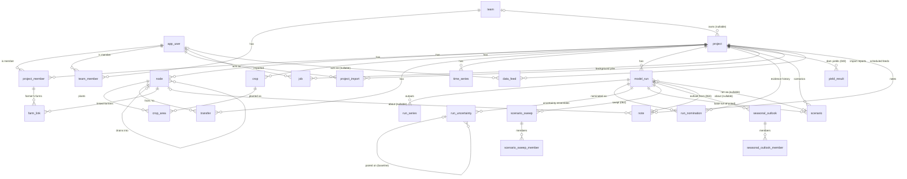

# Data model

Postgres 17 (locally in docker on `:5434`; in production RDS PostgreSQL 17, see
[deployment.md](./deployment.md)). The schema lives in plain SQL
migrations under `backend/migrations/` and is applied by a small runner
(`pnpm dev:db:migrate`). Once deployed, migrations only move forward: never edit
one that has shipped, add a new numbered file instead. Until the first
production deploy, `001_init.sql` may still be edited in place.

The TypeScript shapes that mirror these tables are in
`packages/engine/src/project.ts`. The backend (storage and validation) and the
frontend (forms) share them. The HTTP contract is in [api.md](./api.md).

## Entity overview

## Tables and their workbook origin

| Table | Purpose | b023 workbook origin |
| --- | --- | --- |
| `app_user` | Account: email (citext, unique), display name, bcrypt hash; `locale` (a `language` code, NULL = not chosen; 080) and `volume_unit` (`m3` / `ML`, default `m3`), 050_user_locale.sql (WP-2.5); `data_exported_at`, the last data-subject export (the one-a-minute limit, 054_subject_export.sql); `terms_version` (the terms and privacy notice accepted at sign-up, their effective date `YYYY-MM-DD`, the engine's `LEGAL_VERSION`) and `terms_accepted_at` (stamped by the database, never the caller: `app_register` and the `app_user_terms_stamp` trigger, which also refuses to clear a record), both NULL for an account a script made, 087_terms_acceptance.sql; `farm_notice_version` (the farm view's "Before you look at your farm" notice acknowledged with "I understand", its effective date, the engine's `FARMER_NOTICE_VERSION`) and `farm_notice_accepted_at` (stamped by the database through the `app_user_farm_notice_stamp` trigger, which also refuses to clear a record), both NULL until acknowledged, 093_farm_notice.sql | none (the workbook has no users) |
| `language` | The languages a person or an invite can have (`code`), synced from the engine's language table; see [Languages](#languages-080_languagesql) | none |
| `team` | A group of users (name, creator) whose projects its members share; `settings` (jsonb, 055: the portfolio's traffic-light thresholds); see [Teams](#teams-002_teamssql-008_team_viewersql-055_team_settingssql) | none |
| `team_member` | (team, user, team role) | none |
| `project` | One catchment/place: name, description, optional `team_id`, `wua_name` (095_wua_name, issue #74: the WUA the farm pages' contact lines name, "Questions? Contact Vaalbank WUA."; NULL = "your WUA", 1–200 characters by a CHECK; not the team's name, which may be a consultancy's; every member reads it, farmers included, and an editor changes it), `time_zone` (an IANA name, `Africa/Johannesburg` by default, 058_project_time_zone: the calendar day its downloads are dated by, issue #45, and every other day the server counts or writes for a person: the alerts' today and 06:00 digest (059_local_day), feed health, the portfolio's ages, the farm view's freshness and forecast `madeOn`; the API accepts only a zone the runtime knows, a CHECK bounds it to 1–64 characters, and SQL reads it through `app_time_zone(zone)` (059), which falls back to the default for a name Postgres's tz database lacks rather than raising). `settings jsonb` holds model-wide parameters (`ProjectSettings`) | One workbook. `settings` ← `[Crop demand]` A-pan and effective rain (plus `effectiveRainStoreMm`, the soil-water store, which the workbook doesn't have: default 25 mm, engine ≥ 0.14.0; and `lakeEvapFactor`, dam evaporation ÷ A-pan, default 0.75, engine ≥ 0.16.0), `[Farm demand]` Feb days, `[Farm spec]` method and Hi/Lo split, `[Flow Calibration Cfg]` (only the rain threshold and catchment area since engine 1.0.0, [064](#legacy-runoff-settings-removed-064_remove_legacy_runoffsql)), `[EWR Cfg]` pragmatic EWR, `[Home]` date window, `[Flow Calibration Cfg]` calibration window (`calibrationStart/End`) and `[Flow data]` rUseFlow (`calibrationFlowKind`). App-only keys (e.g. `calibrationSiteNodeId` (engine 1.41.0: where calibration scores, null = the outlet or a gauge above it with a flow record, [model.md §2.10k](./model.md#210k-calibrating-at-a-gauge-inside-the-network-engine--1410); no SQL migration, null from `mergeSettings`), `runoffModel`, always `'gr4j'` since engine 1.0.0: the run's record of its model, not a choice, `panCoefficient`, `chirpsBiasCorrection`, `chirpsFitPeriod` (engine 0.29.0), `chirpsQuantileMap` (engine 1.53.0, CR-23: the CHIRPS gap fill's opt-in quantile map, `{ wetDayMm }` or null, [model.md §2.4b](./model.md#quantile-map-engine--1530-cr-23); no SQL migration, null from `mergeSettings`), `rainSource` (engine 0.30.0: periods whose catchment rain comes from `rain_catchment_alt_mm` × monthly factors, [model.md §2.4e](./model.md#24e-rain-source-periods-engine--0300-issue-40-b)), `pe` (engine 0.31.0: GR4J's potential-evaporation input, `{ kind: 'pan' }` or `{ kind: 'monthly', mm, source }`, [model.md §2.4a](./model.md#24a-rain-to-flow-gr4j-engine--050-issue-4); no SQL migration, since a project saved without it takes `{ kind: 'pan' }` from `mergeSettings`, what it always ran), `panCoefficientSource` (engine 0.31.1: free-text provenance of the pan-coefficient row, never read by the model), `lakeEvapFactorSource` (engine 1.49.0: free-text provenance of the dam evaporation factors, e.g. a lake-factor preset's note, [model.md §2.7a](./model.md) item 4; never read by the model; no SQL migration, '' from `mergeSettings`), `arealRain` (engine 1.13.0: the areal rainfall correction on GR4J's rain, `{ factors, method, source }` or null, [model.md §2.4g](./model.md#24g-areal-rainfall-correction-engine--1130); no SQL migration, null from `mergeSettings`), `effectiveRainFractionMonthly` (engine 0.43.0, issue #54: 12 effective-rain fractions 0–1 by water-year month, or null = `effectiveRainFraction` every month, [model.md §2.3](./model.md#23-irrigation-demand) step 7; no SQL migration, null from `mergeSettings`), `assuranceAnnualThreshold` (engine 0.32.0: the supply ratio at which a water year counts as met for the annual assurance of supply, default 0.9, [model.md §2.11a](./model.md#211a-assurance-of-supply-and-stress-classes-engine--0320-roadmap-wp-34)), `allocationMode` and `allocationTolerance` (engine 1.18.0, issue #72: what the registered volumes do to a run, `'none'` by default, `'cap'` or `'fullAllocation'`, and the comparison's band, a fraction in [0, 1), default 0.1, [model.md §2.12a](./model.md#212a-allocations-and-full-allocation-runs-engine--1180-issue-72); no SQL migration, `mergeSettings` gives a project without them the defaults), `ewrChargeSource` and `lowFlowMeasure` (engine 1.3.0, issue #64: what the EWR charge follows, `'pragmatic'` by default or `'ruleTable'`, and what low flows are judged on, `'total'` by default or `'baseflow'`, [model.md §2.9c–§2.9d](./model.md); pending the hydrologist; no SQL migration, `mergeSettings` gives a project without them the defaults), `zeroRainRuns` with its multi-day accumulation fields from engine 0.20.0, `dataQuality`, `reportStart/End`) have no workbook cell; missing keys take `defaultProjectSettings()`. Three keys are **not model inputs**, so runs don't record them and saving only them leaves `updated_at` alone: `autoRun` (WP-2.11, `runs/autoRun.ts`), `outlook` (issue #53 R5, R6, `projects/outlookSettings.ts`: `{ season: { startMonth, startDay, endMonth, endDay } \| null, planningShare: number \| null, review: { month, day } \| null }`, null = the engine's defaults, 1 October – 30 April, 0.8 and the review on 1 January, confirmed by the client (O3, O6, issue #90); how a seasonal outlook is set up; no SQL migration) and `outcomes` (issue #53 R4, `projects/outcomeSettings.ts`: `{ yearClassMethod: 'auto' \| 'terciles' \| 'quintiles', riskCutoffs: { reserveMonthsMet, daysBelowEwr }, siteNodeId }`, each metric `{ lower, increasing }` shares or null = the engine's defaults, pending the hydrologist, and `siteNodeId` the Reserve site, null = the outlet or a gauge with a rule table (checked when it changes; a copy remaps it with the rule tables' sites); how the Runs tab's outcome matrix reads a demand sweep; no SQL migration, the API resolves an absent key to the defaults). Access is the row's: every member reads it, an editor changes it |
| `project_member` | (project, user, role) | none |
| `node` | A network element: `farm`, `gauge` or (engine ≥ 0.22.0, migration 011) `user`, an other water user, `downstream_node_id` (tree to one outflow gauge), areas, flow-share override, dam and diversion parameters, irrigation efficiency and loss return | `[Network]` (name, type, upstream links reversed into one downstream link) + `[Farm spec]` (every numeric column) |
| `crop` | A crop with 12 monthly crop factors (water-year order, Oct … Sep), a display `sort_order` (003) and an optional `irrigation_efficiency` (061, engine ≥ 0.43.0, issue #54: 0 < e ≤ 1 by CHECK, NULL = the farm's `node.irrigation_efficiency`; a farm runs on its crops' efficiencies weighted by annual requirement, [model.md §2.3](./model.md#23-irrigation-demand) step 6) | `[Crop demand]` crop table (b023 has no per-crop efficiency) |
| `crop_area` | Planted m² per (farm node, crop) | `[Farm demand]` crop-area grid |
| `land_cover` | A land-cover patch on a farm (migration 013, engine ≥ 0.24.0, [model.md §2.5a](./model.md)): `node_id`, `cover_class` (`eucalyptus`, `pine`, `invasive`, `invasiveRiparian`, `other`), `area_km2` ≥ 0, `density_pct` 0–1 (condensed cover), `factors jsonb` null or `{ mar, lowFlow }` each 0–1 (CHECKs). Part of the model document, rewritten whole on save like `crop_area`; cascades with its node. RLS viewer/editor policies, same-project trigger on `node_id`, indexes on `project_id` and `node_id` | none (b023 has no land cover) |
| `borehole` | An individual borehole on a farm or other user (migration 043, engine ≥ 0.36.0, WP-3.9, [model.md §2.7d](./model.md)): `node_id`, `name` (1–200 chars), `capacity_m3_day` ≥ 0, `annual_cap_m3` ≥ 0 or null (no cap; per water year), `mode` (`none`, `supplemental`, `primary`, `emergency`), `emergency_below_pct` 0–1, `target` (`direct`, `dam`), `depletion_factor` 0–1 (CHECKs). They add to the node's combined `borehole_capacity_m3_day` (012), whose `stream_depletion_lag_days` they share. Part of the model document (`ProjectModel.boreholes`, present only when there are any), rewritten whole on save like `land_cover`; cascades with its node. RLS viewer/editor policies plus `borehole_select_farmer` (own linked farms only), same-project trigger on `node_id`, indexes on `project_id` and `node_id` | none (b023 has no boreholes) |
| `demand_object` | A demand object on a unit (migration 088, engine ≥ 1.7.0, issue #54 item 2b, [model.md §2.7f](./model.md)): `node_id` (a farm node; the API refuses any other), `name` (1–200 chars), `category` (`domestic`, `municipal`, `industrial`, `livestock`, `irrigation`, `external`, `other`), `sizing` (`monthly`, `perUnit`), `monthly_m3_day` float8[12] or null, `unit_count` and `litres_per_unit_day` ≥ 0 or null, `loss_pct` 0 ≤ l < 1, `monthly_factor` float8[12] or null, `return_pct` 0–1, `priority` (`first`, `shared`, `last`), `destination` (`internal`, `external`), `enabled`, `schedule` jsonb or null (migration 105, engine ≥ 1.17.0, issue #90 Q4: date windows with a factor on the daily demand, 0 = off; a non-empty array of at most 24 windows, each window's shape and dates checked by the API, `[]` stored as null), `population` float8 ≥ 0 or null (migration 127, engine ≥ 1.44.0, issue #123: the people a domestic or municipal object serves, for its basic-needs floor of 25 l a person a day; null = a per-unit object's count), `note` (≤ 1000 chars) (CHECKs, including: a monthly object has its 12 values, a per-unit one its count and litres, an external one returns nothing). Part of the model document (`ProjectModel.demandObjects`, present only when there are any), rewritten whole on save like `borehole`; cascades with its node. RLS viewer/editor policies plus `demand_object_select_farmer` (own linked farms only, so a linked contributor reads their own units' too, 045), same-project trigger on `node_id`, indexes on `project_id` and `node_id` | a unit's gross demand typed over the [Farm demand] crop formula (the importer maps the excess to a `monthly` object, scripts/wbt-import) |
| `transfer` | A structured transfer rule: from/to node, months, max rate m³/s, optional daily cap, min source storage %, enabled, `priority` (integer, lower moves first; equal priorities share a source dam pro rata, engine ≥ 0.16.0; migration 006 set it to each rule's old position in id order), `monthly_rate_m3s` (migration 090, engine ≥ 1.14.0: float8[12], the max rate per water-year month Oct–Sep, 0 = off that month; NULL, every existing row, = the max rate in the listed months; when set, `months` and `max_rate_m3s` are kept as the months with a rate above 0 and the largest rate, and the API refuses a model where they disagree); a river off-take (migration 091, engine ≥ 1.14.0, [model.md §2.6a](./model.md)): `source` (`dam` default, `river`), `hands_off_m3_day` (≥ 0 or NULL = none), `hands_off_ewr` (default false), `loss_pct` (0 ≤ l < 1, default 0), `sizing` (`demand` default, `capacity`), `top_up_dam` (default false) (CHECKs); every existing row is a dam transfer, and the API refuses an off-take that isn't unit to unit or whose destination drains into its source; canal seepage back to the river (migration 126, engine ≥ 1.42.0): `loss_return_pct` (0–1, default 0 = none returns, every existing row) and `loss_return_node_id` (FK → `node`, ON DELETE SET NULL, NULL = the source; the API refuses a unit that isn't the source or a farm downstream of it along the river; indexed, and the same-project trigger checks it with `from_node_id` and `to_node_id`) | `[Transfers]` "Draw From" parameters. The hand-written InOut formulas become the rule itself (see [model.md §2.6](./model.md#26-transfers-transfers)). |
| `time_series` | A daily input series, stored as one array per (project, kind, name). A flow record may carry `site_node_id`, the gauge node inside the network it was measured at (084, [Gauge records](#gauge-records-084_gauge_recordssql)); none = the outlet. `kind` is free text in the table; the API and `pnpm import:project` accept only `SERIES_KINDS` (engine 0.30.0 adds `rain_catchment_alt_mm` and `rain_reanalysis_mm`, read only by a rain-source period; engine 0.38.0 adds `evap_apan_mm`, a daily A-pan evaporation record in mm that replaces the monthly `apanMm` means on the days it covers, [model.md §2.3a](./model.md#23a-daily-a-pan-evaporation-engine--0380-issue-45), with no migration since `kind` has no CHECK). A run stores the first series of every kind in `run_input_series`, the daily A-pan included. `product` / `product_version` (032) and `day_boundary` (033) describe the values. `name` tells several series of one kind apart; a run uses the first of each kind by name | `[Flow data]` columns G–K: gauge flow, logger flow, catchment rain, CHIRPS rain, forecast rain. Column F (Pitman flow) is not a series kind from engine 0.10.0 ([audit P1](./engine-audit.md)); rows of that kind left in an older database are ignored by runs. With the importer's `--gauge-as-reference`, the gauge column becomes `flow_reference_m3s` (a reference gauge, which runs never read; [model.md §2.10](./model.md#210-calibration-statistics-flow-calibration-cfg)) |
| `model_run` | One run: who and when, `engine_version`, date window, an **input snapshot** (`inputs jsonb`) and a small `summary jsonb`, plus the modeller's written `notes` (007) and a `pinned` flag (015), the only columns that change after the run is made, `scenario_id` (024), the scenario that made it (null for a run of the live model), and `trigger` (042): `manual`, `auto` for the re-run after new data, or `forecast` for a forecast run (WP-2.12) | A "Calc. Model" press plus the `[Log]` entry |
| `scenario` | Named overrides on a base run (024, WP-3.2): `base_run_id`, `ops jsonb`, `ops_sha256`, `owned_node_ids`, `op_names` (047), `owner_user_id`, `status`, and the answers to the evidence report's Appendix C prompts `purpose_need`, `mitigation`, `monitoring` (129); see [Scenarios](#scenarios-024_scenariossql) | none (the workbook is copied by hand for a what-if) |
| `yield_result` | A dam's firm yield or storage–yield curve on a saved run or scenario (040, WP-3.6): `run_id` or `scenario_id`, `node_id`, `kind`, `params`, `points`; see [Yield results](#yield-results-040_yieldsql) | none (the workbook has no yield analysis) |
| `scenario_sweep` | A scenario sweep (062, issue #53 R2): a base run × named op sets, run as one `sweep` job; `base_run_id`, `job_id`, `name`, `status` (`pending` / `complete`), `engine_version`; see [Scenario sweeps](#scenario-sweeps-062_scenario_sweepssql) | none (the workbook is copied by hand for each what-if) |
| `scenario_sweep_member` | One member of a sweep (062): `position` (0–11), `name`, `ops`, `ops_sha256`, then once its outcome: `status` (`pending`, `done`, `problems`, `failed`), `problems`, `summary` (the `RunSummary`), `series` (catchment-level outcome series), `start_date` / `end_date` | none |
| `seasonal_outlook` | A seasonal outlook (063, issue #53 R5): a base run × a season (`decision_date`, `season_end`) × demand `levels`, over the record's analogue years, run as one `outlook` job; `planning_share`, `analogue_years`, `status`, `result` (the engine's summary), `engine_version`; see [Seasonal outlooks](#seasonal-outlooks-063_seasonal_outlooksql) | none (the sketch S3 was worked by hand) |
| `seasonal_outlook_member` | One level in one analogue year of an outlook (063): `level_position`, `water_year`, `status` (`done`, `failed`), `member` (the engine's `OutlookMember`) or `problems`; written once, complete | none |
| `run_series` | One daily output array per (run, node, key). `node_id` null = catchment-level; otherwise a node of the **run's own** model snapshot, not a foreign key to the live `node` table (since 024: a scenario run has nodes the live model doesn't, and a node deleted from the model keeps its series in earlier runs) | Element-sheet columns (storage, spill, outflow, deficit, EWR shortfall…) and `[Flow data]` natural flow and simulated outflow |
| `project_import` | What the importer flagged when the project was imported (017): file name, source, importer version, who and when, and the notes and unmapped report as jsonb. Written once by the import, never changed; see [Import reports](#import-reports-017_project_importsql) | The whole workbook (or project file), as the browser importer read it |

### Field mapping details

| `node` column | Farm spec column | Notes |
| --- | --- | --- |
| `area_km2` | Total area farms (km²) | Used by the *Area* flow-share method and for `RainToM3` |
| `area_hi_km2` / `area_lo_km2` | Farm area high / low MAP | *Hi/Lo* method |
| `flow_share_manual` | External fragmentation (%) | *Specific* method (0–1) |
| `pct_upstream_to_dam` | "Upstream inflow above dam (%)" | The share of upstream inflow that enters the dam (engine ≥ 0.9.0). The workbook's formula applied it to the water passing below the dam; the client confirmed the label's meaning ([model.md Q1](./model.md#3-workbook-quirks-and-suspected-bugs)). Defaults to 1 (a dam on the river). |
| `pct_runoff_to_dam` | Farm runoff above (into) dam (%) | |
| `dam_capacity_m3` | Composite dam capacity (m³) | |
| `dam_initial_pct` | Initial dam volume (%) | |
| `dam_min_pct` | (not imported; the workbook's "Min dam volume" is the transfer minimum) | The dam's **minimum operating level** (dead storage, engine ≥ 0.16.0, Q5): irrigation draws only above `capacity × dam_min_pct`, and transfers keep `capacity × MAX(rule min, dam_min_pct)`. Migration 006 reset every stored value to 0; the importer writes 0 |
| `divert_capacity_m3_day` | Downstream diversion back to dam | The workbook enters m³/s and converts it. We store m³/day. |
| `dam_area_full_m2` | (none) | Dam surface area when full, m² (≥ 0, nullable; engine ≥ 0.16.0, [audit N2](./engine-audit.md)). NULL = unknown: runs estimate capacity ÷ 3 m and warn (W6). The importer writes NULL |
| `dam_area_exponent` | (none) | b in A = A_full × (S / capacity)^b, 0 < b ≤ 3, default 0.7 (Liebe et al. 2005) |
| `dam_seepage_per_day` | (none) | Seepage as a fraction of storage per day (0–1), default 0; it joins the farm's outflow (less the share lost, below) |
| `dam_curve` | (none: b023 has no survey) | Migration 041, engine ≥ 0.35.0 ([model.md §2.7a](./model.md), "Dam geometry, losses and releases"): the dam's survey rows `[{levelM, areaM2, volumeM3}]` as `jsonb` (an array of at most 200, CHECK); NULL = the power-law area. On the node rather than a child table: always read and written with the node, so the node's RLS covers it (members, and a farmer's own linked nodes). The API checks each row's shape and the engine's save rule the monotonicity |
| `dam_release_rule` | (none) | `none` (default), `passInflow` or `fixed` (CHECK): a release before irrigation |
| `dam_release_m3_day` | (none) | m³/day per water-year month (12 values ≥ 0, CHECK): the fixed release, or the pass-inflow target; NULL = none (fixed) / the EWR required at the node (pass inflow) |
| `dam_outlet_capacity_m3_day` | (none) | Most the outlet releases per day (≥ 0); NULL = no limit |
| `dam_seepage_return_pct` | (none) | Share (0–1, default 1) of the seepage returning below the dam; the rest leaves the catchment |
| `dam_survey_date` | (none: b023's capacity is undated) | Farms (migration 110, engine ≥ 1.30.0, issue #67, [model.md §2.7g](./model.md)): the day the capacity (and survey curve) was surveyed, `date`. NULL (every existing row) = not recorded |
| `dam_sediment_pct_per_year` | (none) | Share (0–0.2, CHECK) of the surveyed capacity lost to sediment a year, linear both ways from `dam_survey_date`: capacity on day t = `dam_capacity_m3` × MAX(0, 1 − rate × years since the survey). NULL or 0 = none. CHECK `node_sediment_needs_survey`: a positive rate needs a survey date |
| `dam_in_service_from` | (none) | The first day the dam holds water, `date`; before it the farm has no dam. NULL = the whole run |
| `abstraction_from` | (none) | Farms and users: the first day the unit abstracts, `date`; before it its crops', demand objects' and own demand are 0. NULL = the whole run. The API refuses the three dam fields off a farm, this one on a gauge, and a date that isn't one (the engine's `developmentProblem`, through `modelRuleProblems`); the table checks only the rate's range and its survey date |
| `irrigation_efficiency` | (from "Irrigation return flow (%)" r: e = 1 − r, floored at 0.01, or 1 when r = 0) | Application efficiency e, 0 < e ≤ 1 (CHECK), default 0.9, drip (099_drip_default_efficiency, issue #90; 0.8 from 006 until then, and stored rows kept their values), the engine's `NEW_FARM_IRRIGATION` (engine ≥ 0.16.0, [audit N1](./engine-audit.md)): abstraction demand = crop requirement ÷ e |
| `loss_return_fraction` | (1 when r > 0, else 0) | Share β (0–1) of the application losses `(1 − e) × supplied` that returns to the river the same day; default 0.5. Migration 006 backfilled both from `return_flow_pct` and dropped that column |

| `user_demand_m3_day` | (none: b023 has no such element) | Kind `user` only (migration 011, engine ≥ 0.22.0, [model.md §2.7c](./model.md#27c-other-water-users-engine--0220-roadmap-wp-133)): demand from the river, m³/day per water-year month (12 values ≥ 0, CHECK); NULL = none |
| `user_return_pct` | (none) | Kind `user` only: share (0–1) of what it takes that returns below it the same day; default 0 |
| `borehole_capacity_m3_day` | (none: b023 has no groundwater) | Farms and users (migration 012, engine ≥ 0.23.0, [model.md §2.7d](./model.md)): most pumped per day, m³/day; NULL = no boreholes (every existing row) |
| `borehole_rule` | (none) | `supplemental` (default), `primary` or `drought` (CHECK); the API refuses `drought` without a farm dam and any borehole on a gauge |
| `borehole_trigger_pct` | (none) | Drought rule: runs while the dam is below this fraction of capacity (0–1, default 0.3) |
| `stream_depletion_frac` | (none) | Share d (0–1, default 0) of the pumping taken from the river at the node |
| `stream_depletion_lag_days` | (none) | Lag time constant k (0–36 500 days, default 0 = same day) |
| `user_priority` | (none) | Kind `user` only: `senior` (default) or `junior` (CHECK). The API refuses crop areas and transfers on a user node |
| `supply_rule` | (none: b023 irrigates from the dam only) | Farms only (migration 060, engine ≥ 0.42.0, WP-3.8, [model.md §2.7e](./model.md)): `damFirst` (default, every existing row: the dam only), `riverFirst`, `trigger` or `runOfRiver` (CHECK). The API refuses a rule other than `damFirst` or a pump capacity on a gauge or user, `trigger` without a dam and `runOfRiver` with one |
| `pump_capacity_m3_day` | (none) | The river pump's capacity, m³/day (≥ 0, CHECK); NULL = no limit; inert under `damFirst`. Stored per day, not as pumps × m³/h (the form's calculator) |
| `supply_trigger_pct` | (none) | `trigger` only: switch to the river below this fraction of dam capacity (0–1, default 0.4) |
| `supply_stop_pct` | (none) | `trigger` only: switch back to the dam at this fraction (0–1, default 0.6); the API refuses one below the trigger |
| `hands_off_m3_day` | (none: b023 leaves only senior users' demand) | Farms only (migration 114, engine ≥ 1.32.0, WP-3.8, issue #204, [model.md §2.7h](./model.md)): the hands-off flow, `float8[]` of 12 m³/day values by water-year month (Oct–Sep), left in the river before the river pump and River to dam take anything (on a farm with no dam, before what it irrigates straight from the river). NULL (default, every existing row) = none. CHECK 12 values, none NULL, none negative |
| `hands_off_ewr` | (none) | Farms only (migration 114): also leave the EWR required at the farm (its cumulative requirement) in the river, as a river off-take's `transfer.hands_off_ewr` does. `false` (default, every existing row). Keep = MAX(the month's hands-off amount, the EWR when ticked) |
| `divert_monthly_m3_day` | (none: b023's one m³/s) | Farms only (migration 114): River to dam's capacity by water-year month, `float8[]` of 12 m³/day values; when set it replaces `divert_capacity_m3_day` (0 in a month = no diversion, a dam filled in winter only). NULL (default) = the one value all year. CHECK 12 values, none NULL, none negative. The API refuses any of the three off a farm (the engine's `modelRuleIssues`, `operatingKind`) |
| `ewr_site` | (none: b023 checks the EWR at every gauge) | Gauges (migration 086, engine ≥ 1.5.0, [model.md §2.7b](./model.md)): whether the EWR is assessed here. `true` (default, every existing row); `false` only on a gauge (CHECK `node_ewr_site_gauge`), never the outlet (a model rule the API applies on save). False = the gauge charges nobody and a Reserve rule table there is skipped |
| `ga_property_area_ha` | (none) | Farms and other users with boreholes (migration 089, engine ≥ 1.12.0, [model.md §2.7d](./model.md)): the property's size, ha (0 to 10 000 000), for the GN 538 groundwater volume. NULL (default, every existing row) = unknown: the run shows the 40 000 m³/a ceiling and warns |
| `ga_rate_m3_ha_year` | (none) | Same: the GN 538 Table 2 rate for the property's quaternary, m³/ha/a, CHECK one of 0, 45, 75, 150, 275, 400. NULL = not looked up. Volume = min(area × rate, 40 000), context only |

Every percentage is stored as a **fraction 0–1** (CHECK constraints enforce the
range).

Ordering: `sort_order` (on `node`, and on `crop` since 003) is only for display. The engine works out the
calculation order from the tree (upstream first, with `sort_order` as the
tie-break). The workbook's row-order rule ("upstream elements must be listed
first") therefore disappears.

The backend checks these on every `PUT /model`: node names are unique, the
references stay inside the same document, the graph is a tree, and there is
exactly one node with no downstream (the outflow gauge). The engine
(`buildTopology`) enforces the last two again and throws, so a run never picks
one of several outlets by array order.

## Time-series storage

A daily series is stored as **one row with a `double precision[]` array** plus a
`start_date`. `values[i]` is the value on `start_date + i` days, and `NULL`
elements mean "no reading".

Why arrays and not one row per day:

- **Size and speed.** A multi-decade daily record is well over ten thousand days. One row per day would be
  that many rows per input series and, for outputs, days × (nodes × keys) rows per run
  (millions of rows per run, each with ~24 bytes of tuple overhead). An array is
  one TOASTed value (8 bytes a day raw, compressed on disk). It loads with one index
  lookup and goes straight into a `Float64Array` in the engine.
- **The access pattern is whole-series.** The engine always needs a full series,
  and a chart fetches one series at a time. Nothing queries "flow on 3 March
  across all projects".
- **Simplicity.** There is no extension to install (TimescaleDB is not
  available on Aurora or RDS) and nothing to partition.

Trade-offs we accept: updating one day rewrites the whole array (fine, since
inputs are uploaded in bulk), and SQL date-range aggregates need `unnest … WITH
ORDINALITY` (fine for occasional reports).

### Series provenance (032_series_provenance.sql)

`time_series.product` and `product_version` say what the values are, e.g.
`CHIRPS` `2.0` (a b023 workbook's CHIRPS column), `CHIRPS sat` `3.0` or
`CHIRPS rnl` `3.0` (the CHIRPS feed's two daily products). Both or neither;
`NULL` = not recorded. The product is recorded apart from the version, and a
change of either is a change of forcing: v2.0 and v3.0 differ by an
era-dependent factor, and v3.0's `sat` and `rnl` disaggregate the same
pentads with different daily timing (issue #40 part c).

- **Set by** an upload (`PUT …/series` with `product` + `productVersion`; a
  replace that doesn't say clears it), a merge into an empty or new series,
  an import or project document, a copy, a data feed (the series it creates
  or, confirmed, replaces), a restore (the revision's label comes back with
  its values), and `PATCH /projects/:id/series/:seriesId` (a person saying
  what an existing series is, logged as `series.labelled`).
- **Kept** by a merge. A merge of days labelled with another product or
  version into a series holding values is refused (409): replace the series
  whole, or use another name. A data feed never merges into a series holding
  another label, or an unrecorded one, without an owner's confirmation
  ([architecture.md § Data feeds](./architecture.md#data-feeds)).
- **Read by** runs: each input series' label goes into the run's snapshot
  (`inputs.series[kind].provenance`), so the run comparison can say the
  version changed, and into the live model input, which the in-browser fit
  records as the fit's `forcing.chirpsSource`
  ([model.md §2.10b](./model.md)). The model never reads it, though a
  rain-source period's summary carries its series' label
  (`summary.rainSource.periods[].seriesProvenance`), so run comparison shows
  a change of the alternative gauge's product.
- **Not only CHIRPS.** The Upload form asks CHIRPS series for one of the
  known CHIRPS products, and the alternative catchment gauge
  (`rain_catchment_alt_mm`) and the reanalysis (`rain_reanalysis_mm`) for a
  free product and version (e.g. `SASSCAL AWS` `1`, `ERA5` `1`), optional
  (engine 0.30.0, issue #40 (b)).

### Series source and unit (107_series_source.sql)

Issue #66. For any series, what 032's product and version can't say:

- **`time_series.source`**: where the values came from, free text of 1–200
  characters on one line: a DWS station id (`DWS X1H001`), an agency, a file,
  or the data feed that wrote them. `NULL` = not recorded.
- **`time_series.source_unit` / `source_unit_factor`**: the unit the values
  were given in (`l/s`, `ML/day`, `cm` …) before the series routes converted
  them to the kind's canonical unit (engine `units.ts`), and the factor applied
  (`1` = none). Both or neither (`time_series_source_unit`); `NULL` = not
  recorded, as on every series stored before 107. Written by the routes from
  the upload itself, never by hand: the conversion is a fact of the upload, and
  a `PATCH` naming it is refused.
- **Set by** an upload (a replace records exactly what it was, so one without
  a source clears it), a merge into a new or empty series, a data feed on the
  series it creates or replaces (`"CHIRPS daily rainfall data feed"`, `"DWS
  gauge flow data feed, station A2H012"`), an import (the file's `source`,
  `sourceUnit`, `sourceUnitFactor`, and nothing when the file has none, so a
  project round-trips exactly), a
  copy, a restore (`series_revision` keeps all three with the values), and
  `PATCH /projects/:id/series/:seriesId` with `source` (logged as
  `series.labelled` with `origin: { from, to }`).
- **Kept** by a merge into a series holding values: its earlier days didn't
  come from the new file, so the series keeps its own record (each merged
  file is still converted on the way in).
- **Read by** runs: the input snapshot records each series' as
  `inputs.series[kind].origin = { source, unit, factor }` (absent on runs
  before 107), so the run comparison says when a series now comes from
  somewhere else or was given in another unit, and a fit records its
  calibration record's (`fitRecord.observedOrigin`), so the fit is flagged
  when it changes. The model never reads it.
- RLS and grants: columns on `time_series` and `series_revision`, covered by
  their existing policies and `water_app`'s table grants; no foreign key.

### Series day boundary (033_series_day_boundary.sql)

`time_series.day_boundary` says how a series' days were built from
sub-daily readings (issue #40 (b) amendment 5, [model.md
§2.4e](./model.md#24e-rain-source-periods-engine--0300-issue-40-b)):
`'08:00'` = each day is 08:00 to 08:00 the next morning, booked to the day
it starts (the manual-gauge convention); `'00:00'` = midnight to midnight;
`NULL` = daily values as uploaded (a CHECK allows only these). The browser
adds an hourly or other sub-daily CSV up into days (each timestamp closes
its interval) and sends the boundary with the values.

- **Set by** an upload (`PUT …/series` with `dayBoundary`; a replace that
  doesn't say clears it), a merge into an empty or new series, a copy, and
  the project document (export and import).
- **Kept** by a merge. A merge that says the other boundary (`null`
  included) into a series holding values is refused (409), the same splice
  rule as the product/version guard above.
- **Kept by a series revision** (`series_revision.day_boundary`, 033), so a
  restore puts the boundary back with the values, as it does the product
  and version. The model never reads it.
- water_app's existing `time_series` grants and RLS policies cover the
  column.
- Checked by the same rules in the database (`CHECK`s) and the engine
  (`provenanceError`): 1–40 letters, digits, spaces, dots, dashes or
  underscores for the product, 1–20 without spaces for the version.

### Gauge records (084_gauge_records.sql)

`time_series.site_node_id` says an observed or logger flow record was
measured at a **gauge node inside the network** (engine ≥ 1.4.0, issue #64,
[model.md §2.10d](./model.md#210d-hydrologist-plausibility-checks-engine--0250-issue-4-phase-6));
`NULL` = the outlet, which every series was before.

- **Read by** a run (`runs/execute.ts` `loadLiveInput`): the outlet's
  records are the first of each kind by name among the series with **no
  site**, as before; each gauge's are the first of each flow kind by name
  among its own, given to the engine as `<kind>@<node id>`. A run's
  plausibility checks read a gauge's record, so does a gauge EWR site's own
  EWR test, and so do calibration and the run's calibration statistics when
  `settings.calibrationSiteNodeId` names that gauge (engine ≥ 1.41.0,
  [model.md §2.10k](./model.md#210k-calibrating-at-a-gauge-inside-the-network-engine--1410);
  the API checks a new site is such a gauge with a record, and a copy or an
  import moves it with the node ids). The run stores it like any
  input series (`run_input_series.kind` = that key, the values in
  `series_blob`), so `loadRunInput` reproduces it; 084 redefines
  `run_input_series_series_kind` (from 056) to compare the kind before the
  `@` with the series'.
- **Only a flow record** has a site (`time_series_site_flow_only` CHECK).
- **A plain uuid, not a foreign key**, on purpose: deleting the gauge from
  the model must neither delete its record (a cascade) nor quietly make it
  the outlet's (SET NULL would change what the outlet calibrates against).
  The record keeps its site, the run leaves it out with a warning, and the
  Data page shows "its gauge is no longer in the model" until an editor
  moves it.
- **Same project on write**: `time_series_site_same_project` runs
  `assert_same_project('site_node_id')` when the column is set. The API
  (`PATCH …/series/:id { siteNodeId }`) also requires a gauge above the
  outlet, and logs a move as `series.site_changed` (`{ site: { from, to } }`,
  gauge names or "the outlet").
- **Kept** by an upload, a merge, a data feed and the ingest (none writes the
  column). **Carried** by a copy and the project document (`siteNodeId` on a
  series), both moved to the new project's gauge id; an import refuses a
  site that isn't a gauge above the outlet in the file's own model, and the
  export leaves out a site whose node has gone. **Kept by a series
  revision** (`series_revision.site_node_id`, 085_series_revision_site.sql):
  `recordSeriesRevision` reads the series' site as it records the revision,
  and a restore (`POST …/series/:id/revisions/:revId/restore`) sets it back,
  so a deleted gauge record comes back at its gauge, never quietly at the
  outlet. When that gauge has since left the model the restore is refused
  (`409`: restoring it would make it the outlet's record; bring the gauge
  back from the model's history first). A revision recorded before 085 has
  no site and restores to the outlet.
- water_app's existing `time_series` grants and RLS policies cover the
  column. Farmers never read `time_series` (020), and the catalogue guard's
  farmer list says so (`FARMERS_NEVER_READ`).

**Run output volume.** Each run stores tens to a couple of hundred output arrays
(nodes × keys, 8 bytes a day each before compression), so a multi-decade run is a few
MB to a few tens of MB. The engine is deterministic, so a run saved since
migration 021 can be recomputed from its `inputs` snapshot plus its stored
input series (`loadRunInput`, see **Stored run inputs** below) on the same
`engine_version`.

- **Cap per project.** Each new run deletes the project's oldest runs beyond
  `RUNS_KEPT_PER_PROJECT` (default **20**; unset or invalid → 20), with their
  `run_series` (cascade). It runs in the same transaction as the new run, as
  the signed-in editor, so RLS applies. Trims run one at a time per project
  (a transaction-scoped advisory lock, as the pin limit's trigger takes), so
  two runs saved at the same moment can't each trim before the other commits
  and leave the project over the cap. `POST …/runs` returns the removed ids
  (`removedRunIds`). A **kept** run is never trimmed and doesn't count
  against the cap: one an editor **pinned** (see **Pinned runs** below), one
  the evidence history names (current or past nomination, see **Evidence
  nomination** below), or one something **cites** (`model_run_cited`, see
  **Cited runs** below): a publication in the history cites its run
  ([Publications](#publications-022_publicationsql)), and a scenario its base
  ([Scenarios](#scenarios-024_scenariossql)). All of them go through
  one exemption, `RUN_KEPT_SQL` in `backend/src/runs/execute.ts`, which
  `trimRuns` and the `DELETE` route share. It is the database's own
  `app_run_kept(run)` (045), which the application trims use too, so the API
  and the database can't disagree about a run (issue #77). So a project holds at most 20
  unpinned, unnominated, uncited runs, plus at most 10 pinned, plus the runs
  its (at most 50) nominations name, plus the cited ones (the runs its at most
  12 publications hold among them). A trimmed run's stored inputs go with it
  (see **Stored run inputs**).
- **Each trigger is capped apart** (`model_run.trigger`, 042_auto_rerun.sql:
  `manual`, the default and every existing row; `auto`, the debounced re-run
  after new data, WP-2.11; `forecast`, a forecast run, WP-2.12). The 20 above
  count `manual` runs only; of the unkept runs of each automatic trigger only
  the newest is kept (`AUTOMATIC_RUNS_KEPT`, 1). So a project with a daily
  feed holds at most 20 manual runs, 1 auto run, 1 forecast run, and the kept ones (a pinned,
  nominated, published or scenario-cited auto run is kept like any other),
  and an auto run never pushes a person's run out. Scenario runs and imports
  are `manual`.
- **Output keys: none trimmed, on measurement.** On the local examples,
  TOAST compression already shrinks the constant or mostly-zero series
  (`transfer`, `is_summer`, catchment `ewr`, `deficit` on well-supplied farms)
  to a few hundred bytes to a few KB per run, against 30–60 KB for the
  high-entropy ones (`outflow`, `runoff`, `spill`, `inflow_upstream`). Every
  high-entropy key is charted or exported, so dropping keys would save little
  and change the API. If space ever matters, `real` (float4) outputs or a
  lower cap are the levers.
- **Working columns (engine ≥ 0.12.0).** Each farm also stores its 11
  intermediate columns (gross demand, effective rain, K–P, S, T and the
  balance check V; engine ≥ 0.14.0 adds a 12th, `soil_water`; [model.md §2.7](./model.md#27-farm-balance-one-sheet-per-element)),
  so a day can be checked by hand from the export. On the two-farm e2e
  catchment (120 days) they added 52 % to the run's `run_series` bytes
  (21.6 KB on 41.3 KB); expect roughly that share on a long run, since most of
  them are high-entropy. The alternative, recomputing them at export time from
  the input snapshot, would need the input series the snapshot doesn't keep,
  and would be a second implementation to keep in step with the engine.

**Run input snapshots.** `model_run.inputs` holds the settings and model data
the run used (a checkpoint; the continuous record between runs is
`model_revision`, § Change history and audit log). Input *series* values are not copied into it (they are large):
for each series kind the snapshot keeps `{ startDate, length, valuesSha256 }`,
where `valuesSha256` is the SHA-256 hex of `JSON.stringify(values)` (engine
`seriesDigest`, hashed by `backend/src/runs/execute.ts` `seriesHash`; it lives
in the `inputs` jsonb). Runs stored before it have no hash. Since migration
020 the values themselves are kept once per distinct content, keyed by that
same hash (see **Stored run inputs** below), so re-uploading a series no
longer stops an older run being recomputed; a run saved before 020 still
can't be. `GET /compare/runs` returns the whole snapshot, and
`GET …/runs/:runId` its `settings`. A forecast run's snapshot also holds
`forecastRainSource` (`chirps_gefs` | `other`, `runs/execute.ts`
`forecastRainSource`): `chirps_gefs` only when the forecast series'
`feed_id` is a CHIRPS-GEFS feed and its `feed_days` cover every day from
the first forecast day to the series' end (031_feed_days), read when the
run is made; the report's forecast line credits CHIRPS-GEFS only then. The compare "what changed" list (engine `diffInputs`, see
[run-comparison.md](./run-comparison.md)) sees a series being extended or
trimmed, and values edited within the same dates when both runs carry a hash.
The same hash could later drive an "inputs changed since this run" flag.

**Run notes (007_run_notes.sql).** A run is evidence, so it is immutable
except for one column: `model_run.notes` (text, `''` = none, at most 4 000
characters by `CHECK`), the modeller's written explanation, e.g. why a WR2012
*query* or *not usable* flag stands. `notes_updated_at` / `notes_updated_by`
(→ `app_user`, `ON DELETE SET NULL`, indexed) record the last change; the
`model_run_stamp_notes` BEFORE UPDATE trigger sets them whenever `notes`
changes and restores them on any other update, so the stamp can't be forged.
Immutability is enforced by privilege, not just by the API: `water_app` has
**no table-level `UPDATE` on `model_run`**, only `GRANT UPDATE (notes)`, so an
`UPDATE` naming any other column fails with `insufficient_privilege` whoever
runs it. The `model_run_update` policy (re-created in 007 with the same
editor-on-both-sides rule) limits even that to editors and owners; a viewer's
`UPDATE` matches no row. `PATCH /projects/:id/runs/:runId` is the only writer
([api.md](./api.md#runs)); the catalogue test pins `model_run`'s updatable
columns to exactly `notes` and `pinned` (below).

**Run stamps (077_run_stamp.sql).** `model_run.stamp` (`bytea`, 32 bytes, or
NULL) is the backend's HMAC over `app_run_digest(id)`, the canonical digest
of the run's inputs snapshot, summary, stored input series and output
series, written once by `app_set_run_stamp` in the storing transaction
(`storeRun`); `water_app` has no `UPDATE` on it. NULL (a run from before
077, or one inserted past the API) and a stamp that no longer matches the
rows both read as unverified: such a run can't be signed off, and an
application with one can't be decided
([security.md § Run stamps](./security.md#run-stamps)).

**Pinned runs (015_run_pinned.sql).** `model_run.pinned` (boolean, default
`false`) keeps a run, typically a baseline, past the storage cap: `trimRuns`
skips it and it doesn't count against `RUNS_KEPT_PER_PROJECT`, and
`DELETE …/runs/:runId` answers `409` until it is unpinned. It is the second
column `water_app` may update (`GRANT UPDATE (pinned)`, next to `notes`); the
`model_run_update` policy is unchanged, so only editors and owners can pin
and a viewer's `UPDATE` matches no row. **Ceiling: 10 pinned runs per
project** (a **cited** run's pin doesn't count, since 024: it is kept anyway,
and unpinning it is refused with `409 this run is cited by …`), so storage stays bounded (a long run is up to a few tens of MB, so
10 pins add at most half the cap again). The `model_run_pin_limit` BEFORE
UPDATE OF `pinned` trigger (`SECURITY DEFINER`, `search_path` pinned) refuses
an 11th pin with `check_violation`, under a per-project advisory lock so two
pins can't race past it; the API checks first and answers `409` with the
reason. `PINNED_RUNS_PER_PROJECT_MAX` in `backend/src/runs/execute.ts` holds
the same number. Pinning doesn't touch the note's stamp. A partial index
(`model_run_pinned_idx`, `WHERE pinned`) keeps counting a project's pins
cheap. `pinned` is on every run's metadata (`RunMeta`), so a feature that needs
a kept base run (scenarios, issue #18) can read it from the run list.

**Forecast runs (`trigger = 'forecast'`, 042_auto_rerun.sql, WP-2.12,
[model.md §2.4f](./model.md#24f-forecast-mode-engine--0370-roadmap-wp-212)).** Capped like
any automatic trigger (above): the newest unkept forecast run replaces the
one before. A forecast run's input snapshot holds the forecast tail; every
other run's doesn't (the backend stores the input it ran on, cut at the
tail).

**Evidence nomination (010_run_nomination.sql).** Which run, and so which
runoff model, the project stands behind as evidence, so an applicant can't
pick whichever model is kindest after the fact (the licensing assessor's
concern, [followups.md](./followups.md), roadmap WP-3.1 "cited runs").
`run_nomination` is an **append-only history**, one row per nomination:
`project_id`, `run_id` (→ `model_run`), `runoff_model` and `engine_version`
(copied from the run), `reason` (required, trimmed, at most 2 000 characters
by `CHECK`), `nominated_by` (→ `app_user`) and `nominated_at`. The newest row
(by `nominated_at`, unique per project) is the **current** nomination; every
older row is kept, so the history reads "nominated A on …, then replaced by
B on … because …". A run can be nominated again later (A, B, A).
**Withdrawals** (098_nomination_withdrawal) are rows too: `run_id`,
`runoff_model` and `engine_version` all `NULL` (a `CHECK` keeps them
together) and a required `reason`. After one, the project has no current
evidence run until a run is nominated again; the withdrawn run reads as past
evidence ("…, then withdrawn on … because …") and stays kept.
`run_nomination_stamp` allows a withdrawal only while a run is nominated (the
newest row has one), clears any model columns it names, and stamps who and
when; the 50-row cap counts it. `project_evidence_guard` (035) is unchanged:
any row keeps the project, withdrawn or not.

- **Append-only by privilege.** `water_app` has `SELECT` and `INSERT` only: no
  `UPDATE`, `DELETE` or `TRUNCATE`, and the table has no update or delete
  policy. The catalogue test pins this (`APPEND_ONLY`).
- **Unforgeable stamps.** The `run_nomination_stamp` BEFORE INSERT trigger
  (`SECURITY DEFINER`, `search_path` pinned) sets `nominated_by` from
  `app.current_user_id`, `nominated_at` from `clock_timestamp()`, and
  `runoff_model` / `engine_version` from the run itself, whatever the `INSERT`
  says. Runs are immutable except `notes`, so the copy can't drift.
- **Rules the trigger enforces** (the API checks them first for a clear `409`):
  the run belongs to the same project (`foreign_key_violation`); it is not a
  legacy-model run (a stored run from before engine 1.0.0), which is
  workbook comparison only (audit H1); it is not
  already the current nomination; the project has fewer than **50**
  nominations. The trigger takes a per-project advisory lock, so two
  nominations can't race past these checks or share a timestamp.
- **RLS:** viewers read, editors and owners insert (`run_nomination_select`,
  `run_nomination_insert`).
- **A nominated run is kept for good**, current or past. The foreign key is
  `NO ACTION`, so deleting the run fails (`DELETE …/runs/:runId` answers `409`
  first); `trimRuns` skips it, and it does not count against
  `RUNS_KEPT_PER_PROJECT` (the cap keeps the newest 20 runs that are neither
  nominated nor pinned). The 50-nomination limit bounds how many runs can be
  kept this way. (`NO ACTION` rather than `RESTRICT`, checked at the end of
  the statement, is what would let a project delete cascade to both tables;
  the guard below refuses that delete first.)
- **A project with a nomination is kept for good** (issue #43,
  035_project_evidence_guard.sql). The `project_evidence_guard` BEFORE DELETE
  trigger on `project` (`SECURITY DEFINER`, `search_path` pinned) raises
  `restrict_violation` when the project has **any** `run_nomination` row,
  whoever deletes and however (the route, direct SQL as `water_app`, the
  schema owner, a cascade). `DELETE /projects/:id` answers `409` first,
  naming the current evidence run. **Current or past:** the conservative
  reading, and the only one the data model allows: the history is
  append-only, so a project that has nominated always has a current
  nomination (its newest row), and "any row" also stays right if a
  withdrawal is ever added, since a withdrawn nomination is still history.
  There is no un-nominate; a nomination can only be replaced. Cascades into
  `project`: none. `project.team_id` is `ON DELETE SET NULL` (deleting a team
  keeps its projects) and `project.created_by` is `NO ACTION` (there is no
  account deletion). The operator's out-of-band removal is in
  [security.md](./security.md) § Authorization, "Tamper evidence".
- No `ON DELETE` on `nominated_by`, the same as `model_run.created_by`: there
  is no account deletion yet. When there is, it must keep the history (for
  example a tombstone user), not cascade it away.
- Migration 009 was reserved for pinned runs (issue #7), which landed as
  015 instead. 009 is an unused gap; the runner applies every unapplied file
  in name order, so the gap is harmless.

**Uncertainty bands (014_run_uncertainty.sql).** One row per ensemble a
run's editor starts ([model.md §2.10e](./model.md#210e-uncertainty-bands-engine--0260-issue-4-phase-9)):
`project_id`, `run_id` (→ `model_run`, cascade), `baseline_id` (→ another
`run_uncertainty` row, cascade; set for a **paired** band, which re-runs that
baseline's kept members on this run), `runoff_model`, `engine_version`,
`method` (`lhs`), `seed`, `members`, `options jsonb` (the resolved options:
dimensions, rain sources, records, the acceptance **thresholds**), `status`
(`started` → `complete`), and on completion `accepted`, `summary jsonb` (the
bands, coverage, notes and decision rule) and `result jsonb` (the header, the
kept members' parameters and outputs, every member's scores and verdict, the
coverage), `created_by`, `created_at`, `completed_at`. A CHECK ties the four
completion columns to `status`. Indexes cover every foreign key, `run_id`
leading `(run_id, created_at DESC)`. A 300-member result is ~200–300 KB.

Un-cherry-pickable by privilege (the licensing assessor's concern, issue #15):

- **The database draws the seed.** The `run_uncertainty_start` BEFORE INSERT
  trigger (`SECURITY DEFINER`, `search_path` pinned) sets `seed` (and
  `options.seed`) itself, stamps `created_by` / `created_at` from the session,
  forces `status = 'started'` and empty results, checks the run (and a
  baseline) belong to the project, and caps a run at **50** starts under a
  per-run advisory lock. A paired row copies its baseline's options, seed,
  members, method and model, and needs a complete, unpaired baseline of
  another run.
- **Every start is kept.** `water_app` has `SELECT`, `INSERT`, and `UPDATE` of
  `status`, `accepted`, `summary`, `result`, `completed_at` only; no `DELETE`
  and no delete policy (the catalogue test's `COLUMN_ONLY_UPDATE` and
  `NO_DELETE`). An ensemble started and never completed stays, visibly
  abandoned.
- **Completed once.** The update policy only sees `started` rows, and the
  `run_uncertainty_complete` trigger lets only whoever started a row complete
  it, only to `complete`, stamping `completed_at`. Options and thresholds are
  outside the column grant.
- Rows go only with their run (a nominated run can't be deleted) or project.
- **RLS:** viewers read; editors insert and complete (`run_uncertainty_select`,
  `_insert`, `_update`).

**Flow gap filling lives in `project.settings`** too (`settings.flowGapFill`,
engine ≥ 1.23.0, issue #66; no table or migration): a spec per observed record
and the switch that lets statistics read filled days ([model.md §2.10i](./model.md)).
Filled values are derived in each run and never written to `time_series`, so
turning it off undoes it; the run's own columns carry the filled days.

**Calibration provenance lives in `project.settings`** (no table, column or
migration; issue #4). `settings.calibrationExclusions` is the list of periods
left out of every calibration score, each a whole water year or a date range
with a required reason. `settings.qualityFlags` (engine ≥ 1.22.0, CR-18/19)
holds each calibration record's gauged range (highest and lowest field
gauging with a source) and how automatic calibration treats extrapolated,
suspect and infilled days; still no migration (model.md §2.10h). `settings.calibrationRules` (engine ≥ 1.25.0,
issue #153) is automated calibration's pre-declared rule set with its
server-kept revision and the hydrologist's sign-off; no migration either
(model.md §2.10j). `settings.evidenceUncertaintyRule` (issue #71) is the
uncertainty rule the project declares for its licensing evidence: members,
bounds, pan-coefficient shift and acceptance thresholds, which an evidence
report's cited ensemble must match exactly (engine `DeclaredUncertaintyRule`,
checked by `declaredRuleError`; model.md §2.10e). A patch replaces it whole;
`null` withdraws it, and absent means not declared. It is not a model input:
it changes no result, but a run snapshots it, so the settings diff and the
history show who declared it and when. No migration. `settings.fitRecord` is the record of the automatic fit
whose parameters Apply wrote: objective, seed, budget, window, exclusions, the
in-sample and validation scores, notes, engine version and time (and, for a
fit automated calibration picked, `auto`: the rules it ran under and every
fit it tried), and the pan
coefficient / A-pan evaporation and (engine ≥ 0.31.0) GR4J's PE input,
`forcing.pe`, it ran under (`forcing`, since it is held
fixed and never calibrated — a fit is only valid for the forcing it was
fitted under) ([model.md §2.10b](./model.md)). The backend recomputes its `editedParams` on
every settings save (`patchSettings` in `backend/src/projects/settings.ts`) and
again when a run snapshots the settings (`executeRun`), so each
`model_run.inputs.settings` carries the fit record as it stood for that run's
parameters, marked when they were edited by hand after the fit. Both keys ride
the existing `project` and `model_run` RLS (viewer reads, editor writes), so
they add no policy. They are small: a fit record is a few KB. A fit record
of the legacy runoff model was cleared by migration 064 (engine 1.0.0), and
`mergeSettings` drops one on read.

### Change history and audit log (030_history.sql)

Roadmap WP-2.4, issue #28: "who changed which parameter, when, and why did
the result change?", and put back any earlier version.

- **`model_revision`**: one row per save of the model or the settings, at
  the **document** level, written in the same transaction by the route that
  saves (not by row triggers: `saveModel` rewrites every node and crop area,
  so a trigger would log hundreds of meaningless changes per save). It holds
  `source` (`model_put`, `settings_patch`, `restore`, `import`, `copy`,
  `baseline`), the optional `reason` (≤ 500, from the save bar), `snapshot`
  `{ settings, model }` (the shape of `model_run.inputs` without series),
  `changes` (the engine's `diffInputs` lines against the previous revision),
  `node_ids` (for the farm filter), and `restored_from` / `restored_from_run`
  (each must be the same project's revision or run when written:
  `model_revision_same_project`, 069).
  The compare page credits each line of its input diff to the revision
  between the two runs that set it (issue #42, `history/attribute.ts`;
  [api.md § Compare runs](./api.md#compare-runs)).
  A save whose snapshot is unchanged writes nothing; a reorder is recorded,
  with a line saying it only changed the order. A **`baseline`** row stores
  the state before the first change to a project that predates history, so
  that state can be restored too.
- **`series_revision`**: a series' previous values, written *before* a
  replace, a delete or a merge from the UI (not for feed or key merges,
  which are append-mostly: they get an audit event only). `series_id` is a
  plain uuid, not a foreign key, so a deleted series can still be restored by
  its old id; `unit` is kept with it. **Retention**: the newest 5 per
  (project, kind, name) and nothing older than 180 days, trimmed by a
  `SECURITY DEFINER` trigger on insert. `product` / `product_version` (032)
  keep the series' label with its values, so a restore puts it back, and
  `site_node_id` (085) a flow record's gauge (§ Gauge records).
  `reason` is `replace`, `delete`, `manual_merge`, or `feed_replace` (032: the
  values a data feed replaced under an owner's confirmation).
- **`audit_event`**: append-only access, data and publication events, with
  `actor_user_id` (must be the caller), `actor_label` (the display name then,
  or `API key “<name>”`), `kind`, `subject jsonb`, `change_set`, and
  `actor_api_key_id` (→ `api_key` SET NULL, 039: the key that acted, with
  `actor_user_id` NULL; see [§ API keys](#api-keys-039_api_keyssql)). Kinds recorded: `member.added/removed/role`
  (an accepted invite logs `member.added` in `app_accept_invites`),
  `farmer.linked/unlinked` (including unlinks a model save, a member leaving
  or a restore causes, and a farmer invite's links, cause `invite`, logged
  in `app_accept_invites`), `invite.sent/revoked/declined` (email masked
  `j•••@domain`; a farmer invite adds its number of `farms`; no "was mailed"
  flag, which would say whether the address has an account; `declined`,
  109, has no actor, so the owner never learns who declined),
  `publication.published/notice_changed`, `outlook.published/unpublished`
  (106, issue #53 R5: the publication and outlook ids, the level, the
  season and the number of farms), `share_link.created/revoked`,
  `series.created/replaced/merged/deleted` (day range, `valuesSha256`, days
  changed; a replace that changed the series' product or version adds
  `provenance: { from, to }`), `series.labelled` (032: a label changed by
  PATCH, `provenance: { from, to }`), `series.site_changed` (084: a flow
  record moved to a gauge or back to the outlet, `site: { from, to }`),
  `series.held` (WP-2.16: an API key's
  pushed days the data-quality rules flag, with `negative`, `outlier`, up to
  5 `examples` and the `source` label; automatic runs wait until a person
  runs the model, `series/hold.ts`), `run.created/changed/deleted/trimmed`, `feed.configured`,
  `feed.failed` (only the first failure after a success), `project.changed`,
  `report_schedule.configured`, `scenario.created/changed/deleted`, the
  application workflow's `scenario.submitted/withdrawn/reopened/decided/shared/unshared`
  (045; an application's events carry `application: true` and no name until
  it is decided),
  `note.deleted` (a note hidden by its author or an editor: its target, the
  author's name and id (048) and whether it was their own, never the body),
  `signoff.created` (036: the sign-off's id, run, signer's typed name and
  registration, statement version and hash),
  `calibration_rules.signed_off` / `calibration_rules.sign_off_withdrawn`
  (issue #153: the rules' revision and, when signed, the signer's typed name;
  the actor is the signing account),
  `allocation.created/changed/deleted/imported/import_deleted` (038:
  registration numbers, file name and hash, counts; never a holder's name),
  `api_key.created/revoked` (039: key id, name, prefix, scopes, allowed
  series, lifetime; never the key or its hash), `alert_rules.changed` (051:
  an editor switched alert kinds on or off or changed a threshold),
  `team_thresholds.changed` (055: a team admin changed the portfolio's
  traffic-light thresholds, `{ teamId, team, from, to }`, each side
  `{ green, amber, source }`; written on every project of the team, see
  [§ Teams](#teams-002_teamssql-008_team_viewersql-055_team_settingssql)),
  `team_member.added/role/removed` and `team.deleted` (072: who reaches the
  project through its team; `{ teamId, team, userId, displayName, teamRole,
  role }` with `role` the project role the team role gives, `from`/`to`
  for a role change, `self` for a leaver, `via: 'invite'` for an accepted
  invite, which app_accept_invites records; `team.deleted` has `members`;
  each written on every project of the team),
  and restores. A key's ingest
  records `series.created/merged` as the key, with its optional `source`
  label in the subject, and no series revision (like a data feed).
- **Account deletion (048, decision D12).** Deleting an `app_user` row (an
  operator act on a POPIA request; there is no self-service path yet)
  pseudonymises instead of deleting: the `app_user_pseudonymise` trigger
  (`SECURITY DEFINER`, before the row goes) sets `actor_label` to
  `Deleted user` on every event they acted in, `displayName` to
  `Deleted user` in every event whose subject's `userId` is theirs, and
  `author` in every `note.deleted` about their note; then the foreign key
  clears `actor_user_id`. The events, kinds and times stay (the project's
  audit trail). What every other foreign key to `app_user` does is
  classified in `catalogue.db.test.ts` (`APP_USER_ON_DELETE`: cascade, set
  null, or restrict for evidence that names its maker);
  `auth/account-deletion.db.test.ts` checks the outcome.
- **Data-subject export (052).** `app_subject_export()` (`SECURITY
  DEFINER`, `search_path` pinned, `EXECUTE` for `water_app` only, no
  arguments) returns, as one jsonb document, the rows keyed to
  `app_current_user_id()` that RLS hides from their subject: the audit
  events they made or that name them (`actor_user_id`, `subject.userId`,
  `note.deleted`'s `subject.authorId`, the keys 048 pseudonymises), invites
  to their verified address, the notes they wrote, their sign-offs, and their
  alert and report-schedule choices. `GET /auth/me/export` reads the rest
  under RLS. Every foreign key to `app_user` is listed as exported or left
  out (with why) in `auth/export.ts` `USER_FK_COVERAGE`, and every
  `app_user` column in `APP_USER_EXPORTED` / `APP_USER_EXCLUDED`;
  `auth/export.db.test.ts` fails when a new one isn't.
- **Change sets.** `withUser` sets `app.change_set_id` to a fresh UUID per
  request (transaction-local), read by `app_change_set_id()`, so a save and
  the farmer unlinks it caused show as one entry.
- **`project.history_since`**: when recording started for the project (its
  creation, or the migration's time for an older project). The History tab's
  empty state says "History starts from {date}".
- **Access.** Viewers and above read all three tables; farmers see nothing
  (D4), and strangers nothing. `water_app` has `SELECT` and `INSERT` only,
  and there is no `UPDATE` or `DELETE` policy for anyone (append-only; the
  catalogue test lists them in `APPEND_ONLY`). Only the retention trigger
  deletes, and only old `series_revision` rows of the series being written.
- **Restore** always writes a *new* revision pointing at what it restored
  (history is never rewritten). It answers `409` when the inputs already
  match, and when the old model fails today's validation. A restored farm
  node comes back with its old id but **without its farmer links** (they were
  cascaded away); the response and the UI list whom to re-link, from the
  `farmer.unlinked` events. Series values aren't part of a model version:
  they come back only through `series_revision`, within its retention. A
  scenario run's inputs can't be restored into the project (`409`): they are
  the scenario applied to its base run (WP-3.2).
- **Relation to run snapshots.** A run's `inputs` is an occasional full
  checkpoint; `model_revision` is the continuous record between checkpoints,
  in the same shape. "Why did the result change between run A and run B?" is
  the revisions between their dates; "restore the inputs this run used"
  writes `A.inputs.{settings, model}` as a new revision.
- **The guard.** `backend/src/history/write-routes.db.test.ts` is a table of
  every non-GET route under `/projects/:id`: each either `records` (with a
  `call` that proves the revision or event is written) or is `exempt` with a
  reason. A new write route fails the inventory until it's listed. Exempt
  today, with reasons in the table: project delete, `POST /jobs`, feed
  run-now, evidence nomination (its own append-only history), uncertainty
  ensembles, `POST /reports`, the allocation import preview (writes
  nothing), notes (each is its own record), queuing or cancelling a
  yield job (the `yield_result` row keeps who asked), starting a sweep
  (the `scenario_sweep` row keeps who asked, its base run and its members'
  ops), and starting an outlook (the `seasonal_outlook` row keeps who
  asked, its base run, season, levels and share).

### Stored run inputs (021_series_blob.sql)

Roadmap WP-3.1: a run can be recomputed exactly years later, whatever
happens to the live project. `storeRun` writes each input series' values
to a content-addressed store and `loadRunInput(db, runId)`
(`backend/src/runs/execute.ts`) rebuilds the run's exact `ModelInput`: the
snapshot's settings and model plus the stored series. The DB test
`runs/reproducible.db.test.ts` re-runs `runModelChecked(loadRunInput(run))`
on all three example catchments and finds the stored summary and every
daily output byte-identical (compared as RFC 8785 canonical JSON, engine
`canonicalJson`).

- **`series_blob`** `(project_id, sha256)` PK, `"values" float8[]`,
  `created_at`. `sha256` is the snapshot's `valuesSha256` for those values
  (hex, `CHECK`ed). The start date is not part of the content; it is on the
  reference. Deduplicated **within a project**: a series that didn't change
  between runs is stored once however many runs use it. Not across projects,
  on purpose ([security.md](./security.md#authorization-per-project-roles-enforced-by-postgres-rls)).
- **`run_input_series`** `(run_id, kind)` PK, `project_id`, `start_date`,
  `sha256`: which blob each kind of the run used. `run_id` → `model_run`
  cascade; `(project_id, sha256)` → `series_blob`, `NO ACTION` (checked at
  the end of the statement, so deleting a whole project still cascades, but
  no statement can leave a run pointing at a missing blob). Index
  `(project_id, sha256)` covers both foreign keys and the lookups below.
  `series_id` (056_accepted_series): the series the kind was read from (the
  first of the kind by name, `loadModelInput`), set by `storeRun` for a run
  of the live model (`RunPlan.seriesIds`); NULL for a scenario run, a run
  before 056 (no backfill: which series it read can't be known for
  certain), or once the series is deleted (`(project_id, series_id)` →
  `time_series (project_id, id)` `ON DELETE SET NULL (series_id)`, covered by
  `(project_id, series_id)`). The `run_input_series_series_kind` trigger
  refuses a series of another kind. The ingest hold reads the latest manual
  run's input of a series as a person's accepted values, through
  `app_api_key_accepted_series(p_series)` (`SECURITY DEFINER`: a key reads no
  run; only for a series of the key's project it may write; the latest
  `trigger = 'manual'`, non-scenario run whose input names the series).
- **Writes.** `storeRun` stores the inputs last, after the outputs, under
  the project's run lock (`lockProjectRuns`, the advisory lock `trimRuns`
  already took): it asks which of the run's hashes the project already holds,
  inserts only the new values (`ON CONFLICT DO NOTHING`), then the run's
  references. A reference may only be inserted by an editor, for a run of the
  same project saved in the same transaction (`model_run.created_at =
  now()`). Nothing updates either table.
- **Writes.** A blob is stored only through `app_store_series_blob(project,
  valuesJson)` (074_series_blob_digest; `SECURITY DEFINER`, an editor or a
  contributor): it keys the blob by the SHA-256 of the JSON text it is given
  (`seriesDigest`, so the key is `seriesHash`) and stores the values parsed
  from that same text, `ON CONFLICT DO NOTHING`. `water_app` has no
  `INSERT` on `series_blob`, so a caller never chooses the key.
- **Reads.** `series_blob` is visible through a `run_input_series` row the
  user can see, which is visible through a `model_run` the user can see
  (viewer). `loadRunInput` re-hashes each blob and checks it against the
  snapshot's hash, start date and length.
- **`loadRunInput` errors** (`RunInputError.problem`): `not_found` (no such
  run visible to the user); `not_reproducible` (saved before 021, so it has
  snapshot hashes but no stored series: "this run is not reproducible from
  stored inputs: it was made on YYYY-MM-DD, before runs stored their input
  series"); `inconsistent` (a stored series is missing, or disagrees with the
  snapshot's start, length or SHA-256; never expected, and the run is then
  not presented as reproduced). No backfill: older runs keep hash-only
  snapshots.
- **Checking a reproduction** (`GET …/runs/:runId/reproduce`,
  `backend/src/runs/reproduce.ts`, [api.md](./api.md#runs)): the server
  re-runs `runModelChecked(loadRunInput(run))` with its current engine and
  compares the summary (path by path, as RFC 8785 canonical JSON after the
  same JSON normalisation storage applies) and every `run_series` array
  (value for value, non-finite as `null`), answering `identical`, `differs`
  (with the list: summary paths, series with their differing days, first
  date and largest difference), `not_reproducible`, `inconsistent` or
  `failed`. Read-only; nothing is stored. `RunMeta.reproducible` is the same
  test `loadRunInput` makes (the run has stored references, or no input
  series at all), so the Runs tab can tag a run from before 021 without a
  request.
- **Garbage collection and retention.** A reference goes with its run
  (cascade: trimmed by the cap, deleted by an editor, or the whole project).
  The statement-level `run_input_series_gc` trigger (`series_blob_gc`,
  `SECURITY DEFINER`, `search_path` pinned) then deletes every blob of the
  affected projects that no remaining run references. So a blob lives exactly
  as long as some run uses it: blobs of kept runs (pinned, nominated, cited)
  are never collected, a trimmed run's are, unless a newer or kept run shares
  them. The run lock serialises this against a new run reusing the same blob
  (the trim and the `DELETE …/runs/:runId` route take it too).
- **Storage.** Measured on the largest example (Sandspruit: 4 input series,
  16 447 days each, about 525 KB raw): its blobs take **52 KB** on disk after
  TOAST compression (13 KB a series), stored once. Each further run that
  reuses them adds only its references, **~0.6 KB** (4 rows), against
  **~5.1 MB** of `run_series` outputs for the same run; a re-uploaded series
  adds one compressed array (~13 KB here) the first time a run uses it. So the
  input store is about 1 % of the first run and noise after that; the
  outputs cap (`RUNS_KEPT_PER_PROJECT`) remains what bounds a project's size.
  A project's input store is bounded by the distinct series versions its
  kept and newest runs used.
- **Cost.** `executeRun` on the examples, median of 9 (runs reusing their
  inputs): Kleinberg 823 → 837 ms, Droëvlei 617 → 644 ms, Sandspruit
  1440 → 1469 ms (+2–4 %, one extra lookup and the reference insert; the run
  lock is held from the input writes to commit, where the trim already held
  it).

**Cited runs (021_series_blob.sql, 022_publication.sql, 024_scenarios.sql).**
A run a publication holds (WP-2.3), a scenario is based on (WP-3.2), or that
an evidence pack or assessment cites (WP-3.13, WP-3.14) must never be trimmed
or deleted, and no editor action may lift that (unlike a pin). "Cited" is
derived, not stored: `model_run_cited(p_run uuid)` (SQL, `STABLE SECURITY
DEFINER`, `search_path` pinned) is part of `RUN_KEPT_SQL`, so `trimRuns`
spares a cited run, it doesn't count against the cap, and the `DELETE` route
answers `409` (`run is published: …` for a publication, `this run is cited by
scenario "…", so it is kept` for a scenario). Its body since 024 is
`EXISTS (… run_publication p WHERE p.run_id = p_run) OR EXISTS (… scenario s
WHERE s.base_run_id = p_run)`. **Each later citing table's migration adds one
clause**: `CREATE OR REPLACE FUNCTION model_run_cited` with the latest body
(024's) plus `OR EXISTS (SELECT 1 FROM <table> WHERE <run column> = p_run)`,
same signature, `SECURITY DEFINER` and `search_path`, alongside a `NO ACTION`
foreign key to `model_run`, and adds its kind to `CITED_BY_SQL`
(`backend/src/runs/execute.ts`, `RunMeta.citedBy`: `publication`,
`scenario`, `signoff` (036) and `pack` (112) today). The latest body is 112_evidence_pack's. `RUN_KEPT_SQL`, `trimRuns` and the routes need no change.
`SECURITY DEFINER` so a citation the caller can't see still keeps the run. A
cited run's pin doesn't count against the 10-pin ceiling, and unpinning one
is `409`. **The publication-history cap (keep the newest 12) skips a
publication whose run a scenario is based on** (024 re-creates
`run_publication_cap` from 022's body): the scenario still keeps the run
either way, but its "published" provenance, what a scenario base's banner and
WP-3.3's "the base must be published" rest on, would otherwise vanish. So a
project holds at most 12 publications plus one per scenario base.

### Scenarios (024_scenarios.sql)

Roadmap WP-3.2, [scenarios.md](./scenarios.md). A scenario is a named, ordered
list of overrides (engine `ScenarioOp`) on a **base run**, applied to that
run's stored input (above), never the live model.

- **`scenario`**: `id`, `project_id` (→ `project`, cascade), `name` (1–200
  characters, unique ignoring case and surrounding spaces: a team scenario's
  among the project's team scenarios (`scenario_team_name_idx`), an
  application's among its owner's applications
  (`scenario_application_name_idx`), since 049, so that naming a draft never
  says a hidden one exists; `scenario_project_idx` covers the project foreign
  key),
  `description` (≤ 4 000), `base_run_id` (→ `model_run`, `NO ACTION`), `ops
  jsonb` (an array of at most 500 ops and 1 MiB of JSON text, `CHECK`),
  `ops_sha256` (hex, the SHA-256 of the ops as RFC 8785 canonical JSON,
  written by the API), `owned_node_ids uuid[]` (≤ 500: the proposer's own
  nodes; ops on them are proposals, the rest baseline assumptions),
  `owner_user_id` (→ `app_user`), `status` (`draft` | `submitted` |
  `withdrawn` | `decided`), `created_at`, `updated_at`, and since
  `047_scenario_op_names` `op_names jsonb` (an array of `{ id, name }`,
  sorted by id, ≤ 2 000 entries: the display names of the nodes and crops
  the ops name, taken by the API from the base run's snapshot whenever the
  ops or the base are written, so an op on a node a rebase dropped still
  reads by name; display only, not in `ops_sha256`; 047 backfilled it from
  each scenario's base). An application (`origin = 'applicant'`) keeps only
  its own nodes' names, since its applicant sees every other node
  anonymised. Indexes cover `base_run_id` and `owner_user_id`. Since
  `129_scenario_statement`, `purpose_need`, `mitigation` and `monitoring`
  (text, `''` until answered, ≤ 4 000 each, `CHECK`): the answers to the
  evidence report's fixed Appendix C prompts (engine `APPLICANT_PROMPTS`,
  [design/evidence-report.md § 4.3](./design/evidence-report.md)). Three
  columns rather than a jsonb (no existing column fits: `ops` is hashed and
  snapshotted, `op_names` is display names), each with its own limit. No
  new policy or grant: 045's scenario policies and 024's table-level grant
  cover them, so who reads and writes them is who reads and writes the
  scenario. Like `description`, a submission doesn't freeze them; a
  decision can't change them (`scenario_guard`, below).
- **`NO ACTION`, not the plan's `RESTRICT`**, on `base_run_id`: checked at the
  end of the statement, so deleting a whole project (which cascades to both
  `model_run` and `scenario`) still works, as for `run_nomination`. Any other
  delete of a base run fails, and `model_run_cited` keeps it from being tried.
- **`model_run.scenario_id`** (→ `scenario`, `ON DELETE SET NULL`, partial
  index `WHERE scenario_id IS NOT NULL`): which scenario made the run. Set on
  insert only (the app has no `UPDATE` on it). The run's own snapshot keeps
  what the scenario was when it ran, in `inputs.scenario`: `{ id, name,
  baseRunId, ops, opsSha256, ownedNodeIds, classified }`, so deleting,
  editing or rebasing the scenario never changes what its runs say.
- **Triggers.** `scenario_guard` (BEFORE INSERT, UPDATE, DELETE; `SECURITY
  DEFINER`, `search_path` pinned): stamps `owner_user_id` from the session and
  the times; the base must be a run of the **same project** and not itself a
  scenario run (`foreign_key_violation` / `check_violation`); `project_id`,
  owner and creation time never change; a scenario that isn't a `draft` is
  **frozen** (its `ops`, `ops_sha256`, `base_run_id` and `owned_node_ids`
  can't change) and a `submitted` or `decided` one can't be deleted; status
  moves only `draft → submitted → withdrawn | decided`, `withdrawn → draft`;
  an assessor's decision changes nothing else in an application (its name,
  description and, since 129, its three prompt answers). Latest body:
  `129_scenario_statement`.
  `model_run_scenario_same_project` (BEFORE INSERT): a run's scenario is one
  of its own project's. The API answers each of these with a `409` first.
- **RLS**: `SELECT` viewer, `INSERT` / `UPDATE` / `DELETE` editor. **Farmers
  read nothing** (no policy names them, so the viewer floor refuses them), as
  for `model_run`: a scenario's ops and base name every farm. 045 replaced
  these four with origin-aware ones (§ Applicants); a team scenario keeps
  exactly this rule. `water_app` has `SELECT, INSERT, UPDATE, DELETE`.
- **`run_series.node_id` since 024.** 001 made it a foreign key to `node`
  (`ON DELETE CASCADE`) with a same-project trigger. A scenario run stores
  series for nodes the live model never had (`node.add`), and the cascade
  deleted a node's series from every earlier run when the node was deleted
  from the model, so a kept or cited run silently lost part of its results.
  The key, its trigger and its index are gone; the statement-level
  `run_series_nodes_in_run` triggers (AFTER INSERT and AFTER UPDATE, one
  read of each run's snapshot per statement) check that every row's run is
  in the same project and its `node_id` is a node of that run's
  `inputs.model.nodes`. A run's series now go only with the run.
- **Concurrency.** Creating, rebasing and deleting a scenario take the
  project's run lock (`lockProjectRuns`) first, as `trimRuns` does, so a trim
  never misses a citation being added in the same moment. A scenario run
  takes the same lock before it reads its scenario, and the delete and
  rebase routes take it before they touch the row, so a run racing either
  waits for it. (Until 045 the run also held the row `FOR KEY SHARE`; that
  lock needs the `UPDATE` policy, which a shared member or an assessor
  running an application doesn't pass.) A submit holds the row `FOR UPDATE`
  from its check to its commit, so the ops it checked are the ones frozen.
- Guards: `backend/src/scenarios/scenarios.db.test.ts` (with positive
  controls), the catalogue tests (RLS, grants, covering indexes,
  `search_path`) and the route inventories (auth and farmer `403`).

### Sign-offs (036_signoff.sql)

Roadmap WP-3.13. A registered professional's signature on one run: who they
are and that the work is within their competence, free of an undisclosed
conflict; that its input data, calibration, EWR tables, network (or
scenario) and assurance levels are appropriate; that they reviewed the
results for plausibility; and that they read its known limitations
([model.md §2.10f](./model.md#210f-validation-statement-and-known-limitations-engine--0312-roadmap-wp-313)).

- **`signoff`**: `id`, `project_id` (→ `project`, cascade), `run_id` (→
  `model_run`, `NO ACTION`: a project delete still cascades, any other delete
  of a signed run fails), `user_id` (→ `app_user`, `SET NULL` so an account
  deletion keeps the professional record), `full_name` (1–200),
  `registration_body` (1–100: `sacnasp` or `ecsa` from `signoff-3`, the
  signer's free text on earlier rows), `registration_category` and
  `registration_field` (092_signoff_registration: codes of the engine's
  `liability/registration.ts` lists, shape `^[a-z_]{1,40}$`; NULL on
  `signoff-1` and `-2` rows), `registration_no` (1–50,
  self-declared, never checked against the register), `scope` (1–1 000: what
  the signature covers, in the signer's words), `statement_version`
  (`signoff-4` today; rows made earlier keep `signoff-1` to `signoff-3`, and
  every row keeps the version and hash it was signed under), `statement_sha256` (hex: the SHA-256 of the engine
  statement's RFC 8785 text, `signoffStatementText`), `disclaimer_version`,
  `signed_at`. Indexes cover the project, the run and the user.
  `signoff_same_project` (`assert_same_project('run_id')`): the run is one of
  the project's.
- **Registration recorded (092).** `signoff_registration_recorded`: a row of
  any statement version but `signoff-1` and `signoff-2` has a `sacnasp` or
  `ecsa` body and a category and field. The allowed codes, and which
  categories may sign, live in the engine, not the database, so a
  re-prescribed category list (the draft Natural Scientific Professions
  Bill) is a code change; the route refuses a candidate, certificated or
  specified category. The table is insert-only, so the conditional check
  binds every new row and leaves older ones as recorded.
  `app_subject_export` carries both columns.
- **Immutable.** `water_app` has `SELECT, INSERT` only and no policy allows
  `UPDATE` or `DELETE` (catalogue `APPEND_ONLY`). A correction is a second
  sign-off.
- **Bound to the words shown.** The route rebuilds the statement for the run
  (engine version, scenario or not, the generated limitations, the
  disclaimer version) and refuses a hash that isn't that statement's, so a
  signature can't be carried over to wording the signer never saw.
- **Cites its run**: `model_run_cited` (036; latest body now 112) is true for a
  signed run, so `trimRuns` and the run `DELETE` route keep it, and
  `citedBy` lists `{ kind: 'signoff', name: <signer> }`.
- **RLS**: `SELECT` viewer; `INSERT` editor, with `user_id =
  app_current_user_id()` (no one signs as someone else). Farmers read
  nothing. Each sign-off writes `audit_event` `signoff.created` in the same
  transaction.
- **A pack target (112).** `pack_id` (→ `evidence_pack`, `NO ACTION`,
  indexed) signs an evidence pack; `run_id` is nullable since, and
  `signoff_one_target` holds exactly one of them set.
  `signoff_statement_target`: a `pack-` statement version (`pack-signoff-1`)
  goes with a pack and any other with a run. `signoff_pack_draft` refuses a
  sign-off of a pack that isn't a draft. `signoff_same_project` checks both
  targets. `signoff_select` (from 045) shows a pack's sign-off to whoever
  reads the pack. [§ Evidence packs](#evidence-packs-112_evidence_packsql).
- **Not yet**: MFA on signing (Step 4). A signer's sign-offs are in their
  data export (`app_subject_export`, 054; the registration columns since
  092; `packId` since 112). Guards: `backend/src/signoffs/signoffs.db.test.ts` (positive
  controls), the catalogue tests and the route inventory.

### Evidence packs (112_evidence_pack.sql)

Roadmap WP-3.14, [evidence-pack.md](./evidence-pack.md). One version of a
licensing evidence pack: its frozen manifest and hash, and its lifecycle.

- **`evidence_pack`**: `id` (set by the server: it is in the manifest),
  `project_id` (→ `project`, cascade), `scenario_id` (→ `scenario`, `NO
  ACTION`; NULL for baseline evidence), `baseline_run_id` (→ `model_run`,
  `NO ACTION`, not a scenario run), `scenario_run_id` (→ `model_run`, `NO
  ACTION`, a run of `scenario_id`; set exactly when `scenario_id` is),
  `version` (≥ 1; 1 exactly when `supersedes_pack_id` is NULL),
  `supersedes_pack_id` (→ `evidence_pack`: the issued pack it replaces, as
  its version + 1), `status` (`draft`, `issued`, `superseded`, `withdrawn`),
  `manifest` (`jsonb` object: engine `buildPackManifest`, `pack-1`),
  `manifest_sha256` (unique hex; its first 12 digits, the short code, are
  unique too: `evidence_pack_short_code_idx`), `report_version`,
  `engine_version`, `pdf_key`/`pdf_sha256`/`pdf_pages` (NULL until the
  PDF is recorded, 119 below) and
  `bundle_key`/`bundle_sha256` (NULL until built, each set as a set; the
  bundle is built when the pack is issued, 122),
  `created_by` and `issued_by` (→ `app_user`, `SET NULL`), `created_at`,
  `issued_at`, `superseded_by_pack_id` (→ `evidence_pack`),
  `status_reason` (1–1 000, the withdrawal's). A check ties each status to
  its columns (a draft has no issue date, successor or reason; issued and
  superseded have an issue date; superseded names its successor; withdrawn
  has a reason). Every foreign key has a covering index.
  `evidence_pack_one_issued` (an exclusion constraint on the project and
  `coalesce(scenario_id, project_id)` where `status = 'issued'`, deferred to
  commit): one issued pack per application, and one for baseline evidence.
- **Same project**: `evidence_pack_same_project`
  (`assert_same_project`, extended from 022 with `%pack_id` → `evidence_pack`
  and `%scenario_id` → `scenario`) on the scenario, both runs, the
  predecessor and the successor.
- **Immutable** (`evidence_pack_guard`, BEFORE INSERT OR UPDATE): inserted
  as a draft only, its manifest naming the row's own id, version, project,
  engine and report versions (the hash is the backend's to check), and a new
  version of the same application (or baseline evidence) as its
  predecessor; every column but the lifecycle frozen from then on; the
  status moves draft → issued | withdrawn, issued → superseded | withdrawn,
  superseded → withdrawn; issuing needs a sign-off of the pack and stamps
  `issued_at` and `issued_by` from the session; `status_reason` is set once
  with the move to withdrawn, `superseded_by_pack_id` once with the move to
  superseded (naming an issued pack that supersedes this one), the PDF and
  the bundle once; `created_by` and `issued_by` go to NULL only when their
  account is gone (the foreign key's SET NULL).
- **Grants and RLS**: `water_app` has `SELECT, INSERT, DELETE` and
  `UPDATE` on the lifecycle columns only (`status`, `status_reason`,
  `superseded_by_pack_id`; catalogue `COLUMN_ONLY_UPDATE`). The PDF and
  bundle columns aren't granted: their hashes are verified publicly, so only
  `SECURITY DEFINER` setters write them (the PDF's:
  `app_record_pack_pdf`, 119 below; the bundle's, 122 below). `SELECT`: editors, and viewers for a baseline pack
  or when `app_scenario_readable(scenario_id)` (045); `INSERT` editor as
  themselves (`created_by = app_current_user_id()`); `UPDATE` editor;
  `DELETE` editor, drafts only.
- **Cites both runs**: `model_run_cited` (latest body here) has a clause for
  each, so `trimRuns`, the unpin and the run `DELETE` keep them, and
  `citedBy` lists `{ kind: 'pack', name: 'version N' }`.
  `scenario_signed_run_guard` (latest body here) refuses deleting a scenario
  a pack cites.
- **Keeps its project**: `project_pack_guard` (BEFORE DELETE on `project`)
  refuses a project with a pack past draft (`restrict_violation`).
- **`app_verify_pack(code)`** (`SECURITY DEFINER`, `STABLE`; latest body:
  122_pack_bundle, which adds `bundleSha256`): by short code or full hash,
  the printed fields of a pack that was issued, as `jsonb`, or NULL
  ([evidence-pack.md § Verification](./evidence-pack.md#verification)).
- **`app_record_pack_bundle(pack, sha256)`** (122_pack_bundle, `SECURITY
  DEFINER`, `EXECUTE` for `water_app`): records the reproduction bundle's key
  (`packs/<project>/<pack>/<sha256>.zip`, derived here) and SHA-256, for an
  editor of the project, only for a pack the caller issued in the same
  transaction (`issued_at = now()`), and once (NULL when one is recorded
  already); returns the key ([evidence-pack.md § Reproduction](./evidence-pack.md#reproduction)).
- **Audit**: `pack.drafted`, `pack.deleted`, `pack.issued`,
  `pack.superseded`, `pack.withdrawn` (ids, version, short code and hash; a
  withdrawal its reason; an issue the bundle's hash), and `signoff.created`
  with `packId`.
- Guards: `backend/src/evidence/packs.db.test.ts`, the catalogue,
  role-ladder, mass-assignment and cross-project sweeps.

**The PDF (119_pack_render.sql;** [evidence-pack.md § The PDF](./evidence-pack.md#the-pdf)**).**

- `job.kind` accepts `pack_render`: issuing a pack (and an editor's
  `POST …/pdf`) queues one as the editor, deduplicated per pack
  (`pack_render:<pack>`); the production retry is `pack_retry:<pack>:<n>`
  and the renderer's answer `pack_result:<pack>`.
- `render_token.pack_id` (§ Reports below): a pack's render token.
- **`app_record_pack_pdf(pack, sha256, pages)`** (`SECURITY DEFINER`,
  `water_app` only): the one writer of `pdf_key`, `pdf_sha256` and
  `pdf_pages`. It needs a signed-in caller with a *running* `pack_render`
  job of that pack as its acting user (`42501` otherwise: no route's
  transaction has one), a pack that was issued (`issued_at`), a lowercase
  hex SHA-256 and at least one page; it sets the key itself,
  `packs/<project>/<pack>/<sha256>.pdf` (`reports/storage.ts` `packPdfKey`
  derives the same), and only once: with a PDF recorded it returns false
  and changes nothing (`evidence_pack_guard` refuses a second write anyway).
- **`app_pack_render_target(pack)`** (`SECURITY DEFINER`, `STABLE`): for
  the production worker's `render-results` answer, the project and the
  acting user of the pack's latest render request, while the pack was
  issued and has no PDF; nothing otherwise (the answer is dropped).
- Guards: `evidence/packs.db.test.ts` (the render issuing queues, its
  session, the retry, failure and recording, the second recording refused,
  downloads), `jobs/trust.security.db.test.ts` (a `pack_render` job naming
  another project's pack touches nothing of it),
  `db/cross-project-refs.security.db.test.ts` (`render_token.pack_id`).

**Notices (133_pack_notices.sql;** [evidence-pack.md § Notices](./evidence-pack.md#notices)**).**

- **`pack_notice`**: one "pack issued" or "pack withdrawn" email per pack,
  person and event, ever: primary key `(pack_id, user_id, event)` (it covers
  `pack_id` → `evidence_pack`, cascade); `user_id` (→ `app_user`, cascade),
  `event` (`issued`, `withdrawn`), `project_id` (→ `project`, cascade;
  copied from the pack by the queue function), `status` (`pending` →
  `sending` → `sent`, `skipped` with a `reason`, or `failed`), `attempts`,
  `created_at`, `claimed_at`, `locked_until`, `sent_at`, `settled_at` (when
  it became sent, skipped or failed), `reason` (≤ 200).
  Indexes on `user_id`, `project_id`, the open rows and `settled_at`.
  Purged **30 days** after it is settled (`app_purge_pack_notices`, from
  the tick).
- RLS: SELECT your own rows (`pack_notice_own`). `water_app` holds
  `SELECT` only and there is no write policy: every write goes through the
  `SECURITY DEFINER` functions below (`catalogue.db.test.ts` `READ_ONLY`).
- **`app_pack_notice_queue(pack, event)`**: an editor of the pack's project
  only (`42501`), and only for a pack in that state (`23514`; an unknown
  event `22023`). Inserts a row for each person of
  `pack_notice_audience(project, scenario)` (editors and owners, direct or
  through the team, and the application's scenario owner with a role of
  contributor or above; revoked from `water_app`) but the caller, with a
  confirmed, unsuppressed address; `ON CONFLICT DO NOTHING`. A draft that
  was withdrawn queues none (returns 0). NOTIFYs `job_queued`, so the local
  worker ticks at commit.
- **`app_pack_notice_claim(limit, lease)`**, **`app_pack_notice_finish(pack,
  user, event, status, reason)`**, **`app_purge_pack_notices(age ≥ 30 days)`**:
  the worker's own context only (no user and no API key,
  `alert_worker_context`); the claim returns each notice with the pack's
  public facts (version, manifest hash, the replaced version, the withdrawal
  reason) and fails a notice left `sending` past its lease rather than
  re-sending it.
- Guards: `evidence/notices.db.test.ts`, the catalogue
  (`APP_USER_ON_DELETE`: cascade), `db/cross-project-refs.security.db.test.ts`
  (`pack_notice.pack_id`: not writable), `auth/export.db.test.ts`
  (`USER_FK_COVERAGE`: the `packNotices` section).

### Allocations (038_allocations.sql, 103_allocation_conditions.sql)

Roadmap WP-3.10, [allocations.md](./allocations.md). Registered and licensed
water-use volumes per farm or water user.

- **`allocation_source`**: an imported file. `id`, `project_id` (→ `project`,
  cascade), `kind` (`warms_extract` | `csv`), `file_name` (1–255), `sha256`
  (hex of the file's UTF-8 text), `reference` (≤ 500), `imported_by` (→
  `app_user`, `SET NULL`), `imported_at`. Unique `(project_id, sha256)`: a
  file is imported once per project (the index also covers the project key).
  Deleting a source deletes its allocations (undo an import).
- **`allocation`**: `id`, `project_id`, `source_id` (NULL = typed into the app;
  composite key `(source_id, project_id)` → `allocation_source (id,
  project_id)`, cascade, so a source is always the same project's), `node_id`
  (→ `node`, `SET NULL`; NULL = not matched yet), `registration_no` (≤ 100),
  `property_ref` (≤ 200), `authorisation` (`registration` | `licence` |
  `general_authorisation` | `existing_lawful_use`), `purpose` (`irrigation` |
  `domestic` | `livestock` | `industry` | `mining` | `municipal` | `other`),
  `water_source` (`surface` | `groundwater`), `volume_m3_year` (≥ 0, < 10¹²),
  `storage_m3` (optional), `valid_from` / `valid_to` (dates, from ≤ to),
  `reference` (≤ 500), `created_at`, `updated_at`. No names. Indexes cover
  every key. Licence conditions (103, issue #72): `months smallint[]` (the
  calendar months 1–12 the use may happen in, 1–12 of them, no NULLs; NULL =
  none stated), `max_rate_m3s` (≥ 0, < 10⁶; NULL = none stated) and
  `conditions jsonb` (an array of at most 20 strings, `[]` by default; the API
  checks each is 1–500 characters). Recorded and shown; the engine doesn't
  apply them yet.
- **`allocation_holder`**: `allocation_id` (primary key; composite key
  `(allocation_id, project_id)` → `allocation`, cascade), `project_id`,
  `user_display` (1–200). The registered user's name, in its own table so RLS
  can hide it (decision D3 (b), pending legal advice).
- **Triggers.** `allocation_same_project` (the node is the project's);
  `allocation_node_check` (`SECURITY DEFINER`: the node is a `farm` or `user`,
  and it stamps `updated_at`); `node_unmatch_allocations` (a node that becomes
  a gauge leaves its allocations unmatched, as a deleted node does).
- **RLS.** `allocation_source` and `allocation`: `SELECT` viewer, writes
  editor; `allocation_select_farmer` lets a farmer read the allocations on
  their linked farms (`app_farm_nodes`, the catalogue guard's farmer-aware
  policy). `allocation_holder`: `SELECT` editor, or a farmer for an allocation
  on their own farm; **viewers read no names**; writes editor. `water_app` has
  `SELECT, INSERT, UPDATE, DELETE` on all three.
- **No personal identifiers.** No ID-number, phone or email column exists;
  the importer refuses files that carry them ([security.md](./security.md)).
- **In every run's input** (engine ≥ 1.18.0, `runs/execute.ts`
  `allocationsForRun`): a project with allocations adds them to the model a
  run reads (`model.allocations`: id, node, source, volume, storage, validity,
  months and maximum rate; never `registration_no`, `property_ref` or the
  holder), read under the caller's RLS. So the stored run carries them, and a
  write that changes what a run reads (create, delete, an import or its undo,
  a change to the node, source, volume, storage or dates) stamps
  `project.updated_at`, as a model save does, so the Runs tab says the latest
  run is out of date.
- Guards: `backend/src/allocations/allocations.db.test.ts` and
  `conditions.db.test.ts` (the conditions' CHECKs with a positive control, a
  PATCH changing only what it sends, the run input without names) (positive
  controls: an editor reads names, the owner reads the rows a stranger can't,
  a farmer reads their own farm's), the catalogue tests and the route
  inventories.

### Import reports (017_project_import.sql)

When a project is imported in the browser (a b023 workbook, or a project
file), the review lists the importer's **notes** and the **unmapped report**
(plan.md 1b): what it interpreted, and what it couldn't carry across as the
workbook meant. Workbooks are hand-made and have mistakes, so that list is the
audit trail of what was flagged; the hydrologist, and later a licensing
assessor, needs it long after the import. `POST /projects/import` stores it in
the import's own transaction ([api.md § Import report](./api.md#import-report)).

- **Columns:** `project_id` (→ `project`, cascade), `imported_at`,
  `imported_by` (→ `app_user`; no `ON DELETE`, like `model_run.created_by`:
  there is no account deletion yet, and WP-1.13 makes both `SET NULL`),
  `source` (`b023-workbook` | `project-file`), `file_name` (≤ 255),
  `importer_version` (≤ 100, e.g. `b023 browser importer (web build …)`),
  `notes jsonb` (`ImportNote[]`), `unmapped jsonb` (`UnmappedItem[]`), and
  `notes_omitted` / `unmapped_omitted` (items found beyond the kept 500 per
  list). CHECKs: both lists are arrays of at most 500, and together at most
  1 MiB of jsonb text (the API's own cap is 512 KB of JSON, so the CHECK is only
  a backstop). Indexes cover both foreign keys, `(project_id, imported_at DESC)`
  leading the newest-first lookup.
- **Its own table, not a `project` column.** It is written once and never
  changed, which a column on a table editors update freely can't promise (the
  grant below can); it keeps up to ~1 MB of notes off every `GET /projects`
  row; and one row per import leaves room for re-importing a workbook into an
  existing project later.
- **One row per import, no uniqueness.** Today a project is imported once, so
  it has at most one row; `GET /projects/:id/import-report` returns the newest.
  A future re-import would add rows (the newest is the current report, the rest
  its history) and needs only the trigger's same-transaction rule relaxed.
- **Written only by the import.** The `project_import_stamp` BEFORE INSERT
  trigger (`search_path` pinned; runs as the caller, so its project lookup is
  under RLS too) stamps `imported_by` and `imported_at` from the session and
  refuses (`insufficient_privilege`) unless the project was created by that user
  **in the same transaction** (`project.created_at = now()`, the transaction's
  start). A report can't be attached to, or forged onto, an existing project,
  even by its owner.
- **Append-only by privilege.** `water_app` has `SELECT` and `INSERT` only (the
  catalogue test's `APPEND_ONLY`); no update or delete policy. Rows go with
  their project. Copying a project (`POST /projects/:id/copy`) doesn't copy the
  report: the copy wasn't imported.
- **RLS:** viewers read (`project_import_select`); an owner inserts, as
  themselves (`project_import_insert`: `app_has_role(project_id, 'owner') AND
  imported_by = app_current_user_id()`). The importer is always the new
  project's owner.
- The strings are the file's (farm names, formula text): untrusted, capped by
  the API and rendered as text only ([security.md § Import reports](./security.md#import-reports)).

## Access control

### Roles

| Role | Can |
| --- | --- |
| `farmer` | Read only the farms linked to them (`farm_link`), and leave. Nothing of the model, series or runs (§ Farmers, 019/020) |
| `contributor` | An applicant (WP-3.3). What a farmer with the same links reads, plus their own applications on the published baseline and those shared with them, their runs, and the published runs' catchment series. Nothing unpublished, no other farm's inputs, no other applicant's drafts (§ Applicants, 044/045) |
| `viewer` | Read the project, its model, series, runs and members |
| `editor` | Everything a viewer can, plus change settings and model data, upload series, run the model, write a run's notes, delete runs |
| `owner` | Everything an editor can, plus add/remove members, change roles, delete the project |

Whoever creates a project becomes its first `owner`. This happens in a trigger,
atomically with the insert. A deferred constraint trigger makes sure that a
project always keeps **at least one owner**. Any member may remove themselves.

### Farmers (019_farmer_role.sql, 020_farm_scope.sql)

A **farmer** (roadmap WP-2.1, issue #24; design
[design/farmer-view.md](./design/farmer-view.md) §10) is a direct project
member with the role `farmer`, linked to one or more farm nodes in
`farm_link (project_id, node_id, user_id, added_by, added_at)`. A farm may
have several farmers, and a farmer several farms, in any number of projects.
Only an owner adds or changes links (`POST` / `PUT /projects/:id/farmers`,
[api.md](./api.md#farmers)).

- **The role sorts below `viewer`** (`farmer < viewer < editor < owner`).
  Every existing policy asks for `viewer` or above, so it refuses a farmer
  without being touched: a table nobody wrote a farmer policy for stays closed
  to farmers (fail closed). The backend's `requireRole` ranks it the same way,
  so every route that asks for `viewer` answers a farmer `403`. Team roles
  never map to `farmer`, and the effective role is the higher of the direct
  and the team role, so a farmer who is also in the team is simply an editor
  or viewer. `019` adds the value on its own because an enum value can't be
  used in the transaction that added it.
- **What a farmer reads** is added as extra permissive `SELECT` policies,
  ORed with the viewer ones (`020`), through `app_farm_nodes(project)` (the
  current user's linked nodes, `SECURITY DEFINER`):

  | Table | A farmer may read |
  | --- | --- |
  | `project` | the row |
  | `project_member` | their own row only, never the list (it holds neighbours' emails) |
  | `node` | their linked farms, and the gauges; no other farm, not even its name, and no other water user |
  | `crop_area`, `land_cover`, `borehole`, `demand_object` | rows on their linked farms (`borehole`: migration 043; `demand_object`: 088) |
  | `crop` | only the crops planted on their linked farms |
  | `transfer` | rules with either end on a linked farm (the other end is an id they can't resolve) |
  | `farm_link` | their own links |
  | `run_publication` | every publication of the project (the notice, counts-only `catchment_view`; 022) |
  | `publication_farm` | the projections of their linked farms (022) |
  | `run_series` | their linked farms' farm-allowlist series (`demand`, `supplied`, `deficit`, `dam_storage`, `spill`, `transfer`) of the **current** publication's run, nothing else (022) |
  | everything else | nothing: no `time_series` (observed and logger flows reveal neighbours' use in a small catchment), no `model_run` (its inputs and summary hold every farm), no other `run_series` (flows such as `inflow_upstream` are a neighbour's outflow when one farm is upstream; catchment series reveal the neighbours' use), no `scenario` (its ops and base name every farm; 024), no invites, teams, jobs, feeds or evidence |

  A farmer writes nothing: every write policy asks for `editor` or `owner`.
- **A link needs a membership and goes with it**: `farm_link` has a foreign
  key to `project_member (project_id, user_id) ON DELETE CASCADE`, so removing
  a farmer, their leaving, or the project going removes their links, and a
  deleted farm node takes its links with it. A save of the model keeps them
  (nodes are upserted by id); a farm changed into a gauge or water user loses
  them (trigger `node_unlink_farmers`), and the Network tab says so first. A trigger allows only `farm`
  nodes and only members whose role is `farmer`; `assert_same_project` keeps
  the node in the project.
- **Farmer invites** (034, WP-2.2): an address without a verified account is
  invited with the role `farmer`, and `invite_node (invite_id, project_id,
  node_id)` holds the farms the invite will link. Accepting it creates the
  membership and those `farm_link` rows together (`app_accept_invites`,
  [§ Email tokens and invites](#email-tokens-and-invites-004_emailsql)).
  Deleting a farm, or turning it into a gauge or water user
  (`node_unlink_farmers` also clears `invite_node`), takes it out of every
  pending invite; the invite stays with its other farms.
- **Who can see a farm** (022, design §10.2): `app_farm_access(project,
  node)` lists everyone who can read that farm, by display name and effective
  role, never an email: its linked farmers, and every viewer-and-above member
  (direct or through the team). It answers a viewer or a user linked to that
  farm, and no row to anyone else, so a farmer on another farm can't ask.
- **Anonymised context** (decision D1, option b): `app_farm_context(project,
  node)` returns the number of farms upstream and downstream of a node and
  the catchment's farm count, never ids or names, to a viewer or a user
  linked to that node, and no row to anyone else.
- **The aggregate rule** (decision D2): `app_other_farm_holders(project)`
  counts the holders of the farms *not* linked to the current user, farms
  linked to the same user counted once and an unlinked farm on its own. A
  farmer-facing aggregate of farm quantities (totals, the even share) is shown
  only when it is at least `k − 1` (`k = 5`, pending the client). One owner
  holding three of five farms therefore can't read the other two's combined
  figures. `app_other_farm_holders(project, node)` (104, issue #51) is the
  count as `node`'s own farmer meets it, the smallest over its linked
  farmers, or for an unlinked farm the holders of every other farm: the farm
  view calls it, so the WUA's "Preview as farmer" hides the even share where
  that farmer's page does. A farmer gets their own count whatever node they
  pass.
- Guards: `src/farms/farms.db.test.ts` (every table, with positive controls),
  `src/projects/role-ladder.db.test.ts` (every `/projects/:id` route but the
  `BELOW_VIEWER` ones answering a farmer `403` at the role check), and a
  catalogue test that every table with a node column has a farmer-aware
  `SELECT` policy or is listed as never read by farmers (none since 022 gave
  `run_series` its publication-scoped farmer policy).

### Applicants (044/045)

A **contributor** (roadmap WP-3.3) is a licence applicant or their
consultant: a direct project member (`POST /projects/:id/members` with
`role: 'contributor'`; the UI calls it "Applicant"), ranked `farmer <
contributor < viewer < editor < owner`. `044_contributor_role.sql` adds the
enum value alone (it can't be used in the transaction that adds it);
`045_contributor_scope.sql` adds everything else, and
`046_contributor_runs.sql` takes every run row (and other farms' run series)
away from a contributor. `049_applicant_oracles.sql` closes what they could
learn by probing: who is a member (sharing), and whether a hidden
application has a name. `118_applicant_results.sql` adds the results
projection's read and narrows their series further:

- `app_application_run_results(project, scenario, run)`, `SECURITY
  DEFINER`: one application run's recorded scenario, model and summary, its
  base's start and summary (only when a publication of the project names
  the base), `all_proposals` and the k rule (five farm holders, counted as
  `app_share_series` counts them), for whoever reads the application as a
  contributor or above. For the server only: `GET …/scenarios/:sid/results`
  projects it (`scenarios/applicantResults.ts`).
- `app_run_all_proposals(inputs)`, plain SQL: every op the run recorded is
  classed `proposal` (one class per op). `app_contributor_scenario_runs`
  and `app_contributor_run_nodes` (from 045 and 071) now keep only such
  runs, so of an application run with a baseline assumption a contributor
  reads no series at all (`run_series_select_contributor` is unchanged; it
  calls them).

- **Below viewer, like a farmer.** Every existing policy and every
  `requireRole(…, 'viewer')` refuses a contributor untouched (fail closed);
  what they may do is only extra permissive policies. Team roles never map
  to `contributor`, and `app_project_role` takes the max, so a team member
  who is also a contributor is an editor (and their scenarios are team
  scenarios). Hence D1: a consultancy mustn't host the baseline in its own
  team while its staff act for applicants.
- **Farm links.** A contributor keeps farm links (an irrigator applying to
  raise their own dam): `farm_link_check` admits `farmer` or `contributor`,
  and `/farmers` lists and relinks both (`role` on each row). Every farmer
  policy of 020/022 is keyed on `app_farm_nodes()` (the links), not on the
  role, so a linked contributor reads exactly what a farmer with the same
  links reads; the policies that admit "every member" (`app_has_role(…,
  'farmer')`: `project`, `run_publication`, `audit_event` insert) admit a
  contributor, who ranks above a farmer. The audit of WP-2.1's helpers found
  one role test to widen (`farm_link_check`); `app_accept_invites` links
  farms only on a farmer invite, and `app_farm_access` lists a linked
  contributor as the farm's farmer.
- **Tables added alongside WP-3.3** (036–043, audited at the merge,
  `backend/src/scenarios/contributor-tables.db.test.ts`): `signoff`,
  `allocation_source`, `yield_result`, `job` and `api_key` are viewer (or
  owner) policies, so a contributor reads none of them. `note`, `allocation`,
  `allocation_holder` and `borehole` have a farmer policy keyed on
  `app_farm_nodes()`, so a linked contributor reads their own farm's
  farm-visible notes, allocations with the holder's name, and boreholes (and
  the farm node's survey curve, a `node` column), as a farmer does on theirs;
  the notes route lets them write only a farm note on their own farm. 045
  also rewrote `note_select` (037), `signoff_select` (036) and
  `yield_result_select` (040) to exclude `app_hidden_scenario_runs()` (and,
  for a yield on a scenario, `app_scenario_readable`), so a viewer or editor
  doesn't read a note on, a sign-off of or a yield of an application hidden
  from them.
- **`scenario.origin`** `'team' | 'applicant'`, stamped by `scenario_guard`
  from the creator's role and never changed, plus the decision:
  `submitted_at`, `decided_at`, `decided_by → app_user` (covering index),
  `outcome` (`approved`, `approved_with_conditions`, `refused`; only when
  decided) and `decision_note` (≤ 4000). A partial index
  `(project_id, status) WHERE origin = 'applicant'` serves the Applications
  list. `scenario_guard` (from 024's body) also: an application's base is a
  published run of the project (on insert and rebase); only its owner moves
  it (submit, withdraw, back to draft) or edits it; only an editor who isn't
  its owner decides it, with an outcome and nothing else changed; the
  decision is set once. The one change it lets through is the assessor's
  account going (052): an update whose only change is `decided_by` becoming
  NULL, once the account it named no longer exists (the foreign key's
  `SET NULL`), passes untouched, so the decision stays with no assessor.
  While the account exists, clearing `decided_by` is refused like any other
  change to a decision. `scenario_drop_application_runs` deletes a deleted
  application's runs that nothing keeps (else `SET NULL` would show them to
  every viewer).
- **`scenario_member (scenario_id, project_id, user_id, added_by,
  added_at)`**: the people an applicant shares an application with.
  `(project_id, user_id)` references `project_member` `ON DELETE CASCADE`
  (leaving the project ends the share), with covering indexes. A trigger
  admits only an application of the same project, a member
  `app_share_allowed(project, owner, member)` allows (049), never its owner.
  RLS: read by whoever reads the application; only its owner adds; the owner
  removes anyone and anyone listed may leave; no update.
- **`project_member.party`** (049, text ≤ 80, trimmed, null for none): the
  **applying party** the project owner puts a member in (the applicant, their
  consultant, their client). `app_share_allowed`: a contributor-or-above
  member who isn't the owner and, while the owner is a contributor, is in
  the owner's party (compared ignoring case); an owner who is a viewer or
  above may share with any contributor-or-above member.
  `app_share_candidates(project)` lists, for the current user, whom they may
  share with (id and display name, never an email): the only way an
  applicant names someone, so no answer says who else is a member.
  `project_member_prune_shares` (after a change of party or role) deletes
  the shares the rule no longer allows.
- **Who reads a scenario** is one function, `app_scenario_visible(project,
  id, origin, status, owner)` (taking columns so the insert's `RETURNING`
  passes it); `app_scenario_readable(id)` looks the row up and calls it. A
  team scenario: viewers. An application: its owner and members (while
  contributors or above), editors once not a draft, viewers once decided.
  Writes: a team scenario, editors; an application, its owner, and an
  editor for the move to `decided`.
- **`model_run`**: `model_run_select` (from 001, rewritten by 045 and
  046) reads a run for a viewer and above only, a scenario run only through
  `app_scenario_readable` too, so an application's draft runs are hidden
  from the editors. **A contributor reads no run row at all**, not even
  their own application's: its `inputs` snapshot is the whole base with the
  ops applied (every farm's parameters) and its `summary` names every farm,
  and RLS can't hide a column (046). A contributor may insert runs of the
  scenarios they read (as themselves; the id is made by the server, since
  `RETURNING` would need the row read). What they get of their runs comes
  through `SECURITY DEFINER` functions: `app_scenario_run_meta(project,
  scenario)` (id, label, engine version, dates, scenario; for whoever reads
  the scenario, never `inputs` or `summary`), used by the scenario list's
  run count and last run and a new run's response; and
  `app_trim_application_runs(project, scenario, keep)`, the owner's
  per-application cap (a `DELETE` needs its rows readable, so 045's
  `model_run_delete_contributor` policy is gone), which spares a kept run
  (`app_run_kept`, the rule `RUN_KEPT_SQL` calls, read past RLS) and deletes nothing for
  anyone but the owner. A published run is **not** readable as a row either.
- **`run_series`**: `run_series_select` (from 001) excludes
  `app_hidden_scenario_runs()` (applications the caller can't read).
  `run_series_select_contributor` (046) reads, of an application run the
  contributor reads, the application's own nodes' series
  (`app_contributor_run_nodes()`: its `owned_node_ids`, the owner's farm
  links, so the consultant reads them too) and no other farm's (their
  demand, supply and storage carry the areas and dams the projection
  blanks); and the share links' catchment keys (`natural_flow`,
  `simulated_outflow`, `observed_flow`, `ewr`, `ewr_shortfall`, `node_id IS
  NULL`) of a published run (current or in the history) or of an
  application run they read, when the catchment has at least 5 farm holders
  (`app_contributor_k_projects()`, counted as `app_share_series` counts
  them). The helpers are uncorrelated set-returning functions, so a query
  evaluates each once (a hashed subplan), not per row. `series_blob` /
  `run_input_series` gain a contributor insert policy for their runs'
  stored inputs; it and `run_series_insert_contributor` check "a scenario
  run I made in this transaction" through `app_own_new_scenario_run`, since
  the contributor can't read the row. `run_input_series` itself stays
  unreadable to a contributor.
- **The published baseline for the server**:
  `app_published_run_input(project, run)` and `app_published_run_series`
  return a published run's snapshot and stored series to a contributor or
  above, for `loadPublishedRunInput`; the API never returns them to a
  contributor. `app_run_brief` gives the base banner its label and date.
- Guards: `src/scenarios/applications.db.test.ts` (every "cannot see" with
  its positive control), `src/projects/role-ladder.db.test.ts` (every
  `/projects/:id` route answering a contributor `403` at the role check
  except the `BELOW_VIEWER` ones), the catalogue tests.

### Publications (022_publication.sql)

The **published baseline** (roadmap WP-2.3; design
[design/farmer-view.md](./design/farmer-view.md) §2, §4): the run an editor
chose for the project's stakeholders, with the WUA's restriction notice.

- `run_publication (id, project_id, run_id → model_run, published_by →
  app_user SET NULL, published_at, note ≤ 2000, restriction_level none |
  advisory | restricted, restriction_pct numeric(5,2) NULL (0–100, NULL with
  none), notice jsonb (081; below), next_expected_on date NULL (E10),
  catchment_view jsonb, superseded_at, updated_at, updated_by → app_user SET
  NULL)`. A partial unique index on `(project_id) WHERE superseded_at IS
  NULL` allows one **current** publication per project; publishing
  supersedes the current one in the same transaction (under a per-project
  advisory lock). Indexed on `(project_id, published_at DESC)`, `run_id`,
  `published_by`, `updated_by`.
- **The notice, by language (081_notice_languages.sql, issue #58).**
  `notice` is one jsonb object from a language code to the WUA's words in
  that language, `{"en": "…", "af": "…"}`; `{}` is no notice (never NULL).
  The `run_publication_notice_valid` CHECK (`app_notice_valid`) holds the
  shape: an object whose keys look like language codes (`^[a-z]{2,3}$`) and
  whose values are strings, non-blank and at most 2000 characters. Which
  codes are languages the app supports is the API's check, against the one
  language table (`packages/engine/src/languages.ts`): a CHECK can't read a
  table, and a notice in a language later dropped from the list stays
  readable history. A reader gets the notice in their language, else
  English, else the first other language of the table that has one
  (`pickNotice`, `packages/engine/src/views/notice.ts`). 081 replaced 022's
  `notice_en` / `notice_af` columns in one expand/contract (the app wasn't
  deployed): it added `notice`, copied the written ones into it (a blank one
  is no notice in that language; `run_publication_final` is off for the
  copy, since it touches superseded rows), re-created `app_share_view` and
  dropped the two columns.
- `publication_farm (publication_id → run_publication CASCADE, project_id,
  node_id → node CASCADE, view jsonb, PRIMARY KEY (publication_id, node_id))`,
  indexed on `node_id` and `project_id`: one farm's `FarmProjection`
  (`packages/engine/src/views/farmView.ts`), computed once by
  `farmProjection` when the run is published, for every farm of the run's
  model snapshot that is still a farm of the project. **Append-only**: what
  the farm's farmers were shown (no `UPDATE` or `DELETE` grant; rows go with
  their publication or node). `view.dataFrom` (the run's first day, issue
  #74) is on projections stored since; the farm routes fill it from
  `catchment_view.runStart` for an older row when they read it
  (`farms/view.ts` `currentFor`), rather than rewrite append-only rows.
- `catchment_view` is the engine's `CatchmentView` plus the run's engine
  version, runoff model and calibration headline: counts and dates only (days
  the reserve was not met at each EWR site over the run, the season and 30
  days; the farm count). No flow volume and no total of farm quantities,
  because every member, farmers included, reads it (design §10.3).
  Since WP-2.14 it also holds `recent`: the number of farms short at least
  one day in the 7 and 30 days to `dataUntil` (`publish/recent.ts`), for the
  team portfolio. The API strips `recent` from a farmer's publication
  response (with few farms a count identifies a neighbour); the share
  function copies an allowlist that doesn't include it.
- **The season.** Every projection figure is over 1 October (the water
  year's start) to the run's last day (`dataUntil`), and the curtailment
  row is `computeCurtailment` over that season, not the modeller's report
  window (E5). The binding EWR site is read from the run's
  `ewr_binding_site` series (engine ≥ 1.5.0, stored for every farm upstream
  of two or more EWR sites; other farms' follows from the charge). A run
  saved before 1.5.0 has none, and there it is recomputed with the engine's
  attribution on the run's stored flows (exact unless the transfer rules form
  a loop in a run without the per-rule `transfer_rule@<rule id>` series,
  i.e. one saved before engine 1.6.0; see the file header).
- **Immutable but for the notice.** `water_app` has `UPDATE` on the notice
  columns (`restriction_level`, `restriction_pct`, `notice`),
  `note`, `next_expected_on`, `superseded_at`, `updated_at` and `updated_by`
  only; the run, the projection, the publisher and the date can't change
  (the catalogue test pins the list).
- **Keeps its run.** `run_id` has no cascade (`NO ACTION`, checked at the end
  of the statement, so deleting a whole project still works; `RESTRICT` would
  fail it), a publication cites its run (`model_run_cited`, so `trimRuns`
  skips a run any publication holds) and `DELETE
  …/runs/:runId` answers `409`.
- **History: the newest 12 per project.** The `run_publication_cap` AFTER
  INSERT trigger (`SECURITY DEFINER`, since the editor who publishes may not
  delete publications) deletes the older superseded ones with their farm
  rows; their runs become trimmable again. `PUBLICATION_HISTORY_MAX` in
  `backend/src/publish/publish.ts` holds the same number.
- **RLS.** `run_publication`: SELECT any member, farmers included
  (`app_has_role(project_id, 'farmer')`); INSERT editor, as yourself
  (`published_by` = the current user); UPDATE editor; DELETE owner.
  `publication_farm`: SELECT viewer, or a farmer whose `app_farm_nodes`
  holds the node; INSERT editor. `run_series` gains
  `run_series_select_farmer` (above). `assert_same_project` (re-created from
  001 with `%run_id` → `model_run` and `%publication_id` →
  `run_publication` branches) keeps a publication's run, and a projection's
  node and publication, in the project.
- The modeller's `note` is for the project's staff: the API returns it to
  viewers and above only. RLS can't hide one column, so it is readable by a
  farmer at the database level; the publish dialog says farmers don't see it
  through the app ([security.md](./security.md)).
- Share links read the current publication through their own definer
  functions ([§ Share links](#share-links-025_share_linkssql)). Not built
  yet: the audit log of notice changes (WP-2.4).

### Share links (025_share_links.sql)

Read-only links to the current publication for people outside the project
(WP-2.3 phase 2; [api.md § Share](./api.md#share),
[security.md § Share links](./security.md#share-links)).

- `share_link (id, project_id → project CASCADE, label ≤ 100, token_hash
  bytea UNIQUE (SHA-256, CHECK 32 bytes), created_by → app_user SET NULL,
  created_at, expires_at NOT NULL (1–365 days after created_at, CHECK),
  revoked_at, revoked_by → app_user SET NULL, last_used_at)`. Indexed on
  `(project_id, created_at DESC)`, `created_by` and `revoked_by`. The
  `share_link_issue` trigger stamps `created_by` / `created_at` and clears
  the revocation and use stamps on insert.
- **RLS.** SELECT, INSERT (as yourself) and UPDATE: owner. `water_app` has
  `UPDATE` on `revoked_at` / `revoked_by` only and no `DELETE` (the
  catalogue test's column-only and keep-forever lists): a link is revoked,
  never removed, and goes with its project. The `share_link_revoke_final`
  trigger (065) makes a revocation permanent: once `revoked_at` is set,
  neither it nor `revoked_by` changes, except `revoked_by` going `NULL` when
  that account is deleted (067: only then, never for a live account).
- `app_share_view(p_hash)` (`SECURITY DEFINER`, `VOLATILE`): for a live link
  of a project with a current publication, one row of `project_name,
  published_at, published_by (display name), catchment_view (allowlisted
  keys, the outlet unnamed), restriction_level, restriction_pct, notice
  (jsonb, by language), next_expected_on`; no row otherwise (081 re-created
  it for the `notice` column). Sets `last_used_at` when
  it answers and the last bump is over an hour old.
- `app_share_series(p_hash, p_key)` (`SECURITY DEFINER`, `STABLE`): one row
  of `label, unit, monthly_start, monthly[] (monthly means, NaN as none),
  recent_start, recent[] (the last 365 days)` for a catchment key of the
  current published run, only with at least 5 farm holders (`FARMER_K`).
- **Targets (115_scenario_share_notes, WP-3.15; 128_pack_share_notes).** `target_kind` (`NULL`,
  `'scenario'` or `'pack'`) and `target_id` (uuid),
  both or neither (`share_link_target_both`). `NULL` is the baseline link
  above, unchanged. A scenario link's `target_id` is a scenario of the same
  project (the `share_link_target_check` trigger, on insert only: the target
  is fixed, water_app has no UPDATE on it, and a revoke must still work once
  the scenario is deleted, which leaves a dead link); a pack link's is an
  evidence pack of the same project (the same trigger, 128). Indexed on
  `(target_id, created_at DESC)` where set.
  - **RLS** (`app_share_link_visible` / `app_share_link_creatable`,
    `SECURITY DEFINER`): the owner reads, makes and revokes every link, as
    before. A scenario link is also made by an editor on a scenario they read
    (`app_scenario_readable`) or by its applicant (`owner_user_id`, a
    contributor or above), only for an application (`origin = 'applicant'`:
    a team scenario's ops name the real farms with their values) while it is
    `submitted` or `decided`; it is
    listed and revoked by the editors who read the scenario and by whoever
    made it. A pack link (128) is made by an editor or the owner, only while
    the pack is `issued`, and listed and revoked by the project's editors
    (they read every pack) and the owner.
  - `app_share_view` and `app_share_series` answer an untargeted link only.
  - `app_share_scenario(p_hash)` (`SECURITY DEFINER`, `VOLATILE`): for a live
    scenario link whose application is `submitted` or `decided`, one row of
    `project_name, scenario (allowlisted jsonb: ids, name, description,
    origin, status, decision, ops and hash, owned node ids, the op names of
    the owned nodes only), base_run, base_stamp, base_digest, runs,
    comments`. `runs` are the newest 5 runs whose snapshot records the
    scenario's current ops hash and base, each with its projection
    (app_share_run_projection: dates, engine version, EWR days not met, each
    EWR site's compliance with the outlet unnamed; volumes only at 5 or more
    farm holders and only when every op of the run was a proposal), its
    classes per op, stamp and digest: the API shows the newest whose stamp
    verifies. `comments` are the undeleted `public_participation` notes on
    it, the newest 500, with their authors' display names. Bumps
    `last_used_at` at most once an hour.
  - `app_share_pack(p_hash)` (128, `SECURITY DEFINER`, `VOLATILE`): for a
    live pack link whose pack was issued (issued, superseded or withdrawn;
    never a draft), one row of `pack (id, project id, title, mode,
    version), verify (app_verify_pack's object for it, unchanged), figures,
    comments`. `figures` only while the pack is `issued`:
    `app_share_pack_projection(manifest.report, volumes)`, an allowlist of
    the frozen report (identity dates and versions, page 1's river rows,
    each EWR site's compliance with the outlet unnamed, the paired change by
    month; the volume rows only at 5 or more farm holders and no changed
    baseline assumption). `app_share_pack_projection` and
    `app_share_pack_band` are callable only by the schema owner. Bumps
    `last_used_at` at most once an hour.
  - `app_run_digest` (077) is split: `app_run_digest_body(p_run)` is the
    digest, unchanged, callable only by the schema owner (and so by definer
    functions); `app_run_digest` keeps its read check and calls it.

### Notes (037_notes.sql)

Plain-text notes and comments kept against what they are about (WP-2.7;
[api.md § Notes](./api.md#notes), [ui.md § Notes](./ui.md#notes)).

- `note (id, project_id → project CASCADE, author_id → app_user SET NULL,
  created_at, edited_at, deleted_at, deleted_by → app_user SET NULL, body
  text 1..4000, node_id → node CASCADE, run_id → model_run CASCADE,
  setting_key text, scenario_id → scenario CASCADE (115), pack_id →
  evidence_pack CASCADE (128), visibility 'team' | 'farm' | 'assessors' |
  'parties' | 'public_participation')`.
  - **The target** is a nullable typed foreign key, not a polymorphic id, so
    the foreign keys and the same-project trigger (`assert_same_project
    ('node_id', 'run_id', 'scenario_id', 'pack_id')`; 115 taught it
    `%scenario_id`, 112 `%pack_id`) work. `note_one_target` allows at most
    one of `node_id`, `run_id`, `setting_key`, `scenario_id`, `pack_id`;
    none is a project-level note.
    `setting_key` is a settings group (`flow`, `ewr`, …) or path
    (`flow.a`), `^[A-Za-z][A-Za-z0-9_]*(\.[A-Za-z0-9_]+)*$`, ≤ 100.
  - **A note goes with its target**: a deleted node or run, or a trimmed
    run, takes its notes (cascade). Saving the model upserts nodes by id, so
    a save keeps them.
  - **`visibility`**: `team` (viewers and above) or `farm` (also the farmers
    linked to the note's node). `note_farm_on_node` requires a node for
    `farm`; the API also requires the node to be a farm. A scenario note
    (115, WP-3.15) may also be `assessors`, `parties` or
    `public_participation` (`note_participation_on_scenario` requires a
    scenario for the first two, and a scenario or a pack for the third). Who reads (`note_select` for `team`,
    `note_select_scenario` through `app_scenario_note_visible`) and writes
    (`note_insert` through `app_scenario_note_writable`) each, on a scenario:

    | visibility | reads | writes |
    | --- | --- | --- |
    | `team` | viewers and above who read the scenario (`app_scenario_readable`) | the same |
    | `assessors` | editors and above who read it; the author | editors who read it; its parties |
    | `parties` | editors who read it; its parties (the owner and `scenario_member`s, contributor or above, `app_scenario_party`) | the same |
    | `public_participation` | editors who read it; its parties; any member contributor or above while it is **open for comment** | any member contributor or above, the assessors included, while it is open for comment |

    Open for comment (`app_scenario_commentable`, members only): a live
    scenario share link, or decided after it was ever shared. A scenario that drew public
    comments can't be deleted (the `scenario_comments_kept` trigger, a
    `restrict_violation`; the route answers `409` first through
    `app_scenario_has_public_comments`), so the participation record doesn't
    cascade away with a withdrawn application; deleting the project still
    takes it. A farmer reads and writes none of them. A
    note's author always reads it, and a deleted one stays readable to its
    author and to editors, as for every note. In practice: an NGO joins as a
    viewer and posts `public_participation`; the applicant and their
    consultant talk to the assessors in `parties` or `assessors`.
  - **A pack note** (128, WP-3.15) is `team` or `public_participation`
    only (`note_pack_audience`):

    | visibility | reads | writes |
    | --- | --- | --- |
    | `team` | viewers and above who read the pack (`note_select`, through evidence_pack's own policy) | the same (`note_insert`) |
    | `public_participation` | editors and above; its author; any member contributor or above while the pack is **open for comment**, or once it was ever shared and is superseded or withdrawn (`note_select_pack`, `app_pack_note_visible`) | any member contributor or above while it is open for comment (`app_pack_note_writable`) |

    Open for comment (`app_pack_commentable`, members only): the pack is
    `issued` and has a live pack link. A pack past draft is never deleted
    (112), so its comments stay; a draft's team notes go with it (cascade).
    Every edit of a scenario or pack note is kept (`note_write_revision`).
  - Indexed on `(project_id, created_at DESC)` and each foreign key.
- **Soft delete.** `deleted_at` / `deleted_by`: the row and its body stay
  for the audit trail. `water_app` has no `DELETE` (the catalogue test's
  keep-forever list) and may `UPDATE` only `body`, `edited_at`,
  `deleted_at` and `deleted_by` (its column-only list). The `note_guard`
  trigger lets only the author change the body, stamps `edited_at` and
  `deleted_by` itself, and refuses to touch a deleted note.
- **RLS.**
  - SELECT: viewers and above see every note that isn't deleted; editors, and
    a note's author, also see deleted ones (Postgres checks an updated row
    against the SELECT policies, so an author who isn't an editor couldn't
    otherwise delete their own note). A farmer sees `farm` notes on their
    linked nodes (`app_farm_nodes`), never a `team` note, a run, settings or
    project note, or another farm's.
  - INSERT, as yourself (`author_id = app_current_user_id()`), never already
    edited or deleted: a viewer and above anywhere; a farmer only on a linked
    node and only with `visibility = 'farm'`.
  - UPDATE: a visible, undeleted note, by its author or an editor. Editors
    moderate: they soft-delete, they can't rewrite (`note_guard`).
  - No DELETE policy.
- The API lists no deleted note to anyone. Deleting records `note.deleted`
  in the audit log; adding and editing don't (the row carries its author,
  `created_at` and `edited_at`).
- **`note_revision`** (115, WP-3.15): `(id, note_id → note CASCADE,
  project_id → project CASCADE, body, written_at, edited_at, edited_by →
  app_user SET NULL)`, the text a scenario note had before each edit (when
  it was written, when an edit replaced it, by whom: the author, the only
  one who edits). Written by the `note_write_revision` trigger (`AFTER
  UPDATE OF body`, `SECURITY DEFINER`) on every body change of a note with a
  `scenario_id`; other notes keep none. RLS: SELECT where the note itself is
  readable (the policy's subquery runs under the caller's note policies);
  water_app has SELECT only (the catalogue test's append-only and
  written-through-a-function lists). Indexed on `(note_id, edited_at)`,
  `project_id` and `edited_by`. In the person's data export under each of
  their notes (`revisions`), and not in the project export (which leaves
  scenario notes out, as it leaves scenarios out).
- **In the project export** (`GET /projects/:id/export.json`,
  `loadDocumentNotes` in `projects/document.ts`): yes. What the team wrote
  down is the project's data as much as its series, so the document carries
  a `notes` array (body, author's display name, times, target with the
  node's id and name or the run's id and label, `visibility`). It reads
  through RLS as the exporter, who is a viewer or above (a farmer can't
  export, so a `team` note never leaves through a farmer), and never
  includes a deleted note, even for the editors and authors RLS shows the
  body to: the export matches what the app lists. **The importer ignores
  them** (`ProjectFile` has no `notes`; the import dialog says so and
  doesn't send them): a note is its author's words, the insert policy only
  lets you write as yourself, and re-authoring them as the importer would
  misattribute them. The export isn't a POPIA data-subject export (that is
  still open, security.md § Known gaps); when it lands, a user's own notes
  (as author) belong in it.
- **In a copy** (`POST /projects/:id/copy`): no. A copy is a fork that
  diverges, and the notes are about the original's farms, runs and
  settings, which the copy's fresh ids and absent runs no longer are.
  Keeping each note's author would mean inserting as someone else, which
  RLS forbids (`note_insert`) and rule 1 won't bypass; copying them under
  the copier's name would misattribute them; and a personal copy of a team
  project would carry the team's discussion out of the team. The original
  keeps its notes. Tested in `notes/notes.db.test.ts` (export, import,
  copy).

### API keys (039_api_keys.sql)

Per-project keys for the ingest endpoint: a logger gateway or a script
merges daily readings without a session (WP-2.9;
[api.md § Ingest](./api.md#ingest), [security.md § API keys](./security.md#api-keys)).

- `api_key (id, project_id → project CASCADE, name 1–100, prefix (generated:
  the first 8 characters of id, UNIQUE), key_hash bytea UNIQUE (SHA-256 of
  the whole key, CHECK 32 bytes), scopes text[] (CHECK ⊆ {series:write},
  non-empty; default {series:write}), allowed_series jsonb NULL (NULL: any
  series; else an array of 1–50 { kind, name }), created_by → app_user SET
  NULL, created_at, last_used_at, expires_at NULL (≤ 3650 days after
  created_at, CHECK), revoked_at, revoked_by → app_user SET NULL)`. Indexed on
  `(project_id, created_at DESC)`, `created_by` and `revoked_by`. The
  `api_key_issue` trigger stamps `created_by` / `created_at` and clears the
  revocation and use stamps on insert.
- The key is `wm_<prefix>_<43-char base64url secret>`: the prefix finds the
  row, the secret is 32 random bytes. Only the hash is stored.
- **RLS.** SELECT, INSERT (as yourself) and UPDATE: owner. `water_app` has
  `UPDATE` on `revoked_at` / `revoked_by` only and no `DELETE` (the
  catalogue test's column-only and keep-forever lists): a key is revoked,
  never removed, so the audit events that name it keep their link. The
  `api_key_revoke_final` trigger (067) makes a revocation permanent, as
  065 does for share links: once `revoked_at` is set, neither it nor
  `revoked_by` changes, except `revoked_by` going `NULL` when that account
  is deleted.
- `api_key_throttle (key_id PK → api_key CASCADE, tokens, refilled_at)`: a
  token bucket per key, the `login_throttle` pattern (deny-all policy,
  reached only through `app_api_key_take`).
- **Key context.** `withApiKey` (`db/tx.ts`) sets `app.current_api_key_id`
  (transaction-local) and no user. `app_current_api_key_id()` reads it;
  `app_api_key_project(p_scope)` (`SECURITY DEFINER`) is the key's project
  while the key is live (not revoked, not expired) and holds the scope (NULL:
  any), and NULL in a transaction that also has a user;
  `app_api_key_allows(kind, name)` checks `allowed_series`;
  `app_api_key_label()` is the audit actor label.
- **Automatic re-runs** (042_auto_rerun.sql, [§ Jobs](#jobs-016_jobssql)):
  a key's ingest that changes days queues the project's re-run (when it has
  automatic runs on) with the key's **creator** as the acting user; the job
  runs as that person and fails closed if they are no longer an editor. When
  the creator's account was deleted (`created_by` SET NULL) there is nobody
  to run as, so the re-run is **skipped** (no job, `rerunQueuedFor: null`)
  and the ingest still commits: data from a logger is never lost for want of
  a run. Any owner can fix it by replacing the key.
- **Key policies** (permissive, beside the role policies):
  `time_series_api_key_select/insert/update` (`project_id =
  app_api_key_project('series:write') AND app_api_key_allows(kind, name)`;
  no delete), and `audit_event_api_key_insert` (`actor_user_id IS NULL`,
  `actor_api_key_id` the transaction's key, the key's project). Every other
  table's policies need a user, so a key sees nothing else.
- `series_key_days (project_id, series_id, api_key_id, days datemultirange
  NOT NULL, non-empty)` (053_series_key_days.sql): the days of a series each
  key wrote and nobody has written since, which the ingest hold leaves out
  of the outlier limit it judges that key's pushes by
  ([security.md § API keys](./security.md#api-keys)). PK `(project_id,
  series_id, api_key_id)`; composite foreign keys to `time_series
  (project_id, id)` and `api_key (project_id, id)` (both `CASCADE`, each with
  a new `UNIQUE (project_id, id)`), the key's covered by `(project_id,
  api_key_id)`. A side table, not a column like `feed_days`: one feed per
  series, but any number of keys. `series/merge.ts` `mergeSeries` keeps it in
  the same transaction as the series row: a key's merge adds the days whose
  value it changed; anyone else's merge releases the days it writes (even
  with the same value) from every key, and `replaceSeries` (a replace, a
  restore, a feed's confirmed replacement) releases them all. RLS: a key
  reads, inserts and grows its own rows on series it may write (the
  `time_series` key conditions); an editor reads, shrinks and deletes the
  project's rows. `series_key_days_guard` holds each to its direction (a key
  only adds days, a person only releases them, no row moves), so neither can
  move a day into or out of a key's record the other way. `water_app` may
  update `days` only (the catalogue test's column-only list). For a series
  the key alone fills, the hold's reference is the latest manual run's
  input of it (`run_input_series.series_id`, 056, § Stored run inputs).
- `app_api_key_lookup(p_prefix)` (`SECURITY DEFINER`): the row for a prefix
  (id, project id and name, hash, name, scopes, allowed series, live) for
  the backend's constant-time hash comparison.
- `app_api_key_take(p_key, p_capacity, p_per_minute)` (`SECURITY DEFINER`):
  takes one request from the key's bucket under a row lock (0: go ahead, and
  `last_used_at` is bumped at most once a minute; > 0: seconds to wait; -1:
  the key is dead).

### Teams (002_teams.sql, 008_team_viewer.sql, 055_team_settings.sql)

Users and groups work across many catchments. A **team** (e.g. a consultancy
or a catchment management agency) has members with a team role, and projects
may belong to a team (`project.team_id`):

| Team role | Effective role on every team project |
| --- | --- |
| `viewer` | `viewer` (read-only: e.g. a WUA clerk or a client reviewer) |
| `member` | `editor` |
| `admin` | `owner` (and manages the team: rename, members, delete) |

The mapping is one to one, so the UI shows a team role by the project role it
gives: Viewer, Editor, Owner, one set of names for teams and projects
(`frontend/src/lib/api/roleLabels.ts`, issue #162). The enum values above are
what the database and API store and send; only the display names are shared.

Direct project membership still works on top — the **effective role is the
higher of the two** (`app_project_role()`). Every project policy goes through
`app_has_role()`, which uses the effective role, so team access applies to all
project-scoped tables at once. The team's creator becomes its first admin and a
team always keeps at least one admin (same trigger pattern as project owners).
Deleting a team keeps its projects with their direct members (`ON DELETE SET
NULL`). No project is orphaned, because the keep-owner trigger counts direct
`project_member` rows only: the creator starts as a direct owner, and a project
always keeps at least one. A project can only be created in, moved into or
copied into a team where the user is a `member` or `admin` (moving needs owner,
checked by the backend, and keeps the mover as a direct owner): a team `viewer`
would otherwise become the direct owner of a project inside a team they can
only read. `project_insert` and `project_update` enforce this (008);
`project_update` only gates a *change* of team, so a direct editor can still
edit a project whose team they only view. A viewer copying a team project gets
a personal copy.

`app_project_role()` maps each team role explicitly and gives an unknown one no
access (NULL), so a role added later can never fall through to `editor`. The
enum is ordered `viewer < member < admin`. `008` adds `viewer` with `ALTER TYPE
… ADD VALUE` inside the migration runner's per-file transaction, which
PostgreSQL allows as long as nothing in that transaction *uses* the new value:
the mapping compares the role as text for that reason.

**`team.settings`** (055, roadmap WP-2.14, decision D11): a jsonb document,
`'{}'` by default. Its one key so far is the portfolio's traffic-light
thresholds, `{ "portfolio": { "thresholds": { "green": 5, "amber": 20 } } }`:
percent of the last 30 days with the outlet EWR not met, green below `green`,
amber below `amber`, red otherwise, each 0–100 with `green < amber`. Absent
means the defaults (5 % and 20 %, `portfolio/status.ts` `EWR_THRESHOLDS`),
which the hydrologist still has to confirm. The `team_settings_valid` CHECK
(`app_team_settings_valid`, plpgsql so each step is guarded before the next
casts) holds that shape for any writer and rejects unknown keys; the API
validates the same (`teams/settings.ts`). Access needs no new policy:
`team_select` lets every member read it (the portfolio says which thresholds
apply), `team_update` lets only an admin change it, and water_app's
table-level grant on `team` covers the column. A change is recorded as a
`team_thresholds.changed` audit event on **each** of the team's projects
(`recordTeamAudit`), since it changes the status each one shows on the
portfolio; `audit_event` rows belong to a project, so a team with no projects
records nothing (nothing it holds changed).

### Two database roles

| DB role | Used by | Privileges |
| --- | --- | --- |
| `water` | The migration runner (and `pnpm dev:db:psql`) | Owns the schema; runs DDL |
| `water_app` | The backend at runtime (the API and the job worker) | `SELECT/INSERT/UPDATE/DELETE` on the app tables only (`model_run`: `UPDATE` on `notes` alone, 007; `job`: `SELECT/INSERT` only, 016; `yield_result`: `SELECT/INSERT/DELETE`, 040; `scenario_sweep` and `scenario_sweep_member`: `SELECT/INSERT/DELETE` and `UPDATE` of the outcome columns only, 062; `seasonal_outlook`: the same, 063; `seasonal_outlook_member`: `SELECT/INSERT/DELETE`, no `UPDATE`, 063). **No `BYPASSRLS`, no superuser, owns nothing**, so every policy applies to it. |

Locally both roles have throwaway passwords (`dev/postgres/00-roles.sql`,
`backend/.env.development`). In production, `water_app`'s password is a real
secret kept in `infra-secrets` (see [security.md](./security.md)).

### Row-level security

- Each API request that touches project data runs in **one transaction**. At the
  start the backend sets `set_config('app.current_user_id', <uuid>, true)`
  (transaction-local, so a pooled connection can't leak it to the next request).
- `app_current_user_id()` reads that setting. `app_has_role(project, minRole)`
  is `SECURITY DEFINER` and compares the effective role from
  `app_project_role()` (direct `project_member` row or team membership).
- Every `SECURITY DEFINER` function in `public` is executable by `water_app`
  only (trigger functions by nobody but the owner): `PUBLIC` is revoked, and
  the owner's default privileges (028_definer_grants) grant a new function to
  `water_app`, never `PUBLIC`. A migration that adds one should still write its
  own `REVOKE ALL … FROM PUBLIC` / `GRANT EXECUTE … TO water_app`; the
  catalogue guard fails if one is left open to `PUBLIC`.
- Policies on `project`, `project_member` and every model-data table (`node`,
  `crop`, `crop_area`, `transfer`, `time_series`, `model_run`, `run_series`):
  SELECT needs `viewer`; INSERT/UPDATE/DELETE on model data and project UPDATE
  need `editor`; member management and project delete need `owner`. Creating a
  project needs only `created_by` = the current user.
- `run_nomination` (the evidence history): SELECT needs `viewer`, INSERT
  `editor`; there is no UPDATE or DELETE for anyone (see § Evidence nomination
  above).
- `run_uncertainty` (uncertainty ensembles): SELECT needs `viewer`, INSERT and
  the one completing UPDATE `editor`; no DELETE for anyone (see § Uncertainty
  bands above).
- `job` (the background job queue): SELECT needs `viewer`; INSERT needs
  `editor` and `acting_user_id` = the current user; no UPDATE or DELETE for
  anyone (see § Jobs below).
- `project_import` (import reports): SELECT needs `viewer`; INSERT needs
  `owner`, as yourself, and only in the transaction that created the project;
  no UPDATE or DELETE for anyone (see § Import reports above).
- `scenario`: SELECT needs `viewer`, INSERT / UPDATE / DELETE `editor`; a
  submitted scenario is frozen by trigger (see § Scenarios above).
- Farmers (`farmer` role, 020): the extra farm-scoped `SELECT` policies of
  § Farmers above; `farm_link`: viewers read every link, a farmer their own,
  owners change them.
- Publications (022): `run_publication` read by any member, farmers
  included, written by editors, deleted by owners; `publication_farm` read by
  viewers and the linked farmers, inserted by editors, never changed (see
  § Publications above).
- Share links (025): `share_link` read, created and revoked by owners only,
  never deleted; the public reads only through `app_share_view` /
  `app_share_series` (see § Share links above).
- API keys (039): `api_key` read, created and revoked by owners only, never
  deleted. A key request (no user) writes its own project's allowed series
  and adds audit events naming itself, nothing else (see § API keys above).
- `team` / `team_member`: members read (`app_team_role()` not null); admins
  rename, delete and manage members; anyone may leave.
- A project you are not a member of is simply **invisible**: the API returns
  `404`, never `403`, so it doesn't reveal that the project exists.
- **Cross-project references are blocked** by `assert_same_project()` triggers.
  An editor of project A cannot attach a crop area, transfer or downstream link
  to a node or crop id that belongs to project B, even if they know the UUID.
  A run series names a node of its own run's snapshot (`run_series_nodes_in_run`,
  024), a scenario's base run and a run's scenario are checked the same way
  (`scenario_guard`, `model_run_scenario_same_project`).
- RLS is `ENABLE`d but not `FORCE`d. The table owner (`water`) and the
  `SECURITY DEFINER` helpers bypass it on purpose, and `water_app` is never the
  owner.
- `app_user` is under RLS since `068_app_user_rls.sql`: your own row and the
  people you work with (`app_user_visible`), update your own row only; the
  pre-sign-in lookups are `SECURITY DEFINER` functions answering one account
  ([security.md § Authorization](./security.md#authorization-per-project-roles-enforced-by-postgres-rls)).
  In a project where you are only a farmer (073), the people you work with are
  just those your pages name: who published or last changed a publication,
  the author of a farm note on one of your farms, and whoever linked you; no
  other farmer or member. Where you are only an applicant (a `contributor`,
  076), the same, plus the owner, the other shared members and the deciding
  assessor of the applications you read (your own and those shared with you);
  no other applicant. `app_user_visible` runs per row of every `app_user`
  read, so each branch is an indexed lookup on the account id (every foreign
  key has a covering index) against your own projects; keep a new branch that
  way. The backend never selects `password_hash` into a response.
- Every view is `security_invoker`, so RLS applies through it (catalogue guard).

### Email tokens and invites (004_email.sql)

| Table / column | Holds |
| --- | --- |
| `app_user.email_verified_at` | When the address was confirmed; `NULL` = unverified (accounts that predate 004 were backfilled as verified) |
| `app_user.sessions_revoked_at` | Session watermark: sessions issued earlier are rejected (set by a password reset) |
| `email_token` | `user_id`, `purpose` (`verify` / `reset`), SHA-256 `token_hash`, `expires_at`, `created_at` |
| `account_mail_quota` (078) | One row per reset or verification email sent: `user_id` (cascade), `device` (`NULL` for the address's shared count, else the `wm_device` cookie's random id), `sent_at`. For the daily cap; rows older than 24 hours are deleted on the next issue |
| `invite` | Pending invitation: `email`, either `project_id` + `project_role` or `team_id` + `team_role`, `invited_by`, `token_hash`, `expires_at`, `last_sent_at`, `locale` (a `language` code, the email's language, default `en`; 034, 080); unique per (project, email) / (team, email) |
| `invite_node` | The farms a pending **farmer** or **applicant** (`contributor`, 097) invite links once accepted (034): `invite_id` (cascade), `project_id`, `node_id` (cascade). A trigger allows only `farm` nodes on a `farmer` or `contributor` invite of the same project |
| `invite_throttle` (101) | The daily cap on adding people by email (issue #51): `bucket` (`user:<id>`, `project:<id>` or `team:<id>`), `window_start`, `attempts`. Deny-all RLS; only `app_invite_attempt` (SECURITY DEFINER, the project's owner or the team's admin) counts; rows go once their 24-hour window is over |
| `revoked_session` (102) | Sessions signed out with `POST /auth/logout` (issue #51): `user_id` (cascade) + `jti` (the key), `expires_at` (the token's own expiry), `revoked_at`. Deny-all RLS; `app_revoke_session` records one for the signed-in account and `app_session_state` (read with the watermark on every request) checks it; rows go once expired, at the next sign-out |

- Tokens are only ever touched before sign-in, through `SECURITY DEFINER`
  functions: `app_issue_email_token()` (per-address cooldown, then the daily
  cap on `account_mail_quota`, per trusted device or shared since 078;
  returns `issued`, `cooldown` or `capped`; replaces older tokens of the
  purpose) and `app_consume_email_token()` (deletes = single
  use; `NULL` if unknown/expired; also clears tokens expired over 7 days). The RLS policies on `email_token` only allow
  a signed-in user their own rows.
- `invite` RLS: project owners (via `app_has_role(…, 'owner')`) or team admins
  (`app_team_role(…) = 'admin'`) read, create, refresh and delete; inserts and
  updates must leave `invited_by` = the current user. `app_invite_for_token()` answers the
  public "what is this link for?" lookup; `app_accept_invites(user, invite
  DEFAULT NULL)` (109: the second argument limits it to one invite) converts
  every live invite for the user's **verified** address into
  `project_member` / `team_member` rows, links the farms of each farmer or
  applicant invite (`farm_link` from `invite_node`, only where the membership
  really is the invite's role, 097: someone already on the project with
  another role keeps it and gets no link), records `member.added` and `farmer.linked` (cause `invite`),
  gives an account with no `locale` yet the `locale` of the most recently
  sent invite it accepts (050_user_locale.sql, WP-2.5; a chosen locale is
  never overwritten), and deletes those invites. Invites cascade away with their project or team,
  and with the account that sent them (`invited_by` cascade). An invite that
  lapsed unaccepted is listed as expired for 90 days past `expires_at`, then
  the job tick deletes it with its `invite_node` rows
  (`app_purge_invites(age)`, 048, `SECURITY DEFINER`; `invites.ts`
  `purgeInvites`, `INVITE_RETENTION_DAYS`): it holds the address of someone
  who never signed up.
- **Accepting an invitation** (109_invite_accept.sql, issue #136): every add
  by email is an invite, and a verified account joins only by accepting.
  Three SECURITY DEFINER functions, each keyed on the caller's own
  **verified** address (`app_current_user_id()`), since the invitee can't
  read the `invite` table under its RLS: `app_my_invites()` lists the
  caller's live invites (the target's name, the role, the sender's name, a
  farm invite's farm names) and nothing about anyone else; `app_accept_invite(id)`
  locks one of them and runs `app_accept_invites(caller, id)`, returning the
  project or team joined (no row: not theirs, expired or gone);
  `app_decline_invite(id)` deletes one and records `invite.declined` on its
  project with the masked address and no actor.
- `invite_node` RLS mirrors `invite`: project owners only, for every
  operation. Farmers never read it (the catalogue's "farmers never read"
  list).

### Sign-in lockout (005_login_throttle.sql)

| Table | Holds |
| --- | --- |
| `login_throttle` | One row per **typed email address** (not per account, so unknown addresses behave the same): `failures` since the last correct password, `locked_until`, `last_attempt_at` |
| `login_device_throttle` (070) | The same, per **(address, trusted device)**: the attempts of a browser holding a valid `wm_device` cookie for that address, so a stranger's lock on the shared row can't shut it out. `device` is the cookie's random id (its MAC is never stored) |

- Only touched through `SECURITY DEFINER` functions, before sign-in:
  `app_login_attempt(email, free, base, max)` counts the attempt (row lock, so
  parallel guesses are counted one by one) and returns the seconds left on a
  lock, and `app_login_succeeded(email)` deletes the row (correct password or
  password reset; since 070 it also deletes the address's device rows).
  `app_login_device_attempt(email, device, …)` and
  `app_login_device_succeeded(email, device)` are the per-device pair. A
  deny-all policy (`USING (false)`) closes direct access to both tables.
  Rows untouched for a day are deleted on the next attempt. Numbers:
  [security.md § Authentication](./security.md#authentication).

### Sign-up throttle (079_signup_throttle.sql)

| Table | Holds |
| --- | --- |
| `signup_throttle` | One row per `bucket`: `global` (every sign-up) or `client:` + the SHA-256 of a client address key (`http/clientAddress.ts`; the address itself is never stored), with its `window_start` and `attempts` in that window |

- Only touched through `app_signup_attempt(client, per_client, global, window)`
  (`SECURITY DEFINER`, row locks global first then the client's), which
  `POST /auth/register` calls before it looks at the address: it counts the
  attempt in both buckets and returns 0, or, when either is full, counts
  nothing and returns the seconds until that window ends. A client's row is
  deleted once its window is over (at the next sign-up); the global row is
  reset. Deny-all policy, as `login_throttle`. Numbers:
  [security.md § Password reset, email verification and invites](./security.md#password-reset-email-verification-and-invites).

### Display preferences (083_user_preferences.sql)

| Table | Holds |
| --- | --- |
| `user_preferences` | One row per account that saved any: `user_id` (primary key, cascade), `preferences` (jsonb, an object of at most 4 KB), `updated_at` |

- Today `preferences` is `{ hiddenTabs: [...] }`, the workspace sections the
  person hid from their sidebar ([ui.md § Tabs by role](./ui.md)); a missing
  or `null` `hiddenTabs` means they never chose, so the app's default applies
  (History, Allocations and Applications hidden); later
  display choices (the roadmap's WP-1.26 unit preferences) join it as keys.
  The backend validates the shape (`auth/preferences.ts`, zod); the table
  keeps it an object of bounded size (`CHECK`).
- Its own table, not an `app_user` column, because `app_user`'s SELECT
  policy (068) lets you read the account of everyone you work with. Here one
  policy, `user_preferences_own` (`FOR ALL`, `user_id =
  app_current_user_id()` both ways), means your own row only: read, insert,
  update and delete. `water_app` has all four grants. Proven with positive
  controls in `src/auth/preferences.db.test.ts`.
- Goes with the account (cascade) and is in the data-subject export
  (`preferences`).

### Languages (080_language.sql)

| Table | Holds |
| --- | --- |
| `language` | One row per language a person or an invite can have: `code`, a BCP 47 primary tag (`^[a-z]{2,3}$`), today `en` and `af` |

- `app_user.locale` and `invite.locale` are foreign keys to it (each with a
  covering index), replacing the `CHECK (locale IN ('en', 'af'))` of 050 and
  034 (issue #58).
- The list itself lives in one place, the engine's language table
  (`packages/engine/src/languages.ts`, `LANGUAGES`). The migration runner
  (`backend/scripts/migrate.ts`, `syncLanguages`) inserts every code the
  table lacks after each run, locally and in the migrate Lambda, so adding a
  language needs no migration. It never deletes: a language taken off the
  list stays while stored locales may name it (remove it, after moving those
  rows, by hand as the owner).
- Reference data, nothing personal: RLS on with one read policy
  (`USING (true)`), `GRANT SELECT` to `water_app` and nothing else; only the
  owner writes it (`catalogue.db.test.ts` `READ_ONLY`).
- Proven with a stand-in language in the tests only
  (`src/auth/testLanguage.db.test.ts`, `src/db/language.db.test.ts`); the
  stand-in rows are removed afterwards.

### Jobs (016_jobs.sql)

The background job queue's source of truth ([architecture.md § Background work](./architecture.md#background-work)).

| Column | Holds |
| --- | --- |
| `project_id`, `kind` | The project, and one of `feed_fetch`, `feed_ingest`, `rerun`, `alert_eval`, `report_render` (every step-2 kind, so later work packages add a handler, not a CHECK change), and `yield` (040_yield, WP-3.6). Every kind has a handler since WP-2.13 added `alert_eval` ([§ Alerts](#alerts-051_alertssql)) |
| `payload` | A JSON object, ≤ 256 KB (fits an SQS message). Validated by the kind's handler when it runs, as untrusted input |
| `dedupe_key` | Optional. At most one pending (`queued` or `failed`) job per `(project_id, dedupe_key)`: the partial unique index `job_dedupe_idx`. A pending job also waits while one with its key is `running` |
| `status`, `run_after`, `attempts`, `max_attempts` | `queued` → `running` → `done`; or `failed` (retry at `run_after` = failure + `2^attempts` minutes) → … → `dead`. `max_attempts` 1–10, default 5 |
| `locked_until`, `lease_token` | A running job's lease and its fencing token (set together, only while `running`) |
| `last_error` | ≤ 500 characters, written by the worker (`jobs/errors.ts`), never raw database text |
| `acting_user_id` | The member who queued it (stamped by the insert trigger): an editor, or any viewer for `report_render` (`023_reports.sql`). The job runs as this user under RLS |
| `created_at`, `started_at`, `finished_at` | `finished_at` is set exactly when `done` or `dead` |
| `progress` | 0–100 while a running job reports it (040_yield), else NULL. Written only by `app_job_progress`; cleared by the enqueue trigger and when a worker claims the job (`job_progress_reset`); a finished job keeps its last value |
| `cancel_requested_at` | When someone cancelled the job while it ran (040_yield, `app_cancel_job`); NULL otherwise. Cleared by the enqueue trigger |

- **Enqueue** is a plain INSERT as the signed-in editor. The `job_enqueue`
  trigger stamps the acting user and resets every lifecycle column (a forged
  `status: 'done'` becomes `queued`), clamps `run_after` to now at the
  earliest and refuses more than 7 days out. A statement trigger NOTIFYs
  `job_queued` at commit, which wakes the local worker.
- **Everything else** goes through `SECURITY DEFINER` functions executable by
  `water_app` only (revoked from `PUBLIC`), documented next to
  `app_accept_invites` as helpers that act across projects:
  - `app_claim_jobs(limit, lease, projects DEFAULT NULL)`: due `queued`/`failed` jobs and `running`
    jobs whose lease ran out, `FOR UPDATE SKIP LOCKED`, skipping a job whose
    dedupe key has one running; sets `running`, bumps `attempts`, draws a new
    `lease_token`. Returns routing columns only (id, project, kind, acting
    user, lease, attempts), never the payload. A lease that ran out with no
    attempts left becomes `dead` instead. With `projects` (123), only those
    projects' jobs are claimed or marked dead: the e2e suite's tick, so
    parallel tests never run each other's jobs. Production passes none.
  - `app_finish_job(id, lease, ok, error, retry)`: only with the current
    lease (a stale worker gets `NULL` and rolls back); `done`, `failed` with
    backoff, or `dead`.
  - `app_purge_jobs(age)`: deletes `done`/`dead` jobs finished longer ago
    than `age` (at least a day; the tick passes 30 days).
  - `app_job_stats()`: counts and the oldest due job's age, for the
    production backlog alarm.
  - `app_job_progress(id, lease, pct)` (040): sets `progress` on a running
    job, only with the current lease; returns false for anyone else, or once
    the job was cancelled, which tells the handler to stop.
  - `app_cancel_job(id)` (040): as the session's user, the one who queued
    it or an editor of its project, and for `yield` jobs only: a `queued` or
    `failed` job becomes `dead` with `last_error = 'cancelled'`; a `running`
    one gets `cancel_requested_at`. NULL for a job that isn't the caller's to
    cancel.
  - `app_enqueue_rerun(project, cause)` (042_auto_rerun.sql): the
    debounced automatic re-run behind the new-data hook
    ([architecture.md § Automatic runs](./architecture.md#automatic-runs)).
    Nothing unless `settings.autoRun.enabled` (it reads the setting itself,
    defaults as `runs/autoRun.ts` `resolveAutoRun`); otherwise it pushes the
    project's pending auto re-run (`dedupe_key = 'rerun'`, `payload.trigger =
    'auto'`) to `LEAST(now() + debounce, created_at + 2 h)`, leaves a pending
    manual or failed re-run alone, or inserts a new one due `now() +
    debounce`. `cause` is `series`, `feed` or `ingest`, kept in the payload.
    The caller must be someone `app_rerun_acting_user(project)` answers for,
    else `42501`. Returns the pending job's id, due time and whether it
    created it; serialised per project by an advisory lock.
  - `app_rerun_acting_user(project)` (plain `SQL`, pinned `search_path`):
    who a re-run queued now runs as: the signed-in user when an editor; for
    a live key of the project ([§ API keys](#api-keys-039_api_keyssql)) the
    key's creator, `api_key.created_by`; else `NULL`. A live key whose
    creator's account was deleted (`created_by` NULL) is the one `NULL` that
    doesn't refuse: `app_enqueue_rerun` skips the re-run (no job, no row), so
    the ingest still commits.
- **`job_enqueue`** (replaced in 042 from 040's definition, itself 016's plus the progress and cancel resets): as before, a
  signed-in enqueuer is stamped as the acting user and a plain insert with no
  user is refused; the one new case is a `SECURITY DEFINER` function with no
  signed-in user (`current_user` ≠ `session_user`), which may name the acting
  user itself: `app_enqueue_rerun` for an API key.
- Cascades: a job goes with its project or its acting user's account.
- Indexes: `(status, run_after)` for the claim; `(project_id, created_at)`,
  `acting_user_id` (covering the foreign keys); the dedupe index; and
  `finished_at` (partial) for the purge.

### Yield results (040_yield.sql)

A dam's firm yield or storage–yield curve (roadmap WP-3.6, [model.md §2.13](./model.md#213-firm-yield-and-storageyield-engine--0340-roadmap-wp-36)),
written by a `yield` job ([architecture.md § Background work](./architecture.md#background-work)).
No job table of its own: `job` holds status, progress and errors.

| Column | Holds |
| --- | --- |
| `project_id` | The project |
| `run_id`, `scenario_id` | What it was computed on: exactly one (CHECK). `ON DELETE CASCADE` from either: a result goes with its run or scenario |
| `node_id` | The dam node as the run's or scenario's input names it. No foreign key: a scenario can add nodes, and a run can name nodes deleted since |
| `job_id` | The job that computed it (`ON DELETE SET NULL` when the 30-day purge deletes the job) |
| `kind` | `firm` or `curve` |
| `params` | The request's parameters with their defaults: `pattern`, `assurance`, `tolerance`, `points` (≤ 4 KB) |
| `points` | `{ point }` for `firm`, `{ baseCapacityM3, assurance, points, monotone }` for `curve`, engine `YieldPoint`s (≤ 64 KB) |
| `engine_version`, `created_by`, `created_at` | `created_by` and `created_at` are stamped by the insert trigger |

- **RLS**: SELECT for viewers (farmers read nothing: listed in the catalogue
  guard's `FARMERS_NEVER_READ`), INSERT and DELETE for editors. No UPDATE
  (grant or policy): a result is written once; the job trims to the newest
  5 per run or scenario and dam. `water_app` has SELECT, INSERT, DELETE.
- **`yield_result_guard`** (INSERT, `SECURITY DEFINER`): the run, the
  scenario and the job belong to the row's project, and the job is a `yield`
  job; stamps the author.
- **Indexes**: `(run_id, created_at DESC)` and `(scenario_id, created_at
  DESC)` (partial; they serve the list and cover those keys), `project_id`,
  `job_id`, `created_by`.
- **Contributors** (`096_contributor_yield`, WP-3.3): an applicant inserts,
  reads and deletes only the results they computed themselves
  (`created_by`), on an application they own, for a dam of it they may see
  (`app_contributor_yield_target`: their farm links on it, or a node its own
  `node.add` ops add, or from `121_contributor_yield_insert` its `node.insert`
  ops, engine ≥ 1.35.0). An assessor's yield on the same application stays
  hidden from them. `job` gets the matching pair: a contributor queues a
  `yield` job as themselves for such a target (never on a saved run) and
  reads their own yield jobs. The API narrows the target further
  (`yield/store.ts` `yieldInputFor`: an added node that took a hidden node's
  id answers as an unknown one), and the job re-checks it as its acting user
  (`JobHandler.alsoRole`), so it dies once they lose the role or the dam
  (`yield/contributor.db.test.ts`).

### Automated calibrations (108_auto_calibration.sql)

A run of the project's calibration rules, fitted by the server one case per
`auto_calibration` job (issue #153, [model.md §2.10j](./model.md),
[api.md § Automated calibration](./api.md#automated-calibration)). Written
`running` with everything its result depends on, fitted and completed once by
whoever it runs as, and applied at most once by an editor; the API keeps the
newest 20 per project (never an applied one).

`auto_calibration`:

| Column | Holds |
| --- | --- |
| `project_id`, `job_id` | The project; the job fitting the next case (SET NULL when purged) |
| `trigger` | `manual` (an editor asked) or `new_data` (queued by new data, `after.onNewData`) |
| `status` | `running`, `complete` or `failed` (`error` says why: the data or settings changed between cases) |
| `rules`, `rules_revision` | settings.calibrationRules as they stood, and their revision (fixed at insert) |
| `input_sha256` | SHA-256 of the model input the plan was made on; every case job refuses another |
| `plan` | The engine's `AutoCalibrationPlan`: the water years left out by rule and the cases in order (fixed at insert) |
| `cases` | The fitted cases (`AutoCase`, with their fit reports), appended one per job, at most 8, never rewritten |
| `report`, `chosen` | On completion: the notes, each case's verdict (`eligible`, `reasons`) and the kept case's index (or null) |
| `created_by`, `created_at`, `completed_at`, `engine_version` | Stamped by the guard trigger |
| `applied_by`, `applied_at`, `applied_run_id`, `uncertainty_id` | Applying the kept fit: who, when, the run it made and the ensemble started on it; set once |

RLS: a viewer reads, an editor writes. The guard (`auto_calibration_update`)
lets only the user it runs as fit it, keeps the cases append-only, fixes a
complete run but for its one application, and lets a foreign key clear a link
(an account going, the job purge, a run trimmed) and nothing else. water_app
may update only the outcome and application columns; `created_by`,
`applied_by` and `completed_at` are the trigger's.
`app_enqueue_auto_calibration(project)` (SECURITY DEFINER, as
`app_enqueue_rerun`) queues one pending run of the rules per project when new
data arrives and `calibrationRules.after.onNewData` asks for it.

### Scenario sweeps (062_scenario_sweeps.sql)

A base run × named op sets, run as one `sweep` job (issue #53 R2,
[scenarios.md § Sweeps](./scenarios.md#sweeps), [api.md § Sweeps](./api.md#sweeps)).
The uncertainty ensemble's pattern (014): the row is written at the start
with everything the result depends on, then completed once by whoever
started it and never changed after. Unlike an ensemble a sweep is not
evidence, so an editor may delete one; the API keeps the newest 20 per
project. `job` holds status, progress and errors.

`scenario_sweep`:

| Column | Holds |
| --- | --- |
| `project_id` | The project |
| `base_run_id` | The saved run the members' ops apply to (its stored input). `ON DELETE CASCADE`: a sweep goes with its base run. Never a scenario run or a forecast run (the guard) |
| `job_id` | The `sweep` job computing it (`ON DELETE SET NULL` when the 30-day purge deletes the job) |
| `name` | 1–200 characters |
| `status` | `pending` (written; the job hasn't finished it) or `complete` |
| `engine_version`, `completed_at` | Set on completion (CHECK: both exactly when `complete`) |
| `created_by`, `created_at` | Stamped by the insert trigger. `created_by` is `ON DELETE SET NULL`: a sweep is derived from its base run, which is the evidence |

`scenario_sweep_member`:

| Column | Holds |
| --- | --- |
| `sweep_id`, `project_id` | Its sweep (`ON DELETE CASCADE`) and project |
| `position` | 0–11: at most 12 members (`SWEEP_MEMBERS_MAX`). `UNIQUE (sweep_id, position)` |
| `name` | 1–100 characters, unique within the sweep ignoring case (`UNIQUE (sweep_id, lower(name))`) |
| `ops`, `ops_sha256` | The op set as the API validated it (≤ 256 KB) and its RFC 8785 SHA-256, as `scenario.ops` / `ops_sha256` |
| `status` | `pending`, `done`, `problems` (its ops don't apply to the base run) or `failed` (the engine refused the input) |
| `problems` | A JSON list of lines (≤ 64 KB), non-empty for `problems` and `failed`, `[]` otherwise |
| `summary` | The engine's `RunSummary`, the shape `model_run.summary` stores; exactly when `done` |
| `series` | The catchment-level daily `RunSeries[]` (`nodeId` null) for `natural_flow`, `simulated_outflow`, `ewr`, `ewr_shortfall` (`SWEEP_SERIES_KEYS`, what R4 and R5 read), a missing value as null; exactly when `done` (with `summary`) |
| `start_date`, `end_date`, `finished_at` | The run's window (when `done`), and when its outcome was stored |

- **RLS**: SELECT for viewers on both (farmers and contributors read
  nothing, as for `model_run`), INSERT and DELETE for editors, UPDATE for
  editors on `pending` rows only. `water_app` may UPDATE only the outcome
  columns (`status`, `engine_version`, `completed_at`; and `status`,
  `problems`, `summary`, `series`, `start_date`, `end_date`, `finished_at`): the base
  run, job, name and members' ops are fixed at insert (the catalogue
  guard's `COLUMN_ONLY_UPDATE`).
- **`scenario_sweep_guard`** (INSERT, `SECURITY DEFINER`): the base run is
  the row's project's and an ordinary run (not a scenario's, not a
  forecast), the job is a `sweep` job of the project; stamps the author and
  time, forces `pending`.
- **`scenario_sweep_complete`** (UPDATE): only a `pending` sweep, only to
  `complete`, only by its author, and only once no member is `pending`;
  stamps `completed_at`.
- **`scenario_sweep_member_guard`** (INSERT, `SECURITY DEFINER`): its sweep
  is the row's project's and still `pending`; forces `pending` with no
  outcome. **`scenario_sweep_member_outcome`** (UPDATE, `SECURITY DEFINER`):
  a `pending` member gets one outcome, written by the sweep's author (the
  job runs as them); stamps `finished_at`.
- **Indexes**: `(project_id, created_at DESC)` (the list, and the project
  key), `base_run_id`, `job_id`, `created_by`; on members the unique
  `(sweep_id, position)` and `(sweep_id, lower(name))`, and `project_id`.

### Seasonal outlooks (063_seasonal_outlook.sql)

A base run × a season × demand levels over the record's analogue years,
run as one `outlook` job (issue #53 R5,
[model.md §2.15](./model.md#215-seasonal-outlook-an-esp-ensemble-from-a-decision-date-issue-53-r5-engine-core),
[api.md § Seasonal outlooks](./api.md#seasonal-outlooks)). The sweep's
pattern (062): the row is written at the start with everything the result
depends on, completed once by whoever asked, never changed after; the API
keeps the newest 20 per project. Its own tables, not a sweep mode: an
outlook member is one level in one year measured over the season (the
engine's `OutlookMember`), not a whole-record run with its summary and
series, and there are years × levels of them (up to 240), not 12.

`seasonal_outlook`:

| Column | Holds |
| --- | --- |
| `project_id` | The project |
| `base_run_id` | The saved run whose state on the decision date every member starts from and whose record gives the analogue years. `ON DELETE CASCADE`. Never a scenario or forecast run (the guard) |
| `job_id` | The `outlook` job (`ON DELETE SET NULL` when the 30-day purge deletes it) |
| `name` | 1–200 characters |
| `decision_date`, `season_end` | The season: its first day and last (inclusive), at most 366 days (CHECK) |
| `planning_share` | (0, 1], or NULL = the engine's `DEFAULT_PLANNING_SHARE` (0.8, O6, confirmed by the client, issue #90) |
| `levels` | `[{ id, label, ops }]`, 1–6, ops `demand.scale` only (the API checks), ≤ 256 KB |
| `analogue_years` | The water years asked for, or NULL = every one the record holds |
| `status` | `pending` or `complete` |
| `result`, `engine_version`, `completed_at` | Set on completion (CHECK: all three exactly when `complete`). `result` is the engine's `SeasonalOutlook` with the backend's `excluded` (plus `overLimit`, `memberFailed`) and `failures`, ≤ 8 MB |
| `review_date` | The season's review date for the review triggers (migration 106, issue #53 R6): after `decision_date`, on or before `season_end` (CHECK), or NULL = no trigger table. Fixed at insert |
| `triggers` | Set on completion when there is a review date (CHECK: then never NULL on a complete outlook; NULL without a review date): the backend's `StoredTriggers` (the engine's `ReviewTriggers` table without each band's whole outlook, or why it couldn't be drawn), ≤ 8 MB |
| `created_by`, `created_at` | Stamped by the insert trigger; `created_by` `ON DELETE SET NULL` (derived, like a sweep) |

`seasonal_outlook_member`:

| Column | Holds |
| --- | --- |
| `outlook_id`, `project_id` | Its outlook (`ON DELETE CASCADE`) and project |
| `level_position`, `water_year` | Which level (0–5) and which analogue year. `UNIQUE (outlook_id, level_position, water_year)` |
| `status` | `done` (`member` holds the engine's `OutlookMember`: season-end storage, demand and supply, days below the EWR, Reserve months) or `failed` (`problems` holds the engine's refusal) |
| `member`, `problems` | ≤ 64 KB each; `member` exactly when `done`, `problems` non-empty when `failed` |
| `created_at` | Stamped by the trigger |

- **RLS**: SELECT for viewers on both (farmers and contributors read
  nothing: what farmers see is the publication below), INSERT and DELETE
  for editors, UPDATE of the outlook for editors on `pending` rows only.
  `water_app` may UPDATE only the outlook's outcome columns (`status`,
  `result`, `triggers`, `engine_version`, `completed_at`) and **never** a member: a
  member is inserted once, complete (the catalogue guard's
  `COLUMN_ONLY_UPDATE` and `NO_UPDATE`).
- **`seasonal_outlook_guard`** (INSERT, `SECURITY DEFINER`, latest
  definition 106): the base run is the row's project's and an ordinary
  run, the job an `outlook` job of the project; stamps the author and time,
  forces `pending` with no result and no triggers.
- **`seasonal_outlook_complete`** (UPDATE): only a `pending` outlook, only
  to `complete`, only by its author; stamps `completed_at`.
- **`seasonal_outlook_member_guard`** (INSERT, `SECURITY DEFINER`): its
  outlook is the row's project's, still `pending`, and the writer is its
  author (the job runs as them); stamps `created_at`.
- **Indexes**: `(project_id, created_at DESC)`, `base_run_id`, `job_id`,
  `created_by`; on members the unique `(outlook_id, level_position,
  water_year)` and `project_id`.

### Outlook publications (106_outlook_triggers_publication.sql)

One level of a complete seasonal outlook, published to the project's
farmers (issue #53 R5, the farmer view E3; the client confirmed farmers see
the outlook, O5, issue #90; [api.md § Seasonal outlooks](./api.md#seasonal-outlooks)).
The run publication's pattern (022): a publication row and one row of
each farm's own figures, what the farm's farmers were shown.

`outlook_publication`:

| Column | Holds |
| --- | --- |
| `project_id` | The project |
| `outlook_id` | The outlook it came from, `ON DELETE SET NULL` (the API keeps 20 outlooks; the farms' rows keep what was shown) |
| `level_id`, `level_label` | The level the WUA chose; the label copied from the outlook by the guard |
| `decision_date`, `season_end`, `review_date`, `engine_version` | Copied from the outlook by the guard |
| `published_by`, `published_at` | Stamped by the guard; `published_by` `ON DELETE SET NULL` |
| `ended_at`, `ended_by` | Ended by a newer publication or withdrawn; NULL = current. `ended_by` `ON DELETE SET NULL` |

`outlook_publication_farm`: `publication_id` (`ON DELETE CASCADE`),
`project_id`, `node_id` (a farm, `ON DELETE CASCADE`), `view` (the engine's
`FarmOutlookProjection`, that farm's own figures only, ≤ 16 KB);
`PRIMARY KEY (publication_id, node_id)`.

- **One current per project**: a unique index on `project_id` where
  `ended_at IS NULL`. The API ends the current one before inserting the
  next. `outlook_publication_cap` (AFTER INSERT, `SECURITY DEFINER`) keeps
  the newest 12, never the current one.
- **RLS**: the publication is readable by every member, farmers included
  (`app_has_role(project_id, 'farmer')`); a farm's row by viewers or a
  farmer linked to that farm (`node_id IN app_farm_nodes(project_id)`);
  INSERT and the ending UPDATE for editors. `water_app` may UPDATE only
  `ended_at` and `ended_by`, never DELETE a publication, and never UPDATE
  or DELETE a farm's row (catalogue guard: `COLUMN_ONLY_UPDATE`,
  `NO_DELETE`, `APPEND_ONLY`).
- **`outlook_publication_guard`** (INSERT, `SECURITY DEFINER`): the outlook
  is the row's project's and complete, and the level one of its levels;
  copies the label, season, review date and engine; stamps who and when
  (an insert already ended is ended by its writer).
- **`outlook_publication_end`** (UPDATE): a current publication is ended
  once, stamped with who and when; after that it is fixed. An update that
  only clears `published_by`, `ended_by` or `outlook_id` (a foreign key's
  SET NULL) passes.
- **`outlook_publication_farm_guard`** (INSERT, `SECURITY DEFINER`): the
  publication is the row's project's and current, the node a farm of it.
- **Indexes**: the current one's unique index, `(project_id, published_at
  DESC)`, `outlook_id`, `published_by`, `ended_by`; on farms `node_id`,
  `project_id`.

### Legacy runoff settings removed (064_remove_legacy_runoff.sql)

Engine 1.0.0 removed the legacy b023 recession runoff model (issue #16,
[model.md §2.4](./model.md#24-natural-flow-from-rain-flow-data)). 064 changes
`project.settings` only, so the stored rows say what runs:

- `runoffModel` other than `'gr4j'` (that is, `'legacy'`) becomes `'gr4j'`;
- `calibration` loses the legacy model's keys (the engine's
  `RETIRED_CALIBRATION_KEYS`: `a`, `b`, `summerFactor`, `winterFactor`,
  `summerMonths`, `baseFlowInitial`, `baseResetRatio`, `winterTodayRainMm`,
  `winterNextDayRainMm`, `shiftPeakIndexLo`, `shiftPeakIndexHi`,
  `amplitudeM3Day`, `recessionDaysMax`, `recessionFactors`,
  `recessionCurveM3Day`), keeping `rainThresholdMm` and `catchmentAreaKm2`;
- a `fitRecord` of any model but GR4J is set to null.

The engine (`prepare.ts`) and the backend (`projects/settings.ts`
`mergeSettings`) do the same to any settings they read, so a run's snapshot
never names `'legacy'` for a GR4J run. Stored runs (`model_run.inputs`) and
scenario ops are left as they are: a run whose settings say `'legacy'`, or
name no runoff model, ran the legacy model and stays readable, badged and
never re-run, and a scenario op is hashed (`ops_sha256`), so an op on a
retired settings path stays stored and the engine refuses it with a reason
([scenarios.md](./scenarios.md)). No table, column, policy or grant changes.

### Account deletion reaches every key (066_account_fk_clears.sql)

Deleting an account ([security.md § Personal information](./security.md#personal-information-popia))
does what `catalogue.db.test.ts` `APP_USER_ON_DELETE` says for every key
(`auth/personal-data.security.db.test.ts` sweeps it). 066 redefines four
functions and changes no table, policy or grant:

- `scenario_sweep_complete` and `seasonal_outlook_complete` pass an update
  that only clears `created_by` (the key's SET NULL; water_app has no UPDATE
  on the column), so an account that asked for a sweep or an outlook can be
  deleted;
- `alert_rule_check` lets `created_by` go to NULL once that account no longer
  exists, instead of putting the old creator back;
- `app_user_pseudonymise` removes the person from `report.email_to` (a
  `uuid[]` with no key) on reports someone else asked for.

### Data feeds (018_feeds.sql, 027_feed_schedule.sql, 029_feed_fetch.sql, 032_series_provenance.sql, 111_feed_daily_only.sql)

One scheduled feed per row ([architecture.md § Data feeds](./architecture.md#data-feeds)).

| Column | Holds |
| --- | --- |
| `project_id`, `source` | The project, and `chirps`, `chirps_gefs` or `dws` |
| `config` | JSON ≤ 8 KB, validated per source by `feeds/config.ts`: `{ cells: [{ lat, lon, weight }] }` or `{ bbox: { south, west, north, east }, skipNoData? }` (at most 100 cells in 25 rows) or `{ station }`, plus optional `startDate`, `staleAfterDays`, and for CHIRPS `product` (`sat`, the default, from 1998; `rnl` from 1981) |
| `target_kind`, `target_name` | The series the values merge into (`time_series (project_id, kind, name)`). `UNIQUE (project_id, target_kind, target_name)`: one feed per series. A fetched value replaces only a day the feed wrote itself, or fills an empty one; an uploaded or imported value is kept, and a gap never erases ([§ Feed days](#feed-days-031_feed_dayssql)). A CHIRPS feed writes nothing into a series holding another product or version (032, [§ Series provenance](#series-provenance-032_series_provenancesql)) |
| `enabled`, `schedule` | `schedule` is always `daily` (CHECK, 111: no source publishes more often; the migration turned `hourly` feeds daily) |
| `acting_user_id` | The owner who last saved it (stamped by the trigger). Fetches run as this user under RLS and need editor at run time. `ON DELETE SET NULL`: a deleted account leaves the feed, skipped until an owner saves it |
| `created_by`, `created_at`, `updated_at` | `updated_at` is the feed's version: a fetch result for an older version is dropped |
| `last_scheduled_at` | When the scheduler last claimed it (the schedule's clock) |
| `last_attempt_at`, `last_success_at`, `consecutive_failures`, `last_error` (≤ 500, sanitised), `last_data_date`, `last_value`, `last_meta` (≤ 4 KB) | Health, written only by the functions below. `last_meta.through` is the last day the latest successful fetch asked for, the fetch window's progress through days with no data (#29); `last_meta.merged` the days it wrote and `last_meta.kept` the days it left holding a value it didn't write (#30); `last_meta.finalThrough` (CHIRPS) the last day through which the series holds final values, checked by the ingest and not re-read by the next window (#69) |
| `replace_series_from` | An owner's confirmation that the feed may replace its target series, which holds another product or version (032): what it held then, `CHIRPS/2.0`, or `''` for an unrecorded one. The ingest stages the new record (`feed_stage`, below) and swaps it in whole only while the series still holds exactly that, then clears it (`app_feed_replace_done`). The swapped-in record is all the feed's days (`feed_id` / `feed_days` cover it), so its later re-reads still revise them. Setting it restarts the feed's history like a re-target; re-targeting without a new one clears it; any change to it, the target or the config discards the stage |
| `fetch_job_id`, `fetch_start`, `fetch_end` | The newest fetch sent to the fetcher Lambda whose answer isn't applied yet, and the days it asked for (029, #31). All three or none; no foreign key (finished jobs are purged). Written only by `app_begin_feed_fetch` / `app_take_feed_fetch` |

- **RLS**: SELECT for viewers; INSERT / UPDATE / DELETE for owners, with the
  acting user equal to the signed-in user. The `data_feed_stamp` trigger runs
  on `water_app`'s writes only: it stamps the acting user, keeps the id,
  project and creator, and never lets a direct write set health (an owner
  can't forge "last success"), nor the fetch columns. Changing the source,
  config or target clears the health and the fetch columns; switching a feed
  back on makes it due at once.
- **`SECURITY DEFINER` helpers** (`water_app` only, revoked from `PUBLIC`):
  - `app_due_feeds(limit, all)` (027): the scheduler, no user context. Lists
    enabled feeds with an acting user that are due, longest-waiting first,
    stamping nothing; `all` lists every enabled feed (`pnpm dev:feeds:run`).
    Returns id, project and acting user only.
  - `app_claim_feed(feed, all)` (027): claims one feed for the transaction's
    user, who must be its acting user: still enabled and due, `FOR UPDATE
    SKIP LOCKED`, stamping `last_scheduled_at`. The scheduler queues the
    fetch in the same transaction, so a rollback releases the claim (#32).
    Replaces 018's batch `app_claim_due_feeds`, whose claim committed apart
    from the enqueues.
  - Due (`app_feed_is_due`, 027, a plain function only the two above call):
    never scheduled; or not scheduled within a day, with a minute's slack;
    or, for a **`chirps_gefs`** feed, scheduled before the latest 08:45 UTC
    (after CHC publishes the day's issue, #33); or, while failing, after
    15 min × 2^(failures − 1), capped at the day. UTC whatever the session
    time zone. 111 dropped the hourly interval; the `schedule` argument
    stays so the callers are unchanged.
  - `app_record_feed_checked(feed)` (027): a fetch whose forecast issue was
    older than the one merged, dropped by the ingest: stamps
    `last_attempt_at` only, as an editor.
  - `app_record_feed_result(feed, ok, last_date, last_value, error, meta)`:
    the fetch's outcome, as the job's user, who must be an editor of the
    feed's project. `last_data_date` only moves forward.
  - `app_feed_schedule_failed(feed)`: the scheduler couldn't queue a fetch as
    the acting user (RLS refused: no longer an editor); records a fixed
    message.
  - `app_feed_replace_done(feed)` (032): the ingest replaced the target
    series under the owner's confirmation; clears `replace_series_from`, as
    the job's user, who must be an editor (an editor can't write `data_feed`
    directly).
  - **`feed_stage`** (032): one row per feed with a confirmed replacement
    being backfilled: `start_date` + `values` (≤ 60 000, the new record so
    far), the `product` / `product_version` it will be labelled, the
    `replace_from` it was confirmed against, `updated_at` (when it last grew:
    a day without growth is `rebuild-stalled`). Cascades with the feed and
    the project. RLS: SELECT viewers; INSERT / UPDATE / DELETE editors, for a
    feed of the same project (the ingest writes it as the feed's acting user;
    an owner's save of the feed discards it through `data_feed_stamp`).
    Nothing reads it for a run: runs read `time_series` only.
  - `app_feed_fetch_now(feed)` (032): "Run now" while the feed's fetch is
    pending but waiting (a backfill's next window, a retry): makes that job
    due now, as an editor, and says whether it moved one (`water_app` can't
    UPDATE `job`).
  - `app_feed_take_run_now(feed, capacity, refill_seconds)` (111): takes one
    "Run now" press from the feed's token bucket, as an editor of its
    project; returns 0, or the seconds until a press is back (taking
    nothing). The route passes `RUN_NOW_RATE` (6, one back every 600 s) and
    calls it only for a press that queued or pulled a fetch, in the press's
    transaction, so a refusal rolls the enqueue back. The bucket is
    **`data_feed_run_now (feed_id PK → data_feed CASCADE, tokens,
    refilled_at)`**, the `api_key_throttle` pattern: RLS on with a policy
    that matches no row, so `water_app` neither reads nor refills it; only
    this function does. No personal information.
  - `app_feed_fetch_job(job, feed)`: for the production worker's
    `ingest-results` messages, the project and acting user of a real
    `feed_fetch` job of that feed, or nothing.
  - `app_begin_feed_fetch(feed, job, start, end)` (029): a `feed_fetch` job
    about to send its request records itself and its window. The caller must
    be an editor running that job (a `running` `feed_fetch` of this feed, as
    the caller).
  - `app_take_feed_fetch(feed, job)` (029): the `feed_ingest` job claims the
    window of the fetch it answers and clears the columns in one statement
    (`FOR UPDATE`, so a second ingest of the same answer waits, then gets
    nothing). No row: not the feed's newest fetch, or already applied, so the
    answer is dropped.
- Grants: `SELECT, INSERT, UPDATE, DELETE` to `water_app`. Indexes: the
  unique constraint covers `project_id`; `acting_user_id`, `created_by`; and
  `last_scheduled_at` (partial, enabled with an acting user) for the listing.
- `feeds/feeds.db.test.ts` checks the RLS with positive controls, the forged
  health, the schedule (the GEFS due time under a far-off session time zone,
  an enqueue failing mid-tick), the acting user losing the role, and the
  ingest hand-off (the window check, late and redelivered answers, the fetch
  columns' guards).

### Feed days (031_feed_days.sql)

Which days of a series its feed wrote, so a feed replaces only those and
never an uploaded or imported value (#30, [architecture.md § Data
feeds](./architecture.md#data-feeds)). Two columns on `time_series`:

| Column | Holds |
| --- | --- |
| `feed_id` | The feed that wrote `feed_days`, or `NULL`. Composite foreign key `(project_id, feed_id)` → `data_feed (project_id, id)` (a feed of the same project; `data_feed` gains `UNIQUE (project_id, id)` for it), `ON DELETE SET NULL (feed_id)`; covered by `time_series_feed_idx (project_id, feed_id)` |
| `feed_days` | A `datemultirange` of the days `feed_id` wrote and may replace. Dates, not array offsets, so extending the series backwards moves nothing; a feed writes runs of days, so years of CHIRPS are a range or a few. `CHECK`: only with a `feed_id` |

- **On the series row, not a side table**: every write to a series already
  locks and rewrites the row (`series/merge.ts mergeInto`, `PUT`), so the
  days it takes or releases change in the same statement under the same RLS
  (`time_series_update`, an editor). No new table, policy or grant.
- **Who changes it**: the ingest (`mergeInto` with the feed's id, via
  `feedDays`) writes only empty days and days in `feed_days`, and adds the
  days it wrote. A user's `POST …/series/merge` subtracts the days it sends
  (`releaseDays`); `PUT` sets `feed_id = NULL`. The `time_series_feed_days`
  trigger clears `feed_days` whenever `feed_id` is `NULL`, including when the
  foreign key's `SET NULL` fires on removing the feed. The
  `data_feed_release_days` trigger (`AFTER UPDATE OF target_kind,
  target_name`, as the saving owner under RLS) releases the feed's days in
  its old series when it is re-targeted. A project copy or import writes new
  rows without them.
- **No backfill**: days written before `031` are nobody's, so feeds keep them.
- Tests: `series/merge.test.ts` (the day-run arithmetic and `feedDays`),
  `feeds/feeds.db.test.ts` (user values kept; final replaces preliminary and
  a re-fetch revises; a user's merge or PUT wins afterwards, under skewed
  time zones; removing and re-targeting release; the composite key).

### Reports (023_reports.sql)

Server-side PDFs of the report ([architecture.md § Server-side reports](./architecture.md#server-side-reports)).
A farmer (`019_farmer_role.sql`) ranks below viewer, so every rule below
refuses one.

| Table | Holds |
| --- | --- |
| `render_token` | The headless renderer's way in: `purpose` (`report`, or `pack` since 119), `token_hash` (SHA-256, unique; never the token), `user_id` (the requester), `project_id`, `run_id` (a run of that project; NULL for a pack's token), `against_run_id` (082: an impact report's baseline, any run the issuer can read; `ON DELETE CASCADE`), `pack_id` (119: an issued evidence pack of that project the issuer reads; `ON DELETE CASCADE`; the purpose follows it, and `render_token_target` keeps exactly one target per purpose), `expires_at` (5 minutes after issue, whatever the caller sent: the `render_token_issue` trigger), `created_at` |
| `report` | One requested PDF: `project_id`, `run_id` (`ON DELETE SET NULL`: a trimmed run fails a queued report), `job_id` (its `report_render` job, unique, `SET NULL` once purged; the API addresses a report by it), `schedule_id` (null on demand), `requested_by`, `email_to` (user ids, ≤ 50, resolved to current members' addresses at send time), `impact` + `against_run_id` (082: an impact report of the run against a baseline, which may be another project's run the requester can read; `ON DELETE SET NULL` with `impact` kept, so a report whose baseline went fails rather than printing the plain report; fixed at insert), `status` (`queued` → `rendering` → `done`, or `failed` when the production renderer answers with a failure), `pages`, `bytes`, `error` (our own text, ≤ 500), `created_at`, `finished_at` (set exactly when done or failed). The PDF is at `reports/<project_id>/<id>.pdf` in the bucket: derived, never stored |
| `report_schedule` | `frequency` (`weekly` with `weekday` 1–7, or `monthly` with `month_day` 1–28), `hour` 0–23 in `timezone` (IANA), `enabled`, `acting_user_id` (the editor who last saved it; `SET NULL` when that account goes, then skipped), `created_by`, `created_at`, `updated_at`, `anchor_at` (fires only for times after this; reset when the timing or `enabled` changes), `last_fired_for` (the scheduled time last queued), `last_error` (fixed text: why a due time queued nothing) |
| `report_schedule_recipient` | `(schedule_id, user_id)`: who a schedule's PDF goes to |

- **RLS**:
  - `render_token`: INSERT as yourself for a project you can view (and a
    baseline you can read, or a pack you read that was issued:
    `render_token_issue`, latest definition 119);
    SELECT your own. **Append-only** for `water_app` (the catalogue test lists it):
    consumed only by `app_consume_render_token`.
  - `report`: SELECT for viewers; INSERT for viewers as themselves (the
    `report_enqueue` trigger stamps the requester and a fresh `queued`
    state, and checks the run, job and schedule belong to the project, the
    job being the requester's own `report_render`; and, latest definition
    082, that an impact report's baseline is a run the requester can read,
    under their RLS, and not the run itself); UPDATE of the outcome
    columns only (`status`, `pages`, `bytes`, `error`, `finished_at`, a
    column grant) and only by the requester, which is who the job runs as;
    DELETE by the requester.
  - `report_schedule`: SELECT for viewers; INSERT / UPDATE / DELETE for
    editors, with the acting user equal to the signed-in user. The
    `report_schedule_stamp` trigger (on `water_app`'s writes) stamps the
    acting user and never lets a direct write set `last_fired_for` or
    `last_error`.
  - `report_schedule_recipient`: SELECT through a visible schedule; writes
    for editors of its project. The `report_schedule_recipient_check`
    trigger refuses anyone who isn't a direct member of the project with
    viewer or above.
  - `job`: the insert policy (latest definition here) lets a viewer queue a
    job of kind `report_render` only; every other kind still needs an editor.
- **`SECURITY DEFINER` helpers** (`water_app` only, revoked from `PUBLIC`):
  - `app_consume_render_token(hash)`: deletes the token (single use) and
    returns its user, project and run (and, 082, the baseline run and its
    project; 119, the pack), or nothing when unknown, used or
    expired; drops tokens expired over a day ago. Pre-auth, like
    `app_consume_email_token`.
  - `app_report_schedules_to_check()`: the enabled schedules with an acting
    user and their timing, for the tick (routing and timing only).
  - `app_claim_report_schedule(id, time)`: true for the first caller only,
    for a time that has come, is after `anchor_at`, and is later than the
    last one claimed.
  - `app_report_schedule_failed(id, reason)`: records a fixed reason.
  - `app_report_render_target(report)`: the project and requester of a
    report still waiting for a render, for the production worker's
    `render-results` messages.
  - `app_purge_reports(age)`: deletes reports older than `age` (≥ 1 day; the
    tick passes 8), returning their ids so a local run can delete the PDFs.
- Indexes cover every foreign key (`render_token` user / project / run /
  baseline / pack, `report` project / run / baseline / schedule / requester, `job_id` by its unique
  constraint, `report_schedule` project / acting user / creator, the
  recipient's user), plus `render_token.expires_at` and `report.created_at`
  for the purges.
- `reports/reports.db.test.ts` checks the token (single use, expiry, scope
  on other projects' and runs' routes, a requester who lost access), the
  report and schedule RLS with positive controls, farmers, the recipients
  rule and the tick, and impact reports' baselines (082: readable by the
  requester, with positive and negative controls, and a deleted or unshared
  baseline failing the render); `reports/render.db.test.ts` renders a real
  PDF into MinIO, an impact report's included.

### Alerts (051_alerts.sql)

Email alerts (roadmap WP-2.13; [api.md § Alerts](./api.md#alerts),
[security.md § Alerts](./security.md#alerts)).

| Table | Holds |
| --- | --- |
| `alert_rule` | What a project alerts on: `kind` (`dam_below`, `ewr_forecast_fail`, `data_stale`, `restriction_published`, `job_dead`, `feed_failing`), `node_id` (the farm, `dam_below` only; `ON DELETE CASCADE`), `feed_id` (057: the data feed, `data_stale` only; `ON DELETE CASCADE`), `threshold` (a per-kind CHECK: a dam fraction 0–1, whole days, failures or jobs, 0 for a notice), `enabled`, `created_by` (`SET NULL`), `created_at`, `updated_at`. Unique `(project_id, kind, node_id, feed_id) NULLS NOT DISTINCT`. Alerts are **opt-in**: no row, or `enabled = false`, and nothing is evaluated or sent. Once dam alerts are on for any farm, a farm added later gets a rule at the threshold last set (`alerts/evaluate.ts` `ensureFarmRules`); once staleness alerts are on for any feed, a feed added later gets a rule at its source's default (`ensureFeedRules`, `SOURCES[source].staleAlertDays`). 057 turned 051's catchment-wide `data_stale` rules into one per feed **in place**: the old row became the first feed's rule (keeping its events and deliveries, the 180-day history and the export's), and each other feed got a new rule at the same level, switch and creator. A catchment with no feed then kept its row with `feed_id` NULL, its pending choice: it never fires, the rule editor doesn't list it, the API never makes one, and `ensureFeedRules` gives it the first feed added (the one change of feed a rule may make; `migration-057.db.test.ts`) |
| `alert_event` | Each time a rule fired: `rule_id`, `project_id`, `kind` and `node_id` (copied from the rule, for the policies), `state` (`firing` → `cleared`, never back), `value`, `detail` (jsonb ≤ 8 KB: the figures the mail and pages show, from the recipient's scope only), `run_id` (`SET NULL` when the run is trimmed), `opened_at`, `cleared_at` (set exactly when cleared). A partial unique index allows **one firing event per rule**: the hysteresis, in the schema |
| `alert_subscription` | A person's choice: `user_id`, `project_id`, `kind` (the kinds, or `all`: the catchment-wide switch), `node_id` (a farmer's farm for `dam_below`; else NULL), `channel` (`email`; room for WhatsApp/SMS), `mode` (`immediate`, `daily_digest`, `off`; `all` is `immediate` or `off`), `unsubscribe_nonce` (32 random bytes), `unsubscribe_hash` (SHA-256 of the token HMAC(`ALERTS_TOKEN_SECRET`, nonce); unique; NULL until the worker first mails with that nonce), `created_at`, `updated_at`. Unique `(user_id, project_id, kind, node_id) NULLS NOT DISTINCT`. No row means the role's default |
| `alert_delivery` | One email (or digest line) per event and person, ever: primary key `(event_id, user_id)`; `project_id`, `mode` (what they had chosen at fan-out), `status` (`pending` / `digest` → `sending` → `sent`, `skipped` with a `reason`, or `failed`), `via` (`immediate` or `digest`), `attempts`, `created_at`, `claimed_at` (the daily cap counts these), `locked_until`, `sent_at`. Kept **180 days** (`app_purge_alerts`, from the tick) |

- **RLS**:
  - `alert_rule`: SELECT for viewers; a farmer the rules on their own farms
    and the `restriction_published` rule; INSERT / UPDATE / DELETE for
    editors. The `alert_rule_check` trigger (057, from 051's) requires a farm
    node and a feed of the same project, stamps the creator, and never lets a
    rule's kind, farm or feed change (bar a pending feed-less rule getting its
    feed once).
  - `alert_event`: SELECT for viewers; a farmer the events on their own farms
    and the restriction-notice events (not an applicant). INSERT and UPDATE
    for editors (the `alert_eval` job's acting user). `water_app` may update
    only `state`, `cleared_at`, `value` and `detail` (a column grant; the
    catalogue test lists it), and `alert_event_guard` refuses reopening a
    cleared event, moving one to another rule, or (069) citing another
    project's run. No DELETE policy.
  - `alert_subscription`: one policy for everything: your own rows, for a
    project you can still open (not as an applicant), and a farmer's
    `node_id` must be one of their farms (`app_farm_nodes`).
  - `alert_delivery`: SELECT your own rows. No write policy: every write is a
    `SECURITY DEFINER` function below.
- **Who gets an alert** (`alert_audience`, a plain SQL function run only
  inside the definer functions, not granted to `water_app`): each member's
  current role on the project, directly or through its team, then the kind's
  default for that role, overridden by their farm-level choice, then their
  kind-level choice; a catchment-wide `all = off` mutes them. Defaults:
  `dam_below` that farm's farmers, editors and owners (viewers opt in);
  `ewr_forecast_fail` editors and owners (viewers opt in); `data_stale`
  editors and owners; `restriction_published` farmers, viewers and up;
  `job_dead` and `feed_failing` owners (editors opt in). Applicants never.
- **`SECURITY DEFINER` helpers** (`water_app` only, revoked from `PUBLIC`):
  - `app_alert_recipients(project, kind, node)`: verified addresses whose
    mode isn't off, with locale, volume unit, role and mode. Answers an
    editor of the project, or the worker's own context (no user, no API
    key); anyone else gets no rows.
  - `app_alert_my_mode(project, kind, node)`: the signed-in person's own
    effective mode, or NULL when they don't get the kind. The worker asks it
    as the recipient, right before building their mail.
  - `app_alert_fan_out(event)`: one delivery per recipient of an event
    opened within the hour, `pending` or `digest` by their mode; an editor
    of the project only.
  - `app_alert_claim(limit, now, cap, lease)`: claims pending deliveries
    to send (`sending`, leased), one person at a time under an advisory lock,
    turning each past `cap` immediate mails since the last 06:00 in its
    project's time zone (at `now`; `alert_digest_start`, 059_local_day) into
    `digest`; a delivery left `sending` past its lease becomes `failed`,
    never re-sent.
  - `app_alert_claim_digest(now, people, lines, lease)`: each person's
    newest `lines` due digest lines (queued before the latest 06:00 in their
    project's time zone at `now`), for up to `people` people; their older due
    lines past that are marked `skipped` ("over the digest limit"), so
    nothing piles up for the next digest. 051 took the boundary itself
    (06:00 SAST for every project); 059 moved it to each project's zone.
  - `alert_digest_start(at, zone)` (059, internal: no grant to water_app):
    the latest 06:00 in `zone` at or before `at`.
  - `app_alert_finish(event, user, status, reason)`: `sent`, `skipped`,
    `failed`, or `retry` (back to pending or digest, failed after 3 tries).
  - `app_alert_skip_all(reason)`: the kill switch: every pending or digest
    delivery becomes `skipped`.
  - `app_purge_alerts(age)`: deliveries older than `age` (≥ 30 days; the tick
    passes 180), and events cleared that long ago.
  - `app_alert_unsubscribe(hash)`: turns off the subscription with that token
    hash, and returns its kind, project name and farm name; nothing when no
    row has the hash, or its person no longer has access to the project (or,
    a farmer, to that farm). Pre-auth, like `app_consume_email_token`.
  - `app_alert_schedule(project, gap, limit)`: queues an `alert_eval` for one
    project, or for up to `limit` projects with an enabled `data_stale`,
    `feed_failing` or `job_dead` rule and none queued or made in the last
    `gap`, as the first of: a rule's creator, a feed's acting user, the
    longest-standing owner, who is an editor or owner now.
  - `app_mail_suppress(email, reason, sent_at)` (057): SES reported a
    permanent bounce or a complaint for the address. Sets the person's
    `app_user.mail_suppressed_at` / `mail_suppressed_reason` (unless already
    set, or the event is about a mail sent before their `mail_resumed_at`:
    stale) and skips their waiting deliveries. `app_alert_recipients` (057,
    from its 051 definition) leaves a suppressed address out, and the worker
    skips a delivery already made for one. A person clears their own flag
    (`POST /me/alerts/resume`, which stamps `mail_resumed_at`); `app_user`
    has no RLS, so the route updates only the session's own row.
  - Every claim, finish, skip, schedule and suppress function refuses a
    signed-in or API-key context (`alert_worker_context`): only the worker
    runs them.
- Indexes cover every foreign key: the rule's unique index (project), node,
  feed and creator; the event's rule, project (with state: the firing counts),
  node and run; the subscription's unique index (user), project and node;
  the delivery's primary key (event), user (with `claimed_at`: the cap) and
  project; plus the open deliveries by status and every delivery by
  `created_at` for the purge.
- `alerts/alerts.db.test.ts` checks the recipients (a farmer only for their
  own farm, a removed member gets nothing, each with a positive control),
  subscriptions (own rows, a farmer only for their farm), one delivery per
  event and person, the unsubscribe token (valid, tampered, replayed after
  a re-enable, expired with a membership, the one-click form post), the
  daily cap and the digest, the kill switch, re-arming after recovery, the
  restriction notice in the reader's language, and the scheduled checks.
  `alerts/suppression.db.test.ts` checks a bounce or complaint pausing
  alerts (recipients, waiting and already-claimed deliveries, each with a
  positive control), the stale-event rule and turning mail back on.

The DB-backed test suite (`pnpm test:backend:db`, database `water_test`) checks
these rules as `water_app`: that non-members see nothing, that role
boundaries hold, that the last owner can't be removed, and that cross-project
ids are rejected.

## Migrations

- Files: `backend/migrations/NNN_description.sql`, applied in filename
  (string) order. The runner (`backend/scripts/migrate.ts`, shared by
  `pnpm dev:db:migrate`, the dev server, the test and e2e setups and the
  migrate Lambda) records each applied file in `schema_migrations` with a
  sha256 of its contents, and runs each file in its own transaction.
- **Forward-only is enforced.** Before applying anything, the runner refuses
  (a non-zero exit, or a failed deploy) and names the file when an applied
  file's contents changed, an applied file is missing (deleted or renamed),
  or a pending file sorts before the latest applied one (two branches took
  numbers out of order: renumber the late one after the latest), or two
  files share a number (two branches each took the next free one; each
  passes its own CI, so the rule is the runner's, and
  `scripts/migrate.test.ts` checks the checked-in files on every PR's
  merge ref: renumber the later one after the highest). Rows
  recorded before checksums existed get theirs from the current file on the
  first run, and are held to it from then on. The `checksum` column is added
  by the runner's own bootstrap (it creates `schema_migrations`), not by a
  numbered migration, since it has to exist before any numbered file can be
  checked. `001` may still be edited until the first production deploy: the
  test and e2e setups rebuild their schema from scratch every run, so they
  pick an edit up; a dev database refuses it, and `pnpm dev:db:reset`
  rebuilds it. Production recovery: [deployment.md § Migration
  integrity](./deployment.md#migration-integrity).
- **Timeouts.** Each migration's transaction runs with `lock_timeout = 5s`
  (so it fails instead of queueing behind live traffic, with every later
  query queued behind it) and `statement_timeout = 240s` (under the migrate
  Lambda's 300 s, so a runaway statement fails cleanly). A migration that
  genuinely needs longer says so in a comment line, which the checksum then
  covers: `-- migrate: statement_timeout = 900s` or
  `-- migrate: lock_timeout = 30s` (`0` = no limit). Past ~280 s, raise the
  migrate Lambda's `timeout` in `infra/lambda.tf` in the same change, or
  split the work (expand/contract, batched backfills).
- Run as `water` (`MIGRATION_DATABASE_URL`), never as `water_app`.
- After the files, the runner syncs the `language` table from the engine's
  language table (insert only; [Languages](#languages-080_languagesql)).
- Every new table that holds project data needs a `project_id`, RLS enabled,
  the viewer/editor policies, same-project triggers for any foreign keys to
  `node`/`crop`, and grants to `water_app`. The `/safe-migration` command walks
  through this.
- Prefer **expand/contract**: add the new column or table and backfill it, ship
  code that uses it, and drop the old one in a later migration. The running
  code and the schema must be compatible during a deploy.
- When changing a SQL function or policy, start from its **latest**
  definition (it may have been redefined in a later migration than the one
  that created it). `DROP POLICY` needs the exact policy name.
- Every SQL function pins `search_path`, and every foreign key has a covering
  index. Catalogue tests guard both.
- Production: a migrate Lambda applies migrations as the owner role before the
  new API code goes live (see [deployment.md](./deployment.md)).
