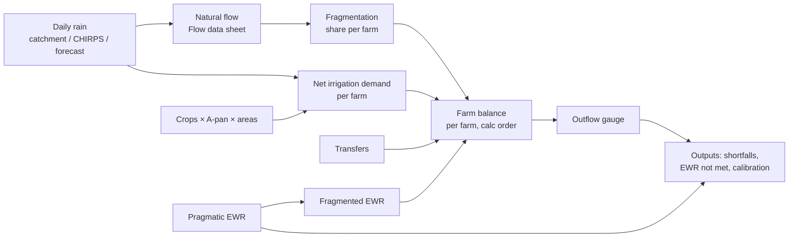

# Model reference

This document explains the water-balance model the web app reimplements. It
covers what the model does, the formulas step by step, where each step lives in
the source Excel workbooks, and which workbook behaviours look like bugs that we
need the hydrologist to confirm.

The engine (`packages/engine`) is a TypeScript port of this model. It is pure
code with no I/O, and it runs both in the browser and in the Lambda. Anything
here that differs from the engine code is a documentation bug. Fix whichever one
is wrong.

- [1. Background](#1-background)
- [2. The b023 model (what V1 ports)](#2-the-b023-model-what-v1-ports)
- [3. Workbook quirks and suspected bugs](#3-workbook-quirks-and-suspected-bugs)
- [4. The AI node-based model](#4-the-ai-node-based-model)
- [5. The AI runoff module](#5-the-ai-runoff-module)
- [6. Porting strategy and regression testing](#6-porting-strategy-and-regression-testing)
- [7. Glossary](#7-glossary)

---

## 1. Background

**Water Balance Tool (WBT) b023** is the Excel/VBA workbook the client used
before this app. It runs a
**daily** water balance for one river catchment, which is a network of farms
(each with an optional composite dam) that drain into one outflow gauge. It
answers three questions:

1. How much natural flow does the catchment produce each day? Rain is turned
   into flow by a calibrated recession model (the app runs GR4J instead,
   §2.4a; the recession model was removed in engine 1.0.0, §2.4).
2. How much of each farm's irrigation demand can be met from its runoff,
   upstream inflow, dam storage and transfers?
3. After irrigation, is the **Environmental Water Requirement (EWR)** still met
   at each farm and at the outflow gauge? If not, by how much is it short?

**One workbook holds one catchment.** In the web app, one workbook becomes one
**project**. The user can keep several projects side by side (place A, B, C…)
and create or copy more.

Source workbooks (kept locally outside the repo, in the private source repo, never committed):

| Workbook | What it is | Status |
| --- | --- | --- |
| the blank b023 template | The b023 template with sample data | Reference for formulas |
| the client workbook | Real catchment: a daily record, a network of farms draining to one outflow gauge, crops and transfers (details in the private source repo) | **Regression target** for V1 |
| an experimental node-based workbook | A node-based daily ledger with pump scenarios and stress classes | Unfinished; later phase |
| an experimental runoff-module workbook | A bucket rainfall-runoff model with one hydrological unit per farm | Unfinished; later, as an alternative flow generator |

---

## 2. The b023 model (what V1 ports)

### 2.1 Pipeline



Units: flows and volumes are **m³/day** internally. The workbook converts m³/s
with `86 400 s/day` (`rAppSet_ConvertSecToDay`). Months are laid out in
**water-year order** (Oct … Sep) wherever the workbook shows a monthly table.

**The run window** (`prepareRun`, `packages/engine/src/prepare.ts`).
`settings.simulationStart` / `simulationEnd` set it when given, and may reach
past the rain (those days run as dry, counted by the "no rainfall value" check,
§2.4). An end left unset follows the **rain record** (engine ≥ 0.45.0, issue
#54): the first (last) day whose rain the model can use, that is catchment
rain, a rain-source period's series (§2.4e), bias-corrected CHIRPS or the
forecast (§2.4b), after the zero-run and accumulation handling (§2.4c–d). A
recorded catchment reading the zero-run handling set aside counts as rain even
when nothing fills it: it is suspect data, not a blank, and runs as 0 mm with
its own warning. Before 0.45.0 the default was the whole span of the rain
series, blanks included, so a rain column padded with blanks to a longer gauge
record (a workbook whose flow record starts long before its rain) ran those
years on 0 mm and distorted every whole-run figure. A
project whose rain has a value on the span's first and last days runs exactly
as before. With no rain value at all the span is kept. Whenever a default end
leaves out days on which the observed, logger or reference flow or the daily
A-pan series has values (trimmed blanks, or a series that starts before the
rain), the run says so: *the run covers the rain record, … to …, and leaves
out … days of observed flow before it (no rain there): set Settings →
simulation start to include them*. The b023 importers
also set `simulationStart` / `End` from the workbook's `[Home]` window when it
cuts the flow record short.

**Rounding.** The workbook rounds at nearly every step (`ROUND(…, 0)` on
fragmented flows, dam splits, return flow, storage and capacity; `INT` on the
rain-added flow; 4 dp on recession indices; 2 dp / 1 dp / 0 dp in the demand
chain; 0, 1 and 3 dp and `ROUNDDOWN` in `[Shortfalls]`). **The engine (≥ 0.4.0)
rounds nothing**: rounding a model state is not neutral. It stopped every
recession at a floor of about `0.5 / (1 − f)` m³/day (`f` the recession
table's tail factor), created or lost water whenever a flow was split (four
equal farms and 2 m³/day of natural flow gave 4 m³/day of runoff), and turned a
0.4 m³ dam into no dam ([audit R1](./engine-audit.md)). The formulas below show
the workbook's rounding for reference, marked *(workbook only)*; the UI and the
exports round for display.

### 2.2 Configuration (the "Cfg" sheets)

| Sheet | Holds | App equivalent |
| --- | --- | --- |
| `[Network]` | Elements (Farm or Gauge), upstream elements (up to 7), "Has transfer?", the one **outflow gauge**. The rows must be in calculation order (upstream first). Bifurcation is not allowed. | `node` rows; `downstream_node_id` gives the tree, and the engine works out the calculation order |
| `[Farm spec]` | Areas (total, high-MAP, low-MAP), the fragmentation method (Area / Hi-Lo / Specific), % upstream inflow "above dam", % farm runoff into dam, dam capacity, initial %, min % for transfers, downstream diversion back to dam (m³/s → m³/day), irrigation return flow % | `node` farm columns + `project.settings.flowShareMethod`, `hiLoSplit`. The return flow % becomes `irrigationEfficiency` and `lossReturnFraction` (N1); the min % is not imported (Q5) |
| `[Crop demand]` | WR90 A-pan evaporation by month, effective-rainfall %, crop factors by month | `settings.apanMm`, `settings.effectiveRainFraction`, `crop` |
| `[Farm demand]` | Crop area (m²) per farm per crop, days per month (Feb = 28.25 by default) | `crop_area`, `settings.februaryDays` |
| `[Transfers]` | Hand-written transfer formulas, plus per-transfer parameters (from, to, months, max m³/s, min dam %) | `transfer` rows (structured rules) |
| `[Flow Calibration Cfg]` | The rain→flow parameters and the recession curve | `settings.calibration`: only the rain threshold and the catchment area since engine 1.0.0 (§2.4) |
| `[EWR Cfg]` | Desktop Reserve Model tables, and the percentile pick with overrides that produce the **pragmatic EWR** (m³/day per month) | `settings.ewrPragmaticM3PerDay` (V1 stores the final table) |
| `[Flow data]` (left block) | Daily inputs: Pitman natural flow, observed gauge flow, logger flow (all m³/s), catchment-average rain, CHIRPS rain, forecast rain (mm) | `time_series` rows by `kind`; the Pitman column is not imported (engine ≥ 0.10.0, [audit P1](./engine-audit.md)) |

Element types: a **Farm** element can also stand for a stand-alone dam or a
natural (unused) area, depending on its parameters (see the `[Models]` sheet). A
**Gauge** only passes flow through and reports it.

### 2.3 Irrigation demand

Sheets `[Crop demand]` → `[Farm demand]` → `[Irrigation Demand]`.

1. **Gross crop requirement (mm/month)** for crop *c* in water-year month *m*:

   `grossMm[c][m] = apanMm[m] × cropFactor[c][m]` (workbook: `ROUND(…, 2)`)

2. **Gross farm demand (m³/day)** for farm *f*:

   `grossFarm[f][m] = Σc area[f][c] × grossMm[c][m] / 1000 / daysInMonth[m]` (workbook: `ROUND(…, 1)`)

   Here `daysInMonth` is 31, 30, 31, 31, **28.25**, 31, 30, 31, 30, 31, 31, 30 for
   Oct…Sep. February is configurable. 28.25 gives a 365.25-day year.

3. **Net daily demand (m³/day)** on day *t*:

   `netDemand[f][t] = MAX(0, grossFarm[f][month(t)] − croppedArea[f] × effRain / 1000 × rainUsed[t])` (workbook: `ROUND(…, 0)`)

   - `croppedArea[f]` = Σ crop areas of the farm (m²).
   - `effRain` = effective-rainfall fraction (a project setting).
   - `rainUsed[t]` is the *thresholded* rain from the Flow data sheet (§2.4).
     Rain at or below the threshold counts as 0, so light rain does not reduce
     demand.

   The crop factors multiply **A-pan** evaporation (`grossCropMm` in
   `packages/engine/src/demand.ts`), not FAO reference evapotranspiration ET₀.
   ET₀ is about 0.7–0.85 × pan, so an FAO-56 Kc entered as it is overstates
   demand by roughly a quarter. The Crops tab says so and points out any factor
   above 1.0 (a hint, not an error).

   Demand always reads A-pan: `apanMm`, or on the days it covers the daily
   A-pan series (§2.3a, engine ≥ 0.38.0). GR4J's own PE input (`settings.pe`,
   §2.4a, engine ≥ 0.31.0) never reaches it, so a monthly PE for GR4J leaves
   demand unchanged.

4. **Soil-water carry-over (engine ≥ 0.14.0, [audit N3](./engine-audit.md)).**
   The workbook's rule above lets rain offset only the day it falls on: a 60 mm
   day cancels one day of demand and the rest is lost. The engine carries
   effective rain over through one soil-water store per farm, a one-bucket form
   of the FAO-56 root-zone balance (Allen et al. 1998, ch. 8), sized by
   `settings.effectiveRainStoreMm` (mm over the cropped area, default **25 mm**:
   0.5 × 100 mm/m × 0.5 m, the readily available water of 0.5 m of roots in a
   soil holding 100 mm/m, FAO-56 Tables 19 and 22). Each day, in this order:

   ```
   Pe        = croppedArea × effRain / 1000 × rainUsed[t]          (m³)
   available = W[t−1] + Pe                   (not capped yet)
   used      = MIN(available, MAX(0, grossFarm))
   netDemand = MAX(0, grossFarm) − used
   W[t]      = MIN(Smax, available − used)   Smax = croppedArea × effectiveRainStoreMm / 1000
   ```

   The store starts empty. Adding the day's rain *before* capping means a big
   rain still covers that day's demand first, however small the store, as the
   workbook's rule does; only what is left after that is capped. Rain above the
   store's size is lost to drainage and runoff (the catchment runoff model
   already counts that water, so nothing is double-counted). With
   `effectiveRainStoreMm = 0`, W is 0 every day and net demand is **bit for
   bit** the workbook's `MAX(0, gross − Pe)` (tested). Demand stays
   precomputed, independent of supply, so the network simulation is
   unchanged. The farm's `effective_rain` working column is now the effective
   rain *used* that day (from the day's rain or the store), and `soil_water`
   is W at the end of the day, in mm.

   This was decided on a simulated hydrologist's recommendation (2026-09-24)
   and is **pending the real hydrologist's review**; the size is a per-project
   setting so they can change it, or set 0 to reproduce the workbook.

   The result, net demand, is the farm's **crop water requirement** F (run
   series `crop_requirement`, the workbook's net irrigation demand).

4a. **Demand factor (engine ≥ 0.41.0, issue #53 R1).** A scenario's
   `demand.scale` op ([scenarios.md](./scenarios.md), "what if everyone takes
   85 %?") gives a farm a `demandFactor`, a multiplier per water-year month
   (absent = 1). It multiplies F after the soil-water store:

   `F[f][t] = demandFactor[f][month(t)] × (MAX(0, grossFarm) − used)`

   so the store, the effective rain used and the gross demand are what they
   were, and D below scales with F. The crop area, efficiency and loss
   return are untouched, so the meaning is "the farm takes 85 % of what it
   would" (deficit irrigation, or a restriction), not a smaller crop. The
   run's own check (`verify/checks.ts` `checkWorkings`) reads the factor.
   `settings.demandFactorFrom` (engine ≥ 0.44.0, issue #53 R5), an ISO date,
   starts the factors on that day: before it every factor is 1 (and a
   user's too, §2.7c). Absent or null means every day, so no run before it
   changes; a value that isn't a date is ignored with a warning. Only the
   seasonal outlook sets it (§2.15), so a demand level changes the season
   and not the history the season starts from. It is not a project setting.

5. **Abstraction demand (engine ≥ 0.16.0, [audit N1](./engine-audit.md))**:
   the farm abstracts enough to cover its application losses,

   `D[f][t] = F[f][t] / e[f]`

   with `e` = `irrigationEfficiency` (0 < e ≤ 1). D is the run series `demand`:
   supply, deficit, the fraction supplied and the curtailment report are all
   measured against it, so "100 % supplied" means the crop got its whole
   requirement (crop use = e × G = F). The workbook has no such step (e = 1).

6. **Irrigation efficiency per crop (engine ≥ 0.43.0, issue #54 item 1).**
   A crop may carry its own `irrigationEfficiency` (0 < e ≤ 1), for the
   system it is under (drip, micro-sprinkler, pivot …). A crop without one uses the farm's own `e[f]`;
   the crop's value **overrides** the farm's, never multiplies it. The farm
   then runs on its crops' efficiencies combined, the harmonic mean weighted
   by each crop's annual gross requirement at the monthly A-pan
   (`farmIrrigationEfficiency` in `packages/engine/src/demand.ts`):

   ```
   w[c]  = area[f][c] × Σm MAX(0, cropFactor[c][m]) × MAX(0, apanMm[m])
   e*[f] = Σc w[c] ÷ Σc (w[c] ÷ e[c])        e[c] = the crop's own, else e[f]
   D     = F ÷ e*[f]
   ```

   The harmonic mean is the one that keeps both halves of the balance exact
   when F is shared among the crops by their gross: the abstraction is
   Σ F[c] ÷ e[c], and the application losses (1 − e*)·G are each crop's
   (1 − e[c])·G[c] summed, so the return flow β(1 − e*)G and the consumptive
   use are right too. e* always lies between the smallest and largest
   efficiency it combines, and lowering any crop's efficiency never lowers
   the farm's demand (both tested). With no A-pan in any month the weights are
   area × Σ crop factor; a farm with no requirement at all keeps `e[f]`. A
   value outside (0, 1] (a hand-edited document) is ignored with a warning and
   the farm's is used.

   *What it leaves out.* e* is one number per farm, not per month: the network
   step (`network/simulate.ts`), the EWR attribution and the curtailment
   report all keep one efficiency per farm. A farm with a winter crop on one
   system and a summer crop on another abstracts, in each month, the annual
   blend rather than that month's; over the year the weighting by requirement
   keeps the totals close. A per-month e* would need the network step to take
   a daily efficiency (a larger change, for the hydrologist to ask for if the
   farms warrant it). The crop factors themselves are unchanged: which crop
   set a catchment uses, and which system each farm's crops are under,
   awaits the hydrologist (issue #54, Q9/Q10; the client chose drip as the
   new-farm default, issue #90).

   A farm none of whose cropped crops sets one returns `e[f]` untouched, so a
   model without crop efficiencies runs **bit for bit** as before (tested on
   the example catchments). Readers of a saved run that recompute with the
   efficiency (the run checks in `verify/checks.ts`, the farmer projection and
   the reporting-window curtailment, `views/farmProjection.ts`) derive e* the
   same way from the run's own model snapshot and `apanMm`.

7. **Monthly effective-rain fraction (engine ≥ 0.43.0, issue #54 item 1).**
   `settings.effectiveRainFractionMonthly` (12 values, 0–1, water-year order
   Oct–Sep) replaces `effRain` month by month in step 3–4: day *t* uses the
   fraction of its own month, `Pe = croppedArea × effRainMonthly[month(t)] ÷
   1000 × rainUsed[t]`. Everything else stays: the rain threshold, and the
   soil-water store, which still carries the effective rain over (so a month's
   rain can cover the next month's first days). null / absent = the one
   `effectiveRainFraction` in every month; the annual fraction written out 12
   times gives the identical run (tested).

   It is **never defaulted to 0**: a row of zeros means rain never reduces
   irrigation demand (issue #54), and the engine's effective rain and soil-water store are the better
   hydrology (CLAUDE.md rule 10) and stay. A modeller may still enter a row of
   zeros, and the run then warns that rain never reduces irrigation demand. A
   row that isn't 12 numbers in 0–1 is ignored with a warning (the annual
   fraction is used).

8. **Reference crop library (issue #54 item 1).** Reference data for the
   Crops tab's *Load crop factors* dialog ([ui.md § Load crop factors](./ui.md#load-crop-factors)), in
   `frontend/src/lib/components/crops/library.ts`. It is not part of the
   engine and changes no project on its own: a modeller loads it into the
   crop table, sees the diff and the demand change, and saves (History records
   it). **Which crop set a catchment uses stays the hydrologist's decision**
   (issue #54 Q9/Q10; the decision and evidence go in `docs/engine-audit.md`
   once made).

   - **Crop factors**: the A-pan design crop factors (f = kp × kc, eq. 4.7)
     of the [ARC/SABI Irrigation Design Manual, ch. 4](https://sabi.co.za/wp-content/uploads/2025/04/Chapter-4-Crop-water-requirements.pdf),
     winter rainfall area (June 1990): Table 4.13 perennial crops (citrus,
     table grapes, deciduous fruit late / medium / early, wine grapes, pasture
     mixed and kikuyu, alfalfa, guavas; p. 4.50), Table 4.14 agronomic crops
     (mealies, wheat, soya beans, potatoes at four planting dates; p. 4.51),
     Table 4.15 vegetables (beans, brassicas, cucurbits, peas, onions,
     tomatoes; p. 4.51), and pecan from the summer-rainfall Table 4.10
     (p. 4.47), since the winter table has none. Every value is copied as
     printed and pinned by `library.test.ts` against an independent
     transcription.
   - **Conversions**, both reproducible and tested: the tables' Jan–Dec to
     the model's Oct–Sep; a blank Table 4.14 cell is 0 (not in the ground),
     and a part month at planting or harvest keeps its printed factor
     (not prorated). Table 4.15 gives a factor per fifth of the growing
     season, so a vegetable needs a planting date and a season length, which
     the modeller gives (the dialog offers Table 4.7's season lengths, e.g.
     onions, autumn transplant, 160 days; it assumes no planting date). Day
     *k* of the season takes the factor of its fifth, `stages[⌊5k ÷ days⌋]`,
     and a month's factor is the sum over its days ÷ its days (days outside
     the season 0), rounded to 3 decimals, so area × factor × A-pan gives the
     month's requirement.
   - **Irrigation systems**: efficiency ranges from the [SABI Agricultural
     Design Norms 2021](https://sabi.co.za/wp-content/uploads/2023/02/SABI-Norms-Agricultural-2021.pdf),
     Table 4 (drip 90–95 %, micro-sprinkler 80–85 %, centre pivot / linear
     80–90 %, permanent sprinkler 75–90 %, movable sprinkler 70–83 %,
     surface 60–95 % across its piped, lined and earth canal rows). The
     dialog offers issue #54 Q10's values (0.90, 0.82, 0.85, 0.80, 0.75,
     0.70), each inside its range but not always the midpoint. The table
     lives in the engine (`IRRIGATION_SYSTEMS` in `project.ts`, the library
     re-exports it), so the node form's system helper, this dialog and the
     farmer view's system word all read the same values; drip is the
     new-farm default (issue #90). Each library
     crop names a typical system as a hint only; a crop's efficiency changes
     only when the modeller picks a system.
   - **Pan coefficient**: the dialog multiplies the source factors by an
     optional Kp (default 1). A-pan tables and b023 factors already multiply
     A-pan, so Kp stays 1 for them; an FAO-56 Kc set (against ET₀) needs
     about 0.75 (issue #54).
   - **Caveats** (issue #54): A-pan factors are site-specific design values
     from 1990; an orchard cover crop raises them by about 0.2–0.25; newer
     WRC orchard studies should be checked. The engine's maths is unchanged
     (no `ENGINE_VERSION` bump): the dialog's demand difference uses the
     same `grossFarmDemandM3PerDay` and `farmIrrigationEfficiency` a run uses.

### 2.3a Daily A-pan evaporation (engine ≥ 0.38.0, issue #45)

`settings.apanMm` holds 12 monthly means (WR90 / WR2012). A hydrologist often
has a daily Class-A pan record from a nearby weather station as well. It is
uploaded like rain (Data tab → Add data, kind **Evaporation — A-pan, daily**)
as the series `evap_apan_mm`, in mm/day (mm, cm or inches accepted, stored in
mm), and is used by `packages/engine/src/evaporation/apanDaily.ts`.

**Precedence, day by day.** On a day the series has a value ≥ 0, that value
is the day's A-pan. On any other day (no value, a negative value, or a day
outside the record) the day's A-pan is the month's mean spread over the
month, exactly as a run without the series. Wherever the model reads A-pan:

| Consumer | A day the series covers | Any other day (unchanged) |
| --- | --- | --- |
| Crop demand (§2.3), gross farm demand, m³/day | Σ area × crop factor[month] × `apan[t]` ÷ 1000 | `grossFarmDemandM3PerDay`: Σ area × `apanMm[month]` × crop factor ÷ 1000 ÷ days in month (28.25-day February) |
| Dam evaporation depth (§2.7a), mm/day | lake factor[month] × `apan[t]` | lake factor[month] × `apanMm[month]` ÷ days in month (28.25-day February) |
| GR4J PE under `pe.kind: 'pan'` (§2.4a), mm/day | pan coefficient[month] × `apan[t]` | pan coefficient[month] × `apanMm[month]` ÷ calendar days in month |

Under `pe.kind: 'monthly'` GR4J runs on the monthly PE row and reads neither
the A-pan means nor the daily series; demand and dams still read both. A daily record doesn't change
the crop factors, the lake factors or the pan coefficient: they multiply the
day's A-pan the same way they multiply the monthly mean.

**Fallback, counted and reported.** The run records
`summary.apanDaily = { dailyDays, fallbackDays, invalidDays, first, last }`:
the run days the series supplied, the days that used the monthly mean, how
many of those had a negative value, and the first and last day supplied.
When any day falls back, a run warning says so ("daily A-pan evaporation
covers 3650 of 7305 run days (… to …); the other 3655 use the monthly
A-pan mean spread over the month"), adding when the monthly means are all 0
that those days then have no crop demand, dam evaporation or GR4J
evaporation. A series with no usable day in the run says every day uses the
monthly means. A negative value is also the series check's "negative value"
warning (§2.10a). Flat stretches of 7 or more days of one non-zero value are
flagged (a monthly mean pasted into a daily record looks like that), and the
outlier check uses the rain factor. A forecast run's forecast days (§2.4f)
are past the record, so they fall back to the monthly means and are counted.

**No series, no change.** Without an `evap_apan_mm` series nothing above
runs: every consumer keeps its monthly expression, the summary has no
`apanDaily` and no warning is added, so results are byte-identical to engine
0.37.0 (the client catchment regression suite and the invariant suites run
unchanged; `apanDaily.test.ts` holds the positive control that the series
does move the outputs it should). `ENGINE_VERSION` went to **0.38.0**
because the model gained an input.

**Every path sees the same input.** All consumers read the series through
`prepareRun`'s `aligned`, so runs, automatic calibration (`prepareCalibration`,
in the browser worker and server-side), the uncertainty ensemble, forecast
mode, scenarios and firm yield use the same days. The "no evaporation, no
run" refusal (`GR4J_NO_PET`, §2.4a) counts a daily series with a value above
0, under `pe.kind: 'pan'` with a pan coefficient above 0, as evaporation, so a
project with only a daily record runs. A run stores the series in its inputs
(`run_input_series`, like every input series), so re-running it reproduces
the same days. `pnpm pan-sensitivity` reads the series from a project.json
too, so its cases vary the coefficient that multiplies the daily A-pan on the
days it covers.

**Scenarios.** `series.scale` can scale the daily series (it is in
`SCALABLE_SERIES_KINDS`). A `settings.set` on `apanMm` reaches only the days
the series doesn't cover, so a scenario that raises evaporation on a project
with a daily record scales the series as well.

**Fit provenance.** A calibration's fit record (§2.10b) records the daily
series it ran on as `forcing.apanDaily`: its start, length and the SHA-256 of
its values (the hash a run's input snapshot keeps as `valuesSha256`), or null
when the project had none. Adding, replacing or removing the series after a
GR4J fit made under pan coefficient × A-pan marks the fit stale
(`apanDailyChanged`, and with it `forcingChanged`), with its own caveat (engine
≥ 0.40.0, which bumped the version for the new fit-record field; see §2.10b).
The run's `fitStatus` (in-sample or not, §2.10) is unaffected: the scored days
are still the fitted ones.

### 2.4 Natural flow from rain (`[Flow data]`)

**Retired in engine 1.0.0 (issue #16, 2026-09-26).** The engine's runoff
model is GR4J (§2.4a); this section keeps a short record of the workbook's
routine and says what outlived it.

**What it was.** b023 turns rain into natural flow with a calibrated
recession routine, one row per day reading the previous row. A day's rain
above a threshold (2 mm by default) adds a peak of `a · rain^b` (`a` and `b`
calibrated) times the catchment area and a summer or winter factor (also
calibrated; a big enough rain opens the winter response outside the fixed
summer months). The flow then
recedes day by day along an 80-row recession table (flow → daily factor), and
a storm peak above 1.5 × the receded base flow resets the base flow to the
peak. The parameters sit in `[Flow Calibration Cfg]`. The engine ported it as
the `legacy` runoff model (`flow.ts`), without the workbook's rounding (audit
E1, E2, R1).

**Why it went** ([audit H1](./engine-audit.md)). The base-flow reset makes a
storm's peak recede along the *slow* part of the curve, so the routine does
not conserve water at the event scale: a single 10 mm winter storm on a dry
catchment returns several times its own rain over the next year, and small
storms return relatively more than large ones. Calibrated annual totals can
still look plausible only because the parameters compensate. GR4J became
the default in engine 0.11.0, legacy runs were labelled workbook comparison
only (`LEGACY_NOT_EVIDENCE`, 2026-09-24), GR4J was decided as the model on
record on 2026-09-25, and engine 1.0.0 removed the legacy model. Before it
went, the client catchment regression suite compared its natural flow with
the workbook's end to end; the last run, on engine 0.45.0 (2026-09-26),
passed within E1/R1 (B1 years aside), and `packages/engine/src/run.test.ts`
keeps that record.

**What outlived it:**

- **Rain used** (column R): the first non-blank of catchment rain, CHIRPS
  (bias-corrected per calendar month since engine 0.7.0, §2.4b, audit B1;
  the workbook used it raw) or forecast rain. GR4J reads it without a
  threshold (§2.4a). Irrigation demand reads it thresholded: rain at or
  below `settings.calibration.rainThresholdMm` counts as 0 (§2.3).
- **`settings.calibration`** keeps only `rainThresholdMm` and
  `catchmentAreaKm2` (the area rain falls on, null = the sum of the farm
  areas). The legacy model's keys (`RETIRED_CALIBRATION_KEYS`: `a`, `b`, the
  season factors, summer months and winter thresholds, the initial base flow,
  the reset ratio, the shift-peak indices, the amplitude, `DaysMax` and the
  recession tables) are dropped when settings are read, and migration 064
  removed them from stored projects. The importers read only the threshold
  and the area from `[Flow Calibration Cfg]`.
- **`settings.runoffModel`** is the run's record of its model, not a choice:
  `'gr4j'` is the only value the API accepts. A project still stored as
  `'legacy'` runs GR4J with a `LEGACY_UPGRADED: …` warning.
- **Stored legacy runs** (settings that name no runoff model, or `'legacy'`)
  stay readable and are never re-run. They keep the amber "Workbook
  comparison" badge, their CSV exports start with a `# runoff_model=legacy;
  …` comment line, and they still can't be nominated as evidence, signed off
  or published. `LEGACY_RUNOFF_COLUMNS` (§2.7) still explains their daily
  columns.

**Checks on every run** (warnings, engine ≥ 0.4.0; [audit W1–W5](./engine-audit.md)):

- **Runoff coefficient** = natural-flow volume / rain volume on the catchment
  over the run (`summary.catchment.runoffCoefficient`). GR4J conserves water,
  so above 1 only its stores draining (or imported groundwater) can do it,
  and the warning says which. Natural flow a caller supplies
  (`runModelWith`) gets the plain "more runoff than rainfall" warning.
- **Days with no rainfall value** from any source are counted: the model treats
  them as dry (0 mm), for runoff and for demand. Since engine 1.16.0 the
  warning names their date ranges (the first three, then how many more
  periods) and how many fall in the reporting window, so a reader sees when
  "this week" ran on blank days (a logger outage before a forecast).
- The recession-table check (W4) went with the model.

The same sheet also:

- Picks the **observed** flow series used for calibration: Pitman (1), gauge
  (2) or logger (3) via `rUseFlow`. It converts it to m³/day (the workbook rounds).
  The app offers only the gauge and the logger (engine ≥ 0.10.0, audit P1).
- Carries the **pragmatic EWR** for the day's month (AF), the **simulated
  outflow** at the outflow gauge (AG), an "EWR not met" flag (AJ = 1 when
  AG < AF) and the shortfall volume (AK = AG − AF when not met).
- Reports mean annual runoff and mean daily runoff (all days and summer only)
  for observed and simulated flow.

### 2.4a Rain to flow: GR4J (engine ≥ 0.5.0, issue #4)

The engine's runoff model is **GR4J** (Perrin, Michel & Andréassian 2003, *J. Hydrol.* 279), a
published daily rainfall–runoff model with four parameters. It is written from
the paper's equations in `packages/engine/src/runoff/gr4j.ts`. The reference
implementation, the R package airGR, is GPL-2, and no code is taken from it.
Everything downstream (flow shares, farms, dams, transfers, EWR) is the same
as under the legacy recession model (§2.4) it replaced, so a stored legacy run
and a GR4J run compare day by day. GR4J was selectable from engine
0.5.0, the default from 0.11.0 (the calibration research's CR-17), and the
only runoff model from 1.0.0 (issue #16). `settings.runoffModel` records it
(`'gr4j'`); a stored run whose settings name no runoff model predates the
setting, so run comparison reads it as legacy.

**Parameters** (`settings.gr4j`). The typical range is Perrin's 80 % range over
429 catchments; the bounds are enforced by the API and searched by calibration.

| Param | Meaning | Unit | Default | Typical | Bounds |
| --- | --- | --- | --- | --- | --- |
| `x1` | production (soil-moisture) store capacity | mm | 350 | 100–1200 | 10–3000 |
| `x2` | groundwater exchange coefficient | mm/day | **0** (fixed) | — | −5–3 (opt-in) |
| `x3` | routing store reference capacity | mm | 90 | 20–300 | 1–1000 |
| `x4` | unit hydrograph time base | days | 1.7 | 1.1–2.9 | 0.5–10 |
| `warmupDays` | warm-up before day 1 | days | 365 | — | 0–3650 |

**Forcing** (`runoff/simulate.ts`, `runoffForcing`):

- **Rain P**: catchment rain, else CHIRPS (bias-corrected, §2.4b), else
  forecast (rain used, §2.4), with **no rain threshold** (the threshold was
  part of the legacy model; it still applies to demand's effective rain). A day with no
  value is dry, and the run counts those days (W2). Negative values count as 0.
- **Potential evaporation E** (engine ≥ 0.31.0, issue #39) is the month's PE
  from `settings.pe` (`gr4jPeMonthlyMm`), spread evenly over the days of that
  calendar month, so each month's PET totals exactly that month's PE:
  - `{ kind: 'pan' }`, the default: PE = `panCoefficient[month] ×
    apanMm[month]`. This is what every run did before 0.31.0, and a project
    saved without `pe` runs it; its results are byte-identical. On a day a
    daily A-pan series covers (engine ≥ 0.38.0, §2.3a) the day's PE is
    `panCoefficient[month] × apan[t]` instead of the month's share.
  - `{ kind: 'monthly', mm, source }`: PE is `mm[month]` directly, 12
    water-year values in mm (for example a station FAO-56 ET₀ × a stated
    factor), spread over the month's days the same way. `source` says where
    the values came from (required, at most 600 characters). The pan
    coefficient is not used.

  Irrigation demand (§2.3) and dam evaporation (§2.7a) always read A-pan
  (`apanMm`, and the daily A-pan series where it has a value, §2.3a),
  whichever kind is chosen, so a monthly PE moves only the runoff model.

  **Why a separate input.** Before 0.31.0 one A-pan row drove three things:
  crop demand, dam evaporation and GR4J's PE. South African practice keeps
  them apart: Pitman/WRSM2000 runs on S-pan, reservoir evaporation is S-pan ×
  lake factors, ACRU uses an A-pan-equivalent reference, and SAPWAT uses
  ET₀ × Kc. A monthly PE lets GR4J run on its own evaporation (a station
  ET₀, say) without moving the demand or the dams.

  `settings.panCoefficient` is 0.7 in every month by default and is
  edited per month (question 4 for the hydrologist). It doesn't touch
  irrigation demand. **It is held fixed, never calibrated**: it trades off
  against X1/X3 (a higher coefficient and a smaller store fit the same
  record), so automatic calibration (§2.10b) never searches it, and each fit
  records the coefficient (and, from the same forcing snapshot, the A-pan,
  the PE input and the CHIRPS bias correction mode) it ran under — a later
  change to any of them is fit provenance's `forcingChanged` (§2.10b). A
  monthly PE row is held fixed in the same way, for the same reason.
  - **Presets** (`PAN_COEFFICIENT_PRESETS`, `packages/engine/src/project.ts`;
    a simulated hydrologist recommendation, pending the real one). Three
    water-year (Oct–Sep) starting points a Settings picker can fill the row
    with — the row stays monthly and editable after; picking one writes its
    name into `panCoefficientSource` (below), which stays editable too:
    | Preset | Oct–Mar | Apr–Sep |
    | --- | --- | --- |
    | Generic | 0.70 every month | 0.70 every month |
    | Winter rainfall (e.g. Western Cape) | 0.70, 0.65, 0.65, 0.65, 0.65, 0.70 | 0.75, 0.80, 0.80, 0.80, 0.80, 0.75 |
    | Summer rainfall | 0.65, 0.70, 0.75, 0.75, 0.75, 0.75 | 0.70, 0.70, 0.70, 0.65, 0.60, 0.60 |

    They are **indicative only**: rough readings of FAO-56 Table 5 climate
    classes (Allen et al. 1998), not values for any particular pan. Confirm
    against the pan's siting, local humidity and wind, and a local ET₀,
    before relying on them.

    **Reading FAO-56 Table 5 (issue #13, revised after review).** Table 5
    gives the Class A coefficient Kp by mean RH, wind at 2 m, the pan's
    siting and its upwind fetch. Two readings from issue #13:

    - **One pan can swing a lot between seasons.** Wind and RH both change
      with the season, so a single enclosure (Case A, pan in a short green
      crop, about 10 m of fetch) can read **0.60–0.70** in a dry, windy
      summer (moderate wind, RH near 40 %) and **0.85** in a calm, humid
      winter (light wind, RH above 70 %). A seasonal step of 0.10–0.25 is
      not by itself a sign of an inconsistent preset. (An earlier reading,
      for moderate wind only, concluded the step should be about 0.05; that
      was wrong. The preset change it proposed was not made, and issue #39
      became the separate PE input above and the Table 5 helper below.
      There is no rule on the seasonal step.)
    - **Dry, bare surroundings pull Kp down.** FAO-56 says to reduce Kp by
      5–10 % in moderate conditions and by up to 20 % where the surroundings
      are arid, windy and bare. A summer Kp of 0.55–0.60 is plausible for an
      exposed pan in dry veld.
    - **Ensemble range.** For an uncertainty ensemble (CR-21), a generic
      range of **0.55–0.80 in the dry season and 0.60–0.85 in the wet
      season** covers the sitings above (the 0.55 end sits just under the
      plausibility band below, so the run will warn). Treat Kp and the A-pan level
      together: it is PE (Kp × A-pan, under `pe.kind: 'pan'`) that the model
      sees.
    - **Cross-check against ET₀, but check the ET₀ first.** FAO-56
      Penman–Monteith ET₀ should come out at about Kp × A-pan. Gridded
      reanalysis ET₀ (NASA POWER, MERRA-2 based, say) can read far too high,
      tens of percent above a nearby weather station's FAO-56 ET₀ over the
      same days, which is enough to flip which A-pan level the check favours. Compare the
      reanalysis against any station ET₀ in or near the catchment (the ARC
      agro-climatic network, provincial agricultural weather networks, or a
      research orchard station) before using it, and scale it if they
      disagree. A station ET₀ record is often the most useful single piece
      of evidence on the PE level.

    **FAO-56 Table 5 helper (engine 0.31.0, issue #39).**
    `packages/engine/src/evaporation/fao56Table5.ts` (`fao56Kp`,
    `fao56KpMonthly`) looks up the Class A pan coefficient in FAO-56
    chapter 4, Table 5 (Allen et al. 1998, itself from FAO-24;
    https://www.fao.org/4/x0490e/x0490e08.htm), transcribed cell for cell.
    Settings uses it to suggest a monthly row from each month's mean RH and
    wind at 2 m, the pan's siting and its fetch.

    - **Siting.** Case A: pan in a short green crop, fetch = the upwind
      distance of green crop. Case B: pan in a dry fallow area, fetch = the
      upwind distance of dry fallow.
    - **RH classes** follow the table's wording: low < 40 %, medium 40–70 %
      (both 40 and 70 are medium), high > 70 %.
    - **Wind classes** (m/s at 2 m): light < 2, moderate 2–5, strong 5–8,
      very strong > 8. 2 is moderate. The table's ranges share the
      endpoints 5 and 8; this is a stated reading that puts each in the
      lower class (5 is moderate, 8 is strong), as "> 8" leaves 8 itself to
      strong.
    - **Fetch** is one of the table's four distances, 1, 10, 100 or
      1000 m. There is no interpolation: every suggested value is a cell of
      the published table. FAO-56 Table 7's regression equations in
      ln(fetch) are a fitted approximation of the table, so they are
      deliberately not used.
    - **Reduction.** FAO-56 says Kp may need reducing by up to 20 % in
      arid, windy areas with extensive bare soils (Case B, large fetch), and
      by 5–10 % in moderate conditions. The helper takes an optional stated
      reduction of 0–20 %, never applied by default, and its note says when
      one was.

    The helper only fills the pan-coefficient row and its source note; the
    values stay editable. The note, `settings.panCoefficientSource` (engine
    ≥ 0.31.1, free text up to 600 characters, '' = none), reads e.g. "FAO-56
    Table 5, Case A, 10 m green crop fetch; RH and wind: <the user's note>".
    It is provenance only: the model never reads it, a fit records it as
    `forcing.panCoefficientSource`, and editing it alone never marks the fit
    "Forcing changed since fit" (like the monthly PE's `source`). It doesn't make the presets
    more than indicative, and it sets no rule on how far Kp may step
    between seasons (Table 5 itself moves with the season's wind and RH).

    **Check the A-pan row before choosing a coefficient** (issue #13). A
    workbook's A-pan row isn't necessarily raw A-pan.

    - **A pre-scaled row.** A row already multiplied by a pan or lake
      factor (0.7 × A-pan, i.e. an ET₀, open-water or S-pan-like estimate)
      makes GR4J's coefficient count twice unless the coefficient is chosen
      against that row. Ask whoever built the row what it was converted to
      and why before "correcting" it: the conversion may have been
      deliberate, for the crop demand.
    - **Under `pe.kind: 'pan'` the same row drives three things.** Crop
      demand is crop factor × A-pan (§2.3). Dam evaporation is lake factor ×
      A-pan (§2.7a). GR4J PE is Kp × A-pan. Changing the row to change PE
      also changes the irrigation demand and the dam evaporation. To test PE
      alone, enter a monthly PE (`pe.kind: 'monthly'`, engine ≥ 0.31.0),
      which leaves the row to demand and the dams. Moving `panCoefficient`
      also works under `pan`, but the value may then sit outside the
      0.6–0.85 plausibility band; that is an artefact of the shared row, and
      the run notes should say so.
    - **Checks on the row:**
      1. Compare the row with the WR90/WR2012 **S-pan** MAE for the
         quaternary. An A-pan reads *higher* than a Symons S-pan beside it,
         so a row labelled A-pan whose annual total is below the S-pan MAE
         is either not raw A-pan or from somewhere else. Bosman (1990,
         *Water SA* 16(4):227–236) gives the SA inter-conversion and
         bird-screen formulae. Taljaard (2023, MEng, Stellenbosch) finds the
         relationship linear and the old annual equations still valid, and
         proposes monthly ones. A row well *above* the MAE can also come
         from a hotter, lower station.
      2. The ET₀ ratio above, with a station-checked ET₀.
      3. Provenance. Values that are each a whole number of mm when
         multiplied by n are means of n whole-mm readings; that dates the
         record, but doesn't say which instrument it came from.
      4. Screening. SA pans were often bird-screened, which cuts pan
         evaporation by up to about 10 % (FAO-56 ch. 4). A screened record
         needs the Bosman correction, or a coefficient at the high end of the
         range.
    - **Calibration can't pick the PE level.** GR4J's production store X1
      absorbs much of the PE level, so fits at quite different PE can close
      the water balance equally well; a better NSE at one level is usually
      hydrograph shape and timing. Compare fits on volume (PBIAS, AET) as
      well as NSE. And look at where NSE comes from: when a rating is
      extrapolated far above its highest gauging, the days on that limb can
      carry most of the NSE variance, and the preferred PE level can flip
      when they are down-weighted or masked. Refit with the high limb
      perturbed before trusting a preference.
    - **Rain and PE compensate in one direction.** With the observed flow
      fixed, rain that reads high needs *more* loss (higher PE, or a larger
      X1). A fit that prefers low PE points to rain reading low, flow
      reading high (an over-extrapolated rating), or under-counted
      abstraction, not to rain reading high. Settle rain level and PE
      together ([calibration-research.md](./calibration-research.md)).
    - **Report the spread.** Until the PE level is settled, carry low,
      middle and high PE through to the results that decide anything (EWR
      compliance, curtailment, MAR), refitting at each, and report the band.
  - **Plausibility warning.** A run warns, and Settings hints
    (`panCoefficientOutOfRange`), when a month sits outside **0.6–0.85**,
    FAO-56's usual range for a Class A pan. This is a soundness check, not a
    bound: the API keeps the wider 0–2 it always has, so a stored project with
    a coefficient further out still loads, saves and runs — the warning just
    says so. All three presets sit inside 0.6–0.85. From engine 0.31.0 the
    run warns only under `pe.kind: 'pan'`: with a monthly PE, GR4J doesn't
    use the coefficient.
  - **Testing the effect of a choice.** The sensitivity runs (§2.10g,
    CR-21, engine ≥ 1.19.0) move the pan coefficient ±15 % with GR4J's
    parameters held fixed, beside rain, dam evaporation, abstraction and the
    dams' starting storage, and report EWR compliance as a range.
    `pnpm pan-sensitivity <project.json>`
    (`backend/scripts/pan-sensitivity.ts`) is the deeper manual check of the
    pan coefficient alone, **refitting** at each value: it runs GR4J at a few
    values (flat 0.60, 0.70, 0.85, and a preset) and reports MAR, Q95 and EWR
    compliance, both with GR4J's parameters held fixed and refitted, scored
    against the logger record. The script takes any project.json and carries
    no client data; a report run against the client catchment
    (`data/client-catchment/`, gitignored) stays local, never committed, per
    the public-repo rule. It refuses a project whose `pe.kind` is
    `'monthly'`: the pan coefficient doesn't reach GR4J there, so every case
    would give the same numbers. Set `settings.pe` to `{ kind: 'pan' }` in a
    copy of the project.json to see the pan-coefficient sensitivity.
    To compare *fits* across pan presets together with other fit settings
    (bounds, objective, exclusions, the WR2012 band), use `pnpm fit-sweep`
    (§2.10b).
- **No evaporation, no run** (engine ≥ 0.11.1). When GR4J's PE is 0 in
  every month (A-pan × pan coefficient under `pan`, or the monthly PE row
  under `monthly`, engine ≥ 0.31.0), GR4J is refused (`GR4J_NO_PET`), as a
  run with no rainfall is. Without evaporation the production store only fills,
  so nearly all rain becomes flow; before 0.11.1 this was only a warning,
  which a new project (A-pan defaults to 0) met on its first run once GR4J
  became the default. Settings shows the same check (`hasPotentialEvaporation`)
  beside the model picker, and a fit is refused the same way.
- **No Pitman fallback.** Flow is whatever the model produces.

**One day** (P, E in mm):

1. **Net rain and net evaporation:** if P ≥ E then Pn = P − E and En = 0;
   otherwise Pn = 0 and En = E − P.
2. **Production store S:**
   Ps = X1·(1 − (S/X1)²)·tanh(Pn/X1) / (1 + (S/X1)·tanh(Pn/X1)) and
   Es = S·(2 − S/X1)·tanh(En/X1) / (1 + (1 − S/X1)·tanh(En/X1)).
   Then S ← S − Es + Ps.
3. **Percolation:** Perc = S·{1 − [1 + (4S/(9·X1))⁴]^(−¼)}, and S ← S − Perc.
4. **Routed water:** Pr = Perc + (Pn − Ps). 90 % goes to UH1 and 10 % to UH2.
5. **Unit hydrographs:** each ordinate is j = SH(j) − SH(j − 1).
   - UH1 has SH1(t) = (t/X4)^2.5 for 0 < t < X4, and ⌈X4⌉ ordinates.
   - UH2 has SH2(t) = ½(t/X4)^2.5 up to X4, then 1 − ½(2 − t/X4)^2.5 up to
     2·X4, and ⌈2·X4⌉ ordinates.
   - Both sum to 1. Each keeps a queue of water in transit. Q9 is today's UH1
     output and Q1 is today's UH2 output.
6. **Exchange:** F = X2·(R/X3)^3.5. It is 0 when X2 = 0.
7. **Routing store:**
   - R ← max(0, R + Q9 + F);
   - Qr = R·{1 − [1 + (R/X3)⁴]^(−¼)};
   - R ← R − Qr.
8. **Direct flow:** Qd = max(0, Q1 + F).
9. **Flow:** Q = Qr + Qd, in mm over the catchment. Natural flow (m³/day) =
   Q × area (km²) × 1000, over the catchment area
   (`calibration.catchmentAreaKm2`, else the sum of the farm areas).

**Fluxes recorded:**

- AET = min(P, E) + Es.
- The applied exchange is the exchange left after the two clips:
  (R after the max − R before − Q9) + (Qd − Q1).

**The balance closes every day:**
P − AET − Q + exchange = Δ(S + R + water in the UH queues), to 10⁻⁹ mm. With
X2 = 0 the model is closed: water leaves only as evaporation or flow, or stays
stored. So a storm can never return more than fell, which fixes audit H1 by
construction.

**Warm-up.** The stores start half full (S = ½·X1, R = ½·X3) with empty queues.
The model then runs `warmupDays` days that cycle the run's own forcing from its
first day. Day k of the warm-up uses day k mod n, so a warm-up longer than the
run repeats it. Warm-up days are never output or scored. Day 1 starts from the
warm-up's end state.

**Outputs.** GR4J adds these catchment series:

- `rain_used` and `pet`;
- `aet`;
- the end-of-day stores `production_store`, `routing_store` and `uh_store`
  (water in transit);
- `exchange`, only when X2 ≠ 0.

`summary.runoff` holds the parameters used, the area and the whole-run totals
(rain, PET, AET, flow and exchange), plus the storage at the start (after the
warm-up) and at the end. Those totals satisfy
rain − AET − flow + exchange = end − start. When a short run's natural flow
exceeds its rain, the W1 warning names the starting storage instead of blaming
the calibration. An out-of-bounds parameter in stored settings (the API rejects
them) falls back to its default with a warning.

### 2.4b CHIRPS fallback bias correction

Engine ≥ 0.7.0, [audit B1](./engine-audit.md), `packages/engine/src/rain.ts`.
Setting: `settings.chirpsBiasCorrection`, `'monthly'` (default) or `'none'`;
and from engine 0.29.0 `settings.chirpsFitPeriod`, which years the factors are
fitted on ([below](#fit-period-and-per-range-factors-engine--0290-issue-40)).

**Why.** Rain used (column R, and GR4J's P) falls back to CHIRPS on every day
the catchment rain is blank. CHIRPS is a 0.05° satellite-and-gauge product.
At the scale of a small catchment it can read a fraction of the
catchment's own gauges, and by different amounts in different seasons:
frontal and orographic rain on the ridges is what a satellite estimate
misses most. Used raw, a year whose
catchment rain is missing runs far too dry. The legacy model (§2.4, removed
in engine 1.0.0) hid some of this, because its base-flow reset made flow out
of little rain (H1). GR4J
conserves water, so in those years it makes too little flow. Correcting the
fallback was the first condition for adopting GR4J in the hydrologist's
review of issue #4 phase 6.

**The factors.** For each calendar month *m*:

  factor(m) = Σ catchment rain / Σ CHIRPS, over the days in month *m* where
  both series have a reading (present, finite and not negative).

- **Suspect catchment rain is left out** (engine ≥ 0.18.0). Zeros that may
  be missing data would drag the factors down, so the fit leaves out:
  - every **low-vs-CHIRPS** water year (§2.10a), whole. A year that reads
    half its usual share may be partly zero-filled anywhere in it, and
    nobody has said which days;
  - the days of every **flagged zero-rain run that is not kept dry**, one by
    one, like the days of periods listed as missing in
    `settings.zeroRainRuns.missing` (§2.4c). A run set aside as missing
    tells the fit exactly which days are bad, so the rest of its water year
    is good data and stays in. In `'asRecorded'` mode every flagged day is
    left out this way: that mode runs them dry as a blanket choice, not
    because anyone confirmed them;
  - the days of every **multi-day accumulation window** (§2.4d; engine ≥
    0.20.0), one by one, in either accumulation mode, except a reading kept
    as recorded. Their recorded days are wrong (zeros, then the lot on one
    day), and their spread days are CHIRPS-shaped, so fitting on either
    would be circular. Keeping the windows' totals in instead would not be
    neutral either: detected windows tend to read under the usual
    catchment / CHIRPS ratio (an unread gauge loses water, and the detection
    test itself prefers windows CHIRPS reads a lot over), so they would drag
    the factors down.

  **Kept-dry days stay in**, as confirmed readings. Leaving out real dry
  spells would be selection bias: they are the days when the catchment reads
  0 and CHIRPS its false-positive drizzle, so dropping them pushes every
  factor up. Up to engine 0.17 the fit dropped every water year a flagged
  run touched, kept dry or not.

  **Keep-dry guard.** A keep-dry is a claim the fit can check: in a real dry
  spell CHIRPS is dry too. So for each flagged run with kept-dry days, the
  fit adds up CHIRPS over those days, bias-corrected with factors fitted
  without any flagged-run day (so the verdict doesn't lean on the keep-dry
  it is judging; raw CHIRPS when the mode is `'none'`). When that is above
  **max(50 mm, 25 % of the catchment's usual annual rain)**
  (`KEEP_DRY_DOUBT_MIN_MM`, `KEEP_DRY_DOUBT_ANNUAL_SHARE` in `rain.ts`; usual
  annual rain = Σ over the calendar months of the series' own mean daily
  rain × the month's days, `usualAnnualRainMm` in `quality.ts`), the
  keep-dry looks doubtful: the run warns with the numbers, and the water
  years of the kept days are left out of the fit whole. The kept days still
  run dry, as Settings says; the guard only protects the factors. Why these
  limits: 50 mm is the floor the fit already uses for a month's sample, so a
  short dry spell with a little CHIRPS drizzle is never doubted. A quarter
  of a year's rain is what the zero-run check itself looks for (60 wet-season
  days), so CHIRPS putting that much rain on a "dry" run says it wasn't dry.
  The annual share scales the limit to the climate, so a semi-arid record
  isn't doubted on rain it would call ordinary.
- **Minimum sample.** A month's own factor needs **90 shared days** (about
  three years of that month) and **50 mm of CHIRPS** on them, so a dry month
  with a few millimetres can't produce a wild ratio. A month short of either
  takes the **pooled** factor: the same ratio over all months together, with
  the same minimums. With too little overlap for even that (for example a
  project with CHIRPS but no catchment rain), CHIRPS stays raw and the run
  warns how many days used it uncorrected.
- **Clamp: 0.25–4.** CHIRPS is known to miss orographic rain in mountain
  terrain, and the size of its bias changes with the season, so a factor of
  two or three in the frontal-rain months of a mountain catchment is
  plausible. A
  factor beyond four either way is more likely a sign that the two series
  don't describe the same area, or of a unit error, than a real bias. It is
  clamped, and the warning marks it "(clamped)". The range is engineering
  judgement, open for the hydrologist to confirm ([followups.md](./followups.md)).
- The factors come from the **whole stored record**, not only the run
  window, so a shorter simulation period doesn't change them. A monthly
  factor is *linear scaling* (Teutschbein & Seibert 2012, *J. Hydrol.*
  456–457): it corrects the monthly volume, not the number of wet days or the
  intensity distribution.

#### Fit period and per-range factors (engine ≥ 0.29.0, issue #40)

**Why.** One set of factors fitted over every year is a blend of eras. When
the catchment / CHIRPS ratio changes part-way through the record (a station
opened or closed, a new way of building the catchment average, or a change
in CHIRPS itself: the double-mass check, §2.10a), a gap in one era is filled
at the blended ratio, too wet or too dry by the size of the step. Up to 0.28
the run only warned. `settings.chirpsFitPeriod` chooses which years the
factors come from:

| Value | Factors | A gap is filled with |
| --- | --- | --- |
| `'all'` (default) | one set over every year, as up to 0.28 | those factors |
| `[{ fromWaterYear, toWaterYear, reason }, …]` | one set per listed range, fitted **only** on that range's years; ranges must not overlap and each needs a reason. Years outside every range stay out of **every** fit, the fallback below included | the range that holds its year; a year between two ranges takes the nearer range, the later one on a tie (the one closer to today's network), and a year before the first or after the last takes that one |

**The double-mass breaks only propose ranges.** There is no automatic mode.
`proposeChirpsFitRanges` (`doublemass.ts`) turns the reported segments into
one range each (from a segment's first judged year to the year before the
next one's), with a reason that says it is a proposal, and Settings →
*Propose from the double-mass breaks* fills the list with them. Nothing
changes until the hydrologist saves. A detected break can land a year or two
from the real network change (the 5-year minimum segment and dry years move
it), and a break that is partly **CHIRPS's** (a product change, or v2
drifting against ERA5, CHIRPS v3 and MERRA-2, issue #12) moves it too. So each range is checked against the station history and the CHIRPS
version, and its reason rewritten, before it is saved.

Everything else in the fit is unchanged and applies to every range: the
suspect days and years left out (low-vs-CHIRPS years, flagged zero runs
that CHIRPS fills, periods listed as missing in §2.4c, accumulation windows,
the keep-dry guard, which still judges with whole-record factors), the
minimum sample and the clamp. **Replaced and filled days never enter any
fit**: a `missing` period at any level leaves every range's factors exactly
as if its days were blank (a test pins this with a period at 10 × CHIRPS),
and so do the days of a flagged zero run CHIRPS fills and (engine ≥ 0.30.0)
the primary days of a rain-source period (§2.4e), which a second test pins
the same way. **The minimum sample
falls back within the range first**: a month short of 90 shared days or
50 mm of CHIRPS in its range takes the range's pooled factor, and with too
little for that, the factor for that month over all the listed ranges
together, marked `source: 'record'`. `summary.chirpsCorrection.months` and
`pooled` are the whole-record fit, or with listed ranges the all-ranges fit;
the ranges are in `summary.chirpsCorrection.fitPeriod`.

**When to split.** A break alone doesn't say which record changed.

- **Split only when the step is real against its own uncertainty**: the
  difference between two eras' ratios should be large against the
  **standard error of each era's ratio** (the year-to-year scatter divided by
  the square root of the number of years), or a change-point test (Pettitt,
  as the check uses, or Buishand's range test) should call it. The
  year-to-year coefficient of variation alone measures single years, not an
  era's mean, so judging a step against it leaves real steps unsplit. A
  range needs enough years for its own factors: with fewer than about three
  years of a month, the month falls back as above.
- Put the break where the station history or the CHIRPS version says it is;
  when the break may be in the reference (CHIRPS) rather than the catchment
  series, the per-range factors still correct the fill (they are measured
  against the same CHIRPS the fill uses), but the break year should come from
  the CHIRPS product history, not the detection.
- **To take a period out of every fit** while keeping its recorded rain,
  leave its water years outside the listed ranges. To take it out and fill
  it from CHIRPS, list it as `missing` (§2.4c).

**Output.** `summary.chirpsCorrection.fitPeriod` holds the period
(`period`: `'all'` or `'ranges'`, and the listed ranges) and per range its
water years, reason, the years it fills, the years that actually gave it
shared days (`fitWindow`, the **reference window**), its pooled factor, 12
month factors with their source, and the days it filled.
`summary.chirpsCorrection.fitWindow` is the same for the whole-record (or
all-ranges) fit. With listed ranges, `outsideRangeDaysLeftOut` counts the
shared days outside them. The correction warning lists the factors per
range, each with its reference window and the years it fills; the
double-mass run warning (§2.10a) names the range whose factors filled each
gap; `chirps_factor` shows each day's own range factor. The summary CSV
adds the fit period, the reference windows and one block per range after
the whole-record block. Run comparison lists a change of `chirpsFitPeriod`
among the settings, and `chirpsFit` says whether the fit period, the
ranges, any range's factors or any reference window differ. A fit record's
`forcing` stores `chirpsFitPeriod` and the factors per range with their
reference windows (`chirpsFactors`, calendar months), and a change of fit
period flags "Forcing changed since fit". A run saved before 0.29.0 compares
as `'all'`, with no reference windows to compare.

**Where it applies.** Only to CHIRPS that is actually used: a day with no
catchment rain value and a CHIRPS value gets `CHIRPS × factor(month)`.
Catchment rain is never changed. A day where the catchment reads 0 keeps its
0 (a zero is a reading and blocks the fallback, §2.10a), unless §2.4c sets
it aside as missing first: then it is a blank day like any other. **Forecast rain is
not corrected**: there is no overlap to fit a forecast factor from, and a
forecast product's bias is not CHIRPS's. The corrected rain then goes
through everything that reads rain used: GR4J, the effective-rain offset on
irrigation demand, automatic calibration, and the runoff coefficient (W1). So
the runoff model changes, and so does demand. (Before engine 1.0.0 it also
fed the legacy model, before its rain threshold.)

**Output.** `summary.chirpsCorrection` holds each month's shared days, sums,
own and applied factor, its source (`month`, `pooled` or none) and whether it
was clamped, the pooled factor, the excluded water years, and the numbers of
fallback days and corrected days, with the fallback rain before and after
correction. From engine 0.18.0 it also says why years were left out
(`lowVsChirpsYears`, `doubtfulKeepDry` with each doubted run's kept days,
CHIRPS millimetres and limit) and how many shared days were left out one by
one (`flaggedDaysLeftOut`, `missingDaysLeftOut`) or kept in as kept-dry
(`keptDryDaysInFit`). A run that corrected any day adds one warning listing
the factors (Oct–Sep), the day count and what the fit left out; a doubted
keep-dry adds its own warning whether or not CHIRPS filled any day. GR4J's `rain_used` series shows the
corrected rain day by day.

**Rain columns in every run (engine ≥ 0.10.1).** Beside the model's own
`rain_used`, a run outputs up to four catchment series (`chirpsColumns` and
`runRain` in `run.ts`), which sit next to each other in the daily CSV export
and the series explorer:

| Key | What | Missing days |
| --- | --- | --- |
| `rain_final` | Final catchment rainfall: catchment rain, else corrected CHIRPS, else forecast. Before any rain threshold, so a stored legacy run's `rain_used` can read 0 where this reads ≤ the threshold | NaN when no source has a value (the model treats the day as dry) |
| `rain_chirps` | CHIRPS as uploaded | NaN |
| `rain_chirps_corrected` | CHIRPS × its calendar month's factor on **every** day it has a value, not only the fallback days, so it can be read against catchment rain on the days both exist. With listed fit ranges (engine ≥ 0.29.0), the day's own range's factor. A month without a factor keeps its raw value. Only output when the setting is `'monthly'` and some month has a factor | NaN |
| `chirps_factor` (engine ≥ 0.10.2) | The day's calendar-month factor (unit ×; with listed fit ranges, its range's), so each row of the daily CSV shows what its CHIRPS was multiplied by. Output with `rain_chirps_corrected` | NaN for a month without a factor |
| `rain_catchment_missing` (engine ≥ 0.15.0) | 1 on a day whose catchment reading the run set aside as missing (§2.4c), 0 elsewhere. Only output when the run set aside at least one day | never missing |
| `rain_catchment_spread` (engine ≥ 0.20.0) | 1 on a day whose catchment rain came from a multi-day accumulation window (§2.4d): spread by CHIRPS, or the reading day and the zeros before it when CHIRPS was dry throughout. Only output when the run took at least one day from a window | never missing |
| `rain_source` (engine ≥ 0.30.0) | Where the day's rain came from with rain-source periods (§2.4e): 0 catchment, 1 alternative gauge, 2 CHIRPS, 3 reanalysis, 4 forecast. Only output when the settings list a period | NaN when no source has a value |
| `rain_areal` (engine ≥ 1.13.0) | `rain_final` × the month's areal rainfall factor (§2.4g): the rain GR4J runs on, and what the catchment's water balance reads. Only output when the settings have an areal rainfall correction | NaN where `rain_final` is |

The run's **summary CSV** has a *CHIRPS bias correction* block: one row per
calendar month (Oct … Sep) with the factor applied, its source (own month,
pooled, or none), the unclamped own factor, whether it was clamped, the shared
days and the catchment and CHIRPS rain on them, and the days CHIRPS filled in;
then the pooled factor and the water years left out of the fit, with (engine
≥ 0.18.0) which were far below CHIRPS, each doubted keep-dry, and the day
counts left out or kept in; then (engine ≥ 0.29.0) the fit period, the
reference windows and each listed range's factors (`chirpsFactorLines` in
`backend/src/export/run-tables.ts`). Run comparison notes when the two runs'
factors or left-out years differ (`RunComparison.chirpsFit`,
[run-comparison.md](./run-comparison.md)).

Runs saved before 0.10.1 don't have these series; re-run to see them.

**Why a setting.** The operator's policy is no workbook-compatibility modes
(plan.md risks; roadmap D3): an unsound workbook algorithm is replaced
outright, and `engineVersion` explains older results. `chirpsBiasCorrection`
is not such a mode. The correction is a data-preparation choice, like the
pan coefficient, and it has a legitimate "off": a project may load a CHIRPS
series that is **already** bias-corrected to the catchment (by the
hydrologist, or a product such as a station-blended CHIRPS), and correcting
it again would double the bias correction. So the default is `'monthly'`,
and `'none'` is there for that case, not to reproduce the workbook. Runs
saved before 0.7.0 used raw CHIRPS; run comparison flags the engine version
change, and compares a stored run without the setting as the default.

**Where the CHIRPS and forecast series come from.** Uploaded, or from a data
feed (Settings → Data feeds, [architecture.md § Data feeds](./architecture.md#data-feeds)):
a CHIRPS feed writes CHIRPS v3 **as published**, the weighted mean of the
configured 0.05° cells, into `rain_chirps_mm` (preliminary days first, then
their final values once published), and a CHIRPS-GEFS feed writes the 16-day
forecast into `rain_forecast_mm`. Neither changes the priority above: rain
used is catchment rain, else CHIRPS (bias-corrected here, unless the mode is
`'none'`), else the forecast, so fed CHIRPS fills only the days the catchment
series doesn't have, and the forecast only days past both. A forecast also
**extends the run**: the run window runs to the last day with rain from any series (§2.1),
forecast included, and the reporting window (curtailment, EWR sites) defaults
to the run's end. So the run records the days that used forecast rain
(`summary.forecastRain`, engine ≥ 0.28.0: how many, the first and last, how
many fall in the reporting window, and the last day of recorded rain) and
warns: *3 days (… to …) of this run use forecast rain, not recorded rain
(catchment or CHIRPS); all of them fall in the reporting window (…), so
curtailment and the EWR sites cover forecast days*. That is `runModel` on
its own. A saved run never does it any more: an ordinary run leaves the
forecast tail out, and a forecast run keeps it apart (§2.4f). Because the feed
stores raw CHIRPS, keep `'monthly'` for a fed series; `'none'` is for a series
already corrected before upload. The engine needs no change for fed data.

**A CHIRPS feed into the catchment rain series** (issue #51). The feed may
also target `rain_catchment_mm` (Settings → Data feeds, *Into series*; a
series that already holds data is replaced only after an owner confirms).
Then CHIRPS *is* the catchment rain, and everything above that treats CHIRPS
as the gap-filler stops applying to it:
- it is used **as published**: the monthly bias correction (§2.4b) corrects
  `rain_chirps_mm` against the catchment series, so it never touches CHIRPS
  written into the catchment series itself;
- the checks that use CHIRPS as the reference for the catchment rain, the
  low-vs-CHIRPS warning and the double-mass check (§2.10a), compare it with
  nothing independent, or with itself if the same product is also in
  `rain_chirps_mm`;
- GR4J (§2.4a) is calibrated on raw satellite rain, whose areal bias the
  parameters absorb.
That can be the right choice for an ungauged catchment, with the areal
correction (§2.4g) scaling the product to the catchment's rain, but it is a
modelling decision, not a default: with any gauge, write CHIRPS into
`rain_chirps_mm` and let it fill the gauge's gaps. The feed form says so under
*Into series* when this target is picked (`feeds.ts` `targetHint`).

**One CHIRPS product and version per series** (issue #40 part c). The
factors are fitted on whatever the CHIRPS series holds, so they are only as
good as its homogeneity. CHIRPS v2.0 and v3.0 differ by an era-dependent
factor, and v3.0's two daily products, `sat` (from 1998) and `rnl` (from
1981), share their pentad totals but not their daily timing. A series that
splices one onto another has a break the double-mass check (§2.10a) then
blames on the catchment, and one set of factors fitted across it. So each
series records its product and version
([data-model.md § Series provenance](./data-model.md#series-provenance-032_series_provenancesql)):
a b023 import asks which version the workbook's CHIRPS column is (v2.0 by
default, what the workbooks were built on), an upload can say, and the feed
labels what it writes. The feed refuses to write into a series holding
another product or version unless an owner confirms replacing it whole
([architecture.md § Data feeds](./architecture.md#data-feeds)), and reads one
product end to end: a record that must reach before 1998 uses `rnl`
throughout, never `rnl` before 1998 and `sat` after. A version change changes
the factors and so the rain on every gap-filled day: the fit record flags
"forcing changed since fit" (§2.10b) and the run comparison says the version
changed. The model itself never reads the label, so this needs no
`ENGINE_VERSION` bump.

### 2.4c Zero-rain runs treated as missing

Engine ≥ 0.15.0, [audit B2](./engine-audit.md), CR-20
([calibration-research.md](./calibration-research.md)), issue #3,
`zeroRainMask` in `packages/engine/src/rain.ts`. Setting:
`settings.zeroRainRuns`.

**Why.** A zero is a reading, so a stretch of missing catchment rain exported
as zeros blocks the CHIRPS fallback (§2.4b) and runs the catchment dry, and
natural flow, demand and the EWR results with it. The issue #2 check (§2.10a)
finds these stretches: runs of zeros with 60+ days in the series' own six
wettest months (by default; from engine 1.20.0 the rule and its limits are
`settings.dataQuality`, §2.10a *Data-quality limits as settings*). Up to 0.14
it only warned. A zero run that long in the wet
season is far more likely to be a logger or export gap than weather. Where
it is real weather, CHIRPS is dry over it too, so filling it adds little
rain. So a false alarm costs little and a missed gap costs a whole wet season.
That is why the default fills.

**The rule.** Before rain used is picked, the run blanks the catchment rain on:

1. every day of every zero run the issue #2 check flags, in mode `'missing'`
   (the default), except days inside a **keep-dry** period; and
2. every day inside a **missing** period, in either mode, whatever it reads.

Those days are then blank days like any other: bias-corrected CHIRPS fills
them, then forecast rain, then nothing (the model treats a day with no value
as 0 mm and the run warns). Flagged runs come from the **whole stored
record**, as the Data tab's checks see it, not only the run window. **The
stored series is never changed**, so turning the setting off gives back the
recorded rain exactly.

| Setting | Values | Meaning |
| --- | --- | --- |
| `mode` | `'missing'` (default), `'asRecorded'` | What to do with flagged zero runs. `'asRecorded'` runs them dry, as up to 0.14 and as the workbook does |
| `keepDry` | periods | Flagged zero runs the hydrologist confirms as real dry spells: their days stay 0 and count in the CHIRPS factor fit (§2.4b; engine ≥ 0.18.0). Only affects flagged runs |
| `missing` | periods | Extra periods whose catchment rain is bad, e.g. the gap days inside a low-vs-CHIRPS year. They are also left out of the CHIRPS factor fit (§2.4b) |

A period is a whole water year (`{ waterYear, reason }`) or a date range
(`{ start, end, reason }`), always with a reason, as for calibration
exclusions (§2.10b). A day in two periods counts once: a flagged run claims
its days first. **A multi-day accumulation window (§2.4d) takes precedence
over a flagged run** for its days, in accumulation mode `'spread'`: the
window's own recorded total covers them, so they are not filled from CHIRPS
as well (engine ≥ 0.20.0; up to 0.19 a flagged run that ended in an
accumulation reading was filled *and* the reading kept, counting that rain
twice). A listed missing period wins over a window. A day inside a
rain-source period (§2.4e, engine ≥ 0.30.0) is set aside by neither a
flagged run nor a listed missing period: the period's own series gives its
rain, and its primary reading stays out of the CHIRPS fit.

**Not changed.** The data checks (§2.10a) still report the flagged runs,
because the data is still suspect. The low-vs-CHIRPS check never blanks a
year by itself: a year that reads half its usual rain may be partly real, so
the hydrologist lists the bad days as `missing`.

**The CHIRPS fit follows the same decisions** (engine ≥ 0.18.0, §2.4b). A
flagged run that is treated as missing, and a listed missing period, are
left out of the factor fit day by day; a kept-dry run stays in as a
confirmed reading, unless bias-corrected CHIRPS contradicts it (the keep-dry
guard), and then its water years stay out and the run warns. Up to 0.17 the
fit left out every water year a flagged run touched, even one kept dry.
Because `keepDry` now changes the factors as well as the kept days, a fit
record's `forcing.zeroRainRuns` (fit provenance, §2.10b) still flags
"Forcing changed since fit" on any change to it.

**Output.** `summary.zeroRainInfill` has the mode and each period set aside,
flagged or listed, with its reason, the run days set aside, the catchment
rain recorded on them, the rain used instead, and the days with nothing to
fill them. It also lists the keep-dry periods that kept any days, and, in
`'asRecorded'` mode, how many flagged-run days ran dry. It has totals too. The run
warns once for what it set aside and filled, once for what it kept dry, and
once when the mode left flagged runs dry. The `rain_catchment_missing` column
(§2.4b table) marks each day set aside. The run's summary CSV has a *Catchment rain
treated as missing* block (`zeroRainLines` in
`backend/src/export/run-tables.ts`). Run comparison lists changes to the
mode and to both period lists. A run saved before 0.15.0 compares as
`'asRecorded'`, which is what it did.

**Workbook regression.** The workbook runs the zeros dry, so the client
catchment suite replays with `'asRecorded'`. Its "B2:" test checks that the
default sets aside exactly the flagged runs, changes catchment rain on no
other day, finds CHIRPS for every day it sets aside, and passes the
self-checks. It runs with multi-day accumulations as recorded, so B2 is
judged on its own; the "B4:" test (§2.4d) runs both defaults.

### 2.4d Multi-day rainfall accumulations

Engine ≥ 0.20.0, [audit B4](./engine-audit.md), issue #2,
`packages/engine/src/accumulation.ts`. Settings: the accumulation fields of
`settings.zeroRainRuns`.

**Why.** When nobody reads a manual rain gauge for some days (a weekend, a
holiday, an observer away), the unread days are often entered as 0 or left
blank, and the whole accumulated total goes on the day the gauge was read.
Viney & Bates (2004, "It never rains on Sunday", *Int. J. Climatol.* 24)
found these *untagged* accumulations throughout the Australian high-quality
daily record; they are the classic fault of manually read stations. The
total is right and the days are wrong: the model sees a dry spell and then
one storm several times bigger than any day really was. The runoff model
responds to daily rain non-linearly (GR4J's production store; the removed
legacy model's a·Rain^b peak too), so one 150 mm day makes far more quick flow, and
carries far less soil moisture forward, than 150 mm over three weeks.
Worse, when the unread days form a flagged zero run (§2.4c), engine
0.15–0.19 filled them from CHIRPS and kept the reading too, counting that
rain twice.

**Detection** (`detectAccumulations`). Over the whole stored record, a
catchment reading is an accumulation when:

| Test | Value (`accumulation.ts`) | Why |
| --- | --- | --- |
| The reading is large | ≥ 20 mm (`ACC_MIN_MM`) | Spreading a few millimetres changes little, and small readings are where a storm CHIRPS missed is most likely |
| It follows days of 0 or blank | ≥ 3 days (`ACC_MIN_RUN_DAYS`) | A weekend is the shortest common gap. Blank days count like zeros: the total covers a tagged-missing day just as well |
| CHIRPS saw little rain on the reading day | bias-corrected CHIRPS on the day before, the day and the day after < 25 % of the reading (`ACC_READING_DAY_SHARE`) | If CHIRPS rained then, the reading is most likely that day's storm. The ±1 day is timing slop: a gauge read at 08:00 books the previous day's rain, and CHIRPS's day boundary differs |
| CHIRPS saw rain over the days before | bias-corrected CHIRPS over the run, leaving out the day just before the reading, ≥ 50 % of the reading (`ACC_RUN_SHARE`) | This separates an accumulation from a convective storm CHIRPS missed after a real dry spell: then CHIRPS is dry over the run too. The day before is left out so a storm CHIRPS booked a day early is not mistaken for rain in the run |
| Window length | the run, at most its last 92 days (`ACC_MAX_RUN_DAYS`), plus the reading day | About a season: a gauge left longer would have overflowed or lost its catch to evaporation |

CHIRPS is judged × the §2.4b monthly factors fitted before any accumulation
is left out. The detection compares amounts, so it uses the factors in
either CHIRPS mode (raw CHIRPS for a month without a factor). A day with no
CHIRPS value counts as 0, except that the reading day must have one.
Windows never overlap: each run ends at the reading before the next.

**Treatment** (`accumulationMode`, default `'spread'`). The window's recorded
total *T* (the reading plus any other readings in it) is kept and spread
over its days in proportion to bias-corrected CHIRPS there (× the month's
factor in CHIRPS mode `'monthly'`, raw in `'none'`):

  rain(d) = T × CHIRPS(d) / Σ CHIRPS over the window,

with the reading day taking what is left after the other days, so the
window adds up to *T*. This is Viney & Bates's disaggregation, with CHIRPS
as the reference series. If CHIRPS reads no rain over a window at all (only
possible for a window listed by hand), its total stays on the reading day,
the other days run as 0, and the run warns. **The stored series is never
changed.**

- **Precedence.** The window's days are not also set aside as a flagged zero
  run (§2.4c): its total covers them. A run longer than 92 days is split: the
  window takes its last 92 days, and the zero-run fill the rest. A detection
  is dropped when its window touches a period listed as missing, or (in
  zero-run mode `'missing'`) a keep-dry period: the hydrologist has already
  said what those days are.
- **The CHIRPS fit.** Window days are left out of the §2.4b fit day by day,
  in either mode (§2.4b says why), and the spread uses the factors fitted
  without them, so spread rain never feeds its own factors. A reading kept
  as recorded stays in, as a confirmed reading.
- **Mode `'asRecorded'`** leaves every reading on its day, as up to 0.19 and
  as the workbook does. Its windows are still reported and still left out of
  the fit, and the run warns when one ends a flagged zero run that CHIRPS
  fills, because that rain is then counted twice.

| Field | Values | Meaning |
| --- | --- | --- |
| `accumulationMode` | `'spread'` (default), `'asRecorded'` | What to do with detected and listed windows |
| `keepReadings` | periods | Detections the hydrologist confirms as one day's rain (e.g. a thunderstorm CHIRPS missed): a detection whose reading day is inside one stays as recorded, and counts in the CHIRPS fit |
| `addAccumulations` | periods | Windows the check misses, listed by hand; the period's last day is the reading day. A listed window wins over a detection it overlaps; one that overlaps a missing period or an earlier listed window is skipped with a warning |

Periods are shaped like the zero-run ones: a water year or a date range,
each with a reason. The Data tab shades the windows a run would spread.

**Why these thresholds, and their limits.** They are engineering judgement,
tuned on synthetic cases, open for the hydrologist to confirm
([followups.md](./followups.md)). A false positive
costs little: the gauge's own total is kept, only its timing changes. What
the check can't tell apart: a storm CHIRPS missed that fell just after
CHIRPS reported rain the gauge didn't catch (list it under `keepReadings`),
and an accumulation whose run CHIRPS also missed (list it under
`addAccumulations`). A detected window can read far less than CHIRPS over
it. An unread gauge loses water to evaporation and overflow, so such a
total may be low, but the run keeps the gauge's total rather than guess a
correction.

**Output.** `summary.rainAccumulation` has the mode, the thresholds
(`criteria`), each window touching the run (dates, source, reason, what the
run did with it, the recorded total and reading, the detection figures, the
CHIRPS it was spread by, and the rain used from it), listed windows skipped,
and totals. `summary.chirpsCorrection.accumulationDaysLeftOut` counts the
window days the fit left out. The run warns for the windows spread, those
left on the reading day, those kept, those run as recorded, and listed
windows skipped. The `rain_catchment_spread` column (§2.4b table) marks each
day. The summary CSV has a *Multi-day rain accumulations* block
(`accumulationLines` in `backend/src/export/run-tables.ts`). Run comparison
lists changes to the mode and both lists; a run saved before 0.20.0 compares
as `'asRecorded'`. A fit record's `forcing.zeroRainRuns` carries the fields,
so changing them flags "Forcing changed since fit" (a record made before
0.20.0 has nothing to compare them with).

**Workbook regression.** The workbook keeps the readings as recorded, so the
client catchment suite replays with `accumulationMode: 'asRecorded'`. Its
"B4:" test runs the defaults: each window wholly inside the run adds up to
its recorded total, no window day is also filled as a zero run, catchment
rain changes on no other day, and every self-check passes.

### 2.4e Rain-source periods (engine ≥ 0.30.0, issue #40 (b))

`packages/engine/src/rainSourcePeriods.ts`. Setting: `settings.rainSource`,
a list of periods, default none.

**Why.** The catchment-rain series can stop representing the catchment for a
stretch of years: a gauge closes or moves, the "catchment average" is built
from other gauges, and the level and seasonal shape change against every
reference ([calibration-research.md § Rain forcing](./calibration-research.md#rain-forcing-which-record-and-how-to-homogenise-it-issue-12)).
Scaling such an era back is not defensible when its *shape* changed. Up to
0.29 the only remedy was to list it as `missing` (§2.4c) and fill it from
bias-corrected CHIRPS, and two gridded fills can disagree by tens of percent
in a single year. Where another gauge covers the era (an in-catchment
automatic station), a gauge-anchored replacement is better.

**The rule.** Over each listed period (ISO dates, inclusive), a day's
catchment rain is

  rain = alternative series × factor(calendar month of the day)

where the alternative series is `rain_catchment_alt_mm`, a second
catchment-rain kind that the engine reads nowhere else. The primary
catchment reading inside a period is never used. A day the alternative
series lacks (or a month without a factor) falls through to the period's
**fallback**, then forecast rain, then nothing (0 mm, with the run's usual
"no rainfall value" warning).

| Field | Values | Meaning |
| --- | --- | --- |
| `start`, `end` | ISO dates | The period, inclusive. Periods may not overlap |
| `series` | `'rain_catchment_alt_mm'` | The series the period's rain comes from |
| `factors` | 12 numbers (Oct … Sep), 0.25–4, **or** `'fit'` | Fixed factors, the normal case, need `provenance`; `'fit'` needs `fitReference` |
| `provenance` | `{ source, fittedFrom, fittedTo, method }` | Fixed factors only: who fitted them, the dates they were fitted on, and how |
| `fitReference` | `{ series, fromWaterYear, toWaterYear }` | `'fit'` only: the reference series (`rain_reanalysis_mm` or `rain_chirps_mm`) and the **reference era** |
| `fallback` | absent, or `{ series: 'rain_reanalysis_mm', fromWaterYear, toWaterYear }` | Where the series' gaps go. Absent: CHIRPS × the §2.4b factors (the fit period's), as for any blank day. Named: reanalysis × catchment ÷ reanalysis factors fitted over that era |
| `gaugeInChirps` | boolean | The period's gauge reports to CHIRPS: CHIRPS may be neither the fit reference nor the fallback, so a fallback must be named |
| `quantileMap` | absent, or `{ fromWaterYear, toWaterYear, wetDayMm }` | Engine ≥ 1.21.0, opt-in: quantile-map the scaled series' wet days (≥ `wetDayMm`, 0.1–10 mm) onto the primary record's over those water years, keeping every month's total (*Daily intensity* below). Absent: the factor alone |
| `reason` | 1–500 characters | Why, shown in the warning, the summary CSV and run comparison |

**`'fit'`.** The alternative gauge is scaled to the primary series' level in
the reference era, through a reference series that contains neither:

  factor(m) = (Σ catchment ÷ Σ reference, month *m*, reference era)
            ÷ (Σ alternative ÷ Σ reference, month *m*, over the period)

This is the research note's era factor (calibration-research.md §4,
*Replace, don't scale*). Each ratio uses the §2.4b minimum sample (90
shared days and 50 mm of reference rain for a month's own ratio, else the
pooled ratio over all months) and the result is clamped to 0.25–4. The
catchment side uses only trusted days: outside every rain-source period, off
the suspect days of §2.4b/§2.4c/§2.4d (listed missing, flagged zero runs
not kept dry, accumulation windows), and outside the low-vs-CHIRPS years. A
month with neither ratio has no factor, and its days fall through. **The
reference must not contain the gauge.** CHIRPS v3 ingests in-catchment
automatic stations once they report, so once `gaugeInChirps` is set, CHIRPS
is refused as the reference (API 400; the engine drops the period with a
warning): use a gauge-free reanalysis such as ERA5, stored as its own series
kind, `rain_reanalysis_mm`, which the engine reads only as a reference or a
named fallback. Fixed factors are the normal case: a factor fitted once, by
the hydrologist, and recorded with its provenance, doesn't move when a new
year of data arrives.

**Left out of every fit.** A period's primary catchment days are replaced,
so they are left out of the §2.4b CHIRPS factors (counted in
`replacedDaysLeftOut`, and the correction warning names them), of the
per-range fits, of a `'fit'` here and of a reanalysis fallback's fit, one
by one, whatever they read (a test pins this with the primary at 10 ×
CHIRPS over a replaced period). The alternative series never enters any fit
either. The zero-run handling (§2.4c) doesn't claim a day inside a period
(the period's series gives its rain), and accumulation windows (§2.4d)
overlapping a period are dropped as if it were listed missing. The data
checks (§2.10a) still read the primary series as recorded, but the fits
judge the low-vs-CHIRPS years without the replaced days (`withoutReplaced`
in `rain.ts`), so a replaced era far below CHIRPS doesn't take the rest of
its water years out of the fits too.

**The run window** extends to the alternative series' first and last day
inside a period, so a gauge that runs past the primary record drives the
run over the period.

**Output.** `summary.rainSource` (null without periods) lists each period
with its factors applied (calendar months), their origin (fixed with
provenance, or the fit's two ratios per month with the **reference window**
and the period window: the water years that actually gave each ratio shared
days), the fallback (and its factors and window), the series' product
label (`seriesProvenance`, 032), and where its run days' rain came from:
`seriesDays` (with the raw and scaled millimetres), `chirpsDays`,
`reanalysisDays`, `forecastDays` and `noneDays`. Each period adds one run
warning with those counts, the factors (Oct–Sep) and their origin, and names
any month without a factor. A daily column **`rain_source`** (only with
periods) marks where each day's rain came from: 0 catchment, 1 alternative
gauge, 2 CHIRPS, 3 reanalysis, 4 forecast, blank for none. The summary CSV
has a *Rain-source periods* block (`rainSourceCsvLines` in
`backend/src/export/run-tables.ts`): one row per period with its reason,
day counts, factors' origin and fallback, then the factors by month. Run
comparison lists a change of `rainSource` among the settings and sets the
two runs' periods side by side (`RunComparison.rainSource`, with factors,
reference windows and product label). A fit record's `forcing.rainSource`
stores the periods, and any change flags "Forcing changed since fit" (a fit
recorded before 0.30.0 ran with none). Settings → Rain gaps and CHIRPS →
*Rain source periods* edits them ([ui.md](./ui.md)).

**Sub-daily imports and the day boundary.** Manual gauges are read at 08:00
and the reading is booked to the previous day; an automatic station reports
midnight to midnight, so a storm straddling midnight lands a day apart in
the two. A CSV with several timed readings a day is added up into days in
the window the uploader picks: **08:00 to 08:00, booked to the day it
starts** (the default, the manual-gauge day), or midnight to midnight. Each
timestamp is taken to close its interval, so a reading stamped exactly
08:00 belongs to the day before. The series records the choice
(`time_series.day_boundary`, 033, [data-model.md](./data-model.md)), and a
merge of days added up in the other window is refused. The engine itself
reads only daily values.

**Daily intensity (engine ≥ 1.21.0, issue #66).** A factor fixes the
monthly volume, not how the rain falls: a single automatic gauge has more
intense days than a mean of several gauges, the factor keeps its own
wet-day distribution, and GR4J turns heavier days into more flow
(calibration-research.md §4, *Check daily intensity*).

- **The check, on every period.** `summary.rainSource.periods[].intensity`
  gives the share of the rain on **heavy days (≥ 20 mm,
  `HEAVY_DAY_MM`)** for the series × factor over the whole period (every
  day it has a reading and its month a factor, not only the run's days),
  after the quantile map when there is one, and for the primary catchment
  series over a **reference era**: the quantile map's era, else a `'fit'`
  period's reference era, else the whole trusted primary record (outside
  every period, off the suspect days, as the fits read it). It also counts
  the wet days (≥ the map's threshold, else 1 mm) on each side. When the
  series × factor and the reference differ by more than **5 share points**
  (`HEAVY_SHARE_BAND`) and the period has no map, the run adds a warning
  that suggests one (or carrying the runoff effect in the calibration
  band); with a map, a warning says what it did. The daily output of a
  period without a map is unchanged: the series × factor, exactly as
  before 1.21.0.
- **The map, opt-in per period** (`quantileMap`,
  `packages/engine/src/quantileMap.ts`, a pure mapper written to serve
  CHIRPS later, CR-23). Per calendar month, the scaled series' wet days
  over the period and the primary record's trusted wet days over the era
  are each summarised as a 101-point quantile table (every percentile, by
  linear interpolation between order statistics). A wet day (scaled value
  ≥ `wetDayMm`) takes the primary record's value at its own
  non-exceedance probability in the series (a tie takes the middle of its
  flat run; beyond the table, the table's end). A day below the threshold
  keeps its scaled value. Then **each year-month's wet days are rescaled
  to that year-month's scaled wet total**, so every month of the period
  holds exactly the rain the factor gives it: the map moves rain between a
  month's days, never in or out of the month. A month with fewer than
  **30 wet days** (`QM_MIN_WET_DAYS`) on either side is mapped with its
  **3-month season's** tables (DJF, MAM, JJA, SON, pooled); a season that
  thin too is **not mapped** (the factor alone), and the warning names it.
  The tables are part of the period's fit, so a warm-start snapshot pins
  them like the factors; the values are computed over the whole period, so
  a shorter run window gives a day the same rain.
- **What it can't do.** With the totals and the wet days fixed, the map
  corrects the *spread* of the falls (the tail), not how often it rains. A
  gauge that is wet on fewer days than the primary series for the same
  volume keeps a higher mean fall, and so part of its heavy-day excess;
  the check reports both sides' wet-day counts so the hydrologist can see
  which it is. Making dry days wet would invent rain the gauge didn't see.

Run comparison's settings diff names the map, and the periods it sets side
by side add the map as applied; a fit record's `forcing.rainSource` holds
it, so turning it on or changing it flags "Forcing changed since fit"; the
summary CSV adds a *Daily intensity* row per period. Every default here
(the 20 mm heavy day, the 5-point band, the 1 mm wet day, month-then-season
at 30 wet days) is a documented starting point awaiting the hydrologist's
confirmation (docs/followups.md).

**Not done here.** A replacement from a gridded product alone (no gauge)
is still a `missing` period (§2.4c) filled from CHIRPS. CHIRPS itself is
still scaled by month only (§2.4b; its quantile map is CR-23).

### 2.4f Forecast mode (engine ≥ 0.37.0, roadmap WP-2.12)

The workbook marks the rows after the last observed rain "F": they run on
forecast rain. Left to `runModel`, a forecast tail flows into every summary
(the curtailment window, the EWR days not met, the farm averages,
calibration, the compliance grid), so yesterday's forecast would change the
figures farmers and regulators rely on. Forecast mode
(`packages/engine/src/forecast.ts`) keeps the two apart. It adds no step to
`runModel`, whose output is unchanged: the version moved to 0.37.0 for the
new output fields (`forecastFrom`, `summary.forecast`) forecast runs carry.

**Where the forecast starts.** `forecastSplit` reads the rain exactly as the
run does (`prepareRun`: zero runs set aside, accumulations spread, rain-source
periods, CHIRPS blocked where it may not fill) and labels each day with the
source of its rain, in the codes of the `rain_source` column (§2.4e): 0
catchment, 1 alternative gauge, 2 CHIRPS, 3 reanalysis, 4 forecast, blank for
none. `forecastFrom` is the first forecast-sourced day **after** the last day
whose rain came from any other source. So:
- a forecast that overlaps the record changes nothing on the record's days
  (the record wins there) and starts the tail the day after it;
- forecast rain that fills a gap *inside* the record is history, filled like
  any gap, not the tail;
- dry days between the last observed rain and the first forecast day (a
  logger's padded tail, CHIRPS still to come) are history too: they run as
  0 mm in both runs;
- with no observed rain at all, or a simulation end before the forecast,
  there is no tail (`forecastFrom = null`).

**The run without the tail.** `withoutForecastTail` cuts the forecast series
to end the day before `forecastFrom` (dropping it when nothing is left) and
sets `simulationEnd` to that day. This is what every ordinary saved run uses
(`POST /runs`, the re-run job, imports), so forecast rain past the record
never reaches an ordinary run. It stores that input, so
`runModel(loadRunInput(run))` still reproduces it.

**A forecast run.** `runForecastChecked` runs the model twice: without the
tail and with it. Its output is
- every summary (farms, curtailment, EWR days, calibration, compliance,
  assurance, water balance, self-checks, warnings) of the run **without**
  the tail;
- every daily series of the run without the tail up to `forecastFrom − 1`,
  and of the run with it from `forecastFrom` on, plus the `rain_source`
  column when the run has none (so charts and exports can mark the days);
- `ModelOutput.forecastFrom` and `summary.forecast`: over the tail days, per
  farm the lowest dam level (storage ÷ capacity, and the first day at it),
  the days with a deficit, demand, supply and supplied ÷ demand, and at the
  outlet the days the EWR is not met (`outletEwrDaysAtRisk`, the outlet test
  of `ewrDaysNotMet`), with the forecast rain used;
- `summary.forecastRain` of the run with the tail (it names the forecast
  days), but not its warning (the summaries no longer cover them);
- a self-check the run with the tail fails, added to the warnings as *self-check
  failed on the run with the forecast tail (…)*.

**Record-wide views outside the run keep to the history too** (issue #51).
The daily series run on into the tail, so anything that ranks or fits over
a saved run's whole record must cut them first, or the forecast days leak
back in:
- the flow-duration curve and its Q10–Q95 table (the Runs tab, the summary
  CSV, the `.xlsx` workbook, the report): `fdcPercentileTable(flows, { startDate,
  forecastFrom })` cuts every record at `forecastFrom` and reports the days it
  left out (`forecastDays`); a chart drawing the curves cuts its series with
  `beforeForecast` (`views/fdc.ts`). A forecast run's table is the ordinary
  run's to the bit;
- firm yield (§2.13) refuses a forecast run (409), as sweeps, outlooks and
  scenarios do;
- the automatic fit (§2.10b): the browser's `fitInput` (`frontend/src/lib/calibration/fit.ts`)
  applies `withoutForecastTail` to the live input (`GET /model-input`, which
  carries the forecast series whole) after the form's settings are in, as a
  saved run does after the project's, so the fit and its "before" scores see
  the record only and agree with an ordinary run's.

**Why two runs: the model is not causal.** The plan assumed a run with a
tail and one without agree on every shared day because the simulation is
causal. It isn't quite: a few figures are record-wide statistics, so a day at
the end of the record moves values at its start. The land-cover low-flow
threshold is the natural flow's Q75 over the record (§2.5a); EWR rule tables
are read against the record's flow-duration curve (§2.9c); GR4J's warm-up
cycles the forcing when the record is shorter than the warm-up (§2.4a).
(The Reserve's base flow, `settings.lowFlowMeasure: 'baseflow'`, was a
fourth from engine 1.3.0; from engine 1.6.0 each month is filtered on a
window that ends on its last day, so a later day no longer moves it, §2.9d.) A
14-day tail on a 900-day random network moved historical values by about
1e-8 relative; on a short record, by more. Taking the history from the run
without the tail makes it an ordinary run's **to the bit**, by construction.
The forecast days carry on from the run with the tail, so the join between
the two is continuous only up to that noise: the water balance of each run
closes (both are self-checked), the spliced series across the join to within
it. Making those statistics causal (fitting them on a fixed window) would let
one run do; that is an engine decision, not forecast mode's. Model-state
snapshots (§2.16, engine 1.1.0) are that mechanism: the run without the
tail could capture its state at `forecastFrom` and the tail run from it,
reading the history's pinned statistics, so the join would be exact and the
second run would cover the tail's days only. Forecast mode doesn't use them
yet (its output would change on a record with land cover, a rule table or a
short GR4J warm-up, which is a decision of its own).

**The invariant.** `checkForecastPrefix` (`testing/forecastInvariants.ts`)
asserts, on random networks with a synthetic tail (after the record, overlapping
it, or after a gap) and on the three example catchments: without a tail a
forecast run is `runModelChecked`'s output; with one, `forecastFrom` is a
forecast-rain day with no observed rain after it, every series of the run
without the tail equals the forecast run's up to `forecastFrom − 1` bit for
bit, every summary figure but `forecast`, `forecastRain` and `warnings` is
the same, and `summary.forecast`'s counts fit its days and its fractions are
in range. Soak: `FORECAST_FUZZ_CASES=20000 pnpm -C packages/engine exec vitest
run src/forecast.invariants.test.ts`.

**What the forecast rain is.** Whatever `rain_forecast_mm` holds: uploaded,
or the CHIRPS-GEFS feed (WP-2.10). Forecast rain is not bias-corrected (§2.4b).
Each GEFS issue replaces the one before from its issue date on, so the series
may keep an older issue's first day before today's; after the last observed
rain those days are forecast-sourced and so in the tail, never read as
observed.

### 2.4g Areal rainfall correction (engine ≥ 1.13.0)

`settings.arealRain` (`ArealRain` in `packages/engine/src/project.ts`),
applied in `runoffForcing` (`runoff/simulate.ts`). Absent or null (the
default) = no correction: every run before 1.13.0, and every project that
doesn't set it, gives the same numbers as before.

**Why.** GR4J conserves water (§2.4a), so it can only make the flow a gauge
records out of the rain it is given. A rain record that reads well below the
catchment's areal rain leaves two ways to fit the flow, both wrong: parameters
pushed to their bounds (a production store X1 of a few millimetres, so almost
nothing evaporates), or water imported through X2, which hides a forcing error
in a parameter. That happens when the only rain is a point gauge in a valley
or a 0.05° product such as CHIRPS under a mountain range: orographic rain on
the ridges is what both miss most (Pitman & Bailey 2021 found CHIRPS
under-reads in nearly all of South Africa's winter-rainfall catchments;
[calibration-research.md § Rain forcing](./calibration-research.md#rain-forcing-which-record-and-how-to-homogenise-it-issue-12)).
The CHIRPS bias correction (§2.4b) can't help when the project has no
catchment gauge to fit its factors against. South African practice builds a
catchment's rainfall the same way this does: WR90 and WR2012 scale station
records by the ratio of the catchment's MAP to the station's (Midgley, Pitman
& Middleton 1994; Bailey & Pitman 2016).

**The setting.** `{ factors, method, source }`:

- `factors`: 12 multipliers, water-year order (Oct … Sep), each
  `AREAL_RAIN_FACTOR_MIN`–`AREAL_RAIN_FACTOR_MAX` = **0.25–4** (the CHIRPS
  bias-correction clamp, for the same reason: a factor beyond four either way
  is more likely two series that don't describe the same area, or a unit
  error).
- `method`: how they were derived. `'map'`, an **independent mean annual
  precipitation** for the catchment (the WR2012 quaternary MAP, an isohyetal
  or gridded MAP averaged over the catchment) divided by the forcing's own
  mean annual rain, is the preferred basis. `'stations'`: ratios against rain
  gauges in or near the catchment. `'fitted'`: chosen by fitting the flow
  record. That makes the rain level a calibrated multiplier, which trades off
  against X1 and the evaporation, so every run warns
  (`AREAL_RAIN_FITTED_WARNING`); the calibration research says the rain level
  stays a fixed input, never a calibrated parameter (Renard et al. 2010).
- `source`: required, at most 600 characters: the MAP and its reference, the
  period the forcing was averaged over.

`arealFactorFromMap(mapMm, rain, startDate)` computes the `'map'` factor:
`mapMm` ÷ the forcing's mean annual rain over its **complete** water years
(every day of the Oct–Sep year has a value), with the years it used. One flat
factor goes in every month, because an annual MAP says nothing about the
seasons; monthly factors need monthly evidence (a gauge, or a published
monthly rainfall distribution).

**Where it applies.** The day's rain GR4J runs on (catchment rain, else
corrected CHIRPS, else forecast, §2.4a) × the factor of its water-year month.
It is applied after every other rain step (zero-rain runs, accumulations,
rain-source periods, the CHIRPS correction), so it scales the finished
series. GR4J's `rain_used` shows the corrected rain, and a run with a
correction adds the column **`rain_areal`** (rain_final × the month's factor,
NaN where rain_final is) beside `rain_final`, which stays the rain before
the correction. `summary.runoff.arealRain` records the correction with
`rainBeforeMm`, the rain over the run before it (`summary.runoff.rainMm` is
after).

The catchment's own water balance reads the corrected rain, since it is the
rain on the catchment: the runoff coefficient (W1), the WR2012 check's
`areaRain` scaling and its calibration penalty (§2.10c), the water account's
rain memo (§2.11b), the plausibility checks' observed runoff ratios (§2.10d)
and the verification water balance (`summary.waterBalance`).

**What doesn't.** Irrigation demand's effective rain (§2.3), the rain
threshold, and rain on the dams (§2.7a) keep the recorded rain. The
correction adds the rain a point or gridded record misses on the catchment as
a whole, mostly on the high ground; the irrigated fields and the farm dams
sit on the valley floor, where a valley gauge (or the gridded product's
lowland cells) is the better estimate of what falls on them. Effective rain is
a field-scale quantity: FAO Irrigation and Drainage Paper 25 (Dastane 1978)
defines it from the rain on the irrigated field, and SAPWAT computes it from a
weather station representative of the irrigated area (van Heerden & Walker
2016). Applying a catchment-average (ridge-weighted) factor to the fields
would cut irrigation demand for rain that doesn't fall there. This is the same
split as the monthly PE input (§2.4a): a change of GR4J's forcing moves the
runoff model and nothing else. When the fields' rain is itself in doubt, the
answer is a better field series (an in-valley gauge as a rain-source period,
§2.4e), not the areal factor.

**Provenance.** A fit records the correction it ran under
(`fitRecord.forcing.arealRain`, null = none; §2.10b). A different factor in
any month, or a correction added or removed, is a forcing change ("Forcing
changed since fit"); a changed `method` or `source` alone is not, as with the
PE input's source note. A record made before 1.13.0 ran with none, so it is
flagged only once a correction with some factor ≠ 1 is set. Run comparison
lists a change of the correction among the settings ("Areal rainfall
correction (GR4J): none → × 1.92 (map: …)"), and the report's inputs table
shows it.

**Choosing the factor** (the procedure is in
[calibration-research.md § 6](./calibration-research.md#6-when-the-only-rain-record-misses-the-catchments-rain-an-areal-correction)):
confirm where the flow gauge is and what area it drains; take the catchment's
MAP from an independent source; divide by the forcing's mean annual rain;
check the implied runoff ratio against a Budyko curve and the published MAR;
then fit GR4J at the fixed factor (and at a small grid of factors around it,
to report how much the fit and the results depend on it). Settings → Flow
calibration → **Areal rainfall correction** edits it (ui.md).

### 2.5 Fragmentation (`[Fragmented flow]`, `[Fragmented EWR]`)

Each farm gets a fixed **share** (`frag[f]`, 0–1) of the catchment flow. The
method is chosen in `[Farm spec]`:

| Method | Share |
| --- | --- |
| **Area** | `farmArea / Σ farmArea`, where `farmArea = hiMapArea + loMapArea` |
| **Hi/Lo** | `hiArea/ΣhiArea × hiSplit + loArea/ΣloArea × loSplit` (Pitman split; defaults to 50 / 50 since engine 1.15.0 and is set per project; an imported workbook brings its own) |
| **Specific** | A value entered by hand ("external fragmentation") |

The shares should sum to 1 within `0.0002` (fragmentation tolerance). Below
that the run warns that natural flow and EWR are not fully allocated to farms.
**Above it the run is refused** (engine ≥ 0.27.1, `overAllocationError`): the
farms would generate more runoff than the catchment's natural flow, water from
nowhere that lifts the outflow and hides EWR failures while every self-check
still closes (each checks the balance it is given). Manual shares and a
high/low MAP split whose two parts add up to more than 1 both trip it; the Run
button says so before a run is tried, a scenario op that would cause it is
refused, and an older run made with such shares can't be nominated as
evidence. The run also warns, once, about any farm whose area differs from its hi + lo areas by
more than 1 %: the hi/lo shares use hi + lo, the area share and the rain volume
use the area ([audit W3](./engine-audit.md), engine review F7; `areaMismatches`,
§2.10a). Then:

- Farm runoff: `runoff[f][t] = naturalFlow[t] × frag[f]` (workbook: `ROUND(…, 0)`)
- Farm EWR: `ewr[f][t] = pragmaticEwr[month(t)] × frag[f]` (workbook: `ROUND(…, 0)`)

Both sheets, every farm side by side, are the run's **Fragmented flow / EWR —
all farms** downloads (`export/farms.csv?key=runoff|ewr`, [api.md § Export](./api.md#export)).
The run records each farm's share as applied (`FarmSummary.flowShare`, engine
≥ 0.27.0), so the summary CSV's `Flow share (%)` column stays right after the
network's areas or method change; the Network tab shows the current setting.

### 2.5a Land-cover streamflow reductions (engine ≥ 0.24.0, roadmap WP-1.35)

**Why.** Invasive alien trees and commercial forestry (a streamflow reduction
activity under the National Water Act, s36) use more water than the natural
vegetation they replaced. Le Maitre et al. (2016, Water SA 42(4)) put the
national loss to invasive plants at 1 444 Mm³/yr, **2.9 % of the naturalised
MAR**, about 970 m³/ha/yr (97 mm/yr) over the condensed invaded area. It is
also what "clear the invasive trees and see what the river gets back" asks.
**Off by default**: a project with no land-cover patches runs exactly as
before.

**Data** (`ProjectModel.landCover`, table `land_cover`, migration 013): per
farm (the hydrological unit) a list of patches, each with a cover class, an
area (km²), a condensed (canopy) cover 0–1 and optional reductions overriding
the class's. A patch's share of its unit is `f = area × cover ÷ the farm's
area` (patches covering more than the unit are scaled down to it, with a
warning; patches on a gauge, a user or a farm without area are skipped, with
a warning).

**Classes** (`LAND_COVER_CLASSES`; reductions at full cover, **indicative**):

| Class | Flows above the low-flow threshold (`mar`) | Low flows (`lowFlow`) |
| --- | --- | --- |
| Eucalyptus plantation (mature) | 75 % | 90 % |
| Pine plantation (mature) | 40 % | 55 % |
| Invasive alien trees, dryland | 50 % | 60 % |
| Invasive alien trees, riparian | 75 % | 90 % |
| Other | 0 % (enter its own) | 0 % |

They follow the shape of the South African afforestation curves of Scott &
Smith (1997), on which both WR2012's forestry module and Le Maitre et al.
(2016) build: eucalypts reduce total flow more than pines (about 75 % against
40 % in afforested grassland catchments at maturity), and low flows
proportionally more than total flow. The invasive class sits between the two
genera (wattles, the biggest national user, are fast-growing like eucalypts),
and riparian invasions take 1.5 × the dryland reduction (Le Maitre et al.
2016's factor outside grassland and savanna), capped at the eucalypt values.
Age, site quality and rotation are not modelled: the numbers are mature-stand
values and the hydrologist should confirm or override them per catchment
(followups.md). As a check, `summary.landCover` reports each class's reduction
in mm/yr over its condensed area, the figure Le Maitre et al. compare
(≈ 97 mm/yr nationally).

**Each day**, per farm with land cover (network/landcover.ts), with I0 = its
natural runoff (natural flow × share) and q = share × the catchment's natural
flow exceeded on 75 % of the run's days (its low-flow threshold):

```
MAR_u  = Σ_p f_p × mar_p          LOW_u = Σ_p f_p × lowFlow_p
reduction = LOW_u × MIN(I0, q) + MAR_u × MAX(I0 − q, 0)      (never more than I0)
I = I0 − reduction                                           (what the farm routes, §2.7)
```

The part of each day's flow up to the low-flow threshold loses the low-flow
share and the part above it the other share, so the reduction is continuous
and never larger on a smaller flow. This applies the Pitman/WR2012 idea
(separate reductions to total and low flows, per unit, applied to the natural
runoff before the users take water) to a daily flow; which daily split the
hydrologist accepts is open (followups.md). The share of MAR removed is then
close to, but not exactly, `MAR_u` (low-flow days lose `LOW_u`).

- **Its own series**, never inside calibration: `landcover_reduction` per
  farm and for the catchment, `summary.landCover` (mean, share of natural
  flow, the threshold, per class), and the water balance's
  `landCoverReductionM3`. `natural_flow` stays natural (natural vegetation),
  as WR2012's naturalised flows are; farm runoff is natural less the
  reduction.
- **Calibration** runs the whole network, land cover included, so the fitted
  GR4J parameters describe the catchment *without* the invasives: keep the
  patches that were there while the record was measured in the project you
  calibrate (the same baseline-relative rule as boreholes, §2.7d). Because
  the threshold reads the whole run's natural flow, a calibration with land
  cover simulates the whole run instead of stopping at the last scored day.
- **Scenarios**: clearing a class is a copy of the project without its
  patches, or a scenario's `landCover.remove` ops ([scenarios.md](./scenarios.md)),
  compared with the baseline (run comparison lists land cover added,
  changed and removed per farm and class). Clearing every patch gives the
  unreduced run back exactly (tested).
- **Order**: a unit's patches are added up in patch-id order, not list
  order, so `MAR_u` and `LOW_u` are the same to the last bit however the
  patches are listed (engine ≥ 0.26.1, §6 "The ordering rule").
- **Checks** (`checkLandCover`): runoff + reduction = natural × share,
  0 ≤ reduction ≤ that, the reduction follows the formula from the run's own
  natural flow, and the catchment series and summary add up.

### 2.6 Transfers (`[Transfers]`)

The workbook has two blocks of columns:

- **Draw From** (one column per transfer): water available in the *source* dam,
  based on **yesterday's** end-of-day storage:

  `draw[t] = monthIn(t, months) ? MIN( MAX(storage[src][t−1] − cap[src] × minPct[src], 0), maxRate_m3s × 86400 ) : 0`

  **Engine (≥ 0.16.0, [audit N4, Q3, Q18](./engine-audit.md)).** Each rule
  moves `v = MAX(0, MIN(srcFree, dstRoom, maxDaily))` with
  `srcFree = storage[src][t−1] − drawn from src today − reserve` and
  `dstRoom = cap[dst] − (storage[dst][t−1] + rain on the dam − evaporation −
  seepage) + D[dst][t] − already scheduled into dst today` (D = the
  destination's abstraction demand, §2.3; the dam's gains and losses are
  today's, §2.7a, taken from yesterday's storage), so a transfer into a full
  dam doesn't spill straight away and one to a farm without a dam still
  serves its demand. **Engine ≥ 0.19.0** counts the destination dam's own
  rain, evaporation and seepage; 0.16.0–0.18.0 used `cap − storage[t−1] +
  D`, which left a dam that loses water short of its demand by those losses
  (below its dead storage it supplied nothing) while the source still had
  water it was allowed to send. That shortfall did not grow with the demand,
  so more irrigated land could raise a farm's supply fraction (fuzz seed
  921, `run.test.ts` › "counts the destination dam's own losses today in its
  room"). Rules run by `priority` (integer, lower
  first). Within one priority, rules into one destination share its room and
  rules from one source share its free water, each pro rata to its own limit
  (MIN(maxDaily, srcFree)), so results never depend on the list order.
  Transfers are still settled first from yesterday's storage, before any farm
  irrigates: the source does **not** irrigate first (a deliberate choice, no
  per-rule option). Migration 006 set each rule's priority to its old
  position (id order), so a dam with one rule runs as before apart from the
  room cap.

  The engine's reserve is `cap[src] × MAX(minPct, damMinPct[src])`: the
  rule's own minimum, or the source dam's minimum operating level when that
  is higher (engine ≥ 0.16.0, Q5).

- **InOut** (one column per farm with "Has transfer? = Yes"): the net volume
  entering (+) or leaving (−) that farm. Each is a **hand-written formula**, for
  example `<source farm> = −draw₁`, `<receiving farm> = +draw₁`.

A typical transfer is of this kind: one farm dam to another, in some months
of the year, capped by a maximum rate and a minimum level kept in the source dam.

The app replaces the free-form formulas with structured rules
(`transfer` table: from, to, months, max rate, optional daily cap, min storage %,
enabled, priority, and optionally a max rate per month). The out-leg and in-leg of each rule are the same volume, so they
always balance.

**Monthly rates (engine ≥ 1.14.0).** b023 gives a rule one maximum rate and
the months it runs in. A rule may instead carry its own maximum rate for each
water-year month (`monthlyRateM3s`, m³/s, Oct–Sep), where a month with rate 0
is a month the rule is off; then the month's limit is `MIN(rate[month] ×
86400, daily cap)`. The one-rate form is the same thing with the max rate in
every listed month (`network/transferRates.ts`): a rule without the list, which
is every stored rule and every b023 import (the workbook has no monthly rate),
runs to the bit as before, and so does one written as its rate in each of its
months (a test on random networks and one on the example catchments). With
the list set, the rule's `months` (the months with a rate above 0) and
`maxRateM3s` (the largest rate) are kept beside it so every older reader sees
what the rule does, and a save where they disagree is refused (the Transfers
tab, the importers and the scenario op write all three together). One
difference is deliberate: a listed month with max rate 0 still counts as a
month the rule runs in (moving nothing, as before), while a monthly 0 is off.
The self-check (`checkTransferLimits`) holds every rule to its month's limit. Anything the hydrologist has written that doesn't fit this
shape has to be raised with them (see §3).

### 2.6a River off-takes (engine ≥ 1.14.0, issue #54)

**Why.** A §2.6 transfer draws on the source's *dam* (yesterday's storage)
and moves only what fills the destination's dam or meets its demand. A canal
fed from the river by an off-take is neither: it takes the river's flow as it
passes, and the canal head it feeds usually has no dam and no demand of its
own, the users being further down the canal. A workbook that fakes such a
canal as a transfer from an upstream unit into the canal head moves nothing,
since the canal head has neither a dam nor a demand, and the users on the
canal stay dry. A transfer rule with **`source: 'river'`** is a river off-take.

**Why a transfer kind, not a supply rule.** A supply rule (§2.7e) is how a
unit supplies *itself* from the river at its own place. An off-take moves
water from one place to another, which is what a transfer rule already is:
from, to, months, a rate (per month, §2.6), a daily cap, priority, enabled,
the per-rule volume series (`transfer_rule@<id>`), the Transfers tab, the
scenario op and the run comparison all carry over, and the EWR attribution
already counts a rule by its two ends. What changes is where the water comes
from and when: the river leaving the source *today*, in network order, so
the destination is simulated after its source.

**Fields** (on the transfer rule, migration 091; a dam rule ignores them):

| Field | Meaning |
| --- | --- |
| `source` | `dam` (default, every stored rule: §2.6) or `river` |
| capacity | the month's rate × 86 400, capped by the daily cap: the same limit as a dam rule (§2.6, monthly rates) |
| `handsOffM3Day` | a hands-off flow left in the river below the source before anything is taken; null = none (the default) |
| `handsOffEwr` | also leave the EWR at the source (its cumulative requirement Z) in the river; default false |
| `lossPct` | conveyance losses, 0 ≤ l < 1 of what is taken, lost from the catchment on the way (seepage and evaporation from the canal); default 0 |
| `sizing` | `demand` (default): take only what the destination needs today, its abstraction demand (crops and demand objects) plus, with `topUpDam`, its dam's room, grossed up for the losses. `capacity`: up to capacity whatever the destination needs, like a weir-fed canal that runs full |
| `topUpDam` | what arrives beyond the destination's demand goes into its dam (spilling what doesn't fit) rather than flowing on below it; default false |
| `minStoragePct` | inert (there is no source dam to keep) |

**Each day.** At the source unit, after its own use (dam, river pump,
boreholes), returns, spill, release and stream depletion, the flow leaving it
is U₀. The rules from it run by priority, lowest first; within one priority
each rule's limit is `MIN(capacity, the flow above what it must leave, its
share of the destination's need ÷ (1 − l))`, and the rules share the flow pro
rata to those limits (no rule gets more than the flow above what the most
permissive of them must leave), as dam rules share a dam (Q18):

```
keep_k  = MAX(Zs, handsOff_k, handsOffEwr_k ? Z : 0)      Zs: senior users' requirement passing the source (§2.7c)
free_k  = MAX(0, U₀ − taken so far − keep_k)
need_k  = (D_dst + [topUpDam] room_dst) × cap_k ÷ Σ cap into dst today     (sizing 'demand' only)
v_k     = MIN(free_k, cap_k, need_k ÷ (1 − l_k)), scaled down pro rata when Σ v > MAX free
U       = U₀ − Σ v                                          the source reach loses exactly what was taken
arrives = Σ v_k × (1 − l_k) at each destination
```

At the destination: `used = MIN(arrives, D)` meets the demand first (before
its own dam, pump and boreholes, which supply the rest `D − used`, so a unit
whose dam is at dead storage is still served); what is left goes into the dam
for the share that came by `topUpDam` rules and flows on in U otherwise. The
destination's balance and outflow carry it: `V = H + I + J + in − out + … `,
`U = R + S − Gr + T + returned seepage + release + passed on − depletion −
taken by off-takes`.

**Decisions** (the conservative reading, pending the hydrologist and plan.md
question 20):

- *Where it takes.* From the river leaving the source unit, after the unit's
  own abstraction: the unit's own licence is at its own place, the off-take at
  the bottom of its reach. Upstream use first, as everywhere in the network.
- *What must pass.* The senior users' requirement always (farms and their
  off-takes are junior to them, §2.7c). The EWR is **not** protected unless
  the rule says so (`handsOffEwr`) or a hands-off flow is set, as the river
  pump doesn't protect it (§2.7e) and the dam doesn't (§2.7b); the default
  hands-off flow is none, so a model states its bypass explicitly.
- *Several rules into one unit* split its need pro rata to their capacity
  that day, fixed before the day runs, so the split never depends on which
  source is simulated first; their priorities order them only at their own
  source.
- *Same day, no lag.* A canal delivers the day it takes (a daily model can't
  resolve a canal's travel time). The destination is simulated after its
  source (`network/offtake.ts offtakeOrder`); a rule whose destination drains
  into its source, along the river or through other off-takes, would need
  tomorrow's water today, so the run skips it with a warning and the API
  refuses it on save (`modelRuleIssues`).
- *Losses leave the catchment.* A canal's seepage may reach the river lower
  down; how much is not known, so none is returned (the conservative side for
  the EWR). The water account and the balance carry them as
  `conveyanceLossM3`.
- *Who is charged.* The EWR attribution (§2.7b) counts an off-take like a
  transfer, with what it took at both ends: inside a site's catchment it moves
  impact from the source to the destination, which carries the losses; one
  leaving the catchment is charged to its source.

**Outputs.** On the source `offtake_out` and, per rule, `transfer_rule@<id>`
(what it took, before losses); on the destination `offtake_in` (what arrived),
`offtake_used` and `offtake_to_dam` (the workings). `WaterBalanceRow` and the
water account gain `conveyanceLossM3`.

**Checks.** `checkBalance` closes every unit with its off-take water in and
out and the catchment with the losses; `checkWorkings` replays the
destination's split (used = MIN(in, D), the top-up share, the rest passed on)
and its sources' supply of `D − used`, and every source's U with the
off-takes taken out; `checkTransferLimits` holds each rule to its capacity,
to the flow above what it must leave at its source (never more than the
river there), Σ v to `offtake_out`, `offtake_in` to Σ v × (1 − l), and a
source whose rules are all sized to capacity to taking MIN(Σ capacity, the
flow above the largest keep). The fuzz generator adds off-takes to a quarter
of the random networks (both sizings, hands-off flows, the EWR kept or not,
losses, top-ups, monthly rates, gauge ends and loops the run skips). Hand
examples: `run.offtake.test.ts`, `network/offtake.test.ts`.

**Not changed by default:** no stored rule is a river off-take. The b023
importers turn a workbook transfer into one only where the workbook fakes it:
into a unit with no dam and no demand, from a probable run-of-river unit
(scripts/wbt-import/README.md), and a workbook transfer whose draw formula
is the constant 0 stays switched off, so an import runs as the workbook did.

### 2.7 Farm balance (one sheet per element)

Farms are processed in network order. Upstream elements come first, so a farm
sees its upstream elements' **same-day** outflow. Per farm *f*, day *t* (the
sheet's column letters are in brackets). The workbook rounds L, M, T and the
storage to whole m³; the engine doesn't (R1).

| Step | Quantity | Formula |
| --- | --- | --- |
| F | Crop water requirement | from §2.3 (`crop_requirement`) |
| D | Abstraction demand | `F / e` (`demand`; engine ≥ 0.16.0, N1). The workbook has no column: D = F there |
| H | Upstream inflow | Σ outflow `U` of the elements directly upstream |
| I | Farm runoff | fragmented natural flow (§2.5), less the land-cover reduction when the farm has land cover (§2.5a) |
| – | Runoff removed by land cover | `landcover_reduction`, only for a farm with land cover (§2.5a): I + this = natural flow × share. The daily CSV puts it right after I |
| J | Transfer in (+) / out (−) | from §2.6 |
| K | Upstream inflow "above dam" (into the dam) | `H × pctUpstreamToDam` (engine ≥ 0.9.0; the workbook computed L this way, see quirk Q1) |
| L | Upstream inflow "below dam" | `H − K` |
| M | Farm runoff into dam | `I × pctRunoffToDam` |
| N | Farm runoff below dam | `I − M` |
| O | Diverted back to dam | `MIN(divertCapacity, L + N)` |
| A, Pd, E, Sp | Dam area, rain on the dam, evaporation, seepage | §2.7a (engine ≥ 0.16.0, N2); the workbook has none |
| G | **Irrigation supplied** | `MIN(MAX(store[t−1] + Pd − E − Sp + M + O + K + J − damCapacity × damMinPct, 0), D)`: only the storage above the dam's minimum operating level (engine ≥ 0.16.0, Q5), up to the abstraction demand (N1). A farm with a supply rule other than `damFirst` also pumps from the river below the dam (§2.7e) |
| P | Interim storage | `store[t−1] + Pd − E − Sp + M + O + K + J − G` |
| Q | **Storage, end of day** (`store[t]`) | `MIN(P, damCapacity)` |
| R | **Spill** | `MAX(P − damCapacity, 0)` |
| S | Below-dam flow not diverted | `L + N − O` |
| T | Irrigation return flow | `β × (1 − e) × G`: the share β (`lossReturnFraction`) of the application losses (engine ≥ 0.16.0, N1; the workbook's `G × returnPct`) |
| U | **Farm outflow** | `R + S + T + Sp` (seepage joins the outflow, engine ≥ 0.16.0) |
| V | Balance check | `(H+I+J+Pd) − (G − T) − E − (store[t] − store[t−1]) − U` must be 0 (the invariant tests check it on random networks) |
| W | **Irrigation deficit** | `D − G` |
| Y | Fragmented EWR | §2.5 |
| Z | Cumulative EWR | `Y + Σ Z` of the elements directly upstream (see quirk Q4) |
| AA | EWR shortfall (−) | `MIN(U − Z, 0)` |
| AB | Incremental EWR shortfall (−), the **reach shortfall** | `MIN(AA − Σ AA of the elements directly upstream, 0)`. From engine 0.17.0 a diagnostic only: curtailment uses the EWR charge (§2.7b, Q17) |

Initial storage = `initialPct × damCapacity` (workbook: `ROUND(initialPct × ROUND(damCapacity, 0), 0)`).

**Minimum operating level (engine ≥ 0.16.0, [Q5](#3-workbook-quirks-and-suspected-bugs)).**
`damMinPct` is the dam's dead storage: irrigation draws only what is above
`damCapacity × damMinPct` (G above), and a transfer keeps the higher of its
own minimum and this level in the source dam (§2.6). Storage can still sit
below the level (a dam that starts low, or that loses water to evaporation,
§2.7a); irrigation then waits until inflows lift it back above. 0 (the
default, and every imported dam) means irrigation may empty the dam, as in
the workbook; the network editor shows that as a hint. The workbook's
"min %" column is the transfer minimum, which each transfer rule carries, so
migration 006 reset every stored `dam_min_pct` to 0 and the importer no
longer fills it. Decided on persona recommendation (simulated hydrologist
review, 2026-09-24), pending the real hydrologist.

A **gauge** element records the sum of its upstream elements' outflow (`= simulated flow`),
the sum of their cumulative EWR (Z), and its shortfall `MIN(flow − Z, 0)`. The workbook's
gauge sums the upstream elements' AA instead, which reports a shortfall at a
confluence whose flow meets the EWR when one branch is short and another has
water to spare; the engine (≥ 0.4.0) doesn't ([audit G1](./engine-audit.md)). The **outflow gauge's** flow is the
catchment's simulated outflow that goes back into `[Flow data]` AG. That is
compared with the full pragmatic EWR and the observed flow.

**Irrigation efficiency and return flow (engine ≥ 0.16.0, [audit N1](./engine-audit.md)).**
Each farm has an application efficiency `e` (`irrigationEfficiency`,
0 < e ≤ 1) and a loss return fraction `β` (`lossReturnFraction`, 0–1). Per
day: abstraction demand `D = F / e`; `G = MIN(available, D)`; the crop gets
`e·G`; the losses `(1 − e)·G` split into return flow `T = β(1 − e)·G`, which
joins the farm's outflow the same day, and `(1 − β)(1 − e)·G`, which leaves
the catchment (evaporation, deep percolation); consumptive use is `G − T`;
the supplied fraction is `G / D` (= crop use / F); the deficit is `D − G`;
curtailment works in D and G. The balance keeps its form,
`V = (H + I + J) − (G − T) − ΔQ − U`, with the new T. New farms default to
e = 0.90 (drip, confirmed by the client, issue #90) and β = 0.5; the
one-node form's system helper and the Load crop factors dialog offer one
table, the engine's `IRRIGATION_SYSTEMS` (SABI 2021 Table 4: drip 0.90,
micro-sprinkler 0.82, centre pivot 0.85, permanent sprinkler 0.80, movable
sprinkler 0.75, surface 0.70; §2.3 item 8). The default only reaches a newly
created farm (the editor's new node, migration 099's column default): a
saved farm keeps its stored efficiency, and the run never reads the default
or the table, so the same model runs the same and `ENGINE_VERSION` did not
change. Before 2026-09-28 new farms started at e = 0.80 and the helper's
table was an indicative one (micro 0.85, sprinkler 0.75, flood 0.65); a farm
saved with one of those values keeps it and shows "Other" in the helper.
Migration 006 converted the old `return_flow_pct` r so stored results stay
explainable: r = 0 → e = 1, β = 0 (bit-identical); r > 0 → e = 1 − r, β = 1
(the balance per unit supplied is unchanged, the crop is now fully supplied,
and abstraction rises by 1 / (1 − r)); r = 1 → e = 0.01. `upgradeLegacyModel`
applies the same mapping to project documents and run snapshots from older
engines. With return flow on, a farm upstream of a starved neighbour can
pass it water through its return flow; that is real under N1 (T is bounded by
the upstream farm's own abstraction, G ≤ D), and attributing shortfalls by net
consumptive use (Q17) accounts for it. Decided on persona recommendation
(simulated hydrologist and licensing-assessor reviews, 2026-09-24), pending
the real hydrologist.

### 2.7a Dam evaporation, rain on the dam and seepage (engine ≥ 0.16.0, [audit N2](./engine-audit.md))

A farm dam loses open-water evaporation and seepage and catches the rain on
its surface. Each day, for a farm with a dam (capacity > 0), **before
irrigation** and after the day's transfers are settled (§2.6):

```
A  = A_full × (store[t−1] / capacity)^b          surface area (m²); 0 when the dam is empty
Pd = rain[t] × A / 1000                           rain on the dam (m³); rain before any threshold
E  = MIN(k_lake × Apan[month] / daysInMonth[month] / 1000 × A,  store[t−1] + Pd + J)
     and, when b > 1, E ≤ (1 − seepage) × store[t−1] / b           (engine ≥ 0.21.1)
Sp = MIN(seepage × store[t−1],  store[t−1] + Pd + J − E)
start of the day = store[t−1] + Pd − E − Sp       (G, P and Q follow from it; J, M, O, K add to it)
```

A transfer into the dam (§2.6) counts Pd, E and Sp in the destination's
room (engine ≥ 0.19.0), E and Sp before the MINs above: when the room
binds, the transfer brings enough that neither MIN bites.

- `A_full` is `node.damAreaFullM2`. When it is not known (null), the run
  estimates `capacity ÷ 3 m`, about the median mean depth of South African
  minor dams (Mantel & Hughes 2023), and warns **W6** with the number of dams
  (and their names) that used the estimate.
- `b` is `node.damAreaExponent`, default **0.7** (`DAM_AREA_EXPONENT`, Liebe
  et al. 2005, small reservoirs; published small-reservoir fits give b ≈
  0.65–0.85); allowed 0 < b ≤ 3. WR2012's Pitman theory manual (WRC TT
  690/16 §2.2) gives 0.6 as "the average for all reservoirs in South
  Africa" (calibration-research.md CR-32). **Pending the hydrologist:**
  switching the default to 0.6, and the unknown-area fallback from
  capacity ÷ 3 m to A = 7.2 · C^0.77 m² (Sawunyama 2013); either shifts
  every such dam's evaporation, so neither is made without them. The
  dam's own b resizes it along its own relation (§2.13, engine ≥ 1.10.0).
- **The b > 1 limiter (engine ≥ 0.21.1).** The daily step applies the
  start-of-day surface to the whole day. When the surface grows faster than
  the volume (b > 1) and a day's evaporation is more than 1/b of the dam
  (a very shallow dam: mean depth below b × the day's evaporation depth),
  `store[t−1] − E − Sp` *falls* as `store[t−1]` rises, so a fuller dam
  ended the day with less water than a lower one (fuzz seed 15979: 149 m³
  all evaporated, 144 m³ kept 3 m³). The real process cannot do that: a
  dam evaporating as its surface shrinks through the day is a one-variable
  system, dV/dt = f(V), whose solutions never cross. The cap is the largest
  loss for which the daily step keeps that order (d(store − E − Sp)/d store ≥ 0;
  rain on the dam only adds to it). It is a limiter, not physics: it leaves
  at least (1 − seepage)(1 − 1/b) of the dam, which on an extremely shallow
  dam (a day's evaporation many times its contents) understates the
  evaporation the exact solution gives (b = 3, ten times the contents: the
  exact solution keeps 22 %, the cap 67 %), and the uncapped step, which kept
  0 %, overstated it. It never binds for b ≤ 1, where the clamped step
  already keeps the order, so default dams are unchanged. A single power law
  with b > 1 is not a real basin shape (any area–stage power law gives
  b = m/(m + 1) < 1; published small-reservoir fits give b ≈ 0.65–0.85), so
  the allowed range is due to narrow to b ≤ 1 ([followups.md](./followups.md),
  "Dam area exponent above 1").
- `k_lake` is `settings.lakeEvapFactor`, default **0.75**, an **A-pan**
  factor (open water is about 0.7–0.8 × Class-A pan, Linsley et al. 1982).
  The WR90 / WR2012 lake factors are ratios to **S-pan** evaporation and must
  not be applied to A-pan directly. 0 turns dam evaporation off.
- `Apan` is `settings.apanMm[month] ÷ days in month`, or on a day the daily
  A-pan series covers (engine ≥ 0.38.0, §2.3a) that day's value. GR4J's own
  PE input (`settings.pe`, §2.4a, engine ≥ 0.31.0) never reaches the dams, so
  a monthly PE for GR4J leaves dam evaporation unchanged.
- `seepage` is `node.damSeepagePerDay` (fraction of storage per day, default
  0). Seepage reaches the river below the wall and **joins the farm's outflow
  U the same day**, so it stays in the catchment, unless a share of it is
  set to be lost (engine ≥ 0.35.0, below).
- The clamps keep storage ≥ 0: evaporation takes at most what is there
  (yesterday's storage, the rain on the dam and today's net transfer), and
  seepage at most what evaporation leaves.
- Rain on the dam uses the day's rain after gap-filling (`rain_final`), not the
  thresholded rain, since open water catches every millimetre. The land
  runoff model's area also includes the dam's surface, so rain on a dam is
  counted twice to the extent of that surface's runoff coefficient; for farm
  dams (a few ha in a catchment of many km²) that is small, and it is flagged
  for the hydrologist.
- A farm without a dam (capacity 0) has A = 0 and is unaffected.

The run series are `dam_area` (m², start of day), `rain_on_dam`,
`dam_evaporation` and `dam_seepage` (m³/day, after the clamps). The balance
check becomes `V = (H + I + J + Pd) − (G − T) − E − ΔQ − U`, and the water
balance per water year gains rain on dams (in) and dam evaporation (out). A
100 000 m³ dam of 3 ha loses about 180 m³/day at 6 mm/day of open-water
evaporation. Decided on persona recommendation (simulated hydrologist and
licensing-assessor reviews, 2026-09-24), pending the real hydrologist.

#### Dam geometry, losses and releases (engine ≥ 0.35.0, roadmap WP-3.5)

What a storage licence (s21(b)) needs beyond the power law: a surveyed
area–volume curve, releases, lake factors that vary through the year and a
choice of where seepage goes. **All four are off by default**, and a node or
settings without them runs bit-identically to engine 0.31
(`network/dam.test.ts`, "the defaults, written out, run exactly as a node
without the fields"; the fuzz soak and every existing regression test pass
unchanged). The code is `packages/engine/src/network/dam.ts`, read by both
the simulation and the self-checks.

**1. Survey curve** (`node.damCurve`: rows of `levelM`, `areaM2`,
`volumeM3`, as on the DWS dam technical data form DW789). With two or more
usable rows the surface area comes from the curve, not the power law:

```
A = linear interpolation of area in volume at store[t−1]
    below the lowest row: from (0 m³, 0 m²) to it; above the top row: the top row's area
b_local = store[t−1] × A′ / A      (A′ = the segment's slope dA/dV)
E ≤ (1 − seepage) × A / A′  while b_local > 1    (the b > 1 limiter, with the curve's local exponent)
```

Rows are sorted by volume. A curve must have volume strictly rising, level
and area never falling as volume rises, finite values ≥ 0 (level any finite
number) and some area; at most 200 rows. The save refuses one that breaks
this (`modelRuleProblems`, so a scenario can't introduce one either), and a
run given one anyway (an old document) warns and uses the power law. A top
row more than **1 %** from the capacity warns (the curve holds its top area
above it); the form shows the same check. With a curve, W6 (estimated area)
no longer applies to that dam. The limiter matters only for pathological
curves: a segment would need more than ~200 m² of new surface per m³ stored.

**2. Dead storage** is the dam's minimum operating level, `node.damMinPct`
(engine 0.16.0, audit Q5): irrigation and a fixed release draw only above
it, and it still evaporates. It interacts with WP-1.19's irrigation reserve
by the higher of the two applying (transfers keep MAX(rule minimum, the
dam's minimum)); no new field.

**3. Releases** (`node.damReleaseRule`, `damReleaseM3Day` per water-year
month, `damOutletCapacityM3Day`), **before irrigation**, after the dam's
losses and inflows are in (`avail = start of the day + M + O + K + J`):

```
S = L + N − O                       the river passing the dam already
Z = the EWR required at this node   (its own share and the upstream shares, §2.7)
passInflow:  X = MAX(0, MIN(K + M + O,  target − S,  outlet,  avail))
             target = damReleaseM3Day[month], or Z when that is null
fixed:       X = MAX(0, MIN(damReleaseM3Day[month],  outlet,  avail − dead storage))
G = MIN(MAX(avail − X − dead storage, 0), D);   P = avail − X − G;   U = R + S + T + returned seepage + X
```

- *Pass inflow* is the compensation-flow licence condition: the dam lets
  through what flows into it today (upstream inflow and own runoff entering
  it, and any diversion), up to what the river below the wall still lacks.
  Inflow passes **whatever the dam's level**, dead storage included (the
  licence condition binds before storage does). Without monthly amounts
  the target is the EWR required at the node, Z: its **cumulative**
  requirement, not the node's own share Y, since an on-stream dam captures
  the upstream shares' water too. The WP text said "up to that node's EWR
  share"; Z is the reading an environmental reviewer would expect (the flow
  judged at this node is judged against Z), decided here and pending the
  hydrologist.
- *Fixed* releases a set amount from storage above dead storage.
- The outlet cap (null = none) applies to both. No rule, or fixed with no
  amounts, is no release.
- The release joins U the same day, so it stays in the catchment and counts
  toward every EWR site below. It is the `dam_release` series (only on a dam
  with a rule) and the water balance's `damReleaseM3` line (part of outflow,
  for information).
- A transfer's room at the destination (§2.6) does not count today's
  release, as it doesn't count today's inflow: conservative, noted in
  [followups.md](./followups.md).

**4. Monthly lake factors** (`settings.lakeEvapFactorMonthly`, 12 values
0–2, water-year order). When set they replace `lakeEvapFactor` month by
month: `E = k_lake[month] × Apan[month] / daysInMonth / 1000 × A`. Open water
lags the pan through the seasons (a deep dam stores heat in autumn and
evaporates more relative to the pan in winter), which one factor can't show.
Values are the modeller's; no preset is offered, pending the hydrologist.
Twelve equal values give exactly the single-factor run.

**5. Seepage destination** (`node.damSeepageReturnPct`, default 1). Seepage
Sp is split: `Sp × return` joins U the same day, `Sp × (1 − return)` is
**lost from the catchment** (to deep groundwater), the `dam_seepage_lost`
series (only when the share is below 1), a sink in the balance check
(`V = … − U − Dep − seepage lost`), and the water balance's
`damSeepageLostM3` line (out). The dam itself behaves the same either way.

Not built here (tracked in [followups.md](./followups.md)): capacity loss to
sediment (%/year). A scenario can add a dam with a curve (`node.add`) and,
from engine 1.20.0, set an existing dam's curve (`node.set` of `damCurve`,
[scenarios.md § Dam capacity](./scenarios.md)).

**Checks.** The self-checks (`verify/checks.ts`) recompute the area from the
curve, the monthly evaporation depth, the release under its rule (and that it
never exceeds the outlet), G, P and U with the release and the returned
seepage, and close each farm's balance with the lost seepage as a sink; the
water balance closes with it too. `network/dam.test.ts` has the hand-worked
cases, including: a synthetic 100 000 m³ dam with a survey curve loses
150–240 m³/day in a hot, dry summer (207 m³ on a full January day at
0.75 × 285 mm/month over 3 ha); a larger lake factor never raises storage or
supply; a fixed release and irrigation never take the dam below dead storage
(with evaporation off); pass inflow releases exactly MIN(K + M, Z) when
everything enters the dam and measurably cuts the days the EWR is missed
below it. The random-network generator (`testing/fuzz.ts`) draws curves
(including rejected ones and tops off the capacity), rules and seepage
shares in 30 % of seeds.

**Every column is a run series (engine ≥ 0.12.0).** Besides F, G, H, I, J, Q,
R, U, W and Y–AB, each farm stores its working columns, so any day can be
redone by hand from the farm's daily CSV: `gross_demand` and `effective_rain`
(the two sides of F, §2.3; `effective_rain` is the rain *used* that day, and
`soil_water` beside it the soil-water store at the end of the day in mm,
engine ≥ 0.14.0), `crop_requirement` (F) and `demand` (D, engine ≥ 0.16.0),
`upstream_to_dam` (K), `upstream_below_dam` (L),
`runoff_to_dam` (M), `runoff_below_dam` (N), `diverted_to_dam` (O),
`interim_storage` (P), `below_dam_not_diverted` (S), `return_flow` (T) and
`balance_residual` (V, signed, float noise). The letters and formulas live in
one catalogue, `packages/engine/src/verify/columns.ts`, which the CSV headers,
the summary CSV's column guide and the results' day trace all read. The
simulator records them only for a saved run (`simulateNetwork(plan, {
workings: true })`), so calibration's thousands of runs don't pay for them.
Runs saved before 0.12.0 don't have them.

The runoff side has its own catalogue in the same file: `GR4J_COLUMNS` (P, E,
AET, S, UH, F, R, Q, with the GR4J step's equations) and
`LEGACY_RUNOFF_COLUMNS` (the [Flow data] columns R, N, V, S, X, Y, AB, for a stored legacy run from before engine 1.0.0). The
results' day trace reads them to show the catchment's day, and for GR4J it
closes the day's store balance: stores the day before + P + F − AET − Q =
stores at the end of the day, in mm over the catchment. From engine 1.20.0
the run's summary also records each store at the start of the run (after the
warm-up, `summary.runoff.storesStartMm`, which sum to `storageStartMm`), so a
run's first day traces store by store too; a run from before kept only their
total, so there the balance uses the total and each store's starting value is
unknown.

### 2.7b EWR attribution: who is charged for a shortfall (engine ≥ 0.17.0, audit Q17)

**Decided on a simulated CMA-assessor recommendation (2026-09-24), pending
the real assessor and hydrologist.** The workbook charges each farm its
incremental shortfall AB (§2.7), which does not add up to the outlet
shortfall, charges a farm for a reach the next farm makes good, never credits
a farm that adds water, and can ask a farm to give up more than it took
(quirk Q17). The engine (`network/attribution.ts`) instead assesses the EWR at
**EWR sites** and charges each site's shortfall to the farms upstream of it in
proportion to their net impact. AB stays in the output as the diagnostic
**reach shortfall**; it no longer drives curtailment.

**EWR sites** are the catchment outlet (simulated outflow against the full
pragmatic EWR, the catchment `ewr_shortfall`) and every gauge that is an EWR
site (its flow against the EWR of everything upstream, `MIN(ΣU − ΣZ, 0)`,
G1). With no such gauge the outlet is the only site, and the curtailment
panel says so: *EWR assessed at 1 site (outlet). Add gauges at the Reserve
determination's EWR sites to protect upstream reaches.* Reserve compliance is
judged at EWR sites (DWS Reserve determinations and RQOs are set per resource
unit / EWR site), not per property. Sites are listed outlet first, then
gauges by node id (`network/topology.ts` `ewrSiteNodes`, one function for the
run, the stored-run recompute and the checks).

**The EWR site flag (engine ≥ 1.5.0, Q17 follow-on, WP-3.7).** A gauge has
`ewrSite` (default true, every gauge before 1.5.0). Untick it for a gauge that
only records flow, a weir that is no Reserve site: it keeps its `outflow` and
`ewr_shortfall` series, but its shortfall charges nobody (no `ewr_charged` /
`ewr_natural` series, no row in the EWR sites table), and a Reserve rule
table sited there is skipped with a warning. The outlet is always a site, and
only a gauge can be taken off: both are model rules (`modelRules.ts`), which
the API applies on save and `applyScenario` on a scenario op. The flag is a
`node.set` field of a gauge in a scenario, and always a baseline assumption
([scenarios.md](./scenarios.md)); run comparison lists the site list changing
([run-comparison.md](./run-comparison.md)).

For site *s* on day *t* (shortfalls as positive magnitudes here; the run
series keep the engine's ≤ 0 sign):

```
D_s     = MAX(Z_s − U_s, 0)                         the site's shortfall (noise below 1e-12 of the volumes = 0)
F_s     = the farms whose outflow reaches s (the site's own node when it is a farm)
e_f,s   = H + I + J_int − U                         net impact of farm f ∈ F_s
          J_int counts only the transfers with BOTH ends in F_s
e⁺      = MAX(e, 0)                                 (noise = 0: below 1e-12 of the farm's flows, or ~45 ulp (1e-14) of its dam storage, upstream flows (0.19.2) and the dams at both ends of its transfers (0.21.1))
E_s     = Σ_{f ∈ F_s} e⁺_f,s
D*_s    = MIN(D_s, E_s)                             charged to farms   (series ewr_charged = −D*)
N_s     = D_s − D*_s                                natural            (series ewr_natural = −N)
A_f,s   = D*_s × e⁺_f,s / E_s                       (every A = 0, N = D when E_s = 0)
R_f     = MAX over the sites f is upstream of of A_f,s   (series ewr_charge = −R)
```

- **Net impact.** By the farm balance, `e = (G − T) + E_dam − Pd + ΔQ +
  exports − imports`: consumptive irrigation, dam evaporation net of rain on
  the dam, storage gain, and water sent out of the site's catchment. With the
  outlet as the only site, `J_int = J` and `e = (H + I + J) − U`. A transfer
  out of *s*'s catchment really depletes *s*, so its source is charged for it;
  an import is credited to its receiver; a transfer inside the catchment moves
  the charge to whoever consumes the water.
- **A farm that adds water** that day (a dam release, return flow above its
  take: `e ≤ 0`) is neither charged nor credited; its addition is already in
  `U_s`.
- **Natural shortfall.** When natural flow was already below the EWR, the
  farms' whole impact is smaller than the shortfall. They are charged at most
  what they took (`A ≤ e⁺`); the rest, `N_s`, is what the EWR sites table
  reports as natural. No fallback to area or demand shares: that would charge
  users for a drought they did not cause.
- **Several sites.** A farm upstream of two or more sites carries the largest
  of its charges, not the sum: a cut upstream raises the flow at every site
  below it, so summing counts the same water twice. The site that sets it is
  the **binding site** (on a tie within 1e-9, the most downstream one); the
  curtailment table names the site that set most of the charged volume over
  the reporting window. From engine 1.5.0 the run stores it per day as the
  series `ewr_binding_site` (`network/bindingSeries.ts`): the site's index in
  the run's site list (0 = the outlet, then gauges by id), blank on a day
  without a charge, and only for a farm upstream of two or more sites (for any
  other farm it follows from the charge). A saved run's curtailment over
  another window and the farmer projection read it (`views/farmProjection.ts`);
  a run from before 1.5.0 has none, so there the attribution is recomputed on
  the stored flows, exact except after a transfer loop (`bindingApproximate`)
  in a run saved before 1.6.0, which lacks the per-rule transfer volumes below.
  On the example catchments the series adds nothing to the two single-site
  examples and 6 series, about 195 kB before compression (1.6 % of the run's
  series), to Sandspruit (15 years, two sites). *Known limitation:* a cut upstream can be recaptured
  by a dam between two nested sites; only a re-run with the cuts applied can
  show that.
- **Order-free.** Pro rata is symmetric, sums run over sets, and ties go by
  position in the network, so listing the nodes, sites or transfers in another
  order gives the same charges (the order-invariance check has no exemption).
  Σ impacts is added in a canonical order (furthest from the outlet first,
  then by node id; engine ≥ 0.26.1, §6 "The ordering rule"), so the charges
  are the same to the last bit, not just within float noise.

**Irrigation and storage parts (audit Q13).** A licence condition has to be
something the user can comply with, so each day's charge `A = R_f` splits by
the channel of impact, at the binding site's `e`:

```
c      = G − T = G × (1 − β(1 − e_irr))             consumptive irrigation (T the N1 return flow)
o      = e − c                                      storage gain and net export
A_irr  = A × c / (c + MAX(o, 0))   (0 when c + MAX(o, 0) = 0)     series ewr_charge_irrigation = −A_irr
A_store = A − A_irr                                 "store less / pass inflow"
```

When `o ≤ 0` all of `A` is irrigation, which is safe because `A ≤ e⁺ ≤ c`;
in every case `A_irr ≤ c`. A farm with no irrigation (`G = 0`) gets an
irrigation part of 0, so its whole charge is a storage or release condition.
**Supply cut.** Supplying ΔG less removes ΔG of abstraction but only
ΔG × (1 − β(1 − e_irr)) of consumptive use, because the share β of the losses
`(1 − e_irr)·ΔG` would have returned to the river anyway (N1). The cut that
removes `A_irr` of consumptive use is therefore

```
ΔG = A_irr / (1 − β(1 − e_irr))                     (the denominator ≥ e_irr > 0)
```

and `ΔG ≤ G`, since `A_irr ≤ c = G(1 − β(1 − e_irr))`. §2.11 averages these
over the reporting window.

**Checks.** `checkEwrAttribution` (per saved run, `verify/checks.ts`) and the
random-network tests (`network/attribution.test.ts`, the fuzz soak) assert:
per site per day `Σ A + N = D` and `N ≥ 0`; `0 ≤ A ≤ e⁺`; `A = 0` for a farm
not upstream of the site or with `e ≤ 0`; `D = 0 ⇒` every `A = 0`;
`E = 0 ⇒ N = D`; `R = MAX_s A`; `R ≥ A_irr ≥ 0` and `A_irr ≤ c`; and order
invariance. From engine 1.5.0 the per-run check also checks the stored
binding site: given exactly on the days the farm is charged, a site below
the farm, and, where that site can be recomputed, the charge equals the
farm's share there.

**Per-rule transfer volumes (engine ≥ 1.6.0).** A farm's `transfer` series
is its net; `J_int` needs each rule's own volume wherever a rule crosses a
site's catchment boundary (one end upstream of the site, the other not) or
the rules form a loop, and the net can't be split back into rules there. So
the run stores each rule's daily volume on its source farm as
`transfer_rule@<rule id>` (m³/day, ≥ 0, `network/transferSeries.ts`), for
every enabled farm-to-farm rule that can move water at all (some month
ticked and a daily limit above 0; a rule that can't moves 0 every day in any
engine version). That is decided by the rule, not by what the run moved, so a
run resumed part-way stores the same series as the whole run's tail, and a
reader tells a 1.6.0 run (every such rule has one) from an older run (none)
without its engine version. With them the per-run check recomputes **every**
site exactly (each farm's charge equals its largest share, the binding site's
share included), after checking that the rules' volumes are ≥ 0, add up at
every farm to its net `J`, and are stored for all such rules or none. A run
from before 1.6.0 keeps the fallback: a site is recomputed only where no rule
crosses its boundary (always the outlet), since `J` is then `J_int`. The farm
projection's recompute (`views/farmProjection.ts`) reads them too, so it is
exact on a transfer loop without `bindingApproximate`; a run from before
1.6.0 still cuts the loop. On the example catchments they add 2 series to
Kleinberg (86 kB before compression, 1.3 % of the run's series; 2 kB
gzipped), 3 to Sandspruit (129 kB, 1.1 %; 3 kB gzipped) and nothing to
Droëvlei, which has no transfers.

### 2.7c Other water users (engine ≥ 0.22.0, roadmap WP-1.33)

**Why.** b023 has only farms and gauges, so water a town, industry or an
unlisted irrigator takes from the river stays in the model and is handed to
the listed farms and to the EWR, over-stating both. An observed flow record
measures the impacted river, so a missing user also biases calibration (issue #4,
question 3 for the hydrologist). **Off by default**: a network with no node of
kind `user` runs exactly as before (no new series or summary fields).

**The element.** A node of kind `user` (`NetworkNode.kind = 'user'`) has:

| Field | Meaning |
| --- | --- |
| `userDemandM3Day` | demand from the river, m³/day per water-year month (Oct–Sep); null = none |
| `userReturnPct` r | share of what it takes that returns directly below it the same day (treated wastewater), 0–1, default 0 |
| `userPriority` | `senior` (default: a municipal allocation is usually senior) or `junior` |

It has no area, flow share, dam, crops, transfers or EWR share; the API
refuses crop areas and transfers on it (`backend/src/model/validate.ts`).
A scenario's `demand.scale` with `category: 'user'` (engine ≥ 0.41.0)
multiplies its monthly demand by the node's `demandFactor` (§2.3 step 4a).

**Each day** (network/simulate.ts), with H = Σ upstream outflow and Zs_in =
Σ upstream senior requirement (below):

```
G  = MIN(D, H)                    senior
G  = MIN(D, MAX(0, H − Zs_in))    junior: leaves the senior users' water in the river
T  = r × G                        returned below it
U  = H − G + T
deficit = D − G
Z  = Σ upstream Z                 (no EWR share of its own; its shortfall MIN(U − Z, 0) is shown like a gauge's)
```

**Priority against the farms: the senior requirement.** The network is
solved upstream first, so without a rule a user below a farm could only have
what the farm leaves. A senior user's demand is instead a requirement the
farms upstream of it must pass, fragmented to them by flow share the way the
pragmatic EWR is (§2.5):

```
Y_f  = Σ over senior users u downstream of f of D_u × share_f / Σ_{g upstream of u} share_g
Zs   = Y_f + Σ upstream Zs              at a farm (series senior_requirement)
Zs   = MAX(0, Σ upstream Zs − D_u)      below a senior user; junior users and gauges pass it on
```

A farm then keeps MIN(Zs, H + I) below its dam before it fills the dam:
it diverts less first (O), then takes less of the upstream inflow and its own
runoff into the dam (K, M) pro rata, so the below-dam flow S = L + N − O is
at least MIN(Zs, H + I) (working column `passed_for_senior` = what was kept
out). This is the usual "pass inflow up to the downstream requirement"
condition on a dam, and for a dam-less farm it is real-time curtailment of its
river take. It never breaks the farm balance: only the split between the dam
and the river below it changes. It does not make a farm release stored water,
so a senior user can still be short when the farms upstream are dry. A senior
user with no farm flow share upstream of it can't be protected this way: it
takes what reaches it, and the run warns. Several senior users in series are
served by position (the upstream one first), never by list order: the claims
of several senior users on one farm, and each user's Σ upstream shares, are
added in node-id order (engine ≥ 0.26.1, §6 "The ordering rule"), and junior
users take by position too, since each node reads only what reaches it. A junior user upstream of a farm
still takes first: farms have no protected claim, the same as the EWR, which
the model reports rather than protects.

**EWR attribution (net impact).** Users are charged for EWR shortfalls
exactly like farms (§2.7b): their net impact is `e = H − U = G − T` (what they
take less what they return), so a site's charged part is split between farms
and users pro rata. A user's whole charge is met by taking less (no storage
part). The EWR sites table's "farms upstream" and "charged" include the users.

**Curtailment (decided, pending the hydrologist).** Other users are **outside
the irrigation equitable-share benchmark** (§2.11): their demand is not
irrigation, and the benchmark's totals and fraction stay farms only. They get
their own rows (`CurtailmentSummary.otherUsers`):

- a **junior** user is curtailed for its EWR charge like a farm: supply cut
  −ΔG = MAX(R ÷ (1 − r), −supplied) (taking ΔG less removes (1 − r)·ΔG of
  use), and whatever the cut can't remove stands;
- a **senior** user is **not** curtailed: its charge is reported and left
  standing (`uncurtailedChargeM3Day`). It is **not** moved onto the farms,
  which would charge irrigators for the town's use.

**Outputs.** Per user: `demand`, `supplied` (taken), `deficit`,
`inflow_upstream`, `outflow`, `return_flow`, `ewr_cumulative`,
`ewr_shortfall`, `ewr_charge` (and `senior_requirement` when any senior user's
demand is passed down, at every node, with the farms' `passed_for_senior`).
`summary.users` has the whole-run means; the water balance gains
`otherUseM3` = Σ (taken − returned) and closes with it (§6).

**Checks** (`verify/checks.ts`): the user's day (G as above, T = r·G,
U = H − G + T, deficit, shortfall), the farm keeps MIN(Zs, H + I) below its
dam and holds nothing back without a requirement, Zs never grows past a user,
the attribution check counts users as contributors, and the summaries and
curtailment rows are the means of the series. The fuzz generator adds up to
three users (senior or junior, any return share, demand from none to far more
than the river) to 30 % of networks.

### 2.7d Groundwater abstraction and stream depletion (engine ≥ 0.23.0, roadmap WP-1.34, audit N5)

**Why.** Many farms supplement from boreholes, and pumping near a river
lowers the dry-season base flow the EWR depends on. Without it a farm with
boreholes shows its full deficit and the river never feels the pumping.
**Off by default**: a node without a borehole capacity runs exactly as before.

**Fields** (farms and other users, not gauges; migration 012):

| Field | Meaning |
| --- | --- |
| `boreholeCapacityM3Day` | most that can be pumped per day; null / 0 = no boreholes |
| `boreholeRule` | `supplemental` (default): only what the dam and river leave unmet; `primary`: pumped first, the dam and river cover the rest; `drought`: supplemental while the dam holds less than `boreholeTriggerPct` × capacity at the start of the day (farms with a dam only) |
| `boreholeTriggerPct` | the drought trigger, 0–1 of dam capacity (default 0.3) |
| `streamDepletionFrac` d | share of the pumped volume the river eventually loses (0–1, default 0) |
| `streamDepletionLagDays` k | time constant of the lag between pumping and depletion (days, default 0 = the same day) |

**Each day**, with *surface* = what the dam and river can give (a farm:
MAX(avail − dead storage, 0), §2.7; a user: its river take, §2.7c):

```
supplemental:  Gs = MIN(surface, D)          GW = MIN(cap, D − Gs)
primary:       GW = MIN(cap, D)              Gs = MIN(surface, D − GW)
drought:       as supplemental while Q[t−1] < trigger × dam capacity, else GW = 0
G  = Gs + GW                                 (supplied; the dam or river gives only Gs, so P = avail − Gs)
T  = β(1 − e) × G                            (the losses of pumped water return too)
Sd = Sd[t−1] + d × GW;   due = α × Sd;   Sd ← Sd − due,   α = 1 − e^(−1/k)  (α = 1 when k = 0)
Dep = MIN(Dd[t−1] + due, R + S + T + seepage)   taken from the flow leaving the node
Dd  = Dd[t−1] + due − Dep                    the deficit still owed (series depletion_deficit, engine ≥ 1.10.0)
U  = R + S + T + seepage − Dep
```

The farm balance gains groundwater in and depletion out:
`(H + I + J + Pd + GW) − (G − T) − E − ΔQ − U − Dep = 0` (column V).

The drought trigger is a strict threshold on yesterday's storage, so the
storage must not depend on how the network is listed even in its last bit: a
dam that settles exactly at the trigger pumps in one order and not in the
other otherwise (fuzz seed 3899, engine 0.26.0). Each node's boreholes are its
own (no borehole order), and every sum feeding the storage runs in id order
(engine ≥ 0.26.1, §6 "The ordering rule").

**Method: a lagged, linear-reservoir draw on the river at the borehole's
node, not an analytical Glover/Hunt solution and not the GR4J routing store.**

- *Analytical stream depletion* (Theis 1941; Glover & Balmer 1954; Jenkins
  1968; Hunt 1999 with a streambed conductance) needs the aquifer's
  transmissivity and storativity, the borehole's distance from the river and,
  for Hunt, the streambed leakance. Those are rarely known for South African
  farm boreholes, and a daily convolution of the Glover response over a
  multi-decade run is costly in calibration's thousands of runs. The two
  parameters used here span the same behaviour: d is the long-run capture
  share (1 for a well-connected alluvial aquifer, where Glover's depletion
  tends to the whole pumping rate; lower where pumping captures evaporation
  or regional outflow instead), and k is the response time. A first estimate
  of k is Jenkins' stream depletion factor SDF = a²S/T (a the distance, S the
  storativity, T the transmissivity): the Glover response to a step reaches
  about half the pumping rate at t ≈ SDF. The exponential kernel is a
  simplification of that response (it front-loads the depletion slightly);
  the hydrologist can replace it with a Glover or Hunt kernel per borehole
  when aquifer data exist.
- *The GR4J routing store* is catchment-wide and belongs to the natural-flow
  model: drawing on it would put a human impact inside the runoff model's
  balance (§2.4a) and could not say which reach loses the water. The legacy
  model (removed in engine 1.0.0) had no store to draw on at all. Taking the
  depletion from the river at the node worked identically for both runoff
  models, keeps natural flow
  natural, and puts the loss where the EWR is checked.
- *Volume is conserved.* Over the run Σ due (the depletion generated) = Σ Dep
  (taken from the river) + Dd at the end (still owed), and d × Σ GW = Σ due +
  Sd at the end: depletion keeps going for a while after pumping stops, and
  the store's content at the end is depletion still to come.
  `checkGroundwater` asserts both and every day's recursion.
- *The river never goes negative, and the deficit is carried over (engine ≥
  1.10.0, hydrologist persona review of issue #46, item 15; pending the
  hydrologist).* Depletion due on a day with no flow left at the node is owed:
  the deficit Dd, which comes off the first flow at the node, before any new
  depletion, and persists until repaid. When a reach is dry the pumped
  aquifer's drawdown doesn't vanish; it is repaid from the stream when flow
  returns (a losing reach), which is the low-flow recovery the EWR depends
  on, so carrying it over errs toward the EWR. **Bound:** the deficit is part
  of the depletion generated, never more (Dd ≤ Σ due so far ≤ d × Σ GW), so it
  can't grow beyond what was pumped; it is never written off. The outstanding
  deficit is reported daily (`depletion_deficit`, m³) and the run warns with
  the volume still owed at its end, per node. Before 1.10.0 the unmet part was
  dropped (series `depletion_unmet`, m³/day, on older runs), which understated
  depletion after a dry spell. The review's optional cap (d × the water
  year's pumping) is not applied: a cap would drop volume again, and for an
  ephemeral reach the capture share d < 1 already stands for the part of the
  drawdown met from aquifer storage and evaporation capture.

**Double counting and calibration.** A gauge or logger record measured while
the boreholes pumped already carries their depletion. Because calibration
scores the whole run, network included (§2.10b), the fitted GR4J parameters
describe natural flow **only if the boreholes (and their depletion) are in the
model while calibrating**, as they were during the record. The app therefore
handles it baseline-relative: keep the historical pumping in the project you
calibrate, and model a change (more boreholes, less pumping) as a copy whose
run is compared with the baseline (run comparison, docs/run-comparison.md).
Every run whose project has an observed record and depleting boreholes warns
about this. Development can't vary within a run, so a record that spans the
drilling of the boreholes is only approximately represented (followups.md).

**EWR and curtailment.** Depletion lowers the node's outflow, so it is part
of the node's net impact (e = H + I + J − U, §2.7b) and of any EWR charge.
`supplied` includes groundwater, so the fraction supplied, the equitable
share (§2.11) and the curtailment supply cut count it too.

**Outputs** (only on nodes with boreholes): `groundwater_used`,
`baseflow_depletion`, `depletion_deficit` (engine ≥ 1.10.0; `depletion_unmet`
before), `depletion_store` (m³);
`FarmSummary` / `UserSummary` `avgGroundwaterM3Day` and
`avgBaseflowDepletionM3Day`; the water balance's `groundwaterM3` and
`streamDepletionM3`.

#### Individual boreholes, annual caps and the dam target (engine ≥ 0.36.0, roadmap WP-3.9)

**Why.** A licence application or an assessor's check is about named
boreholes: each has its own tested yield, its own annual volume (a licence
condition, or the general authorisation's limit), and a use (pumped straight
to irrigation, or into a dam to keep it up). WP-1.34's single combined
capacity per node can't say any of that. **Off by default**: a model without
`boreholes` (and nodes with only `mode: 'none'` boreholes) runs to the bit as
before, a test asserts it.

**Fields** (`ProjectModel.boreholes`, migration 043; farms and other users):

| Field | Meaning |
| --- | --- |
| `capacityM3Day` | most it pumps per day (the specialist's sustainable yield) |
| `annualCapM3` | most it pumps per water year (1 October – 30 September), m³; null = no cap |
| `mode` | `none` (on record, never pumps), `supplemental`, `primary`, `emergency` (supplemental while the dam held less than `emergencyBelowPct` × capacity at the start of the day; farms with a dam only) |
| `emergencyBelowPct` | the emergency level, 0–1 of dam capacity (default 0.3) |
| `target` | `direct` (to the crop or user, part of supplied) or `dam` (into the farm dam; farms with a dam only) |
| `depletionFactor` | its share d of what it pumps that the river eventually loses (0–1) |

The node's combined capacity (WP-1.34) still runs, as one more pumping unit
with no annual cap and target `direct`; it goes first, then the boreholes in
id order. The node's `streamDepletionLagDays` k applies to all of them: one
lag store per node, fed Σ d_i × pumped_i. Individual lags are a followup, if a
geohydrology report ever gives different response times for boreholes on one
farm.

**Supply order each day**, each unit pumping at most its *room* =
MAX(0, MIN(capacity, annual cap − pumped since 1 October)). A dam release
(WP-3.5, §2.7a) is taken first, so below S0 + M + O + K + J stands for what
the dam holds after it (engine ≥ 0.36.0): a dam-target borehole tops up what
the release left, and the farm balance also subtracts the seepage lost:

```
1. primary, direct:        GWp += MIN(room, D − GWp)                 (in unit order)
2. target dam (before irrigation; room in the dam H = cap − (S0 + M + O + K + J) − pumped into it so far):
     primary:              MIN(room, H) on a day with Dr > 0            (keeps the dam topped up)
     supplemental:         MIN(room, H, Dr − (S0 + M + O + K + J + GWd − dead storage))
     emergency:            MIN(room, H) on a day with Dr > 0,
                           while Q[t−1] < level × cap                 (refills a low dam)
   Dr = D − GWp, less what a river-first pump takes (§2.7e): the demand the dam is drawn for today
3. surface:                Gs = MIN(MAX(S0 + M + O + K + J + GWd − dead storage, 0), D − GWp)
4. supplemental, direct:   MIN(room, D − Gs − GW)                     then emergency, direct, while Q[t−1] < level × cap
```

GW (`groundwater_used`) is what went straight to the crop (part of G); GWd
(`groundwater_to_dam`) went into the dam, so P = S0 + M + O + K + J + GWd − Gs.
Because GWd never exceeds the room in the dam, pumped water never makes the
dam spill. A supplemental dam-target borehole lifts a dam below its dead
storage up to it first, since the water can't be drawn otherwise.

*Only on a day the dam is drawn for demand (engine ≥ 1.8.0).* A primary or
emergency dam-target borehole pumps only while Dr > 0 (to within 10⁻¹² × D,
the float noise of several primary units adding up to D). Before 1.8.0 they
pumped whenever the dam had room, demand or not: in a winter-rainfall
catchment a primary 200 m³/day borehole filled an empty dam from groundwater
over a dry winter with nothing to irrigate, and the rain that came later
spilled instead (a 30 000 m³ dam, 92 dry days then 50 000 m³ of inflow: 18 800
m³ pumped, spill 20 000 → 38 800 m³; an emergency one at 30 % pumped 9000 m³).
The pumped water used the borehole's annual cap and depleted the river, and
the spill passed it downstream, so an unused borehole showed as extra river
flow. On an irrigation day the rule is unchanged: the dam is topped up to
capacity, so a borehole smaller than the peak demand still stores ahead of
the peak. `boreholes.test.ts` › "a dam-target borehole pumps nothing on a day
with no demand …" pins both sides. Pending the hydrologist (followups.md): a
top-up on a day with only a little demand still fills the dam by up to a
day's capacity; a fill-to level or season per borehole is the finer control
if a farm's practice needs it. The farm
balance gains GWd beside GW: `(H + I + J + Pd + GW + GWd) − (G − T) − E − ΔQ −
U − Dep − seepage lost = 0`. With one combined unit this reduces exactly to WP-1.34's
formulas (a test runs a node's combined capacity and one uncapped
individual borehole with the same values and compares every series).

On a node without a dam, an emergency borehole runs as supplemental and a
dam-target one pumps direct, each with a warning; the backend refuses both on
save (`modelRuleIssues`, like the drought rule), as it refuses a borehole on a
gauge.

**Annual caps.** Each unit's volume resets on the first day of each water
year (and on the run's first day, so a run starting mid-year gives its first
partial year the whole cap). Once a unit reaches its cap it pumps nothing until
1 October and its demand falls to the next unit, the dam and river; the run
warns, naming the boreholes that reached a cap.

**Depletion.** Unchanged in method: Σ d × pumped enters the node's lag store
and is taken from the flow leaving the node, capped at that flow, the rest
owed as the deficit (`depletion_deficit`, engine ≥ 1.10.0) and taken off the
first flow back. Water pumped into the dam
depletes the river like any other pumping.

**Annual use, the caps and GN 538.** `RunSummary.groundwaterAnnualUse` holds,
per node with boreholes (node-id order) and per water year the run touches: the
days of that year in the run, `abstractionM3` (GW + GWd), `toDamM3`,
`streamDepletionM3` (taken that year, which can include earlier years'
pumping through the lag), `annualCapM3` (Σ of the caps, null when any unit
can pump without one), `gaLimitM3` and each unit's volume, cap and whether it
reached the cap. **This is the field the licensing comparisons read** (WARMS
registered volumes, WP-3.10): modelled groundwater abstraction per farm per
water year, m³. The app shows modelled use against the caps and the GN 538
volume and **never decides whether a use is lawful**.

**The GN 538 volume per property (engine ≥ 1.12.0, issue #46 item 7; a
draft from the hydrologist persona, pending the real hydrologist).** GN 538
of 2 September 2016 (Government Gazette 40243) lets a property take
groundwater under the general authorisation up to its size × the rate Table 2
(Appendix B) gives its quaternary catchment, one of 0, 45, 75, 150, 275 or 400
m³/ha/a (`GA538_GROUNDWATER_RATES`), and never more than 40 000 m³ a year on a
property (§4.1.1, `GA538_GROUNDWATER_LIMIT_M3_YEAR`). A farm or other user
carries the inputs: `gaPropertyAreaHa` (ha; a property is land registered
separately in a Deeds Office) and `gaRateM3HaYear`. `gaLimitM3` =
min(area × rate, 40 000) (`ga538VolumeM3`), with `gaBasis` `'property'`;
without both (or with a rate not in the table) it is the 40 000 ceiling, with
`gaBasis` `'ceiling'` and a run warning naming the nodes ("GN 538 volume
unknown for …"). Before 1.12.0 every row was the ceiling. A 60 ha property at
45 m³/ha/a gets 2 700 m³/a, not 40 000; in a zero-rate quaternary no
groundwater may be taken under the GA at all. The app doesn't carry the
quaternary → rate schedule: the gazette's table is a scanned list of ranges
across six columns, and a mis-read row would put a wrong legal number in front
of an applicant, so the modeller looks the rate up in Appendix B and enters it.
A node spanning several registered properties should be split, or carry the
property the boreholes stand on: the 40 000 cap applies per property.

GN 538's "year" is **any 12 consecutive months** (§1 definition 5), so a use
split across 1 October can pass both water years and still exceed the volume.
Each row also carries `rolling12MaxM3`: the most pumped (to the crop and into
the dam) in any 12 consecutive calendar months **ending** in that water year
(a window ending on day e starts the day after the same date a year earlier,
29 February counting as the 28th; `twelveMonthsStart`), null while the run has
no full 12 months behind the day. The results count a year above the GA when
either its water-year total or that 12-month figure passes `gaLimitM3`.

The GA's exclusions: its groundwater excludes "alluvial aquifers directly
connected to a stream", which it counts as surface water (definitions 2 and
4), and no GA groundwater may be taken within 100 m of the riparian edge of a
watercourse or state dam, 500 m of a wetland, pan or estuary, 500 m of a state
dam wall or 500 m of the high-water mark (§2.2). The run warns on a pumping
unit with a stream depletion share of `GA538_ALLUVIAL_DEPLETION_FRAC` (80 %)
or more, which suggests a stream-connected alluvial aquifer (a judgement). The
app has no borehole locations, so the distance exclusions can't be checked:
the results note says so. No revision of GN 538 after 2016 was found
(2026-09-27); the GA runs 20 years from 2 March 2017 unless withdrawn, so the
hydrologist should confirm no area-specific withdrawal applies.

**Output keys.** The roadmap names `groundwater_abstraction` and
`streamflow_depletion`; they are WP-1.34's `groundwater_used` (+
`groundwater_to_dam` when a borehole pumps into the dam) and
`baseflow_depletion`, kept under those names so stored runs, the exports and
the day trace keep reading. New: `groundwater_to_dam` (series, only on a node
with a dam-target borehole), `FarmSummary.avgGroundwaterToDamM3Day`,
`RunSummary.groundwaterAnnualUse`; the water balance's `groundwaterM3`
includes GWd.

**Checks.** `checkWorkings` and the user-day check replay the supply order
above per unit, with the caps, from the published columns;
`checkGroundwater` checks the daily bounds (GW ≤ supplied, GW + GWd ≤ Σ
capacities), the lag store and its volume, and that `groundwaterAnnualUse`
has one row per water year, adds up to the daily columns and over its
boreholes, keeps every borehole within its cap and its capacity × days, and
that Σ d_i × each borehole's volume is what entered the lag store. The fuzz
generator gives 25 % of networks up to three boreholes per node, every mode
and target, caps that bind within weeks, and some on gauges and dam-less
nodes; `droughtBoreholesAsSupplemental` also runs emergency boreholes as
supplemental for the doubled-crop-area law. Scenario ops `borehole.add` /
`borehole.remove` (docs/scenarios.md) and the run comparison's input diff
cover them.

**Low confidence.** The form and the results always say so: depletion is a
fixed fraction, not an aquifer model; attach the geohydrology report.

### 2.7e Supply rules and the river pump (engine ≥ 0.42.0, roadmap WP-3.8, issue #54 item 2c)

**Why.** b023 irrigates from the farm dam only; its one m³/day limit is the
diversion back into the dam (O). A farm that pumps straight from the river
can only be written as a "dam" that takes all its inflow, with no pump
limit, so such a unit's storage, spills and dam level mean nothing (issue #54
item 2d). An experimental node-based design (§4) has a pump capacity per
node and pump scenarios. This ports the
scenarios and the capacity. **Off by default**: a farm without the fields
(every stored project) runs to the bit as before; a test asserts it on
random networks, and the example catchments and the client catchment
regression suite are unchanged.

**Fields** (farms only; migration 060):

| Field | Meaning |
| --- | --- |
| `supplyRule` | `damFirst` (default): the dam only, as before, with no river pump. A farm with **no dam** (capacity 0) still irrigates from the river routed to its dam (the upstream inflow, runoff and diversion to the dam pass through it), with no limit: b023's stand-in for a river pump, which the engine keeps (firm yield at capacity 0 relies on it), and the run warns when anything is routed there (issue #54). To cap it, use `runOfRiver` with a pump capacity. `riverFirst`: pump from the river below the dam up to the pump capacity, the dam covers the rest. `trigger`: the dam only until it held less than `supplyTriggerPct` × capacity at the start of a day, then river first until it held at least `supplyStopPct` × capacity (needs a dam). `runOfRiver`: no dam (capacity 0); the pump takes the river up to its capacity, the rest is a deficit |
| `pumpCapacityM3Day` | the river pump's capacity, m³/day (in the form: pumps × m³/h per pump × 24); null = no limit (the run warns); 0 = no pump; inert under `damFirst` |
| `supplyTriggerPct` | `trigger` only: the switch-to-river level, 0–1 of dam capacity (default 0.4) |
| `supplyStopPct` | `trigger` only: the switch-back level, ≥ the trigger (default 0.6) |

The capacity is stored in m³/day, not as pumps and m³/h: the engine and
licence conditions state it per day, and one stored number can't
disagree with itself. The pumps × m³/h × 24 calculator belongs in the form,
like the irrigation-system efficiency helper.

**Each day** (§2.7's columns; S = L + N − O is the flow below the dam, Zs the
senior users' requirement passing the farm, §2.7c):

```
on the river:  riverFirst, runOfRiver: always
               trigger: river[t] = river[t−1] ? Q[t−1] < stop × cap : Q[t−1] < trigger × cap   (river[−1] = false)
keep  = MAX(Zs, the pass-inflow release's target (its month's amount, or Z), else 0)
room  = on the river ? MAX(0, MIN(pump capacity, S − keep)) : 0
river first (riverFirst, trigger):   Gr = MIN(room, D − GWp);   G_dam = MIN(MAX(avail − dead, 0), D − GWp − Gr)
run of river (K = M = O = 0, cap 0): G_dam = MIN(MAX(J, 0), D − GWp);   Gr = MIN(room, D − GWp − G_dam)
G  = G_dam + Gr + GW                   (GWp primary groundwater, GW all groundwater to the crop, §2.7d)
P  = avail + GWd − G_dam               (the dam gives only G_dam)
U  = R + (S − Gr) + T + returned seepage + release − Dep
```

`river_abstraction` (Gr, m³/day) is part of `supplied`; the balance keeps its
form, since G carries Gr in and U carries it out. Supplemental boreholes fill
what the river and the dam leave; a supplemental dam-target borehole fills the
dam only for the demand the river leaves.

**Decisions, pending the hydrologist** (roadmap WP-3.8; the conservative
reading of this document where it didn't settle them):

- *The pump draws only on the flow below the dam, S*, as the roadmap says,
  never on the dam's inflow (that is K, M and the diversion O).
- *What must pass comes first.* The pump leaves the senior users'
  requirement (farms are junior to them, like a junior user, §2.7c) and a
  pass-inflow release's target in the river: a release exists to keep that
  flow below the dam, and a pump taking S while the dam released to top it
  up would move dam water to the pump. A fixed release doesn't interact.
  The EWR is **not** protected by the pump (as it isn't by the dam, §2.7b);
  a hands-off flow is the rest of WP-3.8, not built yet.
- *Run of river takes a transfer in first.* A transfer into a farm is sized
  to its demand (§2.6), so a run-of-river farm uses it before the river and
  it never becomes a "spill". The dam split fields (`pctUpstreamToDam`,
  `pctRunoffToDam`, `divertCapacityM3Day`) are ignored: everything passes
  below the absent dam.
- *Trigger on the dam runs as dam first* (no river); on the river as river
  first (the dam still covers what the pump can't). The switch reads the
  start-of-day storage, like the drought borehole rule, so it doesn't depend
  on the order nodes are listed in.
- *Invalid combinations run and warn; the API refuses them on save*
  (`modelRuleIssues`): a supply rule or pump on a gauge or other user
  (ignored), `trigger` without a dam and `runOfRiver` with one (both run as
  river first), a stop level below the trigger (clamped up to it). A
  scenario's `node.set` of any of the four fields (or of the dam capacity)
  that would break one of these is skipped with the rule as its problem
  ([scenarios.md](./scenarios.md)), so a licence what-if such as "river
  first at 1,200 m³/day" never produces a model the API would refuse.
- *Other water users* keep taking MIN(what reaches them, demand) with no pump
  limit (§2.7c); a pump capacity on them is a later step (issue #54 item 2b).

**Outputs** (only on a farm with a rule other than `damFirst`): the series
`river_abstraction` and `FarmSummary.avgRiverAbstractionM3Day`.

**Checks.** `checkWorkings` replays the switch, the room and the split from
the published columns (independently of the engine's code) and checks
0 ≤ Gr ≤ pump capacity, Gr ≤ MAX(0, S − keep), K = M = O = 0 on run of river,
the dam's part G − GW − Gr against the dam, and U with Gr taken out;
`checkBalance` keeps a run-of-river farm's storage at 0 (its capacity). The
fuzz generator gives 25 % of networks supply rules on half their farms (every
rule, pump capacities from none to more than any flow, stop levels now and
then below the trigger, trigger on dam-less farms, run of river that keeps
its dam); `droughtBoreholesAsSupplemental` also runs `trigger` as
`riverFirst` for the doubled-crop-area law, since more demand empties the dam
sooner and switches to the river earlier. The run comparison's input diff
lists the four fields. Hand examples: `network/supply.test.ts`.

**Not changed by default:** no imported project is switched to run of river.
The importer's `--run-of-river` option (scripts/wbt-import/README.md; the seed
sets it per workbook with `WBT_RUN_OF_RIVER=1`) imports the units it flags as
probable run-of-river with `runOfRiver`, no dam and an uncapped pump (b023
gives no capacity). It suits a workbook whose units stand in for river pumps
with a token dam or no dam: the dam-less units, which b023 supplies nothing, then
take what the river gives up to their demand. Other probable run-of-river
units move once the hydrologist confirms (issue #54 item 2d), recorded then in
engine-audit.md and the regression suite's deviation list; the regression suite reads a
default (workbook-faithful) extraction, so it is unchanged.

### 2.7f Demand objects: town, domestic, livestock and other non-crop demand (engine ≥ 1.7.0, issue #54 item 2b)

**Why.** b023 has one demand per farm, from its crops. A non-crop demand (a
town, say) can only be entered as a "farm" whose [Farm demand] gross demand
is a flat m³/day typed over the crop formula (the importer flags it). An other water user (§2.7c) holds one monthly demand on the
river, but it has no dam, no crops and no supply rule of its own, and a unit
can carry only one. A register of **demand objects** per unit (ID, unit,
name, category, source, destination, priority, consumptive and return %)
covers these. This ports such a register (issue #54 Q1). **Off by
default**: a model without objects (every stored project), with an empty list
or with only disabled ones runs to the bit as before; a test asserts it on the
example catchments and on random networks, and the client catchment
regression suite is unchanged.

**Fields** (`demandObjects` on the model, one row per object; migration 088):

| Field | Meaning |
| --- | --- |
| `nodeId` | the unit (a farm node) whose water supplies it; only a unit has objects |
| `name`, `note` | a label, and where the number comes from, so reports can say how solid it is (Q11). The rule, decided with the client (issue #90): use meter records where they exist, else the reconciliation strategy's AADD, else population × litres per person per day, and record which one was used. Today that record is the free-text `note`; a structured source field is a follow-up ([followups.md](./followups.md) "Demand objects: a structured demand source") |
| `category` | `domestic`, `municipal`, `industrial`, `livestock`, `irrigation` (irrigation not modelled from crops), `external`, `other`: the register's categories. It sets a new object's defaults and how it reads; the engine treats every category alike |
| `sizing` | `monthly`: `monthlyM3Day`, the abstraction demand in m³/day per water-year month (Oct–Sep). `perUnit`: `count` × `litresPerUnitDay` ÷ 1000 × `monthlyFactor[m]` ÷ (1 − `lossPct`) |
| `lossPct` | `perUnit` only: distribution losses as a share of what is abstracted, 0 ≤ l < 1 (the Red Book designs with 15–25 %; measured non-revenue water is higher). A `monthly` demand is taken as abstracted, losses included |
| `monthlyFactor` | `perUnit` only: a factor per month on the daily use (holiday peaks, dry-season stock watering); null = 1 |
| `returnPct` | share (0–1) of what it is supplied that returns to the river below the unit the same day (treated wastewater). The register's consumptive % is 1 − this |
| `priority` | `first` (before the unit's crops), `shared` (pro rata with them), `last` (after them) |
| `destination` | `internal`: used in the catchment. `external`: piped out, so nothing returns (a return share there is refused on save) |
| `enabled` | false keeps it on record without modelling it |
| `schedule` | date windows with a factor on its daily demand, 0 = off (engine ≥ 1.17.0, migration 105; below); null or empty = every day at its month's demand |

**Each day**, on a unit with objects (§2.7's columns; o_k is object k's demand
today, its month's value × the node's demand factor from the day it applies,
as for the crop requirement, issue #53 R1, × its schedule's factor that day):

```
D   = F / e + Σ o_k                         (the unit's abstraction demand)
G   = as §2.7 / §2.7d / §2.7e, up to D      (dam, river pump, boreholes supply the total)
split G, class by class:  first objects → the crops (F / e) with the shared objects → last objects;
       a class that can be met gets its demand, else what is left pro rata to its members' demand
T   = β(1 − e) × G_crops + Σ r_k × G_k      (r_k = returnPct, 0 when external)
```

Everything else in §2.7 is unchanged: the balance keeps its form, since G and
T carry the objects in and out. A transfer's room into a unit counts the whole
D (§2.6). The EWR attribution's consumptive use is G − T day by day on such a
unit (it no longer follows from G alone), and the curtailment report's supply
cut divides the irrigation part of the charge by the window's
(Σ G − Σ T) ÷ Σ G. Firm yield (§2.13) replaces the unit's whole demand,
objects included, with the draft; its `demand` shape includes them.

**Decisions, pending the hydrologist** (the issue #54 research; the
conservative reading where it didn't settle them):

- *Objects share the unit's sources.* An object is supplied from the same
  dam, river pump and boreholes as the unit's crops, never from the river
  past them. A demand that draws on the river by itself, at its own place,
  is an other water user (§2.7c), which also carries the senior claim on the
  farms upstream. Objects have no senior claim on other units.
- *Priority is within the unit.* `first` is the basic-needs order the NWA
  gives domestic supply; across units, the existing senior/junior user
  priority applies. Splitting one demand into senior and junior slices is two
  objects (Q14). The client confirmed senior/junior is enough (issue #90):
  no finer priority classes.
- *The monthly demand is what is abstracted.* A meter record or a
  reconciliation strategy's AADD usually includes losses, so only a demand
  sized per unit is grossed up. Where distribution losses go (to the river or
  out of the catchment) is not modelled: they are consumed.
- *Off means no demand.* A day the schedule switches off (factor 0) has
  no demand, so no supply and nothing returned: the "not needed" reading.
  The client has said the switch is set by date (issue #90 Q12); what
  causes off days, whether an off day can instead mean "supplied from
  elsewhere" (no river take, the return goes on) or "curtailed" (a
  shortfall), and whether a treatment works keeps discharging while its
  user is off the river are still open, so no off *reason* is modelled
  ([followups.md](./followups.md) "Demand objects: the off reason").

**The schedule** (engine ≥ 1.17.0, issue #90 Q4 and Q12, `network/demandSchedule.ts`).
The client's answer: the daily pattern depends on the demand type, fixed
for a town, varying for irrigation, and it is set by date, not by river
flow. So an object carries a list of windows, each a set of days and a
factor on the object's demand on those days (0 = off, above 1 a peak, at
most 10). A window covers:

| `span` | Days |
| --- | --- |
| `always` | every day (with weekdays: a weekly pattern, e.g. weekends off) |
| `yearly` | `from`–`to` as MM-DD every year, inclusive; wraps the year end when `from` is later (`12-15`–`01-10`); `02-29` counts only in a leap year |
| `range` | `from`–`to` as YYYY-MM-DD, once (a works shutdown) |
| `easter` | `easterFrom`–`easterTo` whole days from Easter Sunday, −60 to 60 (−2 Good Friday, +1 Family Day), Western (Gregorian) Easter |

and `weekdays` (ISO 1 = Monday … 7 = Sunday, null = all) narrows any span.
The later of two windows that cover a day sets its factor, so a list reads
top to bottom as "then, on these days, instead"; a day no window covers
runs at 1. The factor multiplies the month's demand after the demand factor:
o_k(t) = monthly_k[m] × df[m] × s_k(t). An object's schedule ranges over
at most 24 windows. A window the run can't use (a bad date, a factor out of
range, an Easter span past 60 days) is refused on save and skipped with a
warning by the run. A schedule that changes no day (every factor 1, or
windows outside the run) runs to the bit as no schedule.

*Not built yet:* an uploaded daily factor series (a meter record of which
days a works ran) needs an object-scoped series kind, its upload through
Add data and its storage; it's a follow-up
([followups.md](./followups.md) "Demand objects: an uploaded daily factor
series"), to be built when a client has such a record. Flow-triggered
switching stays with the hands-off-flow rule (WP-3.8).
- *Not scaled per category.* A scenario's `demand.scale` on a unit scales its
  crops and its objects alike; the client wants every category cut by the
  same % (#53 O4, issue #90), so no per-category restriction is planned, and
  a scenario op to add or scale one object is a follow-up.
- *Restrictions and basic needs (decided, not built).* The client agreed
  (issue #90) that a restriction never cuts domestic supply below a
  basic-needs floor of 25 litres per person per day, that cuts follow DWS's
  % restrictions, and that a municipality's own restriction levels are an
  optional display only. Nothing in the engine applies a floor yet
  ([followups.md](./followups.md) "Restrictions: the basic-needs floor").

**Outputs** (only on a unit with an enabled object): per object the series
`object_demand@<id>` and `object_supplied@<id>`, and
`FarmSummary.demandObjects` (each one's mean demand, supply, deficit, fraction
supplied, return and days short, and, on an object with a schedule, its
days off, engine ≥ 1.17.0; a day off is never a day short). The unit's `demand`, `supplied`, `deficit`
and `return_flow` are its crops' and objects' together, labelled so.

**Checks.** `checkWorkings` recomputes each object's demand from the model
(its schedule included),
checks D = F / e + Σ o_k, 0 ≤ G_k ≤ o_k, Σ G_k ≤ G, the class order (no later
class gets water while an earlier one is short) and equal shares within a
class, and T from the parts; `checkBalance` closes the unit with that T; the
EWR attribution check uses G − T as the unit's consumptive use. The fuzz
generator gives 25 % of networks up to three objects on half their units
(monthly or per unit, any class, any return share, some piped out, some
switched off, now and then one on a gauge or user, which the run skips with a
warning), and half the objects a schedule of up to four windows of every
span, overlapping, from off to a peak (engine ≥ 1.17.0); the doubled-crop-area law doubles the objects' demand too, since a
fixed demand beside a growing one can legitimately raise a unit's whole-run
supply fraction. Hand examples: `run.demandObjects.test.ts`,
`network/demandObjects.test.ts`, `network/demandSchedule.test.ts` (Easter
dates, the year-end wrap, 29 February, overlap order).

### 2.8 Outputs

| Workbook sheet | What it shows | App equivalent (V1) |
| --- | --- | --- |
| `[EWR shortfalls]` | Per day: unfragmented EWR, EWR volume not met at the gauge, a not-met flag, Σ incremental farm shortfalls, and per-farm incremental shortfall | Run series (`ewr_*` keys) + chart. From engine 0.17.0 also each EWR site's charged and natural parts (`ewr_charged`, `ewr_natural`) and each farm's charge (`ewr_charge`, `ewr_charge_irrigation`), §2.7b |
| `[Shortfalls]` | Per farm over a reporting window: average demand, supply, deficit, % supplied, target volume, reduce/gain (m³/day and l/s), average EWR shortfall, total reductions, volume left after irrigation is balanced and the EWR is met | `RunSummary.curtailment` over `settings.reportStart … reportEnd` (§2.11); `RunSummary.farms` keeps the whole-run averages |
| `[Flow data]` rain columns (I, J, R) | Catchment rain, CHIRPS, rain used | Run series `rain_final`, `rain_chirps`, `rain_chirps_corrected` beside `rain_used` (§2.4b) |
| `[EWR analysis]` / pivots | Shortfall by farm × year × month, count and % of days not met | `RunSummary.ewrCompliance` + EWR heat map (§2.9) |
| (none: the Reserve's assurance rules, from a Reserve determination) | Monthly compliance at each EWR site with a rule table; from engine 0.33.0 also its low flows (maintenance to drought) and freshet / flood components | `RunSummary.ewrAssurance` + the Reserve compliance panel (with a per-site heat map), headline and CSV block (§2.9c, §2.9d) |
| (none: the node-based model's stress classes, §4) | Reliability per farm, stress class per month, the water account | `RunSummary.supplyAssurance` + the Runs tab's Assurance of supply and Water account panels and three CSV blocks (§2.11a–b, engine ≥ 0.32.0) |
| `[Flow Calibr. Graph Full]`, `[Flow Calibration Cfg]` | Observed vs simulated flow over the calibration window | Calibration chart + `CalibrationStats` (§2.10) |

**Dam figures in the farm summary (engine ≥ 1.2.0, issue #55).** Each farm
with a dam (capacity ≥ 1 m³) carries its storage figures in `RunSummary.farms`
(`network/damLevel.ts` `damFigures`), so the Summary's Dams today card
and the Network's colour by dam level need no daily series:
`damEndM3` (storage on the run's last day), `damAgoM3` (30 days before it,
null on a shorter run), `damLowM3` and `damLowDate` (the lowest storage in the
run's last 365 days and its first day) and `damDaysAtMin` (days in that
window at or below the minimum operating level, `damMinPct`, with a 10⁻⁶
percentage-point tolerance for a dam held at its minimum as a float; 0 without
a minimum). They are read off the `dam_storage` series the run already has, so
no other output moves. A farm without a dam has none of them, nor has a run
from before 1.2.0; the frontend reduces that run's series by the same rules
(`overview/damLevels.ts` `damLevel()`, a unit test holds the two equal).

### 2.9 EWR compliance grid (`[EWR shortfalls Pivot Data]` → `[EWR analysis]`)

The workbook's VBA macro `sProEp_GenerateEWRpivotData` walks the
`[EWR shortfalls]` sheet and writes one row per calendar year × month × farm:
the month's summed incremental shortfall (AB, m³), a "not met" day count, and
that count / days in the month (February = `INT(28.25)` = 28). A pivot table
then shows it as farm × month.

The engine's `ewrCompliance` (`network/ewr.ts`) builds the same grid, laid
out as **water-year rows × Oct…Sep columns**, for the outlet (simulated
outflow vs the full pragmatic EWR, i.e. `[Flow data]` AK) and for each farm:
from engine 0.17.0 its EWR charge (`ewr_charge`, §2.7b: days charged and the
volume charged), before that its incremental shortfall
(`ewr_shortfall_incremental`). Each cell holds the days simulated, the days
not met and the shortfall volume (m³, positive).

**Which days count as "not met".** The macro adds each day's shortfall to a
running monthly total and counts the day when *the total* is below zero. Once
a month has one short day, every later day of that month counts, even days
when the EWR was met. The engine counts a day only when **that day** is short
(`countMethod: 'daily'`), which is what "% of days EWR not met" means; the
summary uses this. `countMethod: 'runningTotal'` reproduces the macro, and the
client-catchment regression test checks it against the extracted pivot. Volumes are
the same either way. The percentage the UI shows is days not met / days
simulated in that month, so a leap February is out of 29 and a part month at
either end of the run is out of the days actually simulated.

**The workbook's pivot is stale.** It is written by a macro, not by formulas,
so it reflects the model as it was when someone last ran the macro. Farm-months
can then hold volumes that no longer match the Element sheets or `[EWR shortfalls]`.
Where the volumes are current, the running-total counts match exactly.

### 2.9b EWR agreement with the observed record (engine ≥ 0.5.3, issue #4)

Two runoff models (GR4J and, until engine 1.0.0, legacy) can disagree
strongly on how many days the EWR is not met at the outlet. The count alone can't say which is right, but the observed
record can. A gauge or logger measures the same **impacted outflow** the
outlet EWR test uses, so on every day with an observation the river can take
the same test as the model. `ewrAgreement` (`network/ewrAgreement.ts`)
cross-tabulates the two answers:

| | Observed below the EWR | Observed at or above |
| --- | --- | --- |
| **Model below the EWR** | both below (hit) | false alarm |
| **Model at or above** | miss | both above |

"Below" is exactly the outlet test behind `ewrDaysNotMet`: `MIN(flow − EWR,
0) < 0`, with float noise counted as met (`shortfall`, `belowEwr`). Observed
flow is converted from m³/s to m³/day first. From the table:

| Score | Formula | Reads as |
| --- | --- | --- |
| Hit rate | both below ÷ (both below + miss) | share of the river's failures the model also shows; 1 is ideal |
| False-alarm ratio | false alarm ÷ (both below + false alarm) | share of the model's failures the river didn't have; 0 is ideal |
| Frequency bias | (both below + false alarm) ÷ (both below + miss) | the model's share of days below ÷ the observed share; 1 = unbiased, > 1 = the model fails the EWR too often |

A ratio whose denominator is 0 is null (for example no observed failure in a
month). The table is given **overall, per calendar month** (water-year order,
Oct … Sep) **and per water year**, so a model that is right on average but
wrong in the dry season shows up.

- **Which days.** Every day in the run with a finite observation. Missing days
  are skipped. The run scores the whole observed record, not only the
  calibration window: the parameters are fitted to flows, not to this test,
  and days outside the window are out-of-sample evidence. The function takes
  an optional window and **calibration exclusions** (`exclusions`, the same
  shape as the automatic calibration's); excluded observed days are counted
  in `excludedDays`, not scored. From engine 0.8.0 `runModel` passes the
  project's stored calibration exclusions (§2.10), so a period whose record
  isn't trusted is left out of this test too.
- **Which record.** The one `pickObservedKind` chooses (§2.10): a gauge or
  logger record. The agreement is `null` when the project has none.
- **Where it lives.** `RunSummary.catchment.ewrAgreement`, next to
  `ewrDaysNotMet`; absent on runs saved before 0.5.3. Run comparison carries
  the overall scores of both runs (`RunComparison.ewrAgreement`).
- **How to use it.** Copy the project, set one copy to GR4J, run both, and
  compare: the model with frequency bias nearer 1, the higher hit rate and the
  lower false-alarm ratio reproduces the river's EWR failures better. Note that
  on days inside the calibration window the scores are partly in-sample: the
  same days were used to fit the flows.

### 2.9c EWR compliance by the Reserve's assurance rules (engine ≥ 0.21.0, hydrologist Q6)

The pragmatic EWR (§2.5) is one fixed flow per month, and the headline it
gives is a count of days below it. A South African Reserve determination
states the requirement differently, and judges compliance differently:

- **The rule table.** The Desktop Reserve Model (Hughes & Hannart 2003) and
  its revised form (Hughes et al. 2014) give the EWR as a set of monthly
  flows at fixed **assurance levels**, the "% points" 10 %, 20 % … 90 %, 99 %.
  Assurance is the share of time a flow should be equalled or exceeded
  (Hughes & Hannart 2003), so the low points are the requirement in wet
  conditions and the high points the drought flows. A gazetted table pairs it
  with the site's natural flow at the same points (the natural flow duration
  curve), usually in Mm³ per month or in m³/s, as maintenance low flows,
  drought low flows or the total with high flows (Pollard et al. 2011, Table 4).
- **The EWR follows the natural flow.** The requirement in a given month is
  read at the point the month's *natural* flow sits at on that month's natural
  duration curve: a naturally dry month asks for the drought flow, a wet one
  for more (Hughes & Münster 2000; Hughes & Mallory 2008; Sawunyama & Hughes
  2010, who call the natural percentile a drought severity index). So
  compliance needs an estimate of natural flow at the site, which this model
  makes anyway.
- **Compliance is monthly.** Retrospective Reserve compliance compares the
  flow in each month with that month's requirement, and reports the share of
  months (or of time) not met, per month of the year and by season, the
  magnitude, and how many months in a row fail (contiguity) (Pollard et al.
  2011; Riddell et al. 2014).

**Settings.** `settings.ewrRules` holds at most one table per EWR site (§2.7b:
the outlet, `siteNodeId: null`, or a gauge), at most 20
(`packages/engine/src/reserve/rules.ts`). Each has the % points (2–20, rising,
in (0, 100], default the ten DRM points), a 12 × points EWR grid (water-year
rows Oct … Sep), the unit (`mcm` Mm³ per month or `m3s` the month's mean
flow), what it covers (`total` or `lowFlow`, a label only), a required
`source`, an optional `sourceKind` (engine ≥ 1.5.0, WP-3.7: `gazetted`,
`desktop` or `other`, a label only, which the Reserve panel and the printed
report turn into a confidence line: "Gazetted Reserve", "Desktop estimate,
low confidence", "Other source, confidence not stated"; absent = not stated,
and a table stored before it resolves and reports as it did; the site's
report carries it only when set), a `scale` (default 1; multiplies every value, for a table given for
a larger or smaller catchment, e.g. site area ÷ table area), and where the
natural percentile comes from (`naturalSource`):

- `run` (default): the month's natural flow ranked among the same calendar
  month in every complete year of the run. The natural curve at the points is
  the run's own, at Weibull plotting positions i / (n + 1), linear between
  and held at the ends. It needs no gazetted natural curve, and a model that
  is wet or dry overall doesn't shift every month into wetter or drier
  conditions. Its weakness is a short run: with fewer than 10 years of a
  calendar month the run warns that the percentiles are coarse.
- `table`: the natural flow at the points as entered from the gazette (each
  row's running minimum, since a duration curve can't rise). This is the
  determination's own curve, so the requirement is the gazette's for a given
  natural flow, but a model biased against that curve shifts the conditions.

**The determination's natural MAR** (engine ≥ 1.11.0, issue #46; optional
`naturalMarMcm`, Mm³ a year, above 0, × `scale` like every table value).
With it, the site's report carries `naturalMar`: the run's natural MAR at
the site (Σ over the 12 calendar months of the mean complete-month natural
volume, so a part month at either end doesn't count; absent when a calendar
month has no complete year in the run), the determination's, and the
difference in %. With the percentile from the **run** and the difference
beyond **±15 %** (`EWR_NATURAL_MAR_TOLERANCE`; exactly 15 % is within) the
run warns: in `run` mode the requirement's flows are the table's but the
percentiles are the run's own, so a model wetter than the determination's
natural flow passes months the gazette's curve would fail (the flow A rises,
the requirement R doesn't), and a drier one the reverse. With the
percentile from the `table` the gap is reported (Reserve panel, summary CSV)
but not warned about, since the gazette's curve places each month. No field,
no comparison and no warning, so a table stored before behaves as it did.
The 15 % is a **judgement**, not a published standard: the tolerance the
hydrologist and licensing-authority persona drafts proposed, about the
WR2012-versus-quinary MAR gap CR-7 names as the largest uncertainty.
**Draft pending the client's hydrologist.** The same drafts prefer `table`
wherever the determination publishes a natural curve; the default stays
`run`.

No table: nothing changes. By default the pragmatic EWR stays the daily EWR
everywhere (the shortfall charge, curtailment, days not met), with or without
tables; the rule tables add a report. From engine 1.3.0 the charge can follow
the tables instead (`settings.ewrChargeSource`, below, § The charge from the
rule table).

**Per site, per complete calendar month** (a part month at either end of the
run is not assessed; `packages/engine/src/reserve/assurance.ts`):

```
V  = the month's natural flow at the site = Σ runoff I of the farms upstream   (table unit)
A  = the month's simulated flow at the site (outlet: simulated outflow; gauge: its flow)
N  = that calendar month's natural curve at the points (run or table, × scale)
T  = that calendar month's EWR row (× scale)
k  = the first point with N_k ≤ V
     k = first:  p = P_1,               R = T_1                (V at or above the wettest point)
     between:    w = (N_k−1 − V) / (N_k−1 − N_k)
                 p = P_k−1 + w (P_k − P_k−1),  R = T_k−1 + w (T_k − T_k−1)
     none:       p = P_last,            R = T_last × V / N_last  (drier than the driest point)
met      = A ≥ R        (relative float tolerance 1e-9)
deficit  = MAX(R − A, 0) as m³
```

- **Units.** Everything is compared in the table's unit: Mm³ over the month,
  or the mean m³/s over the month's actual days (so a leap February is 29
  days).
- **Interpolation.** Linear between points, in both the % and the flow,
  with the same weight, as Pollard et al. (2011) interpolate a requirement
  between the 80th and 90th percentiles. Sawunyama & Hughes (2010) describe
  log interpolation in their operating model; linear is kept because a gazette
  table has zeros (log of 0) and because the same weights make the invariant
  below exact. The choice is a question for the hydrologist.
- **Flat stretches.** Where the natural curve is flat at V, the wettest point
  of the stretch is taken (the strictest requirement).
- **Below the table.** Drier than the driest point, the requirement scales
  with the flow (T_last × V / N_last: the table's EWR-to-natural ratio at its
  driest point, applied to the flow), rather than asking a river with less
  than its driest natural flow for the full drought flow.
- **Above the table.** Wetter than the wettest point, the requirement stays
  T_1: the rule table does not ask for more than its wettest flow.

**Report** (`RunSummary.ewrAssurance`, outlet first, then gauges by node id):
each month (natural, percentile, whether it was beyond the table, required,
actual, met, deficit), and per site:

| Measure | What it is |
| --- | --- |
| Months met | met ÷ complete months: the headline |
| By month of the year | the same per calendar month (water-year order), with the deficit volume and mean required and actual flow |
| Deficit | Σ deficit, m³ |
| Longest run not met | consecutive months not met (contiguity, Riddell et al. 2014) |
| Mean shortfall | mean (R − A) ÷ R over the months not met |
| FDC check | per calendar month and % point: the simulated flow duration curve (Weibull) against the EWR curve T; the share of month × point cells met |

The **FDC check** is the other reading of an assurance rule: the flow the
rule gives at p % should be equalled or exceeded at least p % of the time, so
the simulated duration curve should lie on or above the EWR curve at every
point (Pollard et al. 2011, Fig. 4). It needs no natural flow; the monthly
test needs it. The run also stores each site's requirement as a daily series,
`ewr_rule` (m³/day, the month's R as a volume ÷ its days; NaN outside
complete months), so it can be charted and downloaded beside the flow.

**Reported as the gazette and CMAs report it** (engine ≥ 1.19.0,
calibration research CR-29). Reserve compliance is published as % of time
and % of volume not met per month, judged on daily as well as monthly data
(daily data shows more non-compliance), with monthly flow-duration curves of
natural, present-day and scenario flow drawn on the EWR, and the Reserve
itself stated as %nMAR (Pollard et al. 2011; Riddell et al. 2014). Each site
adds:

- **From daily data** (`EwrAssuranceSite.daily` and `byMonth[].daily`):
  every day of a complete month against that day's requirement, R_day = the
  month's R ÷ its days (the `ewr_rule` series), on the day's total flow A_t:

  ```
  not met      A_t < R_day                                   (relative float tolerance 1e-9, as the month)
  time not met = days not met ÷ days assessed
  volume not met = Σ MAX(R_day − A_t, 0) ÷ Σ R_day
  ```

  Per calendar month over the run, and over the whole run. A month met on
  volume can still have short days, and the panel marks a month of the year
  whose every month was met but had short days. A `lowFlow` table judged on
  base flow (`lowFlowMeasure: 'baseflow'`) still counts days on total flow:
  a base-flow filter has no daily reading of its own. A resumed run's first
  month, only part of which is in the run, is left out of the daily figures.
- **The FDC overlay** (`byMonth[].fdc[].natural`): the run's *natural* flow
  duration curve at each % point beside the simulated one (`impacted`) and
  the EWR curve (`required`), always from the run's natural flow, whatever
  the table's natural source (the `naturalCurve` is the one the requirement
  is read from). A scenario's curve is the scenario run's own `impacted` at
  the same site; the compare page draws it over run A's (run-comparison.md).
- **The EWR as %nMAR** (`ewrPctNmar`, when every calendar month has a
  complete year): the mean annual requirement, Σ over the 12 calendar months
  of the mean complete-month R (m³), over the run's natural MAR at the site
  computed the same way (as `naturalMar.runMcm`), × 100; with a low-flow
  grid, the low flows alone the same way (`lowFlowPct`). Because R follows
  the natural flow, it is the long-term share the rule asks for, as a
  gazette's %nMAR is; it changes only with the table or the natural flow.

None of it changes the monthly verdict, the charge or a result; a run from
before engine 1.19.0 has none of the fields, and the panel and CSV leave
them out. Tested in `reserve/assurance.test.ts` (a worked month met on volume
with 10 of 31 days short; %nMAR over a year, with and without a low-flow
grid; less flow never has fewer short days or less shortfall, and leaves
%nMAR and the natural curve unchanged; the months of the year add up to the
whole).

**Warnings.** A table that isn't usable (validation below) is skipped; so is
one whose site is missing or isn't the outlet or a gauge. When a site has
two usable tables (the API refuses that; stored settings can still carry it),
**neither** is used, from engine 0.24.1: keeping the first made the result depend
on the list's order. **Order invariance** (engine ≥ 0.24.1): a site's natural
flow is summed over its farms in node-id order, and a natural flow within 1e-12
of a curve point counts as reaching it, so a one-ulp difference can't move the
percentile across a flat stretch of the curve (equal natural flow at several %
points). Plausibility notes don't block a table but are repeated as
run warnings: an EWR row that rises with the % point, a natural row that rises
(its running minimum is used), and an EWR above the natural flow at a point
(`table` source), which even natural flow can't meet. A calendar month the
run has no complete year of is named, and so is a record shorter than 10
years of a calendar month. From engine 1.11.0, a run natural MAR more than
±15 % from the determination's with the percentile from the run (above).

**Invariants (tested, `reserve/assurance.test.ts`).**
- **Natural flow meets its own rules.** When every EWR value is at most the
  natural curve it is read against (T ≤ N at every point), natural flow meets
  the requirement in every month, because R interpolates T with the weights
  that return V from N (and T_last V / N_last ≤ V, T_1 ≤ N_1 ≤ V). Tested on
  random series for both natural sources, and on random undeveloped networks
  (no crops, dams, diversions or transfers) at every site.
- **More abstraction can only lose months.** R depends only on natural flow,
  so less simulated flow keeps the requirement and the percentile, never
  meets a month that was not met, never shrinks a deficit and never passes
  more FDC cells. Tested on random series and on random networks with three
  times the crop area (return flow off, as `checkDoubledCropAreas`).
- **The summaries add up**: the months of the year sum to the whole, and
  rates are met ÷ months.
- The fuzz generator gives rule tables to 30 % of its random projects, so the
  order-invariance and finiteness checks cover them too; from engine 1.3.0 it
  sets `ewrChargeSource: 'ruleTable'` and `lowFlowMeasure: 'baseflow'` on 40 %
  of those each (their own random stream), and the per-run verification
  checks a rule-table site's `ewr_charge_shortfall` against `ewr_rule` and the
  flow, and the attribution against it (`verify/checks.ts`
  `checkEwrAttribution`). Tested directly in `reserve/ewrMethods.test.ts`: a
  default run is byte-identical with the setting left out, a farm is never
  charged more than its net impact, a flood month with short base flow fails
  under `'baseflow'` and passes under `'total'`.

**Surfaces.** The results headline shows the monthly compliance at the outlet
(else the first site) when a table exists, with days not met beside it as the
secondary measure; the Reserve compliance panel has the per-month-of-year
table and chart, and from engine 1.19.0 the %nMAR figure, the daily table
and the FDC overlay; the summary CSV has a block per site; run comparison
compares each site's rates and draws a scenario's (run B's) flow-duration
curve over run A's (docs/ui.md, docs/run-comparison.md).

**The charge from the rule table** (engine ≥ 1.3.0, issue #64;
`settings.ewrChargeSource`, `'pragmatic'` by default). With `'ruleTable'`,
the daily requirement the EWR charge (§2.7b), curtailment (§2.11) and the
water account's EWR required vs met (§2.11b) follow at a site with a rule
table is `ewr_rule`: each complete month's R spread evenly over its days.
The site's shortfall on those days is

```
D_rule = MIN(A_t − R_day, 0)      (A_t the site's simulated flow that day; float noise 1e-12 × MAX(A_t, R_day) is 0, as for the pragmatic EWR)
```

and it feeds §2.7b's attribution unchanged, so a farm is still never charged
more than its net impact that day, and charged + natural still add up to the
site's shortfall (the verification checks both on every run). Days outside a
complete calendar month (a part month at either end of the run, which the
monthly rule can't judge) and sites without a table keep the pragmatic EWR;
the run warns how many days that was per site. The shortfall the charge
followed is stored per site as `ewr_charge_shortfall` (m³/day, ≤ 0), and the
curtailment table's EWR sites and the water account's EWR rows carry
`ewrSource: 'ruleTable'`, so the farm view and the re-windowed curtailment
recompute from it. What doesn't change: the `ewr` and `ewr_shortfall` series,
`ewrDaysNotMet`, the EWR compliance grid's outlet row and the observed-record
agreement (§2.9b) stay on the pragmatic EWR, and the monthly compliance
report above is the same either way. No table at all: the run says so and
charges on the pragmatic EWR.

Spreading the month's volume evenly is the simplest daily form of a monthly
requirement: a day's shortfall then says the river ran below the month's
average requirement that day. A month met on volume can still charge days
below that average, and a month failed on volume can have uncharged days; the
monthly report and the daily charge answer different questions (is the
Reserve met this month; who reduced the flow on the days it was short).
Which the charge should follow is plan.md question 17.

**Pending the hydrologist.** The method is from the literature above, not
from the client's hydrologist: which table applies at which site (and
whether total or low-flow), whether the percentile should come from the run
or the gazette's natural curve, linear or log interpolation, whether the
requirement below the driest point should scale or hold, and whether the
daily charge should follow the rule table (`ewrChargeSource`).

**Sources.** Full references are in
[calibration-research.md § References](./calibration-research.md#references).
Hughes & Hannart 2003, *J. Hydrol.* 270:167 (the DRM and its assurance
rules) · Hughes & Münster 2000, WRC TT 137/00 (natural flow → EWR time
series) · Hughes & Mallory 2008, *River Res. Appl.* 24:852 (EWRs in real-time
operation) · Hughes, Desai, Birkhead & Louw 2014, *HSJ* 59:673 (the revised
DRM) · Sawunyama & Hughes 2010, *Water SA* 36(4) (the natural percentile as a
drought index; log interpolation) · Pollard, Mallory, Riddell & Sawunyama
2011, WRC K8/881/2 (rule tables in Mm³ or m³/s against the natural curve; FDC
and monthly compliance; interpolating a requirement between points) ·
Riddell et al. 2014, *HSJ* 59:831 (historical compliance: share of time,
months, seasonality, magnitude, contiguity).

### 2.9d EWR from Desktop Reserve tables, several sites: low flows and high flows (engine ≥ 0.33.0, roadmap WP-3.7)

§2.9c judges each EWR site against one rule table. The Desktop Reserve Model
(Desktop Version 2, Hughes & Hannart 2003; Hughes et al. 2014) gives two
assurance tables per site: the **total flow** (low flows plus high flows)
and the **low flows** alone, each per month at the 10 % … 99 % points; the
low flows fall from the maintenance low flow at the wetter points to the
drought low flow at 99 %. Reserve studies above desktop level also specify
**high-flow events**: freshets and floods of a given peak and duration, a
number of times a year, in given months. Engine 0.33.0 adds both to a rule
table, at every EWR site (the outlet and each gauge, §2.7b), with nothing
else changed: a table without them reports exactly as before (key for key,
tested), so the existing rule tables, runs and exports are unchanged.

**Low flows** (`EwrRuleTable.lowFlow`, optional). On a `total` table, a
second 12 × points grid in the same unit, read at the **same natural
percentile** as the total (the same natural curve and interpolation weight,
§2.9c; below the driest point it scales with the flow as the total does):

```
R_low   = the low-flow grid read at p           (table unit)
lowMet  = A ≥ R_low                              (relative tolerance 1e-9, as §2.9c)
R_high  = MAX(R − R_low, 0)                      the month's high-flow part
```

A month then reads three ways: met (A ≥ R), **only the high flows short**
(R_low ≤ A < R), or **the low flows short** (A < R_low). The site report adds
`lowFlow { months, met, rate, deficitM3, longestNotMetRun }`, each month
`requiredLowFlow`, `lowFlowMet`, `requiredHighFlow`, and each month of the
year `lowFlowRate`. A `lowFlow` table (component `lowFlow`) can't carry a
second low-flow grid (validation refuses it: its own grid is the low flows).
Plausibility notes (run warnings, not blocking): a low-flow row that rises
with the % point, and low flows above the total at a point (the high-flow
part there counts as 0).

By default both requirements are judged on the month's **total** flow
volume A, as §2.9c does. A flood month can therefore pass its low flows on
volume while its base flow was short.

**Low flows on base flow** (engine ≥ 1.3.0, issue #64;
`settings.lowFlowMeasure`, `'total'` by default). With `'baseflow'`, a
low-flow requirement (the `lowFlow` grid of a total table, or a table whose
component is `lowFlow`) is judged on the month's **base flow** B instead:

```
b_t    = base flow of the site's simulated daily flow (Lyne–Hollick, below),
         filtered over the month and the record before it only (engine ≥ 1.6.0)
B      = Σ b_t over the month   (table unit)
lowMet = B ≥ R_low               (a lowFlow table: met = B ≥ R, deficit = MAX(R − B, 0))
```

The total requirement is still judged on A, and the natural percentile still
comes from the month's natural flow, so R, R_low and the percentile are the
same under either measure; only the flow a low-flow requirement is compared
with changes. The month carries `baseflow` and the site `lowFlowMeasure:
'baseflow'` (both absent under `'total'`, and on a table without a low-flow
requirement, which reports exactly as before).

*The filter* (`packages/engine/src/reserve/baseflow.ts`). The one-parameter
recursive digital filter of Lyne & Hollick (1979),

```
f_t = α f_t−1 + (1 + α)/2 · (Q_t − Q_t−1),   0 ≤ f_t ≤ Q_t,   b_t = Q_t − f_t
```

passed three times, forward, backward, forward, each pass filtering the last
one's base flow (Nathan & McMahon 1990), over the series reflected by 30 days
at each end so the ends don't carry the filter's start-up (Ladson et al.
2013). **α = 0.995**: Smakhtin & Watkins (1997, WRC Report 494/1/97) found
0.995–0.997 right for daily flows in most South African catchments, and
Hughes, Hannart & Watkins (2003, *Water SA* 29(1):43) build their daily and
monthly separation for the DRM on it; the international default of 0.925
(Nathan & McMahon) calls more of the flow quick flow. A digital filter was
chosen over the mean of the month's lowest daily flows because it is the
separation South African Reserve work uses (the DRM's base-flow index comes
from it), it needs no window length to pick, and a month's base flow then
adds up across months. 0 ≤ b_t ≤ Q_t every day (tested), so B ≤ A: a month
met on base flow is met on its volume, and base flow only ever fails more
low-flow months than the total does.

*Causal per month (engine ≥ 1.6.0).* The backward pass makes a day's base
flow depend on the days after it. Filtered over the whole run, as engines
1.3.0–1.5.x did, a month's base flow therefore depended on what came after
it: a wetter next month, or days appended to the record, moved a completed
month's base flow and could flip its low-flow verdict (the §2.4f / engine-audit
K1 problem: the future refitting the past), and a run resumed from a
model-state snapshot (§2.16), which can't see the uninterrupted run's
later days' effect on its first month, came out close to the uninterrupted
run but not equal to it. On a 30-year synthetic daily record, a month
filtered over the record up to its own end differed from the same month
filtered over the whole record by 8 % on average and up to 33 % (a one-off
probe, 2026-09-27: 30 years of seasonal base flow with random floods, the
months after the first 3 000 days); that gap is how much a month's base
flow could still move after it ended.

So each month is filtered **on its own window**: the month's days and at
most the **730 days** before its first day (`BASEFLOW_HISTORY_DAYS`, fewer
at the start of the record), with the same three passes, α and 30-day
reflection at both window ends (`monthBaseflowSum`), and B is the sum of
the window's last days. The month's end is the window's end, so the end
reflection stands in for the days after it exactly as it did for the last
month of a run before; nothing after the month's last day reaches B. This
is what a hydrologist with the record up to that month's end would compute,
which is the question a Reserve compliance check asks each month; the whole
record's answer, which a later flood revises, is a hindcast. Two years is
long enough that the window's start no longer matters: the clamp at 0 on
every recession forgets the filter's state, and on the same synthetic
record a 730-day window gave the month sums of the record-to-month-end
filter to the bit (365 days moved them by 0.09 % on average, up to 2.5 %).
Each month costs one filter over at most ~820 days, so a run's cost grows
linearly with its months.

Alternatives set aside. *One forward pass* (causal by construction, one
number of state) is the original Lyne & Hollick recursion without the
Nathan & McMahon passes, but it is a different separation: on the same
record its base-flow index was 0.73 against 0.54 for three passes, so at
the same α it would pass low-flow months the method the hydrologist is
being asked to confirm (question 17) fails; changing the method is theirs
to decide, not a side effect of making it causal.
Eckhardt's (2005) two-parameter filter is causal too but needs a maximum
base-flow index per aquifer type that nobody has set for these catchments.
*Carrying the whole record* in the snapshot would reproduce "the record up
to the month's end" with no window, but a snapshot and each month's cost
would then grow with the record, for no change on the synthetic test.

*Resumed runs are exact.* With low flows on base flow, a model-state
snapshot (§2.16, format 2) carries each such site's impacted daily flow over
the 730 days before the month it falls in and that month's days before it
(`history`, `baseflowHistoryAt`), so a resumed run filters every month over
the same days as the uninterrupted run and its months (base flow, verdicts,
deficits) are the uninterrupted run's **to the bit**
(`reserve/ewrMethods.test.ts`, and the random-network warm-start invariants,
which from engine 1.6.0 compare every Reserve month a resumed run assesses,
field by field, as well as its series). Appending days to a run never changes a completed month's base flow
or low-flow verdict (tested on random series; the whole-record filter's did
move). The requirement itself can still move with the record in `run`
mode, whose natural curves are the whole run's (§2.9c, K1); a `table`-mode
rule table has no such dependence.

*Sources:* Lyne & Hollick 1979, Hydrology and Water Resources Symposium,
Institution of Engineers Australia, 89–93 (the filter) · Eckhardt 2005,
*Hydrological Processes* 19:507 (the two-parameter causal filter, set
aside) · Nathan & McMahon
1990, *WRR* 26:1465 (three passes; α 0.925) · Smakhtin & Watkins 1997, WRC
494/1/97 (α 0.995–0.997 for South African daily flows) · Hughes, Hannart &
Watkins 2003, *Water SA* 29(1):43 (continuous base-flow separation of daily
and monthly flows for the DRM) · Ladson, Brown, Neal & Nathan 2013,
*Australasian J. Water Resources* 17(1):25 (reflecting the ends).

**High flows** (`EwrRuleTable.highFlows`, optional, at most 12). Each
component: a label, the calendar months an event may peak in, a peak
(m³/s, daily mean; × the table's scale), an event duration (1–90 days) and
the events required per water year (1–12; `duration × per year ≤ 366`).
Per **complete water year** (1 Oct … 30 Sep inside the run; a part year at
either end is not assessed):

```
level     = EWR_HIGH_FLOW_EVENT_LEVEL × peak          (0.5: half the peak)
min_days  = ⌈duration × (1 − 0.5)⌉ = ⌈duration / 2⌉    (highFlowEventMinDays)
event     = a maximal run of days with daily flow ≥ level (relative tolerance 1e-9)
            that reaches the peak on at least one day, lasts at least min_days,
            and whose first day at the peak falls in one of the months;
            a run is cut at the water year's ends, a missing day breaks it
n_nat     = events in the site's natural flow (Σ runoff of the farms upstream, §2.9c)
n_sim     = events in the simulated flow at the site (outlet: outflow; gauge: its flow)
required  = MIN(perYear, n_nat)
met       = n_sim ≥ required
```

*What "duration" means (engine ≥ 1.9.0).* A Reserve high flow is an event
hydrograph, not a plateau: DWS's gazetted Reserves define high flows as "a
set of flood events defined by a peak discharge in cubic meters per second,
an event duration in hours and the frequency of the event", with the event
sizes also carried as volumes in a high-flow assurance table (GN 165,
*Government Gazette* 43015, 14 Feb 2020, Mzimvubu RQOs, Schedule §2), and the
revised Desktop Reserve Model turns each event's peak and duration into an
event volume (Hughes et al. 2014, *HSJ* 59:673). The duration therefore runs
from the rise to the end of the recession. Engines 0.33.0–1.6.x instead
counted an event only as `duration` consecutive days **all at or above the
peak**. Natural daily flow almost never holds a peak for days, so natural
flow itself rarely had an event, `required = MIN(perYear, n_nat)` fell to 0,
and the check passed nearly every year whatever a dam did (licensing-authority
review of issue #46). The reproduction (`reserve/lowHighFlows.test.ts`): a
storm on a 1 m³/s base flow rising to 20 m³/s and receding with a 2-day time
constant (daily 1, 6, 20, 12.5, 8.0, 5.2, 3.6 … m³/s) plainly carries a
10 m³/s, 3-day freshet, yet the old rule counted **0** events for any
duration of 3 days or more, and 0 for a 3-day freshet of any peak of
8 m³/s or more. From 1.9.0 it counts one for every duration up to 10 days, none for
11 or more or for a peak above 20 m³/s, and none once a dam cuts the storm's
rise to 40 % (peak 8.6 m³/s).

*Why half the peak for half the duration.* Neither the gazette nor the DRM
papers give a rule for finding an event in a daily series, and "back to base
flow" has no fixed day on an exponential recession, so the engine takes the
required event as a triangle of base `duration` (the simplest hydrograph of
that peak and duration). A triangle spends `duration × (1 − k)` days at or
above `k × peak`; the engine measures the run at k = ½ (the hydrograph's
width at half its peak, which doesn't depend on where the base flow sits
or on the long tail of the recession) and asks for ⌈duration / 2⌉ days. A
triangle of the stated peak and duration therefore counts, and one of half
the duration doesn't (tested for 4 to 16 days). The level also separates
events: two peaks count as two only if the flow falls below half the peak
between them, in the spirit of the peaks-over-threshold independence rule
that the flow must drop well below the smaller peak between two floods. The
event counts in the month of its first day at the peak (a freshet "in
November" peaks in November); before 1.9.0 it was the month its run
started. Limits: on a base flow above half the peak (a small freshet on a
high winter flow) a whole spell above the level is one event however many
peaks it has, which undercounts natural and simulated flow alike; and a
flood much longer than a triangle at half its peak (a broad, flat event)
counts for a longer duration than its base. Both are for the hydrologist to
confirm (below).

*Instantaneous vs daily-mean peak (engine ≥ 1.11.0).* A gazetted Reserve
gives each flood's **instantaneous** peak (the BBM manual, King, Tharme & de
Villiers 2008, WRC TT 354/08, §21.3), while the engine compares **daily
means**; a daily mean is always below the instantaneous peak of the same
flood, often far below on a small, flashy catchment. Entered as published,
the peak is rarely reached by natural daily flow, `required = MIN(perYear,
n_nat)` falls to 0 in most years, and the check goes blind, as it did before
1.9.0 for another reason. So the editor labels the field the **daily-mean
peak** (the hydrologist converts the gazette's peak, e.g. with the site's
peak-to-daily-mean ratio from an observed record), and the run warns for a
component whose natural flow has no event in **more than half** of the
complete water years (`EWR_HIGH_FLOW_NATURAL_MIN_SHARE` = 0.5, a judgement
pending the hydrologist): "high flow "Class II freshet": the site's natural
flow reached its 10 m³/s daily-mean peak for the duration in only 1 of 3
water years, so the requirement is waived in the rest …". Exactly half is
not warned about; tested with a positive control in `lowHighFlows.test.ts`.
The engine doesn't convert the peak itself: the ratio depends on the site's
flood shape, which the hydrologist has and the model doesn't.

A year is never asked for a flood its natural flow didn't have: a dry year is
not failed for it, but a dam that holds back a flood the river would have had
is. That is the same principle as the monthly rules (the requirement follows
natural conditions, §2.9c) applied to events. The report per component:
each year's natural, simulated and required count, and `overall { years,
required, met, rate }`, where `rate = met ÷ years with required > 0` (null
when none).

**Several sites.** Every site with a table is assessed on its own natural
and simulated flow, so a dam upstream of one gauge changes that gauge and
every site below it (the outlet), but not a site on another branch (tested:
two branches, a gauge on each, a dam on one, `lowHighFlows.test.ts`). Farm
attribution is unchanged: the daily charge still follows the pragmatic EWR at
each site (§2.7b) unless `settings.ewrChargeSource` is `'ruleTable'`
(engine ≥ 1.3.0, §2.9c § The charge from the rule table).

**Invariants (tested, `reserve/lowHighFlows.test.ts`).**
- A table with neither addition reports exactly as before (no new keys).
- Natural flow meets its own low flows whenever the low-flow grid is at most
  the natural curve, and its own high flows always (n_sim = n_nat ≥ required).
- A storm hydrograph that reaches the peak and lasts the duration counts as
  one event; a triangle of the peak and half the duration, or a storm cut
  below the peak, counts none (engine ≥ 1.9.0).
- With low flows ≤ the total at every point, a month that meets the total
  meets its low flows.
- Less flow never meets more low-flow months (R_low depends only on natural
  flow); a site with no event fails every year that required one.
- The months of the year add up to the site's low-flow totals.
- The fuzz generator adds low-flow grids (now and then above the total) and
  high-flow components to its random rule tables from their own random
  stream, so order invariance and finiteness cover them.

**Entry** (Settings → Reserve rule tables): a *total* table's "Also enter the
low flows" adds the grid; every grid (EWR, low flows, natural flows) fills
from a paste or a CSV file (the layout of a DRM table: month rows, % point
columns, an optional heading row; synthetic example files to download), and
the high-flow components from a pasted or loaded CSV (name, months, peak,
days, per year). The API (the settings schema, `backend/src/projects/settings.ts`, runs the engine's
`ewrRuleTableIssues`) refuses a malformed grid or component, so a missing
table is a validation error, never "0 required".

**Pending the hydrologist.** Whether the low flows should be judged on base
flow rather than the month's volume (`settings.lowFlowMeasure`, built, off by
default) and, if so, with which filter parameter; whether a freshet's "per year" should be
capped by natural events (as here) or required outright in maintenance years
only; whether events should be counted per month rather than per water year;
how an event is found in daily flow (engine 1.9.0: at least half the
duration at or above half the peak, above) and whether the level should
sit on the base flow instead of the peak;
the DRM's own high-flow volumes (Mm³ per month) as a third check. None of
this is signed off.

### 2.10 Calibration statistics (`[Flow Calibration Cfg]`)

The hydrologist calibrates on a window, not the whole record:
`zCalibration_Date1`…`zCalibration_DateN`, against the flow record `rUseFlow`
picks in `[Flow data]` (1 = Pitman, 2 = the gauge, 3 = the logger). The
importer copies both into
`settings.calibrationStart/End` and `settings.calibrationFlowKind`. With no
window the whole overlap is scored; with no flow kind the engine uses the gauge
series if present, else the logger. From engine 0.5.1 that default is never
silent: when a project has **both** a gauge and a logger series and no flow
kind is set, the run (and an automatic fit) adds a warning that the gauge was
picked by default and that the record should be chosen in Settings →
calibration flow series (`pickObservedKind`, `DEFAULT_GAUGE_PICK_WARNING` in
`run.ts`; issue #1). A project with only one of the two, or with the kind set,
gets no such warning. The setting only picks which record the statistics are
scored against; results change only when the parameters are re-tuned.

**Both records in the run (engine ≥ 0.39.0, issue #45).** The run writes the
calibration record as `observed_flow` and, when the project also has the other
one, that record as `observed_flow_other` (m³/day, missing days NaN). Each is
labelled by instrument (`OBSERVED_SERIES_LABEL` in `project.ts`: "Observed
flow" is the gauge, "Observed flow (logger)" the logger), so the hydrograph
can show both and say which one is scored. `observed_flow_other` is never
scored, and adds nothing to the calibration statistics or the EWR agreement.

**In-sample or not (engine ≥ 0.39.0, issue #45).** Scores on the days a
model was fitted on show how well it fits, not how well it predicts, so the
app calls them in-sample only when they are. `CalibrationStats.fitStatus`
(`calibrationFitStatus` in `calibrate/provenance.ts`) records it: `fitted`
when the run's settings hold a fit record for its runoff model, with no
fitted parameter edited since, the same calibration window and exclusions,
and the same flow record as the one scored; `notFitted` when there is no
such record (parameters set by hand, imported or defaults); `edited` when a
fitted parameter was changed by hand; `otherPeriod` when the fit used another
window, other exclusions or the other record. A forcing change since the fit
(PE, CHIRPS, rain-source settings, and from engine 0.40.0 a daily A-pan series
added, replaced or removed, §2.3a) doesn't change it: the question here is
whether the scored days are the fitted ones, and they still are. That the fit
may no longer hold under the new forcing is a separate flag, the fit record's
`forcingChanged` (and `apanDailyChanged`), shown with the fit record and as
"Forcing changed since fit" (§2.10b); `calibrationFitStatus` deliberately
doesn't read it, so `fitted` never turns into a staleness verdict. Hand-tuned parameters
flatter the model as much as a fit does, which the `notFitted` note says. The
field never changes a result; a run from before 0.39.0 has none, and the UI
then says only "calibration period".

**A workbook "gauge" column is not necessarily on the modelled river.** A b023
workbook's gauge column may measure somewhere else, or be rescaled part-way
through the record. Such a record is not a valid calibration target for natural flow on the modelled
river; at most it is a regional wet/dry indicator. So check where each observed
record was measured before trusting the default. For the client catchment,
the calibration record was chosen after checking where each record was
measured (issue #1). **Decided** (issue
#1, closed 2026-09-25): the operator assumed the hydrologist's agreement,
which is not yet in writing; reopen #1 if they disagree. Follow-on questions
stay open ([plan.md](./plan.md#model-and-hydrology-for-the-hydrologist)).
General caveats on any observed record: high flows above the highest field
gauging come from an extrapolated rating curve, so peak days and wet-season
volumes are uncertain, and a short or mostly dry record constrains wet-year
behaviour weakly.

**Importing such a column as a reference gauge (engine ≥ 0.7.1).** By default the importer maps
the gauge column to `flow_observed_m3s`, because for most workbooks it really is
the catchment's own gauge. `extract_project.py --gauge-as-reference` imports it
as **`flow_reference_m3s`** ("Reference gauge (other catchment)") instead, and
`--gauge-scaling-from YYYY-MM-DD --gauge-scale-factor F` undoes a known
scaling (values on or after the date are divided by F). A run never reads
that kind: it is not in `CALIBRATION_FLOW_KINDS` (so it can't be the
calibration or validation record, and the API refuses it as
`calibrationFlowKind`), `pickObservedKind` never falls back to it, it is not
one of the two records `observedAgreement` compares, and it plays no part in the
EWR results, including the EWR agreement with the observed record (§2.9b). A project with a logger and a reference gauge therefore
calibrates on the logger with no default-pick warning. The only thing a run does
with it is list data-quality checks (outliers, flat stretches) under its own
name. It can be charted on the Time series tab, where it serves as a regional
wet/dry index. From engine 1.19.0 automatic calibration's dry → wet test
ranks its water years by it (§2.10b) — its only use in the engine, and never
as something scored.
`reference-series.test.ts` pins all of this. If the workbook's `rUseFlow`
pointed calibration at the gauge (2), the importer leaves `calibrationFlowKind`
unset and prints a `WARNING`: a run then falls back to the logger, or has no
calibration record. `pnpm seed:demo` can import a workbook this way
(`bin/seed-demo.sh`, with any scaling taken from `WBT_GAUGE_SCALING_FROM` /
`WBT_GAUGE_SCALE_FACTOR`, kept outside the repo). The workbook-faithful
extraction, which the regression tests read, keeps the column as
`flow_observed_m3s`.

**What is scored against what.** Gauge and logger records measure the river as
it is, with farms, dams and abstraction, so they are compared with the
**simulated outflow**. Engines 0.4.0–0.9.0 also accepted a naturalised Pitman
record and scored it against the **natural flow** ([audit C1](./engine-audit.md));
engine 0.10.0 removed Pitman as a calibration record ([audit P1](./engine-audit.md)).
A stored `calibrationFlowKind` of `flow_pitman_m3s` is treated as unset, with a
run warning. `CalibrationStats.simulatedKey` says
which series was scored.

**Calibration exclusions (engine ≥ 0.8.0).** `settings.calibrationExclusions`
lists periods left out of every calibration score: a whole water year
(`{ waterYear: 2015, reason }` = 1 October 2015 to 30 September 2016) or a date
range (`{ start, end, reason }`, inclusive). Each needs a reason, so an awkward
period (a suspect rain year, the gauge after a known break) can't be dropped
without leaving a record. The run's statistics skip excluded days. The annual
table leaves them out of each year's scored days but not its window days, so
a year with more than a tenth excluded reads as a part year, and a wholly
excluded year has no row. `CalibrationStats.exclusions` and `excludedDays`
record what was applied and how many observed days it removed. Automatic calibration
(§2.10b) always applies the same list. With none, every number is unchanged.
Invalid stored entries are dropped with a run warning; the API rejects them on
save. `calibrate/provenance.ts` holds the helpers.

`calibrationStats` (`network/stats.ts`) scores the days inside the window that
have an observation and are not excluded, in m³/s:

| Metric | Formula | Reads as |
| --- | --- | --- |
| NSE | 1 − Σ(o − s)² / Σ(o − ō)² | 1 perfect; ≤ 0 no better than the observed mean |
| PBIAS | 100 × Σ(o − s) / Σo | %; positive = model under-estimates volume |
| RMSE | √(Σ(o − s)² / n) | m³/s |
| KGE | 1 − √((r − 1)² + (α − 1)² + (β − 1)²) (Gupta et al. 2009) | 1 perfect; > −0.41 beats the mean flow (Knoben et al. 2019) |
| r, α, β | Pearson r; α = σs/σo; β = s̄/ō (population σ) | timing, variability and volume ratios |
| R² | r² | share of variance explained |
| log-NSE | NSE of ln(Q + ε), ε = ō / 100 (Pushpalatha et al. 2012) | fit of low flows |
| Volume error | 100 × (Σs − Σo) / Σo | %; positive = model too wet (= −PBIAS) |
| Annual volumes | Σ per water year of paired days, Mm³, and % difference | the annual water balance |

No score is rated. Moriasi et al.'s (2007, 2015) "very good … unsatisfactory"
thresholds were set for mostly monthly, SWAT-type work and don't carry over to
daily fits, so the app no longer labels daily NSE or PBIAS with them
(calibration research CR-6). The benchmark that does carry over is the mean
flow, which scores NSE 0 and KGE −0.41 (Knoben et al. 2019).

log-NSE is a low-flow check, not a low-flow calibration target. When a fit
will feed an EWR (low-flow) decision, fit to the mean of KGE′(Q) and
KGE′(1/Q) instead (Fit automatically's `kgeLowHigh` objective, §2.10b;
calibration research CR-3).

**The WR2012 five-statistic table** (engine ≥ 1.19.0, calibration research
CR-28; `packages/engine/src/reference/wr2012Fit.ts`). South African practice
with the WRSM/Pitman model judges a calibration on five statistics of
observed and simulated flow, each as a % difference against a "good fit"
band, beside the hydrograph and flow-duration curve (WR2012: Bailey & Pitman
2016; Ndiritu 2009). The daily model's statistics above say nothing a WR2012
reviewer reads first, so every scored period of a fit (`ScoredPeriod.wr2012Fit`:
the fit, the current parameters, each validation) and every run's
calibration (`CalibrationStats.wr2012Fit`) carry them, on the same scored
days as the other statistics:

- **Months.** The scored days are summed per calendar month, observed and
  simulated on the same days. A month counts when at least **90 %** of its
  days are scored (`WR2012_FIT_MONTH_MIN_SHARE`); its volume, both sides, is
  the mean of those days × the month's days (February 28 or 29), so a few
  missing days don't bias either side.
- **Years.** A hydrological (water) year, Oct–Sep, counts only when all 12
  months count; every statistic is over those complete years. With none the
  field is null ("Not computed"); a split-sample half or a record with gaps
  in every year can have none.

| Statistic | Formula (Y = annual runoff of a complete year, Mm³) |
| --- | --- |
| MAR | mean Y |
| Mean of logs | mean log10 Y, over years with Y > 0 on both sides (`logYears`) |
| SD | sample SD of Y (n − 1; needs 2 years) |
| Log SD | sample SD of log10 Y |
| Seasonal index | 100 × Σ_m \|Q̄_m − MAR/12\| ÷ MAR, Q̄_m the mean volume of month m (Walsh & Lawler 1981 as a %: 0 even, 183 all in one month) |

Each carries **% difference** = 100 × (simulated − observed) ÷ |observed|
(the absolute value keeps "+ = simulated higher" for a negative mean of logs,
which annual runoff under 1 Mm³ gives) and **within band** = |difference| <
the band. The bands (`WR2012_GOOD_FIT_BANDS`) are MAR 4 %, mean of logs 4 %,
SD 6 %, log SD 6 %, seasonal index 8 %.

**Unconfirmed: the bands and the seasonal index.** The bands are the
"good fit" guidelines a 2025 consultant hydrology report submitted to a CMA
tabulates citing WR2012 (Dabrowski 2025, Table 4); the WR2012 manuals that
would define them (WRC TT 689/16, the WRSM/Pitman user manual, and TT
690/16, the theory manual) could not be reached to check them (2026-09-28:
the WRC and WR2012 sites were out of reach from the build environment). The
seasonal index's WRSM definition wasn't found either; the Walsh & Lawler
form above is the app's working definition. So `confirmed: false`, the
stored result carries `bandsConfirmed: false`, and the UI calls them
"indicative bands (to be confirmed)". Confirming either changes only that
constant or `seasonalIndex()`. Question for the hydrologist
(issue #90): are these the WR2012/WRSM bands, is the seasonal
index WRSM's own, and are the SDs sample (n − 1) or population SDs?

The table never changes a result or a score, and no fit optimises it.
Tested by hand-computed series (`reference/wr2012Fit.test.ts`), and against
the run's and the fit's other statistics' scored days (`network/stats.test.ts`,
`calibrate/calibrate.test.ts`).

The workbook's own summary (`[Flow data]` AF16/AG16) differs slightly: it
treats blank observations as 0 and then only counts days with observed flow
> 0. The engine skips blank days and keeps observed zeros.

**The client catchment.** Its calibration results are in the private source
repo, not here (the repo is public; issue #1).

### 2.10b Automatic calibration (engine ≥ 0.5.0, issue #4 phase 4)

> How this compares with published practice, and what should change (ensembles,
> low-flow objectives, quality flags, WR2012 statistics), is reviewed in
> [calibration-research.md](./calibration-research.md).

`packages/engine/src/calibrate/` fits a runoff model's parameters to the
project's observed record. It is pure and deterministic for a seed, so the
browser runs it in a Web Worker and a test can pin it. It doesn't change
`runModel`.

- **What is fitted.** GR4J's X1, X3 and X4 by default; X2 only when asked
  (`free`). The rain threshold is never fitted, because it decides which rain
  days reduce demand. (Until engine 1.0.0 the legacy model could be fitted
  too, so that the two models were compared calibrated against calibrated,
  issue #4 phase 6.)
- **Bounds** (`CalibrateOptions.bounds`, `CalibrationReport.bounds`; issue #4
  phase 6): the box the search may
  explore, per parameter.
  - `'wide'` (default): each `ParamSpec`'s min/max (§2.4a).
  - `'typical'`: Perrin et al.'s (2003) 80 % confidence range (`ParamSpec.typical`)
    over 429 catchments — for GR4J, X1 100–1200 mm, X3 20–300 mm, X4 1.1–2.9
    days. A short or unrepresentative record often can't pin down X1 and X3, so
    the free fit can land well outside where GR4J parameters usually sit;
    restricting the search to the typical range keeps the fit plausible, at
    the cost of the fit to the observed record when the catchment genuinely
    falls outside it — read the validation scores under both before trusting
    one. The starting point is clamped into whichever box is used, so a
    current value outside `typical` doesn't error.

  Recorded on the report and the fit record, so a run's provenance says which
  box was searched.
- **What is scored.** The whole run, exactly as `runModel` scores it:
  runoff model → natural flow → network → simulated outflow, which is what a
  gauge or logger record measures. So the fitted parameters
  describe the natural catchment, and the network adds the impacts. A test
  checks this, day for day, on random networks.
  `prepareCalibration` builds everything but natural flow once
  (`prepareRun` + `buildNetworkPlan`, shared with `runModel`). Each candidate
  swaps in its natural flow and simulates only up to the last scored day,
  which is exact because the network is causal.
- **Scored days.** Days with an observation inside the calibration window,
  outside every stored calibration exclusion (§2.10, whole water years or
  date ranges, each with a reason) and any extra `exclusions` passed in. At
  least 30 are needed. The report lists the exclusions it applied, and the
  run's statistics score exactly the same days.
- **Optimiser: DDS** (Tolson & Shoemaker 2007, `calibrate/dds.ts`). It is
  greedy, with perturbation size r = 0.2 of each parameter's range. Early on
  it perturbs every parameter, and later fewer (probability 1 − ln i / ln m).
  Candidates are reflected into the bounds, so no model run ever uses an
  out-of-bounds value. It starts from the project's current parameters.
  The budget is 1 500 runs per fit by default. It replaces WP-1.18's
  Nelder–Mead, which handles bounds and surfaces of 4+ parameters worse.
- **Multi-start** (`starts`, engine ≥ 0.13.0, calibration research CR-2). The whole-record fit
  runs `starts` times (1–`MAX_STARTS` = 10; the app asks for
  `DEFAULT_STARTS` = 5), each DDS search from its own seed:
  `startSeed(seed, i) = (seed + i × 1 000 003) mod 2³¹`, so start 0 is the
  seed itself and one start is exactly the single-start fit. The lowest loss
  (penalty included) is kept, first on a tie; the validation fits and the
  unpenalised fit run once, as before. `report.startResults` lists each
  start's seed, parameters and objective score (without any penalty). A more
  capable optimiser wouldn't help much: the record, not the search, limits
  the fit, and a flat X1/X3 ridge just gives an arbitrary point on the ridge
  more precisely. What the starts add is evidence of that. `startsNotes` adds
  two notes: when two or more starts score within `NEAR_BEST` (0.01) of the
  best but a free parameter spreads over more than `SCATTER_SHARE` (10 %) of
  its search range across them ("the record can't pin these down"), and when
  starts stop more than 0.01 below the best.
- **Objectives** (`calibrate/objective.ts`; the optimiser minimises 1 − score):
  - **KGE′** (Kling et al. 2012), the default. Simulating the mean observed
    flow scores 1 − √2 ≈ −0.41, the benchmark of Knoben et al. (2019);
  - **year-balanced KGE′**: the mean KGE′ over the water years with at least
    30 scored days (Fowler et al. 2018; issue #1 item 5). Each year counts
    once, so a few wet years can't dominate the score;
  - **non-parametric KGE** (Pool et al. 2018);
  - **NSE on √Q** (medium flows);
  - **NSE on ln(Q + ε)**, with ε = 1 % of the mean observed flow (low flows);
  - **the mean of KGE′(Q) and KGE′(1/(Q + ε))** (`kgeLowHigh`, engine ≥
    1.19.0, calibration research CR-3), ε = 1 % of the mean observed flow,
    the same ε added to observed and simulated flows (Pushpalatha et al.
    2012; Garcia et al. 2017). The inverse-flow half weights recessions and
    low flows, the plain half keeps the peaks and the water balance, so
    neither end is traded away. **The suggested objective when the fit feeds
    an EWR (low-flow) decision**; the default stays KGE′. Because ε scales
    with the flows, the score doesn't depend on the flow unit. A simulation
    with no flow at all has no score (the KGE′ half needs a positive mean).

  KGE is never applied to log flows (Santos et al. 2018); on 1/(Q + ε) it
  is, since those stay positive and its bias and CV terms keep their meaning.
- **Reported with every fit** (`FitScores`): all of the above, plain NSE, the
  volume error, and the Yilmaz et al. (2008) flow-duration signatures:
  - %BiasFHV: volume of the top 2 % of flows;
  - %BiasFMS: the slope between 20 % and 70 % exceedance, in log space;
  - %BiasFLV: the low 30 %, log flows above the minimum, scored
    −100·(sim − obs)/obs.

  The project's parameters before the fit are scored on the same days
  (`before`).
- **Validation, always.**
  - **Split-sample** (Klemeš 1986): fit on the first half of the scored
    days, score the second half.
  - **Differential split-sample**, when at least 4 water years have 180 or
    more observed days: fit on the driest half of those years, score the
    wettest half. The dry and wet years
    interleave, so the two sets' first and last days overlap even though no
    year is in both. Every `ScoredPeriod` therefore carries the `waterYears`
    it scored, and the report shows this test by those years
    ("WY 2001/02, 2003/04"), never as a date range.
    **What ranks the years** (engine ≥ 1.19.0, issue #4 phase 6, "make the
    logger fit identifiable" step 2; `CalibrateOptions.rankYearsBy`,
    `DifferentialTest.rankedBy`). Ranked by its own flow, the test's "wet"
    years are the years this (impacted, often short) record ran high, not
    necessarily the years the region was wet. So when the project has a **reference gauge**
    (`flow_reference_m3s`, a gauge on another river, §2.10) the years are
    ranked by it: each candidate year's mean reference flow over the whole
    water year (whatever the calibration window), from days with a
    reference value (`referenceYearMeans`). It is a regional wet/dry index
    only: it picks which years go in which half and is never compared with
    anything, so every score, the split-sample test and the fitted
    parameters are exactly what they are without it (`calibrate.test.ts`
    pins this, and that a reference ranking the years as the record does
    gives the same test). This is the default whenever a reference exists;
    `rankYearsBy: 'observed'` keeps the record's own mean observed flow over
    its scored days (the only ranking before 1.19.0, and the default without
    a reference). A reference with fewer than 180 days in any candidate year
    falls back to the observed ranking, with a note naming the years it
    misses; asking for `'reference'` without one also falls back, with a
    note. `wetDryRatio` stays the fitted record's own mean flow of the wet
    half ÷ the dry half, however they were ranked, so a reference that
    disagrees with this river shows as a ratio near or under 1 (and the
    "no clearly wet years" note, reworded for the reference). `rankedBy` is
    stored in the fit record (absent on older records: `'observed'`) and
    shown beside the test in Fit automatically and the fit record. The
    uncertainty ensemble (§2.10e, Phase 9) has no year ranking to share:
    its held-out split is chronological (the second half of the scored
    days), so there is nothing for the reference to rank there.
  - **Independent record** (optional, `validationRecord`): the parameters
    fitted to the calibration record, scored against a second observed
    record, for example a logger when the fit used a gauge. It is
    scored over that record's own observed days outside the exclusions,
    whatever the calibration window, with the same objectives and FDC
    signatures, against simulated outflow. It
    costs one model run, not a fit, so it runs with or without the other
    tests. It tests the fit against a second instrument rather than a
    second period, which catches a gauge that measures another reach.
    `overlapDays` counts its days that were also fitted to (on the other
    record). Unset, nothing changes; set but missing from the project, or
    with fewer than 30 days, there is no block and a note says why. Scoring
    the calibration record itself reproduces the fit score exactly (the
    positive control in `calibrate.test.ts`).
  - `notes` state the limits in plain language:
    - too few years to test wet years;
    - wet years that carry under 1.5× the dry years' flow;
    - a validation score more than 0.2 below its calibration score (on
      either test, or on the independent record);
    - a dry → wet test resting on fewer than 3 years each way;
    - independent-record days that were also fitted to, since that part
      tests the instrument, not the model on unseen days.

  A short or unrepresentative record gets these notes rather than a
  clean bill of health.
- **Score intervals and benchmarks** (engine ≥ 1.19.0, calibration research
  CR-5, `calibrate/bootstrap.ts`). Every scored period of the report (fit,
  before, both parts of each validation test, the independent record, the
  unpenalised fit; not a start's score) carries two optional fields. A
  report or stored fit record made before them has neither, and the app
  shows the plain scores then.
  - `intervals`: 90 % intervals of KGE′, NSE and the low/high-flow KGE′
    (CR-3) by a **block bootstrap over water years** (Clark et al. 2021:
    daily scores carry large sampling error, mostly from a few wet
    spells). Days within a year are not independent, so whole water years
    are drawn with replacement (as many as the period has) and the
    resample is scored; the interval is the 5th–95th percentile (linear
    interpolation) of `BOOTSTRAP_RESAMPLES` = 1 000 resamples. The seed is
    fixed (`BOOTSTRAP_SEED`), so a period's intervals depend only on its
    flows and are reproducible; `level`, `resamples`, `seed` and `years`
    (the water years resampled) are recorded with them. Each resample is
    scored from per-year sums, so it costs one pass over the years: 1 000
    resamples and both benchmarks take about 35 ms on a 10-year daily
    record (`bootstrap.perf.test.ts`, budget 200 ms). The low/high-flow
    score keeps the whole period's ε. **Minimum: 3 water years with at
    least 30 scored days each** (`BOOTSTRAP_MIN_YEARS`,
    `BOOTSTRAP_MIN_DAYS`); below that `intervals` is null, since a
    percentile over a handful of distinct resamples means little. Shorter
    years are still resampled, they just don't count towards the minimum.
    A score whose resamples can't be scored half the time or more gets a
    null interval. Three years is a floor, not a recommendation: with
    few years the interval is wide, which is the point.
  - `benchmarks`: every score (`FitScores`) for two naive simulations on
    the same days. `meanFlow` repeats the period's mean observed flow (KGE′
    1 − √2 ≈ −0.41, NSE 0; Knoben et al. 2019). `climatology` gives each
    day the period's mean observed flow on that calendar day, **smoothed
    over a centred ±7-day window** (`CLIMATOLOGY_HALF_WINDOW`, 15 days in
    all, circular across the new year, on a 366-day calendar so 29 February
    has its own slot). A 10-year record has only ten values per calendar
    day, so unsmoothed day-of-year means keep individual storms and make the
    benchmark fit the record's own noise; 15 days smooths that while
    keeping the seasonal cycle. Both are in-sample: built from the scored
    period's own observations, so on a validation period the climatology
    knows those days' flows and the model doesn't. That makes it a hard
    benchmark, deliberately. In a strongly seasonal catchment climatology
    is hard to beat (Schaefli & Gupta 2007), and a model that doesn't beat
    it adds little beyond the seasonal cycle.
- **How representative is the record** (engine ≥ 1.19.0, calibration
  research CR-34, part of CR-22; `calibrate/representativeness.ts`,
  `report.representativeness`). A few years from one climate state can't
  support the flow's variability (the SD behind KGE's α), its seasonal
  pattern or a high-flow calibration, however good the scores look, so every
  fit states the record's length and where its years sit in the long-term
  rainfall:
  - **The long-term reference** is the run's own daily rain as calibration
    reads it (`runRain`: catchment rain, else bias-corrected CHIRPS, else
    forecast, × the areal factor, §2.4g) over the whole run. By default the
    run covers the whole rain record, CHIRPS-infilled days included, so this
    is the longest record the project holds. Only **complete** water years
    count: 1 October to 30 September all inside the run, with rain on at
    least `MIN_RAIN_COVERAGE` (95 %) of the days; a year's total is the sum
    of its recorded days.
  - **Per scored water year** (any year with a scored day): its scored days,
    its rain total, and its **percentile**, the mid-rank non-exceedance
    100 × (years below + ½ × years equal) ÷ n among the long-term totals
    (the year itself included). A scored year without complete rain has
    neither.
  - **Dry / near normal / wet**: below the 33rd percentile (`DRY_PERCENTILE`)
    is dry, above the 67th (`WET_PERCENTILE`) wet, the rest near normal —
    terciles of the rain record. These are defaults for the hydrologist to
    confirm. (A different quantity from the run's water-year classes, §2.14,
    which class natural flow.) With fewer than `LONG_TERM_MIN_YEARS` (10)
    complete years the reference is too short: percentiles are still given,
    but no year is classed.
  - **Mean against the long-term mean**: the mean rain of the scored years
    with complete rain ÷ the long-term mean (`meanRatio`), with how many
    long-term years there are.
  - `summary` always states the length and the ratio. `notes` (added to the
    report's notes, so the fit record keeps them) say what the record can't
    show: every classed year dry ("it can't show how the model behaves in wet
    years"), every one wet (droughts), every one near normal, or none wet /
    none dry; a long-term reference under 10 years; and fewer than
    `FEW_CALIBRATION_YEARS` (5) scored water years ("too few to pin down the
    flow's variability (its SD), its seasonal pattern or its high flows").
    A long record that spans dry and wet years gets no note.

  It reads only the rain and the scored days, so it never changes a fit or a
  score. Fit automatically shows it as **How representative is the record**
  ([ui.md](./ui.md)).
- **In the app:** Settings → Flow calibration → Fit automatically runs it in a
  Web Worker and can apply the result to the form ([ui.md](./ui.md)).
- **Fit provenance (`settings.fitRecord`, `calibrate/provenance.ts`).** Apply
  stores a `FitRecord` with the parameters: when (`fittedAt`), the engine
  version, the runoff model, objective, the bounds searched, seed, the starts
  and each start's result (absent on records from before multi-start: one
  start), budget and runs used, the parameters fitted and their values before and after, the
  record fitted to, the calibration window and exclusions, whether validation
  was asked for and against which independent record, every scored period
  (the in-sample fit, the split-sample and dry → wet tests, the independent
  record), the forcing it ran under (`forcing`: `panCoefficient` and `apanMm`,
  water-year months, `chirpsBiasCorrection`, and `zeroRainRuns` (§2.4c), because
  it decides which zero-rain days CHIRPS fills, and from engine 0.31.0 `pe`,
  GR4J's PE input (§2.4a). `forcing` is absent on records made
  before it was tracked, and each of the last three is absent on a `forcing`
  made before it was added; a `forcing` without `pe` ran `{ kind: 'pan' }`), the WR2012 MAR penalty when it was on
  (§2.10c: its weight, the MAR band when one was used, the simulated MAR ratio
  and the fit without it) and the notes.
  The same engine version, inputs and seed reproduce the fit exactly.
  `editedParams` lists fitted parameters whose value in the settings no
  longer matches the fit; the backend recomputes it on every save
  (`resolveFitRecord`), so a hand edit marks the record ("parameters edited
  since fit") rather than silently keeping it valid, and a client can't clear
  the mark. Each run snapshots the record in effect in `model_run.inputs`.
  `fitRecordStatus` also says when the record is of another runoff model (a
  fit of the legacy model in a run snapshot from before engine 1.0.0:
  "The fit is of the legacy runoff model, removed in engine 1.0.0, …";
  `resolveFitRecord` and migration 064 drop one from a project's settings, so
  the project reads as not fitted), and when the window, exclusions or
  flow record have changed since the fit — and, from `forcing`, when the pan
  coefficient, A-pan evaporation, PE input or CHIRPS bias correction has
  (`forcingChanged`): the pan coefficient is fixed, never calibrated (§2.4a),
  because it trades off against X1/X3, and CHIRPS bias correction changes the
  rain GR4J sees on the days CHIRPS fills a gap (§2.4b), so a fit is only
  valid for the forcing it was fitted under and a later change to any of them
  marks the record stale, with a caveat naming the trade-off.
  **The PE input (engine ≥ 0.31.0).** `forcing.pe` is always recorded. The
  forcing has changed when the kind changes, or when a monthly row changes
  (the same tolerance as the other rows). An edit to the `source` text alone
  is not a change: rewording where the numbers came from doesn't change what
  GR4J ran on. Under `monthly`, a change to `apanMm` or `panCoefficient`
  alone is not a GR4J forcing change (they still move demand and dam
  evaporation, which the run records). An old record without `pe` against
  monthly settings is flagged, since it ran on pan coefficient × A-pan. The
  caveat reads "The potential evaporation GR4J runs on (the PE input, or the
  pan coefficient or A-pan evaporation it is taken from), the areal rainfall
  correction, CHIRPS bias correction, CHIRPS fit period, rain-source periods
  or zero-rain run handling has changed since the fit. …".
  **CHIRPS factor drift (issue #51).** The monthly factors are fitted on
  every day the catchment rain and CHIRPS share (§2.4b), so with the
  settings and product unchanged they still move when those days change: a
  logger reporting beside a daily CHIRPS feed adds shared days on every
  merge, and preliminary CHIRPS turning final revises them. With the run's
  applied factor sets (`FitForcingNow.chirpsFactors`, the frontend's
  `runChirpsFactors` of `summary.chirpsCorrection`; the Settings form has no
  run, so it doesn't compare), `fitRecordStatus` sets `chirpsFactorsChanged`
  (and `forcingChanged`) when the number of fit ranges differs, a month has a
  factor on one side only, or a month's factor moved by more than
  `CHIRPS_FACTOR_TOLERANCE` (2 %) of the fit's (`chirpsFactorsDrifted`). A
  change of bias-correction mode, fit period or product is said by its own
  flag instead. The caveat names the cause and the durable fix: refit, or fit
  the factors on fixed water years (Settings → CHIRPS fit period ranges),
  which a fed project should do so its factors stop moving with each merge.
  Run comparison's "Forcing changed since fit" says *yes (the CHIRPS factors
  drifted)*. Not a run output, so `ENGINE_VERSION` doesn't move.
  **The areal rainfall correction (engine ≥ 1.13.0, §2.4g).**
  `forcing.arealRain` is always recorded (null = none). A different factor
  in any month, or a correction added or removed, is a forcing change; its
  `method` and `source` alone are not. A record without it ran with none, so
  it is flagged only once some month's factor is not 1. The forcing
  also records the CHIRPS series' product and version the fit ran on
  (`forcing.chirpsSource`, issue #40 part c; null = not recorded). The series'
  label isn't a setting, so the caller passes the current one
  (`fitRecordStatus(settings, record, { chirpsSource })`: Settings from the
  live model input, the run comparison from each run's input snapshot); a
  different one sets `chirpsSourceChanged`, and with it `forcingChanged`,
  with its own caveat: refit, since the monthly CHIRPS factors and every
  gap-filled day's rain changed. A record made before it, or a caller that
  doesn't know the label, compares nothing. The record never
  changes a result.
  **The daily A-pan series (engine ≥ 0.40.0, issue #45, §2.3a).** The forcing
  also records `apanDaily`: the start, length and SHA-256 of the values
  (`seriesDigest`, the same hash as a run snapshot's `valuesSha256`) of the
  daily A-pan series the fit ran on, or null for none. As with the CHIRPS
  label the caller passes the series now (`fitRecordStatus(settings, record,
  { apanDaily })`: Settings fetches and hashes the project's first daily A-pan
  series, and only when the record tracked one; the Runs page, the report and
  the run comparison read each run's snapshot). Any difference (another
  hash, start or length, a series added or removed) sets `apanDailyChanged`
  and `forcingChanged`, with the caveat "The daily A-pan evaporation series
  has been added, replaced or removed since the fit …". It counts only for a
  GR4J fit made under `pe.kind: 'pan'` with the settings still on `'pan'`:
  under a monthly PE the series doesn't reach GR4J. A record made before 0.38.0, or a caller that doesn't
  know the series (a run stored before `valuesSha256`), compares nothing.
- **Cost.** Each candidate is a full model run, so 1 500 runs per fit and
  three fits (full, split, dry → wet) mean several thousand model runs.
  `onProgress` reports every run and returns true to cancel, which
  keeps the best found so far.
- **Fit at import** (`pnpm import:project … --settings <patch.json> --fit`,
  `backend/scripts/fit-project.ts`). A settings patch (validated like a PATCH
  of the project's settings: an areal rainfall correction, the calibration
  window and flow series, say) is applied to the project document, then GR4J
  is fitted with the defaults the app uses (KGE′, wide bounds, 5 starts, seed
  1, 1 500 runs, split-sample and dry → wet validation, and the other record
  when the document has both a gauge and a logger) and the parameters and
  their fit record are stored, as Apply does, before the import; `--run`
  then runs the fitted project. `--fit-seed`, `--fit-starts` and
  `--fit-budget` change the search. The same engine, document, patch and
  seed give the same fit, so a seeded project is reproducible from its files:
  `pnpm seed:demo` reads the patch file and the switch per workbook from
  `WBT_SETTINGS` and `WBT_FIT=1` in `wbt-import.<Prefix>.env`, beside the
  workbooks (run-locally.md).
- **Fit-settings sweep** (`pnpm fit-sweep <project.json> --grid <grid.json>`,
  `backend/scripts/fit-sweep.ts`). The headless form of
  the free / typical-bounds / band / both comparison: one fit per cell of
  a grid of fit settings, so "what if we fit it this way" is a grid file,
  not a hand-built table. The grid is JSON, every axis optional with one
  default cell:
  `panPresets` (`"project"`, the default, keeps the project's row; a preset
  id from `PAN_COEFFICIENT_PRESETS`; a number for a flat row; or
  `{ label, values }` with 12 water-year months), `bounds` (`wide` /
  `typical`), `objectives` (any of `OBJECTIVES`), `exclusionSets` (named
  lists of calibration exclusions, each with a reason, as stored ones are,
  added on top of `settings.calibrationExclusions`; default `{ "none": [] }`),
  `wr2012Band` (booleans; default the project's own
  `calibrationPenalty.enabled`) and `wr2012Penalty` (`weight`, `marLowMm3`,
  `marHighMm3` over the stored penalty, for the cells with the band on). The
  file is checked with zod and every problem is named by its path; a band
  cell needs a WR2012 reference and a penalty `wr2012PenaltyIssues`
  accepts; a pan preset other than `"project"` is refused under a monthly
  PE, as `pnpm pan-sensitivity` refuses it. Each cell runs `calibrate()`
  with validation (split-sample, dry → wet, and the other observed record
  when the project has both, as Fit at import picks it), then `runModel`
  with the fitted parameters. The Markdown table has, per cell, X1–X4, the
  score in the cell's own objective in-sample and on each validation test
  (plus KGE′ in-sample and split-sample for every cell, since scores in
  different objectives don't compare), simulated natural MAR over the whole
  run, its ratio to the scaled WR2012 MAR (on the basis the run's WR2012
  check uses) and EWR days not met; the header gives the engine version,
  seed, starts, budget, fitted and independent records and each exclusion
  set with its reasons, and the fits' notes follow the table. `--json`
  writes the same results for tooling (CR-1's batch can reuse it). It
  fits every cell and ranks nothing: the choice of fit stays the
  hydrologist's, recorded with a reason. No database; each cell is a full
  calibration, so a grid is capped at 24 cells unless `--max-cells`
  raises it. It is not CR-21, which perturbs the inputs of one fit. A
  report on the client catchment holds real figures, so it stays in the
  gitignored `data/`. Paths are resolved from the directory the command
  was typed in (both this and `pan-sensitivity` run through `pnpm -C
  backend`, which moves the working directory).

On a short or unrepresentative record, expect the validation columns to
score well below the fit: such a record constrains the parameters poorly. That
is why the hydrologist's decision gate (issue #4 phase 6) weighs validation, not
the fit. (Client results are never recorded here: the repo is public.)

### 2.10c WR2012 check (engine ≥ 0.6.0, issue #4 phase 8)

Optional. `settings.wr2012.reference` holds the naturalised flow WR2012 (*Water
Resources of South Africa 2012*) publishes for the quaternary catchment the
project lies in. The user **enters** it from the public study; the app never
bundles WR2012 data. `packages/engine/src/reference/wr2012.ts` compares every
run with it (`RunSummary.wr2012`). It never changes model results.

- **Reference** (all required except the MAP):
  - `quaternary`: the code, e.g. "A21B";
  - `areaKm2`: the quaternary's area;
  - `marMm3`: naturalised mean annual runoff, **Mm³ a year**;
  - `monthlyMm3`: 12 mean monthly naturalised flows, **Mm³ per month**, in
    water-year order (Oct … Sep), the unit of WR2012's naturalised flow
    tables. Not m³/s: 1 m³/s for a 31-day month is 2.6784 Mm³;
  - `periodStart` / `periodEnd`: the hydrological years the reference
    covers, each labelled by the year it starts in (1920 = Oct 1920 – Sep 1921);
  - `mapMm`: the quaternary's mean annual precipitation, optional;
  - `source`: where the numbers come from.
- **Plausibility** (`wr2012ReferenceIssues`; the backend's zod schema and the
  Settings form apply the same function):
  - with a MAP, the MAR can't exceed the rain on the quaternary,
    MAP × area ÷ 1 000 Mm³ a year (1 mm on 1 km² is 1 000 m³);
  - the 12 monthly means must add up to the MAR within
    `WR2012_MONTHLY_SUM_TOLERANCE` = **5 %**, the rounding a published table
    can carry. Monthly values typed in m³/s fail this check.

  A stored reference that fails (older data, a hand-edited row) is skipped
  with a run warning.
- **What is compared: simulated natural flow, never the outflow.** WR2012 flows
  are naturalised (no farms, dams or abstraction), so they compare with the
  rain → flow model's output before the network takes water out. A test
  fails if the outflow were used.
- **Scaling** (`settings.wr2012.scaling`) to the modelled catchment
  (`resolveCatchmentAreaKm2`):
  - `area` (default): × modelled area ÷ quaternary area;
  - `areaRain`: also × the run's mean annual rain ÷ the quaternary MAP. It
    needs the MAP and at least a year of rain values covering 90 % of the
    compared days; without them it falls back to area alone, with a warning.
    Runoff isn't proportional to rain (its elasticity is usually above 1), so
    this is a first estimate.

  The report names the rule and the factor.
- **Periods.** The MAR ratio is simulated ÷ scaled WR2012 MAR:
  - over the **overlapping years**: the run's complete water years (1 Oct –
    30 Sep all simulated) inside the reference period, their total ÷ their
    number;
  - over the **whole run**: mean daily flow × 365.25.

  The 12 monthly means (mean daily flow of the month × its mean length,
  February 28.25 days, in Mm³) use the overlapping years when there are any,
  else the whole run.
- **Report:** the two MAR ratios, the 12 monthly ratios, the ratio over the
  dry-season months, and the Pearson correlation of the 12 monthly means
  (the seasonal shape, whatever the volume). The dry season is
  `settings.wr2012.lowFlowMonths` when set; otherwise the project's own
  low-flow months: those whose simulated mean flow is below half the average
  month (the lowest month when none is). Nothing is hard-coded, so winter- and
  summer-rainfall catchments both get their own dry season.
- **Deviation flags** (`settings.wr2012.flags`), on the MAR ratio over the
  overlapping years (the whole run when none overlap). With d = ratio − 1:
  - |d| ≥ `unusablePct` (default 50 %): *not usable for EWR findings* until
    the difference is explained;
  - |d| ≥ `queryPct` (25 %), or d > `queryWetterPct` (15 %, a wetter model
    overstates the water available): *query*;
  - |d| ≥ `notePct` (10 %): *note*.

  Each flag is a plain-language run warning. The thresholds must rise
  (note ≤ query ≤ not usable, wetter ≤ query). The explanation a *query* or
  *not usable* flag asks for is the run's **notes** (`model_run.notes`, the
  one editable field of a run, [data-model.md](./data-model.md)), shown under
  the WR2012 panel and in run comparison. The summary CSV has a *WR2012 check*
  block (reference, scaling, MAR ratios, monthly table, flag) that says
  whether the run has one.
- **Other warnings:** no complete water year inside the reference period;
  the scaled MAR larger than the rain on the modelled catchment.
- **Calibration penalty** (`settings.wr2012.calibrationPenalty`, **off** by
  default). When on, automatic calibration (§2.10b) adds a term to the loss
  (1 − score) in every stage, on the simulated natural MAR taken over the
  complete water years inside the reference period among the simulated days
  (else those days):
  - **single target** (default: `marLowMm3` and `marHighMm3` both unset):
    weight × |ln(simulated natural MAR ÷ scaled WR2012 MAR)|. The log makes it
    symmetric: half is as bad as double.
  - **MAR band** (`marLowMm3` / `marHighMm3`, both set, low ≤ high): zero
    inside `[marLowMm3, marHighMm3]`, else weight × |ln(simulated ÷ the
    nearer bound)|. Unlike `marMm3` (the quaternary's own figure, scaled to
    the modelled catchment by area/rain), the band bounds are entered
    **already at the modelled catchment's scale**: use it when two published
    natural-MAR estimates for *this* catchment disagree widely,
    so there is a range to pull towards instead of one number picked between
    them. Both-or-neither and low ≤ high are validated (`wr2012PenaltyIssues`,
    shared by the engine, the backend's zod schema and the Settings form); an
    invalid band is dropped with a warning and calibration falls back to the
    single target.

  `CalibrationReport.marPenalty` records the weight, the target (the band's
  geometric mean when one is set, so it's the point equally far from both
  bounds in log space), the band bounds (null without one), the MAR ratio of
  the fitted parameters, and the **same fit without the penalty** (one more
  optimisation, stage `unpenalised`, same seed), so its cost to the fit is
  visible. Default weight 0.5, at most 10.
- **Deterministic:** the same inputs and engine version give an identical
  report (tested).

### 2.10a Data quality: do the observed flow records agree?

Not in the workbook — added after comparing a catchment's two observed records.
When a project has both an observed gauge series (`flow_observed_m3s`)
and a logger series (`flow_logger_m3s`), every run compares
them per water year on the days **both** have a reading
(`observedAgreement`, `packages/engine/src/quality.ts`): volume of each in
Mm³, and the ratio gauge / logger. A year is **flagged** when the ratio falls
outside 2/3 … 3/2 (one instrument reads less than two-thirds or more than 1.5×
the other) on at least 90 shared days, or when one records nothing while the
other records flow. Flagged years produce a run warning and are listed in
`RunSummary.dataQuality.observedAgreement`. A shared day needs a valid reading
in both records: present, finite and not negative.

The three thresholds are a project setting, `settings.dataQuality`
(`agreementMinRatio` 2/3, `agreementMaxRatio` 1.5, `agreementMinDays` 90 by
default; Settings tab → *Data quality*), beside the other checks' limits
(*Data-quality limits as settings* below). They change only which years are
flagged, never a model result. An invalid stored value (min ratio outside
0 < r ≤ 1, max ratio below 1, days not a whole number in 1–366) falls back to
its default with a run warning. The Time series tab shows the same table
before any run, with the project's thresholds.

**Other input checks** (`seriesChecks`, `areaMismatches` in `quality.ts`),
reported as run warnings, in `RunSummary.dataQuality.seriesChecks` /
`areaMismatches`, and on the Time series tab:

The negative, outlier and flat-line checks run on every series present,
the alternative catchment gauge and the reanalysis (§2.4e, engine ≥ 0.30.0)
included; the zero-run, low-vs-CHIRPS and double-mass checks read the
primary catchment series only.

| Check | Rule | Why |
| --- | --- | --- |
| Negative values | any rain or flow value < 0 | impossible; the gauge-vs-logger comparison skips such days, and from engine 1.16.0 (issue #51) a negative **flow** is read as missing everywhere (`prepare.ts` `alignFlow`: calibration statistics, the fit, plausibility, the `observed_flow` series), as the DWS import and the CSV upload read it, the warning saying so |
| Outliers | a value above 5× (rain) or 10× (flow) the 99th percentile of the series' positive values, once there are at least 100 of them | wide on purpose: catches typing and unit errors (l/s loaded as m³/s, a misplaced decimal), not real floods |
| Flat-lines | rain: the same non-zero value on 5+ consecutive days (A-pan 7). Flow (engine ≥ 1.12.0): the same value, zero included, on max(14, ⌈3·r / (0.01·Q)⌉) consecutive days, capped at 90, where r is the record's resolution and Q the value (below). Rain's zero stretches are normal | a stuck logger or a filled-in gap |
| Zero-rain runs (issue #2) | catchment rain (`rain_catchment_mm`) exactly 0 on consecutive days, with **60+ of those days in the wet season**: the six calendar months with the highest mean daily rain in the series itself. Without a usable climatology (a calendar month with fewer than 56 valid days, or a series that never rains) the rule is a plain **180+ days** in any season. A blank, negative or non-zero day ends a run | missing data exported as 0 (see below) |
| Low vs CHIRPS (issue #2) | per water year, catchment rain on the days both it and CHIRPS have a reading, as a share of CHIRPS on those days, **below 50 % of the record's usual share** (the median over the judged years). A year is judged with 180+ shared days and 50+ mm of CHIRPS; with fewer than 5 judged years the usual share is taken as 100 % | as above; also catches years that are only partly zero-filled |
| Double mass vs CHIRPS (CR-20, engine ≥ 0.18.0) | cumulative catchment rain against cumulative CHIRPS over water years with **300+ shared days and 100+ mm of CHIRPS** (10+ such years, else no result); a **break** where the slope (Σ catchment / Σ CHIRPS) changes by **20 %+** and a Pettitt test or the BIC gain confirms it (see below) | a station change, a moved gauge or a new way of building the catchment average; the CHIRPS factors then blend eras |
| Farm area vs hi + lo (review F7) | \|areaKm2 − (areaHiKm2 + areaLoKm2)\| > 1 % of the larger. Farms with hi = lo = 0 are skipped unless the flow-share method is hi/lo | the area share and rain volume use `areaKm2`, the hi/lo share uses the split, so drift makes the two methods disagree |

**Flow flat-lines by resolution (engine ≥ 1.12.0, issue #46 item 17; a
draft, pending the hydrologist).** Up to 1.9 a flow flat-line was 14 days of
one non-zero value at any level, which fired on sound records: DWS publishes
daily flow in m³/s to three decimals, and a slow dry-season recession stays on
one value for weeks (0.004 m³/s at a weir with a stable pool). GSIM Part 2
(Gudmundsson et al. 2018, *ESSD* 10, 787–804,
https://essd.copernicus.org/articles/10/787/2018/) uses a 10-day rule for the
same reason. Now the limit depends on the value and the record's resolution
r, the smallest difference between two of its distinct values (`seriesResolution`,
float noise below 1e-9 ignored): a recession falling 1 % a day
(`FLATLINE_FLOW_RECESSION_PER_DAY`) moves a flow Q one step of r in
r / (0.01·Q) days, and a run is flagged once it lasts three such steps
(`FLATLINE_FLOW_RESOLUTION_STEPS`), never fewer than 14 days
(`FLATLINE_MIN_DAYS`) nor more than 90 (`FLATLINE_FLOW_MAX_DAYS`;
`flowFlatlineMinDays`). At r = 0.001: 1 m³/s needs 14 days, 0.01 needs 30,
0.004 needs 75, and 0.002 or less the cap. Zero flow counts like any low value
and gets the cap, so 90 days of a dry riverbed warn (expected in ephemeral
rivers; the check never changes results). With fewer than two distinct values
the resolution is unknown and a non-zero run needs 14 days. Every number here
is judgement. The Data tab's per-day flags use the same rule.

**Data-quality limits as settings (engine ≥ 1.20.0, issue #66).** The
tunable limits of these checks are `settings.dataQuality` beside the
gauge-vs-logger thresholds (Settings → *Data quality*; `resolveDataQuality`
in `quality.ts`). Their defaults are the constants they replaced, so a
project that never sets them runs exactly as before:

| Setting | Default | Range | Changes results? |
| --- | --- | --- | --- |
| `outlierFactorRain` / `outlierFactorFlow` | 5 / 10 (× the 99th percentile) | above 1, at most 1000 | no, flags only |
| `flatlineRainDays` / `flatlineEvapDays` | 5 / 7 days | whole days 2–366 | no |
| `flatlineFlowMinDays` / `flatlineFlowMaxDays` | 14 / 90 days (the floor and cap of the resolution-aware rule) | whole days 2–366, cap ≥ floor | no |
| `zeroRunRule` | `'wetDays'` | `'wetDays'` or `'usualRain'` | **yes** |
| `zeroRunMinWetDays` (`'wetDays'`) | 60 days | whole days 1–366 | **yes** |
| `zeroRunUsualShare`, `zeroRunMinDays` (`'usualRain'`) | 25 %, 60 days | 0 < share ≤ 1; whole days 1–366 | **yes** |
| `zeroRunChirpsCheck` | off | on / off | **yes** |
| `lowVsChirpsRatio` | 50 % of the usual ratio | 0 < ratio < 1 | **yes** |
| `lowVsChirpsBaseline` | `'record'` (whole-record median) | `'record'` or `'moving'` | **yes** |
| `lowVsChirpsMinimum` | `'fixed'` (50 mm) | `'fixed'` or `'scaled'` | **yes** |

The zero-run and low-vs-CHIRPS limits change results because a run treats a
flagged zero run as missing (§2.4c) and the CHIRPS fits leave flagged days and
years out (§2.4b, §2.4e); so every consumer reads the project's limits: the
zero-run mask, the CHIRPS factor fit, the rain-source factor fit, the
double-mass check, the Data tab's checks, shading and daily preview, and the
fit-range proposal. A fit records them (`FitRecord.forcing.rainChecks`); a
fit made under other limits reports its forcing changed (a fit recorded
before 1.20.0 ran the defaults). An invalid stored value falls back to its
default with a run warning, and a flow flat-line cap below its floor is
raised to the floor with a warning (the API refuses such a patch). The
sample-size floors stay constants: `OUTLIER_MIN_POSITIVE` (100),
`CLIMATOLOGY_MIN_DAYS_PER_MONTH` (56), `ZERO_RUN_PLAIN_DAYS` (180, the rule
without a climatology), `LOW_VS_CHIRPS_MIN_DAYS` (180),
`RATIO_BASELINE_MIN_YEARS` (5) and the `DOUBLE_MASS_*` limits. The ingest
hold (`backend/src/series/hold.ts`) keeps the default outlier factors: it is
an abuse guard on an API key's pushes, which a project setting must not
loosen. Run comparison lists a change of any of them ("Data quality …").

The four alternatives come from the simulated hydrologist review in
[followups.md](./followups.md) (recommendations 2–5). They are built and
tested on synthetic records but **off by default**: the review asks for them
to be tried on a semi-arid gauge record with a known drought (e.g. 2015–19)
before a default changes, and no such record is in the repo. Each is a
setting a hydrologist can turn on per project:

- *Zero runs judged by the rain they missed* (`zeroRunRule: 'usualRain'`).
  A run is flagged when the rain the series' own monthly means would put on
  its days is at least `zeroRunUsualShare` (25 %) of the series' usual annual
  rain, and it lasts `zeroRunMinDays` (60) or more. A fixed day count flags a
  semi-arid catchment's long, real dry spells and misses a short gap in the
  heart of a wet catchment's rainy season; the share of the year's rain lost
  scales with the climate. Without a climatology the plain 180-day rule
  still applies.
- *Zero runs checked against CHIRPS* (`zeroRunChirpsCheck`). CHIRPS over the
  run, as a share of the rain CHIRPS's own monthly means put on those days
  (bias cancels in that ratio): at or above 50 % (`ZERO_RUN_CHIRPS_SHARE`)
  the run is *probably missing data* and stays flagged; below it CHIRPS was
  dry too, a *long dry spell that may be real*, and the run is listed in the
  warning but not flagged, so a run keeps it as recorded. With CHIRPS
  readings on fewer than half the run's days (`ZERO_RUN_CHIRPS_MIN_COVERAGE`),
  or no CHIRPS climatology, the run can't be judged and stays flagged.
  Because a flagged run is filled (CR-20), a false alarm is not free: this
  is the recommendation that matters most once a record's dry spells are
  real.
- *A moving baseline for low vs CHIRPS* (`lowVsChirpsBaseline: 'moving'`).
  Each water year is compared with the median ratio of the judged years
  within ±5 water years (`LOW_VS_CHIRPS_MOVING_YEARS`), or the record's when
  fewer than 5 are nearby. The catchment / CHIRPS ratio drifts over decades
  as a gauge network changes (the double-mass check's breaks); against one
  record-wide median a whole later era can read "low". The warning names
  each flagged year's own usual ratio.
- *A scaled CHIRPS minimum* (`lowVsChirpsMinimum: 'scaled'`). A year is
  judged only with at least the larger of 50 mm and 25 %
  (`LOW_VS_CHIRPS_MIN_ANNUAL_SHARE`) of the median annual CHIRPS (each
  year's CHIRPS on its shared days scaled to 365.25 days, over the years
  with 180+ shared days). In a wet catchment 50 mm of CHIRPS on a year's
  shared days is a dry fragment whose ratio is noise.

Like the other series checks they look at the whole stored series, not
only the run window.

**Why the two rain checks (engine ≥ 0.5.2, issue #2).** Rain used (§2.4,
column R) is the first *non-blank* of catchment rain, CHIRPS and forecast. A
blank day falls back to CHIRPS; a **0 does not**, because a zero is a reading.
So a stretch of missing data exported as zeros runs the catchment artificially
dry, and natural flow, farm supply and the EWR results with it. Both warnings
name the dates or water years. Up to engine 0.14 they were warnings only.
From engine 0.7.0 the water years they flag are also left out of the
CHIRPS bias-correction fit (§2.4b); from 0.18.0 a flagged zero run's days are
left out one by one instead (kept-dry days stay in), while a low-vs-CHIRPS
year is still left out whole. From engine 0.15.0 a run sets the flagged
zero runs aside as missing by default, so corrected CHIRPS fills them, with
per-project keep-dry and missing periods (§2.4c). The low-vs-CHIRPS check
still only warns. The lasting fix is still in the data (re-export the stretch as
blank, or fill it from a trusted source) once the hydrologist or client
confirms it is missing.

- *Zero runs: why the wet season, from the series itself.* A South African
  catchment may get its rain in winter (the south-western Cape) or summer
  (most of the interior), so no fixed set of months fits both. Ranking the
  calendar months by the series' own mean daily rain and taking the top six
  finds the wet half in either case; a dry-season spell, however long, never
  counts, because months-long dry seasons are normal in both regimes. Sixty
  zero days inside the wet half means two months of the rainy season with not
  one wet day in a *catchment-average* series (an average over several gauges
  is zero only when all of them are), which is implausible anywhere with
  enough rain to farm. The warning also gives the rain the series' monthly
  means would usually bring over the run. Those means include the suspect
  zeros, so they lean low: the rule errs towards not flagging. The plain
  180-day fallback is for records too short to tell the seasons (about two
  years); half a year of continuous zeros is suspicious in any regime.
- *Low vs CHIRPS: why 50 % of the usual share.* CHIRPS is a 0.05° blended
  satellite-and-gauge product; at catchment scale it can carry a systematic
  bias of tens of percent, in either direction, especially in mountainous
  terrain. Comparing each year with the record's own **median** share (rather
  than with CHIRPS directly) cancels that bias, so a record that always reads,
  say, twice CHIRPS is judged against 2×, not 1×. Below half the usual share
  means the year lost about half its rain relative to the others. That is well
  beyond normal year-to-year scatter in the ratio, and it is what zero-filling
  roughly half a year looks like. Subtler shortfalls can't be told apart from
  CHIRPS error, so they are not flagged. The median tolerates a minority of
  bad years; if most years were bad the median would be too, and the zero-run
  check still fires. The 180-day and 50 mm minimums keep a partial first or
  last year, or a dry half-year, from producing a noisy ratio. Days where
  either series is blank are left out, so a blank stretch (which already falls
  back to CHIRPS) doesn't count against the year.

**Double mass against CHIRPS (engine ≥ 0.18.0, CR-20, `doubleMass` in
`packages/engine/src/doublemass.ts`).** Two records of the same rain should
keep a steady ratio, so cumulative catchment rain plotted against cumulative
CHIRPS is a straight line; a kink means one record changed (Searcy & Hardison
1960, USGS WSP 1541-B; WMO 2011, WMO-No. 100, on homogenisation). In South
Africa the likeliest cause is the catchment average itself: the rain-gauge
network has thinned since about 2000 (the WR2012 documentation discusses
it), so a "catchment average" can be built from different stations in
different decades. The CHIRPS factors (§2.4b) are one ratio per calendar
month over the whole record, so a break means they blend eras that disagree,
and a gap in the latest era is filled with an older era's ratio.

- *Inputs.* Catchment rain and CHIRPS on the days both have a reading,
  leaving out the days a run treats as suspect (a flagged zero run not kept
  dry, a period listed as missing: `suspectRainDays` in `rain.ts`), over the
  whole stored record.
- *Water-year totals, not days.* A year is judged with at least **300**
  shared days and **100 mm** of CHIRPS (`DOUBLE_MASS_MIN_DAYS`,
  `DOUBLE_MASS_MIN_CHIRPS_MM`). A daily curve is dominated by timing
  mismatches (CHIRPS days run from 06:00 UTC, gauge days from 08:00 local)
  and overstates the sample size. With fewer than **10** judged years
  (`DOUBLE_MASS_MIN_YEARS`) there is no result.
- *Output per year.* Totals, the ratio, the cumulative sums, and the
  departure from the whole-record line, (cumulative catchment − whole slope ×
  cumulative CHIRPS) ÷ cumulative catchment. That departure shows drift far
  better than the curve; it ends at 0 by construction.
- *Breaks.* A segment's slope is Σ catchment / Σ CHIRPS over its years, the
  same ratio the CHIRPS fit uses, so consecutive segment lines meet on the
  curve. For 0, 1 and 2 breaks (`DOUBLE_MASS_MAX_BREAKS`) the best positions
  come from an exhaustive search (O(N²) for two breaks), each segment at
  least **5** water years long (`DOUBLE_MASS_MIN_SEGMENT_YEARS`). The number
  of breaks is the one with the lowest BIC on the **annual ratios**, weighted
  by CHIRPS (so the weighted least-squares level of a segment is exactly its
  slope), with 2k + 1 parameters for k breaks. BIC on the cumulative curve
  would overstate significance, because its residuals are autocorrelated.
  Two breaks, not one, because the thing to catch can be a rise followed by
  a fall, which a single-change test misses.
- *Reported only when big and real.* A chosen break is reported when the
  slope changes by at least **20 %** (`DOUBLE_MASS_MIN_CHANGE`) **and**
  either a Pettitt test (Pettitt 1979) on the annual ratios of the two
  segments either side gives **p < 0.05** (`DOUBLE_MASS_PETTITT_P`) or
  keeping the break improves BIC by at least **6**
  (`DOUBLE_MASS_MIN_BIC_GAIN`, "strong" evidence on the usual scale). Two
  tests guard against one odd year making a break. A failing break is
  dropped (the weakest first) and the rest are judged again; the remaining
  breaks keep their place.
- *On its own it only warns.* A slope break doesn't say which record is
  wrong: it may be the catchment network, CHIRPS, or a real improvement such
  as a better-placed gauge, and its position is an estimate. Leaving a
  segment out automatically could remove the only era that matches today's
  network. So with the default fit period the fit and the rain a run uses
  don't change; the hydrologist can list water-year ranges to fit the factors
  on (`settings.chirpsFitPeriod`, engine ≥ 0.29.0, §2.4b *Fit period*), and
  the breaks can propose them, never apply them. The run reports the result
  in `RunSummary.dataQuality.doubleMass`, a `doublemass` data check lists the
  breaks (and says whether the factors blend the segments or are fitted per
  listed range), and a **run warning**:
  - with whole-record factors, when CHIRPS fills days in a segment whose
    slope differs by `DOUBLE_MASS_RUN_WARN_CHANGE` (20 %) or more from the
    fit's pooled catchment / CHIRPS ratio (a water year before the first
    judged year counts in the first segment, after the last in the last);
  - with listed ranges (engine ≥ 0.29.0), whenever CHIRPS fills a day: it
    **names the range whose factors filled each gap** and how many days, and
    adds any double-mass segment whose slope still differs by 20 % or more
    from the pooled ratio of the factors that filled it (a range that doesn't
    follow the breaks).

  The Data tab draws the curve with the whole-record line and the segments,
  and the departure by year; the run's summary CSV has a *Double-mass check*
  block (`doubleMassLines` in `backend/src/export/run-tables.ts`).

On a client catchment, which runs and years the checks flag is client data,
so the skipped-without-`data/` suite in `quality.test.ts` tests only their
presence.

The warning is deliberately neutral: it says the two records disagree and
asks which to calibrate against, without presuming an instrument fault. Two
instruments on the same reach should roughly agree, and a sustained gap can
mean something physical at one of them (a damaged or silted weir, a changed
rating curve, flow bypassing the structure, zero-filled gaps). It can equally
mean the two records **do not measure the same reach or period**: a workbook
"gauge" column may measure somewhere else, or be rescaled part-way through
the record (§2.10). Check where and when each
record was measured before choosing one; calibrating to the wrong record skews
every farm's supply and EWR result.
For the client catchment the comparison and the choice of calibration record
are in the private source repo (decided in issue #1; the hydrologist's
agreement is assumed, not yet in writing; §2.10 and the first hydrologist
question in [plan.md](./plan.md#model-and-hydrology-for-the-hydrologist)).

### 2.10d Hydrologist plausibility checks (engine ≥ 0.25.0, issue #4 phase 6)

Not in the workbook. Five checks (four before engine 1.19.0) a reviewing hydrologist makes by hand
([followups.md](./followups.md), *Issue #4 Phase 6: simulated review
findings*), run on every run by `packages/engine/src/plausibility/`. They
**only report and warn**: no check changes a model result. The run keeps them
in `RunSummary.plausibility`; the Runs & results tab has a *Plausibility
checks* panel ([ui.md](./ui.md)) and the summary CSV a *Plausibility checks*
block ([api.md](./api.md#export)). Every threshold below is an engine
constant, with its reasoning; the values are for the hydrologist to confirm
([followups.md](./followups.md), *Hydrologist plausibility checks*).

**The dry season** (`season.ts`). Checks 3 and 4 need one. It is the **six
consecutive calendar months with the lowest mean daily flow**, wrapping past
December: South African practice splits the year into a wet and a dry half
(the Reserve's wet- and dry-season low flows, WR2012's seasonal index), and
which half is dry differs by region (about May–October in summer-rainfall
catchments, December–May in winter-rainfall ones), so it is found from the
catchment's own flow rather than fixed. The flow is the first record whose
every calendar month has **28 or more** valid days: the calibration record,
then the other observed record, then the run's simulated natural flow.
Observed flow comes first because it doesn't depend on the runoff model, so
runs of different models (a GR4J run and a stored legacy run) get the same months and their curves can be
overlaid. A tie keeps the window starting earliest in the water year.

**1. Natural flow ≥ observed flow + net abstraction, per water year**
(`naturalised.ts`). A gauge or logger at the outlet measures the impacted
river. Adding back what the network took out upstream rebuilds the natural
flow that record implies (naturalisation, §7), and that can't exceed the
simulated natural flow beyond measurement error. On the calibration record's
days (missing, negative and calibration-excluded days left out), per water
year:

- N = simulated natural flow, O = observed flow, S = simulated outflow;
- the **modelled net abstraction** A = N − S, from the network's own water
  balance (the self-check `balance` closes it every day), split into
  **dams** (Σ over dams of the storage gained + evaporation − rain on the
  surface), **land cover** (§2.5a) and **use net of return flows**, the rest
  (irrigation G − T, other users, stream depletion by boreholes, and flow
  from any node that doesn't drain to the outlet);
- a year **fails** when O + A − N > tolerance. Since A = N − S this is the
  same as S < O − tolerance: the simulated outflow's volume falls short of
  the observed beyond the gauge's error. It is reported in the naturalised
  form so the split shows which term would have to be wrong: natural flow
  simulated too low (rain, parameters), abstraction over-estimated, or the
  record.

A year is judged with **300 or more** observed days (both seasons, as the
double-mass checks require); shorter years are listed but not judged. The
**tolerance** is **10 % of the year's observed volume**
(`NATURALISED_TOLERANCE`): rated South African gauging weirs are good to
about ±5 % in their gauged range (Wessels & Rooseboom 2009), but a year's
volume also carries extrapolated floods and low flows, and published reviews
put annual-volume uncertainty at about 10 % for a well-rated station
(McMillan, Krueger & Freer 2012). A **floor** of 1 % of the record's mean
observed volume over the same number of days (`NATURALISED_FLOOR`) keeps a
near-dry year, whose own 10 % is a few hundred cubic metres, from failing on
noise. A failing year warns ("Natural flow below observed + abstraction in …").

**2. EWR days by good-rain and fallback-rain years** (`rainSource.ts`). A
day's rain is a **station** reading when the catchment rain series has a
value the run used as recorded: not blank, not a suspect zero run or listed
missing period set aside (§2.4c), not a day a multi-day accumulation was
spread over (§2.4d, `rain_catchment_spread`). Every other day is
**fallback**: bias-corrected CHIRPS or forecast rain filled it, its rain was
spread onto it, or nothing did and it ran dry. A water year is a **fallback
year** when **more than half its rain** (the run's final rain, mm) fell on
fallback days, **or more than half its days** were fallback days
(`FALLBACK_YEAR_SHARE` 0.5). The day rule catches a year of blanks that ran
dry: almost no fallback rain, but no station record either. Every other year
is a **good-rain year**. The outlet's days not met (the pragmatic EWR, the
headline count) are totalled per group, and so are the months met at each
Reserve rule-table site (`summary.ewrAssurance`, §2.9c). The run warns when
the share of days not met, or of Reserve months met, differs between the
groups by **10 percentage points or more** (`RAIN_SOURCE_WARN_DIFF`), and
when a project with a catchment rain series has only fallback years. The
difference can be real climate (a station out of action through a drought),
which is why it only warns: it says how far the EWR result leans on the
fallback years, whose rain misses small storms and places large ones badly
even after bias correction.

**3. Double-mass curve of observed flow against rain** (`flowDoubleMass.ts`).
Cumulative observed flow (mm over the catchment) against cumulative rain (the
run's final rain) is a straight line while the catchment, its development and
the gauge stay the same (Searcy & Hardison 1960). It runs on the calibration
record's water years with **300+ days** having both and **100+ mm** of rain,
10 such years or no result, and uses the rain-vs-CHIRPS check's break
detection unchanged (`doubleMassSegments` in `doublemass.ts`, §2.10a: up to
two breaks by BIC, segments of 5+ years, reported at a slope change of
**20 %+** confirmed by Pettitt p < 0.05 or a BIC gain of 6). Because the
runoff ratio isn't linear in rain (a run of dry years lowers it on its own),
each break is set against the **simulated outflow** over the same days, which
has the same rain and fixed development: `unexplained` = (1 + observed
change) ÷ (1 + simulated change) − 1. Then a **hint**, not a verdict:

| Hint | Rule | Reading |
| --- | --- | --- |
| `rain` | \|unexplained\| < 20 % | the model shows the same change with the same rain: no warning |
| `newUse` | a fall, and the dry season's unexplained change is at least 10 points below the wet season's (`FLOW_DM_SEASON_MARGIN`) | abstraction and dams filling take a larger share of low flows |
| `gauge` | a fall the wet season takes more of, or any rise | a weir bypassed or drowned in floods under-reads high flows; a rise can't come from new use (a rating change, or use that stopped) |
| `unclear` | anything else, or no dry season | |

Every break with a hint other than `rain` warns. The model keeps development
fixed over a run (followups: *development can't vary over time*), so a real
change in use biases the fit before or after it; confirm with the gauge's
records and the development history.

**4. Dry-season low-flow duration curves** (`lowFlow.ts`). The flow duration
curve of the dry-season days only (Weibull positions, as §2.9c), in m³/s at
the exceedance points 1, 2, 5, 10, 20 … 90, 95, 98 and 99 %, for the gauge
and the logger (each on its own days, calibration exclusions left out), the
simulated outflow and natural flow (every dry-season day of the run), and the
simulated outflow again on each observed record's days. A curve needs **90
dry-season days** (half a dry season). The results panel overlays them with
the whole-run simulated outflow of the latest run of each other runoff
model, when that run used the same dry season. The run warns when, on the
calibration record's dry-season days, the simulated **Q90** is more than a
**factor of 2** above or below the observed (`LOW_FLOW_WARN_FACTOR`), with
flows under 0.001 m³/s (the gauge's published resolution) counted as 0.001.
Low flows are where a gauge is least certain (a weir's rating near its crest,
silt and weed), and low-flow discharge uncertainty runs to ±50–100 %
(McMillan, Krueger & Freer 2012), so a factor of 2 is outside what gauging
error explains (CR-16's low-flow FDC bias).
The warning writes each Q90 to 2 decimals from 1 m³/s and 3 below, but a
smaller non-zero flow to two significant figures (0.0003 m³/s, never 0.000;
`plausibility/format.ts`, issue #45), and the naturalised-flow warning its
volumes the same way. That changed only the warnings' wording, not a number
the run computes or stores, so `ENGINE_VERSION` stayed where it was (as for
earlier wording fixes): a run saved before it keeps its old text.

Checks 1, 3 and the Q90 comparison use the calibration record only, by
design: the other record may be a different river (§2.10a).

**At a gauge node inside the network** (engine ≥ 1.4.0, issue #64,
`gaugeSites` in `run.ts`, `gaugeChecks` in `plausibility/index.ts`). An
observed or logger record can be attached to a gauge node above the outlet
(`time_series.site_node_id`, [data-model.md](./data-model.md#gauge-records-084_gauge_recordssql));
the run then has it as `series['<kind>@<node id>']` (`GaugeSeriesKey`), and
the outlet's records stay the series with no site. Checks **1 and 4** run
again at each such gauge (node-id order) and are reported per site in
`RunSummary.plausibility.gauges`: `{ nodeId, name, flowKind, naturalShare,
naturalised, lowFlow }`. At the gauge:

- **O** is the gauge's record: of the run's calibration kind when it has one,
  else its other record (`flowKind`);
- **S** is the simulated flow at the gauge, its outflow U;
- **N** is the catchment's natural flow × `naturalShare`, the flow shares
  (§2.5) of the gauge and every node above it, which is what the network
  routes there before any use;
- the **dams** and **land cover** terms sum only the nodes above the gauge;
  A = N − S as at the outlet, so a transfer across the gauge falls in *use*;
- check 4 uses the catchment's dry season (above), the run's calibration
  exclusions and the same tolerances, factor and floors.

Each finding warns as the outlet's does, prefixed `At gauge "<name>": …`. A
record whose node is gone from the model, is not a gauge, or is the outlet is
left out with a warning naming it. Checks 2 and 3 stay catchment-wide (the rain
is the catchment's), and calibration, the EWR test against observed flow
(§2.10a) and every other use of an observed record read the outlet's records
only. A project without a gauge record runs exactly as before: no `gauges`
key, no new warning (`gauges.test.ts` pins that the rest of the summary and
every series are unchanged). The run comparison sets both runs' checks side
by side ([run-comparison.md](./run-comparison.md#plausibility-checks)).

#### Recession diagnostics (engine ≥ 1.19.0, calibration-research.md CR-13)

A fifth check, on the calibration record (`packages/engine/src/recession/`,
kept in `RunSummary.plausibility.recession`; absent on older runs, null
without an observed record or rain). After rain stops the river falls at a
pace set by how the catchment drains; the check compares that pace in the
record with GR4J's on the same days. Since engine 1.0.0 there is no imported
recession table to overlay (it went with the legacy model), so the
segments are a check on the simulated recessions, not a calibration of a
table. It only reports and warns.

**Segments** (`segments.ts`). The specification is TOSSH (Gnann et al. 2021),
`util_RecessionSegments.m` with the defaults `sig_RecessionAnalysis.m` passes
it, plus the rain rule CR-13 asks for (Tallaksen 1995; Stoelzle et al. 2013;
Dralle et al. 2017):

| Setting | Default | Source |
| --- | --- | --- |
| `recessionLength` | 5 days | TOSSH `recession_length` |
| `nStart` | 1 day dropped after the peak | TOSSH `n_start` |
| `epsM3s` | 0 (strictly falling) | TOSSH `eps` (mm/timestep there) |
| start | at the peak | TOSSH `start_of_recession = 'peak'`; the `'baseflow'` start (Lyne–Hollick, `filter_par` 0.925) is not ported |
| `rainThresholdMm` | 1 mm/day | CR-13 (house default, for the hydrologist) |
| `dQdtMethod` | `ETS` | TOSSH `dQdt_method` |

A step from day t − 1 to day t is part of a recession when both days' flows
are recorded, above zero (TOSSH sets zeros to NaN) and not excluded, the
catchment rain (the run's final rain) on t and on t − 1 is known and at most
the threshold, and Q(t) < Q(t − 1) + eps. A run of such steps from its peak p
to its last day e is kept when e − p ≥ `recessionLength` + `nStart`, and the
segment is [p + `nStart`, e]: at least 6 days with the defaults. A missing
flow or rain day, a wet day, a zero or a rise ends a run. The rain rule means
the first step after a storm day can't count (rain the day before), so the
peak is the day after the storm and the segment starts two days after it.
The day mask is the run's calibration exclusions; per-day flow quality flags
(extrapolated, infilled, suspect: CR-18, not built yet) will join the same
mask. Two departures from TOSSH, both about where a run ends: a run cut off
by the end of the record is kept like one cut off by a gap (TOSSH drops an
unpaired last run), and there is no Lyne–Hollick start (the rain rule and
`nStart` keep the quickflow out).

**−dQ/dt and the fit** (`analysis.ts`, TOSSH `util_dQdt.m` and
`util_FitPowerLaw.m`). Time in days, Q in m³/s. The default, exponential time
stepping (Roques et al. 2017, TOSSH's default): from each day i of a segment
of L days, a least-squares line through Q(i … i + m) gives −dQ/dt (its slope)
at their mean, weighted by the line's R², with m = 1 + ⌈0.1·L·e^(−1/(γk))⌉ for
the k-th day and γ the segment's decay rate fitted in semilog space through
its first day (γ < 0 → 0); it steps while i + m ≤ the segment's last day.
`BN` (Brutsaert & Nieber 1977) takes Q(t − 1) − Q(t) at the pair's mean,
`backwards` the same at Q(t) (Thomas et al. 2015). Points whose −dQ/dt is not
positive are dropped, as TOSSH does. One power law −dQ/dt = a·Q^b is fitted
through every segment's points (TOSSH `fit_individual = false`, `fitting_type
= 'linear'`): least squares of log(−dQ/dt) on log Q with each row multiplied
by its weight (R² floored at 10⁻¹⁸), from 3 points at least whose flows span
a factor of 1.2 or more (`RECESSION_MIN_Q_RANGE`, not in TOSSH: across a
narrower range b isn't identifiable, and a simulated flow that barely moved
gave b ≈ 127 in the engine's fuzz tests); a fit or rate that overflows is
left out (null), since a summary keeps only finite numbers. a is in
(m³/s)^(1−b) per day; b = 1 is a linear store (an exponential recession).

**The simulated recession** is the simulated outflow's points on the
**observed** segments' days, by the same method, fitted the same way (a
segment with a zero or missing simulated day gives no points). The two are
compared at the **reference flow**, the median Q of the observed points, by
the recession rate −dQ/dt ÷ Q = a·Q^(b−1) of each fit (a alone can't be
compared when the b differ). `rateRatio` = simulated ÷ observed, `bDiff` =
simulated b − observed b.

**Warnings** (indicative thresholds, engine constants for the hydrologist to
confirm):

- fewer than **8** segments (`RECESSION_MIN_SEGMENTS`; CR-15: a recession fit
  from fewer than about 8 isn't stable; TOSSH itself warns below 10): the
  comparison is not judged (`agrees` null) and the panel says *Not judged*;
  no run warning, since most short records have too few and it says nothing
  about the model;
- with 8 or more, the simulated rate more than a **factor of 2** from the
  observed (`RECESSION_RATE_WARN_FACTOR`: a recession halving its flow in half
  or twice the time), or b more than **0.5** apart (`RECESSION_B_WARN_DIFF`:
  the method alone moves b by a few tenths, Stoelzle et al. 2013, Jachens et
  al. 2020), or a simulated outflow that barely falls on those days (no
  simulated fit), sets `agrees` false and warns, pointing at GR4J's routing
  and groundwater parameters (X2, X3) and dry-spell abstraction.

The Runs tab's Plausibility checks panel plots log(−dQ/dt) against log Q for
both, with the two lines ([ui.md](./ui.md)); the points are rebuilt in the
browser from the run's stored `observed_flow` and `simulated_outflow` with
the engine's `recessionPoints`, so the summary keeps only the segments and
fits. The summary CSV has a *Recession diagnostics* block
([api.md](./api.md#export)). The check stays at the outlet: it doesn't run at
gauges inside the network. Per-segment fits, bootstrap bands and seasonal
tags are CR-15.

### 2.10e Uncertainty bands (engine ≥ 0.26.0, issue #4 phase 9)

A single run gives one number for EWR days not met, curtailment and the annual
volumes. Phase 9 reports how far those numbers move across every parameter set
and forcing the record can't rule out: a **behavioural ensemble** in the GLUE
sense (Beven & Binley 1992), built to the assessor's criteria in
[followups.md](./followups.md). The code is `packages/engine/src/uncertainty/`;
it never changes a run's results.

- **The sample** (`ensembleMembers`): a seeded **Latin hypercube** (McKay et al.
  1979) of `members` points (30–1 000, default 300) across the free
  parameters' bounds, **never the optimiser's search path** (a DDS trajectory
  crowds where one fit happened to look). Each point falls in a different
  one of `members` equal strata of every dimension.
  - Parameters: GR4J's free parameters (X1, X3, X4) inside the **typical** bounds (Perrin et al. 2003's
    80 % range) by default, or the fit record's bounds when the project's
    parameters come from a fit of this model (§2.10b), or `wide`. A range
    spanning a factor of ten or more is sampled **log-uniformly** (X1, X3,
    and X4 in the wide bounds): a uniform draw would put nearly every member
    in its top decade. Parameters not free keep the project's values.
  - **Pan coefficient**: an
    additive shift of the whole monthly row, uniform in ±`panOffset`
    (default ±0.1, at most 0.3). A shifted month stays inside the FAO-56
    Class A range 0.35–0.85 (or at the project's own value when that is
    outside it). §2.4a shows the pan coefficient moves MAR and EWR days
    even after refitting, so it belongs in the band, not in the fit.
    With GR4J on a monthly PE row (`pe.kind: 'monthly'`, engine ≥ 0.31.0)
    the coefficient doesn't reach GR4J, so the dimension is dropped
    (`panOffset` 0) with the note "The pan coefficient is not varied:
    GR4J’s potential evaporation comes from the monthly PE row (Settings),
    which does not use it. The ensemble does not vary potential
    evaporation."
  - **Rain source**, when the project has both station rain and CHIRPS
    covering ≥ 99 % of the run: half the members use the rain as a run does
    (station rain, bias-corrected CHIRPS where it is blank, §2.4b), half use
    **CHIRPS alone**, every day bias-corrected by the run's own monthly
    factors (the station series dropped, correction then off, the run
    window pinned). The spread between them is the rain-data uncertainty
    the record can't settle.
  - **Observed record**, when both a gauge and a logger record have at least
    30 scored days: half the members are judged against each. A record that
    measures a different river belongs in
    `flow_reference_m3s`, which the engine never reads.
  - Categories are LHS dimensions too, so they split evenly (± 1).
  - **Member 0** is always the run itself: the project's parameters, no pan
    shift, its rain and its primary record. It is judged by the same rule;
    when it passes, every band's [min, max] contains the run it qualifies
    (tested), and when it fails the summary says so.
- **Acceptance** (`rejectReasons`), on thresholds stored with the ensemble
  (`options.thresholds`) so two ensembles' rules can be diffed
  (`diffEnsembleOptions`, shown in the Runs tab history and run comparison):
  - a **skill score** (default KGE′, or the fit record's objective) of at
    least `minSkill` (default **0.5**) on the member's record, on the scored
    days (window, exclusions) **before the split date**;
  - the **WR2012 flag** (§2.10c) on the member's natural MAR no worse than
    `wr2012MaxLevel` (default *query*: a member "not usable for EWR findings"
    is rejected; `unusable` switches the check off), and inside the MAR band
    when `settings.wr2012.calibrationPenalty` sets one. No reference, no check;
  - the **low-flow check**: |FDC low-flow volume bias| (Yilmaz et al. 2008,
    the bottom 30 % of days, §2.10b) at most `maxLowFlowBiasPct` (default
    **50 %**; null switches it off). A bias that can't be computed fails.
- **Held-out coverage.** The split date is the median scored day of the
  primary record: acceptance uses the days before it, and the days from it
  are **held out**. For each record, `coverage` counts the held-out
  observations inside that day's 5–95 % band of the kept members' simulated
  outflow (`bandCoverage`); below **70 %** it warns that the band is too
  narrow to trust.
- **Bands** (`band`, `summariseEnsemble`): the 5th, 50th and 95th percentiles
  (linear, type 7) of the kept members, **none with fewer than 30 kept**
  (`MIN_BAND_MEMBERS`; the coverage statistic is withheld too). Banded:
  - outlet EWR days not met, in total and per month of the year;
  - the shortfall volume against the outlet EWR (Mm³ over the run);
  - each farm's curtailment (total change in supply, §2.11 column S);
  - natural and simulated-outflow volume per water year, and both MARs;
  - the monthly Reserve compliance rate per site with a rule table (§2.9c);
  - monthly **flow-duration curves** of simulated outflow at 5 … 99 %
    exceedance, each read against the month's mean outlet EWR.
- **One runoff model per ensemble.** Each ensemble records its `model`, and
  paired bands refuse two different ones, so a band stored from a legacy run
  (engine < 1.0.0) is never paired with a GR4J one.
- **The decision rule** (`ensembleDecisionRule`) states the thresholds, the
  split date, the percentiles, the 30-member gate, the coverage test and the
  sample (members, seed, bounds) in one paragraph, printed next to every band.
- **Paired bands** (`runPairedEnsemble`, `summarisePaired`): every kept
  member of a baseline run's ensemble is run again, unchanged, on another
  run's inputs (same project, same model, same period), and the difference
  other − baseline is banded member by member, with the share of pairs in
  which the other run fails the EWR on more days. Pairing cancels the
  catchment-response uncertainty both runs share, so the band is the change's
  own impact (a licence application's extra impact, [run-comparison.md](./run-comparison.md)).
  Members are judged once, on the baseline: an application changes the
  network, not the observed history. The same inputs give exactly zero. A
  paired band is refused when the baseline's ensemble varied the pan
  coefficient and the other run is GR4J on a monthly PE row, which doesn't
  use it: the pairs would not be the same members.
- **Reproducible and checked.** The same input and options give an identical
  ensemble (tested); metrics are rounded to 6 significant figures. The server
  assigns the seed and stores the resolved options before the browser runs
  anything, then stores the result only after regenerating the whole sample
  and re-running three randomly chosen members (`verifyEnsemble`,
  `verifyPaired`; [security.md](./security.md#authorization-per-project-roles-enforced-by-postgres-rls)). Storage:
  [data-model.md](./data-model.md) (`run_uncertainty`).
- **Cost.** Every member is a full model run, `runModelWithoutChecks`:
  `runModel` less the plausibility checks (§2.10d) and the assurance of
  supply (§2.11a–b), neither of which any member result reads, so a member's
  series and summary are otherwise identical and that code stays out of the
  calibration worker. 15–35 ms on the example catchments (Node, warm; 2026-09-26),
  so 300 members take roughly 5–11 s in the browser's calibration worker.
- **For the hydrologist** (plan.md question 18): the default thresholds
  (KGE′ ≥ 0.5, ±50 % low-flow bias, WR2012 up to *query*), the pan
  coefficient's ±0.1, and whether 300 members suffice, are defaults to
  confirm, not findings.

### 2.10f Validation statement and known limitations (engine ≥ 0.31.2, roadmap WP-3.13)

`validationStatement({ summary, engineVersion, legacy }, build?)`
(`packages/engine/src/liability/validation.ts`) says how far one saved run
can be trusted, from its stored summary alone (no re-run, so any run has
one). It changes no run output; 0.31.2 only adds it to the engine's surface.
`legacy` marks a stored run of the legacy runoff model (engine < 1.0.0,
§2.4): a workbook comparison only, never evidence.

- **Calibration statistics with ratings.** NSE and PBIAS carry the Moriasi
  et al. (2007) streamflow ratings (NSE > 0.75 very good, > 0.65 good,
  > 0.50 satisfactory; |PBIAS| < 10 % very good, < 15 % good, < 25 %
  satisfactory; otherwise unsatisfactory). KGE and log-flow NSE are shown
  without a rating, since the paper gives none. The statement always carries
  the caveat that those thresholds were set for **monthly** flows and a daily
  fit scores lower for the same skill (calibration research CR-6): a guide,
  not a pass mark.
- **Flagged data-quality years**: the water years whose catchment rain reads
  far below CHIRPS (`lowvschirps`, §2.10a; up to the check's example cap),
  and the one-line text of every other data-quality check that fired.
- **Runoff coefficient (audit W1)**: natural flow ÷ rain on the catchment,
  marked implausible above 1.
- **Engine version, and the build's test results** (`EngineBuild`: version,
  git SHA, invariant suite passed, soak cases). CI does not inject the build
  record yet ([followups.md](./followups.md#liability-and-sign-off-wp-313)),
  so the statement says the results were not recorded; a record is only
  ever shown for the version it was made for.
- **Self-checks**: the run's own verification (`summary.verification`).
- **Known limitations**, generated from [engine-audit.md](./engine-audit.md):
  every finding or workbook quirk whose decision is still open (it says
  *pending* the hydrologist or assessor, *Needs hydrologist*, or it is only
  *Warned* or *Built* off by default). `pnpm gen:limitations` rewrites
  `liability/limitations.generated.ts` from the doc, and
  `limitations.test.ts` parses the doc again and fails when the two differ,
  so an audit item's status can't change without the list following it.

The same module holds the disclaimer (`DISCLAIMER`, versioned; version
`2026-09-28`, status `agreed`: accepted by the operator after a pre-counsel
review, Step 2 D10; a later edit may mark it `draft` again, and every surface
then shows `DISCLAIMER_DRAFT_NOTE`), the forecast-rain line a forecast run's
report prints (`FORECAST_RAIN_NOTE(from, source)`, naming CHIRPS-GEFS and its DOI
only for source `chirps_gefs`, a plain line otherwise) and the sign-off
statement (`signoffStatement(run)`, `signoff-3`): the ten confirmations (the
signer's identity and registration, with its category and field, competence, conflicts of interest, the
input data, then WP-3.13's calibration, EWR tables, works, assurance levels,
plus plausibility and the limitations), the
limitations and the notes, whose RFC 8785 text (`signoffStatementText`) a
sign-off's SHA-256 is taken over ([data-model.md § Sign-offs](./data-model.md#sign-offs)).
The registration choices themselves, and which categories may sign or only
warn, are `liability/registration.ts` (issue #47).

### 2.10g Sensitivity runs: EWR compliance as a range (engine ≥ 1.19.0, calibration research CR-21)

The uncertainty bands (§2.10e) sample the runoff parameters the observed
record can't rule out. Some inputs the record can't settle at all, and a
fit would only trade them against its parameters: how much rain really fell
on the catchment, the pan coefficient, how much open water a farm dam loses,
how much is really abstracted, and how full the dams were on the first day.
CR-21 carries them through as **sensitivity factors**, never as free
parameters (Renard et al. 2010; Oudin et al. 2006 on biased rain and PE
inputs; Hughes & Mantel 2010 on the uncertainty of South African natural
and modified flow simulations), and reports EWR compliance as a central
value with a low–high range. Code: `packages/engine/src/uncertainty/sensitivity.ts`
(`sensitivityRuns`, `sensitivityPlan`, `siteValues`) and, apart from the
run so a page can show and re-judge a result without loading it,
`sensitivityVerdict.ts` (the factors, the default ranges and thresholds,
`siteVerdict`). It changes no run's results.

**One factor at a time.** The **central run** is the project as it stands.
Each factor is then run at its low and at its high with everything else at
the project's values, so at most 11 model runs (`runModelWithoutChecks`, as
the ensemble's members). Each change is a scenario op (`applyScenario`,
[scenarios.md](./scenarios.md)), checked and applied as a scenario would:

| Factor | Low / high (default) | What changes | Skipped when |
| --- | --- | --- | --- |
| Rain | × 0.9 / × 1.1 | every rain series the project has (station, CHIRPS, forecast; `series.scale`), so CHIRPS's bias-correction factors are unchanged and the whole forcing moves: runoff, effective rain on the crops, rain on the dams | there is no rain |
| Pan coefficient | × 0.85 / × 1.15 | the monthly row (`settings.set panCoefficient`), capped at 2 | GR4J's PE is a monthly PE row (`pe.kind: 'monthly'`), which doesn't read it; or it is 0 in every month |
| Dam evaporation factor | × 0.85 / × 1.15 | the A-pan lake-evaporation factor k_lake (§2.7a, audit N2; `lakeEvapFactor`, or each month of `lakeEvapFactorMonthly` when set), capped at 2 | no farm has a dam, or the factor is 0 |
| Abstraction (demand) | × 0.7 / × 1.3 | every unit's demand (crop requirement and demand objects, §2.7f) and every other water user's (`demand.scale`, categories `farm` and `user`); boreholes and the river pump supply that demand, so they follow it | no unit or user has demand over the reporting window |
| Initial dam storage | empty / full | every dam's `damInitialPct` 0 / 1 (`node.set`) | no farm has a dam |

The ranges are CR-21's, except the dam evaporation factor's: ±15 % gives
0.64–0.86 around the default 0.75, a little wider than open water's 0.7–0.8
× Class-A pan (Linsley et al. 1982), since a farm dam's depth and siting
are rarely known. Each multiplier can be changed (above 0, at most 2) and a
factor left out; one not run is listed with its reason. The runoff
parameters stay the project's throughout: calibration-research.md § 5 applies
a rain range with the calibrated parameters held fixed, and a refit per case
is `pnpm pan-sensitivity`'s job (§2.4a), not this one's.

**At each EWR site** (the outlet and each gauge that is an EWR site, §2.7b,
as the curtailment table lists them), each run reports:

- **EWR days not met** over the reporting window (`settings.reportStart …
  reportEnd`, §2.11), and the share of the window's days met;
- the **shortfall volume** over the window, Mm³ (the site's mean daily
  shortfall × the window's days);
- with a Reserve rule table (§2.9c), the share of the run's complete months
  **meeting the table**.

**The envelope and the verdict.** The envelope is the lowest and highest
value over the central run and every factor's low and high. It is not a
joint bound: one factor at a time ignores their interactions, and two
factors at their worst together can go further. The verdict judges one
metric per site: the months meeting the rule table where the site has one,
otherwise the share of days the pragmatic EWR was met. Against the
**decision threshold** it reads:

- **meets**: the whole envelope is at or above the threshold;
- **fails**: the whole envelope is below it;
- **not determinable with current data**: the envelope crosses it (CR-21's
  wording), whatever the central value says;
- no data, when the site has nothing to judge.

A rule table states the requirement but not the share of months that must
meet it, and the pragmatic EWR has no pass mark, so the threshold is a
project choice: **0.8** for both (`SENSITIVITY_THRESHOLDS`) until the
hydrologist or the licensing authority gives one. The screen lets it be
changed and re-judges without re-running (`siteVerdict`).

**Deterministic and not stored.** No sampling: the same input and options
give the same result (tested). Like `pnpm pan-sensitivity` it is a live
diagnostic: the browser runs it from the stored run's inputs
(`…/model-input`) in the calibration worker, and nothing is saved; a
screenshot or the table is the record. The tests check each factor's
direction on a synthetic catchment (more rain, fewer days not met and a
smaller shortfall; a higher pan coefficient, more dam evaporation or more
abstraction, a larger shortfall; a dam that starts full, a smaller one) and
the verdict's cases. **Cost:** 11 runs take 0.4–0.9 s on the example
catchments (Node, warm; 2026-09-28; `backend/src/model/examples.perf.test.ts`
budgets 2 s).

**For the hydrologist:** the ranges (especially abstraction ±30 % and the
dam evaporation factor ±15 %) and the 0.8 threshold are defaults to confirm,
not findings.

### 2.11 Curtailment targets (`[Shortfalls]`)

The `[Shortfalls]` sheet answers *how much must each farm cut (or may it
gain) so that irrigation is shared fairly and the EWR is met?* It works on
averages over a **reporting window** the user types into two cells
("Set reporting period", named range `zShortfalls_PeriodStart` and the cell
below it). The engine reads the window from `settings.reportStart` /
`settings.reportEnd` (ISO dates, inclusive; `null` = the run's own start or
end; clipped to the run with a warning). It computes the table in
`packages/engine/src/network/curtailment.ts` and returns it as
`RunSummary.curtailment`.

**The idea in plain words.** Over the window, add up what every farm asked
for and what it actually got. The ratio is the catchment's **equitable supply
fraction**: if the water that was supplied had been shared in proportion to
demand, every farm would have received that fraction of its demand. That
share is the farm's **target volume**. A farm that received more than its
target must **reduce** by the difference; one that received less may
**gain**. Across all farms these reductions and gains cancel out (up to
rounding), so this step only *redistributes* water. The farm's average **EWR
charge** is then added on top: from engine 0.17.0 its share of the shortfall
at the EWR sites below it (§2.7b, Q17), where the workbook uses the
incremental shortfall it causes (§2.7 AB). The result is the **total change** that both balances irrigation and
meets the EWR, and **target + EWR shortfall** is the volume the farm has left
to irrigate once both are done.

**Cell formulas.** One row per farm, in `[Network]` order, and gauges are
left out. *W* is the reporting window, and every average is a plain mean over
the days in *W*. Column letters are the workbook's. Signs follow the
workbook: **negative = reduce / shortfall, positive = gain**. The sheet rounds
and truncates as shown in brackets; the engine (≥ 0.4.0) computes every column
unrounded and the UI rounds for display ([audit R1, Q14, Q15](./engine-audit.md)).

| Col | Engine field (`CurtailmentFarm`) | Workbook label | Formula |
| --- | --- | --- | --- |
| H | `demandM3Day` | Average demand (m³/day) | `AVERAGE(F over W)` [sheet: `ROUND(…, 0)`], where F is the Element sheet's net demand. Engine ≥ 0.16.0: the average abstraction demand D = F / e (§2.3 step 5, N1) |
| I | `suppliedM3Day` | Average supply (m³/day) | `AVERAGE(G over W)` [sheet: `ROUND(…, 0)`], where G is irrigation supplied |
| J | `deficitM3Day` | Average deficit (m³/day) | `I − H` (≤ 0) |
| K | `fractionSupplied` | %Supply | `IF(H = 0, "-", I / H)` (not rounded) |
| K<sub>tot</sub> | `equitableFraction` | (totals row) | `ΣI / ΣH` [sheet: over the rounded averages]. App label: **Equitable share of supply (fairness benchmark)** (Q11) |
| M | `targetM3Day` | Target volume (m³/day) | `H × K_tot` [sheet: `ROUND(…, 1)`]. App label: **Equitable share volume** |
| N | `reduceGainM3Day` | − = Reduce, + = Gain (m³/day) | `M − I`. App label: **Above (−) / below (+) equitable share**, never "gain" (Q11) |
| O | `reduceGainLs` | − = Reduce, + = Gain (l/s) | `N / 86.4` [sheet: `ROUNDDOWN(…, 1)`, truncated toward zero]. App label as N |
| P | `targetFraction` | %Supply (of target) | `IF(H = 0, "-", M / H)` [sheet: `ROUND(…, 3)`]. This is K_tot for every farm with demand |
| R | `ewrShortfallM3Day` | Average EWR shortfall for the period (m³/day) | Engine ≥ 0.17.0: `AVERAGE(−R_f over W)`, the EWR charge (§2.7b, Q17). The sheet: `AVERAGE(incremental EWR shortfall over W)` [`ROUND(…, 0)`] (≤ 0), read from `[EWR shortfalls]`, which copies Element sheet AB |
| – | `ewrChargeIrrigationM3Day` | – | `AVERAGE(−A_irr over W)`: the part of R met by irrigating less (§2.7b; engine ≥ 0.17.0) |
| – | `ewrChargeStorageM3Day` | – | `R − R_irr`: the part met by storing less or passing inflow |
| – | `ewrSupplyCutM3Day`, `ewrSupplyCutLs` | – | `R_irr / (1 − β(1 − e))` (≤ 0): −ΔG, the cut in supply that removes R_irr of consumptive use (§2.7b); l/s = ÷ 86.4 |
| – | `ewrBindingSiteId` | – | The EWR site that set most of the farm's charged volume over W; null when not charged |
| S | `totalChangeM3Day` | Total reductions (m³/day) | Engine ≥ 0.17.0 (Q13): `N − ΔG`, the change in **supply** (the storage part of the charge is not a supply cut). The sheet and older engines: `N + R` |
| T | `totalChangeLs` | Total reductions (l/s) | `S / 86.4` [sheet: `ROUNDDOWN(…, 1)`] |
| U | `volumeLeftM3Day` | Volume left after irrigation balanced & EWR met (m³/day) | Engine ≥ 0.17.0 (Q13): `MAX(M − ΔG, 0)`, never below 0. The sheet and older engines: `M + R`, which went negative for a farm with little or no demand |
| V | `fractionOfDemandLeft` | Reduction of demand required (%) | `IF(H = 0, "-", U / H)` [sheet: `ROUND(…, 3)`] (see quirk Q12); in 0–1 from engine 0.17.0 |
| – | `ewrCutBeyondShareM3Day` | – | `MAX(ΔG − M, 0)` (engine ≥ 0.17.0, Q13): how far the EWR supply cut exceeds the farm's equitable share; flagged "EWR cut exceeds this farm's equitable share" when > 0 |

**Display sign of the EWR charge (issue #45).** R, R_irr, R_store, an
other user's charge and uncurtailed charge, and each EWR site's shortfall,
charged and natural parts stay ≤ 0 in the engine (the workbook's sign, so S =
N + R and U = M + R hold for the workbook's formulas). `FarmSummary.
avgEwrShortfallM3Day` and `UserSummary.avgEwrChargeM3Day` are the positive
volume (`0 − mean`). Every table and export shows all of them as the positive
volume charged (m³/day; the curtailment CSV's R header says "workbook R ×
−1"), so one farm's charge reads the same in the Farms table and the
curtailment table. The changes they ask for (N, O, the supply cut, S, T) keep
− = reduce. Only the daily series `ewr_charge`, `ewr_charge_irrigation`,
`ewr_charged`, `ewr_natural` and `ewr_shortfall` keep the negative sign.

**Demand left % (engine ≥ 0.17.0, Q13).** The UI shows V as a whole
percentage, never outside 0–100: "no demand" when H = 0; "—" with the
tooltip *demand under 1 m³/day; % not meaningful* when 0 < H < 1 m³/day
(`DEMAND_PCT_FLOOR_M3_DAY`, about 0.012 l/s, below any meter's resolution);
"<1%" for values in (0, 0.5 %) and ">99%" for [99.5 %, 100 %), so neither
rounds to a misleading 0 or 100. The summary CSV keeps the unrounded value
(empty for H = 0) and adds `demand_pct_note` (`no_demand`, `below_floor` or
empty); a CSV never blanks a number. A farm with no demand has no
irrigation to cut (`A_irr = 0`, §2.7b), so its supply cut, total change and
volume left are 0, and any EWR charge it carries is *store less / pass
inflow* (a release or bypass condition), which the table shows as its own
column and badge.

**A fairness benchmark, not an allocation (engine ≥ 0.17.0 labels, Q11).**
The equitable share gives every farm the same fraction of its demand, as if
water could move freely between any two farms. So the app labels K_tot
*Equitable share of supply (fairness benchmark)*, M *Equitable share volume*
and N *Above (−) / below (+) equitable share*; no label calls a positive N
water a farm may "gain". The table in the UI and the summary CSV carry a fixed
footnote (`EQUITABLE_SHARE_FOOTNOTE`): *Fairness benchmark only: assumes
water can move freely between farms, and ignores network position, storage,
licensed or registered volumes and existing lawful use. Not an allocation or
licence condition.* The computation is unchanged. A network-aware allocation
based on authorisations is future work: its base would be MIN(demand,
authorised volume) from the licence or the WARMS-registered volume, a
restriction under NWA Schedule 3 item 6 would be a % cut of the authorised
volume per user category (the way DWS gazettes restrictions), and a re-run of
the network would check it is feasible; it would ship as a new, separately
labelled table, not a silent redefinition of M.

**Share the pain (issue #53 R3).** The Runs tab also shows this table as
three stages per group, each ÷ the group's demand: supplied (K), the
equitable share (P = K_tot) and volume left (V), with the other water users
as their own rows (supplied, then supplied + supply cut for a junior user,
all of it for a senior one). It is a view: every figure comes from this
table, bounded as *Demand left %* is, and `ENGINE_VERSION` is unchanged
([ui.md § Share the pain](./ui.md#share-the-pain)).

**Other water users (engine ≥ 0.22.0, WP-1.33).** Users are not rows of this
table and not in its totals or equitable fraction. `CurtailmentSummary.otherUsers`
lists each over the same window: demand, taken, returned, the mean EWR charge,
whether it is curtailed (junior) and its supply cut and the charge left
standing (§2.7c).

The totals row (`CurtailmentSummary.totals`) is a plain `SUM` of H, I, J, M,
N, O, R, S and U (and, from engine 0.17.0, R_irr, R_store, −ΔG and the cut
beyond the equitable share).
`CurtailmentSummary.ewrSites` lists each EWR site over the same window (outlet
first, then gauges by node id): farms (and, from engine 0.22.0, other water users) upstream, days not met, and the mean
shortfall, charged and natural parts (≤ 0; charged + natural = shortfall);
`ewrAttribution` names the rule (`netImpactProRata`). (The sheet's l/s total is the sum of the *truncated* farm
values.) T has no total. 86.4 converts m³/day to l/s (1 m³/day = 1000 l /
86 400 s). With nothing rounded, the reductions and gains (N) sum to 0 up to
floating-point noise.

**Over another window (issue #44).** `curtailmentOverWindow(run, window)`
(`views/farmProjection.ts`, with `prepareCurtailment` to read a run once for
several windows) recomputes the whole table (farms, other water users, EWR
sites) over any window of a saved run from its stored daily series, with no
re-run: what `runModel` reports with that window as `reportStart … reportEnd`.
The EWR site setting each farm's charge needs each day's binding site: a run
from engine 1.5.0 stores it (`ewr_binding_site`, §2.7b), so it is read and
exact. A run saved before 1.5.0 doesn't, so the attribution (§2.7b) is re-run
on the stored flows; that is exact unless the transfer rules form a loop,
when the loop's closing rule is carried round the rest of it
(`bindingApproximate`), unless the run stores each rule's volume
(`transfer_rule@<rule id>`, engine ≥ 1.6.0, §2.7b), which the recompute then
reads instead. `curtailmentSeriesKeys` lists what it reads: given the run's
stored series, the binding sites and no flows for a 1.5.0 run, and the
per-rule volumes in place of the farms' net transfers where a recompute
reads them. The
farmer projection's season and the Runs tab's reporting-window picker both use
it; `curtailmentOverWindow.test.ts` checks it against `runModel` on seeded
networks. It is a view over a saved run, so it leaves `ENGINE_VERSION` alone.

The client catchment regression test feeds the workbook's own daily Element-sheet
values into `computeCurtailment` and checks every column against the cell
formulas written out unrounded, and the saved window's averages against the
sheet within its rounding (½ m³/day).

### 2.11a Assurance of supply and stress classes (engine ≥ 0.32.0, roadmap WP-3.4)

New outputs only: every figure is read off the run's own daily `demand` and
`supplied` series, so no result the engine had before changes.
`packages/engine/src/network/reliability.ts` → `RunSummary.supplyAssurance`
(its own sub-object, with the water account of §2.11b).

**Reliability** per farm and per other water user (§2.7c), over the
**reporting window** of §2.11 (`settings.reportStart … reportEnd`):

| Measure | Definition |
| --- | --- |
| Time-based | days whose demand D > 0 was fully met ÷ days with D > 0. "Fully met": D − G ≤ 10⁻⁹ D (float noise). Days without demand are neither met nor failed, so a winter without irrigation doesn't inflate it. |
| Volumetric | Σ G ÷ Σ D. Equals the curtailment table's I ÷ H for the same farm (an invariant). |
| Annual | **complete** water years (1 Oct … 30 Sep all inside the window) with Σ G ÷ Σ D ≥ `settings.assuranceAnnualThreshold` ÷ complete water years with demand (`waterYears`). A part year at either end of the window is left out and counted in `partWaterYears` (engine ≥ 1.11.0, issue #46; up to 1.9.0 it counted as a whole year, so a few wet or dry months weighed a year and the window could be picked to catch or drop them). Default 0.9, a project setting, not a standard. |
| Resilience | a failure is a run of consecutive demand days not fully met (a day without demand ends it); the mean and the longest length in days. Hashimoto et al. (1982) define resilience as the probability of recovering, 1 ÷ the mean length. |
| Vulnerability | Σ (D − G) over each failure run: the mean and the largest, m³ (Hashimoto's "severity"). |

Each measure is null without demand; the time-based and volumetric ones are
also given per water-year month (Oct … Sep), pooled over the window's years.
Reliability is 1 exactly when no demand day fell short.

**Stress classes** from the node-based model (§4), per farm, per user and
for the whole system (every farm and user summed, in node-id order), per
water-year month over the **whole run** (the EWR grid's layout, §2.9): the
month's supply ratio Σ G ÷ Σ D is **Low** ≥ 95 %, **Moderate** ≥ 85 %,
**High** ≥ 70 %, **Severe** ≥ 50 %, otherwise **Critical**; a month without
demand has no class.

Decisions pending the hydrologist: demand days rather than all days for the
time-based measure (kept, as the licensing-authority draft on #46 confirms);
the annual measure on complete water years only (engine 1.11.0, from the same
**draft, pending the client's hydrologist**; as the Reserve, the year classes
and the allocation summary already count whole years); the stress-class
thresholds as they stand.

### 2.11b Water account (engine ≥ 0.32.0, roadmap WP-3.4)

`RunSummary.supplyAssurance.waterAccount`: one row per water year and one for
the run, volumes in m³, summed over every node per day in node-id order.

- **In:** natural flow, rain on the dams (§2.7a), groundwater pumped (§2.7d;
  to the crops and users, and from engine 0.36.0 into the dams, WP-3.9),
  net transfers (0 up to float noise).
- **Out:** runoff removed by land cover (§2.5a); natural flow not allocated to
  any farm (natural − Σ farm runoff − land cover, non-zero only when the flow
  shares don't sum to 1); **consumptive irrigation** G − T = G(1 − β(1 − e))
  (§2.7, audit N1: the crop's e·G plus the losses that don't return); other
  users' take − return; dam evaporation; dam seepage **lost from the
  catchment** (engine ≥ 0.35.0, the share §2.7a's seepage destination sends
  out, `damSeepageLostM3`); stream depletion; outflow at the outlet.
- **Δ storage:** Σ farm dam storage at the end − at the start.
- **Residual** = in − out − Δ storage: float noise. `scaleM3` is Σ of the
  terms' magnitudes; the invariant (`checkWaterAccount`) is |residual| ≤
  10⁻¹⁰ × scale in every year. Rows sum each day's totals rather than
  differencing prefix sums, which would carry the whole run's rounding into a
  small dry year (fuzz seed 1486).
- **Memos**, not in the closure: rain on the catchment (rain_final × area)
  and rain − natural flow; irrigation supplied; dam seepage that returns (it
  joins the farm's outflow and can be caught again by a dam downstream, so it
  is not a loss from the network); dam releases (engine ≥ 0.35.0,
  `damReleaseM3`: a release joins the river below the dam the same day, so it
  is already inside the outflow or taken again downstream).
- **EWR required vs met** at each EWR site (outlet, then gauges by id):
  Σ requirement, Σ MIN(flow, requirement), and the days short. The
  requirement is the pragmatic EWR, or from engine 1.3.0 with
  `settings.ewrChargeSource: 'ruleTable'` the site's rule-table requirement
  where it has one (the row then says `ewrSource: 'ruleTable'`; §2.9c § The
  charge from the rule table), pending the hydrologist.

Dam releases (WP-3.5, engine 0.35.0) move water within the network, so they
are a memo; only the lost share of dam seepage is a new out term. Runs made
before 0.35.0 have neither field (all seepage returned then).

### 2.12 Allocations: modelled use vs registered volume (roadmap WP-3.10)

Not part of the workbook. `compareAllocations`
(`packages/engine/src/allocations/compare.ts`) reads a run's series and the
project's registered volumes and returns a comparison: the Allocations tab
calls it on a stored run, and since engine 1.18.0 `runModel` calls it too, for
`RunSummary.allocations`, when the input carries allocations (§2.12a). The
data, the import and the wording rules are in [allocations.md](./allocations.md).

For each farm or water user *n*, water source *s* and water year *y*
(October–September, labelled by the year it starts in; `waterYearOf`), over
the days *D(y)* of *y* inside the run:

- modelled use *M(n,s,y)* = Σ over *D(y)* of `groundwater_used` +
  `groundwater_to_dam` (WP-3.9: pumped into the farm dam, counted when
  pumped) for *s* = groundwater (0 for a node without boreholes, §2.7d), and
  for *s* = surface

  ```
  M(n,surface,y) = Σ (supplied − groundwater_used) − MIN(Σ groundwater_to_dam, Σ dam draw)
  dam draw       = MAX(supplied − groundwater_used − river_abstraction, 0)   (per day)
  ```

  with every Σ over *D(y)*. `supplied` includes what the farm draws from its
  own dam (§2.7d: G = Gs + GW + Gr, so the dam draw Gs is `supplied` less
  groundwater to the crop and the river pump, `river_abstraction`, §2.7e, 0
  without one). Groundwater pumped into the dam is already counted on the
  groundwater side; drawing it back out is not a new surface take (in WARMS
  the groundwater take and the storage are separate registered uses), so the
  surface side nets it out: the year's dam draw is taken to be the pumped
  water first, up to what was pumped into the dam that water year. Why this
  rule (pending the hydrologist's confirmation):
  - **Per water year, not per day.** Pumped water is stored and drawn later
    (a primary dam-target borehole keeps the dam topped up between
    irrigations), so a per-day MIN would miss most of it; the water year is
    the registration period, so it's the natural pool. Water pumped before
    1 October and drawn after it isn't netted: the surface side of the next
    year can read high by at most what was pumped in late and carried over.
  - **The pumped water first, not pro rata.** Stored water is mixed and the
    model keeps no provenance, so no split is exact. Pumped-first is the
    upper bound of the netting and the one that never counts a pumped m³ as
    surface while the year drew at least that much from the dam; it
    overstates the netting only by pumped water the dam lost to evaporation,
    seepage or a release before it was drawn. Pro rata to the dam's inflows
    would need the stored series of every inflow and still be an assumption.
  - **Never below the river pump.** The netting is capped by the dam draw,
    so the river pump's take always stays surface use.

  Runs made before the river pump (no `river_abstraction` series) have no
  river take, so the dam draw is `supplied` − `groundwater_used`.
- registered volume *R(n,s,y)* = Σ over the node's allocations *a* of source
  *s*: *V(a)* × |*D(y)* ∩ [validFrom(a), validTo(a)]| ÷ *L(y)*, with *L(y)*
  = 365 or 366, the days of the whole water year. A whole year in force gives
  exactly *V(a)*; a run that covers part of the year, or a validity window
  that starts or ends in it, gives the prorated volume.
- ratio = *M* ÷ *R* (none when *R* = 0), and a status with tolerance *τ*
  (`settings.allocationTolerance`, engine ≥ 1.18.0, default 0.1, pending the
  hydrologist; the API's `?tolerance=` overrides it for one request): **over** *M* > *R*(1 + *τ*),
  **under** *M* < *R*(1 − *τ*), **within** otherwise; with *R* = 0,
  **unregistered** if *M* > 0, else **none**. Quantities below 10⁻⁶ m³ count
  as 0.
- partial = |*D(y)*| < *L(y)*; the per-node summary (`yearsOver`,
  `meanModelledM3PerYear`, `meanRegisteredM3PerYear`) counts whole years
  only.
- storage: Σ `storageM3` of the node's allocations (none when no allocation
  states one) beside the run's `damCapacityM3` for a farm.

Invariant (`compare.test.ts`, WP-3.10 `checkAllocations`): Σ over *y* and *s*
of *M(n,s,y)* equals Σ of the node's `supplied` series plus Σ
`groundwater_to_dam` less Σ over *y* of MIN(Σ `groundwater_to_dam`, Σ dam
draw), so a pumped m³ drawn from the dam in the year it was pumped counts
once; the groundwater side alone equals Σ `groundwater_used` + Σ
`groundwater_to_dam`; the surface side is never below the year's
`river_abstraction`; every run day falls in exactly one water year; and the
result is the same at UTC+14 and UTC−11.

### 2.12a Allocations and full-allocation runs (engine ≥ 1.18.0, issue #72)

`settings.allocationMode` makes the registered volumes part of the run
(`packages/engine/src/allocations/mode.ts`; `ENGINE_VERSION` 1.18.0). The
backend puts the project's allocations on every run's input
(`ProjectModel.allocations`: id, unit, source, volume, storage, validity and
the licence conditions; never a name, registration number or property), so a
stored run replays with the volumes it ran on and the run comparison's input
diff lists a volume added, changed or removed. Allocations that don't read (a
volume that isn't a number ≥ 0, an unknown source, dates that aren't ISO days
in order) are left out with a warning; the ones matched to a farm or water
user of the run are used, in id order (so a unit's volume sums to the same
bits whatever order they came in).

- **`none`** (the default, and every run before 1.18.0): nothing changes but
  the summary. A run whose input has allocations reports
  `RunSummary.allocations`: the mode, the band *τ*, how many allocations it
  used and how many weren't matched, and per unit with an allocation and per
  water source it has one for, §2.12's whole-year figures (`wholeYears`,
  `yearsOver`, the mean modelled use and registered volume per whole year).
  The per-year detail stays in the Allocations tab's comparison (a summary of
  60 units × 40 years × 2 sources would be most of a megabyte).
- **`cap`**: each unit's use per water year stays within what is registered
  for it, per source:

  ```
  budget(n,s,y) = Σ over n's allocations a of source s: V(a) × |L(y) ∩ [validFrom(a), validTo(a)]| ÷ |L(y)|
  surface use   = G − GW          (the dam, the river pump and off-take water used; §2.7d–§2.7e, §2.6a)
  groundwater   = GW + GWd        (to the crop and into the dam)
  room(t)       = MAX(0, budget(y) − use so far in y),  at the start of day t
  ```

  with *L(y)* the whole water year, not only its days inside the run, so a
  run that starts or ends inside a year doesn't shrink it, and a unit may take
  its volume early in the year and then go without (that is what a volume per
  year allows). On a day the unit's own sources give at most the room: off-take
  water used is MIN(what arrived, D, surface room) and the rest flows on; the
  river pump and the dam together give at most the surface room left
  (`surfaceSplit` on MIN(D left, room)); every pumping unit, the dam-target
  ones included, pumps within the groundwater room left, and a dam-target
  unit pumps only for the demand the capped surface can still draw. The
  supplemental and emergency boreholes then cover what the capped surface
  can't, within their own room: a unit with a small surface volume and a
  groundwater one turns to its boreholes. Water not taken stays in the dam or
  the river. A source with no allocation isn't capped (a warning names the
  units without any, and a unit with boreholes but no groundwater volume).
  The run stores each capped source's room (`allocation_room_surface`,
  `allocation_room_groundwater`, m³ at the start of the day), and
  `RunSummary.allocations` lists per source the water years the cap bound
  (`capReached`: use within 10⁻⁹ of the budget).

  The cap counts every draw from the dam as surface use, groundwater pumped
  into it included: §2.12's netting (a pumped m³ drawn back out isn't a
  second, surface take) needs the whole year's pumping and drawing, which a
  day-by-day limit doesn't have. So under the cap such water uses up both
  volumes; the comparison still nets it, and reads the unit below its
  surface volume by that much. Pending the hydrologist, with dam filling vs
  registered storage (s21b, issue #90).
- **`fullAllocation`**: "what if every lawful user took their entitlement",
  the background run of a cumulative assessment (WP-3.11). Each unit's
  abstraction demand D = F / e + its demand objects' (a water user's own
  demand) is scaled, water year by water year, by

  ```
  k(n,y) = Σ over n's allocations a (both sources): V(a) × |D(y) ∩ [validFrom(a), validTo(a)]| ÷ |L(y)|  ÷  Σ over D(y) of D
  ```

  over the run's days *D(y)* of the year (a part year asks for the prorated
  volume), so it asks for exactly its registered volume and keeps its own
  seasonal shape; the crop requirement F and every demand object scale by the
  same *k*, and the soil-water store and effective rain are untouched (they
  set the shape). A senior water user is scaled before its demand is passed
  to the farms upstream (§2.7c), so they pass the scaled demand. A year with
  no demand can't be scaled and asks for nothing (a warning names the unit
  and year); a unit without a volume keeps its modelled demand (a warning
  names them). What the unit is then supplied is the model's, as always. The
  run stores *k* as `allocation_demand_factor`, and `RunSummary.allocations`
  lists per unit and year the demand before and the volume it was scaled to
  (`scaled`).

Licence conditions (the months of use, a maximum rate, conditions in words;
migration 103) ride on the input but neither mode applies them yet
(followups.md § Allocations).

**Warm starts** (§2.16): a snapshot keeps each capped unit's use so far in
the water year (`allocationUsedM3`) and a full allocation's factor for the
year in progress (`allocationFactor`), so a resumed run's days are the
uninterrupted run's to the bit (`warmstart.invariants.test.ts`, whose random
networks carry allocations in every mode).

**Yield** (§2.13): the probed dam's own cap is taken off (a yield is what the
dam can give, not what is registered); the other units keep theirs. Automatic
calibration (§2.10b) builds its network plan the same way, so a project set
to cap or full allocation is fitted against the flows the mode produces.

**Checks** (`verify/checks.ts` `checkAllocations`, the `allocations` self-check
on every saved run, and the engine fuzz with allocations in a quarter of its
networks): a room column only for a capped source, falling by exactly the
day's use within a water year and starting again at the recomputed budget on
1 October, never below 0, and the day's use never above it; a full
allocation's factor constant within a year and each scaled unit's demand over
the run's days of a year equal to the volume registered over them; no mode
column in a run of another mode; and `RunSummary.allocations` equal to
`compareAllocations` of the run's own series. The day replays in the balance
and workings checks (the user's river take, the farm's dam, river pump,
off-take and boreholes) read the room columns and the factor. The
"doubling crop areas never raises the supply fraction" property is checked
with the mode off: a full allocation holds allocated demand fixed and a cap
ties supply to the volume, so neither keeps it.

### 2.13 Firm yield and storage–yield (engine ≥ 0.34.0, roadmap WP-3.6)

The headline number of a storage application: how much a dam can supply.
`packages/engine/src/network/yield.ts`, pure. It adds outputs only; a run of
the model is unchanged (the version moved to 0.34.0 for the new API).

**Definitions.** Every result is **historical**: it replays the one record
the project has. Stochastic yield, from many synthetic records, can be
materially less reliable than the historical firm yield (Water SA 2022) and
is Step 4; the UI says so next to every number. Never on a forecast run
(issue #51): its input runs on past the record on forecast rain (§2.4f), so
the API refuses one (409) and the Network tab doesn't offer it.

- **Historical firm yield** of dam *d*: the largest draft *x* (m³/day) that
  *d* supplies on every day of the record without a single failure day, the
  rest of the network running as modelled. A *failure day* is a day whose
  supply falls short of the draft by more than 10⁻⁹ of it (float noise).
- **Pattern.** The draft on day *t* is *x* × *p(t)*, with *p* a monthly shape
  normalised so its mean over the record is 1: *x* is then the mean daily
  draft whatever the shape. Three shapes: `constant` (1 every day),
  `demand` (the node's own abstraction demand D = F / e, its mean per
  water-year month) and 12 custom factors (Oct–Sep).
- **Yield at assurance *p*** (0.5–1): the largest draft whose annual failure
  rate, water years (October start) with at least one failure day ÷ water
  years in the record, is at most 1 − *p*. *p* = 1 is the firm yield. A
  part year at either end of the record counts as a year.
- **Storage–yield curve**: the yield at 11 capacities evenly from 0 to 2 ×
  the dam's own (8–12 in the WP; 11 gives the dam's own capacity as a point).

**How a probe runs.** `prepareYield(input)` does everything a run does
before the network once: settings, the aligned inputs, natural flow from the
project's runoff model, and the network plan (`buildNetworkPlan`, as
calibration reuses it). A probe replaces the dam node's crop requirement
with *F*(*t*) = *x* × *p*(*t*) × *e*, so its abstraction demand D = F / e is
the draft, and runs `simulateNetwork` on it. Other nodes keep their own
demand. The dam's **boreholes are removed** for the search, those that pump
into the dam (WP-3.9) included, pending the hydrologist: the yield is
the dam's, not the dam's plus groundwater. When no transfer touches the dam
or anything upstream of it, a probe simulates only the dam and the nodes
upstream of it: nothing below the dam changes what reaches it, and nothing
above it depends on its draft (senior users' claims are fixed per node
before the simulation, §2.7c). Otherwise the whole network runs.

**The search** (`firmYield`): a bisection on *x*.

1. A run with no draft gives the **mean-supply bound**
   *B* = (Σ upstream inflow + own runoff + transfers in + rain on the full
   dam's surface + initial storage) ÷ days. No draft above *B* can pass
   without failures, since it would draw more than reaches the dam.
2. The bracket starts at [0, *B*(1 + tol)]; for *p* < 1, where failures are
   allowed and a draft above *B* can pass, the top doubles until it fails.
3. Halve until the bracket is within the relative tolerance (default 0.001)
   or 10⁻⁶ m³/day, at most 60 runs in all. The reported yield passes; the
   reported `failsAtM3Day` fails and is at most yield × (1 + tol).

About 12–18 runs a yield. On a synthetic 30-year, 16-node catchment one
yield takes under a second and an 11-point curve about 7 s
(`yield.perf.test.ts` budgets 5 s and 30 s), inside the 60 s the WP asks
of a job.

**A resized dam** (the curve, and any `capacityM3`) keeps its initial and
dead storage as the same fractions of capacity. A transfer rule drawing from
it keeps its reserve as the same fraction. Its surface follows **the dam's
own area–volume relation** (engine ≥ 1.10.0, `network/damResize.ts`; drafted
from the hydrologist persona's review of issue #46, item 11, **pending the
hydrologist**): a dam of another size at the same site is the same basin
filled to another level, so its full-supply area is the dam's own area at
that volume.

- **Power-law dam** (A = A_full × (V / C)^b, i.e. A = k·V^b): A_full,new =
  A_full × (C_new / C)^b, with the dam's own b (default 0.7, §2.7a). Mean
  depth rises with capacity. Doubling a 100 000 m³ dam with 3 m mean depth
  gives 33 333 × 2^0.7 = 54 150 m², not 66 667; halving it 20 520 m², not
  16 667.
- **Survey-curve dam** (WP-3.5, §2.7a; engine ≥ 0.35.0), resized to its top
  volume × the capacity ratio (so its own capacity keeps the curve as it is):
  smaller, the curve is cut at the new top, a top row interpolated linearly
  in volume as the run interpolates it (exact); larger, one row is added at
  the new top with area A_top × (V_new / V_top)^b, b fitted through the
  curve's top two rows that have a surface (clamped to 0–3; the dam's own
  exponent when it has only one), and level the top row's + ∫ dV / A along
  that power law (an extrapolation beyond the survey).

At capacity 0 the curve is dropped. The mean-supply bound *B* takes rain on
the resized full-supply area (a curve's top row). Its release rule is kept as
it is (a fixed release or an outlet cap doesn't grow with the dam), and the
release comes before the draft, so a dam with a release yields less. Before
1.10.0 a resized dam scaled its area with its capacity (constant mean depth),
which describes widening the basin at the same depth, rarely what a raise
does: it overstated an enlarged dam's evaporating surface (and understated a
smaller one's), so it understated yield above the dam's own capacity and
overstated it below. The larger side still depends on the valley shape above
today's full-supply level: a surveyed curve for the enlarged dam, entered on
a scenario (a `node.add` with its `damCurve`, or from engine 1.20.0 a
`node.set` of an existing dam's `damCurve` beside its `damCapacityM3`), is the
durable answer. A scenario's `node.set` of `damCapacityM3`
resizes the dam the same way (scenarios.md § Dam capacity).

**Monotonicity.** Yield is non-decreasing in capacity for a lossless dam
that starts at or above its minimum operating level and is not a transfer
source or destination (`checkYield`, below). Outside those conditions a
bigger dam can yield less, and that is the model, not a search bug: a large
shallow dam evaporates more than the extra storage gains, and a dam that
starts below its minimum operating level supplies nothing until it fills to
it, which takes a bigger dam longer. The curve reports `monotone: false`
rather than smoothing it away.

**Invariants** (`testing/yieldInvariants.ts` `checkYield`, run on random
networks by `yield.invariants.test.ts`, on the dam made lossless and cut
off from transfers):

- yield is non-decreasing in capacity;
- at capacity 0 the yield is the smallest daily supply reaching the dam
  site, min over *t* of K + M + O (§2.7), within the tolerance;
- yield ≤ the mean-supply bound *B*;
- the reported yield has no failure day, and the first failing draft found
  is within yield × (1 + tol).

The unit tests (`yield.test.ts`) add the analytic case: one dam, full at
the start, no losses, a constant inflow *q*, capacity *C*, *n* days: yield
= *q* + *C* / *n*, matched to within the tolerance at every point of its
curve; and a pattern case: with no storage, yield × the peak factor = the
inflow.

### 2.14 Water-year classes and the outcome matrix (issue #53 R4, engine half)

Derived views over saved runs, not part of `runModel`: no run output
changes, so `ENGINE_VERSION` doesn't move. Pure
(`packages/engine/src/views/yearClasses.ts`, `views/outcomeMatrix.ts`).
The design and its research are in
[design/planning-outputs.md §3.4](./design/planning-outputs.md#34-r4-year-classes-and-the-outcome-matrix-m).
The screen (Runs tab → Outcome matrix, [ui.md](./ui.md)) reads a demand
sweep (R1/R2), and the project settings `settings.outcomes` choose the class
method, the risk cut-offs and the Reserve site. The client confirmed the
year-class default (O2) and agreed to the risk cut-offs (O1), whose
confirmation by the hydrologist is still open (issue #90,
[plan.md § Decision-support outputs](./plan.md#decision-support-outputs-2026-09-26)).

**Year classes** (`classifyWaterYears`, `classifyRunWaterYears`). The
classes are the catchment's own: its water years ranked by the annual total
of the run's natural flow at the outlet (`natural_flow`, m³).

- **Which years.** Only **complete** water years (1 October … 30 September
  all inside the run, the Reserve's `completeWaterYears`, §2.9d). A part
  year at either end is listed in `excluded` as `partial`, and a year with a
  non-finite day as `missingDays`; neither is ranked, since a part total
  would read as a dry year.
- **Method.** `terciles` (dry / normal / wet) or `quintiles` (very dry …
  very wet); `auto` (the default) takes quintiles from
  `YEAR_CLASS_QUINTILE_MIN_YEARS` = 25 complete years, else terciles
  (confirmed by the client, O2, issue #90). The method is a parameter, so a
  project may fix either.
- **Bounds** (`boundsM3`, rising, k − 1 of them for k classes). The annual
  totals sorted wettest first; the bound between class j − 1 and j is the
  total at exceedance rank h = (k − j)(n + 1) ÷ k: Weibull plotting
  positions, linear between ranks, held at the wettest / driest year beyond
  them, the same rule as the Reserve's natural curve (`durationQuantile`,
  §2.9c). The rank is worked out in integers, so a bound that falls on a
  rank is exactly that year's total. Each class carries its lower
  (exclusive) and upper (inclusive) bound in m³; the driest has no lower
  bound and the wettest no upper one.
- **Ties.** A year exactly on a bound goes to the **drier** class ("dry = at
  or below the lower tercile"), and years with equal totals always share a
  class, since classes go by value, not by rank. Where the bounds fall on
  ranks (n + 1 a multiple of k, e.g. 8 years in terciles) the classes are
  therefore uneven (3 / 3 / 2).

**Outcome matrix** (`outcomeMatrix(levels, classes, options)`). One row per
demand level (a run each; R1's `demand.scale` at 1.0 / 0.85 / 0.7 once it
exists), one column per class. Per cell:

| Metric | When | Per water year | Cell value |
| --- | --- | --- | --- |
| `reserveMonthsMet` | every level's run has a Reserve rule table at the site (`summary.ewrAssurance`, §2.9c; the outlet by default, a gauge by `siteNodeId`, the project's `settings.outcomes.siteNodeId` in the app) | months met of months assessed | Σ met ÷ Σ months over the class's years |
| `daysBelowEwr` | otherwise | days with `ewr_shortfall` < 0 at the outlet (the `ewrDaysNotMet` test, §2.9) of the year's days | Σ days below ÷ Σ days |

- **One metric per matrix.** When only some levels have the table, every
  cell uses days below the EWR and a warning says why, so the rows compare.
  `metric` can be forced; forcing `reserveMonthsMet` without a table throws.
- **A gauge site.** Days below the EWR are only counted at the outlet (a
  sweep stores `ewr_shortfall` there only), so at a gauge the app forces
  `reserveMonthsMet` and reads each member's stored `summary.ewrAssurance`
  for that gauge; a sweep whose members lack it (its base run predates the
  gauge's table) shows no matrix and says to run the model and a new sweep,
  never the outlet's days in the gauge's name.
- **Years.** Only the classed years, and in each run only those it covers
  (a warning names a level whose run misses some). Every cell carries
  `nYears` and its years. A year is **met in full** when every month met
  (Reserve) or no day fell below the EWR; `yearsMet` counts those, for the
  wording.
- **Not enough years.** Fewer than `OUTCOME_MIN_YEARS` = 3 years:
  `enoughYears: false`, `value` and `risk` null (**judgement**, design §3.4).
- **Risk labels** (`outcomeRisk`, O1's wording: *lower*, *increasing*,
  *high*), from cut-offs passed in, each in its metric's direction, a value
  on a cut-off counting to the lower risk:

  | Metric | Lower risk | Increasing risk | High risk |
  | --- | --- | --- | --- |
  | `reserveMonthsMet` | ≥ 0.90 | ≥ 0.75 | below |
  | `daysBelowEwr` | ≤ 0.05 | ≤ 0.20 | above |

  These defaults (`DEFAULT_OUTCOME_RISK_CUTOFFS`) are **placeholders
  pending the hydrologist** (the client agreed to them, O1, issue #90;
  `OUTCOME_RISK_CUTOFFS_PENDING_HYDROLOGIST`,
  and `cutoffsAreDefault` on the result, so a surface can say so). Days
  below reuse the portfolio traffic lights' 5 % / 20 % (roadmap D11, also
  unconfirmed); 90 % / 75 % of months is a judgement.
- **Wording** (`describeOutcomeCell`) counts years, never "likely": "Reserve
  met in every month in 7 of 9 dry years (94 % of months met)", "Only 2 wet
  years in the record: not enough years to judge."

**Tests** (`yearClasses.test.ts`, `outcomeMatrix.test.ts`, synthetic
series): the 24 / 25-year switch, bounds against `durationQuantile`, a tie
on a bound, equal totals, part and missing-day years, a skewed `TZ`; both
metrics, the fallback and forced metric, the gauge site, the 3-year flag,
every risk label at and beside its cut-offs, cut-off validation, the
wording; and on random fuzz runs, every day below the EWR and every Reserve
month of the classed years is counted exactly once.

### 2.14a Licence impact by year class (issue #53 R7, engine and report)

A derived view over two saved runs, not part of `runModel`: no run output
changes, so `ENGINE_VERSION` doesn't move. Pure
(`packages/engine/src/views/licenceImpact.ts`). The design is
[design/planning-outputs.md §3.7](./design/planning-outputs.md#37-r7-licence-impact-by-year-class-m-inside-the-evidence-report)
(sketch S4, finding 5); the board is on page 1 of the impact report
([ui.md § Report](./ui.md#report)).

`licenceImpactByYearClass({ background, application, siteNodeId?, yearClassMethod? })`
compares a **background** run (what the impact is judged against: the
impact report's baseline today, a full-allocation run once one exists) with
the **application** run. Each run is `Pick<ModelOutput, 'startDate' | 'series' | 'summary'>`.

- **Classes** come from the background run's natural flow (`classifyRunWaterYears`,
  §2.14), so both runs are judged over the same years. A class counts only
  the years both runs cover in full (a complete water-account row in each,
  and the year in both runs' Reserve months or days); a warning counts the
  years left out.
- **Not enough years**: fewer than `OUTCOME_MIN_YEARS` = 3 years in a class
  gives `enoughYears: false`, no waterfall, no counts and the verdict
  `notEnoughYears`, the outcome matrix's rule.
- **The waterfall**, mean m³ a year over the class's years, from each run's
  water account (`summary.supplyAssurance.waterAccount`, §2.11b), at the
  outlet:

  | Step | What it is |
  | --- | --- |
  | natural | the background run's `naturalFlowM3` |
  | existing use | the background run's consumptive use: `consumptiveIrrigationM3 + otherUseM3` (irrigation supplied less its return flow, plus other users' take less what they return) |
  | proposed | the application's consumptive use − the background's (negative when it uses less) |
  | other | natural − existing − proposed − left, broken down in `otherParts` |
  | left | the application run's `outflowM3` (memo: the background's, `backgroundLeftM3`) |

  Use is **consumptive**, not gross abstraction: it is what the river loses
  to the users, so the waterfall ends at the outflow. The gross abstraction
  (farms' and users' `supplied`) is larger by the return flows, which would
  otherwise sit in "other" as a large negative. Groundwater pumped counts in
  use (it is supplied); the river's loss to it is the stream depletion, and
  the difference goes to "other".
- **Other** is the rest of the application run's water account, so the
  waterfall closes by construction and says what the gap is. `otherParts`
  (Σ = other up to float noise): `damLossesM3` (dam evaporation + seepage lost
  + off-take conveyance losses − rain on the dams), `storageChangeM3` (Δ dam
  storage − storage set by a reset), `landCoverM3` (land cover + unallocated
  natural flow), `groundwaterM3` (stream depletion − groundwater pumped),
  `transfersM3` (− net transfers, ≈ 0), `naturalDifferenceM3` (background −
  application natural flow, 0 unless the application changes the
  rain-runoff) and `residualM3` (the account's float noise).
- **Below the requirement**, per class: Reserve months not met at the site
  (`summary.ewrAssurance`, §2.9c; the outlet, or a gauge by `siteNodeId`,
  which then needs its table in both runs) summed over the years, background
  and application, with the months assessed; without a rule table in both
  runs, days below the pragmatic EWR at the outlet (`ewr_shortfall` < 0),
  with a warning when only one run has the table. The counting is
  `outcomeMatrix`'s (§2.14), with the two runs as its two levels.
- **The verdict comes from the months** (or days), never from the annual
  totals, since a waterfall can close with water to spare in a year that
  failed every summer month (design §2 finding 5): application − background
  > 0 is `moreBelow`, < 0 `fewerBelow`, 0 `noChange`.
- **Wording** (`describeLicenceImpact(metric, class, names?)`) reports data,
  never advice: "The Reserve was not met in 4 more months over 7 dry years
  (9 in the baseline, 13 in this run)."; "The Reserve was met in every month
  over 3 wet years in both runs."; "Only 2 wet years both runs cover: not
  enough years to judge."
- **Existing authorised use.** With an ordinary baseline as the background,
  "existing use" is the use that run modelled, and the report labels it so.
  When the baseline is a full-allocation run (`summary.allocations.mode` is
  `fullAllocation`, `settings.allocationMode`, engine ≥ 1.18.0, §2.12a), its
  use is every holder at their registered volume, and the board calls the
  step *existing authorised use*. The view is the same either way; only the
  label and the note change. A pair where only one run is at full
  allocation gets a note: its "proposed" step then also counts the other
  holders' change between modelled and registered use. Making that pair
  (the baseline and the application both at full allocation) for an
  assessor in one step is cumulative assessment (roadmap WP-3.11).
- A run without a water account (engine < 0.32.0) throws; the report says to
  run the model again.

**Tests** (`licenceImpact.test.ts`, synthetic accounts; `licenceImpact.invariants.test.ts`,
real runs): the classes, counts and verdicts for both metrics, the fallback
and its warning, the 3-year rule, years one run doesn't cover, the gauge
site, a skewed `TZ`, the verdict from months when the waterfalls are equal,
the wording; on the outlook's synthetic test catchment (with a Reserve rule
table) and on fuzz runs with every account term in play, the waterfall closes
and Σ `otherParts` = other within 10⁻⁹ of the account's scale, the counts equal
the runs' own Reserve months, and a run against itself changes nothing.

### 2.15 Seasonal outlook: an ESP ensemble from a decision date (issue #53 R5, engine core)

"From the storage at the start of summer, how does the season go at 100,
85 or 70 % of demand?" Answered as an **ensemble streamflow prediction**
(ESP): the model's state on a decision date, then each historical year's
weather, at each demand level
([design/planning-outputs.md §3.5](./design/planning-outputs.md#35-r5-the-seasonal-outlook-ml),
findings 3–6: its skill comes from the initial state, and one "expected"
number is the wrong answer). Pure, in `packages/engine/src/outlook/`
(`runSeasonalOutlook`, and its parts `outlookAnalogues`,
`outlookSeasonInput` / `runOutlookMember` (from a snapshot, §2.16) or
`outlookMemberInput` (re-running the history), `outlookMember`,
`summariseOutlook` for a job that runs the members one by one). A derived
view: its engine changes are `settings.demandFactorFrom` (§2.3 step 4a),
which moved the version to 0.44.0, and model-state snapshots (§2.16,
1.1.0), which take the history out of every member. The backend job
(`outlook`, migration 063,
[api.md § Seasonal outlooks](./api.md#seasonal-outlooks)) runs the members
one at a time, and the Runs tab shows the result
([ui.md § Seasonal outlook](./ui.md#seasonal-outlook)); the season and the
planning share are project settings (`settings.outlook`). The farmer view
is not built yet (design §3.5).

**The season.** A decision date (the season's first day; the state is the
end of the day before) and a season end, inclusive, at most 366 days.
`defaultOutlookSeason(asOf)` gives the next **1 October to 30 April** (the
summer irrigation months of a winter-rainfall catchment; 1 October is the
start of the water year, when the wet season's storage is known),
confirmed by the client (O3, issue #90).

**Analogue years and the day mapping** (`outlook/season.ts`). An analogue
is a contiguous stretch of the record as long as the season. Analogue
water year W starts on the decision date's month and day in W's calendar
year (October–December in W, January–September in W + 1, so the stretch's
first day is in water year W; 29 February becomes 28 February in a common
year), and season day i takes the stretch's day i. So:
- the weather keeps its own day-to-day order: no day is repeated or
  dropped;
- a season that crosses 1 October (say 1 September to 31 March) draws on
  the end of one water year and the start of the next, in order, and is
  labelled by the water year of its first day;
- where only one of the season and the analogue spans a 29 February, the
  analogue's calendar runs a day ahead or behind by the season's end (a
  season to 31 March takes a leap analogue to 30 March). Monthly settings
  (A-pan means, crop factors, the EWR) follow the season's own calendar.

By default (`outlookAnalogues`) every water year whose stretch lies wholly
inside the base run, with rain from some source on every day, is an
analogue, except the season's own year (`theSeason`: in a hindcast it is
the answer). One the record holds only in part is listed as
`outsideRecord`, one with a rainless day as `missingRain`. A list of years
can be given instead (the season's own allowed: that is how the test
checks the method reproduces the base run).

**A member** (`outlookMemberInput`): the base input with
- every series cut at the decision date (catchment, CHIRPS, alternative,
  reanalysis and forecast rain, A-pan, observed and reference flow: nothing
  after the decision date is known);
- the season's rain in `rain_forecast_mm`: the base run's `rain_final` on
  the analogue's days, the rain the model used, already gap-filled and
  bias-corrected (forecast rain is never corrected again, §2.4b);
- the daily A-pan, when the project has one, the analogue's values on the
  same days (a day without one takes the season month's mean, §2.3a);
- the run window pinned to the base run's start and the season end,
  rain-source periods clipped to the history (§2.4e), and
  `demandFactorFrom` set to the decision date;
- the level's ops applied. **Only `demand.scale` ops make a level**
  (`outlookLevelProblems`): any other op would change the history, and so
  the state the season starts from. A base that already carries a demand
  factor (a scenario run) is refused.

`outlookSeasonInput` builds the same member without the history, for a run
from a snapshot: its only series are the season's forecast rain and daily
A-pan, from the decision date, and its window is the season; settings, ops
and the storage start are `outlookMemberInput`'s.

**State continuation (engine ≥ 1.1.0).** The base input runs once, to its
end, and its state at the start of the decision date is captured
(`runModelCapturing` / `captureModelState`, §2.16): dam storage, soil-water
stores, GR4J's stores and unit-hydrograph queues (or the legacy recession
state), stream-depletion lag stores, the supply rule's switch, the
boreholes' annual volumes. Each member then runs only the season from that
snapshot (`runModelFrom(snapshot, outlookSeasonInput(…).input)`), so every
level and year starts from the base run's state **to the bit**, and the
record-wide statistics (the land-cover low-flow threshold §2.5a, the
Reserve's natural duration curves §2.9c, the CHIRPS and rain-source factors
§2.4b, §2.4e) are the base run's, pinned in the snapshot, never refitted on
a member's record. The older path, kept as `warmStart: false` and
`outlookMemberInput`, re-ran the history in every member as forecast mode
does (§2.4f) and refitted those statistics on each member's record
(history + analogue season), so a member's history was the base run's only
to float noise; §2.16 records what moving to the pinned statistics changes
(nothing on the invented test catchment, which has neither land cover nor a
rule table; up to 3 of 12 years met on a variant with both). Cost: one run
of the history plus years × levels runs of the season: 12 years × 4 levels
on the 13-year test catchment take 35 ms with the capture, against 388 ms
re-running the history (11×; Node, median, 2026-09-26;
`outlook.perf.test.ts` holds it under 150 ms and at least 5× the older
path).

**Measured per member** (`outlookMember`, over the season's days):
season-end storage (Σ farm dams, and per dam), the farms' demand and supply
and supplied ÷ demand, the same for other water users, days the outlet's
pragmatic EWR is not met, and with a Reserve rule table at the site
(§2.9c, the outlet or a gauge) the months met. Reserve months are calendar
months wholly inside the season: a month that starts before the decision
date or ends after the season end isn't counted.

**The metric** (`summariseOutlook`) is chosen as the outcome matrix's
(§2.14): Reserve months met when every member has a rule table at the site
and a whole month in the season, else the share of days below the
pragmatic EWR, with a warning when only some members could use the table.
A year **meets the requirement** when every Reserve month met, or no day
fell below the EWR.

**Per demand level**: season-end storage (total and per dam), the share of
demand met (farms; other users separately) and the requirement's share
(months met, or days below), each as the median and the 10th and 90th
percentiles across the analogue years (linear, type 7, as §2.10e), with
`nYears`, the years met in full, and every year's values. With fewer than
`OUTLOOK_MIN_YEARS` = 10 analogue years (**judgement**, pending the
hydrologist) the percentiles and the planning figure are null and a warning
says so; the years are still returned.

**The planning figure.** The levels are ranked by their mean season demand
(farms + users, highest first, ties in the order given), not by their
order, so a monthly plan ranks by the water it asks for. The planning
figure is the first level whose requirement was met in at least
`planningShare` of the analogue years (default `DEFAULT_PLANNING_SHARE` =
0.8, confirmed by the client, O6, issue #90; `shareIsDefault` on the result; at the cut
counts). It is data: `describePlanningFigure` counts years ("85 %: met the
EWR on every day of the season in 17 of 21 analogue years, the highest
demand level to do so in at least 80 % of them") and never says "likely"
or "recommended"; the WUA decides and publishes the level (D10).

**Invariants** (`outlook.invariants.test.ts`, random networks): every
level's members share the history bit for bit; a lower level never asks
for more water; and where demand only takes water out, a lower level never
lowers season-end storage and never adds a day below the EWR, in any
analogue year. The last holds **only** there, by design: irrigation losses
that return to the river (β(1 − e)G, §2.3 step 5) are water taken from a
dam reaching the river on dry days, so a lower demand can mean more days
below the EWR (on the invented test catchment with β = 0.5 and a 1 500
m³/day EWR, 105 days below at 100 % and 130 at 70 % in the 2000/01
analogue; `outlook.test.ts` pins that it happens, and that it stops with
β = 0); and an emergency or drought borehole
that tops up a dam (§2.7d) or a supply rule's switch to the river pump
(§2.7e) can leave a higher demand with the fuller dam. The planning figure
takes the highest level that meets the share, so it doesn't assume the
levels are monotone.

**Tests** (`outlook/season.test.ts`, `outlook.test.ts`,
`outlook.warmstart.test.ts`, synthetic): the snapshot path is the re-run
path's outlook to the bit on the invented catchment (the default season,
one across 1 October, one from 29 February), a member from the snapshot is
the re-run member's season on every series, `runOutlookMember`, a snapshot
of another day or input refused, and with land cover and a rule table the
pinned statistics and their measured effect; the
default season, the day mapping over 29 February and across 1 October,
a skewed `TZ`; factor 1 with the actual year as the analogue reproduces the
base run's season (the default season, one across 1 October, one from
29 February), levels share the history and scale demand only from the
decision date, the members' rain, A-pan and window, rain-source periods
clipped; analogue selection and exclusions; percentiles on known values;
the planning share at, above and below the cut (and one whose product
isn't whole in floating point), ranking by demand, the metric choice and
fallback, too few years, levels that aren't demand.scale, a monthly plan,
the wording; `run.demandFactorFrom.test.ts` for the engine setting.

**Each farm's own figures** (engine ≥ 1.19.0, for the farmer view E3). A
member also carries `farms`: every farm with demand in the season, its
season demand and supply (Σ over farms = the member's `demandM3` and
`suppliedM3`). Each level then has `demandMetByFarm`: a farm's own
supplied ÷ demand across the years it had demand in, as the same
percentiles (null below `OUTLOOK_MIN_YEARS` of them). `farmOutlookProjection`
(`views/farmOutlook.ts`) picks one farm's figures at one level, its own
only: the level, the season, `demandMet` and its dam's season-end storage
as a share of its capacity. The WUA publishes a level and each farm page
shows those (api.md § Seasonal outlooks). Tests: `outlook.test.ts` (the
farms add up to the member; each farm's statistic is its own; a farm
without demand has no row), `views/farmOutlook.test.ts` (no other farm's id
or name; shares in 0–1; why there is no projection, an outlook from before
1.19.0 included).

### 2.15a Review triggers from the outlook (issue #53 R6)

"Above x m³ on the review date → 100 %, between → 85 %, below → 70 %"
(the client's sketch S3) **computed**, not asserted
([design/planning-outputs.md §3.6](./design/planning-outputs.md#36-r6-review-triggers-from-the-outlook-not-asserted-m-with-wp-38)):
for each band of total farm dam storage on the review date, the seasonal
outlook (§2.15) from the review date to the season end, started with the
dams at a storage in the band, and the band's row is that outlook's
planning figure. Pure, in `packages/engine/src/outlook/triggers.ts`
(`runReviewTriggers`, and its parts `reviewStorageHistory`,
`tercileEdges`, `storageBands`, `bandStartStorage`, `reviewTriggerTable`
for a job that runs the members one by one, `describeTriggerRow`; per band
`withDamStorage` on the review date's snapshot, §2.16). `reviewTriggerBands`
(engine 1.19.0) is runReviewTriggers' first half, the bands and each one's
start storage before any member runs, so a job can run the members one by
one and hand them to `reviewTriggerTable`; a test pins that path to
`runReviewTriggers` to the bit.

**The backend** (api.md § Seasonal outlooks). The `outlook` job draws the
table after the outlook, for the season's review date (the project's
`settings.outlook.review`, else `defaultReviewDate`). The outlook's season
usually starts the day after the base run ends, so the run holds no state
on its review date. The table therefore runs on the latest day with the
review date's month and day that the record holds, to the season end's
month and day after it: a rule by storage band **for that day of the
year**, the non-dam state (soil, runoff stores, the Reserve's statistics)
from that year of the record. The bands are the record's storage on that
day in every year anyway, so only the non-dam state is one year's.
**Judgement, pending the hydrologist**: the alternative, running from the
outlook's own members' state on the review date, would tie the table to one
analogue's first half.

**Starting from a storage.** By default (engine ≥ 1.1.0) the base run's
snapshot at the review date (§2.16) is copied per band with the band's
storage in its farm dams (`withDamStorage`, clamped to 0 … capacity), and
every member runs the season from it: the rest of the state is the
history's, shared by every band, level and year. That is exactly what the
storage reset below does on the snapshot's day, every series to the bit
except the reset's `dam_storage_set` step, which a snapshot's dams don't
need (`warmstart.invariants.test.ts`). With `warmStart: false` each member
re-runs the history and sets the storage inside the run:

**`settings.damStorageReset` (engine ≥ 0.46.0).**
`{ date, storageM3: { nodeId: m³ } }`
makes each listed farm dam start `date` holding that volume (clamped to
0 … its capacity, with a warning when it had to be) instead of what the
day before left. Everything else carries on from the history: soil water,
GR4J's stores, stream-depletion lag stores, the supply rule's switch,
borehole annual caps. The step (the storage set − the day before's
storage, m³, + added / − taken) is published per dam as the series
`dam_storage_set`, and counted as an input by every balance: the
self-checks (farm balance, transfer limits, the working columns start that
day from Q[t−1] + the step), the water balance (`storageSetM3`, in the
residual), the water account (`storageSetM3`, an in term) and the
plausibility checks' dam term; so a run with a reset passes every check
and invariant (random-network tests). A date outside the run, a node that
isn't a farm with a dam and a value that isn't a number are left out with
a warning. Without the setting (or with nothing it can set) a run is the
plain run to the bit, and setting each dam to the storage the run had is
the plain run with a zero step (`run.damStorageReset.test.ts`). Not a
project setting: only `outlookMemberInput(…, { storageM3 })` sets it, on
the decision date; the outlook refuses a base input that already carries
one. A new model mechanism rather than a member-input trick because none
existed: starting the run on the review date with `damInitialPct` would
lose the catchment's state and refit the record-wide statistics on a
shorter record.

**The review date.** Any day after the season's decision date and up to
its end (`runReviewTriggers` checks it against `decisionDate` when given).
`defaultReviewDate(season)` gives the first day of the calendar month
holding the season's middle day (1 January for the default 1 October –
30 April season), or the middle day itself when that month starts on or
before the decision date: half the season left to act on a cut, and a
month's first day so a monthly plan and the Reserve's whole months start
there. Confirmed by the client (O3, issue #90: review on 1 January).

**The bands.** Total farm dam storage (Σ over farms with a dam), in m³.
Given as inner edges (thresholds): `[200 000, 400 000]` makes
[0, 200 000), [200 000, 400 000) and [400 000, capacity]. An edge ≤ 0,
above the capacity, repeated or not a number is left out with a warning;
an edge at the capacity makes a top band of full dams only. By default
the edges are the **terciles** (33⅓ and 66⅔ percentiles, type 7) of the
base run's total storage at the end of the day before the review date's
month and day, in every year the run holds it (`reviewStorageHistory`,
the analogues' day mapping: 29 February is 28 February in a common year):
three bands as S3's table has, and terciles because that is how SAWS
states a seasonal forecast (below / near / above normal, design §2
finding 3); a **judgement** following that convention, pending the
hydrologist. With fewer than `TRIGGER_MIN_HISTORY_YEARS` (10) years a
warning says the terciles rest on few years; with fewer than three there
is one band over the whole range (`wholeRange`).

**The storage a band runs from** (`bandStartStorage`). By default the
band's **lower edge**: a row reads "at or above X m³", and the run is then
the band's least favourable start, the cautious reading (design §2
finding 4, after Kaune et al. 2020). The **lowest band** (from 0) runs,
from engine 1.11.0 (issue #46, `lowestBandFloor`), from the **lowest total
storage on record for the review date**: the minimum over every year of
`reviewStorageHistory` (taken for explicit edges too), still shared pro rata
to capacity. Running "below X" from empty dams was a start the catchment may
never have had on that date, and could make the row read "no level meets"
for a situation that never occurred; the cautious reading of "below X" is
the worst start actually seen. When no year holds the date, or none had less
than the band's upper edge, the band runs from empty dams and a warning says
why. The table carries `lowestOnRecordM3` and the row `startFrom:
'lowestOnRecord'`. The minimum rather than the 5th percentile the
hydrologist draft offered for ≥ 20 years is a **judgement, a draft pending
the client's hydrologist**. `midpoint` is the other choice (for the lowest
band, the middle of the driest start and its upper edge). Both are **judgements pending the hydrologist**. The
total is shared over the dams **pro rata to capacity**, so every dam is at
the same share of its capacity: with no per-dam level on the review date
the same fill everywhere is the plain reading of "the dams hold x m³", and
a total inside 0 … Σ capacity never puts a dam over its capacity or below
empty (a total outside it is clamped). A dam's dead storage isn't treated
apart: below it the dam just can't irrigate. Dams without a capacity take
no share; with no farm dam there are no bands and `runReviewTriggers`
throws.

**A band's row** (`reviewTriggerTable`). Each band's members are the
outlook's (§2.15: analogue years × demand levels, `demand.scale` only)
with the band's start, summarised by `summariseOutlook`; the metric is the
first band's choice for every band, so all are judged alike. The row
holds the band, the start (total and per dam), the level picked (the
highest by mean season demand meeting the requirement in at least the
planning share of the years, default 80 %, O6) or null, the reason
(`met`, `noLevelMeets`, `notEnoughYears`, `noLevels`), the years met and
the number of years, every level's years met, whether it clears the share,
season-end storage and demand met (percentiles), and the band's whole
outlook. Rows are listed fullest band first, as S3's table reads.

**Monotonicity is reported, not assumed.** `monotone` is false, a note
names the bands and a warning says so when a fuller band picked a lower
level than an emptier one (no level counts as lower than any); a note also
names a level whose years met fell as the band filled. Nothing is
smoothed. On the model as built a fuller start should never do worse for
the river: a fuller dam spills sooner and irrigates more (more return
flow), an emptier one captures more inflow, switches sooner to a river
pump (§2.7e) and runs drought and dam-target boreholes (§2.7d) whose
stream depletion takes from the river. `triggers.invariants.test.ts`
checks it on random networks, member by member (a fuller band never adds a
day below the EWR, in any analogue year at any level, so a level's years
met never fall and the pick never drops), where demand only takes water
out as §2.15's invariants do, and on the full networks with return flows
and groundwater as well (1 000 networks each in a soak, 2026-09-26). A
table that isn't monotone on a real catchment is therefore worth reading
before it is used.

**Warnings**: too few analogue years (every row `notEnoughYears`, as
§2.15), a band where no level meets the rule, a table that isn't
monotone, band edges left out, tercile bands from a short history, and
(engine ≥ 1.11.0) a lowest band run from empty dams because the record has
no lower start on the date.

**Wording** (`describeTriggerRow`): counted years only, never "recommend",
"likely" or "should": "At or above 400 000 m³ on 1 January 2013: 70 % met
the EWR on every day of the season in 10 of 12 analogue years." The lowest
band reads "Below 200 000 m³ on … (run from the lowest storage on record for
the date, 86 000 m³): …", or "(run from empty dams)" without one; a band run
from its middle names that storage; a band where no level meets the rule
gives the most any level met.

**Cost.** One run of the history (the capture at the review date), then
bands × analogue years × levels member runs of the season alone: 3 bands
× 12 years × 4 levels (144 members) on the 13-year test catchment take
53 ms, against 1 149 ms re-running the history in every member (22×; Node,
median, 2026-09-26; `outlook.perf.test.ts` holds it under 250 ms and at
least 8× the older path). The history is shared by every band, level and
year, since a band changes only the dams' storage on the review date.

**WP-3.8's drought restriction rule.** The roadmap's rule ("cut demand by
x % when storage < y %", `NetworkNode.restriction`) isn't in the engine
yet, so no function turns a table into its parameters. The typed shape
`DroughtRestrictionTriggerParameters` records the intended mapping: the
review date's month and day; the basis (total farm dam storage, as the
bands); and one step per row, fullest first, with the band's lower edge
(`atOrAboveM3`, and ÷ Σ capacity as `atOrAboveShare`) and the row's level
(its id and `demand.scale` ops, applied from the review date to the season
end), or null where no level met the rule (the WUA decides). When the rule
is built it takes these steps; a scenario can then simulate following the
table.

**Tests** (`outlook/triggers.test.ts`, `triggers.invariants.test.ts`,
`run.damStorageReset.test.ts`, synthetic): the default review date and a
skewed `TZ`; the storage history, tercile edges, band drawing with bad
edges and a full band, the start at the lower edge and middle, pro rata,
clamped past either end; a table on the invented catchment with its farms
on the trigger supply rule (picks fall with storage, a band where no level
meets the rule, the wording), too few years, default tercile bands, a
short history and one too short for bands, a level that isn't
demand.scale, no farm dam, determinism under a skewed `TZ`; with the review
date on the decision date the band holding the base run's storage (full
dams) reproduces the plain outlook; a member reset to the history's own
storage is the plain member; hand-made members for the monotonicity notes;
`outlook.warmstart.test.ts`: the snapshot path is the re-run path's table
to the bit on the invented catchment, a snapshot given is used, one of
another day refused.

### 2.16 Starting a run from a saved state: model-state snapshots (engine ≥ 1.1.0, issue #53)

A run can stop at the start of any day and a later run carry on from
there, so the seasonal outlook (§2.15) and the review triggers (§2.15a)
run the history once instead of in every member. Pure, in
`packages/engine/src/warmstart/` and `run.ts`:

- `runModelCapturing(input, at)` runs `runModelWithoutChecks(input)` and
  returns its output (unchanged to the bit) with a **snapshot**: the
  model's complete state at the start of `at` (the run's first day … the
  day after its last); `captureModelState(input, at)` is the snapshot
  alone;
- `runModelFrom(snapshot, input)` runs from the snapshot's day to the
  input's `simulationEnd` (else its last day of rain), as
  `runModelWithoutChecks` does (no plausibility checks, no assurance of
  supply);
- `withDamStorage(snapshot, input, { nodeId: m³ })` sets the farm dams'
  storage at the start of the snapshot's day (the triggers' bands);
- `ModelStateMismatchError` (`code`: `format`, `engineVersion`, `input`,
  `history`, `window`) refuses a snapshot that isn't this input's.

**The snapshot** (`ModelStateSnapshot`, format 2 from engine 1.6.0; a
reader refuses another format) is plain, versioned data:
`kind` (`water-management/model-state`), `format`, the capturing
`engineVersion`, `date` (the first day a resumed run simulates: the state
is the end of the day before), `runStart` (the capture run's first day),
two fingerprints (below) and `state`, every number JSON-safe (NaN, ±∞ and
−0, which JSON drops or folds, are written as `{ "$n": "NaN" }` and so on),
so `JSON.parse(JSON.stringify(snapshot))` resumes the same and a backend
can store one per base run. The state holds:
- the runoff model's stores: GR4J's production and routing stores and both
  unit-hydrograph queues (2 + ⌈X4⌉ + ⌈2·X4⌉ numbers; no warm-up on resume,
  the state is it), or the legacy recession model's eight day-before
  values (season flag, rain used, base flow and index, response flow and
  index, resultant flow and index);
- per node, in model order: the dam storage the day before (before any
  storage reset on the day), the soil-water store in m³ over the cropped
  area (§2.3 step 4), the stream-depletion lag store and, from engine
  1.10.0, the depletion deficit still owed (`depletionDeficitM3`, left out
  when 0; §2.7d), whether the
  river pump was on the day before (the trigger rule, §2.7e) and each
  pumping unit's volume so far this water year (the annual caps; a
  resumed run clears them on 1 October as an uninterrupted one does), and
  from engine 1.18.0 (§2.12a) an allocation cap's surface and groundwater
  use so far this water year (`allocationUsedM3`) and a full allocation's
  demand factor for the water year in progress (`allocationFactor`), each
  left out without one;
- per Reserve rule table, the natural and impacted flow of the calendar
  month the day falls in, from its first day to the day before, so a month
  split by the snapshot is still assessed whole (§2.9c); with low flows on
  base flow (engine ≥ 1.6.0, format 2), also the impacted daily flow its
  months' base-flow windows reach back into, 730 days before that month
  and its days so far (§2.9d);
- the columns the capture run carried because some day of it needed them
  (a zero-run or accumulation mask, a storage reset's step, the senior
  users' requirement), so a resumed run has the same columns, 0 on days
  that don't need them;
- the **pinned record-wide statistics** (the decision below).

**What a resumed run is.** Every daily series equals, **to the bit**, the
same days of the uninterrupted run of the capture input, in the same order
with the same labels (`warmstart.test.ts` on the invented catchment:
GR4J with and without the soil-water store, the legacy model, land cover
and a rule table, resumed on the first day, a 29 February and the day
after one, 1 October, mid-month, the last day;
`warmstart.invariants.test.ts` on random networks with transfers, dam
curves and releases, boreholes with caps and lags, supply rules, other
water users, land cover, rule tables, CHIRPS, zero runs and accumulations,
demand factors from a date and storage resets: 0 differences in a
550-seed soak, 3 300 networks and 21 878 resumes, 2026-09-26). From engine
1.6.0 the same checks also hold every Reserve month the resumed run
assesses equal, field by field, to the uninterrupted run's, base flow
included (§2.9d). The
summary covers the resumed days only (farm means, the curtailment window,
calibration, compliance): it is a run of those days. Runs that don't
capture or resume are unchanged to the bit (the engine version moved for
the outlook's output, below).

**The resumed input.** It carries the new days' driving series, with or
without the history before the snapshot's day; the same model and the same
settings but the window. Checked by two fingerprints:
- `inputFingerprint` (`modelStateFingerprint`): the model with demand
  factors apart, the settings but the simulation and reporting windows and
  provenance, the rain-source periods clipped to the days before the
  snapshot, the demand factors when they apply before its day
  (`demandFactorFrom` unset or earlier), and a storage reset dated before
  it. A demand factor from the snapshot's day on, or a reset on or after
  it, only changes what follows, so it may differ (the outlook's levels
  and the triggers' bands);
- `historyFingerprint`: every series' values before the day. An input
  with none there (the outlook's season-only members) passes; one with a
  history must have the capture input's.
`settings.simulationStart` is the snapshot's day whatever the input says;
an end before it is refused. A snapshot from another engine version is
refused rather than migrated: its state may mean something else, and a
capture costs one run.

**Record-wide statistics: pinned (decision, 2026-09-26).** A few figures
are fitted on a run's whole record, so a run of the new days alone would
fit them on those days, and an uninterrupted run of history + new days
would let the new days refit the past (§2.4f's "the model is not
causal"). The snapshot **pins** each one from the run it was captured
from, and a resumed run uses it:
- the land-cover low-flow threshold, the natural flow's Q75 (§2.5a);
- each Reserve rule table's natural duration curves in `run` mode, per
  calendar month (§2.9c);
- the CHIRPS bias factors (§2.4b) and each rain-source period's factors
  (§2.4e), fitted on the stored record; a period the capture run didn't
  have is fitted as usual.
The rain handling's detections (zero runs §2.4c, accumulations §2.4d) are
per day from the whole stored series, not the window, so they follow the
resumed input, as any run's do. *Why pinned:* the future shouldn't refit
the past. An outlook member that re-ran the history refitted these on its
own record, history + the analogue season, which counts the analogue
year's months twice (once in the history, once as the season) and gives
every member a slightly different requirement curve and low-flow
threshold; with the base run's pinned, every member is judged against the
same curves, the base run's, and its history is the base run's to the
bit. In a hindcast (a record running past the decision date) the pinned
figures include the later years, as the base run's own do.

**Effect on the outlook** (`outlook.warmstart.test.ts`, 12 analogue years
× 4 levels, 1 October 2012 – 30 April 2013). On the invented test
catchment, which has neither land cover nor a rule table, the outlook and
the trigger table are the older path's **to the bit**. On a variant with
invasive trees on one farm and a Reserve rule table at the outlet
(`testCatchment({ recordWide: true })`, invented values): season-end
storage moves by less than 0.06 % and the share of demand met by less
than 2e-5 (the low-flow threshold), and 9 of the 336 level × year ×
month Reserve assessments change (the natural curves), which moves the
years met in full from 7, 7, 7, 6 to 4, 5, 5, 4 of 12 (100, 85, 70, 55 %);
with the record ending the day before the decision date, 10 of 336 and
7, 8, 7, 6 → 9, 8, 8, 7. A single month decides a Reserve year, so a
catchment read against a rule table should expect its outlook to move by
a few years met on this version, and not otherwise.

**Other details, each so the resumed days are the uninterrupted run's.**
The EWR attribution sizes its float noise with the dam storage the day
before (§2.7b), which a resumed run takes from the snapshot (`withDamStorage`
keeps the storage before it set another, as a reset's day does). A
snapshot on the run's first day starts the resumed run as the capture run
started (a water year's first day for the borehole caps, no storage the
day before for the attribution). A storage reset before the snapshot's
day is already in its state and is dropped from the resumed run.

**How a job uses it** (the outlook job, `backend/src/outlooks/store.ts`
`computeOutlook`, switched in the same release): its base run is
`outlookBaseAndSnapshot(base, season.decisionDate)` (one run gives both the
base output and the snapshot; the snapshot is null when the base run
doesn't reach the decision date, and `outlookMemberInput`'s check then
says why), and each member is `runOutlookMember(snapshot, base, baseRun,
season, analogue, level.ops)` (or its parts `outlookSeasonInput`,
`runModelFrom`, `outlookMember`); the level probe and `summariseOutlook`
are unchanged. It captures **once per job**, in the run the job already
makes: nothing to store, migrate or invalidate on an engine bump. The
triggers' job takes a snapshot at the review date and, per band,
`withDamStorage(snapshot, base, bandStartStorage(…).storageM3ByDam)`. A
snapshot is small (815 bytes of JSON on the invented catchment, 3.3 kB with
its rule table's curves), so storing one per base run stays possible if a
job ever runs without the base run's input, but it would save only that one
run.

---

## 3. Workbook quirks and suspected bugs

The engine no longer has to reproduce the workbook (operator decision,
2026-09). Where a workbook algorithm is physically or numerically unsound, the
engine **replaces it outright** (no workbook-compatible mode) and the row below
says so; every run records the engine version, so older results stay
explainable. Where the question is one of policy or hydrological judgement, the
row stays **mirrored** until the hydrologist decides. The soundness audit
([engine-audit.md](./engine-audit.md)) has the evidence and a recommendation for
each, and the client catchment regression suite lists where and why results differ
from the workbook.

| # | Where | What we see | Why it matters |
| --- | --- | --- | --- |
| Q1 | Farm sheet K/L | **"Upstream inflow above dam %" was applied backwards. Resolved (client, 2026-09; engine 0.9.0).** The column's label says "above dam", but the formula put `H × pct` *below* the dam (L) and only `H × (1 − pct)` into the dam (K). The label, the sibling column "Farm runoff above (into) dam %", the `[Models]` sheet ("100%" for a stand-alone dam, "0%" for a natural area) and the South African convention (the Pitman/WRSM farm-dam parameter is the share of the catchment that drains *into* the dams) all mean the share entering the dam, and the client confirmed that meaning. **Fixed:** `K = H × pctUpstreamToDam`, `L = H − K`; the DB column `pct_upstream_to_dam` already has the right name. The client catchment regression replays the workbook with `1 − pct`. The change matters most for a dam with little or no diversion capacity. | Existing projects keep their stored values, which now mean what the label says. A project built on the old behaviour with 0 (all into the dam) needs 1 instead. New farms (the editor, the DB column default and the importer's fallback for a farm missing from `[Farm spec]`) start at 1, a dam on the river. |
| Q2 | `[Transfers]` (blank template) | One "Draw From" column points at the source's **Spill** column (R) instead of **Storage** (Q). Every other transfer column seen reads Q. | Shows how fragile hand-written formulas are. Confirm that no other catchment workbook carries the R reference. |
| Q3 | Transfers | A draw is capped by the source's *yesterday* storage and min %. It is **not** capped by the receiving dam's free space (the excess spills straight away), and irrigation at the source the same day can use the water first. **Decided (persona recommendation, 2026-09-24; pending the hydrologist), engine 0.16.0:** a rule is capped at the destination's room, cap − storage[t−1] + its demand that day (§2.6; from 0.19.0 the storage after that day's rain on the dam, evaporation and seepage); transfers stay settled before irrigation, so the source doesn't irrigate first. | Confirm both rules. |
| Q4 | Farm sheet Z/AB | **Corrected 2026-09 (engine review):** earlier versions of this table said Z was only the farm's own fragment. The client workbook's Element sheets have `Z = Y + Σ upstream Z` (e.g. `FarmC!Z17 = Y17+FarmA!Z17+FarmB!Z17`) and `AB = MIN(AA − Σ upstream AA, 0)`; farms with nothing upstream have `Z = Y`, `AB = MIN(AA, 0)`. The engine already did this. Attribution is Q17 (decided, engine 0.17.0). | Only the doc was wrong; results unchanged. |
| Q5 | Farm sheet G | Irrigation can empty the dam completely. The **min dam %** only applies to transfers, not to irrigation. **Decided (persona recommendation, 2026-09-24; pending the hydrologist), engine 0.16.0:** `damMinPct` is the dam's minimum operating level; irrigation draws only above `cap × damMinPct` and transfers keep `cap × MAX(rule min, damMinPct)`. Stored values were reset to 0 (they held the transfer minimum), so no result changes until a level is entered (§2.7). | Confirm the rule, and which dams keep a reserve. |
| Q6 | Flow data R | The same thresholded rain drives both runoff and the effective-rain offset. Light rain (≤ 2 mm) never reduces demand. | Probably intended, but should be confirmed. The larger issue, rain offsetting only the day it falls on, is N3: engine 0.14.0 carries it over through a soil-water store (§2.3 step 4). Since engine 1.0.0 only the offset reads the threshold: GR4J has none (§2.4a). |
| Q7 | Flow data AB | When the rain model gives 0, natural flow falls back to **Pitman** flow if present. The trigger is "the model gave 0", not "no rain data": a day without rain data counts as dry and keeps receding, so the fallback mostly fires before the first rain when `BaseFlowInitial` is 0. | Mixed sources in one series. Engines 0.4.0–0.9.0 warned with the number of fallback days (audit W5); engine 0.10.0 removed the fallback and the Pitman input (audit P1). Days without rain data are still warned about (W2). |
| Q8 | Farm spec | The Hi/Lo method uses Σ hi-areas and Σ lo-areas over the listed farms, not over the whole catchment. In a workbook the Hi+Lo area sum can differ slightly from the total area. The share sum is checked with a 0.0002 tolerance. | Small drift, but visible in the regression test. |
| Q9 | Several | The blank template and a client workbook can differ in their summer months and crop factors. | Settings are per project, so this is fine. It shows that defaults must not be trusted blindly. |
| Q10 | EWR Cfg | Pragmatic EWR = one percentile of the Desktop Reserve "without high flows" table, scaled and converted to m³/day, with manual overrides. The source table and scale factor are catchment-specific. | V1 stores only the final 12 numbers. Ask whether the app must derive them. |
| Q11 | Shortfalls M/N | **The target ignores the network.** The equitable share gives every farm the same fraction of its demand (ΣI/ΣH), as if water could be moved freely between any two farms. In practice, a downstream farm's surplus can't reach an upstream farm, and a farm without a dam can't store a "gain". The reduce/gain column is a *fairness* target, not a feasible schedule. It also sets no farm-specific priorities or licensed volumes. **Decided (simulated CMA-assessor recommendation, 2026-09-24; pending the real assessor and hydrologist), engine 0.17.0 — labels only:** K_tot is the *equitable share of supply (fairness benchmark)*, M the *equitable share volume*, N *above (−) / below (+) equitable share*; no label says "gain", and the UI and summary CSV carry the footnote "… Not an allocation or licence condition." (§2.11). The computation is unchanged. | A network-aware, authorisation-based allocation (licensed / WARMS volumes, NWA Schedule 3 item 6 restrictions as % of authorised use) is future work and would change every target. |
| Q12 | Shortfalls V | The column is labelled **"Reduction of demand required (%)"**, but the formula is `U / H`, the share of demand that is *left*: 1.000 means no reduction, and 0.600 means a 40 % cut. **Mirrored**: `fractionOfDemandLeft` holds `U / H`, and the UI labels it "demand left", not "reduction". | The label invites exactly the wrong reading. We should ask which one the client reports. |
| Q13 | Shortfalls R/S/U | The EWR shortfall is the farm's **incremental** shortfall (Element AB). With quirk Q4 in play, that is the whole outflow compared with the farm's own fragment. A farm with no irrigation demand can still carry an EWR "reduction" (S < 0, U < 0) that it has no irrigation to cut. **Decided (simulated CMA-assessor recommendation, 2026-09-24; pending the real assessor and hydrologist), engine 0.17.0:** the EWR charge (Q17) splits into an irrigation part and a *store less / pass inflow* part (§2.7b); only the irrigation part becomes a supply cut ΔG = R_irr / (1 − β(1 − e)). A farm with no demand gets a supply cut of 0. S = N − ΔG, U = MAX(M − ΔG, 0), V in 0–1, and a cut beyond the equitable share is flagged (§2.11). | Confirm the split and that the storage part is to be written as a release / bypass condition. |
| Q14 | Shortfalls K total | `K_tot = ΣI / ΣH` has no zero guard. With no demand in the window the workbook shows `#DIV/0!` in every target. The engine returns `equitableFraction = null` and targets of 0. The sheet also divides the **rounded** farm averages (H, I). **Fixed (engine 0.4.0, audit R1):** the engine uses the unrounded averages. | Cosmetic. The rounding effect was at most ½ m³/day per farm. |
| Q15 | Shortfalls O/T | The l/s columns use `ROUNDDOWN` (truncate toward zero), not `ROUND`. A cut below 0.1 l/s (8.64 m³/day) therefore shows as 0 l/s, and the l/s total is a sum of truncated values. **Fixed (engine 0.4.0, audit R1):** the engine returns `N / 86.4` unrounded and the UI rounds for display, so a small cut stays visible. | Truncation understated every cut and every gain by up to 0.1 l/s. |
| Q16 | Farm spec M | **Selected fragmentation is hard-coded to the area method for some farms.** In the client workbook some farm rows' M cells are `=G/rFarmSpec_AreaTotal`, not the `IF(method = Area, H, IF(method = Hi/Lo, K, L))` every other row uses. A workbook on the Area method is unaffected, but switching it to Hi/Lo or Specific would give those farms area shares and the sum would no longer be 1. The engine applies the chosen method to every farm. | Confirm this is a leftover edit. Otherwise a Hi/Lo run in the workbook and in the app will disagree. |
| Q17 | Farm sheet AB, Shortfalls R | **Incremental shortfalls do not add up to the outlet shortfall.** AA is clamped at 0, so a surplus on one branch is never credited against a deficit on another. Example: tributary A is 100 m³/day short (AA = AB = −100), tributary B has 300 m³/day to spare (AA = 0), and confluence farm C passes both through. Then `AA_C = MIN(200, 0) = 0` and `AB_C = 0`. Σ AB = −100 even though C and the outlet meet the EWR, and [Shortfalls] still asks A to cut 100 m³/day. A farm that adds water (return flow, a dam release) also gets no credit, because AB ≤ 0. A gauge with several upstream elements summed their AA (`I = Σ AA`) instead of computing `MIN(ΣU − ΣZ, 0)`; **fixed in engine 0.4.0** (audit G1). The farm attribution (AB) was **mirrored** until engine 0.17.0. **Decided (simulated CMA-assessor recommendation, 2026-09-24; pending the real assessor and hydrologist), engine 0.17.0:** the EWR is assessed at EWR sites (the outlet and every gauge); each site's shortfall is charged to the farms upstream pro rata to their net impact `H + I + J_int − U`, at most what each took, the rest reported as natural; a farm under several sites carries the largest charge (§2.7b). AB stays as the diagnostic reach shortfall. Engine 1.5.0: a gauge can be taken off the EWR sites (`ewrSite`, WP-3.7). | Confirm the rule and the site list (which gauges are EWR sites, now a per-gauge flag; gazetted tables are WP-3.7). It changes every farm's curtailment. |
| Q18 | Transfers | **Several transfers from one dam can overdraw it.** Each "Draw From" column is `MIN(MAX(Q[t−1] − reserve, 0), cap)` on its own, so two transfers from the same source can each take yesterday's full storage. Example: storage 1 000 m³, two rules of 800 m³/day: 1 600 m³ leaves, the source has `avail = −600 + inflows`, and G, P and Q can go **negative**. The workbook has the same flaw, because its columns are independent. The client catchment regression doesn't exercise it. **Not mirrored:** the engine first split the available volume in rule order (engine review F1), which makes no difference when the draws fit. **Decided (persona recommendation, 2026-09-24; pending the hydrologist), engine 0.16.0:** each rule has a `priority` (lower first); rules of equal priority from one dam share it pro rata to their limits (§2.6), so results never depend on list order. | Confirm the priority rule. |

---

## 4. The AI node-based model

An experimental design, not ported in V1, recasts the ledger as a
**node-based daily table**. It shapes the later data model: the app's `node`
table is already general enough to hold such nodes.

- **Nodes:** headwaters, dam/bypass nodes, farms, run-of-river and natural
  nodes, confluences and the outlet gauge. Each node has upstream and
  downstream links, a calculation order, a local flow share, a dam-capture
  fraction, a river-abstraction fraction, a pump capacity (m³/day, computed as
  pumps × m³/h × 24 h), pump trigger/stop levels, pool storage, and flags
  (demand node, storage node, EWR node, include in outlet flow).
- **Ledger per node per day:** opening storage, local natural flow, captured to
  dam, bypass, upstream inflow, river available, transfers in/out, groundwater
  in, export, demand, pumped from river, demand met, shortfall, provisional and
  closing storage, spill, outflow, mass-balance and storage-balance errors.
- **Pump scenarios** (per farm): *Dam-first* (the dam until it drops below a
  trigger, then the river), *River-first*, *Trigger-based* (switch between two
  storage levels), *Run-of-river* (no storage), with groundwater modes (none /
  supplemental / primary / emergency; direct or to-dam). The groundwater modes
  and targets are ported (engine ≥ 0.36.0, §2.7d "Individual boreholes"), with
  annual caps per water year added. The pump scenarios and the pump capacity
  are ported (engine ≥ 0.42.0, §2.7e) as `damFirst` (the default, and b023's
  dam only; a dam-first rule that switches to the river is `trigger`),
  `riverFirst`, `trigger` and `runOfRiver`; the river-abstraction fraction is
  not (the pump takes the flow below the dam that need not pass, up to its
  capacity).
- **Stress classes** (supply ratio): **≥ 95% Low, ≥ 85% Moderate, ≥ 70% High,
  ≥ 50% Severe, otherwise Critical**, per farm and per month.
  **Ported** (engine 0.32.0, §2.11a): per farm, per other user and for the
  whole system, per water-year month.
- **Naturalisation:** present-day flow + irrigation demand = naturalised flow,
  compared with observed and simulated flow at the outlet.

**Why it isn't ported as it stands:** the design was unfinished. Adding demand
back into the flow that then supplies the same demand makes naturalisation
circular, and a spreadsheet ledger that finds a node's previous day by a fixed
row offset breaks as soon as the network changes. The engine's network
simulation (§2.7) and plausibility checks (§2.10d) take their place.

---

## 5. The AI runoff module

An experimental **bucket rainfall-runoff** design, meant to replace the b023
rain→flow recession routine as a *natural flow generator*:

- **Hydrological units**, one per farm, each with an area, a MAP and a
  reference rain gauge.
- **Routing nodes** that match the node-based design (§4).
- **Per unit per day:** a soil store with a capacity and an evaporation loss.
  Runoff starts above a threshold. A quickflow store and a baseflow store each
  drain with their own coefficients. Unit runoff is then routed through the
  nodes to the outlet.
- **Calibration at the outlet gauge** (NSE and PBIAS).

**Why it isn't ported as it stands:** the design was unfinished and its water
balance did not close (part of the effective rain left the soil store
uncounted, and drainage was not limited by the store's contents), so its
calibration scores could not be trusted. Multiple rain stations per unit and
per-unit calibration were still to come.

In the app, this becomes an **alternative flow generator** behind the same
interface as §2.4: `rain (+ params) → natural flow per node`. The b023 farm
balance can then run on either. That work waits until such a module closes its
water balance and the hydrologist trusts it ([plan.md phase 5](./plan.md)).

---

## 6. Porting strategy and regression testing

1. **Port b023's formulas, not its rounding** (engine 0.4.0,
   [audit R1](./engine-audit.md)). The workbook rounds almost every column
   (gross mm to 2 dp, farm demand to 1 dp, net demand, fragments, storage,
   return flow and the transfer cap to 0 dp, `INT` on rain flow, `ROUND` /
   `ROUNDDOWN` in `[Shortfalls]`). That rounding creates and destroys water
   and stops recessions at a floor, so the engine keeps full float64
   precision everywhere; only presentation (UI, exports) rounds for display.
   Excel's `ROUND` survives in `network/round.ts` for tests that replay
   workbook cells. The one deliberate tolerance in the model is in EWR
   shortfalls: a difference within 1e-12 of the volumes involved is float
   noise and counts as no shortfall (`SHORTFALL_NOISE`, review F8).
2. **Fixtures come from the client workbook and are never committed.**
   `scripts/wbt-import` reads the client catchment inputs and the workbook's own
   computed columns into `data/` (for example `data/client-catchment/expected.json`; gitignored). The engine's
   regression tests load them when present and skip with a clear message when
   absent (for example on CI). Small synthetic fixtures that *are* committed
   cover the same code paths.
3. **Stage by stage:** natural flow (§2.4) → demand (§2.3) → fragmentation
   (§2.5) → farm balance and transfers (§2.6–2.7) → EWR and outputs (§2.8).
   Each stage is compared with the workbook's column for every day of the record.
   The natural-flow stage was retired with the legacy model in engine 1.0.0
   (its last run passed; §2.4); the other stages are fed the workbook's own
   natural flow, so they are still compared.
   Where the workbook's rounding or a corrected algorithm makes the engine
   differ, the difference is listed and explained
   ([engine-audit.md § Regression suite](./engine-audit.md)); elsewhere the
   match is exact (within 1e-6 m³/day or mm).
4. **Performance budget:** a full run of a multi-decade catchment takes tens of
   milliseconds in Node (budgets on the example catchments below), which is
   fast enough to run in the browser as you type and in Lambda on request.
5. **Every run records `engine_version`** and a snapshot of its inputs, so an
   old result can always be explained after the model or the project changes.
6. **Scenarios transform the input, not the model**
   ([scenarios.md](./scenarios.md), roadmap WP-3.2). `applyScenario`
   (`packages/engine/src/scenario/`) applies a list of overrides (a dam
   raised, a farm removed, rain scaled) to a base run's input and `runModel`
   runs the result unchanged, so a scenario never needs an `ENGINE_VERSION`
   bump. Every engine invariant is checked on random scenarios, and every op
   that changes the input shows up in the run comparison's input diff.

### Verification

Matching the workbook shows the port is faithful; it can't show the model is
*sound*, and it stops being the goal wherever an algorithm is corrected. The
main safety net is therefore a suite of **physical invariants** that any
correct water balance must satisfy, whatever the formulas inside. The per-run
checks live in `packages/engine/src/verify/checks.ts`; the ones that re-run the
model (order invariance, doubled crop areas, determinism) in
`packages/engine/src/testing/invariants.ts`, which re-exports the rest (as
`@water-management/engine/testing`). Each returns the first broken property as
text:

| Check | What must hold |
| --- | --- |
| `checkBalance` | Every value finite. Each farm's day closes: upstream + runoff + transfer + rain on the dam + yesterday's storage = outflow + supplied − return flow + dam evaporation + storage, with return flow β(1 − e) × supplied and seepage inside the outflow, less any seepage lost from the catchment, which is a sink (engine ≥ 0.35.0, 0 ≤ lost ≤ seepage); rain on the dam, evaporation and seepage are ≥ 0. 0 ≤ storage ≤ capacity; spill only from a full dam; 0 ≤ supplied ≤ demand; deficit = demand − supplied; EWR shortfall = MIN(outflow − EWR required, 0). Gauges pass the sum of their upstream through; the outlet's outflow is the simulated outflow. Other water users (engine ≥ 0.22.0, §2.7c): taken G = MIN(D, H) when senior, MIN(D, MAX(0, H − senior requirement arriving)) when junior; return = r × G; outflow = H − G + return; deficit = D − G; the senior requirement never grows past a user. Transfers net to zero each day, and the catchment closes over the run (opening storage + runoff = outflow + consumptive use + the users' taken − returned + closing storage). |
| `checkWorkings` | Each farm's working columns (§2.7) follow their formulas: F = MAX(0, gross demand) − effective rain used, F ≥ 0; D = F / e; the dam's area (power law or survey curve), rain on it, evaporation (single or monthly lake factor) and seepage follow §2.7a; a release X follows its rule and never exceeds the outlet (engine ≥ 0.35.0, §2.7a "Dam geometry, losses and releases"); G = MIN(MAX(Q[t−1] + Pd − E − Sp + M + O + K + J − X − dead storage, 0), D); K + L = H and M + N = I with K ≤ H × %, M ≤ I × %; 0 ≤ O ≤ MIN(capacity, L + N); P = Q[t−1] + Pd − E − Sp + M + O + K + J − X − G; Q and R split P at the capacity; S = L + N − O; T = β(1 − e) × G; U = R + S + T + Sp × return share + X; V is the recomputed residual and float noise. With senior other users below (§2.7c): the farm's senior requirement ≥ what arrives from upstream, S ≥ MIN(requirement, H + I), and nothing is kept out of the dam without a requirement. |
| `checkSoilWater` | Engine ≥ 0.14.0 (§2.3 step 4), redone from the run's own `rain_final` and settings: each farm's soil-water store stays within 0 … `effectiveRainStoreMm`; the rain used each day is MIN(store[t−1] + Pe, MAX(0, gross)); the store is MIN(size, store[t−1] + Pe − used); and over the run Σ used ≤ Σ Pe, so the store never hands out more rain than fell. Runs without a `soil_water` column have nothing to check. |
| `checkTransferLimits` | Per day, whatever the priority between rules (Q18): a farm no active rule touches moves nothing (months); received ≤ Σ limits of its incoming rules and sent ≤ Σ limits of its outgoing rules (limit = MIN(rate × 86 400, daily cap)); sent ≤ yesterday's storage − the lowest reserve (minimum storage); a farm that sends nothing receives at most its room, capacity − (storage[t−1] + rain on the dam − evaporation − seepage) + demand D (N4; the dam terms from engine 0.19.0). For a source whose destinations are fed only by it, no water is left on the table: it sends at least MIN(Σ over destinations of MIN(Σ limits into it, its room), storage − highest reserve). |
| `checkEwrAttribution` | Engine ≥ 0.17.0 (Q17, §2.7b), per day: at every EWR site charged + natural = shortfall, both ≤ 0, nothing on a met day, and the farms upstream carry at least the charged part in all; every farm's charge ≤ its irrigation part ≤ 0, the irrigation part ≤ G − T. Other water users (engine ≥ 0.22.0) are contributors like farms, with e = H − U and no runoff or transfers. Every site is recomputed from H, I, J_int and U: charged = MIN(shortfall, Σ MAX(e, 0)), each farm's charge ≥ its pro-rata share, and = the largest share when all its sites can be recomputed. From engine 1.6.0 J_int comes from the stored per-rule transfer volumes (`transfer_rule@<rule id>`, §2.7b; each ≥ 0, adding up to every farm's J, stored for every rule that can move water or none), so every site can be; a run from before 1.6.0 has only J, so there a site is recomputed only where no transfer crosses its catchment boundary (always the outlet). |
| `checkReportTotals` | The EWR grid's cells add up to the run's days, each cell has 0 ≤ not met ≤ days ≤ days in the month, and per site Σ volume = −Σ daily shortfall and Σ days not met = the summary counts. The EWR agreement (§2.9b) counts every observed day once, either scored or left out by a calibration exclusion, its 2×2 cells and its month and water-year breakdowns add up to the overall table, and its model-below days equal the outlet test's days not met on the scored observed days (before this was fixed, any run with a calibration exclusion failed this check spuriously); it is present whenever a gauge or logger record is. Farm summaries are the means of the daily series. Curtailment H, I and R are the window means of demand, supplied and the EWR charge (AB before engine 0.17.0; I ≤ H, R ≤ 0); farm EWR grids and summaries use the charge too; totals are column sums; targets redistribute the water supplied (Σ target = Σ supplied) and never exceed demand; N = M − I, l/s = m³/day ÷ 86.4; from engine 0.17.0 R_irr + R_store = R, S = N − ΔG, U = MAX(M − ΔG, 0), the cut beyond the share = MAX(ΔG − M, 0) and demand left is in 0–1 (before: S = N + R, U = M + R). |
| `checkOrderInvariance` | Display order doesn't matter: shuffling the node array, every `sortOrder`, the crops, the crop-area rows, the land-cover patches and the EWR rule tables gives the same results. Every daily series must be **identical to the last bit** (engine ≥ 0.26.1); the summary is compared with counts exact, volumes to 10⁻⁹ of the catchment's largest volume, a fraction of a farm's demand to that volume noise divided by the demand, other ratios to 10⁻⁹ of themselves. Transfer order is shuffled too, with no exception: rules run by their priority and equal priorities share pro rata (engine ≥ 0.16.0, Q18). Why exact: see "The ordering rule" below. |
| `checkDoubledCropAreas` | More irrigated land can't leave anyone better supplied: with every loss return fraction set to 0 (efficiencies kept), doubling every crop area never raises any farm's supply fraction or the catchment's Σ supplied / Σ demand (demand doubles exactly; the only slack is float noise: each fraction may move by 4ε × the farm's largest volume in either run ÷ its mean daily demand, never less than 10⁻¹², ε = 2⁻⁵², and the catchment's by 4ε × the farms' volumes summed ÷ Σ demand. The noise is absolute, a few ulps of the dam and inflow volumes the day's supply is worked out from, so doubling the demand shrinks the fraction it leaves: fuzz seed 1774, a dam topped up each day to dead storage + demand ≈ 2.19 × 10⁵ m³, went 0.9999999999964 → 0.9999999999984; a test harness change, no engine change). With return flow the fraction *can* rise legitimately: extra draw on stored water partly returns to the river and a starved farm downstream gains more than twice the water (soak seed 4660: 25.43 % → 25.72 %). Dam evaporation is *not* neutralised: a lower dam has a smaller surface and loses less, but never so much less that it ends the day with more water, so the law holds with it. It failed on seeds 4197, 7686, 15979 and 17277 (up to 0.838 → 0.870) until engine 0.21.1, because the daily step broke that order for b > 1 on very shallow dams (§2.7a, the b > 1 limiter). Drought borehole rules and emergency boreholes (§2.7d) run as supplemental for this check (`droughtBoreholesAsSupplemental`): a dam emptied sooner by more demand switches them on earlier and can raise the fraction legitimately (fuzz seed 4623). |
| `checkGroundwater` | Engine ≥ 0.23.0 (§2.7d), every node with boreholes: 0 ≤ groundwater ≤ supplied and GW + GWd ≤ Σ capacities; the lag store Sd = Sd[t−1] + infeed − due with due = α × (Sd[t−1] + infeed), infeed = d × (GW + GWd) with one depletion factor (between the smallest and largest share of it with several) and Sd ≥ 0; taken + unmet = due, both ≥ 0, unmet only when nothing flows out; over the run Σ infeed = Σ due + Sd at the end. From engine 0.36.0 (WP-3.9) also `groundwaterAnnualUse`: one row per water year, adding up to the daily columns and over its boreholes, no borehole over its annual cap or its capacity × days, and Σ d_i × each borehole's volume = Σ infeed. `checkBalance` and `checkWorkings` add groundwater in (to the crop and into the dam) and depletion out to the node's day, and replay the supply order per borehole with the caps. |
| `checkLandCover` | Engine ≥ 0.24.0 (§2.5a): on a farm with land cover, runoff + reduction = natural flow × share, 0 ≤ reduction ≤ that natural runoff, and the reduction = low-flow share × MIN(I0, q) + MAR share × MAX(I0 − q, 0) with q from the run's own natural flow; the catchment `landcover_reduction` is the sum over the farms and the summary's mean and class split add up to it; nothing without land cover. |
| `checkRunoffBalance` | GR4J runs: every day rain − AET − Q + exchange = Δ(production + routing + UH stores) from the run's own series, with Q = natural flow in mm; Q ≥ 0, 0 ≤ AET ≤ PET, stores ≥ 0 and the production store ≤ X1; `summary.runoff` equals the sums of the series and closes. |
| `checkReliability` | Engine ≥ 0.32.0 (§2.11a, in `testing/invariants.ts`): every reliability and stress ratio is in [0, 1]; each farm's volumetric reliability equals the curtailment table's I ÷ H; time-based reliability is 1 exactly when no demand day in the window fell short; the months add up to the whole; each stress class matches its ratio. `checkDoubledCropAreas` also asserts that no farm's time-based, volumetric or annual reliability rises. |
| `checkWaterAccount` | Engine ≥ 0.32.0 (§2.11b): the account closes to 10⁻¹⁰ of Σ\|terms\| in every water year and over the run, the years add up to the run, each year opens with the last year's closing storage, and 0 ≤ EWR met ≤ required. |
| `checkAll` | `runModel`, all of the above, and determinism (a second run is identical). |

**The ordering rule (engine ≥ 0.26.1).** Floating-point addition is not
associative, so a sum over a list in display order can change in its last bit
when the user reorders the list. On its own that is noise, but the balance has
thresholds that turn one ulp into a different result: a drought-borehole
trigger (§2.7d), a dam that runs dry (whose area–storage power then gives a
residue a surface, §2.7a), the stream-depletion clamp. The first 20 000-case
soak with other users, boreholes and land cover found it (seed 3899: a dam
sat at its drought trigger, 481.22408531730883 against …088 m³, and its
boreholes pumped 116 938 m³ in one order and nothing in the other; 7094: the
catchment area, and with it every natural flow, differed in the last bit; 27
seeds over both runoff models). So every sum that feeds the daily balance runs
in **id order** (`packages/engine/src/order.ts`), never list order: the
farms' flow shares (area and hi/lo totals), the catchment area Σ farm area,
each farm's crops and crop areas (crop id, then area), the land-cover patches
on a unit (patch id, §2.5a), the senior users' claims on a farm and each
user's upstream share total (node id, §2.7c), the transfer rules (id, §2.6),
each node's upstream inflows (node id, review F8) and the EWR attribution's
impacts (`canonicalOrder`: furthest from the outlet first, then by id, §2.7b).
Whatever sums over a list in a new feature follows the same rule, and the
bit-exact check catches one that doesn't even when no threshold amplifies it.

The runoff models have their own checks, stated on the model alone (rain and
PET in, mm out), in `testing/runoff.ts`. Every model offered must pass them
(issue #4 §4):

| Check | What must hold |
| --- | --- |
| `checkDailyBalance` | P − AET − Q + exchange = Δ storage every day, to 10⁻⁹ mm. Bounds: Q ≥ 0, 0 ≤ AET ≤ PET, 0 ≤ every store ≤ its capacity. Whole run: ΣP = ΣAET + ΣQ + Δstorage − Σexchange, and ΣQ ≤ ΣP + opening storage + imported water. |
| `checkEventScale` | The H1 regression. After a dry year, a storm of 1–400 mm returns at most its own rain over the next two years, measured against the same run without the storm. The event runoff coefficient never falls as the storm grows. |
| `checkMonotonicity` | More rain on any day never lowers cumulative flow at any later day. More PET never raises it. This holds for a closed model (X2 = 0). |
| `checkSteadyState` | Constant P > E converges to Q = P − AET, from empty and from full stores. With P ≤ E the stores empty only algebraically (power-law outflows), so that case has no fixed horizon. |
| UH ordinates (`gr4j.test.ts`) | Non-negative, summing to 1, of length ⌈X4⌉ and ⌈2·X4⌉ for any X4 in bounds. |

`runoff/event-scale.test.ts` runs `checkEventScale` on every model in
`RUNOFF_MODELS`, with no exemption. Until engine 1.0.0 `EVENT_SCALE_EXEMPT`
named the legacy model, the one model that failed it (a storm returned
more than its own rain); it went with the model
(issue #16).

**Every saved run checks itself (engine ≥ 0.12.0).** The backend saves runs
through `runModelChecked` = `runModel` + `withVerification`, which calls
`verifyRun` (`packages/engine/src/verify/verify.ts`) on the run's own output:
`checkBalance`, `checkWorkings`, `checkSoilWater`, `checkRunoffBalance`, `checkTransferLimits`,
`checkReportTotals` and (engine ≥ 0.17.0) `checkEwrAttribution`. Each runs separately, so one failure doesn't hide
another, and a check that throws counts as failed with the reason. The result
is `RunSummary.verification`: pass/fail per check, the first broken property
with node ids and day numbers turned into farm names and dates, and the largest
|V| of any farm-day. A failure is never thrown: the run is kept so it can be
looked into, and each failed check is added to the run's warnings. A failure
means an engine bug, not bad data.

The checks are a step *after* `runModel`, not inside it. On a 15-year example
catchment they take about 15 ms against the model's 25 ms (measured
2026-09-24 under load), and `runModel` has a 50 ms budget, checked separately
from the correctness suite (`backend/src/model/examples.perf.test.ts`,
`pnpm test:backend:perf` — median of 7, run alone; see docs/STACK.md). The
tests which re-run the model many times (order invariance, calibration) also
rely on it staying in that ballpark. Recording
the working columns stays inside `runModel` (about 8 ms on the same run).
Keep the checks cheap all the same: series are looked up once per node, never
per day.

`verifyRun` also records **`RunSummary.waterBalance`**: per water year (Oct–Sep)
and over the run, the catchment rain (`rain_final`), natural flow as depth and
runoff coefficient, the GR4J store balance (AET, exchange, Δstorage and its
residual in mm), and the network balance in m³: start storage + farm runoff +
transfers + rain on dams = consumptive use (supplied − return flow) + dam
evaporation + other users' use (taken − returned, engine ≥ 0.22.0, §2.7c,
`otherUseM3`, only when the network has users) − groundwater pumped +
stream depletion (engine ≥ 0.23.0, §2.7d, `groundwaterM3` /
`streamDepletionM3`, only with boreholes) + outflow + end storage +
residual (the dam terms from engine 0.16.0, §2.7a; seepage is inside the
outflow). Farm runoff equals natural flow only when the farm shares sum to 1,
so both are shown. The residual is float noise; anything else is a bug.

The results page shows both (Self-checks panel, [ui.md](./ui.md#self-checks)),
and the summary CSV has them as blocks.

They run on:

- **Random networks** (`fuzz/gr4j.1–4.test.ts` through `fuzz/shard.ts`,
  generator in `testing/fuzz.ts`; pinned regression seeds in
  `run.invariants.test.ts`): 400 seeded cases per `pnpm test`, with GR4J
  runoff (the only model since engine 1.0.0) — chains, fans, binary trees, gauges in the
  middle, empty and huge dams, zero areas, share sums ≠ 1, several transfers
  per dam, transfers to upstream farms, missing days, leap days, runs that
  start mid water-year, calibration exclusions in and around the run. A failure prints the seed, the broken property and a
  **shrunk** reproduction (greedily dropping transfers, crops, nodes and days
  while the same property still fails).
  GR4J's parameters come from a second generator (sometimes at the bounds,
  X2 ≠ 0 a quarter of the time), so a seed's network and series don't depend
  on them; every case also runs `checkRunoffBalance`. (Until engine 1.0.0 the
  same seeds ran a second time on the legacy model.) The model-only checks run
  on 400 random parameter sets and forcings (`runoff/gr4j.test.ts`).
- **The three example catchments** (`backend/src/model/examples.invariants.test.ts`),
  15 years each, through the full rain model (GR4J). A GR4J
  run of one example must take under 50 ms (median of 7,
  `backend/src/model/examples.perf.test.ts`, its own `pnpm test:backend:perf`
  target — not part of `pnpm test`, since a loaded machine trips a hard
  wall-clock budget; docs/STACK.md).
  `backend/scripts/examples/catchments.test.ts` holds them, as seeded, to the
  current project schema and runs each one clean:
  every self-check passes and the only warnings are the ones the example is
  built to show ([run-locally.md § Example catchments](./run-locally.md#example-catchments)).
- **The client catchment** when `data/client-catchment` is present (skipped otherwise).

The suite also checks itself: `run.invariants.test.ts` feeds each check a
deliberately broken result (an unbalanced day, a transfer outside its months
or above its limit, one below the reserve or held back, a grid cell or target
that doesn't add up) and expects an objection.

**Soak after any engine change** (about 35 ms per case; 20 000 cases take
roughly 12 minutes):

```bash
FUZZ_CASES=20000 pnpm -C packages/engine exec vitest run src/fuzz
FUZZ_SEED=20001 FUZZ_CASES=20000 pnpm -C packages/engine exec vitest run src/fuzz   # the next range
FUZZ_CASES=20000 pnpm -C packages/engine exec vitest run src/runoff/gr4j.test.ts   # the GR4J model-only checks
FUZZ_MAX_FAILURES=100 FUZZ_CASES=20000 pnpm -C packages/engine exec vitest run src/fuzz   # diagnostic: list every failing seed
```

Each shard stops after `FUZZ_MAX_FAILURES` failing seeds
(default 3, since each failure is shrunk, which is slow); a diagnostic soak
raises it so one run lists every failing seed. The engine 1.0.0 soak
(2026-09-26, issue #16) ran 20 000 cases with `FUZZ_MAX_FAILURES=100` clean,
after seed 2909 showed the doubled-crop-area law must be checked with annual
borehole caps off (more demand uses a cap up earlier and moves the lagged
stream depletion in time).

Seeds are reproducible: `randomInput(seed)` is a pure function of the seed.
Write a new property as a physical statement ("storage never exceeds
capacity"), not as a snapshot of today's numbers, so it survives algorithm
fixes. The order-invariance check found **F8** ([engine-review.md](./engine-review.md)):
float residue in EWR shortfalls counted as days not met, depending on node
order. It is fixed at the source (upstream sums in node-id order, noise below
10⁻¹² of the volumes reported as no shortfall), and the seeds that exposed it
are pinned as a regression test.

Tolerances are float noise only, because the engine no longer rounds: daily
balances close to 10⁻⁶ m³ (plus 10⁻⁹ relative), single-operation identities
to 10⁻¹² relative, run-long sums to 10⁻¹⁰ of Σ|x|. Don't widen one to make a
failure pass; a failure is either a broken invariant (fix the check) or an
engine bug (fix the engine).

---

## 7. Glossary

The app's `/help` page carries a fuller, searchable version of this glossary
plus per-field help (`frontend/src/lib/help/`: `tips.ts` for the short
text and field keys, `articles.ts` for the fuller text). Keep the two in
step when a definition changes.

| Term | Meaning |
| --- | --- |
| **Hydrological unit** | The name users see (issue #54 item 2a; client question Q6, issue #90) for a node of kind `farm`: a farm, sub-catchment or town with land of its own, a runoff share, an optional dam and demands. The workspace, the farmer view, the farmer emails and the shared view all say it; the code, API, CSV exports and this document say farm. Not a unit of measurement. |
| **A-pan** | Class-A evaporation pan. Monthly A-pan evaporation (mm) × crop factor ≈ crop water requirement. A daily A-pan record (series `evap_apan_mm`) replaces the monthly mean on the days it covers (§2.3a). |
| **WR90 / WR2012** | *Water Resources of South Africa* studies (1990, 2012). They provide the S-pan evaporation (convert it before entering it as A-pan, §2.4a), MAP and naturalised flow data per quaternary catchment. |
| **Crop factor** | A monthly multiplier from **A-pan** evaporation to crop water use. Not an FAO-56 Kc, which multiplies ET₀ (≈ 0.7–0.85 × pan). |
| **Potential evaporation (PE)** | The evaporation GR4J's soil store is drawn down by. Pan coefficient × A-pan by default, or a monthly row entered directly, such as a station ET₀ (`settings.pe`, engine ≥ 0.31.0, §2.4a). |
| **Effective rainfall** | The share of rain on cropped land that reduces irrigation need (a project setting). |
| **Soil-water store** | Effective rain the crop can't use on the day it falls, kept for the following days up to `effectiveRainStoreMm` (25 mm by default, engine ≥ 0.14.0). |
| **MAP** | Mean Annual Precipitation (mm/yr). "Hi/Lo MAP" splits a catchment into high- and low-rainfall parts. |
| **MAR** | Mean Annual Runoff (M.m³/yr). |
| **M.m³** | Million cubic metres (10⁶ m³). 1 m³/s = 86 400 m³/day. |
| **Pitman** | A monthly rainfall-runoff model used in South African water-resource studies (WR90/WR2012). "Pitman flow" = its naturalised flow series. |
| **Natural flow** | Flow as it would be with no farms, dams or abstraction. |
| **Naturalisation** | Rebuilding natural flow from observed flow by adding back abstraction and storage changes. |
| **Fallback-rain year** | A water year where more than half the rain, or more than half the days, came from CHIRPS, forecast, spread or blank days instead of a catchment station reading (§2.10d). |
| **Dry season** | Here: the six consecutive calendar months with the lowest mean flow (§2.10d). |
| **Low-flow duration curve** | The flow duration curve of the dry-season days only; Q90 is the flow equalled or exceeded 90 % of them. |
| **Fragmentation** | Splitting catchment flow (or EWR) into per-farm shares. |
| **EWR** | Environmental Water Requirement: the flow that must stay in the river for the ecosystem. |
| **IFR / Reserve** | Instream Flow Requirement or Ecological Reserve, the South African legal terms for the EWR. |
| **Desktop Reserve Model** ("Desktop Version 2") | Software that produces monthly EWR tables by percentile and ecological category (e.g. by ecological category and regional hydrological type). |
| **Pragmatic EWR** | b023's simplification: one fixed m³/day per month instead of a flow-dependent requirement, so farmers can plan for it. |
| **Ecological category** | A–F class of river condition that the EWR aims to maintain. |
| **Maintenance / drought low flows** | The low-flow part of a Reserve: the base flow a river needs in normal years (maintenance, the wetter % points of the DRM low-flow table) down to the least it needs in a drought (its 99 % point) (§2.9d). |
| **Freshet / flood (high flows)** | A Reserve high-flow event: a flood hydrograph of a given peak and duration (rise to recession), a number of times a water year, peaking in given months; checked per water year against the events natural flow had (§2.9d). |
| **Percentile (natural condition)** | Where a month's natural flow sits on that month's natural flow duration curve, as % exceedance: low = wet, high = dry; it picks the row of a Reserve rule table (§2.9c). |
| **Quaternary catchment** | The smallest standard SA catchment unit (e.g. A21A). |
| **CHIRPS** | Climate Hazards Group InfraRed Precipitation with Station data: satellite-based daily rainfall. |
| **Untagged accumulation** | Several days' rain entered on the day the gauge was read, with 0 or blank on the unread days and nothing marking it (Viney & Bates 2004). Spread back by CHIRPS from engine 0.20.0 (§2.4d). |
| **Water year** | Oct–Sep in South African hydrology. The workbook orders monthly tables this way. |
| **Recession curve** | How flow decays day by day without rain. b023 uses a table from flow to daily factor; the engine's port of it was removed in 1.0.0 (§2.4). |
| **Base flow / quickflow** | The slow groundwater-fed part of the flow, and the fast storm response. |
| **Spill** | Water that overflows a full dam and continues downstream. |
| **Condensed cover** | The area of a patch of trees as if its canopy were closed: area × canopy cover. Land-cover reductions scale with it (engine ≥ 0.24.0, §2.5a). |
| **Stream depletion** | River flow a borehole's pumping captures: a share d of the pumping, lagged, taken from the river at the node (engine ≥ 0.23.0, §2.7d). |
| **Other water user** | A town, industry or unlisted irrigator taking a monthly demand from the river at its node, with a return share and a senior/junior priority (engine ≥ 0.22.0, §2.7c). |
| **Dam evaporation** | Open-water evaporation from a farm dam's surface: lake factor × A-pan × area (engine ≥ 0.16.0). |
| **Seepage** | Water that leaks out of a dam each day; it reaches the river below the wall. |
| **Irrigation efficiency** | The share of the water abstracted for irrigation that reaches the crop (engine ≥ 0.16.0). Abstraction demand = crop requirement ÷ efficiency. |
| **Crop water requirement** | F: what the crops need from irrigation on a day, after effective rainfall (the workbook's net irrigation demand; run series `crop_requirement`). |
| **Abstraction demand** | D = F ÷ irrigation efficiency: what the farm has to take to meet its crop water requirement (engine ≥ 0.16.0; run series `demand`, `FarmSummary.avgDemandM3Day`). The app's "Demand": supplied, deficit and % supplied are measured against it. Not "net of effective rainfall" alone, which is F. |
| **EWR charge** | A farm's share of the EWR shortfall at the EWR sites below it (§2.7b). Shown everywhere as a positive volume charged, m³/day; the daily series are negative (§2.11). |
| **In-sample** | Scores on the days the parameters were fitted on. A run's calibration scores are in-sample only when `fitStatus` is `fitted` (§2.10). |
| **Return flow** | The part of the irrigation losses that runs back to the river the same day: loss return fraction × (1 − efficiency) × supplied. |
| **Transfer** | Water moved from one farm's dam to another farm (pipeline or canal). |
| **NSE** | Nash–Sutcliffe Efficiency = 1 − Σ(obs−sim)² / Σ(obs−mean obs)². 1 is perfect; ≤ 0 means no better than the mean. |
| **PBIAS** | Percent bias = 100 × Σ(obs−sim) / Σobs (the engine's sign). Positive means the model under-predicts volume. |
| **KGE** | Kling–Gupta Efficiency (Gupta et al. 2009): 1 − distance from perfect correlation, variability ratio and bias ratio. |
| **Log-NSE** | NSE on the logarithm of flow, which weights low flows. |
| **Calibration window** | The period the fit is scored over (a b023 workbook can set one). |
| **Water year** label | The app labels a water year by the year its October falls in: 2010 = Oct 2010 – Sep 2011, shown as 2010/11. |
| **RMSE** | Root-mean-square error. |
| **Hydrological unit (HU)** | A sub-catchment with its own area, MAP and rain gauge (runoff module). |
| **Stress class** | Low / Moderate / High / Severe / Critical, from the supply ratio (node-based model; engine ≥ 0.32.0, §2.11a). |
| **Assurance of supply** | Reliability of a farm's supply: time-based, volumetric and annual, with resilience and vulnerability (§2.11a). |
| **Water account** | In − out − Δ storage per water year, closing to float noise (§2.11b). |
