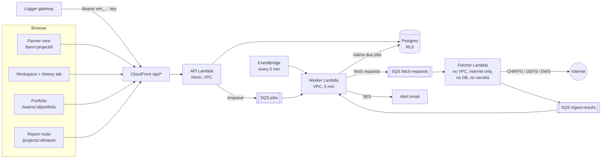

# Step 2: one shared picture of the catchment

Build plan for Step 2 of the [roadmap](./README.md). It follows the plan
template and the rules in that README. Catalogue rows it delivers from
[planned-work.md](../planned-work.md): **Stakeholder access**, **Baseline /
published run**, **Change history & audit log**, **Notes and comments**,
**Data feeds**, **Forecast mode**, **Alerts**, **Portfolio dashboard**,
**Report generation**, **Background jobs**, **Localisation**, plus the first
cut of **Unit preferences**. It also closes plan.md §1e (API keys, fetchers,
auto re-run, forecast flags) and the followups.md question "should runs be
pinnable?".

Sizes: **S** ≤ 3 days, **M** ≤ 2 weeks, **L** > 2 weeks, for one developer
who knows the codebase.

---

## 1. Summary

Today one modeller sees everything and nobody else looks. Step 2 adds the
catchment's other people:
- **20–60 farmers** get a phone-first view of their own farm only, in English
  or Afrikaans, enforced by row-level security.
- **The WUA / irrigation board** gets a portfolio dashboard, alerts and a
  one-click meeting report.
- **The regulator** gets read-only access to a **published baseline**.

Behind this, data arrives by itself (logger API keys, CHIRPS and DWS
fetchers, forecast rain) and the model re-runs on a background queue. Every
change to the model is recorded in an audit log that can restore any earlier
version.

## 2. Users and jobs to be done

| User | Job to be done | What they use today | What would make them switch |
| --- | --- | --- | --- |
| **Farmer** (`persona-farmer`) | "How much water will I get, will I be cut, how is my dam?" Checked on a phone, often in Afrikaans. | Phone calls with the WUA, the WUA's WhatsApp group, the notice board at the co-op, their own dam gauge plate | A 10-second answer on the phone in their own units (m³, ML, l/s, % of dam) and language. Neighbours can't see their figures. An email before a restriction, not after. |
| **WUA / irrigation-board manager** (`persona-wua-manager`) | Run the season across a few catchments. Who is short this week? Justify restrictions at member meetings. Report to the CMA / DWS. | A spreadsheet, phone calls, the consultant's emailed PDF, Excel copies of the b023 Shortfalls sheet | All catchments on one screen with current data. Alerts instead of checking daily. A published, dated result that members can see for themselves. A report for the meeting in one click. A record of who changed what. |
| **Modeller / hydrologist** (`persona-hydrologist`, Step 1's user) | Keep the model calibrated. Publish a result they stand behind. Stop fielding "what's my number?" calls. | This app (Step 1), email | Publishing replaces emailing screenshots. Data feeds replace manual CSV uploads. The audit log answers "why did the result change?". |
| **Regulator / CMA officer** (read-only) | See EWR compliance and the official catchment result without asking the consultant | Annual reports, requests by email | A read-only link or viewer account that always shows the current published baseline. |
| **Logger gateway / script** (machine) | Push new readings every day without a person | Someone emails a CSV to the modeller | A per-project API key and one documented endpoint. |

## 3. Scope

### In scope

- The `farmer` project role, links from a user to one or more farm nodes, and
  farm-scoped RLS across every project table, including runs, exports and
  comparisons.
- Farmer invitations, one at a time and in bulk.
- A phone-first farmer view: supply, dam level, likely restrictions, forecast.
- Afrikaans for the farmer view, the sign-in pages, emails and the farmer help
  entries.
- A published baseline run per project, publication history, a restriction
  notice written by the WUA, and read-only share links.
- Change history: model revisions with diffs and restore, plus an append-only
  audit log for access, data and publication events.
- Notes on farms, settings and runs.
- Per-project API keys (`series:write`) and an ingest endpoint.
- Scheduled CHIRPS / CHIRPS-GEFS / DWS fetchers.
- Auto re-run after new data, and forecast mode.
- A background job queue.
- Email alerts with preferences, unsubscribe and rate limits.
- A portfolio dashboard per team.
- A one-click PDF report.

### Out of scope

| Item | Where it goes |
| --- | --- |
| Registered allocations / water-use licences per farm (WARMS), licence-application evidence, cumulative impact | Step 3 |
| Scenarios within a project (proposed dam raise vs baseline) | Step 3 (licence applicants need it most) |
| Organisations as tenants, billing, SSO/MFA, public API docs, other countries, climate scenarios | Step 4 |
| WhatsApp / SMS alerts | Optional follow-up after Step 2 (tradeoffs in WP-2.13) |
| Catchment map and polygon-based CHIRPS extraction | Not planned in a step yet. Step 2 uses a bounding box or cell list. **Leave room for** a `catchment_geometry` source in `data_feed.config`. |
| Farmers uploading their own meter or dam readings | **Leave room for** a nullable `time_series.node_id`. Every farmer policy on `time_series` must then be extended (noted in WP-2.1). |
| Partial recompute from the first changed day | Not worth building. A full engine run takes a fraction of a second, and storing outputs dominates the cost (WP-2.11). |
| Translating the modeller workspace (Network, Crops, Settings, Runs tabs) | Stays English. Revisit if Afrikaans-speaking WUA staff ask for it. |
| Moving run outputs to S3 | Later, triggered by DB size (see Risks) |

## 4. Prerequisites

Must be true before starting:

1. **Step 1 exit criteria are met**: the hydrologist has signed off the
   model, issue #1 is decided, the engine-audit questions are answered or
   explicitly accepted, and the app is deployed. Farmers must never see
   numbers the modeller doesn't stand behind.
2. **Curtailment policy answered** (plan.md Q13, model.md §2.11 Q11–Q13). The
   farmer's "likely restrictions" card is built on `CurtailmentFarm`. What
   "reduce/gain" and "demand left %" mean has to be settled first.
3. **Client answers** to plan.md questions 10 (who uses it), 11 (accounts,
   invite-only sign-up) and **15 (confidentiality between farms)**. Q15
   decides D1 and D2 below.
4. **SES production access** (out of the sandbox) in the chosen region, with
   bounce and complaint handling live.
5. **Production DB running** (RDS, Phase 6). All Step 2 schema changes are
   new migrations: `001` is frozen once deployed.
6. **An Afrikaans translator/reviewer** is named (the client, or someone they
   trust). The Afrikaans now in the app (2026-09-26, issue #49) is written
   by the `af-translator` agent and reviewed by the `af-checker` agent, at
   the operator's call. **Named (2026-09-28, issue #90):** the client's
   native-speaker translator will review the Afrikaans farmer text, the
   liability lines included, before Afrikaans-speaking farmers are invited;
   the review itself stays open (docs/followups.md § Afrikaans).

Decisions still open that block specific WPs: D1–D4 block WP-2.1 and WP-2.3,
D6 blocks WP-2.10, D7 blocks WP-2.12, D9 blocks WP-2.15 (see §11).

## 5. Architecture changes



Locally the worker is one Node process (`pnpm dev:run:worker`). It polls the
Postgres `job` table, calls the fetcher code in-process against fixture files
(`FEED_SOURCE=fixtures`), and sends mail to Mailpit. There is no SQS and no
internet.

### Why the fetcher sits outside the VPC

`infra/network.tf` is a **private-only VPC with no NAT**. The API and worker
reach AWS through interface endpoints (`secretsmanager`, SES). CHIRPS and DWS
are on the public internet. The options were:
- a NAT gateway (~$35+/month per AZ);
- a fetcher Lambda outside the VPC that has no DB access and holds no secrets,
  and talks to the worker only through SQS.

We take the second. It needs one SQS interface endpoint in the VPC.

### New backend modules (grouped by topic, per CLAUDE.md)

| Module | Holds |
| --- | --- |
| `backend/src/farms/` | Farm links, farmer invites, farmer view routes, `farm-view.ts` projection |
| `backend/src/publish/` | Publications, restriction notices, share links |
| `backend/src/history/` | Model revisions, audit events, restore |
| `backend/src/notes/` | Notes |
| `backend/src/ingest/` | API keys, `withApiKey`, `/ingest` routes |
| `backend/src/feeds/` | `data_feed` CRUD, `sources/{chirps,chirps-gefs,dws}.ts`, fixtures reader |
| `backend/src/jobs/` | `queue.ts` (enqueue, claim, finish), `worker.ts` (local loop), `handlers/{fetch,ingest,rerun,alerts,report}.ts` |
| `backend/src/alerts/` | Rules, subscriptions, evaluation, unsubscribe |
| `backend/src/portfolio/` | Team dashboard query |
| `backend/src/lambda-worker.ts`, `backend/src/lambda-fetcher.ts` | New entry points. Like `lambda.ts`, they must not import `dotenv`. |

Existing code that changes:
- `backend/src/db/tx.ts`: gains `withApiKey`, and a `app.change_set_id` set
  per request.
- `backend/src/projects/access.ts`: `Role` gains `farmer` (rank −1).
- `backend/src/runs/execute.ts`: `trigger` column, and a trim that spares
  published runs and keeps only the latest auto run.
- `backend/src/series/routes.ts`: merge enqueues a re-run, and records audit
  events and revisions.
- `backend/src/model/routes.ts` and `projects/routes.ts` (PATCH settings):
  write a model revision.
- `backend/src/invites/invites.ts`: farmer invites with nodes.
- `backend/src/mail/templates.ts`: localised templates, and alert and digest
  mails.
- `backend/src/app.ts`: new route groups.
- `backend/src/routes.test.ts`: the `PUBLIC` allowlist gains the unsubscribe,
  share-view and `/ingest/*` routes. Ingest is key-gated, and a new test
  asserts every `/ingest` route rejects a missing or revoked key with `401`.

### Engine changes (`packages/engine`)

- **Forecast mode** (WP-2.12) is the only behaviour change. It bumps
  `ENGINE_VERSION` 0.4.x → **0.5.0**.
- Everything else uses new pure helpers that don't change `runModel` output:
  - `windowSummary(output-series arrays, from, to)` for "this week / this
    season" figures;
  - `farmProjection(summary, nodeId)`.

### New tables (all in new `NNN_*.sql` migrations)

| Table | Purpose |
| --- | --- |
| `farm_link` | user ↔ farm node (many-to-many) |
| `invite_node` | nodes attached to a pending farmer invite |
| `run_publication` | the published baseline and its history, plus the restriction notice |
| `publication_farm` | per-farm projection of a published run (the only run data a farmer reads besides allow-listed series) |
| `share_link` | read-only public links |
| `model_revision` | full settings + model snapshot per save, with a diff |
| `series_revision` | previous values of a series on replace/delete (bounded) |
| `audit_event` | append-only access, data and publication events |
| `note` | comments on farms, settings and runs |
| `api_key` | hashed per-project ingest keys |
| `api_key_throttle` | per-key rate limit (the `login_throttle` pattern) |
| `data_feed` | configured fetchers and their health |
| `job` | the queue's source of truth |
| `alert_rule`, `alert_subscription`, `alert_event`, `alert_delivery` | alerting |

Column additions (expand-only):
- `model_run.trigger` (`manual` | `auto` | `forecast`, default `manual`);
- `app_user.locale` (`en` | `af`, default `en`);
- `app_user.volume_unit` (`m3` | `ML`, default `m3`).

---

## 6. Work packages

Build order: **access and publication first** (2.1–2.4), then **the farmer
surface** (2.5–2.7), then **automation** (2.8–2.13), then **the WUA
surfaces** (2.14–2.15), then **release hardening** (2.16).

### WP-2.1 Farmer role and farm-scoped RLS

**Design input.** [design/farmer-view.md](../design/farmer-view.md) §10 (issue #14)
settles what a farmer may see about other farms: D1 (b); D2 `k = 5` counted
by holders and covering the even share; no `inflow_upstream` and no catchment
flow series for farmers; a farm-count definer function (E6); and who may hold
viewer on a project with farmers (FV-D5). Where it differs from this section,
the design doc is the newer decision.

**Goal.** A user linked to farm nodes sees their own farm's figures and
nothing about any other farm. This holds even if an API route forgets to
filter, because Postgres refuses the rows.

**Changes**

- **Migrations:**
  - `NNN_farmer_role.sql`: only
    `ALTER TYPE project_role ADD VALUE 'farmer' BEFORE 'viewer'`. It needs its
    own file because an enum value added in a transaction can't be used until
    that transaction commits, and the runner wraps each file in one
    transaction.
  - `NNN_farm_scope.sql`: everything else below.
- **Backend:**
  - `projects/access.ts`: `Role` adds `farmer` with rank −1. Every existing
    `requireRole(db, id, 'viewer')` now answers **403** to a farmer. That's
    the fail-closed default; no existing route changes.
  - `projects/routes.ts`: `RoleEnum` for `/members` stays viewer | editor |
    owner. Farmers are managed only through `/farmers` (WP-2.2).
  - `GET /projects`: for a farmer the `last_run_at` subquery returns null (no
    `model_run` visibility). Add `publishedAt` from `run_publication` for
    everyone.
- **Frontend:** `lib/api/types.ts` `Role` and `RANK` gain `farmer`. With
  `hasRole(role, 'viewer')` false, every workspace control hides itself.
  `routes/projects/[id]/+page.svelte` redirects a farmer to `/farm/[id]`.
- **Engine:** none.

**Why an enum value below `viewer`.** Every existing policy is
`app_has_role(project_id, 'viewer' | 'editor' | 'owner')`, compared with `>=`.
A value that sorts below `viewer` is refused by all of them without touching
one policy. The new access is added only as **extra permissive SELECT
policies**, which Postgres ORs with the existing ones. Team roles never map to
`farmer`: `app_project_role()` takes the max, so a farmer who is also a team
member is simply an editor.

**Data model**

- `farm_link (project_id, node_id → node ON DELETE CASCADE, user_id → app_user
  ON DELETE CASCADE, added_by → app_user, added_at, PRIMARY KEY (node_id,
  user_id))`.
  - Indexes on `(project_id, user_id)`, `user_id` and `added_by`.
  - Same-project trigger `assert_same_project('node_id')`.
  - A trigger checks that the node is `kind = 'farm'` and that the user has a
    `project_member` row on the project.
- Helpers (all `SECURITY DEFINER`, `STABLE`, `SET search_path = public`):
  - `app_is_farmer(project)`: effective role = `farmer`.
  - `app_farm_nodes(project) RETURNS SETOF uuid`: the current user's linked
    nodes.
  - `app_sees_node(project, node)`: `app_has_role(project,'viewer')`, or the
    node is in `app_farm_nodes(project)`.
  - `app_run_published(run)`: the run is referenced by any `run_publication`
    of its project.

**RLS in words.** These are new permissive policies. Existing ones are
untouched.

| Table | What a farmer may SELECT | Writes |
| --- | --- | --- |
| `project` | The row, when `app_project_role(id) = 'farmer'` | none |
| `project_member` | Only their own row (`user_id = app_current_user_id()`). Never the member list, which holds neighbours' emails. | may delete own row (leave), as today |
| `team`, `team_member`, `invite` | nothing | none |
| `node` | Their linked nodes, plus `kind = 'gauge'` nodes (public infrastructure). No other farm, not even its name (D1). | none |
| `crop` | All rows (catchment crop factors aren't farm-specific) | none |
| `crop_area` | Rows whose `node_id` is linked to them | none |
| `transfer` | Rows where `from_node_id` or `to_node_id` is linked to them. The other end is an opaque UUID they can't resolve. | none |
| `time_series` | All rows. Every current series is catchment-level (rain, flows). **Leave room:** when `time_series.node_id` arrives, this policy must become `node_id IS NULL OR node_id in app_farm_nodes()`. | none |
| `model_run` | **Nothing.** `inputs` holds every farm's parameters and `summary` holds every farm's results. RLS is row-level, and the one DB role `water_app` can't have per-user column grants, so the whole row stays hidden. | none |
| `run_series` | Rows where `app_run_published(run_id)` holds and either (a) `node_id` is linked to them and `key` is in the farm allowlist (`demand`, `supplied`, `deficit`, `dam_storage`, `spill`, `transfer`, `inflow_upstream`), or (b) `node_id IS NULL` and `key` is in the catchment allowlist (`natural_flow`, `simulated_outflow`, `observed_flow`, `ewr`, `ewr_shortfall`). The allowlists live in the helper `app_farmer_series_key(key, is_catchment)`, so adding an output key doesn't leak by default. | none |
| `run_publication`, `publication_farm` | See WP-2.3 | none |

**How this meets runs, exports and comparisons**

- **Runs.** A farmer reads run data only through publications
  (`publication_farm`) and the `run_series` rows above. The
  `/projects/:id/runs*` routes stay `viewer`, so a farmer gets 403 there.
- **Exports.** `summary.csv`, `daily.csv`, `export.json` and the series CSV
  stay `viewer`. A farmer's export is a new route,
  `GET /projects/:id/farm/:nodeId/export.csv` (WP-2.5). It is built from the
  farmer-visible rows only.
- **Comparisons.** `/compare/runs` returns `inputs` snapshots, so it stays
  viewer on both sides. A farmer compares **their own farm across
  publications** (this season vs last published baseline) through
  `GET /projects/:id/farm/:nodeId/history`, from `publication_farm` rows.
- **Aggregates.** Catchment totals minus your own figures reveal your
  neighbours' figures when there are few farms. Farmer-facing catchment
  aggregates of farm quantities (total demand, total supplied) are therefore
  suppressed below `k` farms (D2). EWR and outflow figures are not per-farm
  and are always shown.

**API.** No new routes here; they come in WP-2.2 and WP-2.5. Existing routes
now answer 403 to farmers. Document this in api.md § Errors and add the role
to § Projects.

**UI.** In the Members panel (`project/MembersPanel.svelte`), farmers are
listed separately as "Farmers (N)" with their linked farms. The Network tab
shows a "2 farmers linked" chip on a farm row. Deleting a linked farm warns
that its links go with it (the cascade).

**Local-first equivalent.** Pure Postgres. `seed:examples` gains two
synthetic farmers (`farmer1@example.com` linked to one farm,
`farmer2@example.com` linked to two), with the password `demo-password`.

**Tests**

- DB+RLS (`backend/src/farms/farms.db.test.ts`), as `water_app`:
  - For every table above, a farmer sees exactly their linked rows, with a
    **positive control** that the same farmer sees their own node and its
    `run_series`.
  - A viewer sees everything.
  - A farmer sees no `model_run` row.
  - A farmer can't `INSERT`, `UPDATE` or `DELETE` anywhere.
  - A farmer can't read an unpublished run's series.
  - A catchment key outside the allowlist is invisible.
  - Unlinking takes effect in the next transaction.
- A catalogue test (`db/catalogue.db.test.ts`) gains: every table with a
  `node_id` column has a farmer-aware SELECT policy **or** is on an explicit
  "farmers never read" list. A new node-bearing table therefore can't ship
  without a decision.
- A route inventory test: every route under `/projects/:id` is classified
  farmer-allowed or farmer-403, and each farmer-403 route is exercised.
- Unit: the `access.ts` rank covers `farmer`.
- e2e: a farmer signs in, lands on the farm view, and gets 403 from the
  workspace URL (redirected with a message).

**Docs to update.** data-model.md (§ Roles, § Row-level security: the farmer
scope table, the new ER entities), security.md (Authorization: farm scope,
the aggregate rule), api.md.

**Acceptance criteria**

- As `farmer1`, no API response contains the id or name of any node other
  than their linked farm and the gauges. A DB test asserts this by
  string-scanning each farmer route's response.
- Removing a farm link or the membership stops access on the next request.

**Size.** L. The policies are few, but the test matrix is wide.
**Depends on.** Prerequisites 1–3; D1, D2.

---

### WP-2.2 Farmer invites (single and bulk)

> **Status: built** (issue #27; `034_farmer_invites.sql`,
> `backend/src/farms/routes.ts`, `project/InviteFarmersDialog.svelte`;
> [api.md § Farmers](../api.md#farmers)). Where the build departs from the
> plan below, and why:
> - **`PUT /farmers/:userId` stays** (the plan's `PATCH`), and there is no
>   `DELETE /farmers/:userId`: a farmer is removed through
>   `DELETE /members/:userId` and a pending invite revoked through
>   `DELETE /invites/:inviteId`, as before. `GET /farmers` stays **viewer**;
>   the pending invites in it are owners-only by RLS, so a viewer gets the
>   farmers alone.
> - **Bulk has a `dryRun`**, which is the dialog's preview: the same code
>   path, rolled back to a savepoint, so the preview's added / invited /
>   error can't drift from what "Send" does.
> - **Bulk adds, never replaces**: a row adds its farm to an existing
>   farmer's links or to a pending invite's farms. The single form replaces
>   an invite's farms, as re-sending an invite replaces its role.
> - **`invite.locale`** takes `en` or `af`; an `af` invite goes out through
>   the email catalogue (WP-2.5), in Afrikaans (`lang="af"`). A new account takes its `app_user.locale` from the invite
>   (050_user_locale.sql).
> - The e2e plants the invite token instead of reading Mailpit, like the
>   other invite specs (e2e mails go to the server log).

**Goal.** A WUA manager or owner invites 20–60 farmers, each linked to their
farm(s), without typing each one twice. Invitations work whether or not the
farmer already has an account.

**Changes**

- **Migration:**
  - `invite_node (invite_id → invite ON DELETE CASCADE, project_id, node_id →
    node ON DELETE CASCADE, PRIMARY KEY (invite_id, node_id))`, with indexes
    on `node_id` and `project_id` and the same-project trigger on `node_id`.
  - RLS mirrors `invite`: project owners only.
  - **Redefine `app_accept_invites(p_user)` starting from its latest
    definition (`004_email.sql`).** After inserting `project_member` rows it
    also inserts `farm_link` rows from `invite_node`, before the invites are
    deleted. `ON CONFLICT DO NOTHING` keeps it idempotent. It still accepts
    only verified addresses.
- **Backend:**
  - `farms/routes.ts`:
    - `GET/POST/PATCH/DELETE /projects/:id/farmers[/:userId]`;
    - `POST /projects/:id/farmers/bulk`.
  - Both call `inviteByEmail(db, 'project', id, email, 'farmer', …)`, then
    write `invite_node` rows. A verified account is added directly: a
    `project_member` row with role `farmer`, plus `farm_link` rows.
- **Mail:** `inviteMail` gains a farmer variant: "{inviter} has given you
  access to {farm} in {catchment}". It is localised through `app_user.locale`
  or the invite's `locale` (WP-2.4).

**Data model.** Add a `locale` column to `invite` (default `en`), used for
the email and as the new account's `app_user.locale`.

**API**

| Method | Path | Body | Response | Min role |
| --- | --- | --- | --- | --- |
| GET | `/projects/:id/farmers` | – | `{ farmers: { userId?, inviteId?, email, displayName?, nodeIds, status: 'active' \| 'invited' \| 'expired' }[] }` | owner |
| POST | `/projects/:id/farmers` | `{ email, nodeIds: uuid[1..20], locale? }` | `201 { farmer }` or `201 { invited: true, invite }` (same enumeration-safe shape as `/members`) | owner |
| PATCH | `/projects/:id/farmers/:userId` | `{ nodeIds }` | `{ farmer }` | owner |
| DELETE | `/projects/:id/farmers/:userId` | – | `204` (removes the membership, and the links cascade) | owner (or self) |
| POST | `/projects/:id/farmers/bulk` | `{ rows: { email, farm: <node name>, locale? }[1..200] }` | `200 { results: { row, status: 'added' \| 'invited' \| 'error', error? }[] }` | owner |

- **Validation:** every `nodeId` is a farm in this project (`400`
  otherwise). Bulk-matching by farm **name** is exact and case-insensitive,
  and an unknown name is a per-row error, never a guess.
- Mail is sent after commit (the existing `trySendMail` pattern). Bulk sends
  at most one email per address, with the existing cooldown.
- A team admin is a project owner, so the WUA manager can do all of this.

**UI**
- An "Invite farmers" dialog in the Members panel:
  - single mode: email, a farm multi-select, language;
  - CSV paste/upload mode (`email,farm,language`) with a preview table
    (added / invited / error per row) before sending.
- States: empty ("No farmers yet: invite them to see their own farm"),
  loading, per-row errors.
- Hidden for non-owners.

**Local-first equivalent.** Mailpit catches all invite mail. A synthetic
`e2e/fixtures/farmers.csv`.

**Tests**
- DB:
  - accepting a farmer invite creates the membership **and** the links;
  - an unverified account gets nothing (positive control: after verifying,
    it gets both);
  - an invite for a node that is then deleted loses that node only;
  - bulk with a mixed CSV gives the right per-row statuses.
- Unit: CSV parsing, and the localised template.
- e2e: invite → Mailpit link → register → land on the farm view showing
  exactly that farm.
- axe: the dialog in both modes.

**Docs to update.** api.md (Farmers), data-model.md (Email tokens and
invites), ui.md (Members panel).

**Acceptance criteria**
- A CSV of 60 synthetic rows produces 60 results in one request, in under
  5 s on local dev.
- Every accepted farmer sees only their listed farms.

**Size.** M. **Depends on.** WP-2.1; WP-2.4 for localised mail (ship English
first if needed).

---

### WP-2.3 Published baseline, restriction notice and share links

> **Status (2026-09-25).** Phase 1 (publications, the farm projection and
> the publish flow) and phase 2 (share links: `025_share_links.sql`,
> `backend/src/share/`, the `/share` page and the Overview's Share links
> panel) are built. Phase 2 departs from this plan in three places, each
> stricter: `app_share_series` answers only with at least `FARMER_K` = 5
> farm holders (design [farmer-view.md §10.3](../design/farmer-view.md#103-decisions-this-design-takes-for-the-client-to-confirm)
> overrides D2's "always show outflow" for flow volumes); the shared
> `catchment_view` is cut to an allowlist of keys with the outlet unnamed
> (the outflow node may be a farm); and a link is revoked, never deleted,
> until audit events exist (WP-2.4, [followups.md](../followups.md)).

**Goal.** Each project has one **published** run: the result stakeholders see
by default, approved by a named person. The WUA can attach a restriction
notice. Outsiders get a read-only link to the catchment-level result.

**Changes**

- **Migration**
  - `run_publication`:
    - `id`, `project_id`, `run_id → model_run ON DELETE RESTRICT`,
      `published_by → app_user`, `published_at`;
    - `note text ≤ 2000`;
    - the restriction: `restriction_level text` (`none` | `advisory` |
      `restricted`), `restriction_pct numeric(5,2) NULL`,
      `notice_en text ≤ 2000`, `notice_af text ≤ 2000`;
    - `catchment_view jsonb` and `superseded_at`.
  - A partial unique index on `(project_id) WHERE superseded_at IS NULL`: one
    current publication.
  - Indexes on `run_id`, `published_by` and `(project_id, published_at DESC)`.
  - `publication_farm`: `publication_id → run_publication ON DELETE CASCADE`,
    `project_id`, `node_id → node ON DELETE CASCADE`, `view jsonb`, with
    PRIMARY KEY `(publication_id, node_id)`, a `node_id` index and the
    same-project trigger.
  - `share_link`: `id`, `project_id`, `label`, `token_hash bytea UNIQUE`
    (SHA-256, 32 bytes), `created_by`, `created_at`, `expires_at`,
    `revoked_at`, `last_used_at`.
  - Extend `assert_same_project()` **from its latest definition
    (`001_init.sql`)** with a `%run_id` branch that looks up `model_run`, and
    attach it to `run_publication`.
- **Backend** (`publish/`)
  - Publishing:
    - validates the run is in the project;
    - supersedes the current publication;
    - computes `catchment_view` and one `publication_farm.view` per farm with
      the engine helpers (`farmProjection`, `windowSummary`);
    - writes an `audit_event`.
  - `runs/execute.ts` `trimRuns`: `AND id NOT IN (SELECT run_id FROM
    run_publication)`. This answers followups.md "should runs be pinnable?".
    Publication history is kept but capped at the newest **12** per project.
    Older publications are deleted (and their runs become trimmable) by the
    same trim.
  - `DELETE /runs/:runId` on a published run returns `409 run is published`.
- **Engine.** New pure helpers in `packages/engine/src/views.ts`:
  - `farmProjection(summary, nodeId)` returns `FarmSummary`, the
    `CurtailmentFarm` row, the farm's `EwrComplianceGrid`, and
    `equitableFraction`.
  - `windowSummary(series, startDate, from, to)` returns the mean, the sum
    and the last value.

  No `runModel` change, so no version bump. Unit-tested.

**`view` contents (farmer projection).** `nodeId`, `name`,
`damCapacityM3`, `season` (water-year-to-date demand, supplied and fraction),
`last30` (the same over 30 days), `damPctLatest`, `damPctTrend30`, the
`curtailment` row, `ewrGrid` (own), and `dataUntil`. It is kept small (a few
KB) so the farm view is one request.

**`catchment_view` contents.** Outlet EWR days-not-met over the whole run,
the season and 30 days; mean natural and simulated flow; `farmCount`; totals
of farm quantities **only if `farmCount ≥ k`** (D2); calibration headline
(NSE, PBIAS, rating); run meta (dates, engine version, who published).

**RLS in words**
- `run_publication`:
  - SELECT: any member, farmers included (`app_project_role(project_id) IS
    NOT NULL`);
  - INSERT/UPDATE: editor (D3: editor or owner?);
  - DELETE: owner.
- `publication_farm`:
  - SELECT: viewer+, or a farmer whose `app_farm_nodes()` contains `node_id`;
  - writes: editor.
- `share_link`: all operations owner. The public lookup goes only through
  `SECURITY DEFINER app_share_view(p_hash)`. It returns the current
  publication's `catchment_view` and restriction notice for a live,
  unrevoked token, bumps `last_used_at` at most once an hour, and returns
  nothing else. Same pattern as `app_invite_for_token`.
  `app_share_series(p_hash, key)` returns only catchment-allowlisted series of
  the published run, downsampled to monthly means (plus the last 365 days
  daily).

**API**

| Method | Path | Body | Response | Min role |
| --- | --- | --- | --- | --- |
| GET | `/projects/:id/publication` | – | `{ current: Publication \| null, history: PublicationMeta[] }` | farmer |
| POST | `/projects/:id/publication` | `{ runId, note?, restriction?: { level, pct?, noticeEn?, noticeAf? } }` | `201 { publication }` | editor (D3) |
| PATCH | `/projects/:id/publication/:pubId` | `{ restriction?, note? }` (the notice can change without re-publishing; audited) | `{ publication }` | editor |
| GET/POST | `/projects/:id/share-links` | `{ label, expiresInDays: 1..365 }` | `201 { link: { id, url } }`: the URL is shown **once** | owner |
| DELETE | `/projects/:id/share-links/:linkId` | – | `204` | owner |
| POST | `/share/view` *(public)* | `{ token }` | `{ project: { name }, publication: { publishedAt, publishedBy, catchmentView, restriction } }` or `404` | – |
| POST | `/share/series` *(public)* | `{ token, key }` | `{ monthly: {…}, recent: {…} }` | – |

The share URL carries the token in the **fragment** (`/share#t=…`). The
browser never sends a fragment to the server, so it doesn't reach CloudFront
logs. The page reads the token, strips it from the address bar (as the reset
pages do), and POSTs it.

**UI**
- Runs tab:
  - "Publish this run" (editor), with a confirm dialog showing what changes
    for stakeholders;
  - a "Published" badge in the runs list;
  - a "Published baseline" card on the Overview with the notice editor.
- Viewers and farmers open on the published run by default.
- A new `/share` route: a catchment-only page that works on a phone, carries
  `noindex`, and shows a dead-link state.
- An owner-only "Share links" panel on the Overview.

**Local-first equivalent.** Pure Postgres; nothing external.

**Tests**
- DB:
  - one current publication per project;
  - published runs survive `trimRuns` with a cap of 1 (positive control:
    unpublished runs are trimmed);
  - deleting a published run → 409;
  - a farmer sees their `publication_farm` row only;
  - `app_share_view` answers nothing for revoked or expired tokens
    (positive control: a live token);
  - share series refuses farm keys.
- Unit:
  - `farmProjection` / `windowSummary` (engine);
  - `catchment_view` suppresses totals below `k`.
- e2e: publish → the farmer sees the new date; revoke a link → the dead-link
  state.
- axe: the `/share` page and the publish dialog.

**Docs to update.** api.md (Publication, Share), data-model.md (Run output
volume: the cap exempts published runs), ui.md (Runs, Overview, `/share`),
security.md (share links), run-comparison.md (the default "compare with
published").

**Acceptance criteria**
- Publishing is one click plus a confirm.
- A share link opened signed-out on a phone shows the EWR status and the
  notice in under 2 s locally.
- A 20-run cap never deletes a published run.

**Size.** M. **Depends on.** WP-2.1. D2, D3.

---

### WP-2.4 Change history and audit log, with restore

**Status (2026-09-26, issue #28).** Built: migration `030_history`, the
history module, hooks in every write route with a table-driven guard,
restore, the History tab, the save-bar reason and the Runs additions.
Differences from the plan below are in [data-model.md § Change history and
audit log](../data-model.md#change-history-and-audit-log-030_historysql).
The per-field "history" line followed on 2026-09-27 (issue #17; `GET
…/history/fields`, [ui.md § Field history](../ui.md#field-history)).

**Goal.** Answer "who changed which parameter, when, and why did the result
change?" and put back any earlier version. This is required by the Step 2 → 3
gate.

**Why not row triggers.** `saveModel` (`backend/src/model/store.ts`) rewrites
the document to save it:
- it nulls every `downstream_node_id`;
- it renames every node and crop to `'~' || id`;
- it deletes and re-inserts every `crop_area`.

A row trigger would log hundreds of meaningless changes per save. History is
therefore recorded **at the document level, in the same transaction**, by the
routes that save. A guard test proves that no write route skips it.

**Changes**

- **Migration**
  - `model_revision`:
    - `id bigint identity`, `project_id`, `created_by → app_user ON DELETE
      SET NULL`, `created_at`;
    - `source` (`model_put` | `settings_patch` | `restore` | `import`);
    - `reason text ≤ 500` (the optional "why" from the save bar);
    - `snapshot jsonb`: `{ settings, model }`, the **same shape** as
      `model_run.inputs` minus `series`;
    - `changes jsonb`: an `InputChange[]` from the engine's `diffInputs`
      against the previous revision;
    - `restored_from bigint NULL`.

    Index `(project_id, created_at DESC)` and `created_by`.
  - `series_revision`: `id`, `project_id`, `series_id → time_series ON
    DELETE SET NULL`, `kind`, `name`, `start_date`, `values double
    precision[]`, `values_sha256`, `created_by`, `created_at`, `reason`
    (`replace` | `delete` | `manual_merge`). Written **before** a replace or
    delete, and before merges from the UI. It is **not** written for key or
    feed merges, which are append-mostly and would bloat it. Keep the newest 5
    per (project, kind, name) and nothing older than 180 days (trimmed on
    insert).
  - `audit_event`: `id bigint identity`, `project_id`, `actor_user_id NULL`,
    `actor_api_key_id NULL`, `actor_label text` (a snapshot of the display
    name, or the key name), `kind text`, `subject jsonb`, `created_at`,
    `change_set uuid`.
    - Kinds: `member.added/removed/role`, `farmer.linked/unlinked`,
      `invite.sent/revoked`, `publication.published/notice_changed`,
      `share_link.created/revoked`, `api_key.created/revoked`,
      `series.replaced/merged/deleted` (with day range, `valuesSha256` and
      days changed), `run.created/deleted`, `feed.configured/failed`,
      `restore`.
- **Backend** (`history/`)
  - `recordModelRevision(db, projectId, source, reason)`: loads the previous
    snapshot, diffs with `diffInputs`, inserts. It is skipped when the diff is
    empty (a no-op save).
  - Called from `PUT /model`, `PATCH /projects/:id` (when `settings` is
    sent), `import:project` and restore.
  - `withUser` sets `app.change_set_id` to a fresh UUID, so all rows written
    by one request can be grouped.
- **Engine.** None. It reuses `diffInputs` and its `InputChange` text.

**Relation to run input snapshots.** A run's `inputs` is an **occasional full
checkpoint** that only exists when someone pressed Run. `model_revision` is
the **continuous record between checkpoints**, with the same `{ settings,
model }` shape, so:
- **"Why did the result change between run A and run B?"** Filter the
  revisions with `created_at` between the two runs. `diffInputs(A.inputs,
  B.inputs)` (already in `/compare`) gives the net effect.
- **"Restore the inputs this run used"** writes `A.inputs.{settings,model}`
  as a new revision with `source = 'restore'`. It works for any run, even one
  from before revisions existed.
- Series values are **not** in either snapshot, only hashes. So "restore
  series" is a separate action from `series_revision`, and it's only possible
  within the retention window. Say so in the UI.
- A restore never rewrites history. It is a new revision pointing at
  `restored_from`.
- Restoring a deleted farm brings back the node with its old id. Its farmer
  links were cascaded away and are **not** restored; the UI lists who to
  re-link from the `farmer.unlinked` events.

**RLS in words**
- `model_revision`, `series_revision`, `audit_event`: SELECT for viewer+.
  Farmers see nothing (D4: "see my own farm's parameter history" is a
  candidate later).
- INSERT: editor for revisions (the routes are editor-gated). `audit_event`
  INSERT is allowed to any member *for their own actions* (`actor_user_id =
  app_current_user_id()`), or with a valid API-key context.
- **No UPDATE or DELETE policy for anyone**: append-only. Trimming
  `series_revision` runs in a `SECURITY DEFINER` function.
- Grants to `water_app`: SELECT, INSERT only.

**API**

| Method | Path | Body | Response | Min role |
| --- | --- | --- | --- | --- |
| GET | `/projects/:id/history` | `?before=<id>&limit≤100&nodeId=&kind=` | `{ items: (Revision \| AuditEvent)[], next }`, newest first. A revision carries `changes` (text lines) but not the snapshot. | viewer |
| GET | `/projects/:id/history/revisions/:revId` | – | `{ revision: { …, snapshot } }` | viewer |
| POST | `/projects/:id/history/revisions/:revId/restore` | `{ reason? }` | `201 { revision }` (the new one) | editor |
| POST | `/projects/:id/runs/:runId/restore-inputs` | `{ reason? }` | `201 { revision }` | editor |
| GET | `/projects/:id/series/:seriesId/revisions` | – | `{ revisions: { id, createdAt, createdBy, reason, startDate, length }[] }` | viewer |
| POST | `/projects/:id/series/:seriesId/revisions/:revId/restore` | – | `SeriesMeta` | editor |
| PUT | `/projects/:id/model` | adds optional `reason` | unchanged | editor |

**UI**
- A new **History** tab (`?tab=history`, `lib/components/history/`): a
  timeline grouped by day, filters (farm, parameter, event kind), each
  revision's change lines, and a "Restore this version" button (editor)
  behind a confirm that previews the diff.
- The save bar gains an optional "Reason for this change".
- On a field, a small "history" affordance opens "changed 3× · last by Ann,
  12 Aug: 40 % → 60 %".
- Runs tab: "Changes since this run" and "Restore these inputs".
- Viewers see the History tab read-only. Farmers don't see it.
- Empty state: "No changes recorded yet. History starts from {date}."

**Local-first equivalent.** Pure Postgres.

**Tests**
- DB:
  - `PUT /model` writes exactly one revision with the right `changes`;
  - a no-op save writes none;
  - restore round-trips (restore → `GET /model` equals the snapshot);
  - `audit_event` rejects UPDATE/DELETE for `water_app`;
  - `series_revision` retention;
  - **guard test:** every non-GET route under `/projects/:id` that changes
    model, settings, series, members, farmers, publications, keys or feeds
    produces a revision or an `audit_event` (a table-driven inventory, like
    `routes.test.ts`).
- Unit: history item formatting, and grouping by change set.
- e2e: edit a dam capacity with a reason → History shows it → restore → the
  value is back.
- axe: the History tab.
- Run date-grouping tests under a skewed `TZ`.

**Docs to update.** data-model.md (new § Change history; update "Run input
snapshots"), api.md (History), ui.md (History tab), security.md (remove "No
audit log of model changes yet" from Known gaps).

**Acceptance criteria**
- Any parameter change can be traced to a person, a time and a reason.
- Any revision or run's inputs can be restored in two clicks.
- The guard test fails if a new write route skips history.

**Size.** M. **Depends on.** None (it can start in parallel with WP-2.1).

---

### WP-2.5 Internationalisation foundation and Afrikaans

> **Status: built; Afrikaans complete, native review pending (the client's translator will do it before farmers are invited in Afrikaans, confirmed issue #90)** (`050_user_locale.sql`,
> `frontend/src/lib/i18n/`, `backend/src/mail/i18n/`;
> [ui.md § Language](../ui.md#language), [api.md § Auth](../api.md#auth)).
> Where the build departs from the plan below, and why:
> - **`af.ts` is `Partial`**, not a full `Record`: a key without Afrikaans
>   shows in English and must be on `docs/i18n/af-translation-sheet.md` (the
>   catalogue tests fail otherwise), so a new string never blocks a build.
>   An unknown key still fails `pnpm check`. Every string has Afrikaans now
>   (2026-09-26, issue #49: 505 site messages, 70 email strings, 8 glossary
>   entries), written by the `af-translator` agent and reviewed by the
>   `af-checker` agent; a native speaker's review is open: the client's
>   native-speaker translator will do it, the liability lines included,
>   before farmers are invited in Afrikaans (confirmed by the client, issue
>   #90).
> - **`<html lang>` follows the words**, not the choice: it is `af` only
>   while the Afrikaans catalogue is complete (it is), and dates follow it
>   too; numbers switch to the decimal comma at once, and so does the WUA's
>   own notice. The workspace stays `en`.
> - **The switch** is on the sign-in pages, the farm header, the `/share`
>   header and the account page, not the workspace header (the workspace
>   isn't translated).
> - **Server errors** are worded on the client from a stable `code` the API
>   sends ([api.md § Errors](../api.md#errors)); the server doesn't localise.
> - **`invite.locale`** already existed (034); 050 adds `app_user.locale`
>   (NULL = not chosen) and `volume_unit`, and `app_accept_invites` gives a
>   new account its invite's locale. Sign-up takes the page's `locale`.
> - **Help:** `content.af.ts` with `sourceHash` and its test are built, and
>   so are `pnpm gen:i18n:stamp <id>` (re-stamps an entry, then rewrites the
>   sheet) and the stale listing in `pnpm check:i18n`. The root scripts are
>   `gen:i18n:sheet`, `gen:i18n:stamp` and `check:i18n`.
> - Left over: [followups.md § Afrikaans](../followups.md#afrikaans-wp-25).

**Goal.** English and Afrikaans for everything a farmer touches, with no
heavy dependency, and help text that can't silently drift out of date.

**Approach (Svelte 5, no library)**
- `frontend/src/lib/i18n/`:
  - `messages/en.ts`: `export const en = { 'farm.supplied.title': 'Water you received', … } as const`.
  - `messages/af.ts`: `export const af: Messages = { … }`, where
    `type Messages = Record<keyof typeof en, string>`. **A missing or extra
    key fails `pnpm check`.**
  - `locale.svelte.ts`: `export const i18n = $state({ locale: 'en' as Locale })`;
    `t(key, vars?)` does `{name}` interpolation, and `tn(key, count)` uses
    `Intl.PluralRules`. Components call `t()` inside templates, so a locale
    change re-renders them (it's a rune read).
  - Locale resolution: `app_user.locale` when signed in, otherwise
    `localStorage` (wrapped in try/catch), otherwise `navigator.language`
    starting with `af`, otherwise `en`. It sets
    `document.documentElement.lang`.
- Formatting: `lib/format/number.ts` `fmtNum` / `fmtPct` / `fmtDate` take the
  active locale:
  - `af-ZA` uses a decimal comma and a space as the thousands separator;
  - dates show as `23 Sep 2026` / `23 Sep. 2026` from `Intl.DateTimeFormat`
    with fixed `day/month/year` options (never the ambiguous numeric
    `en-ZA` form).
  - This forces the open followups.md "thousands separator style" question
    (D8).
  - `parseNum` already accepts both separators.
- Units: `app_user.volume_unit` (`m3` | `ML`). Flow is shown in l/s. The
  farmer view formats through one `fmtVolume(m3, unit)` helper.

**Which strings (phase 1)**

| Surface | Files |
| --- | --- |
| Farmer view (all) | `routes/farm/**`, `lib/components/farm/**` (WP-2.6) |
| Sign-in pages | `routes/{login,register,forgot-password,reset-password,verify-email}`, `layout/AuthCard.svelte`, `auth-extras/*` |
| App chrome a farmer sees | `layout/AccountMenu.svelte` (the account menu; the farm pages have their own `farm/FarmShell.svelte` with the language switch), `common/LoadState.svelte`, `common/Dialog.svelte` |
| Share page | `routes/share/**` |
| Emails | `backend/src/mail/templates.ts`: verify, reset, invite, alert, digest (a backend `mail/i18n/{en,af}.ts` with the same typed-key pattern) |
| Help entries marked `audience: 'farmer'` | ~15–20 of the 76 entries in `lib/help/content.ts` (dam level, supplied, deficit, restriction, EWR in plain words, forecast) |

The modeller workspace stays English (out of scope).

**Keeping help text translated**
- `content.ts` entries gain `audience?: ('farmer' | 'modeller')[]`.
- `lib/help/content.af.ts` maps `id → { title, body, sourceHash }`, where
  `sourceHash` is the SHA-256 of the English `title + body` at translation
  time.
- `content.af.test.ts` fails when:
  - a `farmer` entry has no Afrikaans version;
  - an Afrikaans entry's `sourceHash` doesn't match the current English (the
    English changed after translation);
  - an Afrikaans entry exists for an unknown id.
- `pnpm gen:i18n:stamp <id>` re-stamps a hash once the translator confirms,
  and `pnpm check:i18n` lists what's missing or stale for the translator.
  Both are new root scripts in the existing `gen:` and `check:` groups;
  `test:scripts` covers them.

**Changes**
- **Migration:** `app_user.locale`, `app_user.volume_unit`, `invite.locale`.
- **API:** `PATCH /auth/me { displayName?, locale?, volumeUnit? }` (signed
  in). `user` gains `locale` and `volumeUnit`.

**UI.** A language switch in the header and on the sign-in pages (`EN | AF`),
with an accessible name and `lang` attributes on the options.

**Local-first equivalent.** Everything is bundled; no service.

**Tests**
- Unit:
  - `t`/`tn` (interpolation, plurals, a missing key throws in dev);
  - `fmt*` per locale;
  - the help-drift test above;
  - the backend mail templates render in both locales and still escape HTML.
- e2e: switch to AF → the farmer view, the login page and an invite email (in
  Mailpit) are Afrikaans; `<html lang="af">`.
- axe: every translated page in AF (labels, `lang`), and at 360 px (longer
  Afrikaans strings mustn't overflow).

**Docs to update.** ui.md (new § Language), STACK.md (conventions: i18n
keys), api.md (`/auth/me`), run-locally.md (`check:i18n`).

**Acceptance criteria**
- `pnpm check` fails on a missing Afrikaans key.
- The test suite fails on stale farmer help.
- No new runtime dependency (`check:bundle` ceilings hold).

**Size.** M (the plumbing is S; translation turnaround is the long pole).
**Depends on.** Prerequisite 6 for the reviewed text.

---

### WP-2.6 Phone-first farmer view

**Design.** [design/farmer-view.md](../design/farmer-view.md) (issue #14) is the
spec: content model, curtailment wording, card order, band, states, offline
rules, and a clickable prototype. Its §12 lists what it changes below (the
model card's headline, "compared with last season" from the projection rather
than `/history`, more routes); where they differ, the design doc wins.

**Goal.** Open the link, see "your water" in 10 seconds on a 360 px phone:
supplied, dam level %, likely restrictions, and what's coming. Plain words, in
the farmer's own units and language.

**Changes**
- **Backend** (`farms/routes.ts`), all `requireRole(db, id, 'farmer')`,
  which also admits viewer+ so the WUA can "preview as farmer". Each route
  checks `nodeId ∈ app_farm_nodes()` for farmers (RLS also returns nothing
  otherwise → `404`).
- **Frontend:**
  - `routes/farm/+page.svelte`: "My farms" across projects, for a user whose
    every membership is `farmer`. The root `+page.svelte` sends such users
    here.
  - `routes/farm/[projectId]/+page.svelte` (with `?node=` when linked to
    several farms).
  - Components in `lib/components/farm/`: `SupplyCard`, `DamCard`,
    `RestrictionCard`, `ForecastCard`, `FarmTrendChart` (uPlot, last 12
    months only), `FarmHistory`.

**API**

| Method | Path | Response | Min role |
| --- | --- | --- | --- |
| GET | `/projects/:id/farm` | `{ project: { id, name }, farms: { nodeId, name }[], publication: PublicationMeta \| null, dataUntil }` | farmer |
| GET | `/projects/:id/farm/:nodeId` | `FarmView` (below) | farmer |
| GET | `/projects/:id/farm/:nodeId/series?key=&from=&to=` | `{ startDate, values }`: farm allowlist keys only, from the **published** run, `from` defaulting to 365 days back (a multi-decade array is hundreds of KB of JSON; too much for a phone) | farmer |
| GET | `/projects/:id/farm/:nodeId/history` | `{ publications: { publishedAt, season: {…}, curtailment: {…} }[] }` (the last 12) | farmer |
| GET | `/projects/:id/farm/:nodeId/export.csv` | Own farm daily CSV (the published run, farm keys, whole m³, the last 365 days unless `from`/`to` say otherwise; issue #124), the same CSV rules as `export/csv.ts` | farmer |

```ts
FarmView = {
  farm: { nodeId, name, damCapacityM3 },
  publication: { publishedAt, publishedBy, runEnd, engineVersion } | null,
  supply: { season: { demandM3, suppliedM3, fraction }, last30: { … } },
  dam: { latestDate, pct, trend30Pct } | null,             // null when the farm has no dam
  restriction: {
    official: { level, pct, notice } | null,                // what the WUA published (notice in the viewer's locale)
    modelled: { reduceGainM3Day, fractionOfDemandLeft, band: 'ok' | 'watch' | 'short' } // from the curtailment row
  },
  forecast: { from, to, damPctMin, deficitDays } | null,    // WP-2.12
  dataUntil, stale: boolean
}
```

**UI (phone first; desktop is the same column, centred)**
1. **Header:** farm name, catchment, "Figures from the published model of
   12 Sep 2026 · data up to 10 Sep". Amber when stale (reuse
   `series/freshness.ts` `STALE_DAYS`).
2. **Restriction card first when there is an official notice:** a traffic
   light plus the WUA's notice text. Otherwise the **modelled** band, worded
   carefully: "The model suggests you may be short of about 40 m³ a day this
   season. This is not an official restriction." (Liability wording: D10.)
3. **Water you received this season:** "82 % of what your crops needed ·
   14.2 ML of 17.3 ML", with the last 30 days underneath.
4. **Your dam:** a big "46 %" with a gauge bar, a trend arrow, and "modelled,
   not measured".
5. **Next 14 days** (when forecast mode is on): "Lowest dam level expected:
   38 %".
6. A 12-month trend chart (supplied vs demand; dam %), with forecast days
   shaded.
7. "Compared with last season" from `/history`. A download link.
8. A help link to the farmer help entries.

- **States:**
  - loading: skeleton cards;
  - no publication: "Your WUA hasn't published results yet";
  - farm has no dam: the dam card is hidden;
  - farmer with several farms: a switcher;
  - error: the `LoadState` retry.
- A viewer or editor sees a "Preview as farmer" button on a farm row
  (Network tab), which opens this page with a banner.

**Local-first equivalent.** Seeded farmers and a seeded publication in
`seed:examples`.

**Tests**
- Unit:
  - the band thresholds;
  - volume and unit formatting (m³ and ML, af-ZA);
  - `FarmView` assembly from a synthetic projection;
  - the `from` default under a skewed `TZ`.
- DB: the farmer can reach only their own node (positive control: their
  node → 200; another node → 404); the series key allowlist; the CSV contains
  no other node's name.
- e2e (at 360 × 740 and desktop): a farmer with one farm and one with two
  farms; the no-publication state; AF locale; no horizontal scroll (the
  existing 320 px reflow pattern).
- axe: every state, light and dark, in both languages.

**Docs to update.** ui.md (new § Farmer view), api.md (Farm), help content
(the farmer entries).

**Acceptance criteria**
- On a throttled "Fast 3G" Playwright profile, the first card renders in
  under 3 s.
- Every number has a unit.
- No jargon (NSE, EWR, PBIAS) appears without a plain-language help link.
- The farmer persona's "Need verdict" is at least "Adopt if…" with no privacy
  finding.

**Size.** M. **Depends on.** WP-2.1, WP-2.3, WP-2.5. WP-2.12 fills the
forecast card later.

---

### WP-2.7 Notes and comments

> **Status: built** (`037_notes.sql`, `backend/src/notes/`,
> `frontend/src/lib/components/notes/`; [api.md § Notes](../api.md#notes),
> [data-model.md § Notes](../data-model.md#notes-037_notessql),
> [ui.md § Notes](../ui.md#notes)). Where the build departs from the plan
> below, and why:
> - **A deleted note stays readable to its author** as well as to editors, at
>   the RLS level: Postgres checks an updated row against the SELECT
>   policies, so an author who isn't an editor couldn't soft-delete their own
>   note otherwise. The API lists no deleted note to anyone.
> - **Editors moderate by deleting only**: the `note_guard` trigger lets only
>   the author change the body, and column grants keep the target and
>   visibility fixed.
> - **`GET /notes/counts`** feeds the count badges (one call per project),
>   and `GET /notes` also takes `target=` and `limit=`; `settingKey`
>   matches a group and its sub-keys. Settings notes are kept per group
>   (`flow`, `ewr`, …), not per parameter yet.
> - **A farm note needs a farm node** (the API refuses `farm` visibility on
>   a gauge or other user: no farmer could read it).
> - **History:** deleting records `note.deleted`; adding and editing are
>   exempt in the write-route guard (the row carries its author and dates).
> - The report's "Notes" section (WP-2.15) still shows the run's own notes,
>   not these comments.

**Goal.** Knowledge that lives in people's heads today ("dam raised in 2019
per owner", "logger moved in March") is kept against the farm, parameter or
run it's about.

**Data model**
- `note`:
  - `id`, `project_id`, `author_id → app_user ON DELETE SET NULL`,
    `created_at`, `edited_at`, `deleted_at`;
  - `body text 1..4000`;
  - the target, as nullable typed FKs instead of a polymorphic id, so FKs and
    same-project triggers work: `node_id → node`, `run_id → model_run ON
    DELETE CASCADE`, `setting_key text` (a settings path such as
    `calibration.a`), or none (project-level);
  - `visibility` (`team` | `farm`).
- A CHECK allows at most one target.
- Indexes on the FKs and on `(project_id, created_at DESC)`.
- Same-project trigger on `node_id` and `run_id` (using the `run_id` branch
  from WP-2.3).

**RLS in words**
- SELECT:
  - viewer+ sees all notes;
  - a farmer sees notes with `visibility = 'farm'` on their linked nodes.
- INSERT:
  - any viewer+ as themselves;
  - a farmer only on their own node, and only with `visibility = 'farm'`.
- UPDATE: the author (the body only; `edited_at` is set).
- DELETE: soft delete by the author or an editor.

  Editors moderate. The body is kept for the audit trail but hidden.

**API.** `GET /projects/:id/notes?nodeId=&runId=&settingKey=`,
`POST /projects/:id/notes`, `PATCH|DELETE /projects/:id/notes/:noteId`. The
min role is farmer, with RLS doing the scoping.

**UI**
- A notes drawer on a Network farm row, the Runs tab and settings groups,
  with a count badge.
- An Overview list of recent notes.
- In the farmer view: "Notes about your hydrological unit" (theirs and the WUA's
  farm-visible ones).
- Plain text only, rendered with Svelte escaping. **No `{@html}`, no
  markdown.** Line breaks are preserved with CSS `white-space: pre-line`.

**Local-first equivalent.** Pure Postgres.

**Tests**
- DB:
  - a farmer can read and write on their own node only (positive control);
  - a farmer can't read `team` notes;
  - a soft-deleted note is hidden from non-editors.
- `/audit/xss` covers the render path.
- e2e: add a note on a farm → it appears in the farmer view when visibility
  is `farm`.
- axe: the drawer.

**Docs to update.** api.md, data-model.md, ui.md.

**Acceptance criteria**
- Notes appear where their target is shown.
- A farmer can't see WUA-internal notes.

**Size.** S. **Depends on.** WP-2.1.

---

### WP-2.8 Background jobs

> **Status: built** (issue #10 part 1; `016_jobs.sql`, `backend/src/jobs/`,
> `infra/jobs.tf`; [architecture.md § Background work](../architecture.md#background-work)).
> Where the build departs from the design below, and why:
> - **Dedupe** covers *pending* jobs (`queued`, `failed`), not
>   `('queued','running')`, and the claim skips a job whose key has one
>   running. With the design's index, data merged while a re-run is running
>   would be dropped as a duplicate of the run that already read the old data.
> - **The claim returns routing columns only**, never the payload: the worker
>   reads the payload as the acting user, under RLS. **Finishing needs the
>   lease token** the claim drew, so a worker whose lease ran out can't
>   overwrite the job's new attempt, and success is recorded in the same
>   transaction as the handler's writes.
> - **Infra has the `jobs` queue only**, plus the worker, tick, endpoint and
>   alarms. The `fetch-requests` / `ingest-results` queues and the fetcher
>   Lambda arrive with WP-2.10, which also extends the worker's SQS message
>   type (`jobs/transport.ts`). The worker has no SES yet (WP-2.13); a dead
>   job alarms through CloudWatch (`job_dead`) until then.
> - The first consumer is `rerun`, queued through `POST /projects/:id/jobs`.
>   The UI (header, "Feed activity") isn't built: it lands with its first
>   users, WP-2.10 / 2.11.

**Goal.** One queue for work that shouldn't run inside a request, or can't
fit the 30 s API Lambda (`infra/variables.tf` `lambda_timeout_seconds`):
fetches, ingest of fetched data, auto re-runs, alert evaluation, and
server-side reports.

**Design**
- **The Postgres `job` table is the source of truth in every environment.**
  It holds status, debounce, dedupe, retries and history the UI can show.
  SQS is only the production **transport** (wake-up, retries, a DLQ), and it
  bridges to the non-VPC fetcher.
- `job` columns:
  - `id`, `project_id`, `kind` (`feed_fetch` | `feed_ingest` | `rerun` |
    `alert_eval` | `report_render`), `payload jsonb`;
  - `dedupe_key text`, with a partial unique index `WHERE status IN
    ('queued','running')`;
  - `run_after`, `status` (`queued` | `running` | `done` | `failed` |
    `dead`), `attempts`, `max_attempts` (default 5), `locked_until`,
    `last_error text` (sanitised: never raw DB text);
  - `acting_user_id → app_user`, `created_at`, `finished_at`.
  - Indexes `(status, run_after)`, `project_id`, `acting_user_id`.
- **Acting user.** A job runs inside `withUser(job.acting_user_id)` with
  normal RLS, as the editor who configured the feed or triggered the change.
  If that person has lost the role, the job fails closed and an alert goes to
  the project owners. There is no system principal that bypasses RLS.
- **Claiming** crosses projects, so it goes through `SECURITY DEFINER
  app_claim_jobs(p_limit, p_lease interval)` (`FOR UPDATE SKIP LOCKED`, sets
  `running` and `locked_until`) and `app_finish_job(id, ok, error)`. These
  return only job rows. They are documented next to `app_accept_invites` as
  pre-auth-style helpers.
- **RLS in words:** `job` SELECT for viewer+ (the status UI); INSERT for
  editor, or with an API-key context for the key's project (ingest enqueues
  re-runs); no direct UPDATE or DELETE (only the definer functions).
- **Backoff:** `run_after = now() + 2^attempts minutes`. After
  `max_attempts` a job becomes `dead` and raises an alert to the owners.
  Finished jobs older than 30 days are deleted by the tick.
- **Transports** (`JOB_TRANSPORT`):
  - `inprocess` is the **default**. The worker process
    (`backend/src/jobs/worker.ts`, `pnpm dev:run:worker`) loops: every 15 s it
    claims due jobs, and `LISTEN job_queued` wakes it early.
  - `memory` is for tests: handlers run inline, deterministically.
  - `sqs` is production:
    - `lambda-worker.ts` handles both SQS batches (`jobs` and
      `ingest-results`) and an EventBridge **tick every 5 minutes**;
    - the tick claims due jobs and dispatches them, and it catches anything
      whose SQS message was lost;
    - debounce uses `run_after`, not SQS delay, so a re-debounced job just
      waits for a later tick.

**Changes**
- **Infra** (Terraform, `plan` only):
  - queues `jobs`, `fetch-requests`, `ingest-results`, each with a DLQ
    (maxReceiveCount 5) and SSE;
  - the worker Lambda (VPC, 1024 MB, 300 s timeout, reserved concurrency 2);
  - the fetcher Lambda (no VPC, 512 MB, 60 s, reserved concurrency 2, IAM:
    send to `ingest-results` only);
  - an EventBridge rule (5 min);
  - an **SQS interface VPC endpoint** with an endpoint policy restricted to
    these queues (the `secretsmanager` endpoint pattern, AZ count variable);
  - alarms: DLQ depth > 0, worker errors, the oldest queued job age (a custom
    metric emitted by the tick);
  - `infra/scripts/package-lambdas.sh` bundles the two new entry points.
- **Root scripts:** `dev:run:worker` (a new entry in the `dev` group), and
  `dev:full` = frontend + backend + worker. `pnpm dev` stays unchanged, so
  the worker is opt-in. `dev:jobs:tick` runs one tick and exits (for scripts
  and tests).

**API.** `GET /projects/:id/jobs?status=` → `{ jobs: JobMeta[] }` (viewer):
the kind, status, attempts, `runAfter`, `finishedAt` and a sanitised error.

**UI.** The workspace header shows "Re-run queued for 14:05 · data arrived
13:50". The Data tab gets a "Feed activity" list with failures in text.

**Local-first equivalent.** `JOB_TRANSPORT=inprocess` (the default) with the
worker process, and Postgres only. No SQS emulator is needed; don't add
LocalStack.

**Tests**
- DB:
  - claim is exclusive under concurrency (two claimers, no double-run);
  - dedupe keeps one queued re-run per project;
  - backoff; dead-lettering;
  - a job whose acting user lost the editor role fails with no writes
    (positive control: an editor succeeds).
- Unit: transport selection and the SQS message shape.
- `check:infra`: the Terraform tests for the endpoint policy, DLQ presence
  and reserved concurrency.
- e2e: none directly (covered through WP-2.10 and 2.11).

**Docs to update.** architecture.md (system diagram, a "Background work"
section), deployment.md (queues, the worker, alarms), run-locally.md
(`dev:run:worker`, `dev:full`), infra/README.md, STACK.md (commands).

**Acceptance criteria**
- Killing the worker mid-job leaves the job re-claimable after its lease.
- DLQ depth > 0 raises an alarm.
- Local dev runs every job kind with no AWS.

**Size.** M. **Depends on.** None. Build it before WP-2.9 to 2.15.

---

### WP-2.9 Per-project API keys and the ingest endpoint

> **Status: built** (`039_api_keys.sql`, `backend/src/ingest/`,
> `series/merge.ts` `mergeInto`, Settings → API keys,
> `scripts/ingest/push-fixture.mjs` / `pnpm dev:ingest:push`;
> [api.md § Ingest](../api.md#ingest), [security.md § API keys](../security.md#api-keys)).
> Where the build departs from the design below, and why:
> - **A key is found by its prefix, then its hash is compared in constant
>   time** (`crypto.timingSafeEqual`, `app_api_key_lookup`), rather than
>   looked up by hash in SQL: the comparison is then visibly constant-time,
>   and `prefix` (a generated column, `UNIQUE`) is the row's handle. The
>   hash is still `UNIQUE`.
> - **No event for a no-op push.** Re-sending the same days records nothing
>   (as the UI's merge does), not `series.merged` with `daysChanged = 0`: a
>   gateway re-sending every few minutes would bury the History. The
>   response says `daysChanged: 0`, and `lastUsedAt` shows the key is alive.
> - **No series revision for a key's merge**, like a data feed's (the
>   series_revision insert policy needs an editor anyway).
> - **Re-run.** WP-2.8's enqueue doesn't exist yet: `mergeInto` calls a
>   named no-op hook, `series/newData.ts` `onSeriesDaysChanged`, on every
>   merge that changed days (the UI's and the ingest's), and the ingest
>   returns its answer as `rerunQueuedFor` (always `null` for now). WP-2.11
>   fills the hook (and adds the data feeds' ingest as a caller). The job
>   table has **no key policy**: an enqueue from a key's transaction needs
>   an acting user (`job.acting_user_id`) or a `SECURITY DEFINER` enqueue,
>   which is WP-2.11's to decide.
> - `expiresInDays` is 1–3650 or absent (until revoked); `scopes` may be
>   sent (only `series:write` exists).

**Goal.** A logger gateway or a script pushes daily readings without a user
session. The key can write series to one project, and nothing else.

**Data model**
- `api_key`:
  - `id`, `project_id`, `name text 1..100`;
  - `prefix text` (the first 8 characters of the key id, shown in lists);
  - `key_hash bytea UNIQUE`: SHA-256 of the whole key. The key is 32 random
    bytes of entropy, so a slow hash adds nothing; this is the same reasoning
    as `email_token`.
  - `scopes text[]`, CHECK ⊆ `{'series:write'}`;
  - `allowed_series jsonb NULL`: an optional list of `{kind, name}` the key
    may write;
  - `created_by`, `created_at`, `last_used_at`, `expires_at NULL`,
    `revoked_at NULL`.
- Key format: `wm_<prefix>_<43-char base64url secret>`, shown **once**.
- `api_key_throttle`: the `login_throttle` pattern, keyed by key id. A token
  bucket of 60 requests per minute; `SECURITY DEFINER` access; a deny-all
  policy.

**RLS in words**
- `api_key`: owner only (list, create, revoke). The hash is never selected
  into a response.
- **Key requests.** `withApiKey(keyId, fn)` in `db/tx.ts` sets
  `app.current_api_key_id` (transaction-local) and **no** user id.
- `app_api_key_project(p_scope)` (`SECURITY DEFINER`) returns the key's
  project when the key exists, isn't revoked or expired, and has the scope.
  It re-checks on every call, so a revocation applies to the next request.
- New permissive policies on `time_series`:
  - SELECT/INSERT/UPDATE `WHERE project_id = app_api_key_project('series:write')`;
  - with `allowed_series` enforced in the route (and in the policy via
    `app_api_key_allows(kind, name)`).
- INSERT on `audit_event` and `job` is also allowed with the key's project.
- Nothing else is visible to a key.

**API**

| Method | Path | Auth | Body | Response |
| --- | --- | --- | --- | --- |
| GET | `/projects/:id/api-keys` | owner | – | `{ keys: { id, name, prefix, scopes, allowedSeries, createdAt, createdBy, lastUsedAt, expiresAt, revokedAt }[] }` |
| POST | `/projects/:id/api-keys` | owner | `{ name, allowedSeries?, expiresInDays? }` | `201 { key: {…}, secret: "wm_…" }` (once) |
| DELETE | `/projects/:id/api-keys/:keyId` | owner | – | `204` (sets `revoked_at`; the row stays for the audit trail) |
| GET | `/ingest/v1/whoami` | Bearer key | – | `{ project: { id, name }, key: { name, scopes, allowedSeries } }` |
| POST | `/ingest/v1/series/merge` | Bearer key | the same body as `POST /projects/:id/series/merge`, plus an optional `source` label | `200 { series: SeriesMeta, rerunQueuedFor: iso \| null }` |

- **Errors:** `401` for a missing, unknown, revoked or expired key (one
  message for all); `403` for a series not in `allowedSeries`; `429` with
  `Retry-After`; `400` for zod issues; `413` over 60 000 days.
- **Idempotent by design:** re-sending the same days and values changes
  nothing and records `series.merged` with `daysChanged = 0` (no re-run
  queued).
- The ingest sub-app is **not** behind `requireUser`. It is key-gated, so it
  is listed separately in `routes.test.ts`, and every `/ingest` route has a
  401 test.
- It sends no cookies, and CORS isn't needed: gateways aren't browsers. The
  existing `csrf()` middleware only rejects form content types; ingest
  accepts JSON only.
- **Refactor for reuse.** The merge logic moves from `series/routes.ts` into
  `series/merge.ts` `mergeInto(db, projectId, body)`, so the UI and ingest
  share it. That's the second caller; it's extracted because the lock and
  merge sequence must stay identical, not because of the three-uses rule.

**UI.** An owner-only "API keys" panel under Settings → Data feeds: create
(the secret shown once, with a copy button and a warning), list, and revoke
behind a confirm. A copyable `curl` example with a placeholder key.

**Local-first equivalent.** `scripts/ingest/push-fixture.mjs` (root script
`dev:ingest:push`) posts a synthetic fixture CSV using a key from
`WM_INGEST_KEY` in a gitignored `.env.development.local`. The key is created
through the UI; nothing sensitive is committed.

**Tests**
- DB:
  - a key writes only its project's series (positive control: its own series
    merges);
  - a revoked key is refused on the next request;
  - a key can't read `node`, `model_run` or members;
  - `allowed_series` is enforced;
  - throttle counts under concurrency.
- Unit: key parsing (bad prefixes are rejected before any DB work), hashing.
- The route-auth inventory test.
- e2e: create a key in the UI → run the push script → the Data tab shows the
  new days, and History shows `series.merged` by that key.

**Docs to update.** api.md (a new § Ingest, with an OpenAPI-style table),
security.md (a new trust boundary: API keys), data-model.md, run-locally.md.

**Acceptance criteria**
- A gateway can push a day's readings with one `curl`.
- Revocation is immediate.
- `/audit/auth` passes over the ingest routes.

**Size.** M. **Depends on.** WP-2.4 (audit events), WP-2.8 (re-run enqueue).

---

### WP-2.10 Scheduled fetchers: CHIRPS, CHIRPS-GEFS forecast, DWS

> **Status: built** (issue #10 part 2; `018_feeds.sql`, `backend/src/feeds/`,
> the `feed_fetch` / `feed_ingest` handlers, `lambda-fetcher.ts`,
> `infra/feeds.tf` (plan only), Settings → Data feeds;
> [architecture.md § Data feeds](../architecture.md#data-feeds)). Where the
> build departs from the design below, and why:
> - **Sources.** CHIRPS is **v3** (`daily/final/sat`, falling back to
>   `daily/prelim/sat`), the only CHIRPS with a daily preliminary product;
>   GEFS is CHIRPS-GEFS v3. Both are read by range requests with a small
>   GeoTIFF reader of our own, **not the `geotiff` package**: one codec (LZW)
>   and one layout, checked against the live files, so no dependency to audit.
>   DWS follows the format two open-source clients parse, because the site
>   answers our network with HTTP 403; it is unverified live (followups.md).
> - **Fixtures** are JSON (`chirps-sample.json`, `gefs-sample.json`) encoded
>   into real LZW GeoTIFFs at request time, plus `dws-sample.html`, all
>   re-dated to today, so a dev feed shows healthy.
> - **Config**: cells only (1–25, weighted), no `bbox` yet. Optional
>   `startDate` and `staleAfterDays`. One feed per series (unique target).
> - **RLS**: as designed (viewer reads, owner writes), plus: the health
>   columns can't be written directly (a trigger keeps them; a `SECURITY
>   DEFINER` function that re-checks editor writes them), and the acting user
>   is `ON DELETE SET NULL` (the feed stays, skipped until an owner saves it).
> - **Scheduling**: the tick claims due feeds with `app_claim_due_feeds`
>   (stamping `last_scheduled_at`) instead of a per-day dedupe key, so a
>   running fetch isn't queued twice; failing feeds retry on a backoff.
> - **API**: `PATCH` merges the fields sent; `run-now` as designed.
> - **Merging** adds `keepOnNull` to the shared merge: a day the source has no
>   value for never erases an existing one.
> - **Not built**: the `series.merged` audit event (WP-2.4 isn't built), the
>   debounced re-run (built since, WP-2.11), the Data tab's "from CHIRPS feed" marker.
> - **Infra**: the fetcher has a 120 s timeout (60 s in the design), because
>   a CHIRPS catch-up reads up to 120 days.

**Goal.** Rainfall and gauge flow arrive by themselves. When a feed stops,
someone hears about it.

**Data model**
- `data_feed`:
  - `id`, `project_id`, `source` (`chirps` | `chirps_gefs` | `dws`),
    `config jsonb`:
    - CHIRPS: `{ cells: {lat, lon, weight}[] }` or `{ bbox }`;
    - DWS: `{ station: 'X0H000' }` (a synthetic example);
  - `target_kind` (`SeriesKind`), `target_name`, `enabled`, `schedule`
    (`daily` | `hourly`);
  - `acting_user_id`, `last_attempt_at`, `last_success_at`, `last_data_date`,
    `consecutive_failures`, `last_error` (sanitised), `created_by`,
    `created_at`.
- RLS: SELECT viewer+; writes owner (`acting_user_id` is set to the
  configuring owner, and must hold editor at run time).

**Pipeline**
1. The tick finds due feeds through `SECURITY DEFINER app_due_feeds()`. It
   returns only feed id, source, config and last data date.
2. It enqueues `feed_fetch` jobs, deduped per feed per day.
3. **Production:** `feed_fetch` → an SQS `fetch-requests` message → the
   fetcher Lambda (internet, no DB). It downloads, parses and aggregates to
   daily values, then sends `{ feedId, startDate, values, sourceMeta }` to
   `ingest-results`. A year of daily values is well under SQS's 256 KB.
4. The worker consumes `ingest-results` as a `feed_ingest` job. Inside
   `withUser(acting_user_id)` it:
   - validates with the same zod body as the merge (the fetcher's output is
     **untrusted input**);
   - runs `mergeInto`;
   - records `series.merged` (actor "feed: CHIRPS");
   - updates the feed's health;
   - enqueues a debounced `rerun` (WP-2.11).
5. **Local:** the same handlers run in-process, and `FEED_SOURCE=fixtures`
   (the default) reads synthetic files from `backend/fixtures/feeds/`
   (`chirps-sample.json`, `dws-sample.txt`, `gefs-sample.json`; made-up
   coordinates and values). `FEED_SOURCE=live` is only set in production.
   Root script: `dev:feeds:run` (one tick, fetch and ingest all enabled
   feeds, then exit).

**Sources (each needs a short spike before the build, D6)**

| Source | What | Latency / caveats |
| --- | --- | --- |
| CHIRPS v2 daily (UCSB Climate Hazards Center) | 0.05° (~5.5 km) daily rainfall. Averaged over the configured cells. | Preliminary data a few days after the day; "final" values later, which **overwrite** the preliminary days on merge (fine; recorded as a revision event). Pixels are coarse against small catchments, and CHIRPS differs from the gauge rain the model was calibrated on. The engine uses the first present of catchment → CHIRPS → forecast rain, so CHIRPS fills only after the catchment series ends. Whether a scale factor is needed is a hydrologist question (D7). Parsing GeoTIFF in Node needs a pure-JS reader (e.g. `geotiff`); that dependency goes through `/audit/deps`. |
| CHIRPS-GEFS | Bias-corrected GEFS forecast rainfall on the CHIRPS grid | Feeds `rain_forecast_mm` for forecast mode. The alternatives (SAWS, Open-Meteo) have licensing or commercial-use terms (D7). |
| DWS Hydrological Services | Gauge flow per station | Verified data lags by months; near-real-time data exists only for some stations, and the site is HTML/text rather than a stable API. It's useful for calibration updates, **not** day-to-day operations. Check the terms of use before scraping. Parse defensively: a format change → the feed fails loudly, never writes garbage. |

**API.** `GET/POST/PATCH/DELETE /projects/:id/feeds[/:feedId]` (owner for
writes, viewer to read); `POST /projects/:id/feeds/:feedId/run-now`
(editor; enqueues a fetch).

**UI**
- Settings → **Data feeds**:
  - add a feed (source, cells or station, target series);
  - health per feed: "Last data 21 Sep · checked 06:00 · OK", or "Failing
    since 18 Sep: source unreachable";
  - "Run now".
- The Data tab marks a series fed by a feed ("from CHIRPS feed").

**Local-first equivalent.** `FEED_SOURCE=fixtures` plus the in-process
worker. No network access in dev or CI.

**Tests**
- Unit:
  - each parser against its fixture;
  - malformed fixtures → a typed error, no values;
  - cell weighting;
  - the preliminary → final overwrite.
- DB:
  - `feed_ingest` merges as the acting user;
  - a revoked editor → the job fails, no write;
  - health fields update;
  - `app_due_feeds()` never returns a disabled feed.
- e2e: configure a fixture feed → `dev:feeds:run` → the Data tab shows the
  new days and the feed health is "OK".
- Date tests run under a skewed `TZ` (CHIRPS dates are UTC calendar days).

**Docs to update.** plan.md §1e (tick the items), a new model.md subsection
on rain source priority with CHIRPS, deployment.md (the fetcher Lambda, no
VPC), security.md (outbound fetches; fetcher output is untrusted),
run-locally.md.

**Acceptance criteria**
- A fixture feed runs end to end locally with one command.
- In production, a failed source shows as failing within one tick, and alerts
  after the staleness threshold (WP-2.13).

**Size.** L (three sources; the parsers and spikes are most of it). **Depends
on.** WP-2.8, WP-2.9 (`mergeInto`), WP-2.4. D6, D7.

---

### WP-2.11 Auto re-run after new data

> **Status: built** (`042_auto_rerun.sql`, `backend/src/series/newData.ts`,
> `backend/src/runs/autoRun.ts`, `backend/src/publish/autoPublish.ts`,
> `jobs/handlers/rerun.ts`; [architecture.md § Automatic runs](../architecture.md#automatic-runs)).
> Where the build departs from the design below, and why:
> - **One hook for every source of new days**, `series/newData.ts`
>   `onSeriesDaysChanged(db, projectId, { seriesId, kind, name, daysChanged,
>   via })`, the name and signature WP-2.9's shared merge (`mergeInto`)
>   already calls. A person's merge **and** whole-series replace (PUT), a data
>   feed's merge and its confirmed replacement swapping in, and the API-key
>   ingest all go through it. A restore doesn't (it isn't new data).
> - **The enqueue is a `SECURITY DEFINER` function**, `app_enqueue_rerun`:
>   pushing `run_after` back is an UPDATE of a job row, which `water_app` has
>   no grant for, and an API key's transaction has no user and can't read the
>   project's settings. It reads `settings.autoRun` itself (defaults as
>   `resolveAutoRun`, held together by a DB test) and asks
>   `app_rerun_acting_user` who the re-run runs as.
> - **API keys: the key's creator is the acting user.**
>   `app_rerun_acting_user` answers `api_key.created_by` for a live key of the
>   project, and `job_enqueue` lets a definer caller with no user name the
>   acting user. The job then fails closed if that person is no longer an
>   editor. A key whose creator was deleted skips the re-run (no job) and
>   never rolls the ingest back.
> - **Dedupe key** `rerun`, shared with `POST /projects/:id/jobs` (the dedupe
>   index is already per project, so it is `rerun:<project>` in effect). A
>   pending manual re-run is left alone (it reads the new data when it
>   runs), never pushed back; a running one doesn't count, so data that
>   arrives mid-run gets its own run.
> - **Maximum wait** fixed at 2 h (not a setting); `debounceMinutes` is 0–120.
> - **`executeRun(db, id, label | (input) => label, trigger)`**: the label
>   is `Auto · data to <last observed day>`, computed from the run's own
>   input (the forecast series doesn't count).
> - **Trim**: every trigger is capped apart (manual 20; auto and, later,
>   forecast 1 unkept run each), so an auto run never pushes a manual run
>   out. Pinned, nominated and cited (published, scenario base) runs stay
>   exempt.
> - **`if_no_new_warnings`**: never makes the first publication; also held
>   back by a failed self-check; "the same warning" ignores numbers and dates
>   in its sentence; the WUA's notice and next-update date carry over, and
>   the note and audit event say it was automatic.
> - **API**: `PUT` returns `rerunQueuedFor` too, and `GET /projects/:id` has
>   `rerunQueuedFor` (the header's time). `POST /jobs` accepts only a label
>   (a client can't queue an auto re-run).
> - **UI**: the "New auto run: publish?" offer is on the Overview's published
>   baseline, with a link to compare and one to the Runs tab's Publication
>   panel (the Runs tab itself gains only the Auto tag).
> - **Not built**: `alert_eval` after an auto run (it has no handler until
>   WP-2.13, which adds the enqueue in `rerun.ts`); the acceptance soak (a
>   60-farm synthetic catchment over 30 simulated days) is WP-2.16's load
>   test, and the storage bound it checks is the trim's DB test.

**Goal.** New data leads to a fresh run without anyone pressing Run. It
doesn't flood storage, and it doesn't evict the modeller's runs.

**Changes**
- **Migration:** `model_run.trigger` (`manual` | `auto` | `forecast`,
  default `manual`; expand-only, existing rows default to `manual`).
- **Backend:**
  - Every merge that changes days (the UI, ingest or a feed) enqueues a
    `rerun` with `dedupe_key = rerun:<project>` and `run_after = now() +
    settings.autoRun.debounceMinutes` (default 15). A later merge pushes
    `run_after` forward (upsert), up to a maximum wait of 2 h, so a
    constantly-feeding logger still gets runs.
  - Only when `settings.autoRun.enabled` (default **false**: opt-in per
    project).
  - `executeRun(db, id, label, trigger)`. The label is
    `Auto · data to 2026-09-22`.
  - `trimRuns`: after an auto run, delete **older auto runs** that aren't
    published (keep 1). Manual runs keep the 20 cap, and published runs are
    exempt (WP-2.3).
  - Then enqueue `alert_eval`.
- **Publication stays a human act by default** (D5). An auto run shows the
  editor "New auto run: publish?" with the diff against the published run.
  Optional per project: `autoRun.publish = 'never' | 'if_no_new_warnings'`.
- **Partial recompute: not built.** The engine takes about a second for a
  full record at 60 farms. A run writes 1,937 series (15.9 MB stored, after
  TOAST compression; measured in WP-2.16), and storing them takes about 5 s,
  which dominates, so a partial engine recompute wouldn't reduce it. **Leave
  room:** if runs get slow, first store only the tail of auto runs
  (`run_series` from the first changed day, with the published run as the
  base). Measure first.
- **Settings:** `ProjectSettings.autoRun = { enabled, debounceMinutes,
  publish }`, validated in `projects/settings.ts`.

**API.** No new routes. `POST …/series/merge` and `/ingest/…/merge` return
`rerunQueuedFor`. `RunMeta` gains `trigger`.

**UI**
- Runs list: an "Auto" chip.
- Header: "Re-run queued for 14:05".
- The existing "new data since last run" banner (`newDataSinceRun`) says
  "an automatic re-run is queued" instead of offering the button, when
  auto-run is on.
- Settings: an "Automatic runs" group.

**Local-first equivalent.** The in-process worker; `debounceMinutes` can be 0
in dev.

**Tests**
- DB:
  - three merges within the debounce → one run;
  - the max-wait cap;
  - auto-trim keeps manual and published runs (positive control: an older
    auto run is deleted);
  - auto-run off → no job.
- Unit: the debounce arithmetic under a skewed `TZ`.
- e2e: enable auto-run → upload data → the run appears without clicking Run
  (driven by `dev:jobs:tick`, waiting on the runs list, never a sleep).

**Docs to update.** data-model.md (run cap rules), api.md (Runs), ui.md
(Runs, header), plan.md §1e.

**Acceptance criteria**
- A daily feed on a 60-farm synthetic catchment keeps the storage per
  project flat over 30 simulated days (≤ 20 manual + 1 auto + the published
  runs).

**Size.** S. **Depends on.** WP-2.8, WP-2.3.

---

### WP-2.12 Forecast mode and forecast-day flags

> **Status: built** (`packages/engine/src/forecast.ts`, `model_run.trigger` from WP-2.11's `042_auto_rerun.sql`,
> `POST /runs { forecast }`, `forecast/ForecastPanel.svelte`, the `LineChart`
> band, `farm/ForecastCard.svelte`; [model.md §2.4f](../model.md#24f-forecast-mode-engine--0370-roadmap-wp-212)).
> Where the build departs from the plan below, and why:
> - **The simulation is not causal**, so prefix stability can't rest on it
>   (engine-audit.md K1: the land-cover Q75, EWR rule tables and GR4J's
>   warm-up read the whole record). A forecast run takes every summary and
>   every series before `forecastFrom` from a second run without the tail,
>   so the historical figures are bit-identical by construction; the
>   invariant (`testing/forecastInvariants.ts`, not `invariants.ts`) asserts
>   it on random networks and the three examples, with a 20 000-case soak.
> - **`runModel` is unchanged.** Forecast mode is a separate entry point
>   (`runForecastChecked`), and an ordinary run's input is cut at the tail by
>   the backend (`withoutForecastTail`), so no existing engine result moves
>   and the regression suite is untouched. `ENGINE_VERSION` moved 0.35.0 →
>   0.37.0 (not the plan's 0.5.0; the engine had moved on) for the new
>   output fields.
> - **`rain_source` keeps engine 0.30.0's codes** (0 catchment, 1 alternative
>   gauge, 2 CHIRPS, 3 reanalysis, 4 forecast, blank none), not the plan's
>   0–3, and is stored only on forecast runs (and runs with rain-source
>   periods, as before): adding a series to every run would change every run.
> - **`summary.forecast.perFarm`** also carries `name`, `minDamDate` (the
>   design's `damPctMinDate`), `demandM3` and `suppliedM3`, and the summary
>   `lastObserved` and `rainMm`. `minDamPct` is a 0–1 fraction like the rest
>   of the farm view.
> - **The GEFS feed isn't changed to a whole-series `PUT`.** WP-2.10 built
>   issue-keyed replacement (each issue replaces the last from its issue
>   date on; an older issue never overwrites a newer one), which leaves an
>   older issue's first day before today's. Those days fall after the last
>   observed rain, so forecast mode labels them forecast, never observed,
>   which was the reason for the `PUT`.
> - **Publication carries the forecast when the published run is a forecast
>   run**, rather than splicing the latest forecast run into another run's
>   projection: the forecast then always comes from the same model snapshot
>   as the figures beside it. The farm view reads `farm.forecast` (not a
>   top-level `forecast`), with the day the forecast was made.
> - **Scheduled forecast runs** (the WP-2.11 hand-off, built 2026-09-26): a
>   CHIRPS-GEFS ingest that changes days queues a forecast run (`rerun` job,
>   `trigger: 'forecast'`, dedupe key `forecast`) when the project has
>   automatic runs on, after the re-run's debounce; it runs
>   `executeRun(…, 'forecast')` then `trimRuns`, whose per-trigger cap keeps
>   the newest unkept forecast run. Never auto-published
>   ([architecture.md § Background work](../architecture.md)).

**Goal.** Show the next 7–14 days distinctly, with early warnings. Forecast
rain must never change the historical figures farmers and regulators rely on.

**Engine (behaviour change → `ENGINE_VERSION` 0.5.0)**
- The engine already falls back to `rain_forecast_mm` when catchment and
  CHIRPS rain are missing (`run.ts` "Use rain"), and the run window extends
  to the forecast's end. What's missing:
  - `ModelOutput.forecastFrom: string | null`: the first day whose rain came
    from the forecast series after the last observed rain day (the
    workbook's "F" rows).
  - A catchment series `rain_source` (0 none, 1 catchment, 2 CHIRPS,
    3 forecast) for charts and CSV.
  - **All existing summaries** (farm averages, curtailment window,
    EWR days not met, calibration, `ewrCompliance`) are computed over days
    **before** `forecastFrom`. A new `summary.forecast = { from, to, perFarm:
    { nodeId, minDamPct, deficitDays, suppliedFraction }[], outletEwrDaysAtRisk }`
    covers the forecast days.
  - Forecast mode is a run option: `POST /runs { label?, forecast?: boolean }`.
    With `forecast: false`, forecast rain beyond the observed data is
    ignored.
- **New invariant** (`testing/invariants.ts`): **prefix stability.** A run
  with a forecast tail and a run without it have identical historical series
  and summaries up to `forecastFrom − 1`. This holds because the simulation
  is causal.
- A new model.md section, and a `FUZZ_CASES=20000` soak.
- The client catchment regression suite must stay green: its data has no forecast
  tail, so its outputs are unchanged apart from the version.

**Backend**
- Forecast runs have `trigger = 'forecast'`. At most one forecast run is kept
  per project (like auto runs).
- The forecast feed (CHIRPS-GEFS) replaces `rain_forecast_mm` **wholly** on
  each fetch (`PUT`, not merge), so yesterday's forecast never lingers as
  "observed". It is recorded as `series.replaced` without a `series_revision`.
- Publication can include the latest forecast run's `summary.forecast` in the
  farm projection.

**UI**
- Charts shade days ≥ `forecastFrom` and label them "Forecast"
  (`charts/LineChart.svelte` gains a band option).
- Daily CSV exports gain `rain_source` and a `forecast` column (`F`).
- The farmer ForecastCard.
- A Runs tab "Forecast" panel: next 14 days per farm, and the EWR at risk.

**Local-first equivalent.** The `gefs-sample.json` fixture feed; seeded
examples get a synthetic 14-day forecast tail.

**Tests**
- Engine:
  - the prefix-stability invariant (random networks plus the three example
    catchments);
  - the `forecastFrom` edge cases: no forecast; a forecast overlapping
    observed rain; gaps in the observed rain before the forecast;
  - the soak.
- Backend DB: a forecast run doesn't count toward the manual cap; replace
  semantics.
- Frontend unit: band placement.
- e2e: the shaded region is visible, and the CSV has the `F` column.
- axe: the band has a text legend, not colour only.

**Docs to update.** model.md (a new § Forecast mode), api.md (`forecast`
option, `summary.forecast`, `rain_source`), ui.md, engine-audit.md (log the
version bump), plan.md §1e.

**Acceptance criteria**
- Historical figures are bit-identical with and without a forecast (the
  invariant).
- Forecast days are visibly distinct on every chart and in every export.

**Size.** M. **Depends on.** WP-2.10 (GEFS feed) for live data; the engine
part can start at any time. D7.

---

### WP-2.13 Alerts (email), with preferences, unsubscribe and rate limits

> **Status (2026-09-26): built** (`051_alerts.sql`, `backend/src/alerts/`,
> the `alert_eval` job, `mail/alerts.ts`; the pages `/account/alerts` and
> `/alerts/unsubscribe`, Overview → Active alerts with the rule editor, the
> farm view's alert card, the portfolio's Alerts column). Docs:
> [api.md § Alerts](../api.md#alerts), [data-model.md § Alerts](../data-model.md#alerts-051_alertssql),
> [security.md § Alerts](../security.md#alerts), [architecture.md § Alert emails](../architecture.md#alert-emails),
> [ui.md § Alerts](../ui.md#alerts), [deployment.md § Alert emails](../deployment.md#alert-emails)
> and Runbooks 3 (alert storm).
>
> Departures from the plan below:
> - **Opt-in per catchment.** No rule exists (or it is off) until an editor
>   switches a kind on; the defaults are shown, unsaved, in the rule editor.
>   The WUA decides when its members start getting mail, as publication is
>   a person's act (D5). A dam rule for a farm added later follows the
>   catchment's.
> - **dam_below reads the publication**, not an unpublished run: the farm's
>   published projection (its dam on the last day of data, or the published
>   forecast's lowest), so the farmer and the WUA see the same figure the
>   WUA stands behind. `ewr_forecast_fail` (WUA only) reads the newest
>   forecast run, and is skipped while an API key's push is held.
> - **Queued after** an auto or forecast run, a publication or notice
>   change (the plan's "published run"), a rule change, and by the tick
>   (hourly for data_stale / feed_failing / job_dead, at once on a dead
>   job). A manual run isn't a cause: its figures reach farmers only when
>   published.
> - **Sending** is an outbox: the job fans out deliveries in its own
>   transaction, and the tick sends them after it commits, building each
>   mail **as the recipient** under RLS (their access and choice re-checked
>   then; a farmer's mail can only name what they may read).
> - **The unsubscribe token** is HMAC(`ALERTS_TOKEN_SECRET`, a per-row
>   nonce), stored as its SHA-256, rather than 32 random bytes: the worker
>   must put the same token in every mail (links in old mails keep working)
>   without storing it. Only the worker holds the secret. A re-enable draws
>   a new nonce (an old link is then refused); a removed member's link is
>   refused. The landing page **asks before it acts** (mail scanners open
>   links); the RFC 8058 header is the one-click path, and only it is
>   exempt from `csrf()`.
> - **Digests** are one email per person per catchment, and carry a
>   catchment-wide unsubscribe (`kind = 'all'`), since RFC 8058 allows one
>   address per mail.
> - **Kinds:** `data_stale` is one rule per project, measured against each
>   feed's own usual delay (`staleAfterDays`: 3 days *past* it, so CHIRPS's
>   normal lag doesn't fire it), not a threshold per feed; `feed_failing`
>   and `job_dead` are evaluated from the feeds and jobs tables like the
>   other kinds (owners by default, editors opt in).
> - **Kill switch** drops waiting deliveries rather than holding them, so
>   turning it back on can't release the storm.
> - **Not built:** SES suppression turning a bounced address's alerts off
>   with a banner (needs the SES event destination), the Mailpit end-to-end
>   (an AF farmer mail through a real worker tick; the flow is covered by
>   `alerts.db.test.ts` with the memory outbox and the pages by
>   `e2e/tests/alerts.spec.ts`), open-rate measurement, and WhatsApp/SMS
>   (`channel` is ready). All in [followups.md § Alerts](../followups.md#alerts-wp-213).

**Goal.** People hear about trouble before they'd have noticed it. Nobody is
spammed, and farmers never receive a neighbour's figures.

**Alert kinds (phase 1)**

| Kind | Fires when | Default recipients |
| --- | --- | --- |
| `dam_below` | The latest (or forecast) modelled dam % of a farm crosses **below** its threshold | That farm's farmers, WUA editors |
| `ewr_forecast_fail` | The forecast run's `outletEwrDaysAtRisk ≥ N` over the next 14 days | WUA editors, owners, viewers who opted in |
| `data_stale` | A feed or series has no new data for more than X days (default 3; per feed) | Owners, editors |
| `restriction_published` | A publication sets or changes the restriction notice | All farmers and viewers (opt-out) |
| `job_dead` / `feed_failing` | From WP-2.8 and 2.10 | Owners |

**Data model**
- `alert_rule`: `id`, `project_id`, `kind`, `node_id NULL → node ON DELETE
  CASCADE`, `threshold double precision`, `enabled`, `created_by`. Indexes
  and a same-project trigger on `node_id`. Defaults are created per project;
  editors adjust them.
- `alert_subscription`:
  - `user_id`, `project_id`, `kind`, `node_id NULL`, `channel` (`email`),
    `mode` (`immediate` | `daily_digest` | `off`);
  - `unsubscribe_hash bytea UNIQUE`;
  - PRIMARY KEY `(user_id, project_id, kind, node_id)` with NULLS NOT
    DISTINCT.
- `alert_event`: `id`, `rule_id`, `project_id`, `state` (`firing` |
  `cleared`), `value`, `opened_at`, `cleared_at`, `run_id NULL`.
  **Hysteresis:** a rule re-arms only after the value recovers past the
  threshold plus a margin (e.g. +5 percentage points of dam level), so a dam
  hovering at the threshold doesn't send daily mail.
- `alert_delivery`: `event_id`, `user_id`, `sent_at`, `status`, with UNIQUE
  `(event_id, user_id)`. Retained 180 days.

**RLS in words**
- `alert_rule`:
  - SELECT for viewer+, or a farmer for rules on their nodes;
  - writes for editors.
- `alert_subscription`: a user sees and changes **only their own rows**, and
  only for projects they can still see. A farmer's `node_id` must be one of
  their nodes (a policy check).
- `alert_event`: viewer+, or a farmer for events on their nodes.
- `alert_delivery`: own rows.
- **Recipients** come from `SECURITY DEFINER app_alert_recipients(project,
  kind, node)`. It re-checks each recipient's **current** access at send
  time, so a removed member stops receiving immediately. It returns user id,
  email, locale, volume unit and role.

**Evaluation and sending** (`alert_eval` job, after each auto, forecast or
published run, and on the tick for `data_stale`)
- It computes values from the run's summary and the farm projection.
- It opens or clears events, then builds **one message per recipient** from
  that recipient's scope:
  - a farmer's mail is built from their own `publication_farm` / forecast
    rows only;
  - a test scans the rendered mail for other node names.
- Localised through the backend `mail/i18n`.
- Sent through the existing `sendMail` (SES in production, Mailpit locally),
  after commit.

**Rate limits**
- At most 1 mail per rule and state change (hysteresis).
- At most **5 immediate alert mails per user per day**. After that, events
  roll into the next daily digest (06:00 SAST).
- Global kill switch `ALERTS_ENABLED=false` (runbook).
- SES suppression (bounces and complaints) is honoured: a suppressed address
  sets `mode = 'off'` and shows a banner in the app.

**Unsubscribe**
- Every alert mail carries a one-click link `/alerts/unsubscribe#t=…`
  (fragment, as for share links), and `List-Unsubscribe` +
  `List-Unsubscribe-Post: List-Unsubscribe=One-Click` headers (RFC 8058)
  pointing at `POST /alerts/unsubscribe`.
- SESv2 `Simple` content supports custom headers. Confirm this in the
  `@aws-sdk/client-sesv2` version in use; fall back to raw MIME if not.
- The token is 32 random bytes, stored hashed per subscription, and doesn't
  expire (links in old mails must keep working). It only ever turns a
  subscription off.
- Public routes: `POST /alerts/unsubscribe { token }` → `204`; the one-click
  POST body form is accepted **only** on this route, and it must be
  exempted from `csrf()` carefully (it changes only the token's own
  subscription).

**API.** `GET /me/alerts` (own subscriptions across projects),
`PUT /me/alerts/:projectId` (`{ items: { kind, nodeId?, mode }[] }`),
`GET/PUT /projects/:id/alert-rules` (editor), and
`GET /projects/:id/alert-events?state=firing` (farmer+, scoped).

**UI**
- `/account/alerts`: per project and kind, immediate / daily / off. Farmers
  see only their farm's kinds.
- The workspace Overview: "Active alerts" with firing events.
- The farmer view shows the firing events for their farm.
- The unsubscribe landing page (translated): "You won't get {kind} emails for
  {project} any more · Manage alerts".

**WhatsApp / SMS: optional later, and the tradeoffs**

| | Email (Step 2) | WhatsApp Business (Cloud API / BSP) | SMS (SNS / an aggregator) |
| --- | --- | --- | --- |
| Reach among farmers | Good for owners, weaker for farm managers | Highest in rural SA; read quickly | Universal |
| Cost | ~$0.10 per 1 000 (SES) | A per-conversation fee (utility templates), cents each; check current ZA pricing | Cents per message; check current ZA pricing |
| Setup | Done | Meta business verification, a dedicated number, **pre-approved templates** per alert text and language, and explicit opt-in | Sender ID registration, opt-in, and STOP handling |
| Personal data | Email only | Phone numbers (POPIA; more sensitive), and a sub-processor (Meta or the BSP) | Phone numbers, plus the aggregator as a sub-processor |
| Local-first equivalent | Mailpit | Needs a local webhook sink / log transport (`NOTIFY_TRANSPORT=log`) | Same |
| Liability | Low | Messages feel "official"; wording needs care | Same |

Recommendation: ship email, and measure open rates and farmer feedback for
one season. Then add WhatsApp through a transport interface next to
`mail/transport.ts` if farmers ask for it. Leave room: `channel` is already
a column.

**Local-first equivalent.** Mailpit; the in-process worker; fixture
forecasts that drive a dam below its threshold.

**Tests**
- DB:
  - recipients re-check access (a removed member gets nothing; positive
    control: a current member does);
  - a farmer subscription can't target another node;
  - delivery uniqueness.
- Unit:
  - hysteresis (crossing, hovering, recovery);
  - daily cap → digest;
  - the digest window under a skewed `TZ` (06:00 `Africa/Johannesburg`
    computed correctly from UTC);
  - template escaping; both locales;
  - the neighbour-name scan on farmer mail.
- e2e: a fixture forecast drives the dam below 30 % → a Mailpit message in
  AF for the farmer → the one-click unsubscribe → no second mail on the next
  crossing.
- axe: `/account/alerts` and the unsubscribe page.

**Docs to update.** api.md (Alerts), security.md (the unsubscribe token,
the rate limits), deployment.md (SES headers, the kill switch), ui.md, and
the privacy notice / sub-processor list if WhatsApp ever lands.

**Acceptance criteria**
- A farmer receives a dam alert about their own farm only, in their
  language, at most once per crossing.
- The unsubscribe works without signing in.

**Size.** M (upper end). **Depends on.** WP-2.8, WP-2.3, WP-2.5, WP-2.12 for
the forecast kinds.

---

### WP-2.14 Portfolio dashboard for a WUA

> **Status: built** (2026-09-26; `backend/src/portfolio/`,
> `frontend/src/routes/teams/[id]/portfolio/`, no migration;
> [api.md § Portfolio](../api.md#portfolio), [ui.md § Portfolio](../ui.md#portfolio-teamsidportfolio)).
> Departures from the plan below: figures come from the current publication,
> or, when nothing is published, the newest baseline run (its outlet EWR
> only, counted in SQL from one series per project; farms and dams stay
> "unknown until a run is published"), because WP-2.11's auto runs aren't
> merged yet; `unknown` carries a reason (no run, no EWR set, no series) so
> it is never a false green; farm counts are stored at publish time as
> `catchment_view.recent` (farms short in 7 / 30 days) and kept out of a
> farmer's publication response; `alertsFiring` counts the firing alerts
> (WP-2.13 filled the hook); the D11 thresholds are a team setting
> (`team.settings`, 055_team_settings: team admins edit them on the team
> page, each change is a `team_thresholds.changed` audit event on every team
> project, and the page says which apply), defaulting to 5 % / 20 %, which
> the hydrologist still has to confirm (plan.md D11); "farms short this week" links to the Runs tab's
> Curtailment section of the run over the last 7 days (`window=last7`, #44;
> it doesn't scroll there yet, followups.md); `seed:examples` still puts two of its three catchments in
> the demo team (Sandspruit stays the analyst's own, which the e2e uses as
> the negative control). Measured locally: 10 published catchments × 60
> farms (10-year runs) answer in a median 51 ms of API time (7 calls), well
> inside the 500 ms criterion; `pnpm test:backend:perf:db` holds that
> budget (`portfolio.db.perf.test.ts`, median 41 ms when added).

**Goal.** All of a team's catchments on one screen: is anything wrong, is
the data current, who is short this week?

**Changes**
- **Backend:** `portfolio/routes.ts`,
  `GET /teams/:id/portfolio` (team member). **One query** over the team's
  projects (RLS already limits them), joining the current `run_publication`
  (`catchment_view`), the latest auto run's summary, `data_feed` health,
  firing `alert_event` counts, and `data_until` (the `SELECT_PROJECT`
  subquery). No N+1.
- **Engine:** uses `windowSummary` for "last 7 / 30 days" per farm. Those
  figures are computed **at publish or auto-run time** into
  `catchment_view.recent`, and never recomputed from arrays on each
  dashboard load.

**API**
```ts
GET /teams/:id/portfolio → { projects: {
  id, name, role,
  dataUntil, stale, lastRunAt, publishedAt,
  ewr: { status: 'green' | 'amber' | 'red' | 'unknown', daysNotMet30, fraction30 },
  farmsShort7: number, farmsShort30: number, farmCount,
  lowestDamPct: { nodeName, pct } | null,
  feeds: { ok, failing },
  alertsFiring: number,
  restriction: { level } | null
}[] }
```
Traffic-light thresholds (D11) default to: green < 5 % of days EWR not met
over 30 days, amber < 20 %, red otherwise. They are a team setting, and the
hydrologist should confirm them. *Built:* the setting (`team.settings`, 055)
and its editor exist; the defaults' sign-off is still open.

**UI**
- `routes/teams/[id]/portfolio/+page.svelte`, linked from the team page and
  from the project list when grouped by team (`projects/grouping.ts`).
- Desktop: a sortable table. Phone: stacked cards.
- Each status is shown as colour **and** text ("Red: EWR not met 9 of 30
  days").
- Rows link to the project Overview. "Farms short this week" links to the
  Runs tab curtailment section filtered to the last 7 days.
- States: an empty team; a project never published ("Not published");
  loading; error.
- Farmers never reach it: they have no team membership, and the route is
  team-member only.

**Local-first equivalent.** `seed:examples` puts its three catchments in the
demo team, with seeded publications.

**Tests**
- DB:
  - only team projects appear (positive control: a team project does; a
    personal project doesn't);
  - a farmer on a team project gets 404 on the team route;
  - the single-query guard (count queries in the test).
- Unit: the traffic-light rules.
- e2e: the dashboard shows the three examples with their statuses; sort by
  status.
- axe: the table and the cards; colour-only is never the signal.

**Docs to update.** api.md (Teams § Portfolio), ui.md (a new § Portfolio).

**Acceptance criteria**
- 10 synthetic catchments × 60 farms load in under 500 ms of API time
  locally.
- The WUA persona can answer "who is short this week?" from this page in two
  clicks.

**Size.** M. **Depends on.** WP-2.3, WP-2.10/2.11 for live figures, WP-2.13
for alert counts.

---

### WP-2.15 One-click PDF report

> **Status: Phase A built** (issue #19; `frontend/src/routes/projects/[id]/report/`,
> `lib/components/report/`; [ui.md § Report](../ui.md#report)). Built before
> #15 (the licensing evidence pack), so the section list is data-driven
> (`report/sections.ts`) for #15 to extend the same route. Left out until their
> data exists, with no placeholder: the published-by line and restriction
> notice (WP-2.3), changes since the previous publication (WP-2.4) and the
> disclaimer (D10); the notes are the run's notes (WP-2.7 later). The Overview
> published-card entry point waits for WP-2.3. The farmer access test (a
> farmer gets 403) waits for WP-2.1's farmer role; today a non-member gets the
> workspace's not-found message. **Phase B built** (issue #26;
> `backend/src/reports/`, `023_reports.sql`, `infra/reports.tf`;
> [architecture.md § Server-side reports](../architecture.md#server-side-reports)):
> on-demand PDFs ("Generate PDF" / "Email me the PDF"), emailed links and
> weekly or monthly schedules, rendered from the same route in headless
> Chromium; a render of the largest example catchment takes ~3 s locally.
> Departures from the plan below: the worker can't host Chromium or reach the
> site, so production renders in a container-image renderer Lambda outside
> the VPC, fed by its own queues like the data feeds' fetcher (the worker
> keeps the database side); emails link to a sign-in-gated app page, not the
> pre-signed URL (which lasts an hour); `POST /reports` also takes `email`,
> and viewers may ask for a PDF (the job table's insert policy is widened for
> `report_render` only); farmers get `403` on all of it (WP-2.1 landed
> first). Not deployed: plan only. **Phase C, evidence mode: built
> (issue #71, 2026-09-29)** ([ui.md § Evidence report](../ui.md#evidence-report),
> [design/evidence-report.md §12](../design/evidence-report.md#12-changes-to-the-roadmap-the-wp-215-build-plan)).
> It is one run-scoped endpoint (`GET …/runs/:runId/evidence-report`) drawn
> by the route's `&evidence` mode, printed from the browser only. Left: the
> server-rendered evidence PDF and `POST …/reports { evidence: true }` (with
> the pack, WP-3.14, so ER1 isn't needed yet), per-unit supply bands (ER4
> rest), the REC (ER9), the banded FDC (ER5) and page x of y footers
> ([followups.md § Evidence report](../followups.md#evidence-report-issue-71)).

**Goal.** A meeting-ready catchment report in one click. It replaces the
consultant copy-pasting from Excel.

**Contents** (in order)
1. Cover: project, published run, date, who published, engine version, the
   restriction notice.
2. Network schematic.
3. Inputs: settings, farms table, crops and areas, transfers, data coverage
   per series.
4. Calibration: metrics with ratings, the annual volumes table, hydrograph.
5. Shortfalls / curtailment table.
6. EWR compliance: the heat map and the outlet vs EWR chart.
7. Per-farm summary; warnings and data checks.
8. Notes; changes since the previous publication (from WP-2.4).
9. The agreed disclaimer (D10).

**Charts: client-side first, then the same page server-side**
- **Phase A (build now):** a print route,
  `routes/projects/[id]/report/+page.svelte?run=`, that reuses the existing
  components:
  - `NetworkSchematic.svelte` is already SVG, so it prints crisply;
  - `EwrHeatmap`, `CurtailmentTable` and the calibration tables are HTML;
  - uPlot charts render to canvas. For print they render at
    `devicePixelRatio = 2` into fixed-size boxes, and print CSS gives A4 page
    breaks, repeated table headers and no app chrome.
  - "Download PDF" = `window.print()` with a hint to choose "Save as PDF".

  Each chart sets `data-ready="true"` when drawn, and the page sets
  `data-report-ready` when every section has loaded. That's a real readiness
  signal, used by e2e and by Phase B.

  Zero new infrastructure. It works for anyone with viewer access.
- **Phase B (only if emailed or scheduled reports are wanted; D9):** a
  `report_render` job opens the **same route** in headless Chromium
  (Playwright, which e2e already uses) in a **container-image Lambda**
  (~2 GB memory, 120 s). It waits for `data-report-ready` and runs
  `page.pdf()`. The PDF goes to S3 (private, SSE, 7-day lifecycle) and comes
  back as a pre-signed URL or an email link.
  - Auth for the headless browser: a single-use, 5-minute render token (the
    `email_token` pattern, purpose `report`) exchanged for a scoped session
    for that one project and run.
  - Local equivalent: MinIO in docker-compose (`dev:s3:up/down/status/logs`)
    and the worker using the local Playwright Chromium.
  - Rejected alternative: re-implementing the charts as server-side SVG with
    a PDF library. That's two chart implementations to keep in step, against
    the "one implementation" principle behind the engine.

- **Phase C, evidence mode (issue #15; M, about 2 weeks; after A and B).
  Built (issue #71), except item 4 and the parts of 1–3 the status note
  above lists.** The licensing evidence report on the same route:
  `/projects/:id/report?run=<applicationRun>&evidence`, built only from
  the project's current nominated evidence run and a scenario run on it
  (or the nominated run alone, for baseline evidence), refused otherwise.
  Layout, checklist, uncertainty display and anti-gaming rules:
  [design/evidence-report.md](../design/evidence-report.md), whose §12 is
  this phase's build plan:
  1. engine: paired worse-shares for the Reserve rate and paired bands on
     each farm's supply (ER4);
  2. settings: a declared uncertainty rule set (ER3) and Reserve site
     metadata, REC and gazette reference (ER9), both baseline assumptions;
  3. frontend: the evidence section list in `report/sections.ts`, the
     refusal, page 1 with its flags and paired change table, the heat-map
     pair, the paired by-month plot, the FDC chart, "Not assessed" rows
     (evidence mode only: the catchment report keeps "no placeholders"),
     page x of y footers, validation scores (ER7);
  4. backend: the render scope takes the runs a job names, not one (ER1);
     `POST …/reports` takes `evidence: true`.

  It prints "Draft · not issued" on every page: signing, issuing, hashing
  and `/verify` stay with WP-3.13 and WP-3.14, whose pack route renders the
  Phase C layout from its frozen manifest.

**API.** Phase A: none (it uses existing routes).
Phase B: `POST /projects/:id/reports { runId? }` → `202 { jobId }`, and
`GET /projects/:id/reports/:jobId` → `{ status, url? }` (viewer).
Phase C: `POST /projects/:id/reports { runId, evidence: true }`, refused
with `409` and the failed checks when the run isn't evidence. As built:
`GET /projects/:id/runs/:runId/evidence-report` (viewer) returns the whole
document, a refused one included (`refused: true` with its checks); the
`POST` waits for the pack.

**UI**
- A "Report" button in the Runs tab and on the Overview published card.
- The report page shows an on-screen "Preparing…" until
  `data-report-ready`.
- Farmers get a one-page "My hydrological unit" print view of the farm page instead (a
  print stylesheet on WP-2.6), never the catchment report.

**Tests**
- e2e:
  - open the report for a seeded run → wait for `data-report-ready` →
    `page.pdf()` succeeds and the PDF has ≥ N pages;
  - every section heading is present;
  - viewer vs farmer access (a farmer gets 403).
- axe: the report page on screen.
- Phase B, DB: the render token is single-use and scoped (positive control:
  a valid token renders).
- Phase C: the evidence report reaches `data-report-ready` and prints; a
  scenario run on another base is refused; a baseline-assumption preview
  carries the red banner and can't be issued; page-1 numbers equal the
  compare page's; a two-run render scope refuses a third run (positive
  control: both named runs read). Persona run (licensing authority,
  applicant, environmentalist) against the mock-up before the build, and
  against the build after ([design/evidence-report.md §11](../design/evidence-report.md#11-testing)).

**Docs to update.** ui.md (§ Report), api.md (Phase B), deployment.md and
infra/README.md (Phase B: S3, the container Lambda), run-locally.md (MinIO,
if Phase B).

**Acceptance criteria**
- A full report for the largest example prints to a clean A4 PDF from
  Chromium and Firefox, with no clipped tables or blank charts.
- Phase B renders in under 60 s.
- Phase C: an evidence report for the seeded example application prints
  every checklist item of the design (each either a value or "Not
  assessed" with its reason) on clean A4 pages.

**Size.** Phase A M; Phase B M. **Depends on.** WP-2.3, WP-2.4 (changes
section), WP-2.7 (notes). D9, D10.

---

### WP-2.16 Release hardening for Step 2

**Goal.** New public surfaces and a new user class ship reviewed.

- Run `/audit/auth` (farmer scope, API keys, share links, unsubscribe),
  `/audit/xss` (notes, notices, share page, mail templates) and `/audit/popia`
  (farmers, alerts, audit-log retention). Fix every finding or track it as an
  issue (confirm before creating).
- Run `/persona farmer,wua-manager,hydrologist,adversary,accessibility-user,international-user`
  and record the verdicts in §9.
- Run the POPIA items (privacy notice for farmers, sub-processors,
  retention). Loop in the operator and the client's information officer
  before go-live.
- Write the runbooks (§8).
- Run the load checks: 60-farm synthetic run timings on the API Lambda
  (manual) and the worker (auto); DB size after 30 simulated days.

**Results, first pass (2026-09-26), over what Step 2 has built.** WP-2.5
(i18n), WP-2.12 (forecast) and WP-2.13 (alerts) are still being built, so
their rows stay pending and the pass runs again when they land (all three
have since landed; the second pass is [issue #51](https://github.com/Absence0760/project-water-management/issues/51)). Status: ✅
proven by the test named; 🔧 fixed in this pass (with its test); ⏳ pending
(a WP not built yet, or an item for the client, tracked in
[followups.md § POPIA and the Step 2 release](../followups.md#popia-and-the-step-2-release-wp-216)).

*Threats (§7 abuse cases and trust boundaries)*

| Threat | Status | Test or fix |
| --- | --- | --- |
| Farmer IDOR on `nodeId` (another farm, a gauge, an unknown id, a malformed id) | ✅ | `publish/publication.db.test.ts` "404s a farm the farmer isn't linked to" (view and CSV, own farm as control); `farms/farms.db.test.ts` "404s any other node" |
| Every other project route refuses a farmer | ✅ | `projects/role-ladder.db.test.ts` "answers a farmer 403 on every route that needs viewer or above" (every `/projects/:id` route not on `BELOW_VIEWER`, with a request its validation accepts) |
| Response scan per farmer route (no other farm's id or name) | ✅ | `publish/publication.db.test.ts` (farm view, publication list, CSV), `farms/series-privacy.db.test.ts` (series, the access list), `notes/notes.db.test.ts` (list and counts) |
| Differencing through totals (the `k` rule) | ✅ | `publish/publication.db.test.ts` "the aggregate rule on the even share"; `share/share.db.test.ts` k boundary at 4 and 5 holders; `farms/farms.db.test.ts` holder count (one user's farms once) |
| Flow volumes reveal a neighbour's use | ✅ | `farms/series-privacy.db.test.ts` (downstream farmer gets no series equal to the upstream outflow; positive control as a viewer) |
| A leaked or mis-configured gateway key poisons a series | 🔧 partly | Allowlist, scope, revocation, other project, key reads nothing: `ingest/ingest.db.test.ts`. **Built** (designed, was missing): the data-quality hold (`series/hold.ts`); a key's push with negative days, or days above the outlier limit of the series *without* that push, records `series.held`, queues no re-run and holds every automatic run until a person runs the model: `ingest/ingest.db.test.ts` "a key pushing days that look wrong holds the automatic re-run", `series/hold.test.ts`. **Partially mitigated**, see the Limits in [security.md § API keys](../security.md#api-keys): the outlier check needs 100 non-zero days; a key's earlier pushes still count towards the 99th percentile, so slow poisoning can shift it (tracked in followups); plausible-but-wrong values aren't caught. Recovery: deployment.md § Runbooks 1 |
| Key escalation (another project, another scope, a read) | ✅ | `ingest/ingest.db.test.ts` "writes only its own project", "checks the scope in the database", "can't read the model, runs, members, the project, keys or the history" |
| Share-link scraping / overreach | ✅ | `share/share.db.test.ts` (catchment-level only, response scan for the note and every farm name and id, farm keys refused, same 404 for every dead link, owner-only); WAF attached: `infra/tests/guardrails.tftest.hcl` "edge_security"; `noindex`: `e2e/tests/share-links.spec.ts` |
| Stored XSS through notes, notices, the share page | 🔧 | **Added** `frontend/src/lib/rawHtml.test.ts`: no `{@html}` and no `innerHTML`-style write anywhere under `src/` (there was a rule, no guard). Mail: `mail/templates.test.ts` escapes names |
| A farmer using a removed membership | 🔧 | Leaving was tested; removal by an owner wasn't. **Added** `publish/publication.db.test.ts` "ends a removed farmer's access on their next request, with the same session" (farm view, CSV, index, publication, notes, series). Per alert (WP-2.13): `alerts/alerts.db.test.ts` "checks the recipient's access again at send time" and "a removed member stops being a recipient at once" |
| Farmer mail built from the recipient's own scope | ✅ | `farms/invites.db.test.ts` (only the invited farms); `reports/reports.db.test.ts` "a farmer can't … be a recipient" |
| Background jobs run as a person and fail closed | ✅ | `jobs/jobs.db.test.ts` "fails closed … when the acting user lost the editor role"; `ingest/ingest.db.test.ts` key re-run as its creator, skipped when the creator is gone; `feeds/feeds.db.test.ts` feed of a deleted acting user skipped |
| Internet fetch output as untrusted input | ✅ | `feeds/fetch.test.ts` "FetchResult (the fetcher's output is untrusted)" and the parse-failure cases |
| History: farmers and strangers see nothing; append-only; masked addresses | ✅ | `history/history.db.test.ts` |
| Render tokens (server PDFs) | ✅ | `reports/reports.db.test.ts` "render tokens", `reports/scope.test.ts` |
| Portfolio: no other team's or personal project; farmers 404 | ✅ | `portfolio/portfolio.db.test.ts` |
| Every route auth-gated or public by design | ✅ | `routes.test.ts` (ingest key-gated, share on the allowlist) |
| Alert mail-bombing, unsubscribe abuse | ✅ | WP-2.13: once per crossing (`alerts/rules.test.ts`), one delivery per event and person, the daily cap and digest, the kill switch, the unsubscribe token (tampered, replayed, expired, one-click form post): `alerts/alerts.db.test.ts`; the CSRF exemption stays one route: `routes.test.ts`; a farmer's mail scanned for other farms' names: `alerts.db.test.ts`, `mail/alerts.test.ts` |

*Data export and deletion (every Step 2 personal-data table)*

| Item | Status | Test or fix |
| --- | --- | --- |
| Project deletion removes every row of the project | ✅ | `db/catalogue.db.test.ts` "cascades every foreign key to project" (new guard); `invites/invites.db.test.ts` "deleting the project deletes its invites" |
| Every foreign key to `app_user` has a decided outcome | 🔧 | **Added** `db/catalogue.db.test.ts` `APP_USER_ON_DELETE` (cascade / set null / restrict for evidence) |
| Account deletion: memberships, farm links, notes, keys, share links, publications, invites | 🔧 | **Fixed** (048): deleting the author, or the deleter, of a soft-deleted note failed (`note_guard` refused the foreign key's SET NULL); a run note kept pointing at a deleted account (`model_run_stamp_notes` put the id back). `auth/account-deletion.db.test.ts` |
| Audit log on account deletion (D12: pseudonymise) | 🔧 | **Built** (048 `app_user_pseudonymise`): "Deleted user" as actor and in subjects, `note.deleted` now carries `authorId`. `auth/account-deletion.db.test.ts`; D12 itself ⏳ for the information officer to confirm |
| Lapsed invites (an address of someone who never signed up) | 🔧 | **Built** (048 `app_purge_invites`, job tick): purged 90 days past expiry with their farms. `farms/invites.db.test.ts` "purging lapsed invites" |
| Data-subject export | ⏳ | Not built (plan.md Phase 7); the operator answers by query; what it must include is in followups |
| Self-service account deletion; evidence that names its maker | ⏳ | Operator act today (deployment.md § Runbooks 7); restricted keys need a decision |

*Lawful basis, consent, retention; the other WP-2.16 items*

| Item | Status | Where |
| --- | --- | --- |
| What is kept, why, how long, what deletion does | ✅ | [security.md § Personal information](../security.md#personal-information-popia) |
| Privacy notice, lawful basis, operator agreement, region, deleted-note bodies, backups | ⏳ | followups.md § POPIA and the Step 2 release (client / information officer) |
| Runbooks (§8) | ✅ | [deployment.md § Runbooks](../deployment.md#runbooks) (alert storm: runbook 3, WP-2.13) |
| `/audit/auth`, `/audit/xss`, `/audit/popia` over the built surfaces | ✅ | The threat and deletion rows above (the unsubscribe: [security.md § Alerts](../security.md#alerts)) |
| Personas (§9) and load checks | ✅ | §9 "Build verdicts" (issue #51); the load checks below |

*Load checks* (issue #51, 2026-09-28; `backend/src/runs/load.db.perf.test.ts`,
run alone with `pnpm -C backend exec vitest run --project perf-db
src/runs/load.db.perf.test.ts`, ~4 min). A synthetic catchment of 60 farms
under one outlet weir, ten years of daily rain (3,652 days), on a 4-core
container with Postgres 17 in docker. The API and worker Lambdas run at
1024 MB, about 0.58 of a vCPU; the calls run in-process, so the Node CPU time
they use is scaled to that and the Postgres time isn't.

| Check | Measured | Scaled to 1024 MB Lambda | Budget |
| --- | --- | --- | --- |
| Manual run through the API (median of 3) | 5.9 s (3.8 s of it Node CPU) | ≈ 8.7 s | 10 s (the §12 risk row's trigger; the Lambda's timeout is 30 s) |
| Where it goes (one run, split) | prepare 0.03 s, engine 0.7–1.0 s, store 5.0 s (2.2–2.5 s of it Node CPU) | | |
| Auto re-run in the worker (a tick, median of 30) | 5.2 s, max 5.7 s (2.8 s Node CPU) | ≈ 7.3 s | 10 s (the worker's timeout is 300 s) |
| Stored per run | 1,937 series, 15.9 MB | | |
| Project `run_series` over 30 simulated days | 63.5 MB on day 1, 63.6 MB on day 30 (3 manual + 1 auto, every day) | | flat (< 5 % growth) |

Both pass. Manual runs stay synchronous: 8.7 s is under the 10 s trigger,
but it's an estimate from another machine, so the deployed Lambda's p95
duration is the real check (§12 risk row). The time goes to storing the
run's series, not the engine: the durable fix, if needed, is fewer or
smaller stored series (store only an auto run's tail, planned-work "Run
storage in S3"), before a job queue for manual runs.

**Size.** S. **Depends on.** Everything above.

**Total, realistically:** about 5–6 months for one developer (one L for RLS,
one L for fetchers, ~10 M, several S), plus the translation and client
turnaround. The shortest path to the exit criteria is WP-2.1 → 2.2 → 2.3 →
2.4 → 2.5 → 2.6 → 2.8 → 2.9 → 2.11 → 2.13 (≈ 3 months). The fetchers, forecast
mode, portfolio and report can follow for a first live catchment fed by one
logger key.

---

## 7. Security, privacy and compliance

**New trust boundaries**

| Boundary | Control |
| --- | --- |
| Farmer ↔ neighbour | RLS farm scope (WP-2.1); `model_run` hidden; allowlisted series; aggregates suppressed below `k`; a response-scan test per farmer route; farmer mail built from the recipient's own scope |
| Anonymous share-link holder | Hashed token in the URL fragment; `SECURITY DEFINER` function returns catchment-level data only; expiry ≤ 365 days; revocable; `noindex`; WAF rate limit |
| Machine (API key) | Hashed, scoped `series:write` on one project, optional series allowlist, revocable (takes effect on the next request), per-key throttle, audit events |
| Internet fetch sources | Fetcher outside the VPC with no DB and no secrets; output validated as untrusted input; parse failure fails the feed instead of writing data |
| Unsubscribe link | Token can only turn off its own subscription; public route |
| Background jobs | Run as the acting user under RLS; cross-project claiming only through narrow definer functions |

**Personal data (POPIA)**
- New personal data:
  - the farmer ↔ farm link (it ties a person to water use);
  - locale and unit preferences;
  - alert subscriptions and deliveries;
  - audit actor names;
  - note authors.

  A farm's water figures linked to a named farmer are personal information.
- **Lawful basis and consent.** Farmers are invited by the WUA, which is the
  responsible party. The app is its operator. Alerts are opt-out service
  messages with one-click unsubscribe. Confirm the basis with the client's
  information officer.
- **Retention**
  - `alert_delivery`: 180 days.
  - `series_revision`: 180 days / 5 versions.
  - `job`: 30 days after it finishes.
  - `audit_event` and `model_revision`: kept for the life of the project (the
    regulator's audit trail).
  - On account deletion, `actor_user_id` is set to NULL and `actor_label`
    becomes "Deleted user". The events stay, pseudonymised (D12).
- **Data export and deletion.** Run `/audit/data-export-completeness` and
  `/audit/account-deletion-completeness` over the new tables before release.
- Hosting region as already decided (`af-south-1` recommended).

**Abuse cases**
- **Farmer IDOR** on `nodeId` → 404 from RLS.
- **Differencing** through totals → the `k` rule.
- **A leaked or mis-configured gateway key poisons a series** → key
  allowlist; data-quality checks (engine `seriesRowFlags`) on each key
  ingest, with negative or outlier days holding the auto re-run for review
  (`series.held`, built in WP-2.16, `series/hold.ts`); a key can't add a
  second series of a kind (so it can't replace the series a run reads), and
  a series it adds holds the auto re-run too (issue #51); one-click revoke;
  `series.merged` events identify the key.
  - Recovery: for UI merges, restore from `series_revision`. Key and feed
    merges don't write revisions, so recovery means re-fetching or
    re-pushing the correct days. This is accepted; document it in the
    runbook.
- **Alert mail-bombing** → hysteresis, the daily cap, the kill switch.
- **Share-link scraping** → catchment-level data only, WAF, expiry.
- **Stored XSS through notes or notices** → plain text, Svelte escaping, no
  `{@html}`; `/audit/xss`.
- **A farmer using a removed membership** → access is re-checked per request
  and per alert.

**Liability**
- "Likely restriction" wording is modelled, never official, unless the WUA
  published a notice. That wording must be agreed with the client, translated
  and reviewed (D10). This is a Step 2 → 3 gate condition.
- The published baseline shows who published it and when. An auto run is
  never shown to farmers as official unless the project opted in (D5).
- Dam % is **modelled**, and labelled so everywhere.

## 8. Cost and operations

**AWS cost deltas (monthly, af-south-1 prices somewhat above us-east-1)**

| Item | Estimate |
| --- | --- |
| SQS interface VPC endpoint (1 AZ, like `secretsmanager_endpoint_az_count`) | ~$8–10 (the largest new line; 2 AZ doubles it) |
| SQS requests, EventBridge (5-min tick), worker and fetcher Lambda | < $2 |
| SES alert mail (60 farmers × a few a week) | < $1 |
| CloudWatch alarms (DLQ ×3, worker errors, oldest job, feed staleness) | ~$1 |
| RDS storage growth: published runs pinned (≤ 12 × ~30–50 MB for 60 farms) + revisions + audit | +1–2 GB per live catchment; within the 20 GB allocation for a handful of catchments |
| Phase B reports (container Lambda, S3, ECR) | < $2 at meeting-level volume |

That is roughly **+$15–20/month**. Revise `budget_monthly_usd` (followups
suggests ~70 for af-south-1) to about **90**.

**Alarms and health**
- DLQ depth > 0.
- Oldest queued job > 30 min.
- Worker error rate.
- Feeds failing more than 24 h (a custom metric from the tick).
- Alert send failures.
- The existing DB free-storage alarm, which now matters more.

**Support load**
- Farmers' "why is my number wrong?" goes to the WUA manager, not the
  developer.
- The in-app help and notes are the first line.
- Expect password-reset volume from 60 farmers at launch; the existing flow
  covers it.

**Runbooks** (add to deployment.md)
1. **Bad data pushed by a gateway:** revoke the key → identify the affected
   days from `series.merged` events → re-push or re-fetch the correct days
   (key and feed merges have no `series_revision`) → re-run → re-publish if
   the bad data reached a publication.
2. **A feed failing:** check the source status and parser errors → disable
   the feed → notify the modeller.
3. **Alert storm:** set `ALERTS_ENABLED=false` → fix the rule or thresholds
   → re-enable. The hysteresis state is kept.
4. **A farmer sees the wrong farm:** unlink → check `farmer.linked` events →
   tell the WUA (possible personal-information incident).
5. **A share link leaked:** revoke it (immediate).
6. **The worker is stuck:** check the DLQ → re-drive → leases expire and the
   jobs are re-claimed.

## 9. Validation

Run before building (the need) and again at WP-2.16 (the build).

| Persona | Must conclude (need) | Must conclude (after the build) |
| --- | --- | --- |
| `farmer` | "Adopt if…" at least, naming the farmer view, privacy and Afrikaans as the reasons | "Adopt"; **no** privacy finding; the phone layout passes; the wording is understandable |
| `wua-manager` | Portfolio, alerts, feeds and publication would replace phone calls plus the spreadsheet | Can run a simulated week (append → auto run → who's short → publish a notice → report) without the modeller |
| `hydrologist` | Publishing, history and feeds reduce their support load and don't compromise calibration | Forecast days never touch calibration or historical figures; CHIRPS use is documented |
| `adversary` | – | No cross-farm read, key escalation, share-link overreach or unsubscribe abuse |
| `accessibility-user`, `international-user` | – | WCAG 2.2 AA in both languages at 360 px; af-ZA number and date formats are correct |

**Need verdicts** (recorded at WP-2.16, from the first pass of issue #51,
2026-09-28 at 17098cb2; the need wasn't judged separately before building):
- farmer: **Adopt if…**, for the farmer view, privacy between farms and the
  Afrikaans; the "if" was the restriction wording (fixed, below).
- wua-manager: **Adopt if…**: it replaces "state now / who's short / what we
  announced", not WAS water accounting.

**Build verdicts** (WP-2.16, issue #51). The first pass ran all six personas
at 17098cb2 (2026-09-28); the fixes landed in PRs #127, #129, #130, #134 and
#135; a re-check at 81db5ed (main after #129, and #130's branch for
accessibility) judged each bar again. The full reports are the gitignored
`reviews/persona-*.md`.

| Persona | First pass | Fixed in | Re-check | Bar |
| --- | --- | --- | --- | --- |
| `farmer` | Adopt if…: privacy passed, 360 px passed in en and af; one High: the WUA's restriction % read as an allowance where it meant a cut | #129 ("a 20 % cut in registered water use" on the farm page, `/share`, the alert email, in en and af) | **Adopt**; no Critical or High; the staff alert list's bare "20 %" fixed here | ✅ |
| `wua-manager` | Adopt if…; the simulated week broke on two Highs: a stale forecast run fired a false EWR alert; the report PDF wouldn't render for a requester who hadn't accepted the current terms | #134 | **Adopt if…**: the week runs without the modeller; no Critical or High | ✅ |
| `hydrologist` | Adopt if…: need met, CHIRPS documented; forecast days leaked into the FDC, the automatic fit and firm yield | #127; the re-check found the same leak in days below the Reserve per water year, the allocations comparison, the Dams page and the report window's whole record, all fixed here | **Adopt if…** → met with this PR | ✅ |
| `adversary` | No cross-farm read, share-link overreach or unsubscribe abuse; key escalation failed on a High: an ingest key could create a series that became the model input, unheld | #135 (`100_key_series_kind`, `heldFor`) | Met for creation. A key's pushes into a series with fewer than 100 non-zero days are checked for negatives only (a documented limit, security.md § API keys); the 409 no longer tells people to seed a series with one day (fixed here); whether to hold those pushes too is an operator decision, [#93](https://github.com/Absence0760/project-water-management/issues/93) | ✅ (limit documented, decision open) |
| `accessibility-user` | Not yet: no Critical or High, axe clean in both languages at 360 and 320 px; 5 Mediums (2.2.2, 2.4.2, 1.4.11, 2.4.3, 1.4.10) | #130 | **Met once #130 merges**: all five fixed and pinned by e2e; none left | ✅ with #130 |
| `international-user` | Mostly met: af-ZA formats correct; a notice date in UTC, an English "a former member", the farmer CSV | #129; the CSV is [#124](https://github.com/Absence0760/project-water-management/issues/124) | **Met**; the CSV fixed by #124 (plain column names in the reader's language, `;` and a decimal comma in Afrikaans, whole m³, the last 365 days) | ✅ |

Carried, not blocking a bar (followups.md § POPIA and the Step 2 release):
the Afrikaans needs a native speaker's review (Q5 below); the WUA's % is
hidden on the farm page and `/share` when the WUA writes notice text, while
the email shows it; a firing EWR-forecast alert shows no "stale" note while
its forecast is behind the rain and no new one is made; no log of
restriction decisions for members or the CMA; a guard listing every view
over a run's stored series, so a new one can't miss `beforeForecast`.

**Questions for the client**
1. Confidentiality between farms (plan.md Q15): may a farmer see neighbours'
   names on the network? May the WUA see every farm? May a regulator viewer
   see per-farm figures, or only the catchment level?
2. Who publishes the official result: the modeller, the WUA manager, or both?
3. What wording may the app use for "likely restrictions", and what
   disclaimer? Who carries liability for a modelled figure?
4. Which logger gateways exist, and can they send HTTPS with a header? Which
   DWS stations matter, and does anyone hold a SAWS forecast licence?
5. Who translates and reviews the Afrikaans text? Is any other language
   needed (isiXhosa)?
6. Are emailed alerts enough for season one, or is WhatsApp a must?
7. Is a printed PDF enough, or must reports arrive by email on a schedule?
8. How many farms and catchments go live first? (This sizes storage and
   support.)

## 10. Exit criteria

Step 2 is done, and Step 3 can open, when **all** of these hold:

1. **A live catchment.** At least one production catchment has, for ≥ 30
   consecutive days:
   - data arriving automatically (a key or a feed);
   - auto runs;
   - a published baseline no older than the WUA's agreed cadence;
   - feed uptime ≥ 95 %.
2. **Real users.** A real WUA manager and at least 10 real farmers have
   signed in, and at least 5 farmers have returned in 3 separate weeks.
3. **Audit log exists** (WP-2.4). Every write route is covered by the guard
   test, and restore has been used successfully in production at least once
   (or rehearsed on a copy).
4. **Legal and liability wording** for published results, likely-restriction
   cards, alerts and reports is agreed with the client in writing, and
   translated.
5. **Farm privacy proven.** Zero open findings from `/audit/auth`,
   `/audit/xss` and the adversary persona on farmer scope, keys and share
   links. The RLS matrix tests are green with positive controls.
6. **Alerts proven.** At least one real alert has been delivered and acted
   on; unsubscribe works; no complaint-driven SES suppression spike.
7. **Persona verdicts.** Farmer and WUA-manager "Need verdict" is Adopt or
   Adopt-if, with the "if" items done or tracked as issues.
8. **Docs current:** api.md, data-model.md, ui.md, security.md,
   deployment.md runbooks, and plan.md §1e ticked.

## 11. Open decisions

| # | Decision | Options | Recommendation | Who decides |
| --- | --- | --- | --- | --- |
| D1 | Can a farmer see other farms' **names** and positions on the network? | (a) Nothing about other farms. (b) Anonymised positions ("2 farms upstream"). (c) Names, but no figures. | (b). RLS stays at (a), and the farm view gets an anonymised context from a definer function returning counts only. | Client (Q15) with the WUA |
| D2 | Suppressing catchment aggregates of farm quantities for farmers and share links | `k` = 3, 5, or never show totals | `k = 5`. Always show EWR and outflow. | Client + operator |
| D3 | Who may publish? | editor, or owner only | Editor, with an audit event. Team admins (owners) may lock it to owners per project. | Client |
| D4 | Can farmers see the history of their own farm's parameters? | no / yes (own node's changes only) | Not in the first release. Revisit after the farmer persona run (it builds trust, but reveals who edits). | Client |
| D5 | Auto-publish auto runs? | never; if there are no new warnings; always | `never` by default, per-project opt-in to "if no new warnings". Never "always". | Modeller + client (liability) |
| D6 | Feed sources and the scraping policy | CHIRPS via CHC HTTP files, or a point API; DWS scrape, or manual CSV only | Spike each (S) before WP-2.10. Ship CHIRPS first. DWS only if its terms allow and a near-real-time station exists. | Operator (technical) + client (DWS relevance) |
| D7 | Forecast source, and whether CHIRPS needs a bias or scale factor | CHIRPS-GEFS / SAWS / Open-Meteo; scale factor yes/no | CHIRPS-GEFS (consistent grid, open). A scale factor only if the hydrologist shows a bias against the catchment gauge. | Hydrologist + operator (licensing) |
| D8 | Number format app-wide once af-ZA arrives (followups: thousands separator) | Locale-driven (en-ZA vs af-ZA); spaces everywhere; commas everywhere | Locale-driven through `Intl`: Afrikaans gets a space and a decimal comma. Decide en-ZA's separator (space is SI-correct). | Operator + client |
| D9 | Server-side PDF (Phase B)? | Print-only; or headless Chromium in a container Lambda with S3/MinIO | Print-only until someone asks for emailed or scheduled reports. | Client |
| D10 | Liability and disclaimer wording | – | Draft with the client; the Afrikaans version is reviewed; it's shown on the farmer view, share page, alerts and report. | Client (legal) |
| D11 | Portfolio traffic-light thresholds | fixed, or a team setting | A team setting with defaults 5 % / 20 % EWR days not met over 30 days. **Setting built** (055_team_settings, team admins); the hydrologist still has to confirm the defaults. | Hydrologist |
| D12 | What happens to audit-log actors on account deletion | delete the events; pseudonymise; keep the name | Pseudonymise ("Deleted user"), keep the events. | Operator + client's information officer (POPIA) |
| D13 | Queue transport in production | SQS + Postgres job table; or Postgres-only with a 1-min EventBridge tick | SQS + Postgres, as planned (DLQs, and the bridge to the non-VPC fetcher). The Postgres-only option saves ~$10/month but still needs some way across the VPC boundary for fetches. | Operator |

## 12. Risks

| Risk | Likelihood | Impact | Mitigation |
| --- | --- | --- | --- |
| A farm-scope RLS gap leaks a neighbour's figures | Medium | **High** (trust, POPIA) | Fail-closed enum ordering; `model_run` hidden entirely; key allowlists in one helper; catalogue test for node-bearing tables; response-scan tests; adversary persona and `/audit/auth` before release |
| Farmers don't come back after the first look | Medium | High (gate 2 → 3 fails) | Validate with the farmer persona and real farmers before building; alerts bring them back; Afrikaans; a 10-second answer; measure return visits |
| Modelled restriction figures are read as official and cause disputes | Medium | High | The official notice is separate from the modelled band; agreed wording (D10); publication by a named person; auto-publish off |
| Feed sources change format or disappear (DWS HTML, CHIRPS paths) | High | Medium | Strict parsers that fail loudly; health UI and staleness alerts; manual CSV and API-key paths stay first-class |
| CHIRPS bias against calibration rain degrades results after the catchment series ends | Medium | Medium | Rain-source priority unchanged; `rain_source` visible in charts and CSV; hydrologist decision D7 on scaling |
| DB growth from 60-farm runs (measured in WP-2.16: 1,937 series, 15.9 MB per run) | Medium | Medium | Auto runs replace each other (one kept per automatic trigger; flat over 30 simulated days); the publication cap of 12. The kept runs of one 60-farm project (20 manual, the automatic ones, up to 12 published, plus pinned and cited runs) come to ~0.6 GB, so the 20 GiB default holds about 20 such projects before the trigger below. Trigger for moving `run_series` to S3 (planned-work "Run storage in S3"): DB > 60 % of allocated storage |
| Synchronous manual runs at 60 farms approach the 30 s API budget | Low–Medium | Medium | Measured in WP-2.16: 5.9 s here, ≈ 8.7 s scaled to the API Lambda's 0.58 vCPU, under the 10 s trigger but with little headroom. Re-measure on the deployed Lambda (the p95-duration alarm fires at 80 % of the timeout, `infra/alarms.tf`); if a 60-farm run passes 10 s there, route manual runs through the job queue too (the worker has a 300 s budget). Storing the series (~5 s of it) is the part to cut first |
| Translation drift, or poor-quality Afrikaans | Medium | Medium | Typed keys; the help `sourceHash` test; a named reviewer; no unreviewed machine translation |
| Alert fatigue, or SES complaints hurting deliverability | Medium | Medium | Hysteresis, daily cap, digest, one-click unsubscribe, suppression handling |
| Scope: 16 WPs for one developer | High | Medium | The shortest path to the exit criteria (§6 end) first; fetchers, forecast, portfolio and report may trail the first live catchment |
| A leaked API key poisons data that is then auto-published | Low | High | Auto-publish off by default; anomaly checks hold auto runs; key allowlist; revoke plus recovery runbook (re-push, since key merges have no series revisions) |
