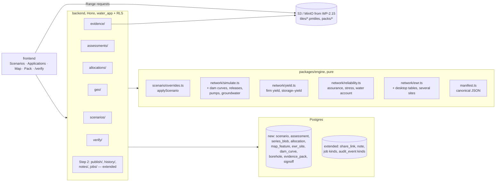

# Step 3: water-use licensing evidence and cumulative impact

Status: **plan, not started.** Gate to start: Step 2's exit criteria
([README § Gates](./README.md#gates-between-steps)). Regulatory statements
carry a reference tag, for example [NWA], and the sources are listed in
[§ References](#references). This plan is not legal advice. Any wording that
faces a regulator is agreed with the client and their legal adviser (see the
Step 2 → 3 gate).

Reconciled on 2026-09-23 against [step-1-hydrologist-tool.md](./step-1-hydrologist-tool.md)
and [step-2-shared-catchment.md](./step-2-shared-catchment.md). Where
those plans already deliver something, this plan links to the WP and only
lists the gap that remains ([§ 3](#3-scope)).

---

## 1. Summary

In South Africa, building a dam or taking more water usually needs a
water-use licence under the National Water Act, s21 [NWA]. The application
follows GN R267 of 2017 [R267]: a technical report is due within 105 days,
and the decision within 300 days of applying. That report needs surface-water
hydrology, the MAR, the Reserve and resource class, and the impact on
downstream users.

Step 3 turns the shared catchment model from Step 2 into the place where
evidence is made and checked:
- **Applicants** model their proposal as a **scenario** on a published
  baseline and get a reproducible **evidence pack** to attach to their WULA.
- **Assessors at CMAs and DWS** run **cumulative impact** across several
  applications and verify each pack.
- **NGOs** see the same numbers through read-only links, and can comment.

## 2. Users and jobs to be done

| User | Job to be done | What they use today | What would make them switch |
| --- | --- | --- | --- |
| **Applicant** (developer, agribusiness project manager) | Get a licence for a new or raised dam, or a bigger abstraction, quickly and without a rejected technical report. Show the proposal fairly. | A consultant's bespoke spreadsheet or yield study; weeks of back-and-forth with the CMA | A pack the CMA already trusts because it runs on *the CMA's own baseline*. Scenario to pack in days, not weeks. Fewer requests for more information. |
| **Applicant's consultant** (hydrologist, EAP) | Build the proposal (dams, crops, pumps, boreholes), test variants, write the hydrology section, and sign it off professionally | WRSM/Pitman naturalised flows, WRYM-style yield runs, Excel, the Desktop Reserve Model | Scenarios without copying projects; firm yield, assurance and EWR per site built in; a methodology statement and appendix generated for them; the numbers reproduce. |
| **Assessor** (CMA or DWS regional office) | Decide under s27 [NWA]: effect on the resource, other users and the Reserve; RQOs; efficient and beneficial use. Defend the decision at the Water Tribunal (s148). Look at cumulative impact, not one application at a time. | Reading each applicant's report and spreadsheet on its own terms; WARMS extracts; gazetted Reserve and classes | One shared, versioned baseline. Every application is a diff against it that can't hide an assumption change. Cumulative runs. A verification link that proves a pack hasn't been altered. |
| **Environmental NGO** (freshwater ecologist on the catchment forum) | Object or comment during public participation. Show when and how often the EWR fails with the proposal, and cumulatively. | Reserve determinations, DWS gauge records, the applicant's own consultant report | Read-only access to the *same* model the assessor uses. EWR failure by month and by site as the headline, not averaged away. The ability to test "what if all of these are built" without trusting the applicant. |

Six CMAs are now gazetted [CMAs], so assessment is moving from DWS head
office to the regions, and a shared per-catchment baseline fits how they will
work.

## 3. Scope

### In scope

Delivers these [planned-work.md](../planned-work.md) rows (fully, unless
marked):

- **Scenarios within a project.**
- **Water-use licences / allocations** (WARMS vs modelled use).
- **Assurance of supply & yield.**
- **Dam evaporation, seepage, area–volume curves.** Only the part beyond
  [WP-1.21](./step-1-hydrologist-tool.md#wp-121-n2-dam-areavolume-evaporation-seepage);
  see WP-3.5.
- **Operating rules**: the pump scenarios in model.md §4, drought
  restrictions and hands-off flows. The small rules (N4/Q3, Q18, Q5, Q7,
  Q1) are [WP-1.19](./step-1-hydrologist-tool.md#wp-119-operating-rules-n4q3-q18-q5-q7-q1).
  Step 1 puts pump scenarios off "until a hydrologist asks"; licensing is
  that ask.
- **Groundwater abstraction.**
- **Full EWR tables** (Desktop Reserve percentiles, several EWR sites).
- **Stress classes & water account.**
- **Catchment map** and **Derive areas from the map.** No step claims
  these yet. Step 1 lists the map under Step 2, but Step 2 keeps it out
  ("not planned in a step yet"), so Step 3 claims it (WP-3.12). Step 2
  leaves room for a `catchment_geometry` source in `data_feed.config`, and
  WP-3.12's boundary fills it.
- **Report generation**, as the licence evidence pack. It builds on
  [WP-2.15](./step-2-shared-catchment.md#wp-215-one-click-pdf-report) (the
  print route in Phase A, and Phase B's server-side render).
- **Stakeholder access** for assessors and NGOs, extending
  [WP-2.3](./step-2-shared-catchment.md#wp-23-published-baseline-restriction-notice-and-share-links)
  share links and
  [WP-2.7](./step-2-shared-catchment.md#wp-27-notes-and-comments) notes to
  scenarios and packs.

**Already covered elsewhere (cut from this plan):**

| Item | Where |
| --- | --- |
| Pinned runs | [WP-1.11](./step-1-hydrologist-tool.md#wp-111-pinned-runs). WP-3.1 only adds "cited" runs that can't be trimmed or unpinned. |
| Per-node series overlay; copies that remember source nodes; per-water-year series hashes | [WP-1.27](./step-1-hydrologist-tool.md#wp-127-run-comparison-per-node-overlay-and-leftovers) |
| Transfer free space (N4/Q3), transfer priority (Q18), irrigation reserve (Q5), ~~Pitman fallback (Q7)~~ (removed, engine 0.10.0), ~~Q1 rename~~ (not needed, engine 0.9.0 fixed the formula) | [WP-1.19](./step-1-hydrologist-tool.md#wp-119-operating-rules-n4q3-q18-q5-q7-q1) |
| Irrigation efficiency (N1), which redefines consumptive use | [WP-1.20](./step-1-hydrologist-tool.md#wp-120-n1-irrigation-application-efficiency) |
| Power-law dam area, evaporation, seepage (N2) | [WP-1.21](./step-1-hydrologist-tool.md#wp-121-n2-dam-areavolume-evaporation-seepage) |
| EWR shortfall attribution to farms (Q17) | [WP-1.23](./step-1-hydrologist-tool.md#wp-123-q17-ewr-shortfall-attribution-q11q13-curtailment-policy). WP-3.7 applies the chosen rule per EWR site. |
| H1 volume-conserving event response | [WP-1.24](./step-1-hydrologist-tool.md#wp-124-h1-volume-conserving-event-response) |
| Published baseline, catchment share links | [WP-2.3](./step-2-shared-catchment.md#wp-23-published-baseline-restriction-notice-and-share-links) |
| Change history and audit log | [WP-2.4](./step-2-shared-catchment.md#wp-24-change-history-and-audit-log-with-restore). Scenario, pack and share events are new `audit_event` kinds. |
| Notes and comments | [WP-2.7](./step-2-shared-catchment.md#wp-27-notes-and-comments). WP-3.15 extends `note`. |
| Background jobs | [WP-2.8](./step-2-shared-catchment.md#wp-28-background-jobs). Step 3 adds job kinds only. |
| PDF rendering (print route, headless Chromium, MinIO) | [WP-2.15](./step-2-shared-catchment.md#wp-215-one-click-pdf-report). WP-3.14 needs Phase B. |

### Out of scope

| Item | Where |
| --- | --- |
| Stochastic or climate-scenario yield (reliability over generated sequences, not only the historical record) | Step 4 (climate scenarios). Step 3 reports **historical** firm yield and says so in every pack. |
| Runoff module as an alternative flow generator (model.md §5) | After the hydrologist accepts it; not needed for licensing. H1 (WP-1.24) may bring in an alternative flow generator. |
| Aquifer modelling (drawdown, recharge). Step 3 takes the geohydrologist's sustainable yield as a cap | A specialist geohydrology report (R267 Annexure D item 5) [R267] |
| Dam safety classification and design (DW793, approved professional person) | Outside the app. The pack names it as a separate requirement for dams over 5 m and 50 000 m³ [DamSafety] |
| Water-quality modelling (s21(f)–(h) discharges) | Not planned |
| Submitting to DWS e-WULAAS electronically | Not planned. The pack is a file the applicant attaches. |
| SSO / MFA for assessors, public API, billing, multi-tenant onboarding | Step 4. **Leave room for:** MFA on the `contributor` role and on sign-off (WP-3.3, WP-3.13). |
| Afrikaans for Step 3 screens | Step 2's i18n foundation (WP-2.5) covers the farmer view only. Pack and applicant screens stay English unless the client asks. |

## 4. Prerequisites

**From Step 1** ([step-1-hydrologist-tool.md](./step-1-hydrologist-tool.md)):

| Prerequisite | Step 1 WP | Why Step 3 needs it |
| --- | --- | --- |
| The hydrologist has signed off the model, with a new engine release and recalibration | WP-1.1, WP-1.25 | A pack can't rest on an unaccepted model |
| H1 resolved or explicitly accepted | WP-1.24 | With H1 open, a storm can return more water than it brought. Not defensible evidence. |
| N1 irrigation efficiency, landed or declined | WP-1.20 | Defines consumptive use in the water account (WP-3.4) |
| N2 evaporation and seepage, landed or declined | WP-1.21 | WP-3.5 builds on its `node.dam_area_full_m2`, `dam_area_exponent`, `dam_seepage_per_day`, `lakeEvapFactor` and the `dam_evaporation`/`dam_seepage` outputs (landed, engine 0.16.0). If it was declined, WP-3.5 absorbs it (M → L). |
| Operating-rule answers (N4/Q3, Q18, Q5, Q7, Q1) | WP-1.19 | WP-3.8 extends the same `simulate.ts` supply step |
| Q17 attribution rule decided | WP-1.23 | WP-3.7 applies it per EWR site |
| Pinned runs | WP-1.11 | WP-3.1 extends it |
| Per-node overlay and per-water-year series hashes | WP-1.27 | The scenario compare view uses both |
| The POPIA privacy notice, data export and account deletion | WP-1.13 | Step 3 adds personal data (WARMS names, signers, comments) to all three |
| Deployed through the `production` environment | WP-1.14, WP-1.15 | – |

**From Step 2** ([step-2-shared-catchment.md](./step-2-shared-catchment.md)):

| Prerequisite | Step 2 WP | What Step 3 uses |
| --- | --- | --- |
| The `farmer` role, ranked below `viewer`, with extra permissive policies | WP-2.1 | The pattern for `contributor` (WP-3.3) |
| Published baseline (`run_publication`), with published runs exempt from `trimRuns` | WP-2.3 | A scenario's base must be a published run |
| Share links (`share_link`, token in the URL fragment, `SECURITY DEFINER app_share_view`) | WP-2.3 | Extended with scenario and pack targets (WP-3.15) |
| Audit log and model revisions (`audit_event`, `model_revision`, `series_revision`) | WP-2.4 | New event kinds; revisions show why the baseline changed |
| Notes (`note`) | WP-2.7 | Extended with scenario and pack targets and participation visibility (WP-3.15) |
| Background jobs (`job` table, `JOB_TRANSPORT`, worker Lambda, acting user under RLS) | WP-2.8 | New kinds: `yield`, `assessment`, `pack_build` |
| Print report route (Phase A); server render in Phase B, if built | WP-2.15 | The pack's HTML view and PDF. The pack **needs Phase B** (a server-rendered, hashed PDF), so Step 3 is the trigger for Step 2's D9. |
| At least one catchment running live with real users; liability wording agreed (Step 2 D10) | Gate | – |

**Open decisions to settle before WP-3.3** (see § 11):
- D1: who hosts the baseline;
- D2: how much of the published baseline an applicant can see;
- D3: disclosure of allocation data.

## 5. Architecture changes

What changes in the existing system (and in what Steps 1–2 add):

| Existing piece | Change |
| --- | --- |
| `packages/engine/src/run.ts` `runModel` | Signature unchanged. New optional fields on `NetworkNode` and `ProjectSettings` default to the behaviour of the engine before them, so an old project runs identically. `ENGINE_VERSION` bumps once per physics WP (Step 2 takes it to 0.5.0). |
| `packages/engine/src/compare.ts` `diffInputs` | Learns the new fields, scenario overrides, allocations and map-derived areas. With full series values available (WP-3.1), it can compare values directly as well as WP-1.27's per-year hashes. |
| `packages/engine/src/testing/invariants.ts` | New checks per physics WP. `checkBalance` catchment closure gains dam releases and groundwater (WP-1.20 and WP-1.21 already add their loss terms). |
| `backend/src/runs/execute.ts` | `loadRunInput(runId)` rebuilds the input from a run snapshot plus blobs. `trimRuns` already spares pinned (WP-1.11) and published (WP-2.3) runs; it now also spares **cited** runs. |
| `model_run` | New nullable `scenario_id` (expand only). No new pin column: WP-1.11's `pinned_at` stays the pin. |
| `project_role` enum and `projects/access.ts` | Adds `contributor` between `farmer` and `viewer` (WP-3.3), in its own migration, as WP-2.1 did for `farmer` |
| `share_link` (WP-2.3), `note` (WP-2.7), `job` (WP-2.8), `audit_event` (WP-2.4) | Expand-only: new targets, visibilities and kinds (WP-3.15, 3.6, 3.11, 3.14) |
| `backend/src/routes.test.ts` `PUBLIC` | Gains `POST /share/scenario`, `POST /share/pack` and `GET /verify/:hash`. They are new public surfaces: `/audit/auth` and `/audit/xss` before release. |
| `docker-compose.yml` | Reuses WP-2.15 Phase B's `minio` and `dev:s3:*` scripts for tiles and packs; adds `dev:tiles:*` |
| `infra/` | S3 prefixes `tiles/` and `packs/` in WP-2.15's bucket, or a separate one with object lock (D12). A CloudFront behaviour for `/tiles/*` with Range passthrough. CSP updates in `infra/security_headers.tf`. No new queue: WP-2.8's `jobs` queue and worker Lambda carry the new kinds. |
| `scripts/guards/check_web_bundle_budget.mjs` | MapLibre GL is roughly 0.8 MB minified. It exceeds the 100 KB largest-chunk and 280 KB total ceilings, so it must be lazy-loaded, and the budget change is a deliberate, logged decision (D8). |

---

## 6. Work packages

Build order is the numbering. **A first usable slice** is WP-3.1 → 3.2 →
3.3 → 3.4 → 3.13 → 3.14, which gives a signed pack for a dam-raise scenario
on a published baseline in about 4 months (WP-3.3 grew to L once it had
to fit WP-2.1's role design). The rest of the physics, the
allocations, cumulative impact, maps and NGO access follow.

Sizes are for one developer: S ≤ 3 days, M ≤ 2 weeks, L > 2 weeks (3–5
weeks). Reusing Steps 1–2 took the job runner, audit trail, share and
note foundations, the per-node overlay and the small operating rules out
of this plan, saving about 3 weeks. The contributor role grew from M to L,
so the total is 7 L + 8 M, still about **8–9 months**. Add M if Step 3
must build WP-2.15 Phase B.

---

### WP-3.1 Reproducible inputs and cited runs

- **Status (2026-09-26): built** (`021_series_blob.sql`,
  [data-model.md § Stored run inputs](../data-model.md#stored-run-inputs-021_series_blobsql)),
  differently from the plan below in places:
  - engine `manifest.ts`: `canonicalJson` (RFC 8785, the Appendix B number
    vectors and §3.2 examples as tests) and `seriesDigest`, equal to the old
    `seriesHash` input;
  - `series_blob` is keyed `(project_id, sha256)` and holds only the values;
    a second table, `run_input_series (run_id, kind, start_date, sha256)`,
    holds each run's references (a relational link, so garbage collection and
    the blob's RLS are joins, not jsonb scans). Blobs are readable only
    through a run the user can see, not by project role alone; `water_app`
    has no UPDATE or DELETE on either table; a trigger deletes a blob when
    its last run goes ([security.md](../security.md#authorization-per-project-roles-enforced-by-postgres-rls));
  - `loadRunInput(db, runId)` rebuilds the `ModelInput`; the round trip is
    byte-identical on all three example catchments. Older runs throw
    `not_reproducible`. The uncertainty band's `…/runs/:runId/model-input`
    now uses it, so a run saved since 020 keeps getting bands after its data
    changes;
  - "cited" is the SQL function `model_run_cited(run)` inside `RUN_KEPT_SQL`;
    WP-2.3's publication (022) added its first clause and WP-3.2 (024) a scenario's base run,
    so trim and the `DELETE` route (`409 this run is cited by scenario "…",
    so it is kept`) keep it. Also built with WP-3.2: the unpin `409`, cited
    runs off the pin ceiling, and `RunMeta.citedBy`.
  - Built since (2026-09-26): `GET …/runs/:runId/reproduce`
    (`backend/src/runs/reproduce.ts`: `identical`, `differs` with the list,
    `not_reproducible`, `inconsistent`, `failed`), `RunMeta.reproducible`, and
    the Runs tab's **Check reproduction** action (`runs/ReproducePanel.svelte`)
    with an **Inputs not stored** tag on runs from before 021. The tag marks
    the exception rather than badging nearly every run "Reproducible", and the
    "Cited" lock is the existing **Published** / **Scenario base** tags with
    no ✕ (both UI choices pending the hydrologist). The publication-trim skip
    for cited runs landed with 024.
  - Left for the WPs that add them: the evidence-pack and assessment clauses
    of `model_run_cited` (WP-3.13, WP-3.14).
- **Goal.** A run can be recomputed exactly years later, and a run that
  evidence cites can never disappear.
- **What Steps 1–2 already give, and the gap that remains:**
  - WP-1.11 pins up to 5 runs per project (`pinned_at`), and WP-2.3 spares
    published runs from `trimRuns`. But an editor can unpin, and WP-2.3
    deletes publications beyond the newest 12, after which their runs
    become trimmable. A run cited by a scenario base or an issued pack
    needs a lock that no editor action lifts. **Gap: kept here.**
  - A run stores only a hash of each input series
    ([data-model.md](../data-model.md#time-series-storage)). WP-1.27 adds
    per-water-year hashes, which *detect* a change. WP-2.4's
    `series_revision` keeps old values, but only 5 versions and 180 days.
    Neither can *recompute* a run cited in a licence years later. **Gap:
    kept here.**
- **Changes**
  - *Engine:* `manifest.ts`:
    - `canonicalJson(value)` (RFC 8785 JCS: sorted keys, ES number
      formatting);
    - `seriesDigest(values)`, the same SHA-256 input as the current
      `seriesHash`, so existing hashes stay valid. The SHA-256 itself stays
      in the backend (`node:crypto`), and the browser uses WebCrypto, which
      keeps the engine free of I/O and Node APIs.
  - *Backend:*
    - `executeRun` writes each input series' values to `series_blob`
      (content-addressed, deduplicated) and references it from the snapshot;
    - new `loadRunInput(db, runId)` rebuilds the exact `ModelInput` from a
      run;
    - `trimRuns`, extended from its latest (WP-1.11 plus WP-2.3) version,
      also excludes **cited** runs: those referenced by a `scenario`
      (WP-3.2), an `evidence_pack` or an `assessment`;
    - the unpin (`PATCH …/runs/:id { pinned: false }`) and `DELETE` routes
      return `409 run is cited by …` on a cited run;
    - WP-2.3's publication-history trim skips publications whose run is
      cited.
    - Cited runs don't count against `PINNED_RUNS_PER_PROJECT`.
- **Data model** (migration `NNN_reproducible_runs.sql`)
  - `series_blob(sha256 text PK, project_id, start_date, values float8[],
    created_at)`: RLS viewer read, editor insert, no update or delete for
    `water_app`. Keyed per project so RLS stays simple; dedup is within a
    project.
  - No new pin column. "Cited" is derived from the RESTRICT foreign keys
    that the later WPs add, so it can't drift out of step.
  - Backfill: none. Old runs keep hash-only snapshots and are labelled "not
    reproducible from stored inputs".
- **API.**
  - `GET /projects/:id/runs/:runId/reproduce` (viewer): re-runs from the
    stored inputs with the current engine and returns
    `{ identical: boolean, engineVersionThen, engineVersionNow, differences }`.
  - `RunMeta` gains `reproducible` and `citedBy: { kind, id }[]`, next to
    WP-1.11's `pinnedAt`.
- **UI.** Runs tab:
  - a "Reproducible" badge and a "Cited" lock beside WP-1.11's pin;
  - a "Check reproduction" action with states: running, identical,
    differs (with the list), not reproducible (legacy).
- **Local-first.** Postgres only; nothing new.
- **Tests.**
  - Unit: `canonicalJson` against the RFC 8785 test vectors; digest parity
    with `seriesHash`.
  - DB/RLS:
    - a non-member can't read a blob (positive control: a viewer can);
    - a cited run survives a 25-run loop and the 12-publication trim
      (positive control: an uncited, unpinned run is trimmed);
    - unpinning or deleting a cited run gives 409.
  - Invariant: `runModel(loadRunInput(run))` is byte-identical to the
    stored summary on all three example catchments.
- **Docs.** data-model.md (§ Time-series storage, run snapshots, Run output
  volume), api.md § Runs, run-comparison.md.
- **Acceptance.**
  - Re-uploading a series after a run doesn't change that run's
    reproduction.
  - Reproduction of a run on the same engine is `identical: true`.
  - No editor action removes a cited run.
  - DB growth per new series version is at most one compressed array
    (one daily array of the record's length, raw).
- **Size.** M. **Depends on:** WP-1.11, WP-2.3.

---

### WP-3.2 Scenarios within a project

- **Status (2026-09-26): built**, the UI included
  ([scenarios.md](../scenarios.md), issue #18): `packages/engine/src/scenario/`,
  migration `024_scenarios.sql`, `backend/src/scenarios/`, the scenario per
  side in `/compare/runs`, and the frontend API client. Where the build
  differs from the plan below: the base-run key is `NO ACTION` rather than
  `RESTRICT` (so a project delete still cascades); a scenario stores
  `owned_node_ids` (the proposer's nodes, for `classifyOp`) until WP-3.3
  derives them from an applicant's links; a scenario run records its ops and
  their classes in its own snapshot, which is what compare shows; and
  `run_series.node_id` is checked against the run's snapshot instead of a
  foreign key to the live `node` table. The Scenarios tab, its override
  editor, the scenario-vs-base comparison, the compare page's Scenario
  overrides section, e2e and axe are built too
  ([ui.md § Scenarios](../ui.md#scenarios-tabscenarios)). The editor has
  both the one-change form over every op and, since 2026-09-26, the
  plan's **override mode**: the Network, Crops and Transfers tables on the
  scenario's model, their edits recorded as ops
  (`scenarios/OverrideEditor.svelte`, `overrideDiff.ts`). A scenario also
  keeps the display names its ops need (`047_scenario_op_names`), so a node
  a rebase dropped still reads by name.
- **Goal.** A scenario is a named, ordered list of **overrides on a base
  run**. It is run and compared without copying the project.
- **How it relates to today:**
  - **Copy project** (`POST /projects/:id/copy`) stays for true forks, such
    as another consultant's divergent model. A copy gets fresh ids;
    WP-1.27's `copied_from_node_id` tag lets compare match copied farms, but
    the copy still diverges from its source.
  - A **scenario** keeps the base's ids, so every change lines up by id.
    The base can't drift, because a scenario applies to a **run snapshot**
    (inputs plus blobs, WP-3.1), not to the live model. For applicants the
    base must be a **published** run (WP-2.3); editors may base a scenario
    on any run they can see.
  - WP-2.4's model revisions record edits to the *live* model; scenario
    ops never touch it, so the two histories never mix.
  - **Run comparison** needs no new endpoint. A scenario run is a
    `model_run` with `scenario_id`, so `/compare?a=
:<baseRun>&b=
:<scenarioRun>`
    works as today.
- **Changes**
  - *Engine:* `packages/engine/src/scenario/overrides.ts`, pure. It is a
    folder because Step 4 WP-4.11 adds its climate and stochastic
    transforms beside it (`packages/engine/src/scenario/`):
    - `applyScenario(base: ModelInput, ops: ScenarioOp[]): { input, applied: AppliedOp[], problems: string[] }`.
    - `ScenarioOp` is a closed union, each op targeting by id:
      - `node.set { nodeId, field, value }`, `node.add { node }`,
        `node.remove { nodeId }` (re-links upstream to its downstream);
      - `cropArea.set { nodeId, cropId, areaM2 }`, `crop.add`;
      - `transfer.add | set | remove`;
      - `settings.set { path, value }`;
      - `series.scale { kind, factor, from?, to? }`;
      - `demand.scale { factor, nodeIds?, months?, category? }` (added
        later, issue #53 R1, engine 0.41.0: [scenarios.md](../scenarios.md));
      - later ops for the new physics fields: `allocation.set`,
        `ewrSite.set` (built as `ewrRule.set`, engine ≥ 1.6.0, issue #64),
        `borehole.add` (built, WP-3.9).
    - Each op is classified as **proposal** (the applicant's own or new
      nodes, crops, pumps and boreholes) or **baseline assumption** (any
      `settings.*`, EWR tables, calibration, flow-share method, series,
      other parties' nodes). `classifyOp(op, ownedNodeIds)` is exported.
    - The engine stays pure: the backend loads the base input, the engine
      transforms plain data, and `runModel` is unchanged.
  - *Backend:* `backend/src/scenarios/`:
    - routes;
    - zod schema mirroring `ScenarioOp`;
    - `executeScenarioRun` = `loadRunInput(base)` → `applyScenario` →
      `runModel` → `executeRun`'s persistence, with `scenario_id` set.
  - *Frontend:* `lib/components/scenarios/`:
    - the scenario editor reuses the Network, Crops and Transfers editors
      in "override mode": the model editor (`lib/model/editor.svelte.ts`)
      records edits as ops instead of a saved document;
    - an op list with undo;
    - the compare page gains a **Scenario overrides** section above "What
      changed". The per-node overlay is WP-1.27's, used as is.
- **Data model** (migration `NNN_scenarios.sql`)
  - `scenario(id, project_id, name, description, base_run_id → model_run
    RESTRICT, ops jsonb, ops_sha256, owner_user_id, status
    ('draft' | 'submitted' | 'withdrawn' | 'decided'), created_at, updated_at)`.
  - Same-project trigger on `base_run_id`; covering indexes on
    `(project_id)`, `(base_run_id)` and `(owner_user_id)`.
  - `model_run.scenario_id` (nullable FK, covering index, same-project
    trigger).
  - RLS in this WP: viewer read, editor write. WP-3.3 narrows it for
    applicants.
- **API.**
  - `GET|POST /projects/:id/scenarios`;
  - `GET|PATCH|DELETE /projects/:id/scenarios/:sid` (PATCH replaces
    `ops`; `409` once submitted);
  - `POST /projects/:id/scenarios/:sid/runs`;
  - `POST /projects/:id/scenarios/:sid/rebase { baseRunId }` returns the
    re-applied ops plus `problems`, for example a removed node.
  - `GET /compare/runs` adds `scenario: { id, name, ops, classified }` per
    side.
- **UI.**
  - A new workspace tab, **Scenarios** (`?tab=scenarios`). The list's
    empty state reads: "No scenarios yet. A scenario changes the published
    baseline without copying it."
  - The editor shows a banner, "Based on run *X* (published 2027-…)", and
    a **Baseline assumptions changed** callout in red whenever any op is
    classed as a baseline assumption.
  - Viewers get a read-only op list.
  - On a phone, the op list and results are stacked; editing happens in
    the one-node form.
- **Local-first.** Postgres only.
- **Tests.**
  - Unit (engine):
    - each op applies and rejects bad targets;
    - `node.remove` keeps a valid tree;
    - applying ops to a copy never mutates `base`;
    - **no silent change**, a fuzz property in `compare.test.ts`: for
      random op lists on `randomInput(seed)`, every op that changes the
      resolved input produces at least one `InputChange`, and an empty op
      list produces none.
  - Invariants: `checkAll` on `applyScenario(randomInput(seed), randomOps)`.
  - DB/RLS: a scenario can't reference another project's run (positive
    control: the same project's run can).
  - e2e: create a scenario that raises a dam 20 %, run it, compare, and
    see the op and the delta.
  - axe on the Scenarios tab, light, dark and phone.
- **Docs.**
  - New `docs/scenarios.md`;
  - api.md § Scenarios;
  - data-model.md;
  - run-comparison.md (scenario section);
  - ui.md (the tab);
  - planned-work.md row ✅.
- **Acceptance.**
  - A dam-raise scenario runs without copying the project and appears in
    compare, with the dam's change matched by id.
  - Editing the live model afterwards doesn't change the scenario's
    result.
  - Rebasing onto a newer baseline reports any op that no longer applies.
- **Size.** L. **Depends on:** WP-3.1.

---

### WP-3.3 Applicant role and submission workflow

- **Status (2026-09-26): first slice built**, UI included
  ([scenarios.md § Applications](../scenarios.md#applications-wp-33),
  [ui.md § Applications](../ui.md#applications-wp-33)): migrations
  `044_contributor_role.sql` and `045_contributor_scope.sql` (the role, the
  audit of WP-2.1's policies, `scenario.origin` and the decision columns,
  `scenario_member`, the origin-aware scenario, `model_run` and `run_series`
  policies), the scenario routes' ownership rules and the
  `…/submit | withdraw | reopen | decide`, `…/members`, `…/base` and
  `/applications` routes, the contributor route inventory and every RLS
  test below, the Applicant view, the assessors' Applications tab, the
  Members panel's "Applicant", `seed:examples`' demo applicant, e2e and axe.
  Where the build differs from the plan: the base is read through
  `app_published_run_input(project, run)` rather than
  `app_scenario_base(scenario)` (so create and rebase use it too); a
  withdrawn application reopens through `…/reopen`; drafts are private from
  viewers *and* editors for applications only, a team scenario (an
  editor's, `origin = 'team'`) keeping WP-3.2's viewer-read rule; there is no
  "under review" status (a submitted application is the assessors' queue).
  D2 is built on its recommended default, **pending the client**. Left, in
  [followups.md § Applicants](../followups.md#applicants-wp-33): the
  applicant's view of results (the `GET /compare/runs` contributor
  projection), the run-row exposure it would close, and the open decisions.

- **Goal.** Applicants and their consultants work on the **assessor's
  published baseline** without seeing other applicants' drafts, other
  farms' confidential inputs, or anything unpublished. Assessors see what
  has been submitted.
- **Role design: same pattern as WP-2.1's `farmer`.**
  - The effective role order becomes
    `farmer < contributor < viewer < editor < owner`. A separate migration
    `NNN_contributor_role.sql` holds only
    `ALTER TYPE project_role ADD VALUE 'contributor' BEFORE 'viewer'`,
    because an enum value added inside a transaction can't be used until
    it commits.
  - **Why below `viewer`, not between viewer and editor.** Every existing
    policy is `app_has_role(project, 'viewer' | 'editor' | 'owner')`,
    compared with `>=`. A contributor ranked above viewer would read every
    run, the live model and every `model_run.inputs` (all farms'
    parameters). Below viewer, every existing policy refuses it with no
    change, just as for `farmer`. The new access is only **extra permissive
    policies**.
  - `backend/src/projects/access.ts`: `Role` gains `contributor` with a
    rank between `farmer` and `viewer`, for example farmer −2 and
    contributor −1, updating WP-2.1's −1 for farmer. Every existing
    `requireRole(…, 'viewer')` route answers **403** to a contributor. That
    is the fail-closed default. `lib/api/types.ts` `RANK` follows.
  - `app_project_role()` still takes the maximum of the direct and team
    roles. Team roles never map to `contributor`, so a team member who is
    also a contributor is an editor. **Consequence:** a consultancy must
    not host the baseline in its own team while its staff act for
    applicants (D1).
- **How `farmer` and `contributor` coexist.**
  - One `project_member` row holds one role. An irrigator applying to raise
    their own dam is the common case, so a contributor keeps their farm
    links. WP-2.1's farm-scoped policies must be keyed on
    `app_farm_nodes()` (the `farm_link` rows) and not on `role = 'farmer'`.
    WP-3.3 audits every WP-2.1 policy and helper **from its latest
    definition** and changes only those that test the role exactly (for
    example `app_is_farmer`, the `project` row policy, and `run_series`
    through publications). It widens them to "`farmer` or `contributor`",
    so a contributor sees everything a farmer with the same links sees,
    plus the contributor grants below.
  - WP-2.1's `farm_link` trigger (requires a member row) and its catalogue
    guard ("every table with a `node_id` has a farmer-aware SELECT policy
    or is on the 'farmers never read' list") are extended to say, per
    table, what a contributor reads.
  - WP-2.2's `/farmers` management stays as it is. Contributors are managed
    through `/members` with `role: 'contributor'`.
- **What a contributor may read and write** (new permissive policies):

  | Table | SELECT | Writes |
  | --- | --- | --- |
  | `project`, `run_publication` | the row / all publications (WP-2.3 already allows any member) | none |
  | `project_member` | own row only | leave |
  | `model_run` | own scenarios' runs only (`scenario.owner_user_id = me`). Published runs are **not** readable as rows, because `inputs` and `summary` hold every farm (the reason WP-2.1 hides `model_run` from farmers). | none directly; created through scenario runs |
  | baseline inputs and results | through `SECURITY DEFINER app_scenario_base(scenario_id)`: the published run's inputs, for the owner, used **server-side** by `executeScenarioRun`; the API projects them per D2 | none |
  | `run_series` | own scenario runs; published runs' catchment keys (WP-2.1's allowlist helper) and their own farm keys | none |
  | `scenario` | own (`owner_user_id = me`, or listed in `scenario_member`) | own while `draft` |
  | `node`, `crop_area`, `transfer` | as a farmer: own linked nodes and gauges, unless D2 opens the published baseline further | none on the live model |

  - **D2 decides how much baseline detail an applicant sees.** The
    recommended default follows Step 2's D1 (farm confidentiality): the
    applicant sees
    - catchment series;
    - their own nodes;
    - every EWR site;
    - **anonymised** per-farm deltas downstream ("Farm 3 downstream: supply
      −4 %").

    Assessors (editors) see names. The pack (WP-3.14) carries names only
    in the assessor's copy, unless D2 or the client decide otherwise.
- **Changes**
  - *Backend:*
    - scenario routes enforce ownership and status transitions;
    - submit freezes `ops` (the ops hash is recorded);
    - `GET /compare/runs` gains a contributor projection (it can't return
      `inputs` snapshots to a contributor);
    - a route inventory test classifies every `/projects/:id` route as
      contributor-allowed or contributor-403, extending WP-2.1's farmer
      inventory.
  - *Frontend:*
    - `lib/api/types.ts` role;
    - members panel: invite as "Applicant";
    - a contributor is redirected from the workspace to the Scenarios tab
      in an "Applicant view" shell;
    - an **Applications** tab for assessors: submitted scenarios, status
      and links to their packs.
- **Data model**
  - `NNN_contributor_role.sql` (the enum value only) and
    `NNN_contributor_scope.sql`: helpers `app_is_contributor(project)` and
    `app_scenario_base(scenario)`, both `SECURITY DEFINER`, `STABLE`, with
    `search_path` pinned; the policies above; the widened farm-link
    policies.
  - `scenario_member(scenario_id, user_id, added_by)`: the applicant's
    consultant and client share one scenario. Covering indexes. Only the
    owner adds, and only users who are members of the project.
  - `scenario` RLS:
    - SELECT: owner or `scenario_member`; editor+ when `status <> 'draft'`;
      viewers when `status = 'decided'` or it is shared (WP-3.15);
    - INSERT: contributor+ with `owner_user_id = app_current_user_id()`;
      for a contributor, `base_run_id` must be the current or a historical
      published run (`app_run_published`, WP-2.1);
    - UPDATE: owner while `draft`; an editor may move `status` to
      `decided`;
    - DELETE: owner while `draft`.
  - **Audit.** Submissions, withdrawals and decisions are `audit_event`
    kinds (WP-2.4): `scenario.created/submitted/withdrawn/decided`. There
    is no separate event table. WP-2.4's guard test ("every write route
    records history") covers the new routes.
- **API.**
  - `POST /projects/:id/scenarios/:sid/submit | withdraw | decide { outcome, note }`;
  - `POST|DELETE /projects/:id/scenarios/:sid/members`;
  - `POST /projects/:id/members` accepts `role: 'contributor'`, with the
    invite flow unchanged.
- **UI.**
  - An applicant sees the published baseline, their own farm (if linked)
    and their own scenarios; the header says "Applicant view".
  - Assessor Applications list: loading, empty ("No applications
    submitted") and error states; sort by date or status.
- **Local-first.** `seed:examples` adds a demo applicant
  (`applicant@example.com`, also linked to one farm, to exercise the
  coexistence) and a submitted scenario.
- **Tests.** DB/RLS, each "cannot see" with its positive control:
  - applicant A can't see applicant B's draft (control: A sees their own,
    and so does A's `scenario_member`);
  - a contributor can't SELECT a published `model_run` row (control: can
    read its catchment `run_series` and their own scenario run);
  - a contributor can't `PUT /model` (control: an editor can);
  - an editor can't see a draft (control: sees it once submitted);
  - a submitted scenario's `ops` can't change;
  - a contributor linked to a farm sees that farm's `publication_farm`
    row (control: a contributor without a link doesn't);
  - a team member who is also a contributor gets the editor view (the
    `app_project_role()` max).

  Plus: the route inventory; the WP-2.1 string-scan test extended (no
  contributor response contains another farm's name under the D2 default);
  e2e for the submit flow; axe.
- **Docs.** data-model.md (roles table: `farmer < contributor < viewer`,
  the contributor scope table), api.md § Projects/Members/Errors,
  security.md (the new in-project trust boundary), ui.md.
- **Acceptance.**
  - All the RLS tests pass.
  - An applicant's API calls to any non-published run return `404` or
    `403`, never data.
  - WP-2.1's farmer tests stay green unchanged.
- **Size.** L (the policy audit across WP-2.1's tables is the bulk). The
  plan said M before the farmer role existed.
- **Depends on:** WP-3.2, WP-2.1, WP-2.3, WP-2.4; D1, D2.

---

### WP-3.4 Assurance of supply, stress classes and the water account

- **Status (2026-09-26): built** (engine 0.32.0; [model.md §2.11a–b](../model.md),
  [followups.md](../followups.md) for what's left). Where the build differs
  from the plan below: the three outputs sit in one sub-object,
  `RunSummary.supplyAssurance.{reliability, stress, waterAccount}`, computed
  by `network/reliability.ts`; the setting is the flat
  `settings.assuranceAnnualThreshold`; time-based reliability counts demand
  days only; stress grids cover the whole run and include a system grid and
  other water users; seepage is a memo in the account (it rejoins the river),
  dam releases wait for WP-3.5, and EWR required vs met uses the pragmatic
  EWR at each site. `runModelWithoutChecks` (ensemble members) skips it. The
  definitions are pending the hydrologist.
- **Goal.** The standard planning outputs an assessor reads first. These
  are new outputs only; model results don't change.
- **Changes**
  - *Engine:* `network/reliability.ts` → `RunSummary.reliability`,
    `RunSummary.stress` and `RunSummary.waterAccount`:
    - **Reliability per farm** over the reporting window:
      - time-based: % of days demand is fully met;
      - volumetric: Σ supplied / Σ demand;
      - annual: % of water years with supply ≥ `settings.assurance.annualThreshold`
        (default 0.9, a project setting, not a standard).
    - **Resilience** (mean length of a failure run) and **vulnerability**
      (mean and maximum deficit per failure), after [Hashimoto 1982].
    - **Stress class** per farm × water-year month from the supply ratio:
      ≥ 95 % Low, ≥ 85 % Moderate, ≥ 70 % High, ≥ 50 % Severe, otherwise
      Critical (model.md §4).
    - **Water account** per water year:
      - in: rain volume, natural flow, groundwater;
      - out: consumptive irrigation (crop use as WP-1.20 defines it:
        `e × G`, or `G(1 − r)` if N1 was declined), dam evaporation and
        seepage (WP-1.21 outputs `dam_evaporation` and `dam_seepage`), dam
        releases (WP-3.5), outflow;
      - Δ storage;
      - EWR required vs met at each site;
      - a closure residual.
  - *Frontend:*
    - `lib/components/reliability/`: a table, and a stress heat map that
      reuses the `EwrHeatmap` grid pattern;
    - `WaterAccount` table and chart.
- **Data model.** None (summary jsonb).
- **API.** `RunSummary` fields (api.md); `summary.csv` gains the three
  blocks.
- **UI.** Runs tab, new sections. Colour is never the only cue: the class
  name is in the cell. Runs from older engines show "Not computed by engine
  x.y".
- **Local-first.** n/a.
- **Tests.**
  - Unit: hand-worked examples for each metric; bounds 0–1; reliability is
    1 iff every deficit is 0.
  - Invariants (`invariants.ts`):
    - `checkReliability`: volumetric reliability equals the curtailment
      window's ΣI/ΣH per farm;
    - `checkWaterAccount`: closes to float noise every water year;
    - `checkDoubledCropAreas` extended: with return flow 0, doubling crop
      areas never raises any reliability metric.
  - A TZ-skewed run for the water-year boundaries.
- **Docs.**
  - model.md: new §2 subsection **"Assurance of supply and stress
    classes"** and **"Water account"**;
  - §4 marks stress classes as ported;
  - api.md; ui.md.
- **Acceptance.** Every metric shows on the three examples. The water
  account closes to within 1e-10 of Σ|flows| per year. `ENGINE_VERSION`
  gets a minor bump, and all existing outputs are byte-identical.
- **Size.** M. **Depends on:** none (can run in parallel with WP-3.2).

---

### WP-3.5 Dam storage: area–volume curves, losses and releases

- **Status (2026-09-26): built** (engine 0.35.0, migration
  `041_dam_storage.sql`; [model.md §2.7a](../model.md#27a-dam-evaporation-rain-on-the-dam-and-seepage-engine--0160-audit-n2)
  "Dam geometry, losses and releases"): survey curves (linear in volume,
  replacing the power law), releases (pass inflow / fixed, outlet cap),
  monthly lake factors, and the seepage destination, all off by default and
  bit-identical when off. Engine, API validation, the node form (paste,
  table, chart), Settings, scenario ops, help, e2e. Where the build differs
  from the plan below:
  - the curve is a `jsonb` column on `node` (`dam_curve`), not a `dam_curve`
    child table: a handful of rows always read and written with the node,
    covered by the node's RLS (members, and a farmer's own linked nodes)
    with no new table, trigger or grant;
  - no `deadStorageM3` field: dead storage stays `damMinPct` (Q5), which
    already does what item 2 asks;
  - pass inflow's default target is the EWR **required at the node** (Z,
    its own and upstream shares), less the flow already bypassing the dam,
    not the node's own share Y (pending the hydrologist);
  - pass inflow passes inflow whatever the dam's level; a fixed release
    draws only above dead storage;
  - not built: capacity loss to sediment (item 5), and the survey curve as
    a scenario `node.set` op; both in [followups.md](../followups.md). The
    `FUZZ_CASES=20000` soak was run at 2 000 cases per runoff model.
- **Goal.** Dam behaviour good enough for a storage licence (s21(b)).
- **[WP-1.21](./step-1-hydrologist-tool.md#wp-121-n2-dam-areavolume-evaporation-seepage) delivers** (landed, engine 0.16.0):
  - evaporation `E = k_lake × A-pan(month)/days × A(S)`, with a
    power law `A(S)` from `node.dam_area_full_m2` and `dam_area_exponent`
    (default 0.7), and one settings value `lakeEvapFactor` (default 0.75);
  - rain on the dam, `rain × A(S)`;
  - seepage `node.dam_seepage_per_day × S`, clamped so storage ≥ 0, which
    joins the farm's outflow the same day;
  - output keys `dam_area`, `dam_evaporation`, `rain_on_dam` and
    `dam_seepage`, and warning W6 (a dam with no area data gets an area
    estimated as capacity ÷ 3 m);
  - model.md §2.7a.

  The gap it leaves for licensing: no survey curve, no releases, no monthly
  lake factors, and no choice of where seepage goes. Q5 (engine 0.16.0)
  already made `damMinPct` the dam's minimum operating level (dead storage):
  irrigation can't draw below it and it still evaporates, so item 2 below
  starts from that field.
- **This WP adds:**
  1. **Tabulated survey curves**: elevation–area–volume rows, as captured
     on the DWS dam technical data form (DW789) [R267]. Linear
     interpolation is used, and a power-law fit is the fallback when there
     is no survey.
  2. **Dead storage** below the lowest outlet: not available for
     irrigation, but it evaporates.
  3. **Low-flow releases / compensation flow**, a common licence
     condition. Each dam gets a rule:
     - `passInflowUpTo`: pass inflow below the dam up to that node's EWR
       share (or a fixed m³/day by month);
     - `fixedRelease`: release a fixed m³/day by month;
     - capped by `outletCapacityM3Day`.
  4. **Seepage destination**: lost from the catchment, or returned
     downstream as a fraction.
  5. **Capacity loss to sediment** (optional %/year) for long records.
- **Changes**
  - *Engine:*
    - `NetworkNode` gains `damCurve?: { levelM, areaM2, volumeM3 }[]`,
      `deadStorageM3`, `release?: ReleaseRule`, `outletCapacityM3Day`,
      `seepageReturnPct` and `sedimentationPctPerYear`;
    - `simulate.ts`: `A(S)` comes from the survey curve when present, else
      from WP-1.21's power law, so WP-1.21's evaporation code is reused,
      not duplicated. A release step comes before irrigation (release, then
      G). Seepage is split into lost and returned by `seepageReturnPct`;
    - a new output key `dam_release`. WP-1.21's `dam_area`,
      `dam_evaporation` and `dam_seepage` keys are unchanged.
  - *Backend:*
    - `node` columns; a `dam_curve` child table;
    - `model/validate.ts`: a monotone curve, volume at the top row ≈
      capacity (±1 %, else a warning).
  - *Frontend:*
    - Network one-node form: a **Dam** section;
    - curve table paste (CSV);
    - a small area–volume chart.
- **Data model** (migration)
  - `dam_curve(node_id, project_id, level_m, area_m2, volume_m3)`: RLS as
    `node`, same-project trigger, covering index. For WP-2.1's catalogue
    guard it gets a farmer-aware policy: a farmer or contributor reads
    their own linked nodes' curves only.
  - `node` expand-only columns, all nullable, or defaulted to today's
    behaviour (release none, dead storage 0).
- **API.** `ProjectModel.nodes[].damCurve` and friends. `PUT /model`
  validation.
- **UI.**
  - A dam with no curve shows "Using power-law area (WP-1.21)".
  - Warnings are inline.
  - Viewers get read-only values.
- **Local-first.** n/a.
- **Tests.** Invariants:
  - `checkBalance` extended: storage within [0, capacity];
  - irrigation never draws below dead storage;
  - evaporation + seepage ≤ the storage available that day;
  - release ≤ outlet capacity;
  - under `passInflowUpTo`, water passed below the dam = MIN(inflow,
    requirement, outlet capacity);
  - the catchment closes, with losses as a sink;
  - monotone: a larger `k_lake` never raises storage or supply;
  - defaults are byte-identical to the previous engine on the examples.

  Also the fuzz generator (`testing/fuzz.ts`) gains random curves and
  rules; a `FUZZ_CASES=20000` soak; e2e for curve paste; axe.
- **Docs.** model.md: new §2 subsection **"Dam geometry, losses and
  releases"**, extending §2.7a from WP-1.21. It notes that dead storage
  interacts with WP-1.19's Q5 irrigation reserve (the higher of the two
  applies). data-model.md, ui.md.
- **Acceptance.**
  - A synthetic 100 000 m³ dam with a survey curve loses 150–240 m³/day in
    a hot, dry summer, matching the order of magnitude in
    engine-audit N2.
  - A `passInflowUpTo` rule measurably reduces EWR days not met below that
    dam.
- **Size.** M (L if WP-1.21 was declined and this WP must build the
  evaporation base). **Depends on:** WP-1.21, WP-1.19 (Q5).

---

### WP-3.6 Firm yield and storage–yield curves

- **Status (2026-09-26): built, first slice** (engine 0.34.0,
  [model.md §2.13](../model.md#213-firm-yield-and-storageyield-engine--0340-roadmap-wp-36),
  [api.md § Yield](../api.md#yield), [ui.md § Yield](../ui.md#yield-wp-36)):
  `packages/engine/src/network/yield.ts` (`prepareYield`, `firmYield`,
  `storageYieldCurve`, patterns, assurance), `checkYield` invariants and a
  perf budget; migration `040_yield.sql` (`yield` kind, `yield_result`,
  job `progress` and cancel); `backend/src/jobs/handlers/yield.ts` and
  `backend/src/yield/`; the Yield panel on a farm in the Network tab's One
  node layout and under a scenario. Where the build differs from the plan:
  a probe calls `simulateNetwork` on a plan built once (the calibration
  pattern) rather than `runModelWith`, and simulates only the dam and what
  is upstream of it when no transfer links them; the dam's boreholes don't
  count towards its yield; a resized dam keeps its depth and its storage
  fractions (pending the hydrologist). Not built yet, in
  [followups.md § Firm yield](../followups.md#firm-yield-wp-36): the
  contributor policies (waiting for WP-3.3's role), the in-browser preview
  through WP-1.17's worker, and finding a job started elsewhere.

- **Goal.** The yield of a proposed or raised dam, the headline number of
  a storage application.
- **Definitions** (model.md):
  - **Historical firm yield** of dam *d*: the largest constant draft (or a
    draft in a given monthly pattern, such as a crop-demand shape) that *d*
    supplies over the whole record without a single failure day. The rest
    of the network runs as modelled.
  - **Yield at assurance *p***: the largest draft whose annual failure rate
    ≤ 1 − p.
  - **Storage–yield curve**: yield at capacities from 0 to 2× the
    proposed capacity, 8–12 points.
  - Every output is labelled "historical". Stochastic yield can be
    materially less reliable than historical firm yield
    [WaterSA 2022], so the pack says so (stochastic yield is Step 4).
- **Changes**
  - *Engine:* `network/yield.ts`, pure:
    - `firmYield(input, nodeId, { pattern?, assurance?, tolerance })` does
      a bisection on the draft;
    - each probe replaces the node's demand with `draft × pattern` and
      calls the internal `runModelWith`, with natural flow computed
      **once** and reused;
    - ~25 probes, each a full run (a fraction of a second), so seconds per
      yield;
    - `storageYieldCurve` = 10 yields, well under a minute.
  - *Backend:* a new job kind `yield` on
    [WP-2.8](./step-2-shared-catchment.md#wp-28-background-jobs)'s queue
    (`backend/src/jobs/handlers/yield.ts`). The job runs as the acting
    user under RLS, as WP-2.8 requires, and writes `yield_result` rows.
    Changes to WP-2.8:
    - add `yield` to the `job.kind` check;
    - widen `job` INSERT from editor, and SELECT from viewer+, to also
      allow "a contributor, for a job on a scenario they own", starting
      from WP-2.8's latest policies;
    - a per-user limit of 2 queued or running `yield` jobs (dedupe key
      `yield:<scenario>:<node>:<params hash>`).
  - *Frontend:*
    - a **Yield** panel on a dam node and in scenario results: pick a
      pattern and assurance, then run;
    - progress and a cancel button;
    - a storage–yield chart (uPlot).
    - A single yield can also run in the browser for instant preview,
      reusing WP-1.17's worker plumbing (`lib/preview/engine.worker.ts`).
- **Data model.**
  - `yield_result(id, project_id, run_id?, scenario_id?, node_id,
    kind, params jsonb, points jsonb, engine_version, created_at)`: RLS
    viewer read, editor insert, and a contributor reads and inserts for
    their own scenario; covering indexes.
  - No new job table: WP-2.8's `job` holds status and errors.
- **API.**
  - `POST /projects/:id/yield { nodeId, runId|scenarioId, kind, params }`
    returns `202 { jobId }`;
  - job status through WP-2.8's `GET /projects/:id/jobs`;
  - `GET /projects/:id/yield?runId=…`.
- **UI.** States: queued, running with a % of probes done, done, failed
  (the text of the reason, never DB text). Viewers see results but have no
  run button.
- **Local-first.** WP-2.8's `JOB_TRANSPORT=inprocess` default and
  `pnpm dev:run:worker` (or `dev:full`). No SQS or AWS.
- **Tests.**
  - Unit: a single dam with a constant inflow has an analytic firm yield
    (inflow + capacity / record days); pattern scaling.
  - Invariants (`checkYield`):
    - yield is non-decreasing in capacity;
    - yield at capacity 0 = the minimum natural supply over the record;
    - yield ≤ mean inflow + initial storage / days;
    - a draft at the reported yield has zero failure days, and one at
      yield × (1 + tolerance) fails.
  - DB: a contributor can enqueue a yield job for their own scenario
    (positive control) but not for another's scenario or the live model;
    the job fails closed if the contributor loses the role (WP-2.8's
    acting-user rule).
  - Handler tests with `JOB_TRANSPORT=memory`.
  - e2e for the storage–yield panel on an example; axe.
- **Docs.**
  - model.md: new §2 subsection **"Firm yield and storage–yield"**;
  - api.md;
  - architecture.md § Background work (the new kind).
- **Acceptance.**
  - The storage–yield curve for an example dam finishes in under 60 s in a
    job and is monotone.
  - The analytic single-dam case matches to within the bisection
    tolerance.
- **Size.** M. **Depends on:** WP-3.5, WP-2.8, WP-1.17.

---

### WP-3.7 Full EWR tables and several EWR sites

- **Status (2026-09-26): built, first slice** (engine 0.33.0,
  [model.md §2.9d](../model.md)). Where the build differs from the plan
  below: the tables stay in `settings.ewrRules` (one per EWR site: the
  outlet and every gauge, engine 0.21.0 / 0.17.0) rather than an `ewr_site`
  table, so there is no migration and no `ewrMethod` switch (a table adds a
  report; the pragmatic EWR drives the daily charge unless
  `settings.ewrChargeSource` is `'ruleTable'`, engine 1.3.0, issue #64, which
  also lets low flows be judged on base flow). Built: the
  DRM's **low-flow table** (maintenance to drought) beside a total-flow
  table, read at the same natural percentile, so each month is met / only the
  high flows short / the low flows short; **freshet and flood components**
  per site, checked per complete water year against the events the site's
  natural flow had; entry by grid, paste or CSV file with synthetic example
  layouts; API validation; a Reserve **heat map** per site in the Reserve
  compliance panel; low-flow and high-flow rates in run comparison and the
  summary CSV; the two-branch acceptance test (a dam on one branch changes
  that gauge and the outlet, not the other branch). Left, in
  [followups.md](../followups.md) under the Reserve item: low flows judged on
  base flow, the daily charge from the rule table, per-site
  source/confidence labels (gazetted / desktop), and showing a method switch
  in red in scenarios and packs. All method choices are pending the
  hydrologist.
- **Goal.** Replace the single pragmatic EWR (quirk Q10) with the Reserve
  as it is actually determined: flow-dependent monthly requirements at more
  than one site.
- **Background.** The Desktop Reserve Model [Hughes & Hannart 2003] gives,
  per month, the required flow at a set of assurance or percentile points
  (low-flow maintenance and drought flows, plus high flows) for an
  ecological category. Which row applies on a given day depends on how wet
  the **natural** flow is in that month.
- **Changes**
  - *Engine:*
    - `ProjectSettings.ewrMethod: 'pragmatic' | 'desktopTable'` (default
      `pragmatic`, which is today's behaviour);
    - `EwrSite { id, nodeId, name, category, source ('gazetted' | 'desktop' | 'other'), reference, table: { percentiles: number[], m3PerDay: Monthly[] }, includeHighFlows }`.
    - For each site and day: take the site's natural flow (catchment
      natural flow × the cumulative share upstream of the node), find its
      percentile within that calendar month's natural distribution over
      the record, and interpolate the required flow.
    - Compliance per site reuses `ewrCompliance(…sites)` in
      `network/ewr.ts`.
    - Farm attribution uses the Q17 rule WP-1.23 implements (pro rata to
      net impact, or assess at gauges only), applied **per site**: each
      site's shortfall is attributed to the farms upstream of it. WP-1.23's
      additivity invariant (Σ attributed = site shortfall) is checked at
      every site, not only the outlet.
  - *Backend:*
    - `ewr_site` table; import of Desktop Reserve output (CSV template:
      month × percentile);
    - `model/validate.ts`.
  - *Frontend:*
    - `lib/components/ewr/`: a site list, a table editor/paste, and a
      per-site heat map;
    - on the compare page, EWR days not met **per site** is a headline row
      (the environmentalist persona's ask).
- **Data model.**
  - `ewr_site(id, project_id, node_id, name, category, source, reference,
    percentiles float8[], table jsonb, include_high_flows)`: RLS as
    `node`, same-project trigger, covering index on `node_id`.
  - It carries a `node_id`, so WP-2.1's catalogue guard needs a farmer
    decision: farmers and contributors may read every site (the EWR is
    public-interest, not farm data), and the site's farm-level
    attribution stays behind WP-2.1's farm scope.
  - Pragmatic stays in `settings`.
- **API.** `ProjectModel.ewrSites`; `RunSummary.ewrCompliance.sites[]`
  (expand; the old `outlet` stays).
- **UI.**
  - Each site shows its source and confidence ("Desktop estimate, low
    confidence" or "Gazetted Reserve, GN …").
  - Switching the method is a *baseline assumption*: it is shown in red in
    scenarios and packs.
- **Local-first.** n/a. The committed fixtures are synthetic tables.
- **Tests.** Invariants (`checkEwrSites`):
  - a requirement never exceeds that month's natural flow at the same
    percentile (warn if the table does);
  - a higher natural percentile never lowers the requirement;
  - the per-site grid days sum to the run days;
  - `pragmatic` mode is byte-identical to the previous engine.

  Also unit tests for percentile interpolation at the table edges; the
  fuzz generator adds random sites; soak; e2e for importing a table and
  seeing two sites; axe on the heat maps.
- **Docs.** model.md: new §2 subsection **"EWR from Desktop Reserve
  tables, several sites"**; Q10 answered; Q17 note updated. Glossary
  (percentile, ecological category), `frontend/src/lib/help/content.ts`.
- **Acceptance.**
  - With two sites, each has its own compliance grid, and a dam upstream
    of site 1 changes site 1 and the outlet, but not a site on another
    branch.
  - A missing table is a validation error, never "0 required".
- **Size.** L. **Depends on:** WP-3.4 (heat map pattern), WP-1.23 (the
  attribution rule).

---

### WP-3.8 Operating rules and pump scenarios

> **Supply rules and pump capacity built 2026-09-26 (engine 0.42.0, migration
> 060), off by default; pending the hydrologist.** Brought forward for issue
> #54 item 2c. Per farm: `supplyRule` (`damFirst` default | `riverFirst` |
> `trigger` | `runOfRiver`), `pumpCapacityM3Day` (null = no limit) and
> `supplyTriggerPct` / `supplyStopPct` (0.4 / 0.6); series `river_abstraction`,
> `FarmSummary.avgRiverAbstractionM3Day`; the pump takes only the flow below
> the dam above the senior users' requirement and a pass-inflow release's
> target ([model.md §2.7e](../model.md), which lists the decisions taken).
> Default output is byte-identical (tests on random networks and an example;
> the examples and the client catchment regression suite unchanged).
> **Still to do:** drought restrictions (`restricted_demand`),
> a pump capacity on other water users (issue #54
> item 2b), and moving an imported workbook's probable run-of-river units
> (issue #54 item 2d) once the hydrologist confirms.
>
> **Hands-off flow and River to dam by month: engine, backend and UI built
> 2026-09-29 (engine 1.32.0, issue #204), off by default; pending the
> hydrologist.**
> Per farm: `handsOffM3Day` (12 values by water-year month, null = none),
> `handsOffEwr` (also keep the EWR required at the farm, Z) and
> `divertMonthlyM3Day` (River to dam's capacity by month, replacing the one
> `divertCapacityM3Day`; 0 in summer = winter-only filling). keep =
> MAX(hands-off, EWR when kept), the river off-takes' rule (§2.6a): the river
> pump takes only S above MAX(Zs, a pass-inflow release's target, keep), and
> River to dam leaves MIN(L + N, keep) below the dam. This spec named the
> river pump only; River to dam is the same river taken below the dam, so the
> hands-off flow binds it too (a decision of issue #204). It cuts only the
> diversion O, not the dam split's K and M (the on-channel dam). New
> self-check `checkOperatingRules`, scenario `node.set` fields and the run
> comparison lines ([model.md §2.7h](../model.md)). Stored in migration 112
> (`node.hands_off_m3_day`, `hands_off_ewr`, `divert_monthly_m3_day`, farms
> only, [data-model.md](../data-model.md)), saved and read by the model API
> with the engine's save rules ([api.md](../api.md)), set in the one-node form
> (Supply's **Hands-off flow** and Routing's **Set River to dam by month**,
> [ui.md](../ui.md)) and by the scenario `node.set` ops
> ([scenarios.md](../scenarios.md)). Answers issue #90 Q15.
>
> **Scenario ops for the supply fields built 2026-09-26.** `node.set` takes
> `supplyRule`, `pumpCapacityM3Day`, `supplyTriggerPct` and `supplyStopPct`
> on a farm, checked against the same save rules as a model save (an op
> that breaks one is a scenario problem), classified as the proposal on the
> applicant's own farm; the Scenarios form's "Change a node's value" offers
> them (the rule in run comparison's words, the pump in m³/day with blank
> for no limit, the levels in %), and override mode records them
> ([scenarios.md](../scenarios.md)). So "what if this farm pumps from the
> river at 1,200 m³/day" is a scenario.
>
> **The node form's Supply section built 2026-09-26.** A farm's one-node form
> sets the rule, the river pump (number of pumps × m³/h per pump, × 24, into
> the stored m³/day, which can also be typed straight in; blank = no limit)
> and, for the trigger rule, the two levels in %, with the save rules shown
> inline and blocking Save, and the run's no-dam hint on a dam-only farm
> without a dam ([ui.md](../ui.md), `SupplyFields.svelte`). So the modeller
> no longer needs a scenario to change how a farm takes water.

- **Goal.** Model how water is actually taken. These rules are often
  licence conditions: hands-off flows, pump capacity, restrictions.
- **Already in Step 1 (not repeated here):**
  [WP-1.19](./step-1-hydrologist-tool.md#wp-119-operating-rules-n4q3-q18-q5-q7-q1)
  covers the transfer free-space cap (N4/Q3), transfer priority (Q18), and
  irrigation stopping at `damMinPct` (Q5). This WP adds the rules Step 1
  explicitly left out ("pump scenarios: not planned until a hydrologist
  asks").
- **Rules** (model.md §4):
  - **Supply rule** per farm:
    - `damFirst` (today's G);
    - `riverFirst`: abstract from the below-dam flow `S` up to pump
      capacity, then from the dam;
    - `trigger`: switch to the river when storage < trigger %, back at
      stop %;
    - `runOfRiver`: no dam. A b023 workbook can only approximate this with a
      placeholder dam. Both importers already flag probable run-of-river
      farms with a `WARNING:`
      "probable run-of-river, for the modeller to confirm" (issue #54, 2d;
      `scripts/wbt-import/README.md`), so they are the candidates to switch
      to `runOfRiver` once this lands.
  - **Pump capacity** m³/day (pumps × m³/h × 24).
  - **Hands-off flow**: river abstraction only above a threshold at the
    node (a fixed m³/day by month, or its EWR share).
  - **Drought restrictions**: cut demand by *x* % when storage < *y* % or
    when the downstream EWR site failed yesterday. This is a **model
    rule**, distinct from WP-2.3's published `restriction_level` /
    `restriction_pct`, which is a notice to farmers. A scenario may copy
    the current notice into the rule as a starting point, never the
    reverse.
- **Changes**
  - *Engine:*
    - `NetworkNode.supply?: SupplyRule`,
      `restriction?: RestrictionRule`;
    - `simulate.ts` computes river abstraction before G, in the supply
      step WP-1.19 already reorders (start from its latest version);
    - new keys `river_abstraction` and `restricted_demand`;
    - defaults are identical to today.
  - *Backend:* `node` columns (expand), validation.
  - *Frontend:* a **Supply** section in the one-node form; a rule preview
    in plain words: "Pumps from the river first, up to 1 200 m³/day, only
    while flow exceeds 300 m³/day".
- **Data model.** `node` gets these nullable columns, with defaults
  equal to today's behaviour:
  - `supply_rule`, `pump_capacity_m3_day`, `trigger_pct`, `stop_pct`;
  - `hands_off_m3_day float8[12]`, `hands_off_mode`;
  - `restriction jsonb`.
- **API.** `ProjectModel.nodes[]` fields.
- **UI.** Viewer read-only; the phone form stacks sections.
- **Local-first.** n/a.
- **Tests.** Invariants (`checkOperatingRules`):
  - river abstraction ≤ pump capacity;
  - flow left at the node ≥ MIN(flow before abstraction, hands-off
    threshold);
  - restricted demand ≤ demand;
  - the balance closes;
  - with default rules the output is byte-identical to the previous
    engine.

  Also a fuzz generator for rules; soak; hand examples for each rule; e2e
  for setting a hands-off flow and seeing the EWR delta; axe.
- **Docs.** model.md §4 (pump scenarios move from "not ported" to
  ported, each rule's formula); a new §2 subsection **"Supply and
  operating rules"**. data-model.md, ui.md, help content.
- **Acceptance.**
  - On an example, switching one farm to `riverFirst` with a hands-off
    flow changes supply and downstream EWR in the expected direction.
  - Every hand example matches a spreadsheet worked by hand in the test
    comments.
- **Size.** L. **Depends on:** WP-3.5, WP-1.19.

---

### WP-3.9 Groundwater abstraction

> **Built 2026-09-26 (engine 0.36.0, migration 043), off by default; pending
> the hydrologist.** Individual boreholes (`ProjectModel.boreholes`, table
> `borehole`) with the four modes, the dam target and an annual cap per water
> year, on top of WP-1.34's combined node capacity (engine 0.23.0), which
> already had supplemental / primary / drought, the lagged depletion capped at
> the flow with its warning, and the node fields. Differences from the text
> below, each decided in [model.md §2.7d](../model.md) "Individual boreholes":
> the boreholes live in the model document (`ProjectModel.boreholes`, as land
> cover) rather than a separate API; the depletion lag stays one per node;
> the roadmap's `groundwater_abstraction` / `streamflow_depletion` are WP-1.34's
> `groundwater_used` (+ the new `groundwater_to_dam`) and `baseflow_depletion`,
> not renamed; depletion is capped at the flow leaving the node (runoff plus
> what reaches it) rather than the farm's own runoff. Annual use per farm per
> water year, against the caps and the GN 538 ceiling, is
> `RunSummary.groundwaterAnnualUse` (the volumes WP-3.10 reads). Also: borehole
> scenario ops, the run comparison's input diff, the summary CSV block, the
> farmer-aware RLS policy, fuzz and e2e (with an axe scan of the form). Soak
> beyond 2 000 fuzz cases, and a per-property GA volume instead of the
> ceiling, are in [followups.md](../followups.md).

- **Goal.** Boreholes as a supply source, with a first-order stream-flow
  depletion effect, capped at the specialist's sustainable yield.
- **Changes**
  - *Engine:*
    - `Borehole { id, nodeId, capacityM3Day, annualCapM3, mode ('none' | 'supplemental' | 'primary' | 'emergency'), emergencyBelowPct?, target ('direct' | 'dam'), depletionFactor (0–1) }`;
    - the supply order per mode;
    - depletion removes `depletionFactor × abstraction` from the farm's
      runoff, capped at that runoff, with a warning when capped;
    - new keys `groundwater_abstraction` and `streamflow_depletion`.
    - General-authorisation context: GN 538 allows up to 40 000 m³/a of
      groundwater per property under the GA, depending on property size
      [GA538]. The app never decides legality; it shows modelled use
      against the cap.
  - *Backend:* `borehole` table; validation.
  - *Frontend:* a Boreholes section on a farm.
- **Data model.** `borehole(id, project_id, node_id, …)`: RLS as `node`,
  same-project trigger, covering index, and a farmer-aware SELECT policy
  (own linked nodes only) for WP-2.1's catalogue guard.
- **API.** `ProjectModel.boreholes`.
- **UI.**
  - A "Low confidence" note is always shown: "Depletion is a fixed
    fraction, not an aquifer model. Attach the geohydrology report."
  - Viewer and phone states as for nodes.
- **Local-first.** n/a.
- **Tests.** Invariants (`checkGroundwater`):
  - abstraction ≤ capacity;
  - annual total ≤ the annual cap per water year;
  - depletion ≤ runoff;
  - the catchment balance closes with groundwater as a source and
    depletion as a sink;
  - no boreholes gives byte-identical output.

  Also fuzz; soak; e2e; axe.
- **Docs.** model.md: new §2 subsection **"Groundwater abstraction"**
  (§4's placeholder is replaced). data-model.md, help.
- **Acceptance.** A supplemental borehole raises reliability on a
  deficit farm and lowers the downstream flow by the depletion.
- **Size.** M. **Depends on:** WP-3.8 (supply ordering).

---

### WP-3.10 Water-use allocations: WARMS vs modelled use

- **Status.** First slice built (2026-09-26): migration `038_allocations.sql`
  (`allocation_source`, `allocation`, `allocation_holder` for names per D3 (b),
  pending legal advice), engine `compareAllocations` (no `runModel` change, so
  no engine bump; [model.md §2.12](../model.md#212-allocations-modelled-use-vs-registered-volume-roadmap-wp-310)),
  `backend/src/allocations/` (CRUD, a stateless preview → commit CSV import
  with WARMS header aliases, POPIA column refusal, SHA-256 provenance, undo an
  import, CSV export, the run comparison), and the Allocations tab. Groundwater
  uses the existing borehole series (`groundwater_used`, WP-1.34), so it
  doesn't wait on WP-3.9. Deviations: the import sends the file as JSON text
  (≤ 2 MB, CSV only), not multipart ≤ 5 MB with XLSX; preview and commit are
  `…/import` and `…/import/commit` with no stored preview id. Second slice
  (2026-09-28, issue #72): engine `allocationMode` (`cap`,
  `fullAllocation`) with `RunSummary.allocations` and the `allocations`
  self-check (engine 1.18.0, [model.md §2.12a](../model.md#212a-allocations-and-full-allocation-runs-engine--1180-issue-72)),
  allocations on every run's input, `settings.allocationTolerance`, and
  licence conditions (migration 103: `months`, `max_rate_m3s`, `conditions`,
  recorded and shown, not yet applied). Deviations: `fullAllocation` keeps the
  unit's own demand shape rather than a monthly pattern of the allocation
  (the licence's months aren't applied yet), and `conditions` is a list of
  texts. Left: applying the licence conditions, XLSX and column mapping, the
  farm view and the chart
  ([followups.md § Allocations](../followups.md#allocations-wp-310),
  [allocations.md](../allocations.md)).
- **Goal.** For each farm, registered and licensed volumes next to
  modelled use: over-use, under-use, and a **full-allocation** scenario
  ("if every lawful user took their entitlement").
- **Background.**
  - Water use is registered in WARMS under the registration regulations
    (GN R1352 of 1999) [R1352]. Registration is required above 50 m³/day
    (surface water), 10 m³/day (groundwater) and 10 000 m³ of storage
    [GA538].
  - Existing lawful use can be verified under s35 [NWA].
  - WARMS has no public API; CMAs receive extracts.
- **Changes**
  - *Engine:*
    - `Allocation { nodeId, useType ('21a' | '21b' | …), source ('surface' | 'groundwater'), volumeM3PerYear, storageM3?, months?, maxRateM3s? }`.
    - `RunSummary.allocations`: per farm per water year, the modelled
      abstraction (Σ supplied from river or dam + groundwater) vs the
      registered volume, the ratio, and a flag over a tolerance
      (`settings.allocationTolerance`, default 0.1); the modelled dam
      capacity vs the registered storage.
    - Optional physics setting `allocationMode`:
      - `none` (default);
      - `cap`: supply limited so that cumulative supply within a water
        year ≤ the allocation;
      - `fullAllocation`: demand replaced by the allocation spread over
        its monthly pattern.
  - *Backend:* `backend/src/allocations/`:
    - CSV/XLSX import, using the WARMS extract layout plus a template;
    - column mapping;
    - match to nodes by property or registration number, with a manual
      match UI for leftovers;
    - **provenance** on every row.
  - *Frontend:* `lib/components/allocations/`: the import wizard, the
    allocation table and an over/under-use chart.
- **Data model** (migration)
  - `allocation_source(id, project_id, kind ('warms_extract' | 'licence' | 's35_verified' | 'manual'), file_name, sha256, imported_by, imported_at, reference)`.
  - `allocation(id, project_id, source_id, node_id?, registration_no,
    property_ref, user_display, use_type, water_source, volume_m3_year,
    storage_m3, conditions jsonb, valid_from, valid_to)`.
  - RLS: viewer read of volumes. `user_display` is readable only by
    editor or higher, or by the matching applicant, per decision D3; use a
    view or column-level GRANT.
  - Same-project triggers; covering indexes.
  - WP-2.1's catalogue guard: a farmer (or a contributor with farm links)
    reads only the allocations on their linked nodes. `user_display` stays
    hidden from them unless it is their own registration.
  - **The import rejects ID-number and phone columns** (POPIA
    minimisation).
- **API.**
  - `POST /projects/:id/allocations/import` (multipart ≤ 5 MB): returns a
    preview with matched and unmatched rows;
  - `POST …/import/:previewId/commit`;
  - `GET|PATCH|DELETE /projects/:id/allocations[/:aid]`.
- **UI.**
  - Import: states for uploading, preview (with unmatched rows first),
    committed and errors.
  - Table: registered vs modelled, a "modelled, not metered" label on
    every modelled number, and a source link per row.
  - Viewers don't see user names unless D3 allows it.
  - On a phone: one farm per card.
- **Local-first.** A synthetic WARMS-shaped CSV in
  `backend/src/allocations/fixtures/`.
- **Tests.**
  - Unit (engine): the `cap` never exceeds the allocation per water year;
    `fullAllocation` demand sums to the allocation; `none` is
    byte-identical.
  - Invariant `checkAllocations`: the modelled-use sum equals the Σ
    supplied series.
  - DB/RLS: a viewer can't read `user_display` (control: an editor can);
    another project's allocation is invisible (control: own is visible).
  - CSV injection guard: cells starting with `= + - @` are stored as text
    and exported with a `'`.
  - A TZ-skewed water-year test; e2e for the import wizard; axe.
- **Docs.** New `docs/allocations.md`; model.md: a new §2 subsection
  **"Allocations and full-allocation runs"**; data-model.md; api.md;
  security.md (POPIA fields).
- **Acceptance.**
  - Importing the synthetic extract matches ≥ 90 % of rows automatically.
  - Each allocation shows its source file and hash.
  - A `fullAllocation` scenario runs and compares against the baseline.
- **Size.** L. **Depends on:** WP-3.9 (groundwater volumes); D3.

---

### WP-3.11 Cumulative impact assessment

- **Goal.** Several submitted applications against one published
  baseline, each **on its own and all together**, in one view.
- **Changes**
  - *Engine:*
    - `combineScenarios(base, scenarios[]): { input, conflicts }` applies
      op lists in order;
    - a **conflict** is two scenarios writing the same target field or
      removing a node another one uses; conflicts are refused, never
      silently merged;
    - `cumulativeImpact(baseRun, singles[], combined)` returns a
      `CumulativeReport`:
      - per application, the Δ vs baseline;
      - the combined Δ;
      - the **interaction** = combined − Σ singles, for EWR days not met
        per site, downstream supply, yield and reliability.
  - *Backend:* `backend/src/assessments/`. An assessment job runs any
    missing single runs, the combined run, and optionally a
    full-allocation background (WP-3.10).
  - *Frontend:* Applications tab → **Assess together**: pick scenarios,
    run, and see a matrix (rows = sites and metrics; columns = baseline,
    each application, all together, interaction).
- **Data model.**
  - `assessment(id, project_id, base_run_id, name, scenario_ids uuid[],
    combined_run_id, report jsonb, status, created_by, created_at)`.
  - RLS: editor read and write. Contributors can't see assessments,
    because they reveal other applications. NGO visibility goes through
    WP-3.15 sharing.
  - The covering index on `base_run_id` also serves the scenario-array
    lookups; list membership uses `assessment_scenario(assessment_id,
    scenario_id)` with covering indexes, since there is no FK on arrays.
- **API.**
  - `POST /projects/:id/assessments` returns `202 { jobId }`;
  - `GET /projects/:id/assessments[/:aid]`.
- **UI.**
  - Conflicts are listed with both scenarios' ops side by side.
  - The interaction column is explained in plain words.
  - Export to CSV.
- **Local-first.** Job runner local.
- **Tests.**
  - Unit/property: order independence, i.e. combining the same
    non-conflicting scenarios in any order gives byte-identical output;
  - conflict detection on crafted pairs;
  - one scenario combined gives the same result as that scenario alone.
  - DB/RLS: a contributor can't read an assessment (control: an editor
    can).
  - e2e with the three seeded applications; axe.
- **Docs.** `docs/scenarios.md` § Cumulative impact; api.md;
  data-model.md; ui.md.
- **Acceptance.** Three synthetic applications on one example baseline:
  the singles, combined and interaction all render; a deliberately
  conflicting pair is refused with a readable reason.
- **Size.** M. **Depends on:** WP-3.2, WP-3.3, WP-3.6, WP-2.8 (job kind `assessment`).

---

### WP-3.12 Catchment map

- **Goal.**
  - Upload the catchment boundary (GeoJSON or zipped shapefile);
  - place farms, dams and gauges;
  - see the network over a basemap;
  - derive farm areas from polygons.
- **Data (decided with the client, issue #90, #54 Q7).** Open data only:
  the Copernicus DEM GLO-30 (30 m, with its attribution), WR2012 and other
  openly licensed layers; no licensed layers. Anything derived (an area, a
  place on the network) is proposed and the modeller confirms it before it
  enters the model (the `node.area_source 'map'` accept step below).
- **Estate pattern.** The sibling running app (planned-work.md calls it
  project-running; its checkout here is `../threkir`) runs Protomaps
  locally:
  - `bin/protomaps-dev.sh`: tileserver-gl `v5.6.0` in docker on `:8080`,
    a `pmtiles extract` recipe for regional files, and `dev:tiles:up |
    down | restart | status | logs | fetch | env` root scripts;
  - an env override (`PUBLIC_TILE_STYLE_URL`) read by one URL builder;
  - "© Protomaps © OpenStreetMap contributors" attribution
    (`docs/ops/protomaps_local_setup.md` there).

  Its production move to S3 PMTiles is still undecided. **Here we go
  straight to PMTiles over HTTP Range**, with the `pmtiles` JS protocol in
  MapLibre and no tile server. This is the same in dev (MinIO) and prod (S3
  behind CloudFront).
- **Changes**
  - *Scripts:*
    - `bin/tiles-dev.sh`, modelled on the running app's script: `fetch`
      runs `pmtiles extract` of a South Africa bbox from the Protomaps
      daily build into `~/.cache/water-management-tiles/`; it also copies
      the basemaps fonts and sprites and uploads them to the MinIO
      `tiles` bucket.
    - Root scripts: reuse WP-2.15 Phase B's `dev:s3:up | down | status |
      logs` for MinIO. If Phase B hasn't landed yet, WP-3.12 adds MinIO
      under exactly those names, so the two don't fork. Add a new
      `//-- tiles --` group (`dev:tiles:fetch | status | env`).
    - Size: measure it. Expect hundreds of MB at maxzoom 12–13, up to a
      few GB at 15 (decision D7).
  - *Infra:* S3 `tiles/` prefix; a CloudFront behaviour `/tiles/*`
    (same-origin, so CSP `connect-src 'self'` holds; Range and `ETag`
    forwarded; long cache).
    - CSP: MapLibre needs its workers. Use MapLibre's CSP build with a
      same-origin worker file, or add `worker-src blob:`; verify against
      `infra/scripts/check-csp.mjs`.
  - *Backend:* `backend/src/geo/`:
    - validate GeoJSON: WGS84, ≤ 5 MB, ≤ 50 000 vertices per feature,
      valid rings;
    - compute geodesic area (`@turf/area`) authoritatively on the server;
    - reject 3D and unsupported geometry types.
  - *Frontend:* `lib/components/map/`:
    - `CatchmentMap.svelte`, a lazy `import()` of `maplibre-gl` and
      `pmtiles`;
    - shapefile parsed in the browser (`shpjs`), reprojected from the
      `.prj` (proj4). Many SA datasets use the Hartebeesthoek94 Lo
      projections; an unknown projection is refused with a message, never
      guessed.
    - Draw and edit are limited to point placement and polygon upload in
      Step 3; freehand drawing is D9.
  - *Engine:* none. Area is an input the user accepts into
    `node.areaKm2`.
- **Data model** (migration)
  - `map_feature(id, project_id, kind ('catchment_boundary' | 'farm_parcel' | 'dam' | 'gauge' | 'river' | 'other'), node_id?, geometry jsonb, properties jsonb (allowlisted keys), area_m2, source_id, created_by, created_at)`.
  - `geo_source(id, project_id, file_name, sha256, crs, imported_by,
    imported_at)`.
  - `node.area_source ('typed' | 'map')`, `node.area_feature_id`.
  - RLS: viewer read, editor write; contributors write only features tied
    to their scenario (via the `scenario_id` column). For WP-2.1's
    catalogue guard: farmers and contributors read the catchment boundary,
    gauges and their own linked nodes' features, and nothing about other
    farms (Step 2 D1).
  - Same-project triggers; covering indexes on `node_id`, `source_id` and
    `scenario_id`.
  - **No PostGIS** in Step 3 (jsonb + turf). Leave room for PostGIS when
    Step 4 needs cross-catchment spatial queries.
  - **Feeds Step 2.** A `catchment_boundary` feature is the
    `catchment_geometry` source that Step 2 left room for in
    `data_feed.config` (its § 3 Out of scope; the fetchers are WP-2.10).
    It allows polygon-based CHIRPS extraction in place of
    the bounding box. Wiring the fetcher to it is a small follow-up (S) in
    `backend/src/feeds/`, in this WP.
- **API.**
  - `GET|POST /projects/:id/map/features`;
  - `PATCH|DELETE …/:fid`;
  - `POST /projects/:id/map/import` (GeoJSON, already reprojected by the
    client; the server re-validates);
  - `POST /projects/:id/nodes/:nid/area-from-map { featureId }` records
    the change so `diffInputs` shows "area 12.3 → 12.9 km² (from map
    feature …)".
- **UI.**
  - A **Map** tab: map plus a side list.
  - States:
    - no boundary yet ("Upload a catchment boundary (GeoJSON or zipped
      shapefile)");
    - tiles unavailable: a blank basemap with the features still drawn,
      and a note;
    - import errors listed per feature.
  - Viewers get no edit tools. On a phone the list sits below the map,
    and the map is 50 vh.
- **Accessibility** (WCAG 2.2 AA; no axe rule disabled):
  - The map is never the only way to do anything. Each map has an
    equivalent **feature list and table** (like the schematic's hidden
    "Drainage tree"). Placing a point also has a coordinates form, and
    areas can still be typed.
  - The map region is focusable and labelled, uses MapLibre keyboard
    pan/zoom, and has a visible focus ring.
  - Selecting in the list flies to the feature, and the fly is instant
    under `prefers-reduced-motion`.
  - Markers are ≥ 24 × 24 px (2.5.8).
  - Symbology differs by shape and label, not colour alone; overlay
    contrast is ≥ 3:1 against the basemap in light and dark.
  - Attribution stays visible.
  - The dialogs follow the app's Escape rules.
- **Local-first.**
  - WP-2.15's MinIO (`dev:s3:*`), with a `tiles` bucket that allows
    public Range reads locally.
  - `PUBLIC_TILES_URL` in the committed `frontend/.env.development`. When
    it's empty or unreachable, the map renders a background-only style.
    So a fresh clone and CI e2e work with no tiles; CI never downloads
    tiles.
- **Tests.**
  - Unit: GeoJSON validation, area vs known polygons (a 1 km² square at
    a southern-hemisphere latitude), `.prj` handling, a shapefile zip bomb and size limits.
  - DB/RLS: another project's feature is invisible (control: own is
    visible); a contributor can't edit a baseline feature (control: can
    edit one on their own scenario).
  - e2e: upload a synthetic boundary, see it in the list, accept a derived
    area, and see it in the compare diff. No pixel assertions.
  - axe on the Map tab, light, dark and phone.
  - The bundle guard: the map chunk is lazy and the initial route is
    unchanged.
- **Docs.** New `docs/maps.md` (tiles, fetch recipe, attribution, CSP);
  run-locally.md; deployment.md; data-model.md; ui.md; security.md
  (uploads).
- **Acceptance.**
  - On a fresh clone, the Map tab works with no tiles.
  - With `dev:tiles:fetch`, the SA basemap renders from MinIO.
  - A shapefile in a Lo projection imports with correct areas, within
    0.5 % of a reference.
  - The keyboard-only flow can do everything the mouse flow can.
- **Size.** L. **Depends on:** WP-3.3 (contributor-owned features), WP-2.1 (farm
  scope on `map_feature`), WP-2.15 Phase B's MinIO (or it is added here
  under the same names); D7, D8.

---

### WP-3.13 Liability and credibility: disclaimers, validation statement, sign-off

- **Status (2026-09-26): first slice built**, on the report route
  (`/projects/:id/report`): the disclaimer (draft then; agreed by the
  operator on 2026-09-28 after a pre-counsel review, version `2026-09-28`),
  `validationStatement` with the
  limitations generated from engine-audit.md (`pnpm gen:liability`, a
  doc-parsing test), and the immutable sign-off on a **run**
  (`036_signoff.sql`, `GET/POST /projects/:id/runs/:runId/signoffs`, bound
  to the statement's SHA-256, `signoff.created` in the audit log, the run
  cited so kept), with the dialog. Engine 0.31.2. Left
  ([followups.md § Liability and sign-off](../followups.md#liability-and-sign-off-wp-313)):
  `ENGINE_BUILD` from CI, the methodology statement and errata docs, the
  pack target (WP-3.14), the on-screen panel, MFA, the POPIA export. The
  sign-off route is on the run rather than `…/scenarios/:sid/signoff`: a
  scenario is signed through its run, which is what a pack cites.
  2026-09-28 (issue #47): the statement is `signoff-2`, ten confirmations
  (adding identity and registration, competence, conflicts of interest,
  input data and plausibility to the five below) and fuller notes; the
  signer's fields are unchanged.
- **Goal.** A pack says exactly how far it can be trusted and who is
  professionally responsible for it.
- **Changes**
  - *Docs as source:*
    - `docs/methodology/` holds a versioned **methodology statement**
      (Markdown, with its version and hash recorded in each pack): the
      model structure (model.md §2 summary), each physics option used, the
      assumptions, and the **known limitations**;
    - the limitations are generated from engine-audit.md items still
      marked "Needs hydrologist" and from open quirks, so they can't be
      left out quietly;
    - `docs/engine-errata.md`: known engine bugs per version, with the
      conditions they affect.
  - *Engine:* `validationStatement(run)`, pure, returns:
    - calibration statistics with Moriasi ratings (and the caveat that
      they were set for monthly flows);
    - flagged data-quality years;
    - the runoff coefficient check (W1);
    - the engine version;
    - the invariant suite and soak results of that version, injected at
      build time from CI as `ENGINE_BUILD = { version, gitSha, invariantsPassed, soakCases }`.
  - *Backend:* sign-off records.
  - *Frontend:* a sign-off dialog.
- **Sign-off** (who signs what): a **registered natural scientist**
  (SACNASP Pr.Sci.Nat., Water Resources Science field [SACNASP]),
  normally the applicant's consultant, signs that:
  1. the calibration and observed record chosen are appropriate;
  2. the EWR tables and their source are correct for the sites;
  3. the scenario represents the proposed works;
  4. the assurance levels and yield patterns suit the use;
  5. they have read the known limitations.

  The registration number is **self-declared**; the app does not verify it
  against the SACNASP register (it says so). Dams over 5 m and 50 000 m³
  also need dam safety classification (DW793) by others [DamSafety,
  R267]; the pack states this and doesn't claim it.
- **Disclaimers.** Start from the wording agreed for Step 2 (Step 2 D10,
  shown on the share page and report), and add the licensing clauses
  (agreed with the client's legal adviser; versioned):
  - the pack supports, and does not replace, the specialist hydrology
    report;
  - the licensing decision belongs to the responsible authority (s27,
    s41 [NWA]);
  - results are historical-record estimates;
  - the platform operator gives no hydrological opinion.
- **Data model.** `signoff(id, project_id, target ('scenario' | 'pack'), target_id, user_id, full_name, registration_body, registration_no, statement_version, statement_sha256, signed_at)`: insert only; RLS so the signer inserts their own rows, and viewers of the target can read. Each sign-off also writes an `audit_event` (`signoff.created`, WP-2.4).
- **API.** `POST /projects/:id/scenarios/:sid/signoff`;
  `GET …/signoffs`.
- **UI.**
  - The sign-off dialog shows the five statements, each ticked
    individually, plus the full limitations list. It can't be submitted
    without scrolling through the list.
  - Validation statement panel on the run and scenario.
- **Local-first.** n/a.
- **Tests.**
  - Unit: the limitation list regenerates when an audit item changes
    status (a doc-parsing test against engine-audit.md);
    `validationStatement` on the examples.
  - DB: a sign-off can't be updated or deleted (control: it can be
    inserted); a user can't sign as another user.
  - e2e for the sign-off flow; axe on the dialog.
- **Docs.** `docs/methodology/README.md`, `docs/engine-errata.md`,
  security.md § Liability.
- **Acceptance.**
  - Every open audit item appears in the generated limitations.
  - A sign-off is bound to the exact statement hash it showed.
- **Size.** M. **Depends on:** WP-3.2, WP-1.25 (the signed-off engine
  release), Step 2 D10 wording.

---

### WP-3.14 Licence evidence pack

> **Designed (issue #15, [design/evidence-report.md](../design/evidence-report.md)).**
> The pack's contents, order, uncertainty display and gaming rules are set
> there: a page-1 summary with "read these first" flags and a paired change
> table, then the river, uncertainty, model and data, other users, and
> appendices; every checklist item printed, "Not assessed" when absent.
> The layout is built first as WP-2.15 Phase C (evidence mode on the report
> route, "Draft · not issued"), and this WP's pack route renders the same
> components from the frozen manifest instead of a second layout. The spec's
> §10 lists what it adds to the contents below.
>
> **Report content built (issue #71, 2026-09-29):** WP-2.15 Phase C, the
> evidence mode ([ui.md § Evidence report](../ui.md#evidence-report)),
> with its engine builder (`packages/engine/src/evidence/`) and
> `GET …/runs/:runId/evidence-report`. What this WP still adds: issue and
> status, the frozen manifest and its hash, the server-rendered PDF, the
> pack route and `/verify`.
>
> **Packs built (issue #71, 2026-09-29):** `evidence_pack` (112), the
> manifest and its hash (`packages/engine/src/evidence/pack.ts`), the pack
> sign-off, draft, issue, supersede, withdraw and the public
> `GET /verify/:code` ([evidence-pack.md](../evidence-pack.md)). Still to
> come: the pack route and verify page, the server-rendered PDF, the
> reproduction bundle ([followups.md § Evidence report](../followups.md#evidence-report-issue-71)).

- **Goal.** A versioned, reproducible, **immutable once issued** report to
  attach to a WULA, with a verification hash and link.
- **Contents** (the manifest is canonical JSON, and the PDF renders it):
  1. Identity: pack id, version, status, issuer, signer (WP-3.13),
     catchment, and the responsible authority it's for.
  2. **Inputs**:
     - baseline run id, its publication (WP-2.3) and its reproduction
       status;
     - scenario ops, each classified as proposal or **baseline assumption
       changed**;
     - merged settings and the model document;
     - each series' kind, dates and SHA-256;
     - allocation sources and hashes; map feature sources and hashes;
     - EWR sites with their source and confidence.
  3. **Settings that drive results**, listed explicitly: EWR method and
     sites, calibration window and observed record, flow-share method,
     reporting window, assurance thresholds, allocation mode, operating
     rules.
  4. **Engine**: `ENGINE_VERSION`, git SHA, invariant and soak status, and
     any errata for that version.
  5. **Results, baseline vs proposal**, mapping to R267's hydrology
     headings [R267]:
     - MAR and water account;
     - evaporation;
     - EWR compliance per site as a month × year grid, **not only
       averages**;
     - downstream users (per-farm supply and reliability deltas, with
       names per D2);
     - firm yield and storage–yield of the proposed dam;
     - allocations vs modelled use;
     - curtailment.
  6. **Diff**: `InputChange[]` plus the op list. It is empty for nothing
     else, and a "baseline assumptions changed" banner shows if any.
  7. **Baseline history**: the WP-2.4 revisions between the previous
     publication and this pack's baseline, so an assessor sees how the
     shared baseline itself moved.
  8. Warnings from both runs.
  9. The methodology statement and known limitations (WP-3.13);
     disclaimers.
  10. Verification: the manifest SHA-256, a short code, and
      `…/verify/<hash>`.
  11. A **reproduction bundle** (ZIP):
      - `manifest.json`;
      - the project document in the `export.json` format (api.md §
        Export), plus `scenario.json`;
      - series CSVs;
      - a `README` with `pnpm reproduce:pack <zip>` at the given engine
        tag.
- **Rendering: reuse WP-2.15, don't build a second renderer.**
  - The pack's HTML view is a print route on
    [WP-2.15](./step-2-shared-catchment.md#wp-215-one-click-pdf-report)'s
    pattern: `routes/projects/[id]/packs/[packId]/+page.svelte`, reusing
    its print CSS, the `data-ready` / `data-report-ready` readiness
    signals and the existing chart components.
  - The **issued PDF must be rendered on the server**, so its bytes can be
    hashed and stored. That is WP-2.15 **Phase B** (headless Chromium in a
    container Lambda, a single-use render token, MinIO locally). Step 2's
    D9 defers Phase B "until someone asks for emailed or scheduled
    reports"; **the licence pack is that ask**. If Phase B hasn't landed,
    WP-3.14 builds it exactly as WP-2.15 specifies (+M).
  - Step 2 explicitly rejected a second chart implementation (a pure-JS
    PDF plus server SVG), and this plan follows that.
- **Changes**
  - *Engine:* `buildManifest(...)`, pure; `manifestDigest` input =
    `canonicalJson(manifest)`.
  - *Backend:* `backend/src/evidence/`:
    - a new WP-2.8 job kind `pack_build` (the acting user is the pack's
      owner, under RLS). It makes both runs **cited** (WP-3.1), computes
      yield, reliability and compliance if missing, and builds the
      manifest;
    - it then enqueues WP-2.15's `report_render` against the pack route
      and stores the PDF at `packs/<id>/<version>.pdf`, recording the
      PDF's SHA-256 too.
    - WP-2.15's report bucket has a 7-day lifecycle, so issued packs go to
      a separate `packs/` bucket or prefix with no expiry, versioning and
      object lock (D12).
    - A new version supersedes, never edits.
    - Pack events (`pack.drafted/issued/superseded/withdrawn`) are
      `audit_event` kinds (WP-2.4).
    - User text is rendered through Svelte escaping, never `{@html}`.
  - *Scripts:* `scripts/reproduce-pack/` and the root script
    `reproduce:pack` in the `//-- data --` group.
  - *Frontend:*
    - the Pack view;
    - Issue, Supersede and Withdraw actions;
    - the `/verify/[hash]` page.
- **Data model** (migration)
  - `evidence_pack(id, project_id, scenario_id, baseline_run_id,
    scenario_run_id, version int, status ('draft' | 'issued' | 'superseded' | 'withdrawn'), manifest jsonb, manifest_sha256 unique, pdf_key, pdf_sha256, bundle_key, issued_by, issued_at, superseded_by?, status_reason, created_at)`.
  - An `evidence_pack_immutable` trigger: once `issued`, only `status`
    (to `superseded`/`withdrawn`), `status_reason` and `superseded_by`
    may change; every other column is frozen.
  - No DELETE grant to `water_app` on issued packs; drafts are deletable
    by the owner.
  - The FKs to runs are RESTRICT, which is what makes them cited (WP-3.1).
  - RLS: the owner (and `scenario_member`s) and editors read; viewers read
    when the scenario is decided; farmers never.
  - Covering indexes on every FK.
- **API.**
  - `POST /projects/:id/scenarios/:sid/packs` returns `202 { jobId }`
    (a draft);
  - `POST …/packs/:pid/issue` (requires a sign-off by the issuer or
    co-signer);
  - `POST …/packs/:pid/supersede | withdraw { reason }`;
  - `GET …/packs/:pid[/pdf | /bundle]`;
  - **public** `GET /verify/:hash` returns `{ status, issuedAt,
    catchment, signer: { name, registrationBody, registrationNo },
    engineVersion, supersededBy?, withdrawnReason?, errata[] }`. Nothing
    else leaks: no inputs, no allocation names. A hash in a path is not a
    secret (it is printed on the PDF), unlike WP-2.3's fragment-carried
    share tokens.
- **UI.**
  - Pack states: generating (progress from the job), draft (with issue
    checks listed: sign-off present, both runs reproducible, no unresolved
    conflicts), issued (locked badge, hash), superseded or withdrawn (a
    banner linking to the newer version).
  - The verify page can also **check a PDF in the browser**: drop the
    file, and it is hashed locally with WebCrypto and compared, never
    uploaded.
- **Local-first.**
  - WP-2.15's MinIO (`dev:s3:*`) with `STORAGE=local` as the default in
    the committed `backend/.env.development`;
  - WP-2.8's in-process worker (`dev:run:worker`) and WP-2.15 Phase B's
    local Playwright Chromium;
  - Mailpit for "pack issued" notices.
- **Tests.**
  - Unit: the manifest is deterministic (the same inputs twice give the
    same digest, keys shuffled); a changed setting changes the digest.
  - DB: an issued pack's manifest can't change and the pack can't be
    deleted (control: a draft can); status moves only forward.
  - **Reproduction e2e**: issue a pack on an example, run
    `reproduce:pack` on its bundle, and get the same results digest.
  - The pack route reaches `data-report-ready` and `page.pdf()` succeeds
    (WP-2.15's test pattern).
  - `/verify` is in the public-allowlist test, returns `404` for an
    unknown hash, and is rate-limited by the WAF.
  - axe on the pack view and verify page.
- **Docs.** New `docs/evidence-pack.md` (contents, hash, reproduction,
  lifecycle); api.md; data-model.md; deployment.md (the `packs/` bucket,
  object lock); security.md.
- **Acceptance.**
  - An assessor with only the bundle and the repo at the tag reproduces
    the digest.
  - Altering one byte of the PDF fails the in-browser check.
  - An issued pack survives an attempt to update it as `water_app`, and
    its runs survive the 20-run cap, unpinning and the publication trim.
- **Size.** L (+M if WP-2.15 Phase B must be built here).
- **Depends on:** WP-3.1, 3.2, 3.13, WP-2.8, WP-2.15 (Phase A; Phase B or
  built here), WP-2.4. WP-3.4–3.10 enrich it as they land. D12.

---

### WP-3.15 Assessor and NGO access, comments, gaming resistance

> **Uncertainty bands, built (engine 0.26.0, issue #4 phase 9; context for
> the evidence-report design, issue #15).** A pack's bands come from
> `run_uncertainty` ([data-model.md](../data-model.md), [model.md §2.10e](../model.md#210e-uncertainty-bands-engine--0260-issue-4-phase-9)),
> which is already un-cherry-pickable: the **database draws the seed** when
> an ensemble is started, so an applicant can't try seeds until one is
> kind; the resolved options and **thresholds are stored before anything
> runs** and can't be edited; **every start is kept**, including cancelled
> ones, so "ran five, showed one" is visible; the server regenerates the
> sample and re-runs random members before storing, and summarises the bands
> itself. Each stored ensemble prints its **decision rule** in one
> paragraph, and run comparison diffs two ensembles' rules and bands the
> **paired B − A difference** (the application's extra impact) over the
> baseline's kept sets. What the pack must still add: cite one stored
> ensemble per run by id (like the nominated run), list how many were
> started for the run and what differed in their rules, and refuse a pack
> whose bands use thresholds other than the project's declared ones (the
> pre-declared rule set in [followups.md](../followups.md)).
>
> **Partly built (issue #71):** the declared rule (`settings.evidenceUncertaintyRule`),
> the first cited ensemble on it and the ledger of every start are in the
> evidence report, as are the refusal checks and gaming measures G1–G6, G8–G10,
> G13–G15, and G7 and G16 in part ([design/evidence-report.md §6](../design/evidence-report.md#6-anti-gaming-measures)).
> Assessor and NGO access, comments on a pack and refusing an *issued* pack
> remain with this WP.

> **Gaming rules designed** (issue #15): [design/evidence-report.md §6](../design/evidence-report.md#6-anti-gaming-measures)
> keeps items 1–8 below and adds G1, G4–G9 and G13–G16 (nomination-only
> evidence, one cited ensemble on declared thresholds, paired changes with
> "worse in k of n", fixed rows with absence printed, fixed windows, months
> not averages, flags above the table, applicant text confined to an
> appendix, report–compare parity, no verdict colour, the EWR can't be off).

- **Goal.** Read-only access for NGOs and other parties to a submitted
  scenario or an issued pack. The published baseline is already shareable
  through WP-2.3. Comments for public participation. Gaming resistance is
  made explicit and tested.
- **Background.** Public participation is part of a WULA. Comments are due
  by a date at most 60 days after the last notice [R267]. Appeals to the
  Water Tribunal run from 30 days after the decision [R267, NWA s148].
- **What Step 2 gives, and the gap:**
  - [WP-2.3](./step-2-shared-catchment.md#wp-23-published-baseline-restriction-notice-and-share-links)
    share links are **project-level** and show only the current
    publication's `catchment_view`: an owner creates them, the token
    travels in the URL fragment, and the public lookup is `SECURITY
    DEFINER app_share_view`. **Reused as is** for "share the baseline".
    **Gap:** no link to a specific scenario or pack.
  - [WP-2.7](./step-2-shared-catchment.md#wp-27-notes-and-comments) notes
    are plain text, with typed FK targets (`node_id`, `run_id`,
    `setting_key`) and `visibility` `team | farm`. Edits overwrite the
    body. **Gap:** no scenario or pack target, no participation visibility,
    and no edit history (a participation record must be complete).
- **Changes** (expand-only, each starting from the latest Step 2
  definition)
  - `share_link`: add nullable `target_kind` (`scenario` | `pack`) and
    `target_id` (with a CHECK that both or neither are set). Null keeps
    WP-2.3's catchment behaviour.
    - New definer functions `app_share_scenario(p_hash)` and
      `app_share_pack(p_hash)` return a **redacted** projection: the
      scenario ops, the compare headline, EWR per site, and the pack
      summary and PDF key. There are no allocation names, no member lists,
      and other farms are anonymised per Step 2 D1 and D2.
    - Creating a targeted link: an editor (the assessor) for any submitted
      scenario or issued pack; a contributor for their own. This widens
      WP-2.3's owner-only policy for targeted links only.
  - `note`: add nullable `scenario_id` and `pack_id` FKs (same-project
    triggers, covering indexes, extending WP-2.7's one-target CHECK), and
    add `visibility` values `assessors` | `parties` |
    `public_participation`.
    - Add `note_revision(note_id, body, edited_at)`, written on every edit
      to a note on a scenario or pack, because public-participation notes
      must keep their history.
    - WP-2.7's soft delete stays; editors moderate.
  - Commenting needs an account. NGO users join as `viewer` (never
    `contributor`: they don't file applications) through the normal invite
    flow, or read signed-out through a targeted link.
  - *Backend:* `backend/src/publish/` (the share routes) and
    `backend/src/notes/` are extended; no new modules.
  - *Frontend:* the WP-2.3 `/share` route gains scenario and pack views in
    the same view-only, `noindex` shell; the WP-2.7 notes drawer appears on
    scenarios and packs, with a visibility picker.
- **Gaming resistance** (each item is a test):
  1. Every resolved-input difference appears in `diffInputs`: the fuzz
     property from WP-3.2, extended to every new field in WP-3.4–3.12.
  2. Any change to a *baseline assumption* shows in red in compare, the
     pack and the share view. It can't be dismissed.
  3. Series edits are visible even when dates change too: WP-1.27's
     per-year hashes, plus full values from WP-3.1.
  4. Node order and display order have no effect (the existing
     `checkOrderInvariance`).
  5. An engine-version difference between the baseline and scenario runs
     blocks issuing a pack: both runs must use the same version. Re-run
     the baseline copy if needed.
  6. A submitted scenario's ops are frozen (WP-3.3), and issued packs are
     immutable (WP-3.14).
  7. The EWR can't be "off". A missing table is an error, and a zero
     table is shown as "EWR set to 0" with a warning in every view.
  8. Changes to the shared baseline itself are traceable through WP-2.4's
     history, and the pack lists them (WP-3.14 item 7).
- **API.**
  - `POST /projects/:id/share-links` accepts `{ targetKind?, targetId? }`
    (WP-2.3's route, extended);
  - public `POST /share/scenario` and `POST /share/pack` (`{ token }` in
    the body, token from the fragment, as WP-2.3 does), added to `PUBLIC`
    in `backend/src/routes.test.ts`;
  - `GET|POST /projects/:id/notes?scenarioId=&packId=` (WP-2.7's routes,
    extended);
  - `GET …/notes/:noteId/revisions`.
- **UI.**
  - Share dialog: target, expiry, what the viewer will see, revoke.
  - Share view: a "Shared view: read only" header; the EWR per-site
    headline first; an expired or revoked link state (WP-2.3's dead-link
    state).
  - Notes on scenarios and packs show their visibility and "edited" with a
    history link.
  - Phone layout, as for WP-2.3's `/share`.
- **Local-first.** n/a (Postgres; Mailpit for notification emails).
- **Tests.**
  - DB/RLS:
    - a revoked or expired targeted token returns nothing (control: a
      live token returns its target);
    - a link to scenario A can't read scenario B;
    - WP-2.3's catchment links behave exactly as before (regression);
    - the note visibility matrix (team, farm, assessors, parties,
      public_participation × farmer, contributor, viewer, editor), each
      cell with a positive control;
    - a note revision is written on every edit.
  - Unit: share responses contain no `user_display`, emails or other
    farms' names (a schema snapshot guard, extending WP-2.1's string scan).
  - Route-auth inventory; `/audit/auth` and `/audit/xss` sweeps.
  - e2e: an NGO opens a pack link, reads the EWR grid, signs in and
    comments; the assessor sees the comment.
  - axe on the share views and notes.
- **Docs.** api.md § Share/Notes; data-model.md; security.md (the new
  public targets); ui.md; `docs/evidence-pack.md` § Gaming resistance.
- **Acceptance.** Both audits are clean. Each gaming item has a named
  passing test. An NGO can do the whole flow without an editor role.
- **Size.** M. **Depends on:** WP-3.2, 3.3, 3.14, WP-2.3, WP-2.7; D2, D3,
  D5.

---

## 7. Security, privacy and compliance

**New trust boundaries**

| Boundary | Risk | Control |
| --- | --- | --- |
| **Applicants inside the assessor's project** (the `contributor` role, ranked below `viewer` like WP-2.1's `farmer`) | Applicant A reads applicant B's proposal, unpublished runs, or other farms' inputs through a published run's `model_run.inputs`. This is commercially sensitive and the most likely serious bug. | Fail-closed by rank: every existing viewer policy refuses a contributor. Only extra permissive policies and definer functions grant access. RLS per table, not UI filtering. Every "cannot see" test has a positive control. WP-2.1's catalogue guard and string-scan test extended to contributors. `/persona adversary` and `/audit/auth` before release. A `404` never reveals existence. |
| Farmer and applicant in one membership | Widening WP-2.1's farmer-only policies to contributors leaks more than intended | Change only the policies that test `role = 'farmer'`, from their latest definitions. WP-2.1's farmer tests must stay green unchanged. |
| Public targeted share links (WP-2.3 extended) and `/verify/*` | Enumeration, scraping, data leaking to anonymous viewers | WP-2.3's model: 32-byte tokens hashed at rest, carried in the URL fragment, expiry, revoke, definer-function lookups. Allowlisted routes. Response schemas that exclude personal data (a guard test). WAF rate rule. `noindex`. |
| File uploads (shapefile zip, GeoJSON, WARMS CSV/XLSX) | Zip bombs, huge geometry, CSV/formula injection, parser CVEs | 5 MB caps. Vertex caps. Parsing in the browser with the server re-validating. The existing formula-prefix escaping on export. No npm `xlsx`: SheetJS from its CDN tarball ([STACK.md](../STACK.md#what-not-to-do)). |
| PDF rendering of user text (WP-2.15 Phase B headless Chromium) | Script or markup injection in the rendered page | Svelte escaping, no `{@html}`. WP-2.15's single-use, 5-minute, project-scoped render token. The render route is in the `/audit/xss` sweep. |
| Job queue (WP-2.8), now reachable by contributors | An applicant floods yield, pack or assessment jobs | Per-user concurrency (2) through WP-2.8's dedupe keys, and a daily job quota. Jobs run as the acting user under RLS (WP-2.8), so a contributor's job can't read beyond the contributor's scope. WP-2.8's DLQ and oldest-job alarms apply. |

**Personal data (POPIA)** [POPIA]:
- WARMS extracts can name natural persons and carry ID numbers. The import
  refuses ID and phone columns.
- `user_display` is column-restricted (D3).
- Signers' names and registration numbers are published on `/verify` by
  design; this needs consent text in the sign-off dialog.
- Comment authors are visible to the assessors, and to the public only
  when the comment is posted with `public_participation` visibility.

**Retention:**
- An issued pack and its runs, blobs and sign-offs are kept at least for
  the licence's life plus the appeal period. They are exempt from user
  deletion.
- Account deletion (WP-1.13) follows Step 2 D12 for audit actors and
  notes ("Deleted user", events kept), and keeps sign-off records. That is
  a legal-obligation or legitimate-interest call: confirm it with the
  client's legal adviser and update `/audit/account-deletion-completeness`
  and WP-1.13's data export for the new tables (scenarios, sign-offs,
  allocations naming the user). Retention length: Step 4 D10.

**Liability** (see WP-3.13):
- professional responsibility sits with the SACNASP-registered signer;
- the platform disclaims hydrological opinion;
- open audit items are auto-listed as limitations;
- engine errata show on `/verify`.

**Government workloads.** If a CMA or DWS wants the assessor workspace
itself to hold official records, check with the operator's CISO whether it
counts as a regulated or government workload under the org policy before
onboarding them. Don't assume it's in scope.

## 8. Cost and operations

| Item | Estimate (af-south-1) | Notes |
| --- | --- | --- |
| S3 tiles | 0.5–3 GB → under $0.10/month | One SA extract. Refreshed quarterly at most. |
| CloudFront tile egress | ~2–5 MB per map session; 1 000 sessions → under $1/month | Range requests, long cache |
| New job kinds on WP-2.8's worker Lambda (yield, assessments, packs) | Cents per month at tens of packs | No new Lambda or queue. A storage–yield curve (under a minute) fits the 300 s worker timeout. |
| WP-2.15 Phase B render Lambda (if Step 3 is what triggers it) | ~2 GB × ~30–60 s per pack: cents per month | Container image; Step 2's estimate applies |
| RDS growth | Cited runs at ~5–25 MB each, on top of WP-1.11 pins and WP-2.3 publications. 50 packs × 2 runs → ≤ 2.5 GB, ~$0.5/month. `series_blob`: one compressed daily array per series version. | Step 2 already names "run outputs to S3" as a DB-size-triggered follow-up; cited runs count towards that trigger |
| S3 packs (PDF + bundle) | ~2–10 MB per version | Versioned bucket, object lock (governance mode) on `packs/` for immutability |

**Alarms** (WP-2.8's DLQ, worker-error and oldest-job alarms cover the new kinds), plus:
- `/verify` or `/share` 4xx spikes (WAF);
- `evidence_pack` trigger violations (logged as errors).

**Support load.** Each new catchment needs baseline setup, EWR tables and
a WARMS import: expect 1–2 days of consultant time per catchment, and
questions from applicants about "why is my yield lower than my
consultant's WRYM run?".

**Runbooks** (in deployment.md):
- withdraw or supersede a pack;
- revoke a share link;
- an engine erratum: find issued packs by `engine_version` and conditions,
  notify the signers, publish on `/verify`;
- restore a pack's PDF from the versioned bucket;
- a tiles refresh.

## 9. Validation

**Personas to run before building:**
- `/persona licence-applicant,licensing-authority,environmentalist,hydrologist`
  against the Step 2 app;
- again after WP-3.3, 3.11 and 3.14 as each lands.

Record each "Need verdict" here:

| Persona | Must conclude | Verdict (date) |
| --- | --- | --- |
| licence-applicant | Would attach a pack to a real WULA, and would pay for faster, defensible evidence on the authority's baseline | *not yet run* |
| licensing-authority | Could use one baseline plus submitted scenarios as the catchment's assessment model; can't find a gaming path that the diff misses | *not yet run* |
| environmentalist | EWR failure per site and month is the headline; defaults don't favour abstraction; would use share links in a forum or objection | *not yet run* |
| hydrologist | Would sign off a pack: physics (WP-3.5–3.9), yield method and limitations accepted | *not yet run* |

**Questions for the client and, through them, a CMA:**
1. Would a CMA host or endorse a baseline (D1)? Which CMA or regional
   office is the pilot?
2. Which EWR sites, and which Reserve determinations (gazetted, or desktop
   only), exist for the pilot catchment?
3. Can we get a WARMS extract for the pilot, and under what terms (POPIA,
   D3)?
4. Which assurance levels and yield patterns does the authority expect
   for irrigation storage? These vary with user priority class and study
   [Priority 2023]. They become project settings, not constants.
5. Does the authority accept a **daily** model's yield, or does it expect
   monthly WRYM-style results? Should the pack include a monthly
   aggregation and a comparison with any DWS system study of the
   catchment [IWA 2025]?
6. Who signs: the applicant's consultant, the client's hydrologist, or
   both?
7. Are licence conditions in the pilot catchment written as hands-off
   flows, release rules or annual volumes? This shapes WP-3.8.

## 10. Exit criteria (opens Step 4)

Step 3 is done when all of these hold:
1. **A real application used it.** At least one pack was issued for a real
   (or formally piloted) WULA, and the assessor **reproduced** it from the
   bundle.
2. **Cumulative impact was used.** One cumulative assessment of ≥ 3
   applications ran on a published baseline and was used in an assessor's
   review.
3. **An NGO used a share link** during a comment period and posted
   comments through the app.
4. **Gaming resistance holds.** Every gaming-resistance test in WP-3.15 is
   green, and a `/persona adversary` plus `licensing-authority` run finds
   no diff-evading change.
5. **Physics quality.** WP-3.4–3.9 are merged with model.md sections,
   invariants and a `FUZZ_CASES=20000` soak per engine version. The
   hydrologist persona and the real hydrologist accept them.
6. **Security.** `/audit/auth`, `/audit/xss` and `/audit/account-deletion-completeness`
   are clean on the new surfaces.
7. **Verdicts.** Persona verdicts are Adopt, or "Adopt if…" with every
   "if" either done or tracked as a follow-up.
8. **Commercial gate for Step 4** ([README](./README.md#gates-between-steps)):
   a second paying organisation (for example a second CMA or consultancy)
   or a signed commercial decision. Step 3's natural trigger is a second
   catchment's authority asking for its own baseline.

## 11. Open decisions

Settled by Steps 1–2 and removed from this list:
- the PDF renderer is WP-2.15's (the old D6);
- the Q17 attribution rule is WP-1.23 (the old D10).

What Step 3 needs from Step 2's open decisions:
- Step 2 **D1** (can a farmer see other farms) sets the default for this
  plan's D2;
- Step 2 **D9** (server-side PDF) must be answered "yes, Phase B" before
  WP-3.14;
- Step 2 **D10** (disclaimer wording) is the base for WP-3.13;
- Step 2 **D12** (audit actors on deletion) applies to scenario, pack and
  sign-off events too.

| # | Decision | Options | Recommendation | Who decides |
| --- | --- | --- | --- | --- |
| D1 | Who hosts the published baseline an application runs on | (a) the CMA; (b) the WUA from Step 2, with CMA staff as editors; (c) the client consultancy as a neutral host | (b) for the pilot, (a) when a CMA commits. Never a team whose members also act for applicants: `app_project_role()` would make them editors of every application (WP-3.3). | Client, with the pilot CMA |
| D2 | How much of the published baseline a `contributor` (applicant) sees | (a) the WP-2.1 farmer scope plus catchment series, EWR sites and anonymised downstream deltas; (b) everything a viewer sees on the published run, including all farms' inputs; (c) a per-project switch | (a) by default, matching Step 2 D1's farm confidentiality. (c) if a catchment agrees to open its baseline (common where a CMA hosts it). The role itself (below `viewer`, WP-2.1's pattern) is not in question: copying the project or a linked applicant project loses id matching and cumulative assessment. | Client (Q15) + the pilot CMA |
| D3 | Who sees registered volumes and user names | (a) assessors only; (b) plus the matching registrant; (c) volumes public, names hidden; (d) all public | (b) for names, (c) for volumes in share views, pending legal advice on WARMS data terms | Client + legal adviser |
| D4 | How to keep old evidence reproducible when the engine changes | (a) reproduce at the git tag (a bundle plus the CLI); (b) keep every released engine bundle runnable in the app (versioned engine chunks on S3) | (a) now. Leave room for (b) as a Step 4 item if assessors need in-app re-runs of old versions. | Operator |
| D5 | Comment identity for public participation | (a) an account required; (b) anonymous with moderation | (a): abuse control and a participation record | Client |
| D6 | *(settled: WP-2.15 Phase B renders the pack)* | – | – | – |
| D7 | Basemap detail vs size | maxzoom 12 / 13 / 15 | 13: enough to recognise farm dams. Measure the SA extract size before committing. | Operator |
| D8 | Bundle budget for MapLibre | (a) raise the ceilings with a logged entry; (b) a separate ceiling for the lazy map chunk, as WP-1.28 does for its worker chunk | (b): keeps the initial-load ratchet honest and follows the Step 1 precedent | Operator |
| D9 | Drawing on the map | (a) upload and point placement only; (b) full polygon drawing | (a) in Step 3; (b) if hydrologists ask | Client |
| D10 | *(settled: WP-1.23 decides Q17; WP-3.7 applies it per site)* | – | – | – |
| D11 | Assurance and yield defaults | Hard-coded standards vs project settings | Project settings with no pre-filled "standard", so the signer must choose | Hydrologist + authority |
| D12 | Where issued packs live | (a) WP-2.15's report bucket (7-day lifecycle: unsuitable); (b) a `packs/` prefix in that bucket with its own lifecycle; (c) a separate bucket with versioning and object lock | (c): immutability and retention differ from reports. Retention length follows Step 4 D10. | Operator + legal adviser |
| D13 | Can a farmer also be an applicant on the same project? | (a) yes: `contributor` keeps farm links (WP-3.3); (b) no: separate accounts | (a): the irrigator raising their own dam is the common case | Operator |

## 12. Risks

| Risk | Likelihood | Impact | Mitigation |
| --- | --- | --- | --- |
| Authorities don't accept a daily, b023-derived model as licence evidence (they know WRSM/WRYM) | Medium | High: no adoption | Pilot with one CMA first (§ 9, Q5). Monthly aggregates and a comparison with DWS system studies in the pack. A validation statement. Position the pack as supporting the specialist report. |
| H1 (rain model not conserving water) is still unresolved at Step 3 start | Medium | High: evidence not defensible | A hard prerequisite (§ 4). Packs list it as a limitation until fixed. |
| Cross-applicant data leak through the contributor role | Low–Medium | High: commercial and legal | RLS with positive controls, adversary persona, `/audit/auth`, staged rollout with synthetic applicants |
| Liability claim after a licence decision built on an engine bug | Low | High | Signer responsibility; disclaimers; errata on `/verify`; the reproduction bundle; engine invariants and soaks |
| Historical firm yield overstates reliability | High (it's inherent) | Medium | Label everything "historical". The pack cites the limitation [WaterSA 2022]. Stochastic yield in Step 4. |
| WARMS data is poor (unmatched properties, stale volumes) | High | Medium | Provenance per row; a manual match UI; "registered, not verified" labels; an s35-verified source kind |
| Physics scope creep (7 engine features, each with a soak) | High | Medium | Build order puts cheap outputs first. Each physics WP ships behind defaults that are byte-identical to the previous version. The thin first slice ships a pack without all the physics. |
| MapLibre bundle size and CSP break the static-SPA constraints | Medium | Low–Medium | Lazy chunk; D8; MapLibre's CSP build; `check-csp.mjs` in CI |
| Step 2 declines WP-2.15 Phase B (server PDF) or ships it late | Medium | High for WP-3.14: no hashed, server-rendered PDF | Step 3 is the stated trigger for Phase B (§ 4). If needed, WP-3.14 builds it to WP-2.15's spec (+M). The manifest hash and the reproduction bundle don't depend on the PDF, so verification still works. |
| Changes to WP-2.1 policies for contributors regress farmer confidentiality | Low–Medium | High | Edit only the policies that test the role exactly, from their latest definitions. WP-2.1's full test matrix and string-scan run unchanged in CI. |
| Tile extract too large for the dev cache or S3 budget | Low | Low | D7; measure first; regional bbox |
| Public-repo hygiene: real WARMS or map data committed as a fixture | Low | High | Synthetic fixtures only; gitleaks; a `data/`-style gitignore for real imports; review checklist |

---

## References

- [NWA] National Water Act 36 of 1998: s21 (water uses), s16–18 (Reserve),
  s27 (factors for licences), s35 (verification of existing lawful use),
  s41 (licence procedure), s146–148 (Water Tribunal, appeals).
  https://www.saflii.org/za/legis/consol_act/nwa1998161/ ; s27 factors
  summarised at https://geoss.co.za/the-national-water-act-why-the-motivation-for-a-water-use-license-is-so-important/
- [R267] Regulations regarding the Procedural Requirements for Water Use
  Licence Applications and Appeals, GN R267, GG 40713, 24 March 2017:
  - 300 days overall (reg. 3(6));
  - technical report within 105 days (reg. 11(1));
  - technical assessment 139 days (reg. 12(4));
  - decision within 144 days of the report's acceptance;
  - comments by a date no more than 60 days after the last notice;
  - appeals within 30 days;
  - Annexure D report list (agricultural business plan, geohydrological
    report, civil design);
  - storing-water forms DW789 and DW793 (dams > 5 m and > 50 000 m³);
  - hydrology headings (evaporation, surface-water hydrology, MAR,
    resource class/RQOs/Reserve, impact on downstream users).

  https://www.gov.za/sites/default/files/gcis_document/201703/40713rg10701gon267.pdf
- [GA538] Revision of the General Authorisation for taking and storing
  water, GN 538, GG 40243, 2 September 2016:
  - registration above 50 m³/day surface and 10 m³/day groundwater (annual
    averages) and 10 000 m³ of storage;
  - GA storage off-channel only;
  - groundwater ≤ 40 000 m³/a per property.

  https://cer.org.za/wp-content/uploads/2010/05/National-Water-Act-1998-36-1998-Revision-of-General-Authorisation-for-the-taking-20160902-GGN-40243-00538.pdf
- [R1352] Water use registration regulations, GN R1352, 12 November 1999;
  WARMS: https://www.dws.gov.za/projects/WARMS/ ; DWS raw water
  registration guide (2013):
  https://www.dws.gov.za/Projects/WARMS/Registration/R000218/updatedrawwaterregistrationguideNew.pdf
- [DamSafety] Regulations regarding the Safety of Dams, GN R139, GG 35062,
  24 February 2012 (a dam with a safety risk: > 50 000 m³ and a wall > 5 m).
  https://www.gov.za/documents/notices/national-water-act-regulations-safety-dams-24-feb-2012
- [CMAs] DWS: six catchment management agencies gazetted (Breede-Olifants,
  Inkomati-Usuthu, Limpopo-Olifants, Mzimvubu-Tsitsikamma,
  Pongola-uMzimkulu, Vaal-Orange).
  https://www.sanews.gov.za/south-africa/dws-works-finalise-catchment-management-agencies ;
  https://www.dws.gov.za/io/cma.aspx
- [Hughes & Hannart 2003] A desktop model used to provide an initial
  estimate of the ecological instream flow requirements of rivers in South
  Africa. *J. Hydrol.* 270, 167–181.
  https://www.sciencedirect.com/science/article/abs/pii/S0022169402002901 ;
  WRC report on the revised desktop model:
  https://www.wrc.org.za/wp-content/uploads/mdocs/1856-1-121.pdf
- [Hashimoto 1982] Hashimoto, Stedinger, Loucks. Reliability, resiliency
  and vulnerability criteria for water resource system performance
  evaluation. *Water Resour. Res.* 18(1).
- [WaterSA 2022] A stochastic, daily time-step model for conjunctive water
  use at local authority level. *Water SA* 48(3): historical firm yield vs
  stochastic reliability.
  https://scielo.org.za/scielo.php?script=sci_arttext&pid=S1021-20192022000300003
- [Priority 2023] Principles and legal tools for equitable water resource
  allocation: prioritization in South Africa. *Int. J. Water Resour. Dev.*
  (assurance of supply by priority class).
  https://www.tandfonline.com/doi/full/10.1080/07900627.2023.2290522
- [IWA 2025] Review of the water resource hydrological analysis decision
  support systems in South Africa. *Water Supply* 25(7), 1142.
  https://iwaponline.com/ws/article/25/7/1142/108485/Review-of-the-water-resource-hydrological-analysis
- [SACNASP] Natural Scientific Professions Act 27 of 2003; SACNASP fields
  of practice (Water Resources Science).
  https://www.sacnasp.org.za/fields-of-practice
- [POPIA] Protection of Personal Information Act 4 of 2013.
