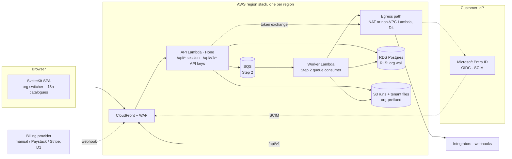

# Step 4: many catchments, many clients — a product

> **Status:** plan only, nothing built. Gate to start: **Step 3 → 4** in
> [README.md](./README.md#gates-between-steps): a second paying organisation, or
> a signed commercial decision. Read [README.md § Rules](./README.md#rules-every-step-plan-follows)
> first. Every work package here follows them.
>
> Other countries have their own plan: [international.md](./international.md).
> This file covers only the platform seams that plan needs
> ([§ International expansion](#international-expansion)).

## 1. Summary

Today one consultancy runs a few catchments in one deployment, and a "team"
is the widest grouping. Step 4 turns the app into a product that many
organisations buy: consultancies, catchment management agencies (CMAs),
irrigation boards and NGOs. Each organisation is a tenant, isolated by RLS,
with its own plan, seats, branding, SSO and API access. A new catchment goes
from nothing to a first calibrated run in hours, using national WR2012 and DWS
data. Climate and stochastic ensembles give reliability of supply, not just
one historical answer.

## 2. Users and jobs to be done

| User | Job to be done | Uses today | Would switch when |
| --- | --- | --- | --- |
| **Consultancy owner / principal hydrologist** | Run 5–30 catchment studies a year for different clients. Hand each client a report and keep the model. | b023 workbooks copied per catchment, WRSM2000/Pitman, Excel, email | Setup takes hours instead of days, results are defensible, and one plan covers the whole practice |
| **Org admin** (IT at a CMA or larger consultancy) | Control who gets in, meet security policy (Entra ID SSO, MFA), off-board leavers the same day | Entra ID for everything else; shared spreadsheets on SharePoint | SSO with Entra, enforced MFA, SCIM or JIT, an audit trail, a POPIA operator agreement |
| **Billing contact / finance** | Pay on a SARS-valid tax invoice, by EFT or card, against a PO | Supplier invoices by email | A clear plan, VAT-correct invoices, no surprise overage |
| **Integrator** (a CMA data team, another model, a dashboard vendor) | Pull runs and push series programmatically | CSV exports, screen scraping | A versioned OpenAPI, scoped keys, webhooks, stable limits |
| **Planning hydrologist** (DWS/CMA reconciliation studies) | Reliability of supply and yield under climate change and drought | WReMP / WRYM ensembles run by specialist consultants | Stochastic ensembles and drought replay in the same tool as the daily balance, with the assumptions visible |
| **Platform operator** (you) | Onboard tenants, support them without seeing data they didn't share, keep cost per tenant bounded | Nothing yet (one deployment, one client) | A console, metering, per-tenant limits, runbooks |
| **Farmer / WUA viewer** (Step 2 users, now inside a tenant) | Same as Step 2: see their farm | The app (Step 2) | Nothing changes for them. They must stay free and unlimited on every plan |

## 3. Scope

**In scope**

- Organisations as tenants above teams and projects, with an RLS "org wall",
  and migration from today's teams.
- Per-tenant settings and branding. Support access by grant, never
  impersonation.
- Plans, seats, catchment counts, trials, usage metering, invoices, SA VAT.
- MFA (TOTP + recovery codes), SSO with Microsoft Entra ID (OIDC), JIT
  provisioning, then SCIM.
- Fast onboarding: WR2012 quaternary data, DWS gauge records, a guided setup,
  templates, an onboarding tour.
- Climate scaling, drought replay, stochastic sequences, ensemble reliability.
- The runoff module as an alternative flow generator (model.md §5).
- Public API `/v1`: OpenAPI, API keys, OAuth client credentials, rate limits,
  versioning, webhooks.
- Run storage in S3 (compressed), lifecycle policy, cost model.
- i18n infrastructure beyond Afrikaans, unit preferences, multi-region seams,
  tenant region pinning.
- Data governance: operator agreement / DPA, tenant export and deletion,
  retention, sub-processor list.
- Operations: SLOs, staff console, abuse limits, per-tenant cost controls.
- Excel round-trip to b023-compatible workbooks.

**Out of scope**

| Item | Where |
| --- | --- |
| Country research, legal regimes, engine generalisation (water year, ET0/FAO-56, EWR methods), global data sources, RTL, a second region going live | [international.md](./international.md) |
| Background job queue (SQS + in-process runner, `job` table) | Step 2 WP-2.8 ([step-2-shared-catchment.md](./step-2-shared-catchment.md)). Step 4 **reuses** it |
| Data feeds and scheduled fetchers (WP-2.10), per-project feed keys (WP-2.9), alerts (WP-2.13), farmer views (WP-2.6), Afrikaans strings (WP-2.5) | Step 2 |
| Maps, scenarios within a project | Step 3 ([step-3-licensing.md](./step-3-licensing.md)) |
| Audit log (WP-2.4), published baseline runs (WP-2.3), licence evidence packs (Step 3) | Steps 2–3 |
| SAML 2.0 | Leave room (`sso_connection.protocol`). Build only when a signed customer needs it (D7) |
| Custom vanity domains per tenant | Leave room (`organisation.settings.brand`). feohledger shows the cost: it couples SSO callbacks to DNS ([feohledger docs/white-label.md]) |
| Database-per-tenant or dedicated stacks | Not now (D3). An "enterprise dedicated stack" is a deployment of the same Terraform, not a code change |
| OAuth authorization-code flows for third-party apps acting as a user | Leave room in `api_client.kind` |
| Reseller / partner tenants | Not planned |

## 4. Prerequisites

- **Gate met.** A second paying organisation, or a signed commercial decision
  (README gate 3 → 4).
- **Steps 1–3 exit criteria met**, in particular:
  - Deployed to AWS (plan.md Phase 6), with the `production` environment and
    its required reviewer.
  - Step 2's **job queue** (WP-2.8: SQS in production, in-process locally) and its
    `job` table with status. WP-4.9, 4.10, 4.11, 4.12, 4.13 and 4.16 put work
    on it.
  - Step 2's **audit log** (WP-2.4). Org, SSO, billing and support-access events write
    to it.
  - Step 2's **scheduled fetchers** (WP-2.10, CHIRPS / DWS). They reach the
    internet from a Lambda outside the VPC with no DB access or secrets,
    handing data to the worker through SQS (see D4).
- **Decisions needed before starting** (Section 11): D1 seller entity and
  payment provider, D2 prices, D3 tenancy model, D4 egress from the VPC
  Lambdas, D5 WR2012 redistribution. D1 and D2 block WP-4.6 only; D3 blocks
  everything.
- **Legal:** counsel reviews the operator agreement / DPA template, terms of
  service and privacy notice before the first external tenant (WP-4.8).
- **Security sign-off:** per org policy, loop in the CISO / Security Analyst
  before SSO, MFA and billing go live. These change the trust boundary.

## 5. Architecture changes

What changes in the existing system:

| Area | Change | Touches |
| --- | --- | --- |
| Tenancy | New `organisation`, `organisation_member`. `team.organisation_id`, `project.organisation_id`. `app_project_role()` gains the org wall, so every existing policy inherits it (the same trick 002 used for teams) | `backend/migrations/002_teams.sql` (latest `app_project_role`), `backend/src/teams/*`, `backend/src/projects/access.ts`, `backend/src/invites/invites.ts` (`app_accept_invites`) |
| Session | `withUser(userId, fn)` becomes `withSession(ctx, fn)`, which also sets `app.auth_method` and `app.auth_org`. The JWT gains `amr` and `sso_org` claims. Still HS256 via jose in the `wm_session` cookie | `backend/src/db/tx.ts`, `backend/src/auth/session.ts`, `backend/src/auth/middleware.ts` |
| Auth | TOTP MFA, OIDC SSO (`openid-client`), SCIM 2.0 endpoints | `backend/src/auth/`, new `backend/src/sso/`, `backend/src/scim/` |
| Billing | `plan`, `subscription`, `billing_invoice`, `usage_event`. Entitlements are enforced in Postgres where they must hold under concurrency (catchment count) | new `backend/src/billing/` |
| Run storage | `run_series.values` moves to one compressed S3 object per run. The DB keeps metadata and summaries | `backend/src/runs/execute.ts`, `backend/src/runs/routes.ts`, `backend/src/export/*`, `backend/src/compare/routes.ts` |
| Engine | Scenario transforms, seeded stochastic generator, ensemble statistics, `bucket-v1` flow generator | `packages/engine/src/runoff/` (`flow.ts` went in engine 1.0.0), new `packages/engine/src/scenario/`, `packages/engine/src/flow/bucket.ts` |
| Public API | `/v1` sub-app with `@hono/zod-openapi`, API-client principal in RLS, webhooks on the queue | `backend/src/app.ts`, new `backend/src/v1/` |
| Frontend | Org switcher, org settings and billing pages, SSO/MFA pages, onboarding wizard and tour, i18n catalogues, unit preferences | `frontend/src/routes/+layout.svelte`, new `frontend/src/routes/orgs/`, `frontend/src/lib/format/number.ts` (hard-coded `'en-US'` today) |
| Infra | S3 runs bucket, SQS (Step 2), egress (D4), KMS key for app-level encryption, region-parameterised stack | `infra/*.tf`, `infra/variables.tf`, `infra/tests/guardrails.tftest.hcl` |
| Local | Keycloak (OIDC IdP), MinIO (S3), a billing mock, all in `docker-compose.yml`, each with `dev:<svc>:up/down/status/logs` | `docker-compose.yml`, root `package.json`, `scripts/check_root_scripts.mjs` |

**Why shared schema + RLS, not database-per-tenant (feohledger's model).**
feohledger gives each tenant its own database and guards engine construction
with an AST test ([feohledger docs/multi-tenancy.md]). That suits financial
data and hundreds of tenants with residency needs. Here, RLS is already the
isolation boundary (CLAUDE.md rule 1), tenants will number in the tens, and
per-tenant databases would multiply migrations, connections and cost on a
`db.t4g.micro`. The price is harder per-tenant restore (Risk R5). Residency is
handled with one stack per region, not per-tenant databases (WP-4.15). This is
decision D3.

## 6. Work packages

Build order. Sizes: **S** ≤ 3 days, **M** ≤ 2 weeks, **L** > 2 weeks. Total
is about **8–11 months for one developer**. Tracks A (tenancy, auth, billing:
4.1–4.8), B (compute and data: 4.9–4.13) and C (API and ops: 4.14–4.18) can
run in parallel after WP-4.1.

---

### WP-4.1 Organisations as tenants, and the org wall

- **Goal.** Every project and team belongs to exactly one organisation. Nobody
  sees anything in an organisation they don't belong to, enforced by RLS.
- **Changes**
  - *backend + migrations:* next free `NNN_organisations.sql` (expand), then a
    later `NNN_organisation_not_null.sql` (contract). New
    `backend/src/orgs/{routes,access}.ts`. `teams/routes.ts` and
    `projects/routes.ts` take an `organisationId` on create.
  - *frontend:* org switcher in `+layout.svelte`, `/orgs/[slug]` (members,
    teams, projects), `/teams` nested under the org.
  - *scripts:* `seed:examples` creates one synthetic org ("Example
    Consultancy") that owns the existing examples.
- **Data model**
  - `organisation(id, slug citext UNIQUE, name, region text NOT NULL DEFAULT
    <deployed region>, status org_status ('active','suspended','deleting'),
    settings jsonb, created_by, created_at)`.
  - `organisation_member(organisation_id, user_id, role org_role
    ('admin','member','billing','guest'), added_at, PK(org,user))`.
    `admin` = owner on every org project and manages the org. `member` = no
    implicit project access (teams and direct grants give it). `billing` = sees
    only billing. `guest` = an outside person added to one project or team
    (for example a client's engineer, or Step 2 farmers).
  - `team.organisation_id NOT NULL`, `project.organisation_id NOT NULL`, each
    with a covering index.
  - **Org wall:** redefine `app_project_role(p)` (starting from the 002
    definition) so it returns NULL unless `app_org_access(project.organisation_id)`
    holds. `app_org_access(o)` is true when the user is a non-`billing` member
    of `o`, the org is `active`, and the session meets the org's auth policy
    (WP-4.2 / 4.7: `require_sso`, `require_mfa`). Because every project policy
    goes through `app_has_role → app_project_role`, one redefinition covers
    `node`, `crop`, `crop_area`, `transfer`, `time_series`, `model_run`,
    `run_series` and anything Steps 2–3 added.
  - Triggers: `assert_same_org()` on `project` (a team-owned project's team
    has the same org) and on `team_member` / `project_member` insert (the user
    is a member of the org, or is added as `guest` in the same transaction).
    `project.organisation_id` is immutable: moving a project between orgs
    goes through export/import only.
  - Last-admin guard: a deferred constraint trigger, same pattern as
    `team_member_keep_admin`.
  - Policies: `organisation` SELECT for members; UPDATE/DELETE for admins.
    `organisation_member` SELECT for non-guest members (guests see only
    themselves); write for admins; anyone may leave.
  - `app_accept_invites()` (latest: 004) also creates the `guest` membership
    when the invitee isn't in the org.
- **Migration path from teams (expand/contract)**
  1. Expand: create the tables. Each existing `team` becomes an org with the
     same name. Its admins become org admins, its members org members, and the
     team is kept inside the org. Team-less projects go to a personal org
     "<display name>'s workspace" owned by their creator. Direct project
     members not in that org become `guest`.
  2. Ship code that always writes `organisation_id`.
  3. Contract: `SET NOT NULL`, and drop the team-less code paths.
  4. Before any production deploy of this, write the backfill as a
     dry-run-able SQL script and run it against a PITR restore copy.
- **API.** `POST /orgs`, `GET /orgs`, `GET/PATCH/DELETE /orgs/:id`,
  `GET/POST/PATCH/DELETE /orgs/:id/members`, `POST /orgs/:id/invites`.
  `POST /projects` and `POST /teams` require `organisationId`. Unknown or
  foreign org → 404, never 403.
- **UI.** Org switcher (remembers the last org per user). Empty state: "Create
  your organisation" on first sign-in. Guests see only their shared projects
  and no org directory. Phone: the switcher collapses into the menu.
- **Local-first.** Pure Postgres, nothing new.
- **Tests.** *DB/RLS:* cross-org invisibility for every project table, with a
  positive control (a member sees it). A direct `project_member` row whose
  user is not an org member grants nothing (insert it as `water` to simulate
  a bug). A `billing` member sees no project. A suspended org is invisible.
  Last-admin guard. Backfill test on a synthetic 002-shaped dataset. The
  catalogue guards (`backend/src/db/catalogue.db.test.ts`) stay green. *Unit:*
  route inventory includes `/orgs/*`. *e2e:* create org → invite a member →
  they see only that org. Switching org changes the project list. *axe:* org
  pages.
- **Docs.** data-model.md (entity diagram, Access control), api.md,
  architecture.md, security.md, ui.md.
- **Acceptance.** Every RLS test passes as `water_app`. A user in orgs A and B
  never sees B data while acting in A's pages, and never sees B data at all
  after leaving B. The backfill maps every existing team and project with no
  orphans.
- **Size.** L (≈ 3–4 weeks).
- **Depends on.** Steps 1–3 done. D3 decided.

### WP-4.2 Session context and MFA

> **Partly built (issue #282, 2026-10-01).** TOTP with recovery codes, the
> two-step sign-in, `amr` in the session JWT and the requirement for project
> owners, team admins and assessors exist now, without organisations: the
> check is at the route (`auth/stepUp.ts`, from the request's `amr`), not in
> RLS, and the tables are `user_totp`, `user_recovery_code`,
> `mfa_throttle` and `account_security_event` (144_mfa.sql;
> security.md § Two-step sign-in). Still to do here: `withSession` and
> `app.auth_mfa` in RLS, the per-organisation `require_mfa_for_admins`, and
> SSO.

- **Goal.** Admins must use a second factor. RLS knows how the session was
  authenticated.
- **Changes**
  - *backend:* `withSession({ userId, authMethod, mfa, ssoOrg }, fn)` in
    `backend/src/db/tx.ts` sets `app.current_user_id`, `app.auth_method`
    (`password`, `sso`), `app.auth_mfa` (bool) and `app.auth_org`, all
    transaction-local. `readSession` returns the context. The JWT adds
    `amr: ['pwd','otp']` and so on. New `backend/src/auth/mfa.ts`: RFC 6238
    TOTP, ±1 step, reject a reused step (`last_used_step`), 10 single-use
    recovery codes. Also: password change while signed in (security.md known
    gap).
  - *frontend:* `/account/security` (enrol with QR, recovery codes shown once,
    disable, sign out everywhere), and a `/login` second step.
- **Data model.** `user_mfa_factor(id, user_id, kind ('totp'), secret_enc
  bytea, last_used_step bigint, created_at)`; `user_recovery_code(user_id,
  code_hash bytea)`. RLS: owner rows only. Secrets are encrypted with AES-GCM
  under `APP_ENCRYPTION_KEY` (a sops secret in production; a committed
  dev-only placeholder that `check:env` pins as a placeholder).
  `organisation.settings.require_mfa_for_admins` (default `true` on paid
  plans). `app_org_access()` refuses admin-level roles when the org requires
  MFA and `app.auth_mfa` is false.
- **API.** `POST /auth/login` returns `200 { mfaRequired: true }` plus a
  5-minute signed challenge cookie when a factor exists.
  `POST /auth/mfa/verify { code }` issues the session.
  `POST /auth/mfa/totp/enrol`, `POST /auth/mfa/totp/confirm`,
  `DELETE /auth/mfa/totp` (needs a fresh code), `POST /auth/password`.
- **UI.** Clear states for "code wrong", "locked for N min" and "use a
  recovery code". Admins without MFA in an MFA-requiring org see a blocking
  "Set up two-step sign-in" page, not a silent 404.
- **Local-first.** TOTP needs no service. Tests use a fixed secret and
  clock.
- **Tests.** *Unit:* TOTP vectors from RFC 6238 Appendix B, step reuse,
  clock skew. *DB/RLS:* an admin with a password-only session can't
  administer an MFA-required org (positive control: with MFA). Brute-force
  throttle on `/auth/mfa/verify` (reuse the `login_throttle` pattern keyed by
  user id). *e2e:* enrol → sign out → sign in with a code → use a recovery
  code. *axe.*
- **Docs.** security.md § Authentication, api.md § Auth.
- **Acceptance.** 5 wrong codes lock the challenge. A recovery code works
  once. Disabling MFA needs a current code. Every existing session test still
  passes.
- **Size.** M.
- **Depends on.** WP-4.1.

### WP-4.3 Tenant settings and branding

- **Goal.** A tenant sets its name, logo, accent colour, default units and
  locale, report header and email sender name. The app and its emails and
  reports show them.
- **Changes**
  - *backend:* `PATCH /orgs/:id/settings` (zod schema). Logo upload is a PNG
    or JPEG only, ≤ 256 KB. It is re-encoded server-side and stored in S3 at
    `orgs/<org>/brand/logo.png`. No SVG (it is a script-bearing format).
    `backend/src/mail/templates.ts` takes a brand block: display name in
    `From`, escaped like every other user value.
  - *frontend:* `/orgs/[slug]/settings`. The accent colour applies as CSS
    custom properties, and is **rejected if it fails 4.5:1 contrast** against
    the text tokens (reuse the Phase 7 contrast test).
- **Data model.** `organisation.settings.brand {displayName, accent,
  logoKey}`, `settings.defaults {locale, units, waterYearStartMonth}`. No new
  table.
- **API.** `GET /orgs/:id/brand` (members), `PATCH` (admins),
  `PUT /orgs/:id/brand/logo`.
- **UI.** Live preview. A reset-to-default button. Guests see the host
  tenant's brand on shared projects.
- **Local-first.** MinIO in docker-compose (`dev:s3:up/down/status/logs`),
  `STORAGE=local` default pointing at it. WP-4.9 uses the same MinIO.
- **Tests.** *Unit:* contrast rejection, image re-encode strips metadata,
  mail escaping. *DB:* only admins write. *e2e + axe:* branded header.
- **Docs.** ui.md, security.md (upload handling), run-locally.md (MinIO).
- **Acceptance.** An SVG or a 5 MB file is refused. An inaccessible accent
  colour is refused with a message.
- **Size.** M.
- **Depends on.** WP-4.1.

### WP-4.4 Staff console and support access (no impersonation)

- **Goal.** The operator can run the platform (tenants, plans, usage, suspend)
  without reading tenant data. Reading a tenant's project needs that tenant's
  explicit, time-boxed grant.
- **Changes**
  - *backend:* `platform_staff(user_id, role ('support','admin'))`, managed
    only by migration/psql as `water`, never by the API. Staff routes under
    `/staff/*` call `SECURITY DEFINER` functions that return **metadata
    only**: org name, plan, counts, usage, storage bytes, last activity. No
    project names or series.
  - `support_grant(id, organisation_id, project_id NULL, staff_user_id,
    granted_by, expires_at ≤ 7 days, reason)`. `app_project_role` gives
    `viewer` (never editor) to that staff user while the grant is live and
    the session has MFA. Every grant and every staff read is written to the
    audit log (Step 2).
  - Staff always need MFA (WP-4.2).
  - **No "log in as".** It breaks the audit trail and POPIA accountability.
- **Data model.** As above. RLS: `support_grant` is created and revoked by
  org admins, and readable by admins and the staff member.
- **API.** `/staff/orgs`, `/staff/orgs/:id` (metadata),
  `POST /staff/orgs/:id/suspend`, `/orgs/:id/support-grants` (tenant side).
- **UI.** A `/staff` area (hidden unless staff). Tenant: "Give support access
  to this project for 72 h".
- **Local-first.** `pnpm staff:grant <email>` script for local dev.
- **Tests.** *DB/RLS:* staff see no project without a grant; with a live
  grant they see only that project, read-only (positive control). An expired
  grant sees nothing. The metadata functions leak no names (column-list
  assertion). *e2e:* grant → staff views → revoke → 404.
- **Docs.** security.md (new trust boundary), a new runbook
  `docs/ops/support.md`.
- **Acceptance.** `/audit/auth` passes. `persona-adversary` finds no path
  from staff to data without a grant.
- **Size.** M.
- **Depends on.** WP-4.1, WP-4.2, Step 2 audit log (WP-2.4).

### WP-4.5 Plans, entitlements, trials and metering

- **Goal.** Each org has one live subscription to a plan. Limits and features
  are enforced where they can't be raced.
- **Value metric.** **Catchments (projects) per org** first, editor seats
  second. **Viewers, guests and Step 2 farmers are always free and
  unlimited**, so a WUA never pays per farmer. Ensemble compute is metered.
- **Illustrative plan shape** (prices are D2; the client sets them):

  | Plan | Catchments | Editor seats | Features |
  | --- | --- | --- | --- |
  | Trial (30 days, no card) | 2 | 3 | Everything except API, SSO, ensembles > 50 members |
  | Practitioner | 3 | 2 | Scenarios, reports, stakeholder views |
  | Team | 15 | 10 | + API (read), ensembles, templates |
  | Agency | 50+ (contract) | 25+ | + SSO/SCIM, API write, webhooks, region choice, SLA |

- **Changes**
  - *backend:* `backend/src/billing/entitlements.ts` has
    `requireFeature(c, 'api')` middleware and `limits(org)`. The
    catchment-count limit is enforced in a `BEFORE INSERT` trigger on
    `project` that takes an advisory lock per org, so two parallel creates
    can't both pass. Seats are enforced on member add and invite accept.
    Over-limit returns `402 { error: 'plan_limit', limit, used }`.
  - A trial that ends becomes read-only (`subscription.status = 'expired'`
    → `app_org_access` allows viewer-level only). **Data is never deleted
    because a trial ended.** Deletion follows WP-4.8 retention.
  - *frontend:* a plan and usage page, and upgrade prompts at the limit.
- **Data model.** `plan(code PK, name, currency, price_monthly_minor,
  price_annual_minor, limits jsonb, features jsonb, trial_days, active)`:
  global, SELECT for all, written only by migrations or staff functions.
  `subscription(id, organisation_id, plan_code, status ('trialing','active',
  'past_due','expired','canceled'), seats, period_start, period_end,
  trial_end, external_ref)`, with a partial unique index "one live per org"
  (feohledger's `uq_subscription_one_live_per_org`).
  `usage_event(organisation_id, kind, qty, at)` for runs, job-seconds,
  API calls and storage bytes; monthly rollups in `usage_month`. RLS: org
  admins and `billing` read. Writes go only through `SECURITY DEFINER`
  functions.
- **API.** `GET /orgs/:id/subscription`, `GET /plans`,
  `POST /orgs/:id/subscription/change` (staff or provider-driven in v1).
- **UI.** Usage bars (catchments 12/15). A trial banner with days left. States
  for past-due and expired. The billing role sees only this page.
- **Local-first.** No provider needed: `BILLING_PROVIDER=manual` is the code
  default.
- **Tests.** *DB:* two concurrent project creates at limit−1 → exactly one
  succeeds. Expired trial → read works, write 403/404 (positive control:
  active). Viewers don't count as seats. *Unit:* the entitlement matrix per
  plan. *e2e:* hit the limit and see the prompt.
- **Docs.** New `docs/billing.md`, api.md, data-model.md.
- **Acceptance.** No plan limit can be bypassed through the API, including
  under parallel requests.
- **Size.** M.
- **Depends on.** WP-4.1, D2 (placeholders are fine to build against).

### WP-4.6 Billing, invoices and VAT

- **Goal.** Tenants get SARS-valid tax invoices and can pay. The provider is
  swappable.
- **The estate constraint.** feohledger bills through a pluggable adapter
  (`mock` default, `stripe_billing` live, `stripe-mock` locally, HMAC-verified
  and deduplicated webhooks; [feohledger backend/docs/billing.md]). Reuse that
  shape. But **Stripe does not onboard South African-registered businesses**
  ([Stripe global availability]). So the provider follows the seller entity
  (D1):
  - an SA seller uses **Paystack** (Stripe-owned; ZAR; local cards 2.9% + R1;
    recurring plans) or PayFast ([Paystack ZA pricing],
    [Paystack recurring charges]);
  - a non-SA seller uses Stripe Billing, and registers for SA VAT as a
    foreign supplier of electronic services once over the threshold
    ([SARS VAT-REG-02-G02]).
  - **Recommendation:** start with `manual` (in-app tax invoice, EFT against
    PO). That is how CMAs, WUAs and consultancies pay anyway. Add the card
    provider when self-serve sign-up matters.
- **VAT facts** (verify with a tax adviser before go-live):
  - Standard rate 15%.
  - Compulsory registration for SA vendors from **R2.3 million** taxable
    supplies in 12 months, from 1 April 2026 (was R1 million). Voluntary from
    R120,000 ([SARS threshold FAQ], [SARS Budget 2026 FAQ]).
  - Foreign e-service suppliers: R1 million under the SARS guide. The Budget
    2026 FAQ doesn't say whether that threshold also rose ([SARS
    VAT-REG-02-G02], [SARS Budget 2026 FAQ]).
  - Tax invoice content follows VAT Act s20: a full tax invoice above R5,000,
    with both parties' names, addresses and VAT numbers
    ([SARS tax invoice checklist]).
- **Changes**
  - *backend:* `backend/src/billing/provider.ts` interface (`manual`,
    `paystack` or `stripe`). `invoice.ts` renders a PDF (same renderer as
    Step 2 reports). Webhook route `/billing/webhook/:provider`
    (public allowlist): verify the HMAC over the raw body (Paystack:
    `x-paystack-signature`, HMAC-SHA512), deduplicate on the event id, and
    make it the **only** writer of payment status.
  - *frontend:* billing profile (legal name, address, VAT number), invoice
    list and download.
- **Data model.** `billing_profile(organisation_id PK, legal_name, address,
  vat_number, email)`. `billing_invoice(id, organisation_id, number UNIQUE
  from a sequence, issued_at, period, lines jsonb, subtotal_minor, vat_rate
  numeric, vat_minor, total_minor, currency, status ('issued','paid','void'),
  pdf_key)`. Money is integer minor units, never float. A trigger makes
  issued invoices immutable except `status`; voiding issues a credit note.
  `billing_event(provider, event_id, PK(provider,event_id), received_at)`.
  RLS: admins and `billing` read their org. Writes only via functions or the
  webhook.
- **API.** `GET /orgs/:id/invoices`, `GET /orgs/:id/invoices/:n.pdf`,
  `PUT /orgs/:id/billing-profile`, `POST /billing/webhook/:provider`.
- **UI.** Invoice list (empty: "No invoices yet"). Downloads. Past-due
  banner for admins only.
- **Local-first.** `manual` needs nothing. For a card provider, a local
  webhook-sink fixture replays signed synthetic events (`dev:billing:replay`).
  If Stripe is chosen, `stripe-mock` in docker-compose (the feohledger
  `stripe:up` pattern).
- **Tests.** *Unit:* VAT rounding per line and total, invoice numbering has
  no gaps, HMAC verify (good, bad, replay). *DB:* immutability trigger,
  deduplication. *e2e:* issue an invoice → download PDF → it shows every s20
  field.
- **Docs.** billing.md, security.md (webhook boundary), the sub-processor list
  (provider).
- **Acceptance.** A replayed or forged webhook changes nothing. An issued
  invoice can't be edited.
- **Size.** M (manual + one provider). +M for dunning and proration.
- **Depends on.** WP-4.5, D1, D2, counsel on terms.

### WP-4.7 SSO with Microsoft Entra ID (OIDC) and JIT provisioning

- **Goal.** An agency signs in with Entra ID. Its admin can require SSO for
  its org. Password accounts keep working everywhere else.
- **Design**
  - **One multi-tenant Entra app registration owned by the platform.** A
    customer admin grants consent once. There is no per-customer client
    secret to store. Validate the ID token issuer against the tenant's `tid`
    and pin the connection to that `tid`
    ([Microsoft identity platform: OIDC], [multi-tenant issuer validation]).
    A generic-OIDC connection with a per-org client secret (encrypted, as in
    WP-4.2) is the second provider.
  - Library: `openid-client` (panva, same author as `jose`). Authorization
    code + PKCE + nonce. `state`/nonce/verifier live in a 10-minute signed,
    httpOnly cookie, so no Redis (the app stays stateless).
    `redirect_uri = https://<site>/api/auth/sso/callback`. It is same-origin
    through CloudFront, so the callback sets `wm_session` directly.
  - **Coexistence with the jose session and passwords.** SSO ends in the same
    `issueSession()` with `amr: ['sso']` and `sso_org`. `app_user` stays
    global and email-unique. `password_hash` becomes nullable (expand) for
    SSO-only accounts. `/auth/login` refuses them with the same generic 401.
    A user may have both. **An org with `require_sso`** accepts only sessions
    whose `app.auth_org` is that org (`app_org_access`). A password session
    still reaches the user's other orgs. feohledger's `sso_only` flag shows
    the escape hatch: enforcement is ignored while the connection is disabled,
    so a broken IdP can't lock the admin out ([feohledger
    docs/authentication.md § SSO-only mode]).
  - **Account linking without takeover.** Match `(issuer, sub)` first. Else
    match the email to an existing `app_user` **only if** the email's domain
    is DNS-verified by this org. Else create the user. An IdP can never claim
    an address in a domain its org hasn't proven.
  - **JIT:** a first SSO sign-in creates `organisation_member` with the
    connection's `jit_role` (default `member`, never `admin`). Team mapping
    from Entra group claims is optional: `sso_group_map(connection,
    group_id, team_id)`.
  - **Home realm discovery:** `/login` asks for the email first. A verified
    SSO domain → "Continue with Microsoft". Otherwise the password field.
    This fixes the security.md "email-first sign-up" gap for SSO domains.
- **Data model.** `sso_connection(id, organisation_id, protocol ('oidc'),
  provider ('entra','generic'), entra_tenant_id, issuer, client_id,
  client_secret_enc, jit_role, enforce bool, enabled bool)`.
  `org_domain(organisation_id, domain citext UNIQUE, verify_token,
  verified_at)`, verified by a DNS TXT lookup. `user_identity(user_id,
  issuer, subject, organisation_id, last_login_at, UNIQUE(issuer,subject))`.
  RLS: admins manage their org's rows. The login path goes through `SECURITY
  DEFINER` lookups, like `app_login_attempt`.
- **API.** `POST /auth/discover { email }` → `{ method: 'password' | 'sso',
  ssoUrl? }` (same answer shape for unknown addresses).
  `GET /auth/sso/start?connection=…`, `GET /auth/sso/callback`,
  `/orgs/:id/sso` CRUD, `/orgs/:id/domains` + `POST …/verify`.
- **UI.** Org → Security: domain verification steps, the Entra consent link,
  a "test sign-in" button before enforcing, an enforce toggle with a warning.
  Error states: consent missing, wrong tenant, domain unverified.
- **Egress.** The token exchange and JWKS fetch call
  `login.microsoftonline.com`. The API Lambda has **no internet route**
  today (VPC endpoints only, deployment.md). This needs D4.
- **Local-first.** Keycloak in docker-compose (`dev:idp:up/down/status/logs`)
  with a committed synthetic realm export (users like
  `ada@example-agency.test`). `SSO_ENABLED=false` by default. The feohledger
  pattern: `backend/keycloak/realm-export.json`, `enable_keycloak_sso.py`
  ([feohledger sso-e2e.yml]). Entra-specific `tid` checks are unit-tested
  with jose-signed fixture tokens.
- **Tests.** *Unit:* issuer/`tid` mismatch, nonce replay, alg pinning
  (asymmetric only), expired state, and domain-unverified linking refused.
  *DB/RLS:* a `require_sso` org is invisible to a password session (positive
  control: SSO session). JIT never creates an admin. *e2e:*
  `e2e/sso.spec.ts` drives a real Keycloak login. A dedicated `sso-e2e` CI job
  with path filters, modelled on feohledger's `.github/workflows/sso-e2e.yml`.
  *axe:* login and settings.
- **Docs.** security.md, api.md, run-locally.md (Keycloak), a customer setup
  guide `docs/guides/entra-sso.md`.
- **Acceptance.** An Entra user from tenant X can't sign in to an org pinned
  to tenant Y. An admin can't lock themselves out by enforcing SSO without a
  successful test sign-in.
- **Size.** L (≈ 3 weeks).
- **Depends on.** WP-4.1, WP-4.2, D4.

### WP-4.8 Data governance: operator terms, export, deletion, retention

- **Goal.** A tenant can sign an operator agreement, export everything, and
  delete everything. The retention rules are written down and enforced.
- **Roles.** The tenant is the *responsible party* (POPIA) / *controller*
  (GDPR). The platform is the *operator* / *processor*. POPIA s20–21 require a
  written contract that obliges the operator to keep security measures and to
  report breaches ([POPIA s21], [Michalsons on operators]). GDPR Art 28 adds
  the sub-processor rules for EU tenants ([GDPR Art 28]).
- **Changes**
  - *docs/legal:* operator agreement / DPA template, terms, privacy notice
    (counsel review). `docs/sub-processors.md` plus a public
    `/legal/sub-processors` page, kept as one register in two forms
    (feohledger pattern, [feohledger docs/sub-processors.md]). Initial list:
    AWS (hosting, SES), the billing provider. Microsoft Entra is the tenant's
    own IdP, not our sub-processor. A records-of-processing file
    `docs/ropa.md`.
  - *backend:* `POST /orgs/:id/export` is a queue job that writes a zip to S3
    (`orgs/<org>/exports/…`, 24 h presigned link, auto-expired). It holds one
    `project.json` per catchment in the `import:project` format, series CSVs,
    run summaries, members, invoices and the audit log. It reuses
    `backend/src/export/*`.
  - `DELETE /orgs/:id` needs admin, MFA and typing the org name. It sets
    `status='deleting'` (invisible at once, via the org wall). After a 30-day
    grace a job hard-deletes the rows (cascade), the S3 prefix
    `orgs/<org>/`, and the billing-provider customer. Invoices are kept for
    the statutory period in a separate, minimal `billing_invoice` archive
    (D10). Backups age out with RDS PITR retention; the DPA states the number
    of days.
  - Retention defaults per plan: runs kept per project
    (`RUNS_KEPT_PER_PROJECT` becomes a plan limit), ensemble scratch 7 days,
    exports 1 day, audit log per D10.
  - Account deletion for users (plan.md Phase 7), which removes identities,
    MFA factors and memberships.
- **Data model.** `organisation.deletion_requested_at`, `legal_acceptance(
  organisation_id, document, version, accepted_by, accepted_at)`.
- **UI.** Org → Data: export (states: queued, ready, expired), delete (grace
  countdown, cancel). DPA acceptance at org creation for paid plans.
- **Local-first.** The jobs run on the in-process queue. MinIO holds exports.
- **Tests.** *DB:* a `deleting` org is invisible to everyone (positive
  control before). The hard delete leaves no row with that `organisation_id`
  in any table (a catalogue-driven test that lists every table with an org or
  project FK). *Integration:* the export → `import:project` round trip gives
  the same model document. *Audits:* `/audit/popia`,
  `/audit/data-export-completeness`, `/audit/account-deletion-completeness`,
  `/audit/third-party-data-flows`, `/audit/cookie-consent` (only the session
  cookie; no banner needed, confirm).
- **Docs.** security.md, data-model.md, the new legal docs.
- **Acceptance.** All five audits pass with no open findings. The deletion test
  covers every table the catalogue lists.
- **Size.** M.
- **Depends on.** WP-4.1, WP-4.9 (S3 prefix layout), Step 2 queue (WP-2.8).

### WP-4.9 Run storage in S3

- **Goal.** Run output arrays leave Postgres. The DB keeps metadata and
  summaries. Cost and restore time stay flat as tenants grow.
- **Design (driven by the cost model below)**
  - **One object per run**, not one per series:
    `orgs/<org>/projects/<project>/runs/<run>.wmrun`. The object is a JSON
    index (key, node, offset, length, sha256) followed by one **gzip block
    per series** of little-endian float64. Keep float64: runs must compare
    exactly, and float32 changes the numbers.
  - `GET …/runs/:runId/series` does an S3 **range GET** for one block and
    returns it with `Content-Encoding: gzip`, so the browser inflates it and
    the Lambda never decompresses. The same path works for MinIO.
  - Written by the run executor after the engine returns. The DB insert of
    `model_run` + `run_series` metadata commits only after the PUT succeeds.
    A failed commit leaves an orphan that the lifecycle rule removes.
- **Cost model** (af-south-1 list prices, Sept 2026, [AWS price list API]):
  - Standard storage $0.0274/GB-month. PUT $0.006 per 1,000. GET $0.004 per
    10,000.
  - Assume a run is about 3 MB compressed (an estimate; measure on the
    synthetic examples).
  - Example: 100 orgs × 10 catchments × 20 runs kept = 20,000 runs ≈ 60 GB ≈
    **$1.64/month**.
  - Writes at 30,000 runs/month: one object per run = 30,000 PUTs = **$0.18**.
    One object per series (100+ each) would be millions of PUTs, many times
    the storage bill. Hence one object per run.
  - **No IA/Glacier tiering.** Standard-IA and Glacier IR bill a 128 KB
    minimum object and add retrieval fees
    ([S3 Glacier storage classes]). Runs are recomputable and the working
    set is recent, so tiering saves cents and adds risk. The lifecycle rule
    *expires* instead.
- **Lifecycle policy.** Abort incomplete multipart uploads after 1 day.
  Expire `ensembles/scratch/` after 7 days and `exports/` after 1 day.
  Delete noncurrent versions after 7 days (versioning on, for accidental
  deletes). Run objects are deleted by the app when the per-project cap trims
  a run.
- **Changes**
  - *backend:* `backend/src/storage/{s3,local}.ts` (the first two storage
    users are WP-4.3 logos and this; the export job makes three, so extract
    then). `runs/execute.ts` writes the object. `runs/routes.ts`,
    `export/*` and `compare/routes.ts` read through one `readRunSeries()`.
  - *migrations:* expand: `run_series.values` nullable, add `storage
    ('db','s3')`, `byte_offset`, `byte_length`, `sha256`, and
    `model_run.object_key`. A backfill job moves old runs. Contract later:
    drop `values`.
  - *infra:* `infra/s3_runs.tf`: private bucket, SSE-KMS with a bucket key,
    versioning, the lifecycle above, a TLS-only bucket policy, an S3 gateway
    endpoint (free), and IAM scoped to `orgs/*` for the API and worker roles.
    Terraform tests assert the lifecycle rule and the public-access block.
- **Local-first.** MinIO (from WP-4.3). `RUN_STORAGE=db` stays the code
  default until the backfill has run, then `s3`→MinIO locally.
- **Tests.** *Unit:* encode/decode round trip is bit-exact for NaN, −0 and
  1e308. Range math. *DB:* RLS still gates metadata; an S3 key for another
  project can't be requested (the key comes only from the RLS-visible row).
  *Integration:* against MinIO. *e2e:* charts load the same values before
  and after the backfill (pin first). *Terraform:* lifecycle present.
- **Docs.** data-model.md § Time-series storage, deployment.md,
  infra/README.md § Cost.
- **Acceptance.** DB size per run drops by > 95%. A chart series request
  costs one range GET. Values are bit-identical to the DB copy.
- **Size.** M.
- **Depends on.** WP-4.1 (org prefix). Step 2 queue (WP-2.8) for the backfill.

### WP-4.10 Fast catchment onboarding

- **Goal.** A trained hydrologist sets up a typical catchment (≤ 15 farms,
  one gauge) to a first calibrated run in **≤ 4 hours** instead of days.
- **Data sources**
  - **WR2012** (Water Research Commission). Per quaternary catchment: area,
    MAP, evaporation zone, WRSM2000/Pitman parameters, **monthly naturalised
    flow**, rainfall. Downloads need a free registration
    ([WR2012 site], [WR2012 leaflet]). **The redistribution terms aren't
    published** (D5). Until the WRC agrees, the importer takes the files the
    user downloaded; the platform doesn't host a national copy.
  - **DWS verified daily flow** per gauging station from the Hydrological
    Services portal. Query limits are 20 years of daily data per request, so
    the fetcher chunks. About 680 active flow stations
    ([DWS verified data], [DWS station data example]).
- **Changes**
  - *scripts / backend:* `backend/src/onboarding/wr2012.ts` parses the
    quaternary spreadsheet and naturalised-flow file. The naturalised flow
    feeds the WR2012 check (model.md §2.10c) as a comparison, not a daily
    series: engine 0.10.0 removed the Pitman series kind and fallback
    (engine-audit P1), so a daily `pitman` input would have to be argued for
    again. MAP, area and A-pan feed
    `ProjectSettings`. Several quaternaries are summed by area.
    `backend/src/onboarding/dws.ts` is a job on Step 2's fetcher framework:
    it takes a station code, fetches in 20-year chunks, maps DWS quality codes
    to per-value quality flags (generalising Step 1 WP-1.32's `filled` mask into a `flags` array beside each `time_series` value array), and writes `observed_gauge`.
  - *frontend:* **guided setup wizard** `/projects/new/guided`: 1 pick
    quaternaries → 2 pick a gauge (nearby list) → 3 farms from a CSV
    template (planned-work "Spreadsheet templates") or from the map (Step 3)
    → 4 crops from the org's crop library → 5 EWR (the pragmatic monthly
    table, or import) → 6 run and calibrate (existing `CalibrationPanel`).
    Each step can be saved and resumed. Each step shows what is still
    missing.
  - **Templates:** `project_template(id, organisation_id, name, settings
    jsonb, crops jsonb, ewr jsonb)` saved from any project ("Save as
    template"). An org crop-factor library with regional defaults (synthetic
    examples in the repo; real regional tables are per-tenant data).
  - **Onboarding tour:** a first-login tour over the synthetic example
    catchment from `seed:examples`, 6–8 steps, built in-house (no
    third-party script under the CSP), dismissible, keyboard-accessible, and
    remembered per user.
- **What stays hydrologist service work** (the app speeds it up, never
  replaces it):
  - delineating farm sub-catchments and the network for complex catchments;
  - calibration sign-off, and choosing which observed record to trust
    (issue #1 is the pattern);
  - EWR / Reserve determination;
  - dam area–capacity surveys and water-use verification;
  - the transfer rules;
  - judging Pitman vs observed disagreement (model.md §2.10a);
  - licence evidence sign-off (Step 3).
  The consultancy can sell these as services on top of the tool.
- **Data model.** `project_template`, `crop_library(organisation_id, name,
  region, crop_factor double precision[12])`. RLS: org members read, admins
  and members write their org's rows. `app_user.settings.tour_done`.
- **API.** `POST /projects/:id/import/wr2012` (multipart ≤ 10 MB, parsed
  server-side as CSV/XLSX **values only**; see security),
  `POST /projects/:id/feeds/dws { station }`, `/orgs/:id/templates`,
  `/orgs/:id/crops`.
- **UI.** Wizard states: empty, parsing, parse error with the row/column,
  gauge fetch in progress (job status), partial data warning. Phone: wizard is
  usable but the network step suggests a desktop.
- **Local-first.** Committed **synthetic** WR2012-shaped and DWS-shaped
  fixture files. `DWS_BASE_URL` points at a local fixture server in dev
  (`dev:fixtures:up`). Nothing calls DWS unless configured.
- **Tests.** *Unit:* monthly→daily conversion conserves volume per month
  exactly. Multi-quaternary area weighting. DWS chunking across 20-year
  boundaries and leap days, under a skewed `TZ`. Quality-code mapping.
  *DB/RLS:* templates and the crop library per org (positive control).
  *e2e:* the guided wizard end to end on synthetic fixtures ends with a run.
  *axe:* every wizard step and the tour. A timed usability test with the
  hydrologist (see Validation).
- **Docs.** New `docs/onboarding.md`, model.md (WR2012 onboarding), ui.md,
  api.md.
- **Acceptance.** The synthetic fixture catchment goes from the wizard to a
  calibrated run in the e2e spec. A hydrologist hits the 4-hour target on a
  real (not committed) catchment.
- **Size.** L (≈ 4 weeks).
- **Depends on.** WP-4.1, Step 2 fetchers and data-quality flags, D5.

### WP-4.11 Climate and stochastic scenarios

- **Goal.** Answer "how reliable is supply?" and "what if rainfall drops
  10%?" with ensembles, not one historical run.
- **Engine** (pure; bumps `ENGINE_VERSION`; new model.md section).
  `packages/engine/src/scenario/`:
  - `scaleRainfall(series, factorsByMonth)` and a seasonal shift.
  - `replayDrought(series, fromWaterYear, toWaterYear, atWaterYear)`
    splices a historical drought sequence into another period.
  - `stochasticRain(series, { seed, members, years, method })`. The first
    method is **k-nearest-neighbour block bootstrap of whole water years**.
    It keeps the daily structure and needs no new physics. A parametric
    Markov-chain + gamma generator comes later, if the hydrologist wants it.
    The PRNG is seeded (xoshiro128**) inside the engine, never `Math.random`.
  - `ensembleStats(outputs[])`: reliability (% of member-years with demand
    met per farm), probability the EWR is met per month, storage exceedance
    curves, and p5/p50/p95 bands for chosen keys.
- **Backend.** `POST /projects/:id/ensembles { baseRunId?, transforms,
  members ≤ plan limit, seed }` puts a job on Step 2's queue. The worker runs
  members in chunks of 50. The engine takes tens of milliseconds per multi-decade run
  (architecture.md), so 500 members is seconds of CPU, **a fraction of a cent per ensemble** in
  Lambda (af-south-1 arm $0.00001768/GB-s, [AWS price list API]). Only the
  **statistics and bands** are stored (in the run object, WP-4.9), never
  every member. Members are reproducible from the seed.
- **Data model.** `ensemble(id, project_id, created_by, status, spec jsonb,
  seed bigint, members, engine_version, summary jsonb, object_key,
  job_id)`. Project-scoped RLS through `app_has_role` (viewer read, editor
  create), same-project trigger on `job_id` and base run.
- **UI.** Scenario builder (rainfall scaling per month, drought replay
  picker, stochastic members). Results: a reliability table per farm, the EWR
  probability heat map (reuse `EwrHeatmap`), fan charts (uPlot bands).
  States: queued, running (n/N members), failed, done. "Why is this
  different from the historical run?" help text.
- **Local-first.** In-process queue. Small ensembles also run in a Web Worker
  in the browser for preview (the engine already runs there).
- **Tests.** *Invariants:* scale factor 1 is bit-identical to the baseline.
  Every member closes its mass balance. Same seed gives the same result.
  Reliability is non-decreasing as the rainfall scale grows (property test).
  A `FUZZ_CASES=20000` soak. *Unit:* bootstrap keeps water-year boundaries
  (skewed `TZ`). *DB/RLS:* ensembles per project (positive control).
  *e2e:* create → job completes → charts render. *axe.*
- **Docs.** model.md (new section), api.md, ui.md, run-comparison.md (compare
  a scenario to the baseline).
- **Acceptance.** The hydrologist accepts the bootstrap method and the
  reliability definitions. A 500-member ensemble finishes in < 5 min end to
  end.
- **Size.** L (≈ 4 weeks).
- **Depends on.** WP-4.9, Step 2 queue (WP-2.8), Step 3 scenarios within a project.

### WP-4.12 The runoff module as an alternative flow generator

- **Goal.** A `bucket-v1` rainfall-runoff generator behind the same interface
  as the runoff model (model.md §5; first planned beside b023's recession
  routine, which engine 1.0.0 removed), selectable per project, **after
  its water balance closes**.
- **Engine.** `packages/engine/src/flow/bucket.ts`, `FlowGenerator = (rain,
  params, topology) → naturalFlowPerNode`. Its water balance must close
  first:
  - every millimetre of effective rain is tracked;
  - drainage is limited by the store (it can't create water);
  - every parameter is used or dropped;
  - the outlet comes from `buildTopology`, never hard-coded.
  Per-unit rain
  gauges (P3) and per-unit calibration multipliers (P5).
  `ProjectSettings.flowGenerator: 'b023-recession' | 'bucket-v1'` (default
  unchanged). Bumps `ENGINE_VERSION`. (Since written, the seam has landed as
  the `RunoffModel` interface in `packages/engine/src/runoff/` and
  `settings.runoffModel`, `'gr4j'` only since engine 1.0.0 removed
  `'legacy'`; the bucket model becomes a second `runoffModel` value.)
- **Data model.** `hydro_unit(id, project_id, node_id, name, area_km2,
  map_mm, params jsonb)`, `hydro_unit_gauge(unit_id, series_id, weight)`.
  RLS through `app_has_role`. Same-project triggers on `node_id` and
  `series_id`. Covering indexes.
- **UI.** Settings → Flow generator. A hydrological-units table. The annual
  water-balance table (P2) in the Runs tab.
- **Local-first.** Pure engine.
- **Tests.** *Invariant:* per unit per day, rain = ET + quickflow +
  baseflow + Δstores within 1e-9 relative. Drainage ≤ store. No negative
  stores. A soak. *Regression:* a synthetic catchment. Calibration NSE/PBIAS
  reported against the synthetic observed series. *DB/RLS* for the two
  tables.
- **Docs.** model.md §5 rewritten as the specification, plan.md Phase 5.
- **Acceptance.** plan.md Phase 5: the hydrologist accepts the calibration
  for at least one real catchment, and the balance test passes.
- **Size.** L (≈ 3–5 weeks, mostly calibration with the hydrologist).
- **Depends on.** The hydrologist's time. Independent of tenancy, so it can
  start any time after Step 3.

### WP-4.13 Public API v1, API keys, OAuth clients, rate limits, webhooks

- **Goal.** Integrators read runs and series, and push series, through a
  documented, versioned, rate-limited API. Other systems get webhooks.
- **Design**
  - `/api/v1/*` is a separate Hono sub-app in `backend/src/v1/`, built with
    `@hono/zod-openapi`, so the spec is generated from the same zod schemas
    that validate. The internal session API stays as it is (no preemptive
    refactor).
  - **Principals.** `api_client` rows are org-scoped:
    - `kind 'key'`: `wm_live_<prefix>_<secret>`, stored as SHA-256 plus an
      indexed prefix and compared in constant time. This is the feohledger
      and SCIM pattern; bcrypt is wrong for 256-bit random tokens
      ([feohledger backend/docs/public-api.md]).
    - `kind 'oauth'`: client-credentials grant returning a 15-minute ES256
      JWT (jose) with JWKS at `/api/v1/.well-known/jwks.json`.
    Scopes: `runs:read`, `series:read`, `series:write`, `projects:read`.
    Optional `project_ids` allow-list. Step 2's per-project feed keys become
    a special case, migrated in.
  - **RLS stays the boundary.** `withApiClient(clientId, fn)` sets
    `app.current_api_client_id`. `app_project_role()` gains a branch: a live
    client of the project's org, with the project in its allow-list, gets
    `viewer` (read scopes) or `editor` (`series:write`). It never gets
    `owner`.
  - **Rate limits.** A per-client token bucket in Postgres
    (`api_rate(client_id, tokens, updated_at)`, row lock, the
    `login_throttle` pattern), per plan (e.g. 60/min Team, 600/min Agency).
    A WAF rate rule on `/api/v1/*` per IP as the outer layer. `429` with
    `Retry-After` and `RateLimit-*` headers.
  - **Versioning.** A major in the path. Additive changes only within v1.
    Removals get `Deprecation` and `Sunset` headers ([RFC 9745], [RFC 8594])
    and ≥ 6 months' notice.
  - **Webhooks.** `webhook_endpoint(id, organisation_id, url, secret_enc,
    events text[], active)`, `webhook_delivery(id, endpoint_id, event_id,
    type, payload jsonb, attempts, next_attempt_at, status, last_code)`.
    Events: `run.completed`, `ensemble.completed`, `series.updated`,
    `alert.fired` (Step 2). Signed per the Standard Webhooks spec
    (`webhook-id`, `webhook-timestamp`, `webhook-signature`, HMAC-SHA256)
    ([Standard Webhooks]). Delivered by the Step 2 queue: retries with
    backoff for 24 h, then dead. Payloads carry ids and summaries, not series.
    **SSRF guard:** https only, resolve and refuse private, link-local and
    metadata ranges, no redirects, 5 s timeout, 64 KB response cap. Needs
    egress (D4).
- **API.** `/api/v1/projects`, `/projects/{id}/runs`,
  `/runs/{id}/series?key&nodeId`, `PUT /projects/{id}/series/{kind}`,
  `/api/v1/openapi.json`. Management (session, org admin):
  `/orgs/:id/api-clients`, `/orgs/:id/webhooks`,
  `/orgs/:id/webhooks/:id/deliveries`, `POST …/redeliver`.
- **UI.** Org → Developers: create a key (secret shown once), scopes, project
  allow-list, usage, revoke. Webhooks with a delivery log and "send test". A
  static API docs page rendered from the spec, self-hosted (no third-party
  script under the CSP).
- **Local-first.** Webhooks deliver to a local sink container
  (`dev:webhooks:up`, a request-bin image) in dev. `WEBHOOKS_ENABLED=false`
  by default.
- **Tests.** *DB/RLS:* a key sees only its org and allow-list (positive
  control). A read-scoped key can't write. A revoked key → 401. *Unit:*
  signature vectors from the Standard Webhooks spec, SSRF refusal for
  127.0.0.1, 169.254.169.254, `[::1]`, and DNS rebinding (resolve once,
  connect to that IP). Token bucket under parallel calls. *Contract:* the
  generated spec validates (openapi 3.1) and every `/v1` route is in it.
  *e2e:* create key → curl-style call → webhook arrives at the sink.
  `/audit/auth`, `/audit/xss`, `persona-integrator`.
- **Docs.** api.md (point to the spec), new `docs/public-api.md`,
  security.md.
- **Acceptance.** The spec is published, and a generated client can list runs
  and upload a series. Rate limits hold under load. `persona-integrator` has
  no blocking findings.
- **Size.** L (≈ 4 weeks).
- **Depends on.** WP-4.1, WP-4.5 (plan gates), Step 2 queue, D4.

### WP-4.14 i18n infrastructure and unit preferences

- **Goal.** Any UI language can be added without code changes. Numbers,
  dates and units follow the user's preferences. The engine stays SI.
- **Changes**
  - *frontend:* message catalogues with **Paraglide JS** (compiled,
    tree-shaken, fits `check:bundle` and the static SPA). Extract all strings,
    including `frontend/src/lib/help/content.ts`. Replace the hard-coded
    `'en-US'` in `frontend/src/lib/format/number.ts` and the month helpers
    in `format/months.ts` with the user's locale. If Step 2 shipped Afrikaans
    strings, move them into the catalogues.
  - **Unit preferences** (planned-work): flows m³/day, ML/day, l/s, m³/s;
    annual volumes Mm³/a; areas km² or ha. The conversion is a
    display-layer module; exports label their units. The engine and the API
    stay m³/day and m³/s.
  - *backend:* email templates per locale (`backend/src/mail/templates.ts`),
    `Accept-Language` ignored in favour of the stored preference.
  - A CI guard: every key exists in every shipped catalogue, and no string
    literal in `.svelte` markup outside the catalogue (an allow-list for
    units and symbols).
- **Data model.** `app_user.settings {locale, units}`, org defaults from
  WP-4.3.
- **UI.** Settings → Language and units. A pseudo-locale (`en-XA`, long
  accented strings) for layout testing.
- **Local-first.** Nothing external.
- **Tests.** *Unit:* conversions round-trip. Formatting under `af-ZA`,
  `en-ZA`, `de-DE` (decimal comma), `fr-FR`. *e2e:* the pseudo-locale shows
  no clipped labels on the main pages. `persona-international-user`. *axe:*
  `lang` attribute set.
- **Docs.** ui.md, a contributor guide for translations.
- **Acceptance.** Adding a language is a catalogue file plus a list entry.
  The international-user persona finds no hard-coded format.
- **Size.** M.
- **Depends on.** Nothing in Step 4. Can run early.

### WP-4.15 Multi-region seams and tenant region pinning

- **Goal.** A tenant's data lives in exactly one region, and the code and
  Terraform can deploy a second regional stack without a rewrite. Going live
  in a second region is [international.md](./international.md)'s decision.
- **Design.** **One independent stack per region** (its own RDS, S3, SES,
  Lambdas and domain, e.g. `za.` / `eu.`), not a global database. No personal
  data crosses regions. A person in two regions has two accounts. A global
  directory for login routing is left for later ("leave room": `POST
  /auth/discover` can return `{ region, url }`).
- **Changes**
  - *backend:* `DEPLOYED_REGION` env. `organisation.region` is set at
    creation and immutable. The backend **refuses** (not just warns, unlike
    feohledger's advisory `check_residency_alignment`,
    [feohledger docs/data-residency.md]) to serve an org whose region isn't
    the deployed one, and a DB check constraint pins new orgs to the deployed
    region.
  - *infra:* parameterise the stack by region: `infra/regions/<region>.tfvars`
    and separate state keys. Guardrail tests that every regional resource
    takes `aws_region`. CloudFront, ACM and WAF stay in us-east-1 per stack.
  - *CI:* the deploy workflows take a region matrix, each through the
    `production` environment (or `production-<region>` with the same
    required reviewer).
  - A tenant moving region = export (WP-4.8) + import into the other stack.
    That is an operator runbook, not a feature.
- **Local-first.** `DEPLOYED_REGION=local`.
- **Tests.** *DB:* an org with a foreign region is refused (positive control:
  matching region). *Terraform:* the plan for a second tfvars file passes
  with mocked providers. *Unit:* the discover response shape.
- **Docs.** deployment.md, infra/README.md, architecture.md.
- **Acceptance.** `terraform test` plans two regions. No code path reads a
  region other than `DEPLOYED_REGION`.
- **Size.** M (seams). Standing up a live second region is about M of
  operator work plus about $50/month idle (infra/README.md § Cost).
- **Depends on.** WP-4.1, WP-4.8.

### WP-4.16 SCIM 2.0 provisioning

- **Goal.** An agency's IdP creates, updates and deactivates users, so leavers
  lose access the day they leave.
- **Why after JIT.** JIT costs the customer nothing. Entra's automatic
  provisioning (SCIM) needs an Entra ID P1 or P2 licence on the customer
  side ([Entra provisioning planning]). Build SCIM when an Agency-plan
  customer asks.
- **Changes.** `backend/src/scim/`: `/scim/v2/Users` and `/Groups` (groups
  map to teams via `sso_group_map`), filter `userName eq`, PATCH
  `active:false` → remove org membership and revoke sessions (set
  `sessions_revoked_at`). Auth: a per-connection bearer token, SHA-256 at
  rest, shown once (the feohledger SCIM pattern, [feohledger
  docs/authentication.md § SCIM]). All SCIM routes are on the public
  allowlist behind the token.
- **Data model.** `sso_connection.scim_token_hash`, `scim_token_prefix`.
  SCIM writes go through `SECURITY DEFINER` functions scoped to the token's
  org.
- **Local-first.** Keycloak doesn't push SCIM. Use a scripted synthetic SCIM
  client in the tests (feohledger uses Authentik; add it only if a real push
  test proves necessary).
- **Tests.** Entra's SCIM validator cases, replayed as fixtures.
  Deactivation revokes an active session within one request. Cross-org:
  a token for org A can't touch org B users (positive control).
- **Docs.** security.md, `docs/guides/entra-sso.md`.
- **Acceptance.** Entra's provisioning "test connection" and a
  create/update/deactivate cycle pass against a staging stack.
- **Size.** M.
- **Depends on.** WP-4.7.

### WP-4.17 Operations: SLOs, abuse limits, per-tenant cost controls

- **Goal.** The operator knows when the platform is failing a tenant, and
  no tenant can run up the bill.
- **SLOs** (monthly; D8 decides whether to buy Multi-AZ):

  | SLI | Target | Needs |
  | --- | --- | --- |
  | API availability (non-5xx on `/api/*`) | 99.5% single-AZ; 99.9% only with Multi-AZ RDS | CloudFront + Lambda metrics |
  | Interactive run (`POST …/runs`) p95 | < 3 s | Lambda duration by route |
  | Job start latency p95 | < 60 s | queue age |
  | 500-member ensemble end to end | < 5 min | job timings |
  | Webhook delivery within 5 min | 99% | delivery table |

- **Abuse limits.** Per plan: catchments, series length (60,000 values,
  already), runs per day, ensembles per day, members per ensemble, API
  requests/min, exports per day, invites per day (anti-spam), trial sign-ups
  per IP per day. Enforced in Postgres (the throttle pattern) and the WAF.
- **Per-tenant cost controls.** `usage_event` (WP-4.5) records job-seconds,
  storage bytes and API calls. A daily per-org compute budget: over it,
  new jobs return `402 plan_limit` and the admin is emailed. A staff view of
  top tenants by cost. Reserved concurrency on the worker Lambda caps the
  blast radius. The account-level AWS budget stays (`budget_monthly_usd`).
- **Alarms** (added to `infra/alarms.tf`): queue age, DLQ depth > 0, webhook
  failure rate, SSO callback error rate, S3 4xx/5xx, RDS storage growth.
  Run `/audit/cost-controls`.
- **Support tooling.** The staff console (WP-4.4), per-tenant usage, audit
  log search, a status page (if hosted externally, it is a sub-processor).
- **Runbooks** (`docs/ops/`): suspend a tenant, restore **one** tenant's
  data from PITR (restore into a new instance, copy that org's rows with a
  tested script; rehearse once, Risk R5), rotate `APP_ENCRYPTION_KEY`, SSO
  outage at a customer, webhook storms, billing-provider outage.
- **Tests.** Throttle and budget tests (DB). Terraform tests for the alarms.
  A load test script (k6, local only) for the API rate limits.
- **Docs.** deployment.md, infra/README.md, the runbooks.
- **Acceptance.** `/audit/cost-controls` passes. A synthetic tenant firing
  ensembles in a loop is stopped by its budget without affecting others.
- **Size.** M.
- **Depends on.** WP-4.5, WP-4.11, WP-4.13.

### WP-4.18 Excel round-trip (b023-compatible workbooks)

- **Goal.** Users who still need Excel can export a project into a
  b023-layout workbook, and re-import an edited one.
- **Design**
  - The b023 template is client material and is **never committed**. A tenant
    admin uploads their blank b023 template once. It is stored at
    `orgs/<org>/templates/b023.xlsm` in S3.
  - Export runs **in the browser** in a Web Worker with SheetJS loaded from
    its official CDN tarball (never the npm `xlsx` package; STACK.md). It
    fills the input sheets: `[Network]`, `[Farm spec]`, `[Crop demand]`,
    `[Farm demand]`, `[Transfers]`, `[Flow data]` and the Cfg sheets. The
    server never parses or writes macro workbooks (security.md).
  - Keeping the VBA project: SheetJS can carry `vbaProject.bin` through
    (`bookVBA`). **Verify this in a spike before committing to `.xlsm`**;
    the fallback is `.xlsx` values plus the user pasting into their own
    template.
  - **Transfers don't round-trip exactly.** The app's structured rules
    replace b023's hand-written InOut formulas (model.md §2.6). Export writes
    the draw-from parameters and flags any rule the template can't express.
  - Results: an optional values-only results workbook (element sheets).
    Every exported workbook carries a notice: the engine version, and that
    Excel's recalculation **will differ** wherever
    [engine-audit.md](../engine-audit.md) replaced a workbook formula.
  - Import back uses the in-browser workbook importer (planned-work "Data")
    with a diff preview (reuse the engine's `diffInputs`) before saving.
- **Local-first.** Fully in the browser. Tests use a **synthetic** template
  with the same sheet and column layout, generated by a test helper.
- **Tests.** *Property:* export → import gives an identical model document
  for random synthetic projects (engine `testing/` generators). Formula
  injection: user names starting with `=` are written as text (the CSV
  defusing rule applies). *e2e:* export the synthetic template, re-import,
  "no changes". *axe* on the dialogs.
- **Docs.** ui.md, security.md (template upload), model.md §6 (what differs
  from Excel).
- **Acceptance.** The round trip is lossless for everything except transfers
  that are flagged. The hydrologist opens an exported workbook in Excel and
  it calculates.
- **Size.** L (≈ 3 weeks, plus a 2-day SheetJS VBA spike first).
- **Depends on.** The in-browser importer (Step 1 or 2), WP-4.3 (template
  upload to S3).

## International expansion

Country research, legal and data-residency regimes, engine generalisation
(water year, ET0/FAO-56 instead of A-pan, EWR methods), global data sources,
RTL and standing up more regions are in **[international.md](./international.md)**.
Step 4 provides the platform pieces that plan builds on:

- **Tenant region pinning and regional stacks.** WP-4.15.
- **i18n infrastructure, locale formatting and unit preferences.** WP-4.14.
  A new language is a catalogue file.
- **Per-tenant defaults** for locale, units and water-year start month.
  WP-4.3. The engine honours the water-year setting only once international.md's
  engine work lands.
- **Governance that works per jurisdiction.** An operator agreement / DPA
  template, a sub-processor register per region, export and deletion.
  WP-4.8.
- **Pluggable onboarding sources.** WP-4.10's WR2012 and DWS importers sit
  behind one `FlowSourceImporter` shape, so a country adds its own source.
  Extract the interface when the third source arrives (rule 9).

## 7. Security, privacy and compliance

- **New trust boundaries**
  - **Tenant ↔ tenant:** the org wall in RLS (WP-4.1). A cross-tenant leak is
    the worst outcome for this product. Every new table needs a cross-org RLS
    test with a positive control. `persona-adversary` runs against every WP
    that adds a principal.
  - **Customer IdP → us:** ID tokens (issuer and `tid` pinning, nonce, PKCE,
    asymmetric algorithms only), SCIM bearer tokens, domain verification
    before linking.
  - **Integrators → us:** API keys and OAuth clients as RLS principals,
    scopes, rate limits.
  - **Us → the internet:** webhooks and SSO calls need egress (D4). SSRF
    guard on every admin-supplied URL (webhooks, generic OIDC issuers).
    feohledger guards every admin-supplied SSO URL the same way
    ([feohledger docs/authentication.md]).
  - **Billing provider → us:** HMAC-verified, deduplicated webhooks as the
    only writer of payment status.
  - **Staff → tenant data:** only through time-boxed, read-only, audited
    support grants with MFA. No impersonation.
- **Secrets.** New: `APP_ENCRYPTION_KEY` (MFA secrets, generic-OIDC client
  secrets, webhook secrets), the Entra app client secret or certificate, the
  billing provider key and webhook secret. All in
  `infra-secrets/water-management/`, none in the repo. Committed dev values
  are placeholders the `check:env` guard pins.
- **Personal data (POPIA).** New: SSO identities, MFA factors, billing
  contacts, IP addresses in rate limits and the audit log. Farm owner names
  in tenant data were already possible (security.md). Each addition updates
  data-model.md, security.md and the export/deletion coverage in the same
  change. `compliance-drift.yml` flags misses.
- **Retention.** Runs by plan cap; exports 1 day; ensemble scratch 7 days;
  deleted orgs 30-day grace then purge; invoices kept for the tax period;
  the audit log per D10; backups per the RDS PITR window, stated in the DPA.
- **Cross-border.** One region per tenant (WP-4.15). For South African
  tenants, af-south-1 avoids a POPIA s72 transfer altogether
  (deployment.md § Region recommendation).
- **Uploads.** Logos are raster only and re-encoded. WR2012/DWS files are
  parsed as values (CSV / XLSX via a values-only reader in a sandboxed
  worker, size-capped). b023 templates are handled only in the browser.
- **Abuse cases.** Trial farming (many trials per person): trials per
  verified email domain and per IP. Invite spam: per-day caps. Webhook abuse
  as a scanner: the SSRF guard and a per-org endpoint cap. Ensemble abuse as
  free compute: per-plan member caps and budgets.
- **Liability.** The terms state that results are model outputs and need
  professional interpretation. Each tenant's reports carry the engine version
  and the tenant's own brand, so it is clear who issued them. Agree the
  wording with counsel (Step 2 already agreed wording with the client; extend
  it to third-party tenants).
- **Compliance process.** Per org policy: loop in the CISO / Security Analyst
  before WP-4.2, 4.4, 4.6, 4.7 and 4.13 go live. Run `/audit/all` and the
  five data audits before the first external tenant.

## 8. Cost and operations

**AWS cost deltas** (af-south-1; the idle baseline is ≈ $48–52/month,
infra/README.md § Cost):

| Item | $/month | Note |
| --- | --- | --- |
| S3 runs + tenant files | ~2 at 60 GB | WP-4.9 cost model |
| S3 requests | < 1 | one object per run |
| SQS | ~0 | 1 M requests/month free, then $0.476/M ([AWS price list API]) |
| Worker Lambda (ensembles, imports, exports) | < 5 | $0.00001768/GB-s arm |
| Egress for SSO / webhooks / fetchers (D4) | ~4 (NAT instance) to ~35+ (NAT gateway + data) | Or $0 with a non-VPC egress Lambda |
| KMS key for app encryption | 1 | |
| WAF rules for `/api/v1` | ~1–2 | |
| RDS growth | +15–30 when moving to t4g.small/medium | Run arrays leave the DB, so growth is mostly metadata |
| Multi-AZ RDS (only if 99.9% is promised, D8) | roughly doubles the DB line | |
| Second region (international.md) | +≈ 50 idle | a full stack |

**Other costs.** Billing provider fees (Paystack 2.9% + R1 per local card
transaction). Entra ID: none for us; SCIM needs P1 on the customer's side.
Counsel for the DPA and terms (one-off). An external status page, if used.

**Support load.** Expect onboarding help for each new tenant (first catchment
setup), SSO setup calls with agency IT, and invoice questions. Write
`docs/guides/` for the top three before the first external tenant. Decide who
answers (plan.md Q17 → D9).

**Runbooks.** Listed in WP-4.17. Each is rehearsed once on a staging stack
before the first external tenant.

## 9. Validation

Run before building (`/persona …`) and record each **Need verdict** here.

| Persona | Must conclude | Verdict |
| --- | --- | --- |
| `hydrologist` | The guided setup and WR2012/DWS import get a real catchment calibrated in ≤ 4 h. The ensemble method and reliability definitions are sound. The runoff module is worth offering | not yet run |
| `wua-manager` | Several catchments under one org, free farmer viewers, invoices a board can pay | not yet run |
| `licensing-authority` | Ensembles and scenarios are reproducible (seed, engine version) and hard to game | not yet run |
| `admin` | Org, SSO, MFA, SCIM, support grants and deletion are manageable without asking the operator | not yet run |
| `integrator` | The v1 API, keys, rate limits and webhooks are good enough to build on | not yet run |
| `adversary` | No cross-tenant path, no staff path without a grant, no SSRF, no billing forgery | not yet run |
| `data-subject` | Export and deletion are complete; retention is honest | not yet run |
| `international-user` | No hard-coded locale or unit | not yet run |
| `new-user` | The trial → first catchment path works without help | not yet run |

**Client questions**

1. Who sells: your SA company, the operator's entity, or a partner? (D1)
2. What would a consultancy, a WUA and a CMA pay per year? Anchor on the
   consulting days a catchment study costs today. (D2)
3. Which prospects need SSO with Entra ID, and do any need SAML or SCIM from
   day one? (D7)
4. May tenants' catchment data be used, anonymised, to improve templates and
   crop libraries? (Default: no.)
5. Do you have, or can you get, WRC permission to host WR2012 data for
   tenants? (D5)
6. Which services stay yours to sell on top of the tool (calibration
   sign-off, EWR, licence evidence)?
7. Who answers support, in which hours? (D9)

## 10. Exit criteria

"Product-ready" means all of these hold:

- **Tenancy.** ≥ 3 external organisations are live on paid plans or signed
  trials, each isolated by the org wall. Every cross-org RLS test (with
  positive controls) passes. `persona-adversary` has no open high findings.
- **Self-serve.** A new org can sign up, verify, start a trial, set up a
  catchment with the guided wizard, invite a colleague and receive an invoice
  without the operator's help.
- **Onboarding.** A hydrologist has set up at least one real catchment from
  WR2012 + DWS data to a calibrated run in ≤ 4 hours.
- **Identity.** Entra ID SSO is live for at least one tenant, with SSO
  enforcement and MFA required for admins. Password accounts keep working for
  everyone else.
- **Billing.** Plans and limits are enforced (including under parallel
  requests). Invoices meet SARS s20. The VAT position is signed off by a tax
  adviser.
- **Compute.** Runs are stored in S3 with the lifecycle policy. Ensembles run
  on the queue within the SLO. The engine invariants and a `FUZZ_CASES=20000`
  soak pass for every new generator.
- **API.** `/api/v1` has a published OpenAPI spec, keys and OAuth clients,
  rate limits and signed webhooks, and `persona-integrator` signs off.
- **Governance.** A DPA/operator agreement and a sub-processor list are
  published. Tenant export and deletion are proven complete by
  `/audit/data-export-completeness` and
  `/audit/account-deletion-completeness`. `/audit/popia` and `/audit/all`
  are clean.
- **Operations.** SLOs are measured on a dashboard for 30 days and met.
  Per-tenant budgets have stopped a synthetic runaway tenant. The runbooks
  are rehearsed, including a single-tenant restore.
- **International seams.** Two regions plan cleanly in `terraform test`.
  A pseudo-locale renders without clipping. (Going live abroad is
  international.md's exit, not this one.)
- **Excel.** A b023-layout export opens and calculates in Excel, and
  re-imports without changes.

## 11. Open decisions

| # | Decision | Options | Recommendation | Who decides |
| --- | --- | --- | --- | --- |
| D1 | **Seller entity and payment provider** | (a) client's SA company + Paystack/PayFast; (b) operator's non-SA entity + Stripe Billing, SA VAT as a foreign e-services supplier; (c) manual EFT invoicing first | (c) now, then (a) if the client is the seller. Stripe can't onboard an SA entity | Client + operator, with a tax adviser |
| D2 | **Prices and plan limits** | Per catchment; per editor seat; flat per org | Catchments as the main metric, editor seats second, viewers free | Client |
| D3 | **Tenancy model** | Shared schema + RLS org wall; database-per-tenant (feohledger); stack-per-tenant | Shared + RLS. Offer a dedicated stack to one large customer if ever needed | Operator (CISO consulted) |
| D4 | **Outbound internet from the VPC Lambdas** (SSO, webhooks, fetchers) | NAT gateway (~$33/month + data); NAT instance (~$4); a non-VPC egress Lambda fed by SQS (no NAT, more moving parts) | Reuse Step 2's pattern (WP-2.10: a non-VPC egress Lambda fed by SQS) for webhooks and fetchers; add a small NAT instance only for SSO token calls, which must run inline | Operator |
| D5 | **WR2012 data** | Users upload what they downloaded; platform hosts a national copy with WRC permission | Upload now; ask the WRC | Client asks the WRC |
| D6 | **Stochastic method** | kNN block bootstrap of water years; parametric Markov + gamma; both | Bootstrap first | Hydrologist |
| D7 | **SAML and SCIM timing** | Build with OIDC; build on first request | On first signed request | Operator, after client Q3 |
| D8 | **SLO level** | 99.5% single-AZ; 99.9% with Multi-AZ RDS | 99.5% until an Agency contract needs more | Client + operator |
| D9 | **Who supports tenants** | Client; operator; shared with hours | The client does domain support, the operator platform support | Client (plan.md Q17) |
| D10 | **Retention of audit logs and licence evidence vs deletion** | Delete everything with the org; keep evidence packs for N years in an archive | Keep only what law or a licence process requires, minimised, stated in the DPA | Counsel + client |
| D11 | **Excel format** | `.xlsm` into the tenant's template (if the SheetJS VBA spike works); `.xlsx` values only | Spike first, decide after | Operator |

## 12. Risks

| Risk | Likelihood | Impact | Mitigation |
| --- | --- | --- | --- |
| R1 **Cross-tenant data leak** through a policy that skips `app_has_role` or a new principal | Low–Med | Very high | One chokepoint (`app_project_role`) for all principals; cross-org tests with positive controls for every table; a catalogue test that every table with `project_id`/`organisation_id` has RLS; `/audit/auth`; persona-adversary each WP |
| R2 **SSO account takeover** via an IdP asserting someone else's email | Med | High | Link by email only for DNS-verified domains of that org; pin the Entra `tid`; JIT never grants admin |
| R3 **No payment rail** because Stripe excludes SA entities | High (if the SA client sells) | Med | Manual invoicing first; a Paystack adapter behind the feohledger-style interface |
| R4 **VAT mistakes** (thresholds changed April 2026; foreign-supplier rule unclear) | Med | Med | Tax adviser sign-off before the first invoice; VAT rate and registration stored as config, not code |
| R5 **Single-tenant restore is hard** in a shared database | Med | High | A tested copy-one-org script from a PITR restore; rehearse before the first external tenant; export (WP-4.8) as the tenant's own backup |
| R6 **Egress adds cost and attack surface** | High | Low–Med | D4; SSRF guard; separate egress role with no DB access where possible |
| R7 **WR2012 licensing blocks hosted data** | Med | Low | User uploads; importer works on their files |
| R8 **Scope and time** (18 WPs, one developer) | High | High | Tracks in parallel; SAML, SCIM and a second region only on demand; build WP-4.5/4.6 as manual first |
| R9 **Ensemble results misread** as forecasts | Med | Med | Clear labelling, seed and method on every chart, the hydrologist's wording in help |
| R10 **Runoff module never calibrates well enough** | Med | Low | Keep GR4J as the default (the b023 recession was removed in engine 1.0.0); the module ships only on the hydrologist's acceptance |
| R11 **Support load swamps the operator** | Med | Med | Guides for the top tasks, the tour, the guided wizard, D9 |
| R12 **Bus factor on auth/billing code** | Med | High | Reuse estate patterns (feohledger) so the design is familiar; docs per WP; the CISO reviews the trust boundaries |

## References

- [Stripe global availability](https://stripe.com/global) (SA not a supported
  business country); [Stripe alternatives for SA founders](https://www.vektorindex.com/blog/stripe-alternatives-for-south-africa)
- [Paystack ZA pricing](https://paystack.com/za/pricing),
  [Paystack recurring charges](https://paystack.com/docs/payments/recurring-charges/),
  [Paystack expands to South Africa (TechCrunch, 2021)](https://techcrunch.com/2021/05/06/paystack-expands-to-south-africa-seven-months-after-stripe-acquisition)
- [SARS: new VAT registration threshold FAQ](https://www.sars.gov.za/faq/what-is-the-new-threshold-for-vat-registration/),
  [SARS Budget 2026 FAQ](https://www.sars.gov.za/about/sars-tax-and-customs-system/budget/budget-2026-frequently-asked-questions/),
  [SARS VAT-REG-02-G02 foreign suppliers of electronic services](https://www.sars.gov.za/wp-content/uploads/Ops/Guides/VAT-REG-02-G02-Foreign-Suppliers-of-Electronic-Services-External-Guide.pdf),
  [SARS tax invoice checklist](https://www.sars.gov.za/wp-content/uploads/Docs/Government/Tax-Invoice-Checklist-Version-2-29032016.pdf)
- [POPIA s21](https://popia.co.za/section-21-security-measures-regarding-information-processed-by-operator/),
  [Michalsons on operator agreements](https://www.michalsons.com/focus-areas/privacy-and-data-protection/does-someone-else-process-your-personal-information),
  [GDPR Art 28](https://gdpr-info.eu/art-28-gdpr/)
- [Microsoft identity platform: OIDC](https://learn.microsoft.com/en-us/entra/identity-platform/v2-protocols-oidc),
  [multi-tenant apps and issuer validation](https://learn.microsoft.com/en-us/entra/identity-platform/howto-convert-app-to-be-multi-tenant),
  [Entra provisioning planning (P1/P2 licence)](https://learn.microsoft.com/en-us/entra/identity/app-provisioning/plan-auto-user-provisioning)
- [WR2012 site](https://waterresourceswr2012.co.za/),
  [WR2012 information leaflet](https://waterresourceswr2012.co.za/uploads/images/Information_Leaflet_WR2012_10Nov2016.pdf)
- [DWS verified data](https://www.dws.gov.za/hydrology/Verified/hymain.aspx),
  [DWS station data example](https://www.dws.gov.za/hydrology/Verified/HyDataSets.aspx?Station=D2H022)
- AWS price list API, af-south-1, fetched 2026-09-23
  (`pricing.us-east-1.amazonaws.com/offers/v1.0/aws/{AmazonS3,AWSQueueService,AWSLambda}/current/af-south-1/index.json`);
  [S3 pricing](https://aws.amazon.com/s3/pricing/),
  [S3 Glacier storage classes](https://aws.amazon.com/s3/storage-classes/glacier/)
- [Standard Webhooks](https://www.standardwebhooks.com/),
  [RFC 9745 Deprecation header](https://www.rfc-editor.org/rfc/rfc9745),
  [RFC 8594 Sunset header](https://www.rfc-editor.org/rfc/rfc8594)
- Estate: `../feohledger/docs/multi-tenancy.md`,
  `docs/authentication.md` (OIDC, SAML, SSO-only mode, SCIM),
  `docs/data-residency.md`, `docs/white-label.md`, `docs/sub-processors.md`,
  `backend/docs/billing.md`, `backend/docs/public-api.md`,
  `.github/workflows/sso-e2e.yml`, `.github/workflows/env-isolation.yml`

<!-- Reference-style link targets for the inline citations above. -->
[Stripe global availability]: https://stripe.com/global
[Paystack ZA pricing]: https://paystack.com/za/pricing
[Paystack recurring charges]: https://paystack.com/docs/payments/recurring-charges/
[SARS threshold FAQ]: https://www.sars.gov.za/faq/what-is-the-new-threshold-for-vat-registration/
[SARS Budget 2026 FAQ]: https://www.sars.gov.za/about/sars-tax-and-customs-system/budget/budget-2026-frequently-asked-questions/
[SARS VAT-REG-02-G02]: https://www.sars.gov.za/wp-content/uploads/Ops/Guides/VAT-REG-02-G02-Foreign-Suppliers-of-Electronic-Services-External-Guide.pdf
[SARS tax invoice checklist]: https://www.sars.gov.za/wp-content/uploads/Docs/Government/Tax-Invoice-Checklist-Version-2-29032016.pdf
[POPIA s21]: https://popia.co.za/section-21-security-measures-regarding-information-processed-by-operator/
[Michalsons on operators]: https://www.michalsons.com/focus-areas/privacy-and-data-protection/does-someone-else-process-your-personal-information
[GDPR Art 28]: https://gdpr-info.eu/art-28-gdpr/
[Microsoft identity platform: OIDC]: https://learn.microsoft.com/en-us/entra/identity-platform/v2-protocols-oidc
[multi-tenant issuer validation]: https://learn.microsoft.com/en-us/entra/identity-platform/howto-convert-app-to-be-multi-tenant
[Entra provisioning planning]: https://learn.microsoft.com/en-us/entra/identity/app-provisioning/plan-auto-user-provisioning
[WR2012 site]: https://waterresourceswr2012.co.za/
[WR2012 leaflet]: https://waterresourceswr2012.co.za/uploads/images/Information_Leaflet_WR2012_10Nov2016.pdf
[DWS verified data]: https://www.dws.gov.za/hydrology/Verified/hymain.aspx
[DWS station data example]: https://www.dws.gov.za/hydrology/Verified/HyDataSets.aspx?Station=D2H022
[AWS price list API]: https://aws.amazon.com/s3/pricing/
[S3 Glacier storage classes]: https://aws.amazon.com/s3/storage-classes/glacier/
[Standard Webhooks]: https://www.standardwebhooks.com/
[RFC 9745]: https://www.rfc-editor.org/rfc/rfc9745
[RFC 8594]: https://www.rfc-editor.org/rfc/rfc8594
[feohledger docs/multi-tenancy.md]: ../../../feohledger/docs/multi-tenancy.md
[feohledger docs/white-label.md]: ../../../feohledger/docs/white-label.md
[feohledger docs/data-residency.md]: ../../../feohledger/docs/data-residency.md
[feohledger docs/sub-processors.md]: ../../../feohledger/docs/sub-processors.md
[feohledger docs/authentication.md]: ../../../feohledger/docs/authentication.md
[feohledger docs/authentication.md § SSO-only mode]: ../../../feohledger/docs/authentication.md#sso-only-mode
[feohledger docs/authentication.md § SCIM]: ../../../feohledger/docs/authentication.md#scim-20-user-provisioning-from-okta--entra
[feohledger backend/docs/billing.md]: ../../../feohledger/backend/docs/billing.md
[feohledger backend/docs/public-api.md]: ../../../feohledger/backend/docs/public-api.md
[feohledger sso-e2e.yml]: ../../../feohledger/.github/workflows/sso-e2e.yml
